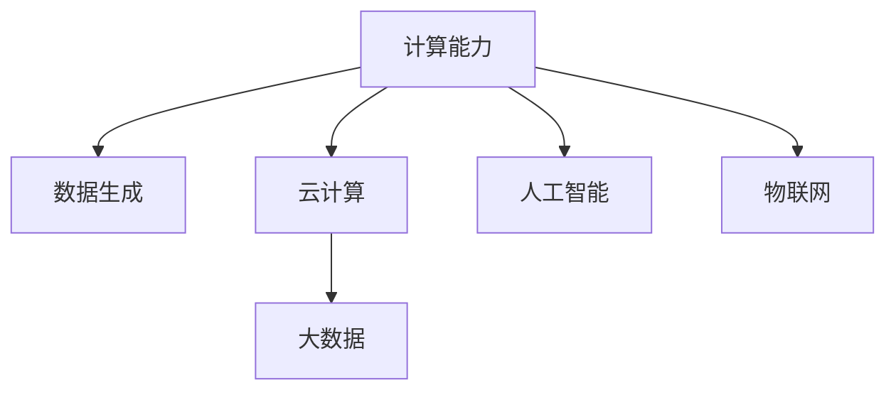

                 

# 连接全球智慧：人类计算的全球影响力

在信息技术高速发展的今天，人类计算已深刻改变了我们的生产方式、生活方式乃至思考方式。从超级计算机到云服务，从大数据到人工智能，计算能力正以前所未有的速度和规模释放，推动人类社会迈入全新的时代。本文将深入探讨人类计算的全球影响力，从技术原理、应用实践到未来趋势，全面解读计算如何连接全球智慧，重塑人类未来。

## 1. 背景介绍

### 1.1 问题的由来

随着互联网的普及和数据的爆炸式增长，人类社会的数据处理需求日益高涨。与此同时，计算能力也在不断提升，尤其是计算机硬件的性能持续突破，为大规模数据处理提供了可能。这一背景下，计算不再仅仅是一种技术手段，更成为连接全球智慧、推动社会进步的关键力量。

### 1.2 问题的核心关键点

人类计算的核心关键点在于：
- 数据的生成和流动：大规模数据生产及其在全球范围内的流动是计算的基础。
- 计算能力的提升：包括计算硬件的进步和计算算法的发展，支撑数据处理能力的提升。
- 应用的广泛性：从科学研究、企业决策到个人生活，计算无所不在。
- 隐私和安全问题：数据的大规模处理伴随着隐私和安全的挑战。

## 2. 核心概念与联系

### 2.1 核心概念概述

为更好地理解人类计算的影响力，本节将介绍几个关键概念：

- 计算能力(Computing Capability)：指硬件和软件共同构成的数据处理能力，包括计算速度、存储容量、并发处理能力等。
- 数据生成(Data Generation)：指全球范围内的数据产生，涵盖文本、图像、音频、视频等多种形式。
- 云计算(Cloud Computing)：通过互联网提供按需的计算资源和数据服务，实现资源的弹性扩展和高效利用。
- 大数据(Big Data)：指规模巨大、类型繁多、速度快速、价值密度低的数据集合，需通过先进的技术进行处理和分析。
- 人工智能(AI)：通过算法和计算能力，使计算机模拟人类智能行为的技术。
- 物联网(IoT)：将物理世界中的设备连接到互联网上，实现数据的自动采集和处理。

这些概念之间的逻辑关系可以通过以下Mermaid流程图来展示：



这个流程图展示了一些关键概念之间的逻辑关系：

1. 计算能力是数据处理的基础。
2. 数据生成为计算提供了处理对象。
3. 云计算和大数据技术支撑数据的高效处理和存储。
4. 人工智能通过计算和数据处理实现智能行为。
5. 物联网将物理世界与数字世界连接，促进数据生成。

## 3. 核心算法原理 & 具体操作步骤

### 3.1 算法原理概述

人类计算的核心算法原理包括：
- 分布式计算：将计算任务分解成多个子任务，并行处理。
- 并行计算：通过多核CPU、GPU等硬件并行处理，提升计算速度。
- 云计算服务：利用云基础设施，按需扩展计算资源。
- 大数据处理：通过分布式存储和并行计算，处理海量数据。
- 机器学习和深度学习：通过算法训练，让计算机具有智能行为。

### 3.2 算法步骤详解

具体步骤包括：
1. 数据采集：通过传感器、设备、网络等手段获取数据。
2. 数据存储：将数据存储在分布式数据库中。
3. 数据处理：使用大数据技术进行数据清洗、特征提取等处理。
4. 计算任务分配：将任务分配给多个计算节点并行处理。
5. 模型训练：使用机器学习和深度学习算法训练模型。
6. 模型部署：将训练好的模型部署到生产环境中。
7. 实时处理：对实时数据进行计算和处理。

### 3.3 算法优缺点

人类计算的优势包括：
- 高效性：并行计算和分布式处理提升了计算效率。
- 扩展性：云计算和大数据技术实现了资源的弹性扩展。
- 智能化：机器学习和深度学习提升了数据处理的智能化水平。

但同时存在一些挑战：
- 数据隐私和安全问题：大规模数据处理伴随着隐私和安全的挑战。
- 技术门槛高：需要掌握多种技术和工具。
- 数据质量问题：数据的准确性和完整性直接影响结果。

### 3.4 算法应用领域

人类计算技术广泛应用于以下领域：
- 科学研究：如基因组学、天文学、气象学等。
- 企业决策：如财务分析、供应链管理、市场预测等。
- 医疗健康：如疾病诊断、治疗方案、个性化医疗等。
- 金融服务：如风险评估、投资分析、反欺诈检测等。
- 社会治理：如公共安全、城市规划、智慧交通等。
- 日常生活：如智能家居、智能交通、智能推荐等。

## 4. 数学模型和公式 & 详细讲解

### 4.1 数学模型构建

假设我们有一个大数据集 $D=\{(x_i,y_i)\}_{i=1}^N$，其中 $x_i$ 为特征向量，$y_i$ 为标签。我们的目标是找到一个模型 $M$，使得 $M(x_i)$ 能够预测 $y_i$。

### 4.2 公式推导过程

常见的回归模型为线性回归，公式如下：
$$
y_i = \theta_0 + \sum_{j=1}^p \theta_j x_{ij}
$$
其中 $\theta_0$ 为截距，$\theta_j$ 为系数。

最小化均方误差损失函数：
$$
L(\theta) = \frac{1}{N} \sum_{i=1}^N (y_i - M(x_i))^2
$$

通过梯度下降等优化算法，求解得到 $\theta$。

### 4.3 案例分析与讲解

以预测股票价格为例，假设我们有 $N$ 个历史交易数据点，每个点包含日期和价格两个特征 $x_i$ 和 $y_i$。使用线性回归模型 $M(x_i) = \theta_0 + \sum_{j=1}^p \theta_j x_{ij}$ 来预测未来某一天的价格 $y_i$。训练集为 $(x,y)$，验证集为 $(x',y')$。通过最小化均方误差损失函数 $L(\theta)$，迭代优化 $\theta$ 直到收敛，得到预测模型 $M(x')$。

## 5. 项目实践：代码实例和详细解释说明

### 5.1 开发环境搭建

在进行计算项目实践前，我们需要准备好开发环境。以下是使用Python进行PyTorch开发的环境配置流程：

1. 安装Anaconda：从官网下载并安装Anaconda，用于创建独立的Python环境。

2. 创建并激活虚拟环境：
```bash
conda create -n pytorch-env python=3.8 
conda activate pytorch-env
```

3. 安装PyTorch：根据CUDA版本，从官网获取对应的安装命令。例如：
```bash
conda install pytorch torchvision torchaudio cudatoolkit=11.1 -c pytorch -c conda-forge
```

4. 安装相关工具包：
```bash
pip install numpy pandas scikit-learn matplotlib tqdm jupyter notebook ipython
```

完成上述步骤后，即可在`pytorch-env`环境中开始计算项目实践。

### 5.2 源代码详细实现

这里我们以一个简单的线性回归模型为例，展示如何使用PyTorch进行计算实践。

```python
import torch
import torch.nn as nn
import torch.optim as optim
import numpy as np

# 创建训练数据集
np.random.seed(1)
n_samples = 100
x = np.random.randn(n_samples, 1)
y = 2 * x + 1 + np.random.randn(n_samples, 1)

# 定义模型
class LinearRegression(nn.Module):
    def __init__(self):
        super(LinearRegression, self).__init__()
        self.linear = nn.Linear(1, 1)
    
    def forward(self, x):
        return self.linear(x)

# 定义损失函数和优化器
model = LinearRegression()
criterion = nn.MSELoss()
optimizer = optim.SGD(model.parameters(), lr=0.01)

# 训练模型
for epoch in range(1000):
    optimizer.zero_grad()
    outputs = model(x)
    loss = criterion(outputs, y)
    loss.backward()
    optimizer.step()
    
    if (epoch+1) % 100 == 0:
        print(f"Epoch {epoch+1}, loss: {loss.item():.4f}")
```

以上是使用PyTorch进行线性回归模型训练的完整代码实现。可以看到，使用PyTorch的简洁语法，以及丰富的神经网络库，可以方便地进行各种计算实践。

### 5.3 代码解读与分析

让我们再详细解读一下关键代码的实现细节：

**定义模型类**：
- `__init__`方法：定义模型的线性层，输入维度为1，输出维度也为1。
- `forward`方法：前向传播计算模型输出。

**定义损失函数和优化器**：
- `criterion`：使用均方误差损失函数。
- `optimizer`：使用随机梯度下降优化器，学习率为0.01。

**训练模型**：
- 循环迭代训练数据集，每次迭代计算损失函数并反向传播更新模型参数。
- 每100个epoch输出一次训练损失。

可以看到，使用PyTorch进行计算实践，可以方便地定义模型、损失函数和优化器，并通过简单的代码实现训练过程。

当然，在实际应用中，还需要考虑更多的优化策略，如数据增强、超参数调优、模型评估等。但核心的计算原理和流程与上述示例基本一致。

## 6. 实际应用场景

### 6.1 科学研究

计算技术在科学研究中扮演了重要角色，如基因组学、天文学、气象学等。通过超级计算机和云计算资源，科学家们可以进行大规模数据分析和模拟，发现新的科学规律和现象。例如，天文学家利用计算模拟宇宙大爆炸事件，预测黑洞运动轨迹，揭示暗物质本质。

### 6.2 企业决策

计算技术在企业决策中同样不可或缺。大数据和机器学习技术帮助企业分析市场趋势、预测用户行为、优化供应链管理，提升决策的科学性和准确性。例如，电商平台利用机器学习算法进行用户行为分析，实现个性化推荐，提升用户体验和销售额。

### 6.3 医疗健康

医疗健康领域是计算技术的重要应用场景。通过计算，医生可以分析病人的基因数据，制定个性化治疗方案；医疗机构可以预测流行病趋势，提前进行防控；保险行业可以分析用户健康数据，降低保险风险。例如，基因编辑技术CRISPR利用计算优化基因组编辑流程，实现更高效、更精准的基因治疗。

### 6.4 金融服务

金融服务领域也高度依赖计算技术。大数据和人工智能技术帮助金融机构进行风险评估、市场预测、反欺诈检测等，提升金融产品的安全性和竞争力。例如，量化交易算法利用计算分析市场数据，实现高频交易，获取超额收益。

### 6.5 社会治理

计算技术在社会治理中的应用也越来越广泛。通过物联网和云计算技术，城市管理者可以实时监测交通流量、环境质量、公共安全等数据，提升城市管理水平。例如，智能交通系统利用计算分析交通数据，优化交通信号灯设置，减少交通拥堵。

### 6.6 日常生活

计算技术已深刻渗透到我们的日常生活中。智能家居、智能推荐、智能客服等应用，通过计算技术提升了生活质量和效率。例如，智能音箱利用计算技术分析用户语音指令，实现智能交互，提供个性化服务。

## 7. 工具和资源推荐

### 7.1 学习资源推荐

为了帮助开发者系统掌握计算技术，这里推荐一些优质的学习资源：

1. 《深度学习》系列书籍：包括《深度学习》、《Python深度学习》等，全面介绍了深度学习和计算技术的基本原理和应用。

2. Coursera《机器学习》课程：由斯坦福大学Andrew Ng教授主讲，介绍了机器学习的基本概念和算法，适合初学者入门。

3. Kaggle竞赛：提供各种数据集和竞赛题目，通过实践提升数据处理和计算技能。

4. TensorFlow官方文档：介绍了TensorFlow框架的使用和开发，适合中高级开发者深入学习。

5. PyTorch官方文档：提供了丰富的计算实践和算法实现，适合学习PyTorch的使用。

通过这些学习资源，相信你一定能够快速掌握计算技术的精髓，并用于解决实际的计算问题。

### 7.2 开发工具推荐

高效的计算开发离不开优秀的工具支持。以下是几款用于计算开发常用的工具：

1. PyTorch：基于Python的开源深度学习框架，灵活动态的计算图，适合快速迭代研究。

2. TensorFlow：由Google主导开发的开源深度学习框架，生产部署方便，适合大规模工程应用。

3. Jupyter Notebook：用于数据科学和计算开发的交互式笔记本环境，支持Python、R等语言。

4. AWS EC2：亚马逊提供的云服务器，灵活扩展计算资源，支持大规模计算任务。

5. Google Cloud Platform：谷歌提供的云服务平台，提供丰富的计算资源和存储服务，适合大规模数据处理。

6. Apache Spark：分布式计算框架，支持大规模数据处理和机器学习。

合理利用这些工具，可以显著提升计算任务的开发效率，加快创新迭代的步伐。

### 7.3 相关论文推荐

计算技术的发展源于学界的持续研究。以下是几篇奠基性的相关论文，推荐阅读：

1. 《分布式深度学习》：阐述了分布式深度学习的基本原理和应用。

2. 《大规模在线学习》：介绍了大规模在线学习的基本原理和算法。

3. 《深度学习框架设计》：介绍了深度学习框架的设计和实现。

4. 《云计算技术》：介绍了云计算的基本原理和应用。

5. 《大数据处理技术》：介绍了大数据处理的基本原理和算法。

6. 《物联网技术》：介绍了物联网的基本原理和应用。

这些论文代表了大规模计算技术的发展脉络。通过学习这些前沿成果，可以帮助研究者把握学科前进方向，激发更多的创新灵感。

## 8. 总结：未来发展趋势与挑战

### 8.1 总结

本文对人类计算的影响力进行了全面系统的介绍。首先阐述了计算能力、数据生成、云计算、大数据、人工智能、物联网等关键概念，明确了计算对全球智慧的连接作用。其次，从技术原理、应用实践到未来趋势，详细讲解了计算如何推动科学研究、企业决策、医疗健康、金融服务、社会治理、日常生活等多个领域的进步。最后，推荐了一些学习资源、开发工具和相关论文，以期为读者提供全方位的技术指引。

通过本文的系统梳理，可以看到，计算技术已经成为连接全球智慧的关键力量，深刻改变了社会的各个方面。未来，伴随计算技术的持续演进，其影响力将进一步扩大，带来更多的机遇和挑战。

### 8.2 未来发展趋势

展望未来，计算技术的全球影响力将呈现以下几个发展趋势：

1. 计算能力将持续提升。随着计算硬件和算法的发展，计算能力将不断增强。未来，量子计算、神经形态计算等前沿技术将进一步提升计算效率。

2. 计算资源将更加普及。云计算和边缘计算的普及，使得计算资源更加可访问。计算将在更多的场景中得到应用，提升社会效率。

3. 计算算法将更加智能。机器学习和深度学习技术将进一步提升计算的智能化水平。未来，计算将能够模拟更复杂的行为和决策。

4. 计算将更加个性化。通过大数据和计算，实现对用户的精准分析和个性化服务。未来，计算将能够提供更加定制化的解决方案。

5. 计算将更加安全。计算技术的全球影响力带来更多的隐私和安全问题。未来，计算将更加注重数据隐私和安全保护。

6. 计算将更加协同。计算技术的发展将促进各领域的协同创新。未来，计算将能够整合更多的资源，实现跨领域的协作和创新。

以上趋势凸显了计算技术的全球影响力，这些方向的探索发展，必将进一步推动社会进步，带来更多的机遇和挑战。

### 8.3 面临的挑战

尽管计算技术已经取得了瞩目成就，但在迈向更加智能化、普适化应用的过程中，它仍面临着诸多挑战：

1. 数据隐私和安全问题。大规模数据处理伴随着隐私和安全的挑战。如何在数据使用和共享过程中保护隐私和数据安全，是一大难题。

2. 技术门槛高。计算技术涉及多种技术和工具，需要较高的技术门槛。如何降低技术门槛，普及计算技术，是重要的研究课题。

3. 数据质量问题。计算技术的性能和结果依赖于数据的质量。如何提高数据的质量和准确性，是一大挑战。

4. 计算资源分布不均。计算资源在地域和行业上的分布不均，导致计算应用的不均衡。如何实现资源的均衡分配，提升计算资源的利用率，是一大挑战。

5. 计算模型复杂性。计算模型的复杂性越来越高，需要更多的计算资源和时间进行训练和优化。如何降低计算模型的复杂性，提升模型的训练效率，是一大挑战。

6. 计算伦理和法律问题。计算技术的应用带来了伦理和法律问题，如隐私侵犯、算法偏见等。如何规范计算技术的应用，保障其伦理和法律合规，是一大挑战。

正视计算技术面临的这些挑战，积极应对并寻求突破，将是其走向成熟的必由之路。相信随着学界和产业界的共同努力，这些挑战终将一一被克服，计算技术必将在构建人机协同的智能时代中扮演越来越重要的角色。

### 8.4 研究展望

面对计算技术面临的挑战，未来的研究需要在以下几个方面寻求新的突破：

1. 探索更加高效和安全的计算范式。如量子计算、神经形态计算等前沿技术，提升计算效率和安全性。

2. 开发更加智能和个性化的计算模型。如深度强化学习、知识图谱等技术，提升计算的智能化和个性化水平。

3. 研究计算技术在多领域的应用。如医疗、金融、教育、能源等领域，推动计算技术在各行业的深入应用。

4. 构建更加协同和互联的计算生态。如计算、通信、物联网等技术融合，构建更加高效的计算生态。

5. 探索计算伦理和法律的规范。如数据隐私保护、算法透明性、伦理合规等，规范计算技术的应用。

这些研究方向的探索，必将引领计算技术迈向更高的台阶，为构建安全、可靠、可解释、可控的智能系统铺平道路。面向未来，计算技术还需要与其他人工智能技术进行更深入的融合，如知识表示、因果推理、强化学习等，多路径协同发力，共同推动自然语言理解和智能交互系统的进步。只有勇于创新、敢于突破，才能不断拓展计算技术的边界，让智能技术更好地造福人类社会。

## 9. 附录：常见问题与解答

**Q1：计算技术在科学研究中的应用有哪些？**

A: 计算技术在科学研究中的应用广泛，包括：

1. 基因组学：通过计算分析基因序列数据，揭示基因与疾病的关系，开发新药物。

2. 天文学：通过计算模拟宇宙大爆炸事件，预测黑洞运动轨迹，揭示暗物质本质。

3. 气象学：通过计算分析气象数据，预测天气变化，提升防灾减灾能力。

4. 地球物理学：通过计算分析地震数据，预测地震发生，提供预警服务。

5. 粒子物理学：通过计算模拟粒子碰撞实验，发现新物理规律，推动理论进步。

6. 天文学：通过计算分析宇宙数据，研究宇宙起源和演化。

**Q2：计算技术在企业决策中的应用有哪些？**

A: 计算技术在企业决策中的应用包括：

1. 市场预测：通过计算分析历史数据和市场趋势，预测未来市场变化，制定投资策略。

2. 客户分析：通过计算分析客户行为数据，识别客户需求和行为模式，提升客户满意度。

3. 供应链管理：通过计算分析供应链数据，优化库存管理和物流配送，降低成本。

4. 风险评估：通过计算分析金融数据，评估金融风险，制定风险控制策略。

5. 生产优化：通过计算分析生产数据，优化生产流程和设备运行，提升生产效率。

6. 营销策略：通过计算分析客户数据和市场数据，制定营销策略，提升销售额。

**Q3：计算技术在医疗健康中的应用有哪些？**

A: 计算技术在医疗健康中的应用包括：

1. 疾病诊断：通过计算分析病人基因数据和医学影像，诊断疾病，制定个性化治疗方案。

2. 治疗方案：通过计算分析临床数据，优化治疗方案，提高治疗效果。

3. 药物研发：通过计算分析药物数据，发现新药物，加速研发进程。

4. 健康监测：通过计算分析健康数据，监测病人健康状况，提供预警服务。

5. 公共卫生：通过计算分析疫情数据，预测疫情发展，制定防控措施。

6. 医疗管理：通过计算分析医疗数据，优化医疗资源分配，提升医疗服务质量。

**Q4：计算技术在金融服务中的应用有哪些？**

A: 计算技术在金融服务中的应用包括：

1. 风险评估：通过计算分析金融数据，评估金融风险，制定风险控制策略。

2. 市场预测：通过计算分析市场数据，预测市场变化，制定投资策略。

3. 反欺诈检测：通过计算分析交易数据，检测欺诈行为，提升交易安全。

4. 信用评估：通过计算分析客户数据，评估客户信用，制定信贷策略。

5. 量化交易：通过计算分析市场数据，实现高频交易，获取超额收益。

6. 财务分析：通过计算分析财务数据，分析企业财务状况，制定财务策略。

**Q5：计算技术在社会治理中的应用有哪些？**

A: 计算技术在社会治理中的应用包括：

1. 公共安全：通过计算分析视频数据，识别异常行为，提升公共安全。

2. 智慧交通：通过计算分析交通数据，优化交通信号灯设置，减少交通拥堵。

3. 环境监测：通过计算分析环境数据，监测环境质量，制定环保策略。

4. 智慧城市：通过计算分析城市数据，优化城市管理，提升城市智能化水平。

5. 灾害预警：通过计算分析气象和地质数据，预测灾害发生，提供预警服务。

6. 公共服务：通过计算分析用户数据，提供个性化服务，提升用户满意度。

**Q6：计算技术在日常生活中的应用有哪些？**

A: 计算技术在日常生活中的应用包括：

1. 智能家居：通过计算分析用户行为数据，实现智能控制，提升生活质量。

2. 智能推荐：通过计算分析用户行为数据，推荐商品和服务，提升用户体验。

3. 智能客服：通过计算分析用户语音和文本数据，实现智能交互，提升服务质量。

4. 智能出行：通过计算分析交通数据，优化出行路线，提升出行效率。

5. 智能医疗：通过计算分析健康数据，提供个性化医疗建议，提升健康管理水平。

6. 智能理财：通过计算分析财务数据，提供个性化理财建议，提升财务管理水平。

---

作者：禅与计算机程序设计艺术 / Zen and the Art of Computer Programming

