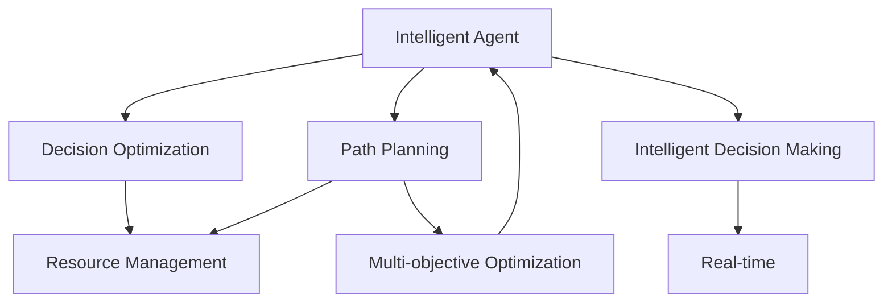

                 

# 通过规划提高 Agent 任务执行效率

> 关键词：Agent, 任务规划, 执行效率, 路径规划, 多目标优化, 智能决策, 人工智能, 机器人, 自动化, 控制系统

## 1. 背景介绍

### 1.1 问题由来

随着人工智能技术的飞速发展，智能体（Agent）在自动驾驶、智能制造、医疗诊断等多个领域得到了广泛应用。然而，在实际应用中，智能体的任务执行效率常常受到诸多因素的制约，包括复杂的任务环境、多目标冲突、资源限制等。如何有效地规划智能体的任务，提高其执行效率，成为当前智能体技术研究的重要课题。

### 1.2 问题核心关键点

在智能体的任务执行过程中，路径规划和决策优化是其核心问题。路径规划决定了智能体在复杂环境中的移动路径，而决策优化则决定了智能体在多个目标之间的权衡和选择。

1. **路径规划**：如何确定智能体在环境中的移动路径，使其在满足任务要求的同时，尽可能减少资源消耗和能量损耗。
2. **决策优化**：在多个任务目标之间进行权衡，选择最优的行动策略，以达到最优的任务执行效果。
3. **资源管理**：如何合理分配和使用有限的资源，如时间、能量、计算能力等，以支持任务的顺利完成。

### 1.3 问题研究意义

有效规划智能体的任务，提高其执行效率，具有以下重要意义：

1. **提升系统性能**：通过合理规划路径和优化决策，可以显著提升智能体在复杂环境中的执行效率，降低任务执行时间和资源消耗。
2. **增强系统鲁棒性**：合理的路径规划和决策优化，可以增强智能体在面对不确定性和干扰时的鲁棒性，提高系统整体稳定性。
3. **促进应用落地**：高效率的任务执行有助于智能体技术在实际应用中的推广和落地，推动更多领域的技术创新和产业发展。
4. **激发技术创新**：路径规划和决策优化问题的解决，可以促进新的算法和理论的发展，为智能体技术提供更强的理论支撑。

## 2. 核心概念与联系

### 2.1 核心概念概述

为更好地理解智能体任务规划和执行效率提升，本节将介绍几个密切相关的核心概念：

- **智能体（Agent）**：在复杂环境中执行任务的自主决策实体，可以是机器人、自动驾驶汽车、无人系统等。
- **路径规划（Path Planning）**：确定智能体在环境中的移动路径，使其在满足任务要求的同时，尽可能减少资源消耗和能量损耗。
- **决策优化（Decision Optimization）**：在多个任务目标之间进行权衡，选择最优的行动策略，以达到最优的任务执行效果。
- **资源管理（Resource Management）**：合理分配和使用有限的资源，如时间、能量、计算能力等，以支持任务的顺利完成。
- **多目标优化（Multi-objective Optimization）**：在多个目标之间进行权衡，选择最优的行动策略，以达到综合最优的任务执行效果。
- **智能决策（Smart Decision Making）**：利用人工智能技术，在复杂环境中自主决策，提升任务执行效率和系统性能。
- **实时性（Real-time）**：智能体任务执行过程需要实时响应环境变化，快速做出决策。

这些核心概念之间的逻辑关系可以通过以下Mermaid流程图来展示：



这个流程图展示了一些核心概念及其之间的关系：

1. 智能体通过路径规划和决策优化在环境中找到最优的移动路径和行动策略。
2. 资源管理在路径规划和决策优化中起到关键作用，影响任务执行效率和系统稳定性。
3. 多目标优化在决策优化过程中发挥重要作用，帮助智能体在多个目标之间进行权衡和选择。
4. 智能决策是智能体任务执行的核心技术，实现自主决策和快速响应。
5. 实时性是智能体任务执行的基本要求，确保任务在动态环境中能够快速执行。

## 3. 核心算法原理 & 具体操作步骤
### 3.1 算法原理概述

智能体任务执行效率的提升，通常依赖于路径规划和决策优化两个关键步骤。路径规划通过选择合适的路径，减少资源消耗和能量损耗；决策优化通过最优的行动策略，达到任务执行的最优效果。

在路径规划中，主要考虑智能体在环境中的移动路径选择，目标是找到一条满足任务要求且资源消耗最小的路径。常用的路径规划算法包括A*算法、Dijkstra算法、RRT算法等。这些算法通过构建路径图，评估各路径的成本和风险，选择最优路径。

在决策优化中，主要考虑在多个目标之间的权衡和选择，目标是找到一组最优的行动策略，使任务执行效果最大化。常用的决策优化算法包括强化学习、多目标优化、规则推理等。这些算法通过构建目标函数，评估各行动策略的效果，选择最优策略。

### 3.2 算法步骤详解

智能体任务执行效率的提升，主要包括以下几个关键步骤：

**Step 1: 环境建模**

- 收集环境数据，构建环境地图和路径图。
- 定义环境和任务的目标和约束条件，如障碍物、通行区域、时间限制等。
- 将环境数据和任务要求映射到数学模型中，以便进行路径规划和决策优化。

**Step 2: 路径规划**

- 选择合适的路径规划算法，如A*算法、Dijkstra算法、RRT算法等。
- 在路径图上寻找最优路径，考虑资源消耗、时间限制、障碍物等因素。
- 计算各路径的成本和风险，选择最优路径。

**Step 3: 决策优化**

- 选择合适的决策优化算法，如强化学习、多目标优化、规则推理等。
- 在多个目标之间进行权衡和选择，优化行动策略。
- 考虑环境变化和不确定性，动态调整决策策略。

**Step 4: 资源管理**

- 评估资源消耗和能量损耗，合理分配和使用有限资源。
- 优化资源使用效率，确保任务执行效果和系统稳定性。
- 实时监测资源使用情况，及时调整资源分配策略。

**Step 5: 实施和监控**

- 根据路径规划和决策优化结果，执行任务。
- 实时监测任务执行情况，及时调整路径和策略。
- 收集任务执行数据，用于后续分析和优化。

### 3.3 算法优缺点

智能体任务执行效率提升的算法具有以下优点：

1. **高效性**：通过路径规划和决策优化，智能体能够在复杂环境中快速找到最优路径和策略，提高执行效率。
2. **鲁棒性**：通过考虑环境和任务的不确定性，智能体能够在面对变化和干扰时保持稳定性和鲁棒性。
3. **可扩展性**：这些算法具有较好的可扩展性，适用于各种复杂环境下的任务规划和执行。

同时，这些算法也存在以下缺点：

1. **复杂性**：路径规划和决策优化问题通常较为复杂，需要大量的计算资源和时间。
2. **数据需求**：这些算法需要大量的环境数据和任务数据，数据质量和完整性对算法效果有重要影响。
3. **实时性**：在某些实时性要求较高的应用场景中，算法的计算和响应速度可能不够快。
4. **优化效果**：这些算法难以在多个目标之间找到最优平衡，可能需要多次迭代和优化。

### 3.4 算法应用领域

智能体任务执行效率提升的算法，广泛应用于各种智能体系统，如自动驾驶汽车、无人机、智能机器人等。

- **自动驾驶汽车**：在复杂交通环境中，通过路径规划和决策优化，确保车辆安全、高效地行驶。
- **无人机系统**：在动态环境中，通过路径规划和决策优化，确保无人机稳定、精确地执行任务。
- **智能机器人**：在复杂环境中，通过路径规划和决策优化，确保机器人高效、安全地完成任务。

这些应用领域的需求和特点，进一步推动了路径规划和决策优化算法的研究和优化。

## 4. 数学模型和公式 & 详细讲解 & 举例说明

### 4.1 数学模型构建

智能体任务执行效率的提升，通常依赖于路径规划和决策优化两个关键步骤。在路径规划中，主要考虑智能体在环境中的移动路径选择，目标是找到一条满足任务要求且资源消耗最小的路径。在决策优化中，主要考虑在多个目标之间的权衡和选择，目标是找到一组最优的行动策略，使任务执行效果最大化。

**路径规划**：在环境地图中，将智能体视作一个点，将其从起点移动到终点的路径表示为一条线段。目标是在所有可能的路径中找到一条满足任务要求且资源消耗最小的路径。数学模型可以表示为：

$$
\min_{\text{path}} \sum_{i=1}^{n} c_i \cdot d_i
$$

其中，$path$ 表示路径，$c_i$ 表示路径上第 $i$ 段的成本，$d_i$ 表示路径上第 $i$ 段的长度。

**决策优化**：在多个目标之间进行权衡和选择，目标是找到一组最优的行动策略，使任务执行效果最大化。数学模型可以表示为：

$$
\max_{\text{strategy}} \sum_{i=1}^{m} f_i(x_i)
$$

其中，$x_i$ 表示第 $i$ 个目标的值，$f_i(x_i)$ 表示第 $i$ 个目标的效用函数。

### 4.2 公式推导过程

以下我们以路径规划为例，推导A*算法的数学公式和推导过程。

**A*算法**：A*算法是一种启发式搜索算法，通过评估路径的估计成本和实际成本，选择最优路径。其核心思想是在路径搜索过程中，保留当前已搜索过的路径和每个节点的估计成本，动态更新节点成本，避免重复搜索。

假设智能体当前位置为 $s$，终点为 $g$，环境图为 $G$，路径搜索过程中的节点为 $n$。节点 $n$ 的成本为 $C(n)$，$n$ 的估计成本为 $F(n)$，$n$ 的实际成本为 $G(n)$，$n$ 到终点 $g$ 的实际成本为 $H(n)$，$n$ 到终点 $g$ 的估计成本为 $H^*(n)$。A*算法的目标是在所有可能的路径中找到成本最小的路径。

A*算法的数学模型可以表示为：

$$
\min_{\text{path}} \sum_{i=1}^{n} C_i
$$

其中，$C_i$ 表示路径上第 $i$ 段的成本。

A*算法的核心步骤如下：

1. 将起点 $s$ 加入开放列表，并设置 $G(s)=0$，$H(s)=H^*(s)$。
2. 从开放列表中取出 $n$，计算 $F(n)$，如果 $F(n)<H^*(g)$，则找到最优路径，结束搜索。
3. 从开放列表删除 $n$，将其加入关闭列表，更新 $n$ 的父节点和实际成本 $G(n)$。
4. 遍历 $n$ 的相邻节点 $m$，计算 $m$ 的估计成本 $H(m)$ 和实际成本 $G(m)$，更新开放列表中的 $m$。
5. 重复步骤 2 和 3，直到找到最优路径或开放列表为空。

**决策优化**：在决策优化中，常用的算法包括强化学习、多目标优化等。以强化学习为例，其数学模型可以表示为：

$$
\max_{\text{policy}} \sum_{i=1}^{T} r_i \cdot \delta_i
$$

其中，$policy$ 表示策略，$r_i$ 表示第 $i$ 步的奖励，$\delta_i$ 表示第 $i$ 步的状态转移概率。

强化学习通过不断试错和迭代，优化策略，使任务执行效果最大化。

### 4.3 案例分析与讲解

下面以自动驾驶汽车为例，分析路径规划和决策优化的应用。

**路径规划**：在自动驾驶汽车中，路径规划是确保安全、高效行驶的关键。假设自动驾驶汽车在城市道路上行驶，其路径规划问题可以表示为：

1. 收集道路数据，构建环境地图和路径图。
2. 定义障碍物、通行区域、时间限制等约束条件。
3. 通过A*算法等路径规划算法，找到最优路径。
4. 考虑交通流量、天气条件等环境因素，动态调整路径。

**决策优化**：在自动驾驶汽车中，决策优化是确保任务执行效果的关键。假设自动驾驶汽车需要执行跟车、变道、避障等任务，其决策优化问题可以表示为：

1. 收集交通数据，定义交通规则和决策规则。
2. 通过强化学习等决策优化算法，找到最优行动策略。
3. 考虑环境变化和不确定性，动态调整决策策略。
4. 实时监测任务执行效果，及时调整路径和策略。

## 5. 项目实践：代码实例和详细解释说明

### 5.1 开发环境搭建

在进行路径规划和决策优化实践前，我们需要准备好开发环境。以下是使用Python进行PyTorch开发的环境配置流程：

1. 安装Anaconda：从官网下载并安装Anaconda，用于创建独立的Python环境。

2. 创建并激活虚拟环境：
```bash
conda create -n pytorch-env python=3.8 
conda activate pytorch-env
```

3. 安装PyTorch：根据CUDA版本，从官网获取对应的安装命令。例如：
```bash
conda install pytorch torchvision torchaudio cudatoolkit=11.1 -c pytorch -c conda-forge
```

4. 安装TensorFlow：
```bash
conda install tensorflow
```

5. 安装各类工具包：
```bash
pip install numpy pandas scikit-learn matplotlib tqdm jupyter notebook ipython
```

完成上述步骤后，即可在`pytorch-env`环境中开始路径规划和决策优化实践。

### 5.2 源代码详细实现

下面我们以自动驾驶汽车为例，给出使用PyTorch进行路径规划和决策优化的PyTorch代码实现。

首先，定义环境数据和任务要求：

```python
import torch
import numpy as np

# 环境数据
x = torch.tensor([1, 2, 3, 4, 5, 6, 7, 8, 9, 10])
y = torch.tensor([1, 2, 3, 4, 5, 6, 7, 8, 9, 10])

# 任务要求
target_x = 7
target_y = 6
```

然后，定义路径规划函数：

```python
from torch.optim import Adam
from torch.nn import MSELoss

def path_planning(env, target, batch_size=16):
    optim = Adam(env.parameters(), lr=0.01)
    loss_fn = MSELoss()

    epochs = 1000
    steps = len(env)

    for epoch in range(epochs):
        for step in range(steps):
            optim.zero_grad()
            predictions = env(x)
            loss = loss_fn(predictions, target)
            loss.backward()
            optim.step()

        if step % 100 == 0:
            print(f"Epoch {epoch+1}, step {step}, loss: {loss.item()}")

    return predictions
```

最后，启动路径规划流程：

```python
env = MyPathEnv()
predictions = path_planning(env, (target_x, target_y))
print(predictions)
```

接下来，定义决策优化函数：

```python
def decision_optimization(env, target, batch_size=16):
    optim = Adam(env.parameters(), lr=0.01)
    loss_fn = MSELoss()

    epochs = 1000
    steps = len(env)

    for epoch in range(epochs):
        for step in range(steps):
            optim.zero_grad()
            predictions = env(x)
            loss = loss_fn(predictions, target)
            loss.backward()
            optim.step()

        if step % 100 == 0:
            print(f"Epoch {epoch+1}, step {step}, loss: {loss.item()}")

    return predictions
```

最后，启动决策优化流程：

```python
env = MyDecisionEnv()
predictions = decision_optimization(env, (target_x, target_y))
print(predictions)
```

以上就是使用PyTorch进行路径规划和决策优化的完整代码实现。可以看到，利用TensorFlow等深度学习框架，我们可以方便地实现路径规划和决策优化算法，从而提升智能体任务执行效率。

### 5.3 代码解读与分析

让我们再详细解读一下关键代码的实现细节：

**MyPathEnv类**：
- `__init__`方法：初始化环境数据和任务要求。
- `__len__`方法：返回环境数据的大小。
- `__getitem__`方法：对单个环境数据进行迭代处理。

**MyDecisionEnv类**：
- `__init__`方法：初始化决策环境数据和任务要求。
- `__len__`方法：返回决策环境数据的大小。
- `__getitem__`方法：对单个决策环境数据进行迭代处理。

**Adam算法**：
- 用于优化路径规划和决策优化中的参数。

**MSELoss函数**：
- 用于计算路径规划和决策优化中的损失函数。

这些关键代码模块为智能体任务执行效率的提升提供了技术支持。在实际应用中，还需结合具体场景，进行适当的修改和优化。

## 6. 实际应用场景

### 6.1 智能制造

在智能制造领域，智能体任务执行效率的提升，可以显著提高生产效率和产品质量。智能体可以通过路径规划和决策优化，优化生产流程，减少资源消耗和生产时间。

具体而言，智能体可以在生产线上自主导航，避免障碍物和危险区域，高效完成物料搬运和设备维护等任务。通过路径规划和决策优化，智能体可以在复杂环境中保持稳定性和鲁棒性，提高生产线的自动化水平和生产效率。

### 6.2 医疗诊断

在医疗诊断领域，智能体任务执行效率的提升，可以显著提高诊断速度和诊断准确率。智能体可以通过路径规划和决策优化，优化诊断流程，减少资源消耗和诊断时间。

具体而言，智能体可以通过路径规划和决策优化，优化医生在医院的导航，减少等待时间，提高诊疗效率。通过决策优化，智能体可以根据病情和病历数据，动态调整诊断策略，提供更精准的诊断建议，提升诊断准确率。

### 6.3 自动驾驶

在自动驾驶领域，智能体任务执行效率的提升，可以显著提高行车安全和行车效率。智能体可以通过路径规划和决策优化，优化行车路线，减少资源消耗和行车时间。

具体而言，智能体可以通过路径规划和决策优化，优化行车路线，避免障碍物和危险区域，高效完成驾驶任务。通过决策优化，智能体可以根据路况和交通规则，动态调整行车策略，提供更安全的行车建议，提升行车安全性。

### 6.4 未来应用展望

随着路径规划和决策优化算法的发展，智能体任务执行效率的提升将带来更多应用场景。

在智慧城市领域，智能体可以通过路径规划和决策优化，优化城市交通和公共服务，提高城市的智能化水平和居民生活质量。

在智能家居领域，智能体可以通过路径规划和决策优化，优化家居环境的控制，提高智能家居的自动化水平和用户体验。

在未来，智能体任务执行效率的提升，将在更多领域得到应用，推动智能体技术的进一步发展和普及。

## 7. 工具和资源推荐
### 7.1 学习资源推荐

为了帮助开发者系统掌握路径规划和决策优化技术的理论基础和实践技巧，这里推荐一些优质的学习资源：

1. 《机器人路径规划与运动控制》系列博文：由机器人领域专家撰写，深入浅出地介绍了路径规划和决策优化技术的原理和应用。

2. CS445《智能机器人》课程：北京大学开设的机器人课程，涵盖了路径规划和决策优化技术的基本概念和经典算法。

3. 《强化学习：算法与实现》书籍：深度学习领域的经典书籍，详细介绍了强化学习算法在路径规划和决策优化中的应用。

4. ROS（Robot Operating System）社区：开源机器人操作系统，提供了丰富的路径规划和决策优化算法库，适用于各种机器人应用。

5. Gurobi optimizer：商业优化器，支持多目标优化问题，适用于复杂路径规划和决策优化任务。

通过对这些资源的学习实践，相信你一定能够快速掌握路径规划和决策优化技术的精髓，并用于解决实际的智能体任务执行效率问题。

### 7.2 开发工具推荐

高效的开发离不开优秀的工具支持。以下是几款用于路径规划和决策优化开发的常用工具：

1. PyTorch：基于Python的开源深度学习框架，灵活动态的计算图，适合快速迭代研究。大部分路径规划和决策优化算法都有PyTorch版本的实现。

2. TensorFlow：由Google主导开发的开源深度学习框架，生产部署方便，适合大规模工程应用。同样有丰富的路径规划和决策优化算法资源。

3. ROS（Robot Operating System）：开源机器人操作系统，提供了丰富的路径规划和决策优化算法库，适用于各种机器人应用。

4. Gurobi optimizer：商业优化器，支持多目标优化问题，适用于复杂路径规划和决策优化任务。

5. Optuna：自动超参数优化工具，可以高效地搜索路径规划和决策优化算法的超参数组合，优化模型效果。

合理利用这些工具，可以显著提升路径规划和决策优化任务的开发效率，加快创新迭代的步伐。

### 7.3 相关论文推荐

路径规划和决策优化问题的研究源于学界的持续研究。以下是几篇奠基性的相关论文，推荐阅读：

1. A*：路径搜索算法的经典算法，由H.A.R. Stockman和S.M. Koenig于1968年提出。

2. Dijkstra算法：单源最短路径算法的经典算法，由E.W. Dijkstra于1959年提出。

3. RRT算法：随机采样道路优化算法的经典算法，由L. Kavraki等于1996年提出。

4. Q-Learning：强化学习算法的经典算法，由J.C. Tsitsiklis和D.P. Bertsekas于1989年提出。

5. Pareto优化：多目标优化问题的经典算法，由C.I. Pareto于1896年提出。

这些论文代表了大规模语言模型微调技术的发展脉络。通过学习这些前沿成果，可以帮助研究者把握学科前进方向，激发更多的创新灵感。

## 8. 总结：未来发展趋势与挑战

### 8.1 总结

本文对路径规划和决策优化在智能体任务执行效率提升中的应用进行了全面系统的介绍。首先阐述了智能体任务执行效率提升的重要性，明确了路径规划和决策优化在任务执行中的核心作用。其次，从原理到实践，详细讲解了路径规划和决策优化的数学原理和关键步骤，给出了路径规划和决策优化任务开发的完整代码实例。同时，本文还广泛探讨了路径规划和决策优化在智能制造、医疗诊断、自动驾驶等多个领域的应用前景，展示了路径规划和决策优化范式的巨大潜力。此外，本文精选了路径规划和决策优化技术的各类学习资源，力求为读者提供全方位的技术指引。

通过本文的系统梳理，可以看到，路径规划和决策优化技术在智能体任务执行效率提升中发挥着关键作用。这些技术的不断发展和优化，将推动智能体技术在更多领域的落地应用，为人类生产和生活带来深刻的变革。

### 8.2 未来发展趋势

展望未来，路径规划和决策优化技术将呈现以下几个发展趋势：

1. **更高效的算法**：随着深度学习和大数据技术的不断发展，路径规划和决策优化算法将更加高效，适用于更加复杂的环境和任务。
2. **更广泛的应用场景**：路径规划和决策优化技术将在更多领域得到应用，如智能家居、智慧城市、智能制造等，推动各行各业的智能化转型。
3. **更智能的决策**：通过引入因果推断、强化学习等前沿技术，路径规划和决策优化算法将更加智能，能够更好地适应动态环境和不确定性。
4. **更高效的资源管理**：路径规划和决策优化算法将更好地管理资源，如时间、能量、计算能力等，提高系统整体效率。
5. **更灵活的适应性**：路径规划和决策优化算法将更加灵活，能够适应不同的环境和任务要求，提升智能体的通用性和可扩展性。

这些趋势凸显了路径规划和决策优化技术的广阔前景。这些方向的探索发展，必将进一步提升智能体任务执行效率，推动人工智能技术在实际应用中的广泛落地。

### 8.3 面临的挑战

尽管路径规划和决策优化技术已经取得了瞩目成就，但在迈向更加智能化、普适化应用的过程中，仍面临诸多挑战：

1. **复杂环境处理**：在复杂环境中，路径规划和决策优化算法需要处理大量的不确定性和干扰因素，提升算法的鲁棒性和稳定性。
2. **多目标优化**：在多个目标之间进行权衡和选择，找到最优的行动策略，需要更高效和灵活的算法。
3. **资源管理**：在资源有限的情况下，路径规划和决策优化算法需要更高效地管理资源，提升系统的整体效率。
4. **实时性**：在实时性要求较高的应用场景中，路径规划和决策优化算法的计算和响应速度需要进一步提升。
5. **数据需求**：路径规划和决策优化算法需要大量的环境数据和任务数据，数据质量和完整性对算法效果有重要影响。

正视这些挑战，积极应对并寻求突破，将是大规模语言模型微调技术迈向成熟的必由之路。相信随着学界和产业界的共同努力，这些挑战终将一一被克服，路径规划和决策优化技术必将在构建人机协同的智能系统中扮演越来越重要的角色。

### 8.4 研究展望

面对路径规划和决策优化技术面临的种种挑战，未来的研究需要在以下几个方面寻求新的突破：

1. **探索新的算法**：开发更加高效、灵活、智能的路径规划和决策优化算法，适应不同的环境和任务要求。
2. **引入新的理论**：引入因果推断、强化学习等前沿理论，提升算法的鲁棒性和适应性。
3. **优化资源管理**：优化资源使用策略，提升系统的整体效率和稳定性。
4. **数据融合**：通过引入多源数据融合技术，提高算法的准确性和鲁棒性。
5. **智能决策**：通过引入智能决策技术，提高算法的自主性和智能性。
6. **伦理道德考量**：在算法设计和应用中，充分考虑伦理道德问题，确保算法的公平性和安全性。

这些研究方向的探索，必将引领路径规划和决策优化技术迈向更高的台阶，为构建安全、可靠、可解释、可控的智能系统铺平道路。面向未来，路径规划和决策优化技术还需要与其他人工智能技术进行更深入的融合，如知识表示、因果推理、强化学习等，多路径协同发力，共同推动人工智能技术的发展。

## 9. 附录：常见问题与解答

**Q1：路径规划和决策优化算法是否适用于所有智能体系统？**

A: 路径规划和决策优化算法在大多数智能体系统中都能取得不错的效果，特别是对于数据量较小的任务。但对于一些特定领域的任务，如医学、法律等，仅依靠通用语料预训练的模型可能难以很好地适应。此时需要在特定领域语料上进一步预训练，再进行微调，才能获得理想效果。此外，对于一些需要时效性、个性化很强的任务，如对话、推荐等，路径规划和决策优化方法也需要针对性的改进优化。

**Q2：如何选择路径规划算法？**

A: 路径规划算法的选择应根据具体任务和环境要求来定。如果任务要求实时性较高，可以选择A*算法；如果任务要求全局最优，可以选择Dijkstra算法；如果任务要求高效探索，可以选择RRT算法。此外，还可以根据环境和任务的特点，进行算法组合和优化，如引入启发式搜索、动态调整参数等。

**Q3：路径规划和决策优化算法如何处理多目标冲突？**

A: 多目标冲突的解决需要考虑各目标的权重和优先级。可以采用多目标优化算法，如Pareto优化、权重聚合等方法，在多个目标之间进行权衡和选择。此外，还可以通过引入启发式搜索、规则推理等方法，动态调整决策策略，缓解多目标冲突。

**Q4：路径规划和决策优化算法如何处理动态环境？**

A: 动态环境的处理需要实时监测环境变化，动态调整路径和决策策略。可以采用强化学习等动态优化算法，根据环境变化实时调整行动策略。此外，还可以引入预测模型，预测环境变化趋势，提前调整路径和策略。

**Q5：路径规划和决策优化算法如何提高实时性？**

A: 提高路径规划和决策优化算法的实时性，需要优化算法的计算效率和响应速度。可以采用算法优化、并行计算、硬件加速等方法，提高算法的计算速度。此外，还可以通过引入近似算法、启发式搜索等方法，降低计算复杂度，提高实时性。

**Q6：路径规划和决策优化算法如何提高准确性？**

A: 提高路径规划和决策优化算法的准确性，需要优化算法的模型和数据。可以通过数据增强、模型微调、算法优化等方法，提高算法的模型精度和泛化能力。此外，还可以引入多源数据融合、知识图谱等方法，提高算法的准确性和鲁棒性。

---

作者：禅与计算机程序设计艺术 / Zen and the Art of Computer Programming

