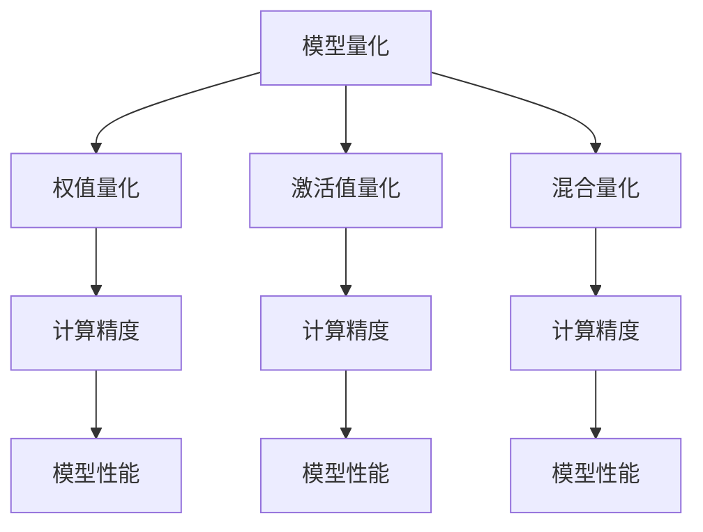

                 

# 量化压缩：减少模型大小

## 1. 背景介绍

### 1.1 问题由来
随着深度学习技术的发展，大模型因其强大的泛化能力和解决复杂问题的能力，在计算机视觉、自然语言处理等领域取得了显著的成果。然而，大模型通常拥有数亿甚至数十亿的参数，这带来了显著的存储和计算开销，限制了其在移动设备、嵌入式系统等资源受限的环境中的部署应用。量化压缩技术作为大模型优化的一个重要方向，通过将模型参数从浮点数压缩到整数、定点数等更小的表示形式，大幅减少模型大小，同时保持或提升模型性能，使得大模型能够在资源有限的设备上运行，具有广泛的应用前景。

### 1.2 问题核心关键点
量化压缩的核心目标是通过减少模型参数的位数，来降低模型的存储空间和计算成本。量化压缩的方法主要分为三类：权值量化、激活值量化和混合量化。

1. **权值量化**：将模型的权重参数从浮点数压缩到整数或定点数，以减少存储和计算成本。
2. **激活值量化**：将模型的激活值（即中间计算结果）从浮点数压缩到整数或定点数，以减少计算量。
3. **混合量化**：同时对权值和激活值进行量化，以获得更优的性能和资源利用率。

此外，量化压缩技术的实现还需要考虑计算精度、计算复杂度、模型泛化能力等关键因素，以确保压缩后的模型能够有效降低资源开销，同时不损失或仅损失少量性能。

### 1.3 问题研究意义
量化压缩技术对大模型的优化具有重要意义：

1. **降低存储和计算开销**：通过压缩模型参数，可以显著减少模型的存储空间和计算成本，使得大模型能够在资源受限的设备上部署。
2. **提升模型的可移植性和可扩展性**：压缩后的模型更加轻量级，便于在不同的硬件平台和计算环境中运行。
3. **增强模型的稳定性和鲁棒性**：量化压缩能够提高模型的鲁棒性和抗干扰能力，减少计算误差。
4. **加速训练和推理速度**：量化后的模型可以大幅提升计算速度，特别是在深度神经网络中，量化可以显著降低推理时间。
5. **促进大模型的广泛应用**：量化压缩为将大模型应用于移动设备、嵌入式系统、边缘计算等场景提供了可能，推动了人工智能技术的普及和应用。

## 2. 核心概念与联系

### 2.1 核心概念概述

为更好地理解量化压缩技术，本节将介绍几个密切相关的核心概念：

- **模型量化**：将模型参数从浮点数压缩到整数、定点数等更小的表示形式，以减少存储空间和计算成本。
- **权值量化**：压缩模型的权重参数，从浮点数压缩到整数或定点数。
- **激活值量化**：压缩模型的激活值，从浮点数压缩到整数或定点数。
- **混合量化**：同时压缩模型的权值和激活值，以获得更优的性能和资源利用率。
- **量化精度**：量化后的模型参数所保留的精度，决定模型性能和压缩效果的平衡。
- **计算精度**：模型在执行计算时所保留的精度，影响模型精度和计算效率。

这些核心概念之间的逻辑关系可以通过以下Mermaid流程图来展示：



这个流程图展示了大模型量化压缩的核心概念及其之间的关系：

1. 模型量化是整个压缩过程的入口，旨在通过减少模型参数的位数来降低资源开销。
2. 权值量化和激活值量化是模型量化的两个主要分支，分别对权重和激活值进行压缩。
3. 混合量化是将权值和激活值同时压缩，以获得更优的性能和资源利用率。
4. 计算精度是量化压缩和模型性能的关键因素，决定了压缩后的模型是否能够有效降低资源开销同时不损失或仅损失少量性能。
5. 模型性能是评估量化压缩效果的重要指标，包括推理准确率、计算效率等。

这些核心概念共同构成了大模型量化压缩的学习框架，使其能够在各种场景下发挥其优化的潜力。通过理解这些核心概念，我们可以更好地把握量化压缩的工作原理和优化方向。

## 3. 核心算法原理 & 具体操作步骤

### 3.1 算法原理概述

量化压缩的原理是通过减少模型参数的精度，从而降低模型的存储空间和计算成本。具体而言，量化压缩可以分为以下步骤：

1. **选择合适的量化方法**：根据具体需求选择权值量化、激活值量化或混合量化方法。
2. **量化参数**：对模型的权重或激活值进行量化，将浮点数压缩到整数、定点数等更小的表示形式。
3. **调整计算精度**：根据量化后的参数，调整计算精度，以平衡压缩效果和模型性能。
4. **训练和推理优化**：通过训练和推理过程中的优化，进一步提升模型的性能和压缩效果。

### 3.2 算法步骤详解

量化压缩的具体步骤包括：

1. **选择合适的量化方法**：
   - **权值量化**：将模型的权重参数从浮点数压缩到整数、定点数等更小的表示形式。
   - **激活值量化**：将模型的激活值（即中间计算结果）从浮点数压缩到整数、定点数等更小的表示形式。
   - **混合量化**：同时压缩模型的权值和激活值，以获得更优的性能和资源利用率。

2. **量化参数**：
   - **权值量化**：通过观察模型权重参数的分布，选择合适的量化范围和步长，将浮点数压缩到整数或定点数。常用的量化方法包括均匀量化、对称量化等。
   - **激活值量化**：对激活值进行量化时，通常采用与权值量化类似的方法，根据激活值分布选择合适的量化范围和步长。
   - **混合量化**：同时对权值和激活值进行量化，通常先对权值进行量化，然后根据量化后的权值调整激活值的量化范围和步长。

3. **调整计算精度**：
   - **权值量化**：调整量化后的权值精度，以平衡压缩效果和模型性能。通常采用8位、16位等较低的精度。
   - **激活值量化**：调整量化后的激活值精度，以平衡计算效率和模型性能。通常采用8位、16位等较低的精度。
   - **混合量化**：同时调整量化后的权值和激活值精度，以获得最优的性能和资源利用率。

4. **训练和推理优化**：
   - **权值量化**：在训练和推理过程中，通过引入量化误差校正机制，如量化噪声消除、截断量化等，减少量化带来的误差。
   - **激活值量化**：在训练和推理过程中，通过引入量化误差校正机制，如量化噪声消除、截断量化等，减少量化带来的误差。
   - **混合量化**：在训练和推理过程中，通过引入量化误差校正机制，如量化噪声消除、截断量化等，减少量化带来的误差。

### 3.3 算法优缺点

量化压缩技术具有以下优点：
1. **减少存储空间和计算开销**：通过压缩模型参数的位数，大幅减少模型的存储空间和计算成本，使得大模型能够在资源受限的设备上运行。
2. **提升模型的可移植性和可扩展性**：压缩后的模型更加轻量级，便于在不同的硬件平台和计算环境中运行。
3. **增强模型的稳定性和鲁棒性**：量化压缩能够提高模型的鲁棒性和抗干扰能力，减少计算误差。
4. **加速训练和推理速度**：量化后的模型可以大幅提升计算速度，特别是在深度神经网络中，量化可以显著降低推理时间。

同时，该技术也存在一些局限性：
1. **精度损失**：量化压缩可能会损失一定的模型精度，特别是在量化精度较低时。
2. **训练复杂性**：量化压缩后的模型需要额外的训练和优化，增加了训练的复杂性。
3. **模型泛化能力下降**：量化压缩可能会导致模型泛化能力下降，特别是在量化精度较低时。

尽管存在这些局限性，但量化压缩技术仍是大模型优化的一个重要方向，特别是在资源受限的环境下，量化压缩为大模型的部署和应用提供了重要的支持。

### 3.4 算法应用领域

量化压缩技术在大模型优化中得到了广泛应用，覆盖了计算机视觉、自然语言处理、语音识别等多个领域，具体应用包括：

- **计算机视觉**：对卷积神经网络（CNN）进行量化压缩，如量化权重和激活值，以减少模型大小和计算成本。
- **自然语言处理**：对Transformer模型进行量化压缩，如量化权重和激活值，以减少模型大小和计算成本。
- **语音识别**：对卷积神经网络（CNN）和循环神经网络（RNN）进行量化压缩，以减少模型大小和计算成本。
- **边缘计算**：在资源受限的嵌入式设备上部署量化压缩后的模型，以降低计算和存储开销。
- **移动应用**：在移动设备上部署量化压缩后的模型，以提升应用速度和用户体验。
- **物联网**：在物联网设备上部署量化压缩后的模型，以降低计算和存储开销。

除了上述这些经典应用外，量化压缩技术还被创新性地应用到更多场景中，如实时视频流处理、动态数据处理、实时语音识别等，为计算资源受限环境下的模型应用提供了新的突破。随着量化压缩技术的不断进步，相信其在更多领域的应用前景将更加广阔。

## 4. 数学模型和公式 & 详细讲解 & 举例说明

### 4.1 数学模型构建

量化压缩的基本数学模型可以表示为：

$$
\text{Quantized Model} = \text{Quantize}(Quantized Weight) \otimes \text{Quantized Activation} + \text{Bias}
$$

其中，$\text{Quantized Model}$表示量化后的模型，$\text{Quantized Weight}$表示量化后的权重，$\text{Quantized Activation}$表示量化后的激活值，$\text{Bias}$表示模型偏置。

### 4.2 公式推导过程

以下我们以权值量化为例，推导权值量化的数学公式及其计算过程。

假设模型中的权重参数为$W$，其量化后的形式为$W_q$，表示将$W$压缩到$k$位整数或定点数。量化过程可以表示为：

$$
W_q = \text{Quantize}(W)
$$

其中，$\text{Quantize}(W)$表示将$W$压缩到$k$位整数或定点数。假设$W$的取值范围为$[a, b]$，则$W_q$的取值范围为$[\frac{a}{s}, \frac{b}{s}]$，其中$s=2^k$为量化步长。

对于每个量化后的权重$W_q$，其值可以表示为：

$$
W_q = \text{sign}(W) \times s \times \text{round}\left(\frac{W}{s}\right)
$$

其中，$\text{sign}(W)$表示$W$的符号，$\text{round}\left(\frac{W}{s}\right)$表示将$\frac{W}{s}$四舍五入到最接近的整数。

### 4.3 案例分析与讲解

以TensorFlow为例，以下是使用TensorFlow实现权值量化的代码：

```python
import tensorflow as tf

# 定义模型权重
W = tf.Variable(tf.random.normal([100, 100]))

# 量化权重
W_q = tf.quantization.uniform_quantize(weights=W, num_bits=8, axis=-1)

# 输出量化后的权重
print(W_q)
```

以上代码中，使用`tf.quantization.uniform_quantize`函数实现了权值的量化。其中，`weights`表示需要量化的权重，`num_bits`表示量化位数，`axis`表示量化轴。

## 5. 项目实践：代码实例和详细解释说明

### 5.1 开发环境搭建

在进行量化压缩实践前，我们需要准备好开发环境。以下是使用Python进行TensorFlow开发的环境配置流程：

1. 安装Anaconda：从官网下载并安装Anaconda，用于创建独立的Python环境。

2. 创建并激活虚拟环境：
```bash
conda create -n tensorflow-env python=3.8 
conda activate tensorflow-env
```

3. 安装TensorFlow：根据CUDA版本，从官网获取对应的安装命令。例如：
```bash
pip install tensorflow==2.8
```

4. 安装各类工具包：
```bash
pip install numpy pandas scikit-learn matplotlib tqdm jupyter notebook ipython
```

完成上述步骤后，即可在`tensorflow-env`环境中开始量化压缩实践。

### 5.2 源代码详细实现

下面我们以ReLU激活函数的量化为例，给出使用TensorFlow进行量化压缩的Python代码实现。

首先，定义ReLU激活函数：

```python
import tensorflow as tf

def relu(x):
    return tf.nn.relu(x)
```

然后，实现ReLU激活函数的量化：

```python
def quantized_relu(x, num_bits=8):
    s = 2**num_bits
    x_q = tf.quantization.uniform_quantize(x, s=s, num_bits=num_bits)
    x_q = tf.quantization.dequantize(x_q, signed_input=True, num_bits=num_bits)
    x_q = tf.nn.relu(x_q)
    return x_q
```

以上代码中，使用`tf.quantization.uniform_quantize`函数将ReLU激活函数的输入量化为指定位数的整数或定点数，然后通过`tf.quantization.dequantize`函数将量化结果反量化为浮点数，最后使用`tf.nn.relu`函数计算激活值。

### 5.3 代码解读与分析

让我们再详细解读一下关键代码的实现细节：

**relu函数**：
- 定义了ReLU激活函数的函数实现，使用`tf.nn.relu`函数实现原始的ReLU激活功能。

**quantized_relu函数**：
- `num_bits`参数表示量化位数，默认为8位。
- `s`表示量化步长，由`2**num_bits`计算得到。
- `x_q`表示量化后的输入，使用`tf.quantization.uniform_quantize`函数实现。
- `tf.quantization.dequantize`函数将量化后的输入反量化为浮点数。
- `tf.nn.relu`函数计算激活值，得到量化后的激活结果。

**代码运行**：
- 调用`quantized_relu`函数，输入量化后的输入，即可得到量化后的激活结果。

可以看到，通过TensorFlow库的简单封装，我们可以方便地实现ReLU激活函数的量化。TensorFlow提供了一系列的量化工具，如`tf.quantization.uniform_quantize`、`tf.quantization.dequantize`等，可以快速实现模型的量化。

## 6. 实际应用场景

### 6.1 智能终端设备

量化压缩技术在智能终端设备上的应用尤为显著。智能手机、平板电脑等移动设备受限于硬件性能和电池续航能力，无法长时间运行大模型。通过量化压缩，可以显著减小模型大小，降低计算和存储开销，使得大模型能够在这些设备上运行，提供高效、稳定的智能服务。

例如，在移动医疗应用中，量化压缩后的模型可以实时监测用户的健康数据，提供个性化的健康建议。在移动金融应用中，量化压缩后的模型可以实时分析用户交易数据，提供风险预警和个性化理财建议。

### 6.2 边缘计算

边缘计算是一种将计算任务分布到靠近数据源的计算节点上进行处理的技术，能够降低网络传输开销，提高计算效率。量化压缩技术在边缘计算中的应用，可以显著降低计算节点的计算和存储成本，使得大模型能够在边缘设备上运行，提供实时、高效的服务。

例如，在智能安防应用中，量化压缩后的模型可以在边缘计算设备上实时处理视频流数据，进行目标检测和行为分析。在智能家居应用中，量化压缩后的模型可以在边缘计算设备上实时处理传感器数据，进行环境监测和智能控制。

### 6.3 物联网

物联网设备的计算和存储资源非常有限，量化压缩技术可以在这些设备上大幅减少模型的计算和存储开销，使得大模型能够在物联网设备上运行，提供实时、高效的服务。

例如，在智能穿戴设备中，量化压缩后的模型可以实时监测用户健康数据，提供个性化的健康建议。在智能家电设备中，量化压缩后的模型可以实时处理用户指令，进行智能控制和环境监测。

### 6.4 未来应用展望

随着量化压缩技术的不断进步，其在更多领域的应用前景将更加广阔。

1. **自动驾驶**：在自动驾驶应用中，量化压缩后的模型可以实时处理传感器数据，进行路径规划和障碍物检测，提高驾驶安全性和效率。
2. **智能制造**：在智能制造应用中，量化压缩后的模型可以实时处理生产数据，进行质量控制和优化，提高生产效率和产品质量。
3. **智能交通**：在智能交通应用中，量化压缩后的模型可以实时处理交通数据，进行交通分析和预测，提高交通管理效率和安全性。
4. **智能农业**：在智能农业应用中，量化压缩后的模型可以实时处理传感器数据，进行环境监测和决策支持，提高农业生产效率和资源利用率。

此外，量化压缩技术还将与人工智能技术进行更深入的融合，如知识表示、因果推理、强化学习等，多路径协同发力，共同推动智能系统的进步。

## 7. 工具和资源推荐

### 7.1 学习资源推荐

为了帮助开发者系统掌握量化压缩技术的理论基础和实践技巧，这里推荐一些优质的学习资源：

1. 《深度学习量化与模型压缩》系列博文：由量化压缩技术专家撰写，深入浅出地介绍了量化压缩的基本原理、方法和应用场景。

2. 《TensorFlow官方文档》：TensorFlow官方文档，提供了量化压缩的详细教程和样例代码，是量化压缩技术学习的必备资料。

3. 《计算机视觉：模型压缩与量化》书籍：全面介绍了计算机视觉领域中的模型压缩与量化技术，包括量化压缩的基本原理、方法和应用场景。

4. 《TensorFlow量化实战》书籍：由TensorFlow量化专家撰写，详细介绍了TensorFlow中的量化工具和应用案例，适合量化压缩技术的实践学习。

5. 《深度学习模型压缩与量化》在线课程：由知名深度学习专家主讲，涵盖了量化压缩的基本原理、方法和应用场景，适合量化压缩技术的系统学习。

通过对这些资源的学习实践，相信你一定能够快速掌握量化压缩技术的精髓，并用于解决实际的深度学习模型优化问题。

### 7.2 开发工具推荐

高效的开发离不开优秀的工具支持。以下是几款用于量化压缩开发的常用工具：

1. TensorFlow：基于Python的开源深度学习框架，灵活动态的计算图，适合快速迭代研究。提供了丰富的量化工具和样例代码。

2. PyTorch：基于Python的开源深度学习框架，动态计算图，灵活高效。提供了丰富的量化工具和样例代码。

3. TVM（Tensor Virtual Machine）：开源的自动机器学习优化框架，支持多种深度学习框架，提供了高效的模型压缩和量化工具。

4. ONNX（Open Neural Network Exchange）：开源的神经网络模型交换格式，支持多种深度学习框架，提供了模型压缩和量化的接口。

5. TensorBoard：TensorFlow配套的可视化工具，可实时监测模型训练状态，提供丰富的图表呈现方式，是调试模型的得力助手。

6. PyTorch Lightning：基于PyTorch的深度学习框架，提供了简单易用的接口和丰富的优化工具，适合量化压缩技术的快速开发。

合理利用这些工具，可以显著提升量化压缩任务的开发效率，加快创新迭代的步伐。

### 7.3 相关论文推荐

量化压缩技术的发展源于学界的持续研究。以下是几篇奠基性的相关论文，推荐阅读：

1. "Learning Efficient ConvNets"（2015）：提出了一种基于稀疏卷积的模型压缩方法，通过减少卷积核的密度和参数量，大幅减小了模型大小。

2. "Knowledge distillation"（2014）：提出了一种知识蒸馏方法，通过将大模型的知识迁移到小模型中，提高小模型的性能。

3. "Deep Compression: Compressing Deep Neural Networks using Vector Quantization"（2015）：提出了一种基于向量量化的模型压缩方法，通过将神经网络参数映射到离散向量，减小模型大小。

4. "Network slimming"（2017）：提出了一种网络瘦身方法，通过剪枝和重构来减少神经网络中的冗余参数和计算量。

5. "Quantization and Quantization-Aware Training"（2016）：提出了一种量化方法，通过将浮点数参数压缩到整数或定点数，减小模型大小和计算成本。

这些论文代表了大模型压缩技术的进展，通过学习这些前沿成果，可以帮助研究者把握学科前进方向，激发更多的创新灵感。

## 8. 总结：未来发展趋势与挑战

### 8.1 研究成果总结

量化压缩技术作为深度学习优化的重要方向，已经取得了显著的进展，并在多个领域得到了广泛应用。其核心目标是通过减少模型参数的位数，来降低模型的存储空间和计算成本。

### 8.2 未来发展趋势

展望未来，量化压缩技术将呈现以下几个发展趋势：

1. **更加高效的压缩算法**：未来的量化压缩算法将更加高效，能够在不损失或仅损失少量性能的情况下，大幅减小模型大小。
2. **更加灵活的压缩策略**：未来的量化压缩将更加灵活，能够针对不同的任务和设备，选择合适的压缩策略，进一步提升压缩效果。
3. **更加智能的量化调度**：未来的量化压缩将引入智能调度机制，根据模型性能和设备资源，动态调整量化策略，提高资源利用率。
4. **更加多样化的应用场景**：未来的量化压缩将应用于更多的领域，如智能医疗、智能交通、智能制造等，推动人工智能技术的普及和应用。
5. **更加全面的人才培养**：未来的量化压缩技术将需要更多具备跨学科知识的人才，如计算机科学、数学、电子工程等，以推动技术的发展。

### 8.3 面临的挑战

尽管量化压缩技术已经取得了显著的进展，但在迈向更加智能化、普适化应用的过程中，它仍面临诸多挑战：

1. **精度损失**：量化压缩可能会损失一定的模型精度，特别是在量化精度较低时。如何在保持精度的同时，降低模型大小，是未来的重要研究方向。
2. **训练复杂性**：量化压缩后的模型需要额外的训练和优化，增加了训练的复杂性。如何优化训练过程，提高模型性能，是未来的重要研究方向。
3. **模型泛化能力下降**：量化压缩可能会导致模型泛化能力下降，特别是在量化精度较低时。如何提高模型的泛化能力，是未来的重要研究方向。
4. **计算精度变化**：量化压缩可能会影响模型的计算精度，特别是在量化精度较低时。如何在保持计算精度的同时，降低模型大小，是未来的重要研究方向。
5. **资源限制**：量化压缩需要大量的计算资源和存储空间，如何在有限的资源条件下，实现高效的模型压缩，是未来的重要研究方向。

### 8.4 研究展望

面对量化压缩面临的种种挑战，未来的研究需要在以下几个方面寻求新的突破：

1. **引入更多的量化方法**：探索新的量化方法，如截断量化、混合量化等，以进一步降低模型大小。
2. **优化量化算法**：优化量化算法，提高量化效率和精度，减少量化误差。
3. **引入更多的量化目标**：引入更多的量化目标，如模型推理速度、计算资源利用率等，以进一步提升压缩效果。
4. **引入更多的智能调度机制**：引入智能调度机制，根据模型性能和设备资源，动态调整量化策略，提高资源利用率。
5. **引入更多的先验知识**：将符号化的先验知识，如知识图谱、逻辑规则等，与量化压缩技术进行巧妙融合，引导量化压缩过程学习更准确、合理的模型。

这些研究方向将推动量化压缩技术的不断进步，为构建高效、智能、可靠的深度学习模型提供重要支持。

## 9. 附录：常见问题与解答

**Q1：量化压缩是否会损失模型的精度？**

A: 量化压缩可能会损失一定的模型精度，特别是在量化精度较低时。然而，通过合理选择量化方法和量化策略，可以在保持精度的同时，大幅减小模型大小。通常，量化精度越低，模型大小越小，但性能损失也越大。因此，量化压缩需要权衡精度和模型大小，选择合适的量化精度。

**Q2：量化压缩是否会影响训练和推理的效率？**

A: 量化压缩可能会影响模型的训练和推理效率，特别是在量化精度较低时。然而，通过优化训练和推理过程中的量化算法，可以在保持精度的同时，提升训练和推理效率。例如，通过引入量化误差校正机制，如量化噪声消除、截断量化等，可以减少量化带来的误差，提高模型的训练和推理效率。

**Q3：量化压缩是否适用于所有深度学习模型？**

A: 量化压缩技术适用于大多数深度学习模型，包括卷积神经网络（CNN）、循环神经网络（RNN）、Transformer等。然而，对于某些特定的模型结构，量化压缩可能会影响模型的性能和稳定性。因此，量化压缩需要针对具体模型进行优化和调整。

**Q4：量化压缩是否会影响模型的泛化能力？**

A: 量化压缩可能会影响模型的泛化能力，特别是在量化精度较低时。然而，通过合理选择量化精度和量化策略，可以在保持泛化能力的同时，降低模型大小。通常，量化精度越低，模型大小越小，但泛化能力也越差。因此，量化压缩需要权衡精度和泛化能力，选择合适的量化精度。

**Q5：量化压缩是否会增加计算资源开销？**

A: 量化压缩需要大量的计算资源和存储空间，特别是在压缩量较大的情况下。然而，通过优化量化算法和量化调度，可以在保持精度的同时，降低计算资源开销。例如，通过引入量化误差校正机制，如量化噪声消除、截断量化等，可以减少量化带来的误差，降低计算资源开销。

通过以上问题的解答，可以看出量化压缩技术在大模型优化中的重要性和复杂性。量化压缩需要权衡精度和模型大小、泛化能力和计算资源开销等多个因素，以实现最优的压缩效果。只有在充分理解和掌握量化压缩技术的基础上，才能更好地应用于实际问题中。

