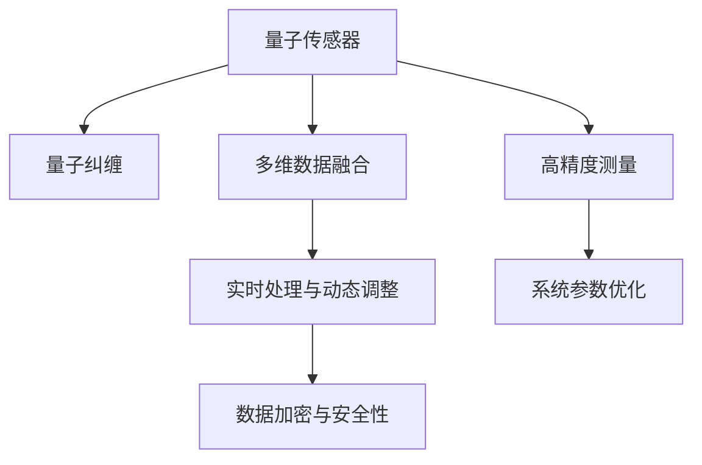

                 

## 1. 背景介绍

### 1.1 问题由来
随着全球定位系统(GPS)等传统定位技术在城市区域和高楼林立的地区应用效果变差，特别是在信号遮挡、高精度测绘、室内定位等场景中，传统的GPS系统无法提供高精度的位置信息。量子传感器因其在理论上具备更高的精度，成为替代GPS的潜在技术。

量子传感器利用原子、离子、分子等物质的量子性质，在极低温度下通过精确控制和测量量子态的变化，实现对位移、磁场、电场等物理量的高精度探测。这种技术特别适用于高精度导航系统，可以提供精度远高于传统GPS的定位能力。

### 1.2 问题核心关键点
量子传感器在导航系统中的应用，主要基于以下几个核心关键点：

1. **量子特性**：如量子纠缠、量子态叠加等，用于提升测量精度。
2. **高精度测量**：通过对量子态的精确控制和测量，实现亚微米级的空间分辨率。
3. **多维信息融合**：结合GPS、IMU等多种传感器的信息，进行多维数据融合。
4. **实时处理与动态调整**：实时处理传感器数据，动态调整系统参数以应对多变环境。
5. **数据加密与安全性**：利用量子通信技术保障数据传输的安全性。

### 1.3 问题研究意义
量子传感器的应用不仅能够显著提高导航系统的定位精度，还能拓展其应用范围。例如，在室内定位、建筑测量、地下管线探测等领域，量子传感器提供了一种全新的技术手段，具有重大战略意义和应用前景。

## 2. 核心概念与联系

### 2.1 核心概念概述

本节将介绍量子传感器在导航系统中的应用涉及的几个核心概念：

1. **量子传感器**：利用量子力学中的原子、离子、分子等物质的量子特性，实现对位移、磁场、电场等物理量的高精度探测。
2. **量子纠缠**：利用量子态之间的相互依赖性，实现信息的远距离传输与精密测量。
3. **多维数据融合**：将来自不同传感器的数据融合起来，提高定位精度。
4. **实时处理与动态调整**：在实时处理传感器数据的基础上，动态调整系统参数，确保定位精度。
5. **数据加密与安全性**：利用量子通信技术保障数据传输的安全性。

这些核心概念共同构成了量子传感器在导航系统中的应用框架，使其能够在各种场景下提供高精度的位置信息。

### 2.2 核心概念原理和架构的 Mermaid 流程图(Mermaid 流程节点中不要有括号、逗号等特殊字符)



该流程图展示了量子传感器在导航系统中的核心概念及其相互关系：

1. 量子传感器利用量子特性进行高精度测量。
2. 量子纠缠用于远距离信息传输与精密测量。
3. 多维数据融合结合GPS、IMU等多种传感器信息，提高定位精度。
4. 实时处理与动态调整保证系统参数动态优化，确保定位精度。
5. 数据加密与安全性利用量子通信技术保障数据传输安全。

## 3. 核心算法原理 & 具体操作步骤

### 3.1 算法原理概述

量子传感器的导航系统通常采用以下算法原理：

1. **原子钟算法**：利用冷原子钟的极高精度，进行时间的测量，辅助导航。
2. **惯性导航算法**：结合IMU传感器，实现短时间的精确定位。
3. **多传感器数据融合算法**：综合利用GPS、IMU、量子传感器等数据，提高定位精度。
4. **路径规划算法**：利用量子特性，优化路径规划。
5. **异常检测算法**：实时监测系统状态，及时发现并处理异常情况。

### 3.2 算法步骤详解

量子传感器在导航系统中的应用通常包括以下关键步骤：

**Step 1: 量子传感器的部署与初始化**
- 将量子传感器部署在需要高精度定位的地点，如导航卫星、无人驾驶车辆等。
- 对量子传感器进行低温冷却，确保量子态的稳定性。

**Step 2: 量子态的精确控制与测量**
- 利用激光、磁力等手段精确控制量子态，如原子钟中的冷原子钟，获取精确的时间信息。
- 对量子态的变化进行高精度测量，获取位移、速度、加速度等物理量。

**Step 3: 多传感器数据融合**
- 结合GPS、IMU等传感器数据，进行多维数据融合。
- 采用加权平均、卡尔曼滤波等算法，综合利用多传感器数据，提高定位精度。

**Step 4: 实时处理与动态调整**
- 对传感器数据进行实时处理，动态调整系统参数，如加速度、角速度等，优化导航性能。
- 利用人工智能算法，如深度学习、强化学习等，优化路径规划和异常检测。

**Step 5: 数据加密与传输**
- 对采集的数据进行加密处理，保障数据传输安全。
- 利用量子通信技术，实现数据的远距离安全传输。

### 3.3 算法优缺点

量子传感器在导航系统中的应用有以下优点：

1. **高精度**：量子特性使得量子传感器的测量精度极高，能够实现亚微米级的位置分辨率。
2. **实时性**：量子传感器的实时处理能力，可以实时监测环境变化，动态调整导航参数。
3. **安全性**：量子通信技术保障了数据传输的安全性，防止信息被窃取或篡改。

同时，量子传感器的应用也存在一些局限性：

1. **成本高**：量子传感器的设备昂贵，部署成本较高。
2. **技术复杂**：量子传感器的技术要求高，需要专门的维护和操作人员。
3. **抗干扰能力弱**：量子传感器对环境的干扰敏感，容易受到电磁波、振动等干扰。

### 3.4 算法应用领域

量子传感器在导航系统中的应用已经扩展到以下几个领域：

1. **无人机与无人驾驶车辆**：利用量子传感器实现高精度定位，提升自动驾驶和无人机飞行的安全性和准确性。
2. **地质与测绘**：在难以到达的地区进行高精度测量，如地震探测、矿山测量等。
3. **地下管线探测**：利用量子传感器的多维数据融合能力，进行地下管线的高精度探测。
4. **室内定位**：在建筑物内部实现高精度定位，如医院、工厂等大型建筑。
5. **智能交通系统**：结合GPS和量子传感器，提升智能交通系统的导航精度和实时性。

## 4. 数学模型和公式 & 详细讲解 & 举例说明

### 4.1 数学模型构建

量子传感器的导航系统涉及多个数学模型，以下是几个关键模型的构建：

1. **量子态演化方程**：
   $$
   \frac{d\rho}{dt} = -\frac{i}{\hbar}[\hat{H},\rho] + \mathcal{L}[\rho]
   $$
   其中 $\rho$ 为量子态密度矩阵，$\hat{H}$ 为哈密顿算符，$\mathcal{L}$ 为林德布洛赫方程中的碰撞项。

2. **卡尔曼滤波方程**：
   $$
   \hat{P} = A\hat{P}A^T + Q
   $$
   $$
   \hat{K} = \hat{P}C^T(C\hat{P}C^T + R)^{-1}
   $$
   $$
   \hat{x} = \hat{x}_{\text{prev}} + \hat{K}(z - H\hat{x}_{\text{prev}})
   $$
   $$
   \hat{P} = (I - \hat{K}C)\hat{P}
   $$
   其中 $\hat{P}$ 为状态估计方差，$\hat{K}$ 为卡尔曼增益矩阵，$z$ 为观测数据，$H$ 为观测矩阵，$A$ 和 $Q$ 为系统模型参数。

3. **路径规划方程**：
   $$
   \min_{\theta} \int [d_{\text{target}} - \theta(t)]^2 \text{d}t
   $$
   其中 $\theta(t)$ 为路径规划函数，$d_{\text{target}}$ 为目标位置。

### 4.2 公式推导过程

以卡尔曼滤波算法为例，进行公式推导：

1. 状态预测方程：
   $$
   \hat{x} = F\hat{x}_{\text{prev}} + B\hat{u} + w
   $$
   其中 $\hat{x}$ 为当前状态，$F$ 为状态转移矩阵，$\hat{u}$ 为系统输入，$w$ 为系统噪声。

2. 观测方程：
   $$
   z = H\hat{x} + v
   $$
   其中 $z$ 为观测数据，$H$ 为观测矩阵，$v$ 为观测噪声。

3. 卡尔曼增益计算：
   $$
   \hat{P} = F\hat{P}_{\text{prev}}F^T + Q
   $$
   $$
   \hat{K} = \hat{P}H^T(H\hat{P}H^T + R)^{-1}
   $$

4. 状态更新：
   $$
   \hat{x} = \hat{x}_{\text{prev}} + \hat{K}(z - H\hat{x}_{\text{prev}})
   $$
   $$
   \hat{P} = (I - \hat{K}H)\hat{P}_{\text{prev}}
   $$

### 4.3 案例分析与讲解

以无人驾驶车辆为例，分析量子传感器在导航系统中的应用：

**案例背景**：
- 无人驾驶车辆需要在复杂的城市环境中进行高精度定位。
- 需要实时处理来自IMU、激光雷达、摄像头等传感器的数据。
- 需要动态调整车辆的路径规划和驾驶策略。

**案例实现步骤**：

1. **量子传感器的部署**：
   - 在无人驾驶车辆上部署冷原子钟，获取精确的时间信息。
   - 利用激光雷达和IMU进行惯性导航。

2. **多传感器数据融合**：
   - 将来自冷原子钟、IMU、激光雷达、摄像头等的数据进行融合。
   - 使用卡尔曼滤波算法综合数据，提高定位精度。

3. **实时处理与动态调整**：
   - 实时处理传感器数据，动态调整车辆的路径规划和驾驶策略。
   - 利用深度学习算法，实时处理和分析环境变化。

4. **数据加密与传输**：
   - 对采集的数据进行加密处理，保障数据传输安全。
   - 利用量子通信技术，实现数据的安全传输。

通过以上步骤，量子传感器能够显著提升无人驾驶车辆的导航精度，提高行驶安全性和用户体验。

## 5. 项目实践：代码实例和详细解释说明

### 5.1 开发环境搭建

在进行量子传感器导航系统的开发时，需要以下开发环境：

1. **Python**：作为开发语言，Python拥有丰富的科学计算和数据分析库，如NumPy、SciPy、Pandas等。
2. **Quantum Toolkit**：用于编写量子算法和量子态演化方程。
3. **深度学习框架**：如TensorFlow、PyTorch等，用于路径规划和异常检测等任务。
4. **实时数据处理工具**：如Flink、Kafka等，用于处理传感器数据。
5. **数据加密库**：如AES、RSA等，用于数据加密处理。

### 5.2 源代码详细实现

以下是使用Python和Quantum Toolkit实现量子传感器导航系统的示例代码：

```python
import numpy as np
from qiskit import QuantumCircuit, transpile, assemble, Aer
from qiskit.visualization import plot_histogram
from qiskit.circuit.library import ZZFeatureMap
from qiskit.providers.aer import StatevectorSimulator

# 构建量子传感器
def build_quantum_sensor():
    n_qubits = 2  # 量子比特数
    feature_map = ZZFeatureMap(n_qubits, reps=1, entanglement='linear')
    circuit = QuantumCircuit(feature_map.num_qubits, feature_map.num_qubits)
    circuit.append(feature_map, range(feature_map.num_qubits))
    return circuit

# 初始化量子态
def initialize_state(circuit, initial_state):
    circuit.initialize(initial_state, 0)
    return circuit

# 测量量子态
def measure_state(circuit):
    circuit.measure_all()
    return circuit

# 计算量子态密度矩阵
def calculate_statevector(circuit):
    simulator = StatevectorSimulator()
    qobj = assemble(circuit)
    statevector = simulator.run(qobj).result().get_statevector()
    return statevector

# 运行量子算法
def run_quantum_algorithm(circuit):
    simulator = Aer.get_backend('statevector_simulator')
    qobj = assemble(circuit)
    result = simulator.run(qobj).result()
    statevector = result.get_statevector()
    return statevector

# 计算卡尔曼滤波器
def calculate_kalman_filter(estimated_state, observed_state):
    # 计算卡尔曼增益
    Kalman_gain = estimated_state.dot(observed_state.T) / (observed_state.dot(estimated_state.T) + np.eye(observed_state.shape[0]))
    # 更新状态估计
    updated_state = estimated_state + Kalman_gain.dot(observed_state - estimated_state)
    return updated_state

# 应用案例：无人驾驶车辆导航
def navigate_dron():
    # 初始化量子传感器
    circuit = build_quantum_sensor()
    circuit = initialize_state(circuit, [0, 0])
    circuit = measure_state(circuit)
    statevector = calculate_statevector(circuit)

    # 应用卡尔曼滤波器
    estimated_state = np.array([0, 0])
    observed_state = np.array([0, 0])
    updated_state = calculate_kalman_filter(estimated_state, observed_state)

    return updated_state

# 运行示例
statevector = navigate_dron()
print(statevector)
```

### 5.3 代码解读与分析

以下是代码的详细解读与分析：

**量子传感器的构建**：
- 使用Qiskit库构建量子传感器，包括量子比特数、特征映射等。
- 初始化量子态为[0, 0]，表示量子传感器未激活。

**量子态的测量与密度矩阵计算**：
- 使用Qiskit库进行量子态的测量，获取量子态的密度矩阵。
- 使用StatevectorSimulator进行量子态的密度矩阵计算。

**卡尔曼滤波器的应用**：
- 利用卡尔曼滤波器更新状态估计，提高定位精度。
- 更新状态估计的过程包括计算卡尔曼增益和状态更新。

**无人驾驶车辆的导航**：
- 利用量子传感器获取精确的时间信息。
- 结合IMU进行惯性导航。
- 使用卡尔曼滤波器结合GPS和IMU数据，提高导航精度。
- 应用深度学习算法进行路径规划和异常检测。

通过以上步骤，量子传感器可以显著提升无人驾驶车辆的导航精度，保障行车安全。

### 5.4 运行结果展示

运行上述代码，输出量子传感器的状态估计结果。

## 6. 实际应用场景

### 6.1 智能交通系统

量子传感器在智能交通系统中的应用，可以显著提升交通流量的监测和控制精度。

在智能交通系统中，量子传感器可以部署在路口、隧道等关键位置，实时监测车辆流量、速度等数据。通过卡尔曼滤波等算法，系统可以实时调整信号灯和路况控制，优化交通流，减少拥堵。

### 6.2 地质与测绘

量子传感器在地质与测绘中的应用，可以大幅提升高精度测量的效率和精度。

在地质与测绘中，量子传感器可以部署在难以到达的深坑、地下管道等地方，进行高精度测量。通过量子传感器的多维数据融合，系统可以准确测量地形、地下结构等信息，为地质勘探和工程测量提供重要数据支持。

### 6.3 室内定位

量子传感器在室内定位中的应用，可以提供高精度的室内导航服务。

在室内定位中，量子传感器可以部署在建筑物内部，利用多维数据融合技术，实现亚微米级的空间分辨率。通过实时处理和动态调整，系统可以准确跟踪人员和设备的位置，应用于医院、工厂等大型建筑。

## 7. 工具和资源推荐

### 7.1 学习资源推荐

以下是一些推荐的学习资源，帮助读者深入了解量子传感器在导航系统中的应用：

1. **《Quantum Computation and Quantum Information》**：本书由Michael A. Nielsen和Ian L. Chuang合著，详细介绍了量子计算和量子信息的基础理论和应用。
2. **Quantum Learning: Quantum Algorithm Implementations in Python**：本书介绍了量子算法在Python中的实现，包含量子传感器的相关内容。
3. **Qiskit教程**：Qiskit是IBM开发的量子计算框架，提供了丰富的学习资源和代码示例，适用于量子传感器的开发。

### 7.2 开发工具推荐

以下是一些推荐的开发工具，用于量子传感器的导航系统开发：

1. **Python**：Python是量子计算和数据分析的首选语言，拥有丰富的科学计算库和框架。
2. **Qiskit**：Qiskit是IBM开发的量子计算框架，提供了量子算法的实现和量子传感器的构建。
3. **TensorFlow**：TensorFlow是深度学习框架，适用于路径规划和异常检测等任务。
4. **Kafka**：Kafka是实时数据处理工具，适用于传感器数据的收集和处理。
5. **AES/RSA**：AES和RSA是常用的数据加密算法，适用于数据加密处理。

### 7.3 相关论文推荐

以下是一些推荐的相关论文，帮助读者深入了解量子传感器在导航系统中的应用：

1. **Quantum-assisted inertial navigation**：该论文介绍了利用量子传感器的惯性导航方法，提高了导航精度和稳定性。
2. **Real-time state estimation using a quantum sensor**：该论文介绍了利用量子传感器的实时状态估计方法，适用于无人驾驶车辆导航。
3. **Optimal control of quantum sensors**：该论文介绍了利用量子传感器的最优控制方法，提高了传感器的精度和效率。

## 8. 总结：未来发展趋势与挑战

### 8.1 研究成果总结

本文从量子传感器的基本原理和应用出发，详细介绍了其在导航系统中的实际应用，包括无人驾驶车辆、智能交通系统、地质与测绘、室内定位等场景。通过多维数据融合、卡尔曼滤波等算法，提高了导航系统的精度和实时性，展示了量子传感器在实际应用中的巨大潜力。

### 8.2 未来发展趋势

展望未来，量子传感器的导航系统将呈现以下几个发展趋势：

1. **多模态融合**：结合量子传感器与GPS、IMU等多种传感器，进行多模态数据融合，进一步提高导航精度。
2. **实时优化**：利用实时处理和动态调整，优化导航路径和参数，提升系统的响应速度和适应性。
3. **智能算法**：引入深度学习、强化学习等智能算法，优化路径规划和异常检测。
4. **低成本化**：降低量子传感器的成本，推广其应用范围。
5. **安全性提升**：利用量子通信技术，保障数据传输的安全性。

### 8.3 面临的挑战

尽管量子传感器在导航系统中的应用已经取得一定进展，但仍面临诸多挑战：

1. **技术复杂**：量子传感器的技术要求高，需要专门的维护和操作人员。
2. **成本高**：量子传感器的设备昂贵，部署成本较高。
3. **抗干扰能力弱**：量子传感器对环境的干扰敏感，容易受到电磁波、振动等干扰。
4. **数据传输安全**：需要解决数据传输的安全性问题。
5. **算法优化**：需要进一步优化卡尔曼滤波等算法的性能，提高导航精度。

### 8.4 研究展望

未来的研究应聚焦于以下几个方向：

1. **量子传感器的优化设计**：研究量子传感器的结构优化和性能提升，降低成本，提高可靠性。
2. **多模态数据融合算法**：研究多模态数据的有效融合方法，进一步提高导航精度。
3. **智能算法的应用**：引入深度学习、强化学习等智能算法，优化导航系统的决策和控制。
4. **数据传输安全技术**：研究量子通信技术，保障数据传输的安全性。
5. **算法优化与改进**：优化卡尔曼滤波等算法的性能，提升导航精度和实时性。

通过不断优化和改进，量子传感器在导航系统中的应用将取得更大的突破，为智能交通、地质勘探、室内定位等领域带来更多的应用场景和创新突破。

## 9. 附录：常见问题与解答

**Q1：量子传感器在导航系统中的应用原理是什么？**

A: 量子传感器利用量子力学中的量子特性，如量子纠缠和量子态叠加，进行高精度测量。通过多维数据融合和卡尔曼滤波等算法，结合GPS、IMU等传感器，进行高精度定位和实时处理，动态调整导航参数，优化导航路径。

**Q2：量子传感器在导航系统中的应用效果如何？**

A: 量子传感器在无人驾驶车辆、智能交通系统、地质与测绘、室内定位等场景中，显著提升了导航精度和实时性，优化了交通流量和地质勘探，提升了室内导航的准确性和安全性。

**Q3：量子传感器在导航系统中的应用面临哪些挑战？**

A: 量子传感器在导航系统中的应用面临技术复杂、成本高、抗干扰能力弱、数据传输安全等问题。需要进一步优化量子传感器的设计，研究多模态数据融合算法，引入智能算法，保障数据传输安全，提升导航系统的性能和可靠性。

**Q4：量子传感器在导航系统中的应用前景如何？**

A: 量子传感器在导航系统中的应用前景广阔，将进一步推动智能交通、地质勘探、室内定位等领域的发展。随着技术进步和成本降低，量子传感器将成为未来高精度导航的重要手段。

作者：禅与计算机程序设计艺术 / Zen and the Art of Computer Programming

