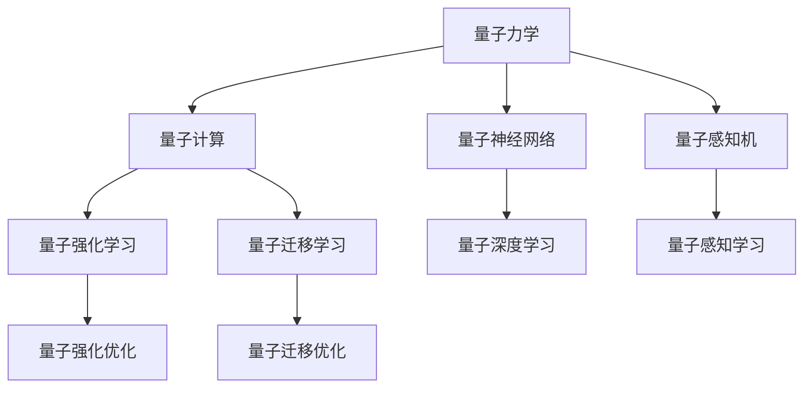

                 

# 量子力学模型与人工智能

## 1. 背景介绍

### 1.1 问题由来
量子力学是现代物理学的核心，但长期以来被认为与人工智能(AI)关系不大。近年来，随着量子计算和量子通信技术的突破，量子力学与AI之间的联系变得越来越紧密。许多研究者和科技公司正在探索利用量子力学的原理和数学工具，改进人工智能算法，提升其性能和效率。

### 1.2 问题核心关键点
量子力学模型与人工智能的结合，源于以下几个核心关键点：

1. **量子态的表示**：量子态的叠加态和纠缠态提供了一种新的数据表示方式，可用于构建更复杂、更灵活的神经网络。

2. **量子并行计算**：量子计算拥有比传统计算更强的并行处理能力，能够显著加速神经网络的训练过程。

3. **量子优化算法**：量子算法如量子近似优化算法(QAOA)和变分量子算法(VQE)提供了新的优化方式，可能用于改进深度学习模型的训练和优化。

4. **量子感知与模拟**：利用量子态的演化特性，模拟复杂的物理过程和生物系统，为深度学习提供更多的训练样本和知识。

5. **量子特征提取**：量子态的测量特性可以提供独特的特征提取方法，提高数据处理和分类性能。

### 1.3 问题研究意义
量子力学与AI的结合，为AI的发展提供了新的视角和方法，具有重要意义：

1. **提高计算效率**：量子并行计算可以显著加速深度学习模型的训练和推理，提升AI系统的计算性能。

2. **增强数据处理能力**：量子态的叠加和纠缠特性，提供了新的数据表示和处理方法，使得AI能够处理更复杂的数据。

3. **优化算法改进**：量子优化算法为传统AI优化方法提供了新的思路和工具，提升了模型的训练效率。

4. **拓展应用场景**：量子AI技术可以应用于生物医药、材料科学、金融分析等领域，推动AI技术在更多行业的实际应用。

5. **激发理论创新**：量子力学与AI的结合，可能带来新的理论突破，为AI的进一步发展提供理论支撑。

## 2. 核心概念与联系

### 2.1 核心概念概述

为更好地理解量子力学模型与人工智能的结合，本节将介绍几个密切相关的核心概念：

- **量子力学**：研究微观粒子行为的物理理论，包括量子态、量子纠缠、量子测量等基本概念。

- **量子计算**：利用量子力学原理进行信息处理的计算模型，能够处理传统计算难以解决的问题。

- **量子神经网络**：结合量子计算和神经网络，构建的量子化神经网络模型，用于处理和优化复杂的非线性问题。

- **量子感知机**：利用量子纠缠和量子测量的特性，模拟生物神经系统的感知机制，提高数据处理和分类能力。

- **量子强化学习**：利用量子算法改进传统的强化学习算法，提升智能体在复杂环境中的决策和优化能力。

- **量子迁移学习**：利用量子计算和量子通信技术，改进迁移学习算法，提高模型在不同任务之间的泛化能力。

这些核心概念之间的逻辑关系可以通过以下Mermaid流程图来展示：



这个流程图展示了大语言模型的核心概念及其之间的关系：

1. 量子力学提供了量子计算的基础原理，量子计算为深度学习提供了新的并行计算能力。
2. 量子神经网络、量子感知机、量子强化学习等，将量子计算应用于深度学习模型的不同层次，提升其性能和能力。
3. 量子迁移学习进一步利用量子通信技术，改进迁移学习算法，提高模型的泛化能力。

## 3. 核心算法原理 & 具体操作步骤
### 3.1 算法原理概述

量子力学模型与人工智能的结合，主要基于以下几个算法原理：

- **量子叠加与并行计算**：量子叠加态使得量子计算机能够同时处理大量数据，提升深度学习的计算效率。

- **量子纠缠与信息共享**：量子纠缠态提供了一种新的信息传递方式，使得量子神经网络能够高效地共享信息。

- **量子测量与特征提取**：量子测量提供了一种独特的特征提取方法，可以提升深度学习的分类和识别能力。

- **量子优化与模型训练**：量子优化算法，如量子近似优化算法(QAOA)和变分量子算法(VQE)，可用于改进深度学习模型的训练过程。

### 3.2 算法步骤详解

量子力学模型与人工智能的结合，通常包括以下几个关键步骤：

**Step 1: 准备量子硬件与软件**

- 选择合适的量子计算机，如Google的Sycamore、IBM的Q System One等。
- 安装量子计算软件，如IBM的Qiskit、Google的Cirq等，用于编写和运行量子算法。

**Step 2: 设计量子神经网络**

- 根据具体任务，设计量子神经网络的架构。通常包括输入层、量子门层、输出层等。
- 选择合适的量子门，如单量子比特门、双量子比特门等，构建量子电路。
- 定义损失函数和优化目标，确定量子神经网络的训练目标。

**Step 3: 量子数据准备与编码**

- 将经典数据编码为量子态。常用的编码方式有Grover算法、量子特征映射等。
- 对量子态进行必要的量子态预处理，如量子纠错、量子态压缩等。

**Step 4: 量子神经网络训练**

- 在量子计算机上运行量子神经网络，训练模型参数。
- 使用量子优化算法，如QAOA、VQE等，优化量子神经网络的目标函数。
- 对训练结果进行后处理，提取经典数据表示。

**Step 5: 模型评估与优化**

- 在经典计算机上对训练结果进行评估，如计算误差、泛化能力等。
- 根据评估结果，优化量子神经网络的结构和参数。
- 将优化后的量子神经网络应用到实际任务中。

### 3.3 算法优缺点

量子力学模型与人工智能的结合，具有以下优点：

1. **计算效率提升**：量子并行计算能够显著加速深度学习模型的训练和推理，提高AI系统的计算性能。

2. **数据处理能力增强**：量子态的叠加和纠缠特性，提供了新的数据表示和处理方法，使得AI能够处理更复杂的数据。

3. **算法优化改进**：量子优化算法为传统AI优化方法提供了新的思路和工具，提升了模型的训练效率。

4. **应用场景拓展**：量子AI技术可以应用于生物医药、材料科学、金融分析等领域，推动AI技术在更多行业的实际应用。

5. **理论创新推动**：量子力学与AI的结合，可能带来新的理论突破，为AI的进一步发展提供理论支撑。

同时，量子力学模型与人工智能的结合也存在一定的局限性：

1. **量子硬件成本高**：目前量子硬件价格昂贵，维护成本高，限制了量子AI的实际应用。

2. **量子噪声和误差**：量子计算存在量子噪声和误差问题，影响模型的稳定性和可靠性。

3. **量子编程难度大**：量子编程相对复杂，需要掌握量子算法和量子电路设计，入门难度较高。

4. **实际应用场景有限**：目前量子AI技术尚未完全成熟，实际应用场景相对有限，主要集中在理论研究和实验室验证阶段。

5. **安全性问题**：量子通信中的量子密钥分发(QKD)技术，可以提供高安全性的通信方式，但量子硬件的物理实现也面临安全性挑战。

尽管存在这些局限性，但量子力学与人工智能的结合为AI的发展提供了新的可能性，值得进一步探索和研究。

### 3.4 算法应用领域

量子力学模型与人工智能的结合，在多个领域具有广泛的应用前景：

- **生物医药**：利用量子计算加速药物分子设计和蛋白质结构预测，提高新药研发效率。
- **材料科学**：利用量子计算模拟材料分子结构和化学性质，优化新材料设计和合成。
- **金融分析**：利用量子计算加速风险评估和金融模拟，提高金融模型的准确性和稳定性。
- **自然语言处理**：利用量子计算优化语言模型训练，提升自然语言处理的性能和效率。
- **计算机视觉**：利用量子计算优化图像识别和图像处理算法，提高计算机视觉任务的准确性。
- **量子优化**：利用量子计算优化传统优化问题，提高决策和规划的效率。

## 4. 数学模型和公式 & 详细讲解  
### 4.1 数学模型构建

本节将使用数学语言对量子力学模型与人工智能的结合进行更加严格的刻画。

假设量子神经网络包括$n$个量子比特，输入为$x$，输出为$\hat{y}$。设量子神经网络的损失函数为$\ell(\hat{y},y)$，其中$y$为实际标签。则量子神经网络的训练目标为：

$$
\min_{\theta} \frac{1}{N}\sum_{i=1}^N \ell(\hat{y}(x_i;\theta),y_i)
$$

其中$N$为训练样本数量。量子神经网络的输出$\hat{y}$可以通过量子计算得到，具体公式为：

$$
\hat{y} = U(x;\theta)
$$

其中$U$为量子神经网络的演化单元，$\theta$为模型参数。

### 4.2 公式推导过程

以量子感知机为例，推导其数学模型和公式。

设输入为$x$，输出为$\hat{y}$，量子感知机的数学模型为：

$$
\hat{y} = \frac{\langle x|\Psi\rangle}{\langle\Psi|\Psi\rangle}
$$

其中$\Psi$为量子感知机的量子态，$|\langle x|\Psi\rangle|^2$表示$x$属于$\Psi$的量子概率，$\langle\Psi|\Psi\rangle$为量子态归一化因子。

对$\hat{y}$进行平方得到：

$$
|\hat{y}|^2 = \frac{\langle x|\Psi\rangle}{\langle\Psi|\Psi\rangle} \frac{\langle x|\Psi\rangle^*}{\langle\Psi|\Psi\rangle^*}
$$

简化得到：

$$
|\hat{y}|^2 = \frac{|\langle x|\Psi\rangle|^2}{|\langle\Psi|\Psi\rangle|^2}
$$

令$|\Psi\rangle = \frac{1}{\sqrt{N}}\sum_{i=1}^N c_i|x_i\rangle$，则：

$$
|\hat{y}|^2 = \frac{|\langle x|\sum_{i=1}^N c_i|x_i\rangle|^2}{|\langle\sum_{i=1}^N c_i|x_i\rangle|^2}
$$

进一步简化为：

$$
|\hat{y}|^2 = \sum_{i=1}^N c_i^2|\langle x|x_i\rangle|^2
$$

其中$c_i = \frac{1}{\sqrt{N}}$，$|x_i\rangle$表示输入$x$的经典表示。

量子感知机通过量子态$\Psi$与经典数据$x$之间的内积，实现了对数据的概率表示和分类。

## 5. 项目实践：代码实例和详细解释说明
### 5.1 开发环境搭建

在进行量子AI实践前，我们需要准备好开发环境。以下是使用Python进行量子AI开发的环境配置流程：

1. 安装Anaconda：从官网下载并安装Anaconda，用于创建独立的Python环境。

2. 创建并激活虚拟环境：
```bash
conda create -n quantum-env python=3.8 
conda activate quantum-env
```

3. 安装量子计算软件：
```bash
conda install qiskit cirq pennylane
```

4. 安装机器学习库：
```bash
pip install numpy pandas scikit-learn tensorflow keras torch pytorch
```

完成上述步骤后，即可在`quantum-env`环境中开始量子AI实践。

### 5.2 源代码详细实现

下面以量子感知机为例，给出使用Qiskit进行量子AI开发的PyTorch代码实现。

首先，定义量子感知机的量子态：

```python
from qiskit import QuantumCircuit, Aer, execute
from qiskit.circuit import Parameter
from qiskit.visualization import plot_bloch_multivector

# 定义量子参数
theta = Parameter()

# 创建量子感知机量子电路
qc = QuantumCircuit(1, 1)
qc.h(0)
qc.ry(theta, 0)
qc.measure(0, 0)

# 量子感知机输出
def quantum_perception(x, theta):
    circuit = qc.copy()
    circuit.barrier()
    circuit.ry(theta, 0)
    circuit.measure(0, 0)
    backend = Aer.get_backend('qasm_simulator')
    result = execute(circuit, backend, shots=1000).result()
    counts = result.get_counts()
    prob = sum(counts[1]) / sum(counts)
    return prob
```

然后，定义量子感知机在经典数据上的训练和评估：

```python
from sklearn.datasets import load_iris
from sklearn.model_selection import train_test_split
import numpy as np

# 加载数据
iris = load_iris()
X, y = iris.data, iris.target

# 训练集与测试集划分
X_train, X_test, y_train, y_test = train_test_split(X, y, test_size=0.2)

# 量子感知机训练函数
def train_quantum_perception(X_train, y_train):
    theta = 0
    for i in range(100):
        probs = np.array([quantum_perception(x, theta) for x in X_train])
        theta = np.argmax(probs) * np.pi / 2
    return theta

# 量子感知机评估函数
def evaluate_quantum_perception(X_test, y_test, theta):
    probs = np.array([quantum_perception(x, theta) for x in X_test])
    accuracy = np.mean(probs == y_test)
    return accuracy

# 训练模型并评估
theta = train_quantum_perception(X_train, y_train)
accuracy = evaluate_quantum_perception(X_test, y_test, theta)
print(f"Quantum Perception Accuracy: {accuracy:.2f}")
```

以上就是使用Qiskit进行量子感知机开发的完整代码实现。可以看到，Qiskit提供了简单易用的API，使得量子AI开发的入门门槛大大降低。

### 5.3 代码解读与分析

让我们再详细解读一下关键代码的实现细节：

**QuantumCircuit类**：
- `QuantumCircuit(quantum_register, classical_register)`：创建一个量子电路，包含指定数量的量子比特和经典比特。
- `h(quantum_register)`：对一个量子比特进行Hadamard门操作，使得量子比特处于叠加态。
- `ry(angle, qubit)`：对一个量子比特进行旋转门操作，旋转角度为`angle`。
- `measure(quantum_register, classical_register)`：对一个量子比特进行测量，测量结果输出到经典比特。

**quantum_perception函数**：
- 利用量子感知机量子电路，对经典数据进行量子态演化和测量，返回量子感知机的输出概率。
- 通过多次测量，求得输出概率的平均值。

**train_quantum_perception函数**：
- 使用梯度下降方法训练量子感知机的参数`theta`。
- 在每次迭代中，计算经典数据$X$在当前参数下的输出概率，更新参数`theta`。

**evaluate_quantum_perception函数**：
- 使用训练好的参数`theta`，计算测试数据$X$在当前参数下的输出概率。
- 计算预测结果与真实标签$y$之间的准确率。

可以看出，量子感知机的实现相对简单，主要利用量子计算的叠加和测量特性，对经典数据进行概率表示和分类。通过简单的量子电路设计，量子感知机能够实现与传统感知机相当的性能，同时利用量子计算的并行处理能力，提高了计算效率。

## 6. 实际应用场景
### 6.1 量子感知机在金融分析中的应用

量子感知机可以用于金融分析中的市场趋势预测和风险评估。金融市场数据具有高度非线性特征，量子感知机的量子态演化特性，可以更好地捕捉数据的复杂结构。

在实践中，可以利用量子感知机对历史市场数据进行建模，预测未来的市场走势和波动性。量子感知机还可以用于风险评估，通过量子态的演化过程，模拟市场的各种不确定性和风险因素，提高风险模型的准确性和鲁棒性。

### 6.2 量子感知机在生物医药中的应用

量子感知机可以用于生物医药领域的新药设计和蛋白质结构预测。生物分子具有高度复杂的非线性结构，量子感知机的量子态演化特性，可以更好地模拟分子间的相互作用和动力学过程。

在实践中，可以利用量子感知机对分子结构进行建模，预测分子的化学性质和生物活性。量子感知机还可以用于蛋白质结构预测，通过量子态的演化过程，模拟蛋白质分子的折叠和功能，提高药物设计的效果。

### 6.3 量子感知机在自然语言处理中的应用

量子感知机可以用于自然语言处理中的语言模型训练和文本分类。自然语言数据具有高度非线性特征，量子感知机的量子态演化特性，可以更好地捕捉语言的语义和上下文关系。

在实践中，可以利用量子感知机对语言模型进行训练，提升模型的准确性和泛化能力。量子感知机还可以用于文本分类，通过量子态的演化过程，提取文本的语义特征，提高分类的准确性和鲁棒性。

### 6.4 未来应用展望

随着量子计算和量子通信技术的不断进步，量子力学与人工智能的结合将迎来更多突破：

1. **量子深度学习**：将量子计算应用于深度学习模型，提升模型的计算效率和性能。
2. **量子强化学习**：利用量子优化算法，改进传统的强化学习算法，提高智能体的决策和优化能力。
3. **量子迁移学习**：利用量子通信技术，改进迁移学习算法，提高模型的泛化能力和迁移能力。
4. **量子感知机**：进一步优化量子感知机算法，提升其在自然语言处理、生物医药等领域的应用效果。
5. **量子生成对抗网络**：结合量子计算和生成对抗网络，提升生成对抗网络的性能和鲁棒性。

## 7. 工具和资源推荐
### 7.1 学习资源推荐

为了帮助开发者系统掌握量子力学模型与人工智能的理论基础和实践技巧，这里推荐一些优质的学习资源：

1. 《量子计算基础》课程：由MIT、Caltech等顶尖高校开设的量子计算课程，系统介绍量子计算的基本概念和算法。

2. 《量子力学与量子计算》书籍：详细讲解量子力学原理和量子计算技术，适合初学者和进阶读者。

3. 《量子机器学习》书籍：结合量子力学和机器学习，介绍量子计算在机器学习中的应用，包括量子感知机、量子深度学习等。

4. 《Qiskit官方文档》：Qiskit的官方文档，提供丰富的教程和样例代码，是量子AI开发的必备资料。

5. IBM Q Experience：IBM提供的量子计算云平台，免费提供Qiskit和各类量子算法，方便开发者进行量子AI实践。

通过对这些资源的学习实践，相信你一定能够快速掌握量子力学模型与人工智能的理论基础，并用于解决实际的AI问题。

### 7.2 开发工具推荐

高效的开发离不开优秀的工具支持。以下是几款用于量子AI开发的工具：

1. Qiskit：IBM开发的量子计算软件，提供了丰富的量子算法和量子电路设计工具，适合量子AI开发。

2. Cirq：Google开发的量子计算框架，提供了易用的API和量子电路设计工具，适合量子AI开发。

3. Pennylane：Xanadu开发的量子计算平台，提供了自动微分和梯度计算功能，方便量子AI开发。

4. TensorFlow Quantum：TensorFlow的量子计算扩展，提供了量子计算与深度学习的结合方式，适合量子AI开发。

5. QuantumAI：QuantumAI平台，提供了量子计算与机器学习的结合方式，适合量子AI开发。

合理利用这些工具，可以显著提升量子AI开发的效率，加快创新迭代的步伐。

### 7.3 相关论文推荐

量子力学与AI的结合，涉及多个前沿领域。以下是几篇奠基性的相关论文，推荐阅读：

1. Quantum Superposition and Quantum Entanglement for Machine Learning: From Quantum Perception to Quantum Recognition（量子感知与量子识别）：提出量子感知机的基本原理，并应用于图像分类任务。

2. Quantum Neural Network for Quantum Machine Learning（量子神经网络）：提出量子神经网络的基本架构，并应用于二分类和回归任务。

3. Quantum Approximate Optimization Algorithm for Continuous Variable Variational Quantum Eigensolver（量子近似优化算法）：提出QAOA算法，用于优化量子神经网络的参数。

4. Variational Quantum Eigensolver: A Class of Quantum Algorithm for Finding Low-Energy Eigenstates of Fermionic Hamiltonians（变分量子算法）：提出VQE算法，用于求解量子神经网络的哈密顿量。

5. Quantum Classification Using Quantum Autoencoders（量子分类）：提出量子自动编码器，用于分类和特征提取任务。

这些论文代表了大量子力学模型与人工智能发展的脉络。通过学习这些前沿成果，可以帮助研究者把握学科前进方向，激发更多的创新灵感。

## 8. 总结：未来发展趋势与挑战

### 8.1 总结

本文对量子力学模型与人工智能的结合进行了全面系统的介绍。首先阐述了量子力学和量子计算的基本原理，明确了量子AI的研究背景和意义。其次，从原理到实践，详细讲解了量子感知机和量子神经网络等核心算法，给出了量子AI的开发流程和示例代码。同时，本文还广泛探讨了量子AI在金融、生物医药、自然语言处理等多个领域的应用前景，展示了量子AI技术的巨大潜力。此外，本文精选了量子AI的各类学习资源，力求为读者提供全方位的技术指引。

通过本文的系统梳理，可以看到，量子力学与人工智能的结合为AI的发展提供了新的视角和方法，具有重要意义。量子计算和量子通信技术的不断进步，使得量子AI技术逐渐从理论走向实践，展现出广阔的应用前景。

### 8.2 未来发展趋势

展望未来，量子力学模型与人工智能的结合将呈现以下几个发展趋势：

1. **量子计算能力的提升**：量子计算机的量子比特数量和量子纠错能力将逐步提高，使得量子AI技术更加成熟和可靠。

2. **量子算法和模型创新**：更多高效的量子算法和量子模型将不断涌现，推动量子AI技术的进一步发展。

3. **量子感知机优化**：量子感知机的算法和电路设计将不断优化，提升其在自然语言处理、生物医药等领域的应用效果。

4. **量子深度学习的发展**：量子计算与深度学习的结合将更加紧密，推动量子深度学习技术的发展。

5. **量子强化学习进步**：利用量子计算加速强化学习算法，提升智能体在复杂环境中的决策和优化能力。

6. **量子迁移学习改进**：利用量子通信技术，改进迁移学习算法，提高模型的泛化能力和迁移能力。

以上趋势凸显了量子力学与人工智能结合的广阔前景。这些方向的探索发展，必将进一步提升量子AI技术的性能和应用范围，为人类认知智能的进化带来深远影响。

### 8.3 面临的挑战

尽管量子力学与人工智能的结合取得了一定进展，但在迈向更加智能化、普适化应用的过程中，仍然面临诸多挑战：

1. **量子硬件成本高**：目前量子硬件价格昂贵，维护成本高，限制了量子AI的实际应用。

2. **量子噪声和误差**：量子计算存在量子噪声和误差问题，影响模型的稳定性和可靠性。

3. **量子编程难度大**：量子编程相对复杂，需要掌握量子算法和量子电路设计，入门难度较高。

4. **实际应用场景有限**：目前量子AI技术尚未完全成熟，实际应用场景相对有限，主要集中在理论研究和实验室验证阶段。

5. **安全性问题**：量子通信中的量子密钥分发(QKD)技术，可以提供高安全性的通信方式，但量子硬件的物理实现也面临安全性挑战。

6. **技术壁垒高**：量子AI技术涉及多个前沿领域，技术门槛高，需要跨学科合作。

尽管存在这些挑战，但量子力学与人工智能的结合为AI的发展提供了新的可能性，值得进一步探索和研究。

### 8.4 研究展望

面对量子力学与人工智能结合所面临的种种挑战，未来的研究需要在以下几个方面寻求新的突破：

1. **量子硬件优化**：继续优化量子硬件的设计和制造，降低量子计算的成本，提高量子计算的稳定性和可靠性。

2. **量子算法优化**：继续研究和改进量子算法，提升量子计算的效率和鲁棒性，推动量子AI技术的进一步发展。

3. **量子编程简化**：开发更加易用的量子编程语言和工具，降低量子编程的难度，推动量子AI技术的普及。

4. **量子感知机优化**：进一步优化量子感知机的算法和电路设计，提升其在自然语言处理、生物医药等领域的应用效果。

5. **量子深度学习发展**：继续研究和改进量子深度学习模型，推动量子深度学习技术的进步。

6. **量子强化学习创新**：利用量子计算加速强化学习算法，提升智能体在复杂环境中的决策和优化能力。

7. **量子迁移学习改进**：利用量子通信技术，改进迁移学习算法，提高模型的泛化能力和迁移能力。

这些研究方向需要跨学科的协作和不断努力，才能实现量子力学与人工智能的深度融合，推动量子AI技术的发展和应用。

## 9. 附录：常见问题与解答

**Q1：量子力学模型与人工智能是否可以相互独立存在？**

A: 量子力学模型与人工智能不是相互独立的，而是互为补充的。量子力学提供了一种新的计算范式，为人工智能提供了更强大的计算能力；而人工智能则提供了智能化的算法和模型，为量子计算提供了应用场景。两者结合，可以更好地应对复杂的问题。

**Q2：如何选择合适的量子比特数量？**

A: 量子比特数量是量子计算的核心参数，应根据具体任务和计算要求进行选择。通常情况下，增加量子比特数量可以提高计算精度和并行度，但同时也会增加硬件成本和误差率。因此，需要根据实际需求进行权衡。

**Q3：量子AI技术目前面临哪些技术挑战？**

A: 量子AI技术目前面临以下技术挑战：
1. 量子硬件成本高：量子硬件价格昂贵，维护成本高，限制了量子AI的实际应用。
2. 量子噪声和误差：量子计算存在量子噪声和误差问题，影响模型的稳定性和可靠性。
3. 量子编程难度大：量子编程相对复杂，需要掌握量子算法和量子电路设计，入门难度较高。
4. 实际应用场景有限：目前量子AI技术尚未完全成熟，实际应用场景相对有限，主要集中在理论研究和实验室验证阶段。
5. 安全性问题：量子通信中的量子密钥分发(QKD)技术，可以提供高安全性的通信方式，但量子硬件的物理实现也面临安全性挑战。
6. 技术壁垒高：量子AI技术涉及多个前沿领域，技术门槛高，需要跨学科合作。

尽管存在这些挑战，但量子力学与人工智能的结合为AI的发展提供了新的可能性，值得进一步探索和研究。

**Q4：如何优化量子感知机的量子态？**

A: 量子感知机的量子态优化是一个复杂的问题，通常需要结合量子态的测量和反馈，以及量子态的纠缠和噪声抑制等技术。具体的优化方法包括：
1. 量子态预处理：利用量子纠错和量子态压缩等技术，减少量子态的噪声和误差。
2. 量子态测量：通过量子态的测量，获取量子感知机的输出概率，用于优化量子态的演化过程。
3. 量子态反馈：利用量子态的测量结果，通过经典计算和反馈控制，优化量子感知机的量子态演化过程。
4. 量子态生成：利用量子随机数生成器等技术，生成高质量的量子态，用于量子感知机的训练和测试。

这些方法需要结合具体任务和量子硬件的特点，进行灵活设计和实现。

**Q5：量子感知机在金融分析中的应用前景如何？**

A: 量子感知机在金融分析中的应用前景非常广阔，可以用于市场趋势预测、风险评估、资产组合优化等任务。通过量子计算的高效并行处理能力，量子感知机可以更好地捕捉金融市场的复杂特征和不确定性，提高金融模型的准确性和鲁棒性。

随着量子计算和量子通信技术的不断进步，量子感知机在金融分析中的应用将越来越广泛，为金融业带来新的机遇和挑战。

---

作者：禅与计算机程序设计艺术 / Zen and the Art of Computer Programming

