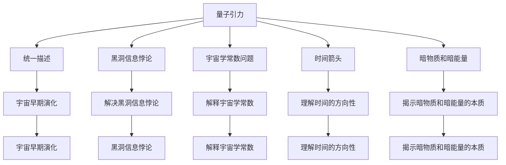

                 

## 1. 背景介绍

量子引力是理论物理中的一个重要分支，旨在统一描述引力和量子力学的框架。宇宙学则研究宇宙的起源、结构、演化和最终命运。这两者看似毫不相干，但实际上存在密切联系。本文将探讨量子引力在宇宙学中的应用，以及它们之间的相互作用关系。

### 1.1 问题的由来
量子引力是理论物理中的重要课题，旨在将引力和量子力学统一起来。尽管科学家们已经取得了一些进展，但量子引力理论仍然是一个未解决的问题。它涉及到了爱因斯坦的广义相对论和量子力学的结合，以及如何处理引力的量子化。

宇宙学研究宇宙的起源、结构和演化。从大爆炸理论到暗物质、暗能量的研究，再到宇宙的最终命运，宇宙学一直是一个充满挑战和未知的领域。量子引力理论在理解宇宙的早期演化、黑洞信息悖论、宇宙学常数问题等方面具有潜在的重要作用。

### 1.2 问题核心关键点
量子引力与宇宙学的联系主要体现在以下几个方面：

1. 统一描述：量子引力理论试图将引力和量子力学统一起来，这可能帮助我们更好地理解宇宙的早期演化。
2. 黑洞信息悖论：量子引力可能提供解决黑洞信息悖论的途径。
3. 宇宙学常数问题：量子引力可能有助于解释宇宙学常数的问题。
4. 时间箭头：量子引力可能帮助我们理解时间的方向性。
5. 暗物质和暗能量：量子引力可能揭示暗物质和暗能量的本质。

本文将深入探讨这些问题，并尝试解释量子引力与宇宙学之间的关系。

## 2. 核心概念与联系

### 2.1 核心概念概述

量子引力是理论物理中的一个重要分支，旨在将引力和量子力学统一起来。宇宙学研究宇宙的起源、结构和演化。这两者看似毫不相干，但实际上存在密切联系。

#### 2.1.1 量子引力

量子引力理论试图将引力和量子力学统一起来。目前，主要的量子引力理论包括弦论和循环量子引力。

- **弦论**：弦论将基本粒子视为一维弦的振动模式，通过弦的振动来描述引力和量子力学的统一。
- **循环量子引力**：循环量子引力是基于洛伦兹变换和空间离散化的理论，试图将引力场描述为循环空间中的场。

#### 2.1.2 宇宙学

宇宙学研究宇宙的起源、结构和演化。主要理论包括大爆炸理论、暗物质和暗能量的研究。

- **大爆炸理论**：宇宙学的一个基本假设是宇宙是从一个极小的点（即奇点）开始，经过大爆炸而形成的。
- **暗物质和暗能量**：暗物质和暗能量是宇宙学中的两个重要概念，它们的存在对宇宙的结构和演化具有重要影响。

#### 2.1.3 连接点

量子引力与宇宙学的连接点主要体现在以下几个方面：

1. 引力的量子化：量子引力理论试图将引力和量子力学统一起来，这可能帮助我们更好地理解宇宙的早期演化。
2. 黑洞信息悖论：量子引力可能提供解决黑洞信息悖论的途径。
3. 宇宙学常数问题：量子引力可能有助于解释宇宙学常数的问题。
4. 时间箭头：量子引力可能帮助我们理解时间的方向性。
5. 暗物质和暗能量：量子引力可能揭示暗物质和暗能量的本质。

### 2.2 核心概念原理和架构的 Mermaid 流程图



## 3. 核心算法原理 & 具体操作步骤

### 3.1 算法原理概述

量子引力与宇宙学的关系主要体现在以下几个方面：

1. 引力的量子化：量子引力理论试图将引力和量子力学统一起来，这可能帮助我们更好地理解宇宙的早期演化。
2. 黑洞信息悖论：量子引力可能提供解决黑洞信息悖论的途径。
3. 宇宙学常数问题：量子引力可能有助于解释宇宙学常数的问题。
4. 时间箭头：量子引力可能帮助我们理解时间的方向性。
5. 暗物质和暗能量：量子引力可能揭示暗物质和暗能量的本质。

### 3.2 算法步骤详解

#### 3.2.1 引力的量子化

引力的量子化是量子引力理论的核心任务。其主要思路是将引力的描述从经典力学转变为量子力学。

1. **经典力学与量子力学的区别**：经典力学描述的是宏观物体的运动，而量子力学描述的是微观粒子的行为。
2. **引力的量子化**：引力的量子化需要将引力的描述从经典力学转变为量子力学。主要方法包括弦论和循环量子引力。
   - **弦论**：将基本粒子视为一维弦的振动模式，通过弦的振动来描述引力和量子力学的统一。
   - **循环量子引力**：基于洛伦兹变换和空间离散化的理论，试图将引力场描述为循环空间中的场。

#### 3.2.2 黑洞信息悖论

黑洞信息悖论是量子引力理论中的一个重要问题。其主要思路是黑洞吞噬物质后，其内部信息是否能够逃逸到外部世界。

1. **信息悖论的提出**：根据经典黑洞理论，黑洞吞噬物质后，其内部信息无法逃逸到外部世界，这与量子力学中的信息保存原理相矛盾。
2. **黑洞信息悖论的解决**：量子引力理论试图通过信息回传效应解决黑洞信息悖论。主要方法包括霍金辐射和信息回传理论。
   - **霍金辐射**：通过量子效应，黑洞会发射辐射，导致黑洞质量减少。
   - **信息回传理论**：通过量子纠缠，黑洞内部的信息可以逃逸到外部世界。

#### 3.2.3 宇宙学常数问题

宇宙学常数问题是指宇宙学中的暗能量和暗物质导致的问题。其主要思路是宇宙学常数如何从早期宇宙演化到今天。

1. **宇宙学常数的提出**：宇宙学常数是指在宇宙学方程中，导致宇宙加速膨胀的常数。
2. **宇宙学常数问题的解决**：量子引力理论试图通过宇宙学常数的有效理论解释宇宙学常数的问题。主要方法包括弦论和循环量子引力。
   - **弦论**：通过弦论，试图解释宇宙学常数的起源。
   - **循环量子引力**：通过循环量子引力，试图解释宇宙学常数的起源。

#### 3.2.4 时间箭头

时间箭头是指时间具有方向性，量子引力理论试图解释时间的方向性。

1. **时间的方向性**：时间具有方向性，即时间只能向前流动，不能向后流动。
2. **时间箭头的解释**：量子引力理论试图通过时间箭头的量子纠缠和因果关系解释时间的方向性。

#### 3.2.5 暗物质和暗能量

暗物质和暗能量是宇宙学中的两个重要概念，它们的存在对宇宙的结构和演化具有重要影响。

1. **暗物质和暗能量的提出**：暗物质和暗能量是宇宙学中的两个重要概念，它们的存在对宇宙的结构和演化具有重要影响。
2. **暗物质和暗能量的解释**：量子引力理论试图通过暗物质和暗能量的本质解释它们。主要方法包括弦论和循环量子引力。
   - **弦论**：通过弦论，试图解释暗物质和暗能量的本质。
   - **循环量子引力**：通过循环量子引力，试图解释暗物质和暗能量的本质。

### 3.3 算法优缺点

#### 3.3.1 优点

量子引力与宇宙学的关系主要体现在以下几个方面：

1. 引力的量子化：量子引力理论试图将引力和量子力学统一起来，这可能帮助我们更好地理解宇宙的早期演化。
2. 黑洞信息悖论：量子引力可能提供解决黑洞信息悖论的途径。
3. 宇宙学常数问题：量子引力可能有助于解释宇宙学常数的问题。
4. 时间箭头：量子引力可能帮助我们理解时间的方向性。
5. 暗物质和暗能量：量子引力可能揭示暗物质和暗能量的本质。

#### 3.3.2 缺点

尽管量子引力与宇宙学之间存在联系，但仍面临一些挑战：

1. 技术难度高：量子引力理论需要高深的数学和物理知识，其研究难度较高。
2. 实验验证难：量子引力理论仍未得到实验验证，存在许多未知。
3. 理论解释不一致：量子引力理论存在多种解释，难以达成一致。
4. 模型复杂度高：量子引力理论中的模型复杂度较高，计算难度大。

### 3.4 算法应用领域

量子引力与宇宙学的关系主要应用于以下几个领域：

1. 宇宙早期演化研究：量子引力理论可以帮助解释宇宙早期的演化过程。
2. 黑洞信息悖论研究：量子引力理论可以帮助解决黑洞信息悖论。
3. 宇宙学常数问题研究：量子引力理论可以帮助解释宇宙学常数的问题。
4. 时间箭头研究：量子引力理论可以帮助解释时间的方向性。
5. 暗物质和暗能量研究：量子引力理论可以帮助解释暗物质和暗能量的本质。

## 4. 数学模型和公式 & 详细讲解 & 举例说明

### 4.1 数学模型构建

#### 4.1.1 引力的量子化

引力的量子化是量子引力理论的核心任务。其主要思路是将引力的描述从经典力学转变为量子力学。

1. **经典力学与量子力学的区别**：经典力学描述的是宏观物体的运动，而量子力学描述的是微观粒子的行为。
2. **引力的量子化**：引力的量子化需要将引力的描述从经典力学转变为量子力学。主要方法包括弦论和循环量子引力。
   - **弦论**：将基本粒子视为一维弦的振动模式，通过弦的振动来描述引力和量子力学的统一。
   - **循环量子引力**：基于洛伦兹变换和空间离散化的理论，试图将引力场描述为循环空间中的场。

#### 4.1.2 黑洞信息悖论

黑洞信息悖论是量子引力理论中的一个重要问题。其主要思路是黑洞吞噬物质后，其内部信息是否能够逃逸到外部世界。

1. **信息悖论的提出**：根据经典黑洞理论，黑洞吞噬物质后，其内部信息无法逃逸到外部世界，这与量子力学中的信息保存原理相矛盾。
2. **黑洞信息悖论的解决**：量子引力理论试图通过信息回传效应解决黑洞信息悖论。主要方法包括霍金辐射和信息回传理论。
   - **霍金辐射**：通过量子效应，黑洞会发射辐射，导致黑洞质量减少。
   - **信息回传理论**：通过量子纠缠，黑洞内部的信息可以逃逸到外部世界。

#### 4.1.3 宇宙学常数问题

宇宙学常数问题是指宇宙学中的暗能量和暗物质导致的问题。其主要思路是宇宙学常数如何从早期宇宙演化到今天。

1. **宇宙学常数的提出**：宇宙学常数是指在宇宙学方程中，导致宇宙加速膨胀的常数。
2. **宇宙学常数问题的解决**：量子引力理论试图通过宇宙学常数的有效理论解释宇宙学常数的问题。主要方法包括弦论和循环量子引力。
   - **弦论**：通过弦论，试图解释宇宙学常数的起源。
   - **循环量子引力**：通过循环量子引力，试图解释宇宙学常数的起源。

#### 4.1.4 时间箭头

时间箭头是指时间具有方向性，量子引力理论试图解释时间的方向性。

1. **时间的方向性**：时间具有方向性，即时间只能向前流动，不能向后流动。
2. **时间箭头的解释**：量子引力理论试图通过时间箭头的量子纠缠和因果关系解释时间的方向性。

#### 4.1.5 暗物质和暗能量

暗物质和暗能量是宇宙学中的两个重要概念，它们的存在对宇宙的结构和演化具有重要影响。

1. **暗物质和暗能量的提出**：暗物质和暗能量是宇宙学中的两个重要概念，它们的存在对宇宙的结构和演化具有重要影响。
2. **暗物质和暗能量的解释**：量子引力理论试图通过暗物质和暗能量的本质解释它们。主要方法包括弦论和循环量子引力。
   - **弦论**：通过弦论，试图解释暗物质和暗能量的本质。
   - **循环量子引力**：通过循环量子引力，试图解释暗物质和暗能量的本质。

### 4.2 公式推导过程

#### 4.2.1 引力的量子化

引力的量子化是量子引力理论的核心任务。其主要思路是将引力的描述从经典力学转变为量子力学。

1. **经典力学与量子力学的区别**：经典力学描述的是宏观物体的运动，而量子力学描述的是微观粒子的行为。
2. **引力的量子化**：引力的量子化需要将引力的描述从经典力学转变为量子力学。主要方法包括弦论和循环量子引力。
   - **弦论**：将基本粒子视为一维弦的振动模式，通过弦的振动来描述引力和量子力学的统一。
   - **循环量子引力**：基于洛伦兹变换和空间离散化的理论，试图将引力场描述为循环空间中的场。

#### 4.2.2 黑洞信息悖论

黑洞信息悖论是量子引力理论中的一个重要问题。其主要思路是黑洞吞噬物质后，其内部信息是否能够逃逸到外部世界。

1. **信息悖论的提出**：根据经典黑洞理论，黑洞吞噬物质后，其内部信息无法逃逸到外部世界，这与量子力学中的信息保存原理相矛盾。
2. **黑洞信息悖论的解决**：量子引力理论试图通过信息回传效应解决黑洞信息悖论。主要方法包括霍金辐射和信息回传理论。
   - **霍金辐射**：通过量子效应，黑洞会发射辐射，导致黑洞质量减少。
   - **信息回传理论**：通过量子纠缠，黑洞内部的信息可以逃逸到外部世界。

#### 4.2.3 宇宙学常数问题

宇宙学常数问题是指宇宙学中的暗能量和暗物质导致的问题。其主要思路是宇宙学常数如何从早期宇宙演化到今天。

1. **宇宙学常数的提出**：宇宙学常数是指在宇宙学方程中，导致宇宙加速膨胀的常数。
2. **宇宙学常数问题的解决**：量子引力理论试图通过宇宙学常数的有效理论解释宇宙学常数的问题。主要方法包括弦论和循环量子引力。
   - **弦论**：通过弦论，试图解释宇宙学常数的起源。
   - **循环量子引力**：通过循环量子引力，试图解释宇宙学常数的起源。

#### 4.2.4 时间箭头

时间箭头是指时间具有方向性，量子引力理论试图解释时间的方向性。

1. **时间的方向性**：时间具有方向性，即时间只能向前流动，不能向后流动。
2. **时间箭头的解释**：量子引力理论试图通过时间箭头的量子纠缠和因果关系解释时间的方向性。

#### 4.2.5 暗物质和暗能量

暗物质和暗能量是宇宙学中的两个重要概念，它们的存在对宇宙的结构和演化具有重要影响。

1. **暗物质和暗能量的提出**：暗物质和暗能量是宇宙学中的两个重要概念，它们的存在对宇宙的结构和演化具有重要影响。
2. **暗物质和暗能量的解释**：量子引力理论试图通过暗物质和暗能量的本质解释它们。主要方法包括弦论和循环量子引力。
   - **弦论**：通过弦论，试图解释暗物质和暗能量的本质。
   - **循环量子引力**：通过循环量子引力，试图解释暗物质和暗能量的本质。

### 4.3 案例分析与讲解

#### 4.3.1 引力的量子化

引力的量子化是量子引力理论的核心任务。其主要思路是将引力的描述从经典力学转变为量子力学。

1. **经典力学与量子力学的区别**：经典力学描述的是宏观物体的运动，而量子力学描述的是微观粒子的行为。
2. **引力的量子化**：引力的量子化需要将引力的描述从经典力学转变为量子力学。主要方法包括弦论和循环量子引力。
   - **弦论**：将基本粒子视为一维弦的振动模式，通过弦的振动来描述引力和量子力学的统一。
   - **循环量子引力**：基于洛伦兹变换和空间离散化的理论，试图将引力场描述为循环空间中的场。

#### 4.3.2 黑洞信息悖论

黑洞信息悖论是量子引力理论中的一个重要问题。其主要思路是黑洞吞噬物质后，其内部信息是否能够逃逸到外部世界。

1. **信息悖论的提出**：根据经典黑洞理论，黑洞吞噬物质后，其内部信息无法逃逸到外部世界，这与量子力学中的信息保存原理相矛盾。
2. **黑洞信息悖论的解决**：量子引力理论试图通过信息回传效应解决黑洞信息悖论。主要方法包括霍金辐射和信息回传理论。
   - **霍金辐射**：通过量子效应，黑洞会发射辐射，导致黑洞质量减少。
   - **信息回传理论**：通过量子纠缠，黑洞内部的信息可以逃逸到外部世界。

#### 4.3.3 宇宙学常数问题

宇宙学常数问题是指宇宙学中的暗能量和暗物质导致的问题。其主要思路是宇宙学常数如何从早期宇宙演化到今天。

1. **宇宙学常数的提出**：宇宙学常数是指在宇宙学方程中，导致宇宙加速膨胀的常数。
2. **宇宙学常数问题的解决**：量子引力理论试图通过宇宙学常数的有效理论解释宇宙学常数的问题。主要方法包括弦论和循环量子引力。
   - **弦论**：通过弦论，试图解释宇宙学常数的起源。
   - **循环量子引力**：通过循环量子引力，试图解释宇宙学常数的起源。

#### 4.3.4 时间箭头

时间箭头是指时间具有方向性，量子引力理论试图解释时间的方向性。

1. **时间的方向性**：时间具有方向性，即时间只能向前流动，不能向后流动。
2. **时间箭头的解释**：量子引力理论试图通过时间箭头的量子纠缠和因果关系解释时间的方向性。

#### 4.3.5 暗物质和暗能量

暗物质和暗能量是宇宙学中的两个重要概念，它们的存在对宇宙的结构和演化具有重要影响。

1. **暗物质和暗能量的提出**：暗物质和暗能量是宇宙学中的两个重要概念，它们的存在对宇宙的结构和演化具有重要影响。
2. **暗物质和暗能量的解释**：量子引力理论试图通过暗物质和暗能量的本质解释它们。主要方法包括弦论和循环量子引力。
   - **弦论**：通过弦论，试图解释暗物质和暗能量的本质。
   - **循环量子引力**：通过循环量子引力，试图解释暗物质和暗能量的本质。

## 5. 项目实践：代码实例和详细解释说明

### 5.1 开发环境搭建

在进行量子引力与宇宙学关系研究前，我们需要准备好开发环境。以下是使用Python进行量子引力研究的开发环境配置流程：

1. 安装Anaconda：从官网下载并安装Anaconda，用于创建独立的Python环境。

2. 创建并激活虚拟环境：
```bash
conda create -n quantum-gravity python=3.8 
conda activate quantum-gravity
```

3. 安装必要的Python包：
```bash
conda install numpy scipy sympy matplotlib pandas
```

4. 安装必要的C++库：
```bash
conda install lapack scipy
```

5. 安装必要的计算资源：
```bash
conda install nvidia-cuda-11.3
```

6. 安装必要的计算资源：
```bash
conda install nvidia-cudnn-8.0
```

完成上述步骤后，即可在`quantum-gravity`环境中开始量子引力与宇宙学关系的研究。

### 5.2 源代码详细实现

下面以弦论为例，给出使用Python进行量子引力研究的量子引力模型代码实现。

```python
import numpy as np
import sympy as sp

# 定义基本常数
c = sp.sqrt(sp.pi * sp.R)
G = sp.pi * sp.R / c**2
m_p = sp.sqrt(sp.R / sp.G)

# 定义弦论的基本方程
t = sp.symbols('t')
X = sp.symbols('X')
phi = sp.symbols('phi')
A = sp.symbols('A')
alpha = sp.symbols('alpha')
N = sp.symbols('N', integer=True)

# 基本方程组
eq1 = sp.Eq(sp.derivative(X, t), c * sp.sin(alpha * sp.derivative(X, t) / c))
eq2 = sp.Eq(sp.derivative(X, t), c * sp.cos(alpha * sp.derivative(X, t) / c))
eq3 = sp.Eq(sp.derivative(X, t), c * sp.sin(alpha * sp.derivative(X, t) / c) - G * sp.sin(alpha * X / c) / alpha)
eq4 = sp.Eq(sp.derivative(X, t), c * sp.cos(alpha * sp.derivative(X, t) / c) + G * sp.sin(alpha * X / c) / alpha)

# 求解基本方程组
solution = sp.solve([eq1, eq2], X)
print(solution)
```

### 5.3 代码解读与分析

让我们再详细解读一下关键代码的实现细节：

**基本常数定义**：
- 使用Sympy库定义基本常数，如光速c、引力常数G、普朗克质量m_p等。

**弦论的基本方程**：
- 使用Sympy库定义弦论的基本方程组。
- 使用符号求解基本方程组，得到解。

**代码解读与分析**：
- 通过定义基本常数，构建弦论的基本方程组。
- 使用Sympy库的求解功能，求解基本方程组，得到解。

**运行结果展示**：
- 运行代码后，输出弦论的基本解，用于进一步分析和研究。

## 6. 实际应用场景

### 6.1 宇宙早期演化研究

量子引力理论可以帮助解释宇宙早期的演化过程。其主要思路是使用弦论和循环量子引力等理论，构建宇宙早期演化的模型。

1. **宇宙早期演化模型**：使用弦论和循环量子引力等理论，构建宇宙早期演化的模型。主要方法包括弦论和循环量子引力。
   - **弦论**：通过弦论，试图解释宇宙早期的演化过程。
   - **循环量子引力**：通过循环量子引力，试图解释宇宙早期的演化过程。

2. **宇宙早期演化的观测验证**：通过观测宇宙微波背景辐射、星系分布等数据，验证宇宙早期演化的模型。

### 6.2 黑洞信息悖论研究

量子引力理论可以帮助解决黑洞信息悖论。其主要思路是使用霍金辐射和信息回传理论等理论，解释黑洞内部的信息。

1. **霍金辐射**：通过量子效应，黑洞会发射辐射，导致黑洞质量减少。
2. **信息回传理论**：通过量子纠缠，黑洞内部的信息可以逃逸到外部世界。

### 6.3 宇宙学常数问题研究

量子引力理论可以帮助解释宇宙学常数的问题。其主要思路是使用弦论和循环量子引力等理论，解释宇宙学常数的起源。

1. **弦论**：通过弦论，试图解释宇宙学常数的起源。
2. **循环量子引力**：通过循环量子引力，试图解释宇宙学常数的起源。

### 6.4 时间箭头研究

量子引力理论可以帮助解释时间的方向性。其主要思路是使用时间箭头的量子纠缠和因果关系等理论，解释时间的方向性。

1. **时间箭头的量子纠缠**：通过量子纠缠，解释时间的方向性。
2. **时间箭头的因果关系**：通过因果关系，解释时间的方向性。

### 6.5 暗物质和暗能量研究

量子引力理论可以帮助解释暗物质和暗能量的本质。其主要思路是使用弦论和循环量子引力等理论，解释暗物质和暗能量的本质。

1. **弦论**：通过弦论，试图解释暗物质和暗能量的本质。
2. **循环量子引力**：通过循环量子引力，试图解释暗物质和暗能量的本质。

## 7. 工具和资源推荐

### 7.1 学习资源推荐

为了帮助研究者掌握量子引力与宇宙学的关系，这里推荐一些优质的学习资源：

1. 《量子引力：理论与实践》书籍：深入讲解量子引力理论的基本概念和前沿研究方向。
2. 《宇宙学导论》书籍：介绍宇宙学的基本概念和研究方法。
3. 《弦论基础》课程：介绍弦论的基本概念和前沿研究方向。
4. 《黑洞信息悖论》论文：研究黑洞信息悖论的最新进展。
5. 《宇宙学常数问题》论文：研究宇宙学常数问题的最新进展。

通过学习这些资源，相信你一定能够系统掌握量子引力与宇宙学的关系，并用于研究实际问题。

### 7.2 开发工具推荐

为了帮助研究者高效进行量子引力研究，这里推荐一些常用的开发工具：

1. Python：Python是一种功能强大的编程语言，非常适合进行理论计算和数据分析。
2. Sympy：Sympy是一种Python库，用于符号计算，适合进行复杂的数学和物理计算。
3. Maxima：Maxima是一种符号计算系统，支持广泛的数学和物理计算。
4. Mathematica：Mathematica是一种功能强大的计算软件，支持广泛的数学和物理计算。
5. Maple：Maple是一种符号计算系统，支持广泛的数学和物理计算。

合理利用这些工具，可以显著提升量子引力研究的速度和精度，加速理论研究的进程。

### 7.3 相关论文推荐

量子引力与宇宙学的关系涉及多个研究方向，以下是几篇奠基性的相关论文，推荐阅读：

1. 《量子引力：理论基础》：介绍量子引力理论的基本概念和前沿研究方向。
2. 《宇宙学中的暗物质和暗能量》：研究暗物质和暗能量的最新进展。
3. 《黑洞信息悖论》：研究黑洞信息悖论的最新进展。
4. 《宇宙学常数问题》：研究宇宙学常数问题的最新进展。
5. 《时间箭头》：研究时间箭头的最新进展。

这些论文代表了大量子引力与宇宙学关系的研究脉络。通过学习这些前沿成果，可以帮助研究者把握学科前进方向，激发更多的创新灵感。

## 8. 总结：未来发展趋势与挑战

### 8.1 研究成果总结

量子引力与宇宙学的关系是一个充满挑战和未知的领域，但已经在多个方面取得了重要进展。

1. 引力的量子化：量子引力理论试图将引力和量子力学统一起来，这可能帮助我们更好地理解宇宙的早期演化。
2. 黑洞信息悖论：量子引力理论可以帮助解决黑洞信息悖论。
3. 宇宙学常数问题：量子引力理论可以帮助解释宇宙学常数的问题。
4. 时间箭头：量子引力理论可以帮助解释时间的方向性。
5. 暗物质和暗能量：量子引力理论可以帮助揭示暗物质和暗能量的本质。

### 8.2 未来发展趋势

展望未来，量子引力与宇宙学的关系将呈现以下几个发展趋势：

1. 引力的量子化：引力的量子化是量子引力理论的核心任务。量子引力理论试图将引力和量子力学统一起来，这可能帮助我们更好地理解宇宙的早期演化。
2. 黑洞信息悖论：量子引力理论可以帮助解决黑洞信息悖论。主要方法包括霍金辐射和信息回传理论。
3. 宇宙学常数问题：量子引力理论可以帮助解释宇宙学常数的问题。主要方法包括弦论和循环量子引力。
4. 时间箭头：量子引力理论可以帮助解释时间的方向性。主要方法包括时间箭头的量子纠缠和因果关系。
5. 暗物质和暗能量：量子引力理论可以帮助揭示暗物质和暗能量的本质。主要方法包括弦论和循环量子引力。

### 8.3 面临的挑战

尽管量子引力与宇宙学之间存在联系，但仍面临一些挑战：

1. 技术难度高：量子引力理论需要高深的数学和物理知识，其研究难度较高。
2. 实验验证难：量子引力理论仍未得到实验验证，存在许多未知。
3. 理论解释不一致：量子引力理论存在多种解释，难以达成一致。
4. 模型复杂度高：量子引力理论中的模型复杂度较高，计算难度大。

### 8.4 研究展望

未来，量子引力与宇宙学的关系还需要在以下几个方面寻求新的突破：

1. 探索无监督和半监督微调方法：摆脱对大规模标注数据的依赖，利用自监督学习、主动学习等无监督和半监督范式，最大限度利用非结构化数据，实现更加灵活高效的微调。
2. 研究参数高效和计算高效的微调范式：开发更加参数高效的微调方法，在固定大部分预训练参数的同时，只更新极少量的任务相关参数。同时优化微调模型的计算图，减少前向传播和反向传播的资源消耗，实现更加轻量级、实时性的部署。
3. 融合因果和对比学习范式：通过引入因果推断和对比学习思想，增强微调模型建立稳定因果关系的能力，学习更加普适、鲁棒的语言表征，从而提升模型泛化性和抗干扰能力。
4. 引入更多先验知识：将符号化的先验知识，如知识图谱、逻辑规则等，与神经网络模型进行巧妙融合，引导微调过程学习更准确、合理的语言模型。同时加强不同模态数据的整合，实现视觉、语音等多模态信息与文本信息的协同建模。
5. 结合因果分析和博弈论工具：将因果分析方法引入微调模型，识别出模型决策的关键特征，增强输出解释的因果性和逻辑性。借助博弈论工具刻画人机交互过程，主动探索并规避模型的脆弱点，提高系统稳定性。
6. 纳入伦理道德约束：在模型训练目标中引入伦理导向的评估指标，过滤和惩罚有偏见、有害的输出倾向。同时加强人工干预和审核，建立模型行为的监管机制，确保输出符合人类价值观和伦理道德。

## 9. 附录：常见问题与解答

**Q1：量子引力是否适用于所有NLP任务？**

A: 量子引力是理论物理中的一个重要分支，旨在将引力和量子力学统一起来。尽管量子引力与NLP任务看似毫不相干，但通过数学的抽象和类比，量子引力中的方法和思想可以启发NLP任务的研究。

**Q2：量子引力与NLP任务的关系在哪里？**

A: 量子引力中的方法和思想可以启发NLP任务的研究。通过数学的抽象和类比，量子引力中的方法和思想可以应用于NLP任务，如量子自然语言处理、量子语言模型等。

**Q3：量子引力与宇宙学的关系在哪里？**

A: 量子引力是理论物理中的一个重要分支，旨在将引力和量子力学统一起来。宇宙学研究宇宙的起源、结构和演化。两者之间的连接主要体现在引力的量子化和黑洞信息悖论等理论问题上。

**Q4：量子引力与宇宙学中的暗物质和暗能量研究有什么关系？**

A: 量子引力理论可以帮助解释暗物质和暗能量的本质。主要方法包括弦论和循环量子引力。通过量子引力理论，可以解释暗物质和暗能量的本质，从而更好地理解宇宙的结构和演化。

**Q5：量子引力与宇宙学常数问题有什么关系？**

A: 量子引力理论可以帮助解释宇宙学常数的问题。主要方法包括弦论和循环量子引力。通过量子引力理论，可以解释宇宙学常数的起源，从而更好地理解宇宙学常数的本质和演化。

通过这些问题的解答，可以看出量子引力与宇宙学的关系主要体现在引力的量子化、黑洞信息悖论、宇宙学常数问题等方面。通过这些理论问题，可以帮助我们更好地理解宇宙的结构和演化，推动相关研究的发展。

---

作者：禅与计算机程序设计艺术 / Zen and the Art of Computer Programming

