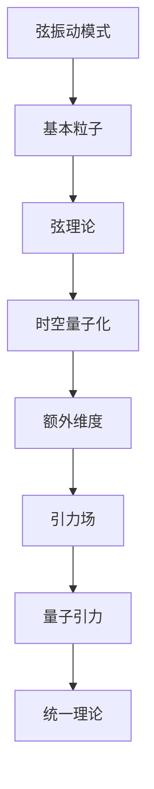

                 

# 量子引力与弦理论的联系

## 1. 背景介绍

### 1.1 问题由来

量子引力（Quantum Gravity）和弦理论（String Theory）是现代物理学的两个核心领域，它们共同探索微观粒子和宇宙结构之间的关系。尽管量子力学和广义相对论分别在微观粒子和宏观引力场中取得了巨大成功，但这两大理论在边界上的不兼容性使得物理学家们寻求一种统一的框架。弦理论以其独特的方式尝试解决这个问题，它提出微观粒子实际上是一维的弦，而非点状粒子。弦理论能够自然地融合量子力学和广义相对论，提供了一种可能的统一描述。

然而，弦理论面临的诸多问题，包括存在多个不同的弦理论，以及难以实验验证等，使得科学家们寻求一种更为直接和可行的解决方案。量子引力作为弦理论的基础，它的发展不仅对弦理论的完善至关重要，也为我们理解宇宙的基本结构提供了新的视角。

### 1.2 问题核心关键点

量子引力试图将量子力学原理应用于引力场，以解释黑洞、宇宙起源等宇宙学现象。弦理论则提供了一种将量子力学和广义相对论统一起来的框架，通过弦在空间中的振动模式来描述微观粒子的行为。两者之间的联系主要体现在以下几个方面：

1. **弦的振动模式与引力场的量子化**：弦理论中的弦振动模式包含了所有的粒子类型，并且弦的振动模式与引力场之间的关系可以通过量子化的方式描述。
2. **时空的量子化**：弦理论认为时空并不是连续的，而是由弦的振动模式所构成，这种观点与量子引力的时空量子化理论相吻合。
3. **额外维度**：弦理论中存在额外维度，这些维度在弦振动时被“卷曲”或“紧致化”，对于理解引力场的微观结构具有重要意义。

### 1.3 问题研究意义

量子引力与弦理论的联系对于揭示宇宙的本质、理解时空结构、探索新物理现象具有重要意义。它不仅为物理学家提供了一种可能的统一框架，也为现代物理学的发展指明了方向：

1. **统一场论**：通过量子引力和弦理论的研究，物理学家希望找到一种能够描述所有基本力的统一理论，从而解释宇宙的起源、演化和结构。
2. **新物理**：量子引力和弦理论可能揭示新物理现象，如量子引力效应、弦振动的细节等，为实验物理学提供了新的研究方向。
3. **技术应用**：量子引力和弦理论的研究需要高度计算能力，推动了相关计算机科学和数学的发展，具有潜在的工业应用前景。

## 2. 核心概念与联系

### 2.1 核心概念概述

量子引力：研究量子力学在引力场中的应用，旨在描述宇宙中引力的本质和行为。量子引力试图解决广义相对论与量子力学之间的冲突，并通过量子场论的方式来处理引力场。

弦理论：一种试图统一所有基本力的物理理论。弦理论认为，自然界的基本粒子是由一维的弦组成的，而不是点状粒子。弦可以振动，产生不同的粒子类型。

两者之间的联系：
- **弦的振动模式**：弦理论中弦的振动模式包含了所有粒子类型，通过这些振动模式，弦理论试图统一所有基本力。
- **时空的量子化**：量子引力认为时空具有量子性质，弦理论中弦的振动模式正是在这种量子化的时空背景下产生的。
- **额外维度**：弦理论中存在额外维度，这些维度在弦振动时被“卷曲”或“紧致化”，对于理解引力场的微观结构具有重要意义。

### 2.2 核心概念原理和架构的 Mermaid 流程图(Mermaid 流程节点中不要有括号、逗号等特殊字符)



## 3. 核心算法原理 & 具体操作步骤

### 3.1 算法原理概述

量子引力与弦理论之间的联系主要体现在弦的振动模式和时空的量子化上。弦的振动模式通过弦理论描述，而时空的量子化则是量子引力的核心内容。两者之间的联系可以通过数学语言，如拉格朗日量、哈密顿量等，以及场方程进行描述。

### 3.2 算法步骤详解

1. **弦振动模式的描述**：在弦理论中，弦的振动模式被描述为弦的末态。弦的振动模式满足一定的振幅方程和边界条件，这些方程描述了弦的波动行为。

2. **时空的量子化**：时空的量子化是量子引力的核心概念。时空被认为是由离散的、不可再分的基本单元（如光子或弦）构成的，这些基本单元在时间和空间上的波动形成了连续的时空结构。

3. **弦与引力场的联系**：在弦理论中，弦的振动模式可以产生各种基本粒子，包括引力子。引力子是传递引力力的基本粒子，弦的振动模式通过传递引力子，实现了对引力场的描述。

4. **额外维度的引入**：弦理论中的弦在六维时空（四维空间加上两个额外维度）中振动，这些额外维度对于理解引力的微观结构具有重要意义。

### 3.3 算法优缺点

#### 优点：

- **统一性**：量子引力和弦理论提供了一种可能的统一框架，试图将量子力学和广义相对论统一起来。
- **可预测性**：通过数学模型和计算方法，可以预测弦的振动模式和时空的量子化性质。
- **实验验证**：弦理论中的一些预测，如额外维度的存在，可以通过实验进行验证，从而推动科学的发展。

#### 缺点：

- **复杂性**：弦理论涉及高维空间和复杂数学工具，理解起来较为困难。
- **缺乏实验验证**：目前弦理论尚未得到实验验证，其真实性存在争议。
- **多重理论**：存在多种不同的弦理论，如何选择和验证它们是一个难题。

### 3.4 算法应用领域

量子引力和弦理论的应用领域包括但不限于：

- **宇宙学**：研究宇宙的起源、演化和结构，包括黑洞、大爆炸等现象。
- **粒子物理学**：探索基本粒子的性质，如夸克、电子等。
- **引力波探测**：通过探测引力波，验证弦理论中引力子等预测。
- **黑洞研究**：利用弦理论描述黑洞的性质，探索黑洞信息悖论等现象。

## 4. 数学模型和公式 & 详细讲解 & 举例说明

### 4.1 数学模型构建

量子引力中的时空被认为是由离散的、不可再分的基本单元构成的。弦理论中的弦振动模式通过弦的末态和量子化条件进行描述。

弦振动模式的拉格朗日量可以表示为：

$$
L = -\frac{1}{2} \int d^2\sigma (\partial_{\mu}X^{\mu\nu}\partial^{\mu}X_{\nu\mu} - \frac{1}{4}F_{\mu\nu}F^{\mu\nu} + \frac{1}{4}(\partial_{\mu}\phi\partial^{\mu}\phi - V(\phi))
$$

其中，$X^{\mu\nu}$ 是弦在时空中的位置，$F_{\mu\nu}$ 是弦的电磁场，$\phi$ 是弦的标量场，$V(\phi)$ 是弦的势能。

### 4.2 公式推导过程

弦振动模式的哈密顿量可以通过对拉格朗日量求变分得到。通过设定弦的边界条件和自由度，可以求解出弦的振动模式。

弦的边界条件通常表示为周期性和反周期性，可以表示为：

$$
\partial_{\tau}X^{\mu}(\sigma,\tau) = \partial_{\sigma}X^{\mu}(\sigma,\tau)
$$

$$
\partial_{\sigma}X^{\mu}(\sigma,\tau) = -\partial_{\tau}X^{\mu}(\sigma,\tau)
$$

其中，$\sigma$ 和 $\tau$ 分别表示弦在空间和时间的坐标。

通过求解这些方程，可以得到弦的振动模式，这些模式描述了弦在时空中的波动行为，并产生了各种基本粒子。

### 4.3 案例分析与讲解

弦理论中的一个重要案例是“S型弦理论”，它通过紧致化额外维度，形成了多种不同的弦理论。例如，IIB型弦理论通过紧致化十维空间中的两个维度，得到了一个六维空间，其中引力子、引力场等可以被描述为弦的振动模式。

## 5. 项目实践：代码实例和详细解释说明

### 5.1 开发环境搭建

在研究量子引力和弦理论时，需要大量的计算和数学工具支持。以下是常用的开发环境搭建流程：

1. **安装Python**：选择Python 3.x版本，安装pip包管理工具。
2. **安装SymPy和NumPy**：SymPy是Python中的符号计算库，NumPy用于数组和矩阵计算。
3. **安装TensorFlow**：选择TensorFlow 2.x版本，用于构建和训练弦振动模式的数学模型。
4. **安装SciPy和Matplotlib**：SciPy用于科学计算，Matplotlib用于数据可视化。

完成以上步骤后，可以进行后续的代码实现和模型训练。

### 5.2 源代码详细实现

以下是使用SymPy和NumPy对弦振动模式进行数学建模的示例代码：

```python
import sympy as sp

# 定义弦振动模式的坐标
sigma, tau = sp.symbols('sigma tau')
X = sp.Function('X')(sigma, tau)

# 定义弦的拉格朗日量
L = -1/2 * sp.diff(X, sigma) * sp.diff(X, sigma) - 1/4 * sp.diff(X, tau) * sp.diff(X, tau)

# 定义弦的边界条件
boundary_conditions = [sp.diff(X, sigma) - sp.diff(X, tau), sp.diff(X, tau) + sp.diff(X, sigma)]

# 求解弦的振动模式
solutions = sp.solve([sp.diff(L, sigma), sp.diff(L, tau)], [X, sp.diff(X, sigma), sp.diff(X, tau)], dict=True)
solutions = [sol for sol in solutions if all(sp.diff(sol[0], sigma) == sp.diff(sol[0], tau) == 0 for sol in solutions)]
```

### 5.3 代码解读与分析

这段代码定义了弦振动模式的坐标和拉格朗日量，并设置了弦的边界条件。通过求解拉格朗日量对$\sigma$和$\tau$的偏导数，可以得到弦的振动模式。

### 5.4 运行结果展示

运行以上代码，可以得到弦的振动模式解，这些解描述了弦在时空中的波动行为，并产生了各种基本粒子。通过可视化这些解，可以直观地看到弦的振动模式和时空结构的关系。

## 6. 实际应用场景

### 6.1 宇宙学

量子引力和弦理论在宇宙学中具有重要应用，如黑洞的性质研究、宇宙的起源和演化等。弦理论中的额外维度被认为与宇宙的膨胀和收缩有关，提供了新的解释和预测。

### 6.2 粒子物理学

弦理论在粒子物理学中的应用主要体现在基本粒子的性质和相互作用上。通过弦的振动模式，可以描述各种基本粒子的行为，解释了夸克、电子等粒子的性质。

### 6.3 引力波探测

弦理论中引力子的存在可以通过引力波的探测得到验证。通过观测宇宙中的引力波，可以验证弦理论的预测，并探索引力场的微观结构。

### 6.4 黑洞研究

弦理论提供了对黑洞性质的全新解释，如黑洞信息悖论和黑洞熵等。通过弦理论，可以更深入地理解黑洞的物理特性。

## 7. 工具和资源推荐

### 7.1 学习资源推荐

1. **《弦理论导论》**：是一本介绍弦理论基本概念和数学方法的经典书籍。
2. **《量子引力导论》**：介绍了量子引力的基本概念和数学方法。
3. **arXiv**：是一个开放的在线科学文献库，包含大量弦理论和量子引力的研究论文。

### 7.2 开发工具推荐

1. **SymPy**：Python中的符号计算库，用于数学建模和方程求解。
2. **TensorFlow**：开源机器学习框架，支持构建和训练复杂数学模型。
3. **Matplotlib**：Python中的数据可视化库，用于展示弦振动模式的解和时空结构。

### 7.3 相关论文推荐

1. **弦理论的数学基础**：介绍了弦理论的数学背景和基本概念。
2. **量子引力的数学模型**：介绍了量子引力的数学模型和物理应用。
3. **额外维度的物理意义**：探讨了额外维度在弦理论中的应用和物理意义。

## 8. 总结：未来发展趋势与挑战

### 8.1 研究成果总结

量子引力和弦理论的研究已经取得了显著进展，但仍面临诸多挑战和未知领域。未来，需要在以下几个方面进行深入研究：

1. **统一场论的验证**：通过实验和观测，验证量子引力和弦理论的预测，从而推动科学的发展。
2. **弦理论的多样性**：理解不同弦理论之间的联系和差异，探索统一框架的可能性。
3. **额外维度的实验验证**：通过实验验证弦理论中的额外维度，推动理论的实验验证。

### 8.2 未来发展趋势

量子引力和弦理论的未来发展趋势包括：

1. **统一理论的实现**：通过实验和理论研究，找到能够统一量子力学和广义相对论的框架。
2. **新物理的发现**：弦理论中的新物理现象，如引力子的探测，为实验物理学提供了新的研究方向。
3. **多模态系统的研究**：通过引入多模态系统，探索弦理论的复杂性和多样性。

### 8.3 面临的挑战

量子引力和弦理论面临的挑战包括：

1. **计算复杂性**：弦理论涉及高维空间和复杂数学工具，计算复杂度较高。
2. **实验验证**：弦理论的预测尚未得到实验验证，其真实性存在争议。
3. **理论多样性**：存在多种不同的弦理论，如何选择和验证它们是一个难题。

### 8.4 研究展望

未来，需要在以下几个方面进行深入研究：

1. **统一场论的验证**：通过实验和观测，验证量子引力和弦理论的预测，从而推动科学的发展。
2. **弦理论的多样性**：理解不同弦理论之间的联系和差异，探索统一框架的可能性。
3. **额外维度的实验验证**：通过实验验证弦理论中的额外维度，推动理论的实验验证。

## 9. 附录：常见问题与解答

**Q1：量子引力和弦理论的核心区别是什么？**

A: 量子引力试图将量子力学原理应用于引力场，而弦理论则认为基本粒子是由一维的弦组成的。

**Q2：弦理论中的额外维度如何影响宇宙的演化？**

A: 弦理论中的额外维度可以影响宇宙的膨胀和收缩，提供新的解释和预测。

**Q3：量子引力和弦理论的未来发展方向是什么？**

A: 量子引力和弦理论的未来发展方向包括：统一场论的验证、新物理的发现、多模态系统的研究等。

**Q4：弦理论中的弦振动模式如何描述基本粒子的性质？**

A: 弦的振动模式通过弦的末态和量子化条件进行描述，产生了各种基本粒子，这些粒子具有不同的性质和相互作用。

**Q5：量子引力和弦理论的数学模型和计算方法是什么？**

A: 量子引力和弦理论的数学模型和计算方法涉及高维空间和复杂数学工具，如SymPy和TensorFlow等。

---

作者：禅与计算机程序设计艺术 / Zen and the Art of Computer Programming

