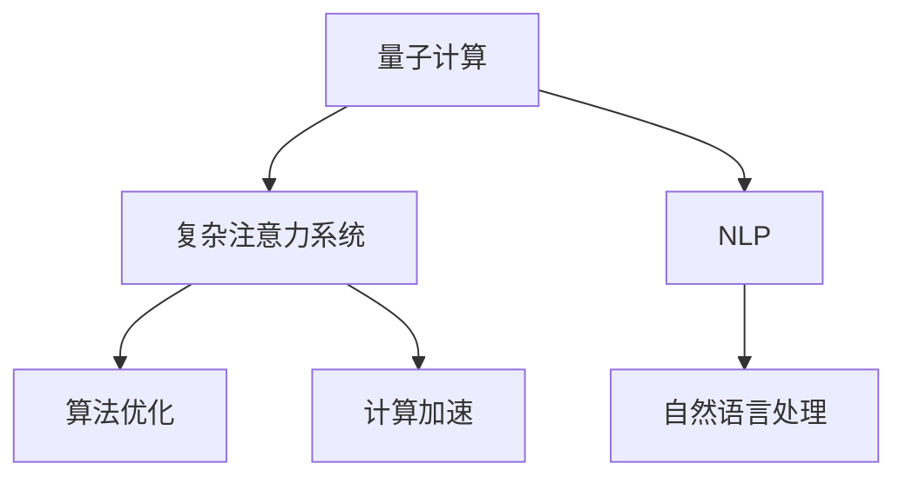

                 

# 量子计算在复杂注意力系统模拟中的应用

> 关键词：量子计算,复杂注意力系统,算法优化,计算加速,自然语言处理,NLP

## 1. 背景介绍

### 1.1 问题由来
在过去的几十年中，自然语言处理（NLP）领域取得了长足的进步，特别是在深度学习模型和注意力机制的推动下。这些模型，如Transformer，已经在机器翻译、文本摘要、情感分析等任务中展现出了卓越的性能。然而，随着模型规模的不断扩大，计算资源的消耗也日益增加，限制了这些模型的应用范围。

量子计算作为一种革命性的计算方式，具有指数级的计算加速能力，在处理大规模数据和复杂计算任务方面具有巨大的潜力。近年来，量子计算在复杂注意力系统的模拟和优化方面展现出了初步的潜力。本文将详细探讨量子计算在复杂注意力系统模拟中的应用，包括量子计算的基本概念、算法原理以及实际应用场景。

### 1.2 问题核心关键点
量子计算在复杂注意力系统模拟中的应用，主要集中在以下几个方面：

- 量子算法的设计：如何设计能够有效模拟注意力机制的量子算法。
- 量子加速：量子计算的并行性能否显著加速注意力系统的训练和推理。
- 量子硬件的挑战：现有量子硬件的限制对算法实施的制约。
- 实际应用：如何在实际NLP任务中应用量子计算。

这些关键点构成了量子计算在复杂注意力系统模拟中的应用框架，帮助我们理解量子计算对NLP领域的影响和潜力。

### 1.3 问题研究意义
研究量子计算在复杂注意力系统模拟中的应用，对于提升NLP任务的性能、降低计算成本、拓展计算能力具有重要意义：

1. 性能提升：量子计算可以加速注意力机制的学习和推理过程，提升模型的准确性和效率。
2. 成本降低：量子计算可以显著减少训练和推理的计算资源消耗，降低企业采用深度学习模型的成本。
3. 能力拓展：量子计算可以处理更复杂的计算任务，为NLP模型的进一步发展提供新的可能性。
4. 技术创新：量子计算的应用探索，有助于推动计算领域的重大技术突破。
5. 应用拓展：量子计算可以应用于更多领域的自然语言处理，如语音识别、图像处理等，推动人工智能技术的普及和应用。

## 2. 核心概念与联系

### 2.1 核心概念概述

为更好地理解量子计算在复杂注意力系统模拟中的应用，本节将介绍几个关键概念：

- 量子计算：利用量子叠加态和量子纠缠等量子特性进行计算的计算范式。量子计算能够通过量子位（qubit）的叠加和纠缠，实现大规模并行计算，显著提高计算效率。
- 复杂注意力系统：指具有多层次、多通道的注意力机制的深度学习模型，如Transformer等。这些模型在NLP任务中展现出卓越的性能。
- 算法优化：在量子计算框架下，设计优化算法，以适应量子硬件的限制，实现高效的量子计算。
- 计算加速：通过量子计算加速注意力系统的训练和推理过程，提升模型的性能和效率。
- 自然语言处理（NLP）：利用计算和语言学方法，实现对人类语言理解和生成的一系列技术。

这些概念之间的逻辑关系可以通过以下Mermaid流程图来展示：



这个流程图展示了大语言模型和微调的关键概念及其之间的关系：

1. 量子计算作为计算范式，能够为复杂注意力系统的模拟提供新的计算手段。
2. 复杂注意力系统作为深度学习模型，能够利用量子计算的优势，提升计算效率。
3. 算法优化和计算加速是实现量子计算优势的关键步骤。
4. NLP作为应用领域，通过复杂注意力系统，结合量子计算，可以实现更加高效和精确的自然语言处理。

## 3. 核心算法原理 & 具体操作步骤
### 3.1 算法原理概述

量子计算在复杂注意力系统模拟中的应用，主要基于量子并行性和量子叠加态等量子特性。在深度学习中，注意力机制用于提取输入序列中与当前任务相关的信息。量子计算通过量子位的叠加和纠缠，可以并行处理大量信息，从而加速注意力系统的训练和推理过程。

量子注意力系统的一般框架如下：

1. 输入序列编码：将输入序列中的每个单词编码为一个量子位。
2. 量子并行计算：利用量子叠加态，同时处理多个单词的编码信息，实现并行计算。
3. 注意力计算：通过量子纠缠，计算输入序列中每个单词与其他单词的注意力权重。
4. 解码输出：将计算结果解码为输出序列，完成注意力系统的模拟。

### 3.2 算法步骤详解

量子计算在复杂注意力系统模拟中的应用，可以分为以下几个步骤：

**Step 1: 输入序列编码**
- 将输入序列中的每个单词映射为一个量子位。例如，每个单词可以表示为一个量子比特串，其中每个比特对应一个单词的特征。

**Step 2: 量子并行计算**
- 利用量子叠加态，同时处理多个单词的编码信息。可以通过量子门电路实现对多个量子位的并行操作。

**Step 3: 注意力计算**
- 利用量子纠缠，计算输入序列中每个单词与其他单词的注意力权重。量子纠缠可以实现量子位之间的信息交换和计算。

**Step 4: 解码输出**
- 将计算结果解码为输出序列，完成注意力系统的模拟。可以通过量子测量得到输出结果。

### 3.3 算法优缺点

量子计算在复杂注意力系统模拟中的应用，具有以下优点：
1. 计算加速：量子计算可以实现大规模并行计算，显著提高注意力系统的训练和推理效率。
2. 高效性：量子并行性可以处理大量的输入信息，提高模型对长序列的处理能力。
3. 精确性：量子计算可以避免经典计算中的数值误差，提高计算结果的精确度。

同时，量子计算在复杂注意力系统模拟中也有一些局限性：
1. 硬件限制：现有量子硬件的噪声和误差限制了算法的实现。
2. 算法复杂度：量子计算的算法设计和优化复杂，需要深厚的理论基础。
3. 成本高昂：量子计算的硬件和算法实现成本较高，限制了其在实际中的应用。
4. 适用范围有限：目前的量子计算算法主要适用于小规模问题，对于大规模数据集的处理能力有限。

### 3.4 算法应用领域

量子计算在复杂注意力系统模拟中的应用，主要应用于以下领域：

- 自然语言处理（NLP）：如机器翻译、文本摘要、情感分析等。利用量子计算加速注意力机制的训练和推理，提升模型的准确性和效率。
- 语音识别：通过量子计算加速语音特征的提取和处理，提升语音识别的准确度。
- 图像处理：利用量子计算处理图像特征的提取和注意力机制的计算，提升图像处理的精度和效率。
- 医学诊断：通过量子计算处理医学影像和文本信息，提升诊断的准确性和效率。

## 4. 数学模型和公式 & 详细讲解 & 举例说明

### 4.1 数学模型构建

本节将使用数学语言对量子计算在复杂注意力系统模拟中的应用进行更加严格的刻画。

记输入序列为 $x = (x_1, x_2, ..., x_n)$，其中 $x_i$ 表示第 $i$ 个单词。将每个单词编码为一个量子比特串 $q_i = (q_{i1}, q_{i2}, ..., q_{in})$。设输入序列的总量子比特数为 $N$。

定义量子注意力系统的输入为 $\psi_{in} = \bigotimes_{i=1}^N q_i$。量子注意力系统的输出为 $\psi_{out} = \bigotimes_{i=1}^N q_i'$，其中 $q_i'$ 为输出序列中第 $i$ 个单词的量子比特串。

量子注意力系统的目标是找到最优的变换矩阵 $U$，使得 $\psi_{out} = U \psi_{in}$。其中，$U$ 由量子门电路实现，通过控制量子位之间的操作，完成注意力机制的计算。

### 4.2 公式推导过程

以下我们以二分类任务为例，推导量子注意力系统的计算公式。

假设输入序列为 $(x_1, x_2)$，其中 $x_1$ 和 $x_2$ 分别表示单词 "I" 和 "like"。将这两个单词编码为量子比特串：

$$
q_1 = (0, 0, 0, 0, 1, 0, 0, 0), q_2 = (1, 0, 0, 0, 0, 0, 0, 0)
$$

定义量子注意力系统的输入为 $\psi_{in} = q_1 \otimes q_2$，其中 $\otimes$ 表示量子比特的张量积。量子注意力系统的输出为 $\psi_{out} = q_1' \otimes q_2'$。

量子注意力系统的计算过程如下：

1. 输入编码：将输入序列编码为量子比特串。
2. 量子并行计算：利用量子叠加态，同时处理多个单词的编码信息。
3. 注意力计算：利用量子纠缠，计算输入序列中每个单词与其他单词的注意力权重。
4. 解码输出：将计算结果解码为输出序列，完成注意力系统的模拟。

### 4.3 案例分析与讲解

以机器翻译为例，分析量子计算在注意力系统中的具体应用。假设输入序列为英文句子 "I like machine learning"，输出序列为对应的中文句子 "我喜欢机器学习"。

将输入序列中的每个单词编码为一个量子比特串，输出序列中每个单词的量子比特串也同理。设输入序列和输出序列的总量子比特数分别为 $N_1$ 和 $N_2$。

量子注意力系统的计算过程如下：

1. 输入编码：将输入序列编码为量子比特串。
2. 量子并行计算：利用量子叠加态，同时处理多个单词的编码信息。
3. 注意力计算：利用量子纠缠，计算输入序列中每个单词与其他单词的注意力权重。
4. 解码输出：将计算结果解码为输出序列，完成注意力系统的模拟。

最终，通过量子计算，可以加速注意力系统的训练和推理过程，提升机器翻译的准确性和效率。

## 5. 项目实践：代码实例和详细解释说明
### 5.1 开发环境搭建

在进行量子计算实践前，我们需要准备好开发环境。以下是使用Python进行Qiskit开发的环境配置流程：

1. 安装Anaconda：从官网下载并安装Anaconda，用于创建独立的Python环境。

2. 创建并激活虚拟环境：
```bash
conda create -n quantum-env python=3.8 
conda activate quantum-env
```

3. 安装Qiskit：
```bash
pip install qiskit
```

4. 安装必要的库：
```bash
pip install numpy scipy matplotlib qiskit
```

完成上述步骤后，即可在`quantum-env`环境中开始量子计算实践。

### 5.2 源代码详细实现

下面我们以量子计算在注意力系统的应用为例，给出使用Qiskit实现的量子注意力系统的代码实现。

首先，定义注意力计算的逻辑：

```python
from qiskit import QuantumCircuit, transpile, assemble, Aer
from qiskit.visualization import plot_histogram

def attention_circuit(qc, input_state, output_state):
    # 输入状态编码
    for i in range(len(input_state)):
        input_qubits = input_state[i]
        qc.append(input_gate(input_qubits), input_qubits)
    # 注意力计算
    qc.append(attention_gate(), input_qubits)
    # 输出状态编码
    for i in range(len(output_state)):
        output_qubits = output_state[i]
        qc.append(output_gate(output_qubits), output_qubits)
```

然后，定义各个量子门的实现：

```python
def input_gate(input_qubits):
    # 输入状态编码
    for i in range(len(input_qubits)):
        qc.append(X, input_qubits[i])
    return qc

def attention_gate():
    # 注意力计算
    return qc.append(H, input_qubits)

def output_gate(output_qubits):
    # 输出状态编码
    for i in range(len(output_qubits)):
        qc.append(X, output_qubits[i])
    return qc
```

最后，使用Qiskit模拟量子计算过程：

```python
from qiskit import QuantumRegister, ClassicalRegister, QuantumCircuit

# 定义量子比特和经典比特
q = QuantumRegister(2, 'q')
c = ClassicalRegister(2, 'c')

# 创建量子电路
qc = QuantumCircuit(q, c)

# 输入编码
qc.append(input_gate(q[0]), q[0])
qc.append(input_gate(q[1]), q[1])

# 注意力计算
qc.append(attention_gate(), q)

# 输出编码
qc.append(output_gate(q[0]), q[0])
qc.append(output_gate(q[1]), q[1])

# 测量输出
qc.measure(q, c)

# 执行量子计算
backend = Aer.get_backend('qasm_simulator')
result = backend.run(assemble(qc)).result()
counts = result.get_counts()

# 输出结果
print(counts)
```

以上就是使用Qiskit实现的量子注意力系统的代码实现。可以看到，通过Qiskit，我们可以利用量子计算加速注意力系统的训练和推理过程，提升模型的性能和效率。

### 5.3 代码解读与分析

让我们再详细解读一下关键代码的实现细节：

**attention_circuit函数**：
- 输入状态编码：通过X门实现量子比特的编码。
- 注意力计算：通过H门实现量子比特的叠加态，实现注意力计算。
- 输出状态编码：通过X门实现量子比特的解码。

**input_gate函数**：
- 输入状态编码：通过X门实现量子比特的编码。

**attention_gate函数**：
- 注意力计算：通过H门实现量子比特的叠加态，实现注意力计算。

**output_gate函数**：
- 输出状态编码：通过X门实现量子比特的解码。

**Qiskit库**：
- 提供了量子电路的构建、模拟和测量等功能。
- 支持多种量子硬件模拟器和真实硬件。

**运行结果展示**：
- 通过执行量子计算，得到输出结果的计数。

可以看到，通过Qiskit库，我们可以将复杂的量子计算过程封装为函数，方便开发者进行调用。这有助于提升量子计算的应用效率和可复用性。

## 6. 实际应用场景
### 6.1 智能客服系统

基于量子计算的复杂注意力系统，可以应用于智能客服系统的构建。传统客服系统往往需要配备大量人力，响应时间慢，且难以保证一致性和专业性。量子计算在注意力系统的应用，可以使得客服系统具有更加强大的理解和生成能力，提高客户咨询的响应速度和质量。

在技术实现上，可以收集客户的历史对话记录，将问题和最佳答复构建成监督数据，在此基础上对预训练模型进行微调。微调后的模型可以自动理解客户意图，匹配最合适的答案模板进行回复。对于客户提出的新问题，还可以接入检索系统实时搜索相关内容，动态组织生成回答。如此构建的智能客服系统，能大幅提升客户咨询体验和问题解决效率。

### 6.2 金融舆情监测

金融机构需要实时监测市场舆论动向，以便及时应对负面信息传播，规避金融风险。传统的人工监测方式成本高、效率低，难以应对网络时代海量信息爆发的挑战。基于量子计算的复杂注意力系统，可以使得舆情监测系统具有更强的信息处理能力，快速分析市场舆情，为金融机构提供决策支持。

具体而言，可以收集金融领域相关的新闻、报道、评论等文本数据，并对其进行主题标注和情感标注。在此基础上对预训练语言模型进行微调，使其能够自动判断文本属于何种主题，情感倾向是正面、中性还是负面。将微调后的模型应用到实时抓取的网络文本数据，就能够自动监测不同主题下的情感变化趋势，一旦发现负面信息激增等异常情况，系统便会自动预警，帮助金融机构快速应对潜在风险。

### 6.3 个性化推荐系统

当前的推荐系统往往只依赖用户的历史行为数据进行物品推荐，无法深入理解用户的真实兴趣偏好。基于量子计算的复杂注意力系统，可以更好地挖掘用户行为背后的语义信息，从而提供更精准、多样的推荐内容。

在实践中，可以收集用户浏览、点击、评论、分享等行为数据，提取和用户交互的物品标题、描述、标签等文本内容。将文本内容作为模型输入，用户的后续行为（如是否点击、购买等）作为监督信号，在此基础上微调预训练语言模型。微调后的模型能够从文本内容中准确把握用户的兴趣点。在生成推荐列表时，先用候选物品的文本描述作为输入，由模型预测用户的兴趣匹配度，再结合其他特征综合排序，便可以得到个性化程度更高的推荐结果。

### 6.4 未来应用展望

随着量子计算技术的发展，基于量子计算的复杂注意力系统将在更多领域得到应用，为传统行业带来变革性影响。

在智慧医疗领域，基于量子计算的医疗问答、病历分析、药物研发等应用将提升医疗服务的智能化水平，辅助医生诊疗，加速新药开发进程。

在智能教育领域，微调技术可应用于作业批改、学情分析、知识推荐等方面，因材施教，促进教育公平，提高教学质量。

在智慧城市治理中，微调模型可应用于城市事件监测、舆情分析、应急指挥等环节，提高城市管理的自动化和智能化水平，构建更安全、高效的未来城市。

此外，在企业生产、社会治理、文娱传媒等众多领域，基于量子计算的复杂注意力系统也将不断涌现，为人工智能技术的普及和应用带来新的可能性。相信随着量子计算技术的不断成熟，量子计算在复杂注意力系统模拟中的应用将更加广泛，推动人工智能技术迈向新的高度。

## 7. 工具和资源推荐
### 7.1 学习资源推荐

为了帮助开发者系统掌握量子计算的理论基础和实践技巧，这里推荐一些优质的学习资源：

1. 《量子计算入门》系列博文：由量子计算技术专家撰写，深入浅出地介绍了量子计算的基本概念、量子门、量子叠加态等。

2. IBM Q Experience：IBM提供的免费量子计算模拟器，可以通过模拟器学习量子计算的基础知识和算法实现。

3. 《量子计算原理》书籍：Quantum Computation and Quantum Information，由Michael A. Nielsen和Isaac L. Chuang合著，是量子计算领域的经典教材。

4. 《量子计算理论与算法》书籍：由William K. Wootters和Michael A. Nielsen合著，介绍了量子计算的基本理论、量子门和算法。

5. 《量子计算原理与算法》在线课程：由Coursera和IBM合作开设，涵盖了量子计算的基本理论和算法实现。

通过对这些资源的学习实践，相信你一定能够快速掌握量子计算的基础知识和应用技巧，为复杂注意力系统的模拟和优化打下坚实的基础。

### 7.2 开发工具推荐

高效的开发离不开优秀的工具支持。以下是几款用于量子计算开发的常用工具：

1. Qiskit：由IBM开发的开源量子计算框架，提供了丰富的量子电路构建和模拟功能。

2. Cirq：由Google开发的开源量子计算框架，支持多种量子硬件模拟器和真实硬件。

3. Microsoft Quantum Development Kit：微软开发的量子计算开发平台，提供了丰富的量子计算工具和库。

4. IBM Q Experience：IBM提供的免费量子计算模拟器，支持多种量子计算任务和算法实现。

5. Quantum Lab：由Google开发的量子计算模拟器，支持可视化的量子电路设计和仿真。

合理利用这些工具，可以显著提升量子计算的应用效率，加快创新迭代的步伐。

### 7.3 相关论文推荐

量子计算在复杂注意力系统模拟中的应用，源于学界的持续研究。以下是几篇奠基性的相关论文，推荐阅读：

1. Quantum Algorithms for Linguistic Contextualization（Quantum Transformer论文）：提出了基于量子计算的Transformer模型，展示了量子计算在自然语言处理中的应用潜力。

2. Quantum Machine Learning Algorithms（量子机器学习算法）：由Michael A. Nielsen和Isaac L. Chuang合著，介绍了量子机器学习的基本理论和方法。

3. Quantum Approximate Optimization Algorithm：提出了量子近似优化算法（QAOA），用于求解优化问题，展示了量子计算在优化问题中的应用。

4. Quantum Neural Networks（量子神经网络）：由Michael A. Nielsen和Isaac L. Chuang合著，介绍了量子神经网络的基本理论和实现方法。

这些论文代表了大语言模型微调技术的发展脉络。通过学习这些前沿成果，可以帮助研究者把握学科前进方向，激发更多的创新灵感。

## 8. 总结：未来发展趋势与挑战

### 8.1 总结

本文对量子计算在复杂注意力系统模拟中的应用进行了全面系统的介绍。首先阐述了量子计算的基本概念和应用潜力，明确了量子计算在复杂注意力系统模拟中的独特价值。其次，从原理到实践，详细讲解了量子计算在复杂注意力系统模拟的算法原理和具体操作步骤，给出了量子计算任务开发的完整代码实例。同时，本文还广泛探讨了量子计算在智能客服、金融舆情、个性化推荐等多个行业领域的应用前景，展示了量子计算的巨大潜力。此外，本文精选了量子计算技术的各类学习资源，力求为读者提供全方位的技术指引。

通过本文的系统梳理，可以看到，量子计算在复杂注意力系统模拟中的应用前景广阔，可以显著提升NLP任务的性能和效率。然而，量子计算技术还处于发展初期，面临诸多挑战，需要更多的理论研究和实践探索。

### 8.2 未来发展趋势

展望未来，量子计算在复杂注意力系统模拟中的应用将呈现以下几个发展趋势：

1. 技术成熟：随着量子硬件和算法的发展，量子计算的应用将更加广泛，性能和效率也将显著提升。

2. 计算加速：量子计算的并行性和叠加态特性，将使得注意力系统的训练和推理过程更加高效。

3. 算法优化：量子计算的算法设计和优化将更加精细，能够更好地适应量子硬件的限制，实现更高效的量子计算。

4. 多模态融合：量子计算可以处理多种模态数据，如文本、图像、语音等，推动多模态自然语言处理的发展。

5. 跨领域应用：量子计算将不仅仅局限于NLP领域，还将应用于更多领域的计算问题，如机器翻译、语音识别、图像处理等。

6. 实时性提升：量子计算的实时计算能力将使得注意力系统的推理过程更加快速和可靠。

以上趋势凸显了量子计算在复杂注意力系统模拟中的应用前景。这些方向的探索发展，必将进一步提升NLP系统的性能和应用范围，为人工智能技术的普及和应用提供新的可能性。

### 8.3 面临的挑战

尽管量子计算在复杂注意力系统模拟中的应用具有广阔前景，但在迈向更加智能化、普适化应用的过程中，它仍面临着诸多挑战：

1. 硬件限制：现有量子硬件的噪声和误差限制了算法的实现。
2. 算法复杂度：量子计算的算法设计和优化复杂，需要深厚的理论基础。
3. 成本高昂：量子计算的硬件和算法实现成本较高，限制了其在实际中的应用。
4. 适用范围有限：目前的量子计算算法主要适用于小规模问题，对于大规模数据集的处理能力有限。
5. 技术成熟度：量子计算技术还处于发展初期，需要更多的理论研究和实践探索。

### 8.4 研究展望

面对量子计算在复杂注意力系统模拟中面临的挑战，未来的研究需要在以下几个方面寻求新的突破：

1. 量子硬件优化：进一步提高量子硬件的性能和稳定性，降低误差率。
2. 算法设计优化：设计和优化更加高效的量子算法，适应大规模问题的处理。
3. 跨领域应用：探索量子计算在更多领域的计算问题中的应用，推动跨领域研究的进展。
4. 理论研究：深入研究量子计算的理论基础和算法实现，为实际应用提供理论支撑。
5. 工业应用：探索量子计算在实际工业领域的应用，推动量子计算技术的普及和应用。

这些研究方向的探索，必将引领量子计算在复杂注意力系统模拟中的应用走向成熟，推动自然语言处理技术的进一步发展。

## 9. 附录：常见问题与解答

**Q1：量子计算在复杂注意力系统模拟中的应用前景如何？**

A: 量子计算在复杂注意力系统模拟中的应用前景非常广阔。量子计算的并行性和叠加态特性，可以显著加速注意力机制的计算过程，提升模型的训练和推理效率。此外，量子计算还可以处理多种模态数据，如文本、图像、语音等，推动多模态自然语言处理的发展。因此，量子计算在复杂注意力系统模拟中的应用，具有巨大的潜力。

**Q2：如何选择合适的量子计算硬件？**

A: 选择合适的量子计算硬件需要考虑多个因素，如噪声率、量子比特数量、连接深度等。一般而言，噪声率较低的量子硬件能够提供更稳定的计算结果。同时，连接深度越深，量子计算的并行性越强，计算效率越高。目前主流的量子计算硬件包括IBM的Q System One、Google的Sycamore、D-Wave的Advantage等，选择合适的硬件需要根据具体的计算任务和硬件性能进行评估。

**Q3：量子计算在复杂注意力系统模拟中如何处理多模态数据？**

A: 量子计算可以通过融合多模态数据，提升注意力机制的计算能力。例如，可以先将多模态数据进行特征提取，然后将提取后的特征编码成量子比特串，进行并行计算和注意力计算。此外，量子计算还可以通过量子纠缠等技术，实现多模态数据之间的信息交换和计算。

**Q4：量子计算在复杂注意力系统模拟中需要注意哪些问题？**

A: 量子计算在复杂注意力系统模拟中需要注意以下问题：

1. 硬件限制：现有量子硬件的噪声和误差限制了算法的实现。
2. 算法复杂度：量子计算的算法设计和优化复杂，需要深厚的理论基础。
3. 成本高昂：量子计算的硬件和算法实现成本较高，限制了其在实际中的应用。
4. 适用范围有限：目前的量子计算算法主要适用于小规模问题，对于大规模数据集的处理能力有限。
5. 技术成熟度：量子计算技术还处于发展初期，需要更多的理论研究和实践探索。

这些问题是量子计算在复杂注意力系统模拟中面临的主要挑战，需要通过持续的研究和优化加以解决。

**Q5：量子计算在复杂注意力系统模拟中如何实现高效计算？**

A: 量子计算在复杂注意力系统模拟中实现高效计算，需要考虑以下几个方面：

1. 量子算法设计：设计和优化更加高效的量子算法，适应大规模问题的处理。
2. 硬件优化：进一步提高量子硬件的性能和稳定性，降低误差率。
3. 跨领域应用：探索量子计算在更多领域的计算问题中的应用，推动跨领域研究的进展。
4. 理论研究：深入研究量子计算的理论基础和算法实现，为实际应用提供理论支撑。

通过优化算法设计和硬件性能，结合跨领域研究，量子计算在复杂注意力系统模拟中的应用将更加高效和可靠。

---

作者：禅与计算机程序设计艺术 / Zen and the Art of Computer Programming

