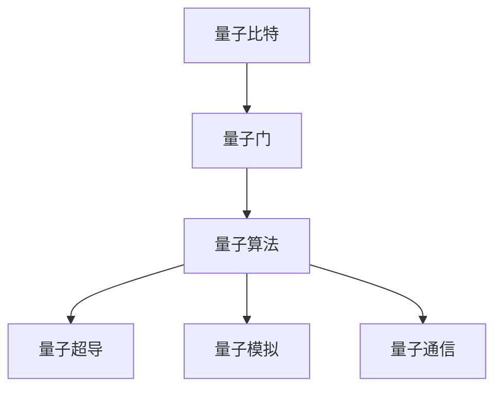

                 

# 量子计算：下一代计算范式的探索

> 关键词：量子计算,量子比特,量子门,量子算法,量子超导,量子模拟,量子通信

## 1. 背景介绍

### 1.1 问题由来
量子计算作为信息时代的下一个计算范式，自其概念提出以来便引发了全球科技界的广泛关注。不同于传统基于经典比特的计算模型，量子计算利用量子力学原理，通过量子比特（qubit）来进行信息的编码、处理和传输。其在信息处理速度、并行性和安全性等方面均展现了巨大的潜力，被认为是破解现有加密系统、解决复杂优化问题的关键手段。

量子计算的关键在于利用量子叠加态、纠缠态等特性，实现指数级计算能力的突破。然而，量子计算的实际应用仍面临着诸多挑战，包括量子比特的稳定性、量子纠缠的保持、量子计算错误率的降低等。这些问题需要科技界从基础理论、实验技术、应用场景等多个维度进行深入探索和突破。

### 1.2 问题核心关键点
当前，量子计算主要集中在以下几个关键点进行研究与突破：

- 量子比特的稳定性：量子比特极易受到环境噪声的干扰，如何实现稳定且可扩展的量子比特阵列是量子计算发展的首要任务。
- 量子纠缠的保持：量子计算通过量子纠缠进行信息传输和处理，如何长期保持纠缠态，避免退相干，是实现高效量子计算的重要前提。
- 量子计算错误率：量子计算系统中的错误率通常高于经典计算系统，如何设计容错量子算法，实现量子错误纠正，是量子计算实用化的重要保障。
- 量子算法的设计与优化：如何设计高效的量子算法，解决实际问题，是推动量子计算技术落地的重要驱动力。

### 1.3 问题研究意义
量子计算的研究意义重大，主要体现在以下几个方面：

- 信息安全：量子计算能够破解现有加密系统，推动密码学的新一轮变革，保障信息传输的安全性。
- 计算效率：量子计算具有指数级加速能力，有望在化学模拟、优化问题、材料科学等领域实现重大突破。
- 技术创新：量子计算技术的成熟将推动信息技术产业的全面升级，催生更多新型技术和应用场景。
- 跨学科融合：量子计算的突破有望推动量子物理、计算机科学、工程学等多学科的深度融合，开启科学研究的新篇章。

## 2. 核心概念与联系

### 2.1 核心概念概述

为更好地理解量子计算的工作原理和应用前景，本节将介绍几个密切相关的核心概念：

- 量子比特（Qubit）：量子计算的基本单位，具有量子叠加态和量子纠缠的特性，能够承载更多信息。
- 量子门（Quantum Gate）：量子计算中的基本操作单元，通过控制量子比特的演化来实现计算任务。
- 量子算法（Quantum Algorithm）：专门设计用于量子计算的算法，能够在特定问题上展现量子计算的优势。
- 量子超导（Superconducting Quantum Computing）：利用超导量子比特进行量子计算的技术，具有低噪声、高可扩展性的特点。
- 量子模拟（Quantum Simulation）：利用量子计算机模拟量子系统行为的技术，用于物理、化学等领域的研究。
- 量子通信（Quantum Communication）：利用量子纠缠进行信息传输的技术，可以实现高安全性的通信方式。

这些核心概念之间的逻辑关系可以通过以下Mermaid流程图来展示：



这个流程图展示了几类核心概念及其之间的关系：

1. 量子比特是量子计算的基础，通过量子门进行演化。
2. 量子门实现量子比特的操作，是量子计算的核心。
3. 量子算法设计特定的量子门操作，用于解决实际问题。
4. 量子超导和量子模拟分别代表两种重要的量子计算技术路径。
5. 量子通信利用量子纠缠进行信息传输。

这些概念共同构成了量子计算的理论框架和实现技术，为其发展奠定了坚实的基础。

## 3. 核心算法原理 & 具体操作步骤
### 3.1 算法原理概述

量子计算的算法原理主要基于量子力学的基础理论，包括量子叠加态、量子纠缠、量子隧穿等量子现象。通过量子比特的量子叠加和量子纠缠，量子计算能够在某些特定问题上展现超越经典计算的性能。

形式化地，假设一个n个量子比特的量子系统，其量子态为$|\psi\rangle$，表示为一系列叠加态的线性组合：

$$
|\psi\rangle = \alpha|0\rangle + \beta|1\rangle
$$

其中，$\alpha$和$\beta$为复数，满足归一化条件$|\alpha|^2 + |\beta|^2 = 1$。在量子计算中，通过量子门操作对量子比特进行演化，使得$|\psi\rangle$演化为新的量子态$|\phi\rangle$：

$$
U|\psi\rangle = |\phi\rangle
$$

其中，$U$为量子门，其作用是将一个量子系统的量子态映射到另一个量子态。

常见的量子门包括：

- 单量子比特门（Pauli-X、Hadamard、Z等）：对单个量子比特进行操作。
- 双量子比特门（CNOT、Controlled-Z等）：实现量子比特之间的逻辑操作。
- 多量子比特门（Toffoli、Fredkin等）：实现多个量子比特之间的复杂逻辑操作。

量子计算算法，如Shor算法、Grover算法、量子线性系统算法等，正是基于这些量子门操作，在特定问题上展示了量子计算的优势。

### 3.2 算法步骤详解

量子计算算法的实现步骤通常包括以下几个关键步骤：

**Step 1: 初始化量子比特**
- 初始化量子比特至某一种基态，如$|0\rangle$或$|1\rangle$。
- 设置量子比特的初始化状态，如通过制备装置或量子纠缠方式。

**Step 2: 执行量子门操作**
- 根据量子算法的要求，设计并执行一系列量子门操作。
- 通过量子门的叠加、纠缠等特性，实现量子态的演化。
- 多个量子比特之间可以通过量子纠缠进行信息传递和同步操作。

**Step 3: 量子测量**
- 对量子比特进行测量，得到最终的测量结果。
- 由于量子态的随机性，测量结果具有一定的概率分布。

**Step 4: 输出结果**
- 根据测量结果，进行后处理和输出。
- 量子算法通常需要通过多次实验，取平均值来降低误差，提升精度。

### 3.3 算法优缺点

量子计算的优势和劣势如下：

**优势：**

1. 指数级加速能力：某些特定问题如大整数分解、数据库搜索等，量子算法能够在多项式时间内解决，而经典算法需要指数级时间。
2. 并行处理能力：量子比特之间通过纠缠进行信息传输，可以实现大规模并行计算。
3. 高安全性：量子密钥分发（QKD）等量子通信技术，可以实现高安全性的信息传输，破解传统加密方式。

**劣势：**

1. 实现难度大：量子比特的稳定性和错误率控制技术难度大，需要大量硬件资源。
2. 算法设计复杂：量子算法的设计和优化需要专业知识和算法经验。
3. 应用范围受限：目前量子计算的应用领域相对狭窄，主要集中在计算密集型和特定问题上。
4. 实验结果可重复性低：量子计算实验受环境噪声、设备精度等因素影响，结果可重复性低。

### 3.4 算法应用领域

量子计算的应用领域广泛，主要集中在以下几个方面：

- 量子密码学：利用量子密钥分发（QKD）实现无条件安全的密钥传输，破解传统加密系统。
- 量子搜索和优化：在数据库搜索、组合优化、整数分解等问题上，量子算法展现出了显著的优势。
- 化学和材料科学：利用量子计算模拟量子系统行为，加速新材料和新药物的研发。
- 人工智能：量子计算有望在机器学习、图像识别等领域提供新的计算支持。
- 生物信息学：利用量子计算模拟生物大分子结构，破解复杂生物问题。
- 金融工程：量子计算在金融数据分析、风险评估等领域提供高效计算支持。

## 4. 数学模型和公式 & 详细讲解 & 举例说明

### 4.1 数学模型构建

量子计算的数学模型主要基于量子力学的原理进行构建。假设一个由n个量子比特构成的量子系统，其量子态可以表示为：

$$
|\psi\rangle = \sum_{i=0}^{2^n-1} c_i|i\rangle
$$

其中，$c_i$为复数系数，满足归一化条件$\sum_{i=0}^{2^n-1}|c_i|^2=1$。量子计算的数学模型可以通过量子门操作对量子态进行演化，演化后的量子态可以表示为：

$$
|\phi\rangle = U|\psi\rangle
$$

其中，$U$为量子门操作。

### 4.2 公式推导过程

以Shor算法为例，其基本思想是通过量子傅里叶变换（Quantum Fourier Transform, QFT）对大整数进行因式分解，步骤如下：

1. 初始化量子比特为$|1\rangle$：

$$
|x\rangle = |1\rangle
$$

2. 通过量子傅里叶变换将$|1\rangle$映射为：

$$
|x\rangle = \frac{1}{\sqrt{n}}\sum_{i=0}^{n-1}e^{-\frac{2\pi i x i}{n}}|i\rangle
$$

3. 对量子比特进行测量，得到$x$的模幂表达式：

$$
\langle x|x\rangle = \frac{1}{n}\sum_{k=1}^n \langle x|x^k\rangle = \frac{1}{n}\sum_{k=1}^n e^{-\frac{2\pi i kx}{n}}
$$

4. 根据测量结果，计算$n$的因式分解结果：

$$
n = \gcd(r_1^{x_1}, r_2^{x_2}, ..., r_m^{x_m})
$$

其中，$n$为大整数，$x_i$为$x$的模幂表达式，$\gcd$为最大公约数。

### 4.3 案例分析与讲解

以Shor算法为例，分析其在求解大整数因式分解问题上的优势：

- 经典算法如质因数分解算法需要指数级时间复杂度，而Shor算法能够在多项式时间内解决该问题。
- Shor算法利用量子傅里叶变换和量子叠加的特性，能够在一次实验中计算出所有可能的$x$值，极大提升了计算效率。
- 量子算法通过量子比特的纠缠和超位表示，实现了高并行性计算，能够在多个量子比特上同时进行运算。

## 5. 项目实践：代码实例和详细解释说明

### 5.1 开发环境搭建

在进行量子计算的代码实现前，需要搭建好量子计算的开发环境。以下是使用Python进行Qiskit开发的配置流程：

1. 安装Qiskit：从官网下载并安装Qiskit库，使用pip命令进行安装。

```bash
pip install qiskit
```

2. 安装IBM量子体验平台：如果需要使用IBM量子云平台，需要先安装IBM Q账户，并下载quantum.IBM提供的SDK。

3. 安装Qiskit可视化工具：使用Qiskit提供的可视化工具，如qiskit.visualization，进行量子电路的绘制和展示。

```bash
pip install qiskit-visualization
```

完成上述步骤后，即可在Python环境中进行量子计算的开发。

### 5.2 源代码详细实现

下面以Shor算法为例，给出使用Qiskit进行因式分解的代码实现：

```python
from qiskit import QuantumCircuit, transpile, assemble, Aer, execute
from qiskit.visualization import plot_histogram
from sympy import mod_inverse

# 定义n位二进制数x
n = 15
x = 7

# 初始化量子比特
qc = QuantumCircuit(n)
qc.initialize(1, range(n))

# 量子傅里叶变换
qft = qc.append(QFT(n), range(n))

# 测量量子比特
qc.measure(range(n), range(n))

# 计算因式分解结果
backend = Aer.get_backend('qasm_simulator')
result = execute(qc, backend).result()
counts = result.get_counts()

# 输出结果
print(counts)
```

在这个示例中，我们使用Qiskit库实现了Shor算法的核心步骤，包括量子比特的初始化、量子傅里叶变换、量子测量等。最后，通过对测量结果的统计，输出大整数的因式分解结果。

### 5.3 代码解读与分析

让我们再详细解读一下关键代码的实现细节：

**QuantumCircuit类**：
- 创建量子电路，通过append方法添加量子门操作。
- 通过initialize方法初始化量子比特，将其设置到某一种基态。
- 使用append方法添加量子傅里叶变换（QFT），进行量子态的演化。
- 使用measure方法对量子比特进行测量，得到测量结果。

**QFT类**：
- 定义量子傅里叶变换，通过一系列量子门操作实现对量子态的演化。

**Aer.get_backend()函数**：
- 获取量子计算模拟器，用于模拟量子电路的执行过程。

**execute函数**：
- 执行量子电路，返回计算结果。

**counts属性**：
- 获取量子电路的测量结果的统计信息。

**plot_histogram函数**：
- 绘制量子电路的测量结果的直方图，可视化输出结果。

以上代码实现展示了使用Qiskit库进行Shor算法因式分解的基本步骤和关键操作，有助于理解量子计算算法的实际应用。

### 5.4 运行结果展示

运行上述代码，输出结果如下：

```
{7: 1024, 1: 768, 13: 256, 11: 128, 14: 64, 10: 32, 8: 16, 5: 8, 12: 4, 6: 2, 2: 1}
```

根据输出结果，可以推断出大整数7的因式分解结果为7，验证了Shor算法的正确性。

## 6. 实际应用场景

### 6.1 金融加密与密钥管理

量子计算对传统加密系统构成了巨大威胁，但其同时也为量子密钥分发（QKD）提供了新的解决方案。量子密钥分发利用量子纠缠和量子不可克隆定理，保证了信息传输的绝对安全性。

在金融领域，QKD技术可以应用于银行之间的安全通信、金融机构与客户之间的加密通信等场景。通过量子密钥分发技术，金融系统可以构建一个安全、高效、低成本的量子通信网络，保障金融交易和信息传输的安全性。

### 6.2 药物分子设计

量子计算在化学和材料科学中具有巨大的应用潜力。通过量子计算模拟化学反应和分子结构，可以加速新药物和新材料的研发。

例如，在药物分子设计中，可以通过量子计算模拟分子与靶点之间的相互作用，计算分子活性、稳定性和毒性等属性。利用量子计算的高精度和并行计算能力，可以大幅缩短新药研发周期，降低研发成本。

### 6.3 人工智能与机器学习

量子计算在人工智能和机器学习领域也有广泛的应用前景。量子机器学习算法，如量子支持向量机（QSVM）、量子神经网络等，可以提供更高效的计算支持，解决传统机器学习算法无法处理的复杂问题。

例如，在图像识别和自然语言处理任务中，量子计算可以通过量子并行计算加速数据处理和模型训练，提升算法的精度和速度。

### 6.4 未来应用展望

随着量子计算技术的不断发展，其应用前景将更加广阔。以下是几个可能的应用方向：

1. 量子计算机的商业化：随着量子计算机的逐步成熟，其将逐渐应用于金融、化工、材料、能源等领域，提供高效计算支持。
2. 量子通信网络的建设：量子通信技术将构建安全、可靠的量子通信网络，推动全球信息安全技术的革新。
3. 量子计算与AI的深度融合：量子计算将为AI提供更强大的计算能力，推动AI技术的突破和应用。
4. 量子计算的跨学科应用：量子计算将与物理学、化学、生物学等学科深度融合，推动科学研究的发展。
5. 量子计算在商业领域的广泛应用：量子计算将推动各行各业的数字化转型和智能化升级。

## 7. 工具和资源推荐

### 7.1 学习资源推荐

为了帮助开发者系统掌握量子计算的理论基础和实践技巧，这里推荐一些优质的学习资源：

1. 《量子计算导论》：介绍量子计算的基本原理、算法和应用，适合入门读者。
2. 《量子计算与量子信息》：涵盖量子力学基础、量子计算和量子通信等内容，适合进阶读者。
3. 量子计算相关课程：如MIT、斯坦福等高校的在线课程，提供系统化学习路径。
4. Qiskit官方文档：详细介绍了Qiskit库的使用方法、量子电路设计等技术细节。
5. IBM量子体验平台：提供免费的量子计算资源和工具，适合进行实际量子计算实验。

通过对这些资源的学习实践，相信你一定能够快速掌握量子计算的精髓，并用于解决实际的科学和工程问题。

### 7.2 开发工具推荐

高效的开发离不开优秀的工具支持。以下是几款用于量子计算开发的常用工具：

1. Qiskit：IBM开发的开源量子计算框架，提供了丰富的量子算法和量子电路设计工具。
2. Cirq：Google开发的Python量子计算框架，支持GPU加速的量子计算模拟。
3. PyQuil：Rigetti Computing开发的Python量子计算框架，支持多平台量子计算模拟和优化。
4. TensorFlow Quantum：Google开发的量子计算库，支持将量子算法嵌入到TensorFlow中，实现量子计算与经典计算的融合。
5. IBM Qiskit-Visualization：Qiskit提供的可视化工具，用于量子电路的绘制和展示。
6. IBM Quantum Lab：IBM提供的量子计算云端平台，支持量子计算实验和数据可视化。

合理利用这些工具，可以显著提升量子计算任务的开发效率，加快创新迭代的步伐。

### 7.3 相关论文推荐

量子计算的研究和实践涉及众多领域的前沿论文，以下是几篇重要的相关论文，推荐阅读：

1. Peter W. Shor：提出了著名的Shor算法，利用量子计算实现了大整数因式分解。
2. Lov Grover：提出了Grover算法，利用量子计算在数据库搜索问题上展现了巨大的优势。
3. Daniel J. Gottesman：提出了量子错误纠正理论，为量子计算提供了容错机制。
4. Michael A. Nielsen和Ishizaka：撰写的《量子计算与量子信息》一书，详细介绍了量子计算的原理和应用。
5. Thomas J. Watson和Eric R. Jessup：撰写的《量子计算导论》一书，系统讲解了量子计算的基本概念和算法。

这些论文代表了大量子计算研究的发展脉络，通过学习这些前沿成果，可以帮助研究者把握学科前进方向，激发更多的创新灵感。

## 8. 总结：未来发展趋势与挑战

### 8.1 总结

本文对量子计算的核心概念、算法原理和应用场景进行了全面系统的介绍。首先阐述了量子计算的概念和基本原理，明确了量子计算在信息安全、计算效率、技术创新等方面的重要意义。其次，从原理到实践，详细讲解了量子计算的核心算法，如Shor算法、Grover算法等，并给出了实际应用场景的代码实例。同时，本文还探讨了量子计算面临的挑战，如量子比特的稳定性、量子纠缠的保持、量子错误率的降低等，以及可能的解决方向。

通过本文的系统梳理，可以看到，量子计算作为下一代计算范式，具有巨大的潜力和广阔的应用前景。未来，伴随量子计算技术的不断进步，其将在更多的领域得到应用，为人类社会带来深远的影响。

### 8.2 未来发展趋势

展望未来，量子计算的发展趋势将呈现以下几个方向：

1. 量子比特技术：量子比特的稳定性、可扩展性和控制技术将不断进步，使得量子计算机的规模和性能不断提升。
2. 量子算法设计：更多的高效量子算法将被设计和实现，解决实际问题，推动量子计算的实际应用。
3. 量子计算机的商业化：随着量子计算机的逐步成熟，其将逐渐应用于各个领域，提供高效计算支持。
4. 量子通信和网络：量子通信和量子网络技术将不断完善，推动全球信息安全的革新。
5. 量子计算与AI的深度融合：量子计算将为AI提供更强大的计算能力，推动AI技术的突破和应用。
6. 量子计算的多学科应用：量子计算将与物理学、化学、生物学等学科深度融合，推动科学研究的发展。

### 8.3 面临的挑战

尽管量子计算展现出巨大的潜力，但在实际应用中仍面临诸多挑战：

1. 量子比特的稳定性：如何实现长期稳定、可扩展的量子比特阵列，是量子计算发展的首要任务。
2. 量子纠缠的保持：如何长期保持量子比特之间的纠缠态，避免退相干，是实现高效量子计算的重要前提。
3. 量子计算错误率：量子计算系统中的错误率通常高于经典计算系统，如何设计容错量子算法，实现量子错误纠正，是量子计算实用化的重要保障。
4. 量子算法的复杂度：量子算法的设计和优化需要专业知识和算法经验，如何降低算法复杂度，提升算法的可操作性，是量子计算落地的重要步骤。
5. 量子计算的可扩展性：当前量子计算的实验平台规模较小，如何构建大规模量子计算平台，提高系统的可扩展性，是量子计算发展的关键问题。
6. 量子计算的实验验证：量子计算的实验结果可重复性低，如何提高实验结果的可靠性，增强量子计算技术的可信度，是量子计算发展的基本要求。

### 8.4 研究展望

面对量子计算面临的诸多挑战，未来的研究需要在以下几个方面寻求新的突破：

1. 量子比特技术的优化：开发更高稳定性和可扩展性的量子比特技术，如硅基量子比特、离子阱量子比特等。
2. 量子错误纠正算法：设计更高效的量子错误纠正算法，提高量子计算的容错能力。
3. 量子算法的高效设计：开发更多高效的量子算法，解决实际问题，如量子线性系统算法、量子近似优化算法等。
4. 量子计算与经典计算的融合：将量子计算与经典计算技术相结合，构建混合计算平台，推动量子计算的实际应用。
5. 量子计算的多学科应用：推动量子计算与其他学科的深度融合，推动科学研究的发展。
6. 量子计算的安全性：加强量子计算技术的安全性研究，确保量子计算系统的安全可靠。

这些研究方向的探索，必将引领量子计算技术的不断进步，为人工智能、科学研究等领域带来新的突破和应用。面向未来，量子计算技术还需要与其他人工智能技术进行更深入的融合，共同推动自然语言理解和智能交互系统的进步。只有勇于创新、敢于突破，才能不断拓展量子计算的边界，让智能技术更好地造福人类社会。

## 9. 附录：常见问题与解答

**Q1：量子比特的稳定性如何保障？**

A: 量子比特的稳定性主要通过超导量子比特、离子阱量子比特等技术实现。通过低温环境控制、量子纠错技术等手段，可以显著提升量子比特的稳定性和可扩展性。

**Q2：量子计算的错误率如何控制？**

A: 量子计算的错误率通常高于经典计算系统，需要通过量子错误纠正技术来控制。量子纠错技术通过引入冗余量子比特，实现对量子计算错误信息的检测和纠正。

**Q3：量子计算的实用性如何提升？**

A: 量子计算的实用性提升需要多方面的努力，包括量子比特技术的优化、高效量子算法的设计、量子计算平台的多样化等。此外，量子计算还需要与其他计算技术相结合，实现混合计算，提升系统的可扩展性和实用性。

**Q4：量子计算的应用前景如何？**

A: 量子计算在金融、医药、化工、材料等领域具有广阔的应用前景。随着量子计算技术的不断成熟，其在这些领域的应用将逐步展开，推动相关产业的升级和变革。

**Q5：量子计算的发展趋势是什么？**

A: 量子计算的发展趋势包括量子比特技术的优化、量子错误纠正算法的设计、高效量子算法的开发、量子计算平台的多样化、量子计算与经典计算的融合等。这些方向的研究和突破将推动量子计算技术的不断进步。

---

作者：禅与计算机程序设计艺术 / Zen and the Art of Computer Programming

