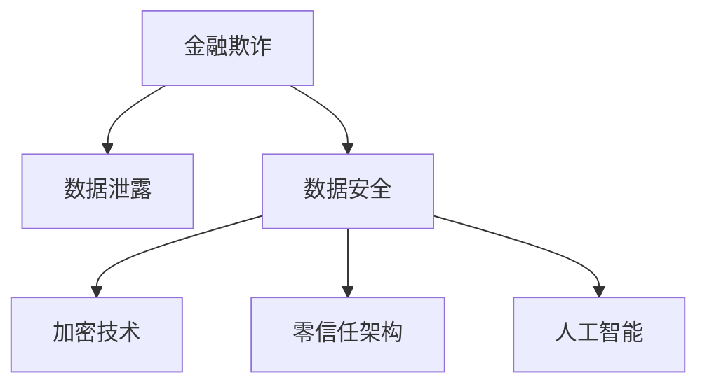

                 

# 金融平台的数据安全：如何防止金融欺诈和数据泄露？

> 关键词：金融欺诈、数据泄露、数据安全、加密技术、零信任架构、人工智能、异常检测

## 1. 背景介绍

### 1.1 问题由来
金融行业历来被视为数据密集型行业，金融平台如银行、证券、保险等机构在运营过程中会存储、处理和传输大量敏感数据。这些数据包括但不限于个人身份信息、银行账户信息、交易记录等，一旦泄露，可能导致严重的经济损失甚至社会风险。因此，金融平台的数据安全问题尤为关键，它直接关系到用户的信任和平台的可持续发展。

### 1.2 问题核心关键点
金融平台的数据安全威胁主要来自两个方面：

1. **金融欺诈**：利用技术手段进行的诈骗活动，如身份盗用、伪造交易、钓鱼攻击等，对金融平台和用户造成直接经济损失。
2. **数据泄露**：数据被未经授权的第三方获取或泄漏，导致敏感信息被滥用，从而引发安全事件，如个人隐私泄露、账户被盗等。

为了应对这些挑战，金融机构需构建完善的数据安全体系，采取多重防护措施。本文将详细介绍如何通过技术手段，尤其是加密技术和人工智能(AI)技术，有效防止金融欺诈和数据泄露，并保护用户的隐私和资金安全。

## 2. 核心概念与联系

### 2.1 核心概念概述

为更好地理解金融平台的数据安全机制，本文将介绍几个关键概念：

- **金融欺诈**：通过虚假信息或伪造行为欺骗金融系统，导致金融机构和用户遭受损失的行为。常见手段包括钓鱼攻击、信用卡欺诈、身份盗用等。

- **数据泄露**：未授权的第三方获取或泄漏金融机构存储的敏感数据，导致数据被滥用或被攻击。泄露途径包括网络攻击、内部员工泄露等。

- **数据安全**：保护金融数据不被未授权访问、修改、泄漏的过程。涉及加密、访问控制、审计等技术。

- **加密技术**：通过数学算法将敏感数据转换为不可读形式，以保护数据在传输和存储过程中的安全性。常见的加密方式包括对称加密和非对称加密。

- **零信任架构**：建立在“永不信任，始终验证”原则上的网络安全模型，强调对所有访问请求进行严格验证，不论其是否来自内部或外部网络。

- **人工智能**：利用机器学习、自然语言处理等技术，提高异常检测、风险评估的准确性和效率。

这些核心概念之间的逻辑关系可以通过以下Mermaid流程图来展示：



该流程图展示了大语言模型的核心概念及其之间的关系：

1. 金融欺诈和数据泄露对数据安全构成威胁。
2. 数据安全依赖于加密技术、零信任架构和人工智能等技术手段。

## 3. 核心算法原理 & 具体操作步骤

### 3.1 算法原理概述

金融平台的数据安全体系主要通过以下几类技术手段实现：

- **加密技术**：对传输和存储的数据进行加密，以防止数据被非法获取或篡改。
- **零信任架构**：对所有访问请求进行严格验证，确保只有经过授权的用户和设备可以访问系统。
- **人工智能**：通过机器学习算法，实时监测和识别异常行为，提高检测欺诈和数据泄露的准确性和效率。

### 3.2 算法步骤详解

金融平台的数据安全体系建设主要包括以下几个关键步骤：

**Step 1: 数据分类与标识**
- 对金融平台存储的所有数据进行分类，标识敏感数据的类别。
- 制定数据分类标准和标识规范，确保所有数据都得到恰当的保护。

**Step 2: 数据加密**
- 根据数据的重要性和存储位置，选择合适的加密算法和密钥管理策略。
- 对敏感数据进行加密，包括传输加密和存储加密。

**Step 3: 访问控制**
- 建立严格的身份验证和授权机制，确保只有经过授权的用户和设备可以访问系统。
- 实施最小权限原则，限制用户和设备的权限范围。

**Step 4: 实时监控与异常检测**
- 部署实时监控系统，对金融平台的所有访问请求进行记录和分析。
- 利用人工智能技术，通过机器学习算法识别异常行为，及时预警和处理安全事件。

**Step 5: 安全事件响应**
- 建立快速响应机制，一旦检测到异常行为，立即启动应急预案。
- 记录和分析安全事件，优化安全策略和措施。

**Step 6: 持续审计与优化**
- 定期审计数据安全策略和措施的有效性。
- 根据审计结果和新的安全威胁，持续优化数据安全体系。

### 3.3 算法优缺点

金融平台的数据安全体系具有以下优点：

1. **高安全性**：通过多层次的安全措施，有效防止数据泄露和金融欺诈。
2. **实时性**：利用人工智能技术，实现对异常行为的实时监控和响应。
3. **适应性**：随着新安全威胁的出现，可以及时调整安全策略，保持体系的有效性。

然而，该体系也存在一些局限性：

1. **复杂性**：建设和管理一个全面的数据安全体系需要高水平的技术能力和丰富的经验。
2. **成本高**：加密、人工智能等技术的使用和维护需要大量的硬件和软件资源。
3. **依赖技术**：数据安全依赖于技术手段的持续发展和应用，存在被技术漏洞攻击的风险。

### 3.4 算法应用领域

金融平台的数据安全体系广泛应用于金融行业的各个方面，包括但不限于：

- **银行和支付系统**：通过加密技术和零信任架构保护客户的账户信息和交易记录。
- **证券交易平台**：对交易数据进行加密和实时监控，防止非法交易和内部泄漏。
- **保险行业**：保护客户隐私信息，防止数据泄露和诈骗行为。
- **信用评分系统**：对用户数据进行加密和访问控制，保护个人信用信息安全。

## 4. 数学模型和公式 & 详细讲解 & 举例说明

### 4.1 数学模型构建

金融平台的数据安全体系涉及多个子系统，每个子系统都有其特有的安全模型。以数据加密为例，常见的数学模型包括：

- **对称加密**：使用同一密钥进行加密和解密，速度较快，但密钥管理复杂。
- **非对称加密**：使用公钥加密，私钥解密，安全性较高，但速度较慢。

在数学上，对称加密模型可以表示为：

$$
C = E(K, P)
$$

其中，$C$ 为密文，$P$ 为明文，$K$ 为密钥，$E$ 为加密函数。解密模型为：

$$
P = D(K, C)
$$

其中，$D$ 为解密函数。

非对称加密模型可以表示为：

$$
C = E_{pub}(P)
$$

其中，$C$ 为密文，$P$ 为明文，$E_{pub}$ 为公钥加密函数。解密模型为：

$$
P = D_{priv}(C)
$$

其中，$D_{priv}$ 为私钥解密函数。

### 4.2 公式推导过程

对称加密的解密公式可由加密公式推导得到：

$$
P = D(K, E(K, P)) = P
$$

即 $D(E(K, P)) = P$，证明了对称加密的可逆性。

非对称加密的解密公式也可以由加密公式推导得到：

$$
P = D_{priv}(E_{pub}(P))
$$

即 $D_{priv}(E_{pub}(P)) = P$，证明了非对称加密的可逆性。

### 4.3 案例分析与讲解

以银行支付系统为例，其数据加密过程如下：

1. **会话密钥生成**：客户和银行服务器在建立连接时，生成一个会话密钥 $K$。
2. **加密传输**：客户使用该会话密钥加密支付信息，发送至银行服务器。
3. **解密与处理**：银行服务器使用相同的会话密钥解密传输数据，并处理支付请求。
4. **密钥销毁**：支付完成后，会话密钥立即销毁，防止被重新利用。

通过使用对称加密和非对称加密的组合，银行支付系统在确保支付信息安全的同时，避免了非对称加密带来的性能瓶颈。

## 5. 项目实践：代码实例和详细解释说明

### 5.1 开发环境搭建

在进行金融平台的数据安全实践前，我们需要准备好开发环境。以下是使用Python进行加密实践的环境配置流程：

1. 安装Anaconda：从官网下载并安装Anaconda，用于创建独立的Python环境。

2. 创建并激活虚拟环境：
```bash
conda create -n cryptography-env python=3.8 
conda activate cryptography-env
```

3. 安装相关库：
```bash
pip install pycryptodome
pip install cryptography
```

4. 安装各类工具包：
```bash
pip install numpy pandas scikit-learn matplotlib tqdm jupyter notebook ipython
```

完成上述步骤后，即可在`cryptography-env`环境中开始加密实践。

### 5.2 源代码详细实现

下面以AES加密为例，给出使用Python进行对称加密的完整代码实现。

```python
from cryptography.fernet import Fernet
import os

# 生成随机密钥
key = Fernet.generate_key()

# 创建Fernet对象
cipher_suite = Fernet(key)

# 加密函数
def encrypt_data(data):
    cipher_text = cipher_suite.encrypt(data.encode())
    return cipher_text

# 解密函数
def decrypt_data(cipher_text):
    plain_text = cipher_suite.decrypt(cipher_text).decode()
    return plain_text

# 测试加密解密
data = b'This is a secret message.'
cipher_text = encrypt_data(data)
plain_text = decrypt_data(cipher_text)

print(f"Original message: {data}")
print(f"Cipher text: {cipher_text}")
print(f"Plain text: {plain_text}")
```

这段代码实现了AES加密和解密的基本功能，使用`Fernet`类生成随机密钥，并创建`Fernet`对象进行加密解密操作。

### 5.3 代码解读与分析

让我们再详细解读一下关键代码的实现细节：

**加密与解密函数**：
- `generate_key`方法生成一个随机的密钥，用于加密和解密。
- `Fernet`类用于创建`Fernet`对象，该对象可以进行加密和解密操作。
- `encrypt`方法将明文进行加密，返回密文。
- `decrypt`方法将密文解密，返回明文。

**测试加密解密**：
- 定义一个明文字符串`data`。
- 调用`encrypt_data`函数进行加密，返回密文。
- 调用`decrypt_data`函数进行解密，返回明文。
- 打印明文、密文和解密后的明文，验证加密解密过程的正确性。

## 6. 实际应用场景

### 6.1 银行业

银行业是金融平台数据安全最为关注的领域之一。银行业务涉及客户的账户信息、交易记录等敏感数据，一旦泄露可能导致严重的经济损失和法律风险。

**实际应用场景**：
- **账户加密**：使用AES、RSA等加密算法，对客户的账户信息进行加密存储和传输。
- **交易加密**：对客户的支付信息和交易记录进行加密，防止信息泄露和篡改。
- **内部数据保护**：使用数据脱敏和访问控制技术，限制员工对敏感数据的访问权限。

**技术实现**：
- **加密技术**：在数据库中对敏感数据进行加密存储，使用HTTPS等加密协议进行数据传输。
- **零信任架构**：实施严格的身份验证和授权机制，对所有访问请求进行严格验证。
- **人工智能**：利用机器学习算法，实时监测和识别异常交易行为，及时预警和处理安全事件。

### 6.2 证券交易

证券交易平台涉及大量交易数据和客户信息，一旦泄露可能导致市场操纵和金融风险。证券交易平台需要对数据进行严格保护，防止数据泄露和非法交易。

**实际应用场景**：
- **交易数据加密**：对交易数据进行加密存储和传输，防止信息泄露。
- **实时监控**：对交易行为进行实时监控，防止异常交易和内幕交易。
- **异常检测**：利用人工智能技术，检测异常交易行为，及时预警和处理安全事件。

**技术实现**：
- **加密技术**：在数据库中对交易数据进行加密存储，使用HTTPS等加密协议进行数据传输。
- **零信任架构**：实施严格的身份验证和授权机制，对所有访问请求进行严格验证。
- **人工智能**：利用机器学习算法，实时监测和识别异常交易行为，及时预警和处理安全事件。

### 6.3 保险行业

保险行业涉及大量客户信息和个人健康记录，一旦泄露可能导致严重的隐私泄露和法律风险。保险行业需要对数据进行严格保护，防止数据泄露和诈骗行为。

**实际应用场景**：
- **客户信息加密**：对客户信息进行加密存储和传输，防止信息泄露。
- **健康记录保护**：对健康记录进行加密存储和访问控制，防止数据泄露和滥用。
- **异常检测**：利用人工智能技术，检测异常行为，及时预警和处理安全事件。

**技术实现**：
- **加密技术**：在数据库中对敏感数据进行加密存储，使用HTTPS等加密协议进行数据传输。
- **零信任架构**：实施严格的身份验证和授权机制，对所有访问请求进行严格验证。
- **人工智能**：利用机器学习算法，实时监测和识别异常行为，及时预警和处理安全事件。

## 7. 工具和资源推荐

### 7.1 学习资源推荐

为了帮助开发者系统掌握金融平台数据安全技术，这里推荐一些优质的学习资源：

1. **《数据安全与隐私保护》系列博文**：由数据安全专家撰写，深入浅出地介绍了数据安全的基本概念和技术实现。

2. **《金融数据安全与隐私保护》在线课程**：由金融安全领域的专家讲授，详细讲解金融平台的数据安全机制和最佳实践。

3. **《区块链与金融安全》书籍**：介绍区块链技术在金融安全领域的应用，以及如何利用区块链技术保护金融数据。

4. **Cybersecurity AI平台**：提供大量基于人工智能的异常检测和安全分析工具，帮助开发者快速实现安全应用。

5. **NIST数据保护标准**：美国国家标准与技术研究院(NIST)发布的数据保护标准和最佳实践，为金融平台的数据安全提供了规范和指导。

通过对这些资源的学习实践，相信你一定能够快速掌握金融平台数据安全的精髓，并用于解决实际的金融安全问题。

### 7.2 开发工具推荐

高效的开发离不开优秀的工具支持。以下是几款用于金融平台数据安全开发的常用工具：

1. **Python**：基于Python的开源加密库和框架，简单易用，支持多种加密算法。
2. **TensorFlow**：由Google主导开发的深度学习框架，适合大规模工程应用。
3. **PyCryptodome**：基于OpenSSL库的Python加密库，支持多种加密算法和协议。
4. **Cryptography**：Python的高级加密库，支持多种加密算法和协议，易于集成。
5. **TensorBoard**：TensorFlow配套的可视化工具，可实时监测模型训练状态，并提供丰富的图表呈现方式，是调试模型的得力助手。

合理利用这些工具，可以显著提升金融平台数据安全任务的开发效率，加快创新迭代的步伐。

### 7.3 相关论文推荐

金融平台的数据安全技术不断发展，以下是几篇奠基性的相关论文，推荐阅读：

1. **加密算法研究**：介绍各种加密算法的原理和实现，如AES、RSA等。
2. **零信任架构**：详细讲解零信任架构的原理和设计，以及如何实现数据安全。
3. **人工智能在金融安全中的应用**：讨论机器学习、自然语言处理等技术在金融安全领域的应用。
4. **区块链与金融安全**：介绍区块链技术在金融安全领域的应用，以及如何利用区块链技术保护金融数据。
5. **数据保护法规与标准**：介绍全球主要的数据保护法规和标准，如GDPR、CCPA等，以及如何遵守相关法规。

这些论文代表了大数据安全技术的发展脉络。通过学习这些前沿成果，可以帮助研究者把握学科前进方向，激发更多的创新灵感。

## 8. 总结：未来发展趋势与挑战

### 8.1 总结

本文对金融平台的数据安全机制进行了全面系统的介绍。首先阐述了金融欺诈和数据泄露的危害，明确了数据安全的重要性和紧迫性。其次，从原理到实践，详细讲解了加密技术、零信任架构和人工智能等技术手段，给出了金融平台数据安全的完整代码实例。同时，本文还广泛探讨了数据安全技术在银行业、证券交易和保险行业等领域的实际应用场景，展示了数据安全技术的广泛应用前景。此外，本文精选了数据安全技术的各类学习资源，力求为读者提供全方位的技术指引。

通过本文的系统梳理，可以看到，金融平台的数据安全技术已经逐步成熟，并广泛应用于金融行业的各个方面。金融平台通过加密技术、零信任架构和人工智能等手段，有效防止了数据泄露和金融欺诈，保护了用户的隐私和资金安全。未来，伴随技术的持续演进，金融平台的数据安全体系将更加完善，为金融行业的稳定发展提供坚实的保障。

### 8.2 未来发展趋势

展望未来，金融平台的数据安全技术将呈现以下几个发展趋势：

1. **自动化**：引入自动化工具和算法，自动检测和响应安全事件，减少人工干预。
2. **智能化**：利用人工智能技术，提高异常检测和风险评估的准确性和效率。
3. **分布式**：利用分布式技术，提高系统的可靠性和扩展性，适应大规模数据处理需求。
4. **区块链**：利用区块链技术，提高数据安全性和透明度，防止数据篡改和泄露。
5. **跨平台**：实现跨平台、跨设备的数据安全保护，提高系统的通用性和适应性。

以上趋势凸显了金融平台数据安全技术的广阔前景。这些方向的探索发展，必将进一步提升数据安全系统的性能和应用范围，为金融行业的稳定发展提供坚实的保障。

### 8.3 面临的挑战

尽管金融平台的数据安全技术已经取得了显著进展，但在迈向更加智能化、普适化应用的过程中，仍面临诸多挑战：

1. **技术复杂性**：构建和维护一个全面的数据安全体系需要高水平的技术能力和丰富的经验。
2. **成本高**：加密、人工智能等技术的使用和维护需要大量的硬件和软件资源。
3. **依赖技术**：数据安全依赖于技术手段的持续发展和应用，存在被技术漏洞攻击的风险。
4. **法律法规**：金融平台需要遵守全球主要的数据保护法规和标准，如GDPR、CCPA等，增加了合规成本。
5. **人为因素**：员工操作失误、内部泄漏等人为因素也可能导致安全事件，需要通过培训和流程管理来防范。

这些挑战需要我们持续投入资源，不断优化和改进数据安全体系，确保金融平台的安全稳定。

### 8.4 研究展望

面对金融平台数据安全所面临的种种挑战，未来的研究需要在以下几个方面寻求新的突破：

1. **自动化安全管理**：利用自动化工具和算法，实现对安全事件的自动化检测、响应和修复。
2. **多模态安全检测**：结合图像、视频、语音等多模态数据，提高安全检测的准确性和全面性。
3. **零信任安全架构**：深入研究和实践零信任安全架构，提高系统的安全性和鲁棒性。
4. **数据加密算法优化**：研发更高效、更安全的数据加密算法，应对未来计算能力和量子计算的挑战。
5. **安全意识提升**：通过教育和培训，提升员工的安全意识和防护能力，减少人为因素导致的安全事件。

这些研究方向将进一步推动金融平台数据安全技术的进步，为金融行业的安全稳定提供坚实的保障。

## 9. 附录：常见问题与解答

**Q1：金融平台的数据安全体系如何设计？**

A: 金融平台的数据安全体系设计主要包括以下几个关键步骤：
1. 数据分类与标识：对所有数据进行分类和标识，确保敏感数据得到恰当的保护。
2. 数据加密：选择合适的加密算法和密钥管理策略，对敏感数据进行加密。
3. 访问控制：建立严格的身份验证和授权机制，限制用户和设备的权限范围。
4. 实时监控与异常检测：部署实时监控系统，利用人工智能技术进行异常检测。
5. 安全事件响应：建立快速响应机制，及时处理安全事件。
6. 持续审计与优化：定期审计数据安全策略和措施的有效性，持续优化安全体系。

**Q2：金融平台如何保护客户信息？**

A: 金融平台保护客户信息主要通过以下几种手段：
1. 数据加密：对客户的账户信息、交易记录等敏感数据进行加密存储和传输。
2. 访问控制：实施最小权限原则，限制员工和设备的访问权限。
3. 异常检测：利用人工智能技术，实时监测和识别异常行为，及时预警和处理安全事件。
4. 内部审计：定期审计数据安全策略和措施的有效性，及时发现和修复安全漏洞。

**Q3：如何防止金融欺诈？**

A: 防止金融欺诈主要通过以下几种手段：
1. 加密技术：对交易数据和账户信息进行加密，防止信息泄露和篡改。
2. 零信任架构：对所有访问请求进行严格验证，确保只有经过授权的用户和设备可以访问系统。
3. 人工智能：利用机器学习算法，实时监测和识别异常交易行为，及时预警和处理安全事件。
4. 用户教育：通过教育和培训，提高用户的风险意识和安全防护能力。

**Q4：金融平台如何应对数据泄露？**

A: 金融平台应对数据泄露主要通过以下几种手段：
1. 数据加密：对敏感数据进行加密存储和传输，防止信息泄露。
2. 访问控制：实施最小权限原则，限制员工和设备的访问权限。
3. 实时监控：部署实时监控系统，及时发现和预警数据泄露事件。
4. 应急预案：建立快速响应机制，及时处理数据泄露事件，减少损失。
5. 审计与改进：定期审计数据安全策略和措施的有效性，持续优化安全体系。

**Q5：金融平台的数据安全体系建设需要注意哪些问题？**

A: 金融平台的数据安全体系建设需要注意以下问题：
1. 技术复杂性：需要高水平的技术能力和丰富的经验，确保安全体系的可靠性。
2. 成本高：加密、人工智能等技术的使用和维护需要大量的硬件和软件资源，需要合理的成本控制。
3. 依赖技术：数据安全依赖于技术手段的持续发展和应用，需要不断更新和维护技术体系。
4. 法律法规：需要遵守全球主要的数据保护法规和标准，增加合规成本。
5. 人为因素：员工操作失误、内部泄漏等人为因素也可能导致安全事件，需要通过培训和流程管理来防范。

以上是金融平台数据安全体系建设需要关注的几个关键问题，需要综合考虑技术、成本、法规和人为因素等多方面因素，构建全面、可靠的数据安全体系。

---

作者：禅与计算机程序设计艺术 / Zen and the Art of Computer Programming

