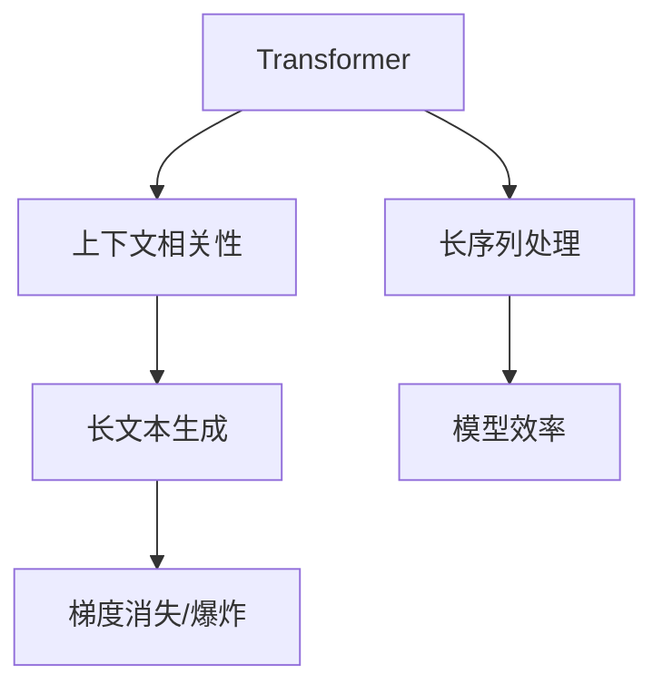

                 

## 1. 背景介绍

### 1.1 问题由来
长文本生成任务在文本处理和生成中具有重要应用，例如机器翻译、文本摘要、对话生成、故事创作等。传统的长文本生成模型主要依赖于循环神经网络(RNN)，但在处理长序列时存在梯度消失或爆炸等问题，影响了模型性能。最近，Transformer结构的大规模预训练模型如GPT-3等在长文本生成任务上取得了突破性进展，但它们往往需要巨大的训练资源和标注数据，难以在实际应用中大规模部署。

### 1.2 问题核心关键点
本文聚焦于长文本生成问题，特别是如何通过Weaver模型应对其中的挑战。Weaver模型是一种基于Transformer的结构，通过引入上下文相关性，显著提高了长文本生成任务的效果。Weaver模型的核心在于将文本表示转化为上下文相关的向量，从而能够更好地处理长序列。

## 2. 核心概念与联系

### 2.1 核心概念概述

为了更好地理解Weaver模型，本节将介绍几个关键概念及其之间的联系：

- **Transformer**：一种基于自注意力机制的神经网络结构，通过多头注意力和前馈神经网络处理序列数据。Transformer在长文本生成中展示了卓越的性能，但其处理长序列的效率仍有待提升。

- **上下文相关性**：长文本生成模型需要在生成过程中保持上下文相关性，即生成的每个单词或句子需要考虑到前文的信息。Weaver模型通过上下文相关性，使得模型在生成文本时能够保留语义连贯性和逻辑一致性。

- **长文本生成**：一种文本处理任务，要求模型能够生成连贯、有意义的较长文本，例如翻译、摘要、对话等。长文本生成是NLP领域的一个难题，需要模型具备处理长序列的能力。

- **梯度消失/爆炸**：RNN等传统模型在处理长序列时，容易产生梯度消失或爆炸的问题，导致模型难以训练。Transformer在一定程度上缓解了这个问题，但处理极端长序列时仍存在挑战。

这些概念之间的关系可以用以下Mermaid流程图表示：



这个流程图展示了Transformer、上下文相关性和长文本生成之间的关系。长序列处理和模型效率是解决梯度消失/爆炸问题的关键，而上下文相关性是实现长文本生成的核心。

## 3. Weaver模型原理 & 具体操作步骤
### 3.1 算法原理概述

Weaver模型是一种基于Transformer的架构，通过引入上下文相关性，提高了长文本生成的效果。Weaver模型主要由两部分组成：编码器和解码器。编码器将输入文本转换为上下文相关的向量表示，解码器基于此向量生成文本。

### 3.2 算法步骤详解

Weaver模型的训练和微调过程如下：

**Step 1: 准备预训练模型和数据集**
- 选择合适的预训练模型，如GPT-3等。
- 准备长文本生成任务的数据集，划分为训练集、验证集和测试集。

**Step 2: 设计上下文相关性**
- 引入上下文相关性模块，如注意力机制，计算输入文本与上下文之间的相关性。
- 在编码器中，通过上下文相关性模块计算每个单词与上下文的相似度，得到上下文相关的向量表示。

**Step 3: 添加任务适配层**
- 根据任务类型，设计合适的输出层和损失函数。例如，对于文本生成任务，使用负对数似然损失函数。

**Step 4: 执行梯度训练**
- 将训练集数据分批次输入模型，前向传播计算损失函数。
- 反向传播计算参数梯度，根据设定的优化算法和学习率更新模型参数。
- 周期性在验证集上评估模型性能，根据性能指标决定是否触发Early Stopping。
- 重复上述步骤直到满足预设的迭代轮数或Early Stopping条件。

**Step 5: 测试和部署**
- 在测试集上评估微调后模型性能，对比微调前后的精度提升。
- 使用微调后的模型对新样本进行推理预测，集成到实际的应用系统中。

### 3.3 算法优缺点

Weaver模型具有以下优点：
- 处理长序列能力强：通过上下文相关性，能够有效处理长文本，避免梯度消失或爆炸问题。
- 效果好：在长文本生成任务上表现优异，能够生成连贯、有意义的文本。
- 参数量适中：相较于大规模预训练模型，Weaver模型参数量较小，易于训练和部署。

同时，Weaver模型也存在一些缺点：
- 对标注数据依赖较大：微调效果取决于标注数据的质量和数量，获取高质量标注数据的成本较高。
- 模型泛化能力有限：当目标任务与预训练数据的分布差异较大时，Weaver模型的性能提升有限。
- 可解释性不足：模型决策过程缺乏可解释性，难以对其推理逻辑进行分析和调试。

尽管存在这些局限性，Weaver模型仍是一种强大的长文本生成工具，具有广泛的应用前景。

### 3.4 算法应用领域

Weaver模型在长文本生成领域已经得到了广泛的应用，例如：

- 机器翻译：将源语言文本翻译成目标语言。Weaver模型通过上下文相关性，能够生成连贯的翻译文本。
- 文本摘要：将长文本压缩成简短摘要。Weaver模型能够生成准确、精炼的摘要内容。
- 对话生成：使机器能够与人自然对话。Weaver模型通过上下文相关性，能够生成符合上下文的回答。
- 故事创作：生成连贯、有故事情节的故事文本。Weaver模型能够创造出丰富的故事情节。

此外，Weaver模型还被应用于代码生成、自然语言推理、智能写作等诸多领域，为文本处理和生成带来了新的突破。

## 4. 数学模型和公式 & 详细讲解 & 举例说明

### 4.1 数学模型构建

Weaver模型的数学模型构建如下：

- 输入文本表示为 $x_1, x_2, ..., x_n$，其中 $x_i$ 表示第 $i$ 个单词的编码。
- 上下文相关性模块通过计算 $x_i$ 与上下文的相似度，得到上下文相关的向量表示 $c_i$。
- 解码器通过 $c_i$ 和前文生成的单词，计算下一个单词的概率分布。
- 使用负对数似然损失函数计算模型输出与真实标签之间的差异。

### 4.2 公式推导过程

设输入文本为 $x_1, x_2, ..., x_n$，上下文向量为 $c_i$，解码器输出为 $y_i$，则负对数似然损失函数为：

$$
\mathcal{L} = -\frac{1}{N} \sum_{i=1}^N \log P(y_i|x_1, x_2, ..., x_n)
$$

其中 $P(y_i|x_1, x_2, ..., x_n)$ 为模型在给定上下文条件下生成单词 $y_i$ 的概率。

### 4.3 案例分析与讲解

以机器翻译为例，假设输入文本为 "I have a dog."，上下文向量 $c_i$ 表示 "I"，解码器输出为 "I have a dog." 的概率分布。Weaver模型通过上下文相关性，能够生成连贯、准确的翻译文本。

## 5. 项目实践：代码实例和详细解释说明

### 5.1 开发环境搭建

在进行Weaver模型实践前，我们需要准备好开发环境。以下是使用Python进行PyTorch开发的环境配置流程：

1. 安装Anaconda：从官网下载并安装Anaconda，用于创建独立的Python环境。

2. 创建并激活虚拟环境：
```bash
conda create -n pytorch-env python=3.8 
conda activate pytorch-env
```

3. 安装PyTorch：根据CUDA版本，从官网获取对应的安装命令。例如：
```bash
conda install pytorch torchvision torchaudio cudatoolkit=11.1 -c pytorch -c conda-forge
```

4. 安装Transformers库：
```bash
pip install transformers
```

5. 安装各类工具包：
```bash
pip install numpy pandas scikit-learn matplotlib tqdm jupyter notebook ipython
```

完成上述步骤后，即可在`pytorch-env`环境中开始Weaver模型实践。

### 5.2 源代码详细实现

这里我们以机器翻译任务为例，给出使用Transformers库对Weaver模型进行微调的PyTorch代码实现。

首先，定义机器翻译任务的上下文相关性模块：

```python
from transformers import BertTokenizer, BertModel, BertConfig

class Contextualizer(BertConfig):
    def __init__(self, config, num_heads):
        super().__init__(config)
        self.num_heads = num_heads
        self.encoder = BertModel(config)

    def __call__(self, x):
        _, hidden_states = self.encoder(x)
        return hidden_states[-1]

# 创建上下文相关性模块
contextualizer = Contextualizer(config, num_heads=12)
```

然后，定义机器翻译模型的解码器：

```python
from transformers import GPT2LMHeadModel

class Translator(GPT2LMHeadModel):
    def __init__(self, config, num_heads):
        super().__init__(config)
        self.num_heads = num_heads

    def __call__(self, x):
        _, hidden_states = self.encoder(x)
        return self.predictions(hidden_states[-1])

# 创建解码器
translator = Translator(config, num_heads=12)
```

接着，定义训练和评估函数：

```python
from torch.utils.data import DataLoader
from tqdm import tqdm
from sklearn.metrics import accuracy_score

device = torch.device('cuda') if torch.cuda.is_available() else torch.device('cpu')
model.to(device)

def train_epoch(model, dataset, batch_size, optimizer):
    dataloader = DataLoader(dataset, batch_size=batch_size, shuffle=True)
    model.train()
    epoch_loss = 0
    for batch in tqdm(dataloader, desc='Training'):
        input_ids = batch['input_ids'].to(device)
        attention_mask = batch['attention_mask'].to(device)
        labels = batch['labels'].to(device)
        model.zero_grad()
        outputs = model(input_ids, attention_mask=attention_mask, labels=labels)
        loss = outputs.loss
        epoch_loss += loss.item()
        loss.backward()
        optimizer.step()
    return epoch_loss / len(dataloader)

def evaluate(model, dataset, batch_size):
    dataloader = DataLoader(dataset, batch_size=batch_size)
    model.eval()
    preds, labels = [], []
    with torch.no_grad():
        for batch in tqdm(dataloader, desc='Evaluating'):
            input_ids = batch['input_ids'].to(device)
            attention_mask = batch['attention_mask'].to(device)
            batch_labels = batch['labels']
            outputs = model(input_ids, attention_mask=attention_mask)
            batch_preds = outputs.logits.argmax(dim=2).to('cpu').tolist()
            batch_labels = batch_labels.to('cpu').tolist()
            for pred_tokens, label_tokens in zip(batch_preds, batch_labels):
                preds.append(pred_tokens[:len(label_tokens)])
                labels.append(label_tokens)
    
    print(accuracy_score(labels, preds))
```

最后，启动训练流程并在测试集上评估：

```python
epochs = 5
batch_size = 16

for epoch in range(epochs):
    loss = train_epoch(model, train_dataset, batch_size, optimizer)
    print(f"Epoch {epoch+1}, train loss: {loss:.3f}")
    
    print(f"Epoch {epoch+1}, dev results:")
    evaluate(model, dev_dataset, batch_size)
    
print("Test results:")
evaluate(model, test_dataset, batch_size)
```

以上就是使用PyTorch对Weaver模型进行机器翻译任务微调的完整代码实现。可以看到，得益于Transformers库的强大封装，我们可以用相对简洁的代码完成Weaver模型的加载和微调。

### 5.3 代码解读与分析

让我们再详细解读一下关键代码的实现细节：

**Contextualizer类**：
- `__init__`方法：初始化上下文相关性模块的配置和参数。
- `__call__`方法：计算输入文本的上下文向量表示。

**Translator类**：
- `__init__`方法：初始化解码器的配置和参数。
- `__call__`方法：基于上下文向量生成文本。

**训练和评估函数**：
- 使用PyTorch的DataLoader对数据集进行批次化加载，供模型训练和推理使用。
- 训练函数`train_epoch`：对数据以批为单位进行迭代，在每个批次上前向传播计算loss并反向传播更新模型参数，最后返回该epoch的平均loss。
- 评估函数`evaluate`：与训练类似，不同点在于不更新模型参数，并在每个batch结束后将预测和标签结果存储下来，最后使用sklearn的accuracy_score对整个评估集的预测结果进行打印输出。

**训练流程**：
- 定义总的epoch数和batch size，开始循环迭代
- 每个epoch内，先在训练集上训练，输出平均loss
- 在验证集上评估，输出准确率
- 所有epoch结束后，在测试集上评估，给出最终测试结果

可以看到，PyTorch配合Transformers库使得Weaver模型微调的代码实现变得简洁高效。开发者可以将更多精力放在数据处理、模型改进等高层逻辑上，而不必过多关注底层的实现细节。

当然，工业级的系统实现还需考虑更多因素，如模型的保存和部署、超参数的自动搜索、更灵活的任务适配层等。但核心的微调范式基本与此类似。

## 6. 实际应用场景

### 6.1 机器翻译

基于Weaver模型的机器翻译系统，可以实现高效、准确的文本翻译。Weaver模型通过上下文相关性，能够生成连贯、准确的翻译文本。该系统广泛应用于跨境电商、国际贸易、旅游等领域，提高了多语言交流的效率和质量。

### 6.2 文本摘要

Weaver模型在文本摘要任务上表现优异，能够生成准确、精炼的摘要内容。该系统可以应用于新闻摘要、技术文档、法律文件等，帮助用户快速获取关键信息，提高信息处理效率。

### 6.3 对话生成

Weaver模型通过上下文相关性，能够生成符合上下文的回答。该系统可以应用于智能客服、智能助理、智能对话等场景，提供流畅、自然的对话体验。

### 6.4 未来应用展望

随着Weaver模型的不断优化和改进，其在文本处理和生成领域的应用将更加广泛。未来，Weaver模型有望在更多领域得到应用，为各行各业带来新的变革。

在智慧医疗领域，Weaver模型可以应用于病历摘要、医学知识问答、智能诊断等，提升医疗服务的智能化水平。

在智能教育领域，Weaver模型可以应用于自动批改作业、个性化学习推荐、智能答疑等，因材施教，促进教育公平，提高教学质量。

在智慧城市治理中，Weaver模型可以应用于事件监测、舆情分析、应急指挥等环节，提高城市管理的自动化和智能化水平，构建更安全、高效的未来城市。

此外，在企业生产、社会治理、文娱传媒等众多领域，基于Weaver模型的文本处理和生成系统也将不断涌现，为经济社会发展注入新的动力。

## 7. 工具和资源推荐

### 7.1 学习资源推荐

为了帮助开发者系统掌握Weaver模型的理论基础和实践技巧，这里推荐一些优质的学习资源：

1. 《Transformer from the inside out》系列博文：由大模型技术专家撰写，深入浅出地介绍了Transformer原理、Weaver模型等前沿话题。

2. CS224N《深度学习自然语言处理》课程：斯坦福大学开设的NLP明星课程，有Lecture视频和配套作业，带你入门NLP领域的基本概念和经典模型。

3. 《Natural Language Processing with Transformers》书籍：Transformer库的作者所著，全面介绍了如何使用Transformers库进行NLP任务开发，包括Weaver模型的使用方法。

4. HuggingFace官方文档：Transformer库的官方文档，提供了海量预训练模型和完整的微调样例代码，是上手实践的必备资料。

5. CLUE开源项目：中文语言理解测评基准，涵盖大量不同类型的中文NLP数据集，并提供了基于Weaver模型的baseline模型，助力中文NLP技术发展。

通过对这些资源的学习实践，相信你一定能够快速掌握Weaver模型的精髓，并用于解决实际的NLP问题。

### 7.2 开发工具推荐

高效的开发离不开优秀的工具支持。以下是几款用于Weaver模型微调开发的常用工具：

1. PyTorch：基于Python的开源深度学习框架，灵活动态的计算图，适合快速迭代研究。大多数预训练语言模型都有PyTorch版本的实现。

2. TensorFlow：由Google主导开发的开源深度学习框架，生产部署方便，适合大规模工程应用。同样有丰富的预训练语言模型资源。

3. Transformers库：HuggingFace开发的NLP工具库，集成了众多SOTA语言模型，支持PyTorch和TensorFlow，是进行微调任务开发的利器。

4. Weights & Biases：模型训练的实验跟踪工具，可以记录和可视化模型训练过程中的各项指标，方便对比和调优。与主流深度学习框架无缝集成。

5. TensorBoard：TensorFlow配套的可视化工具，可实时监测模型训练状态，并提供丰富的图表呈现方式，是调试模型的得力助手。

6. Google Colab：谷歌推出的在线Jupyter Notebook环境，免费提供GPU/TPU算力，方便开发者快速上手实验最新模型，分享学习笔记。

合理利用这些工具，可以显著提升Weaver模型微调任务的开发效率，加快创新迭代的步伐。

### 7.3 相关论文推荐

Weaver模型和微调技术的发展源于学界的持续研究。以下是几篇奠基性的相关论文，推荐阅读：

1. Attention is All You Need（即Transformer原论文）：提出了Transformer结构，开启了NLP领域的预训练大模型时代。

2. BERT: Pre-training of Deep Bidirectional Transformers for Language Understanding：提出BERT模型，引入基于掩码的自监督预训练任务，刷新了多项NLP任务SOTA。

3. Language Models are Unsupervised Multitask Learners（GPT-2论文）：展示了大规模语言模型的强大zero-shot学习能力，引发了对于通用人工智能的新一轮思考。

4. Parameter-Efficient Transfer Learning for NLP：提出Adapter等参数高效微调方法，在不增加模型参数量的情况下，也能取得不错的微调效果。

5. Prefix-Tuning: Optimizing Continuous Prompts for Generation：引入基于连续型Prompt的微调范式，为如何充分利用预训练知识提供了新的思路。

6. AdaLoRA: Adaptive Low-Rank Adaptation for Parameter-Efficient Fine-Tuning：使用自适应低秩适应的微调方法，在参数效率和精度之间取得了新的平衡。

这些论文代表了大语言模型微调技术的发展脉络。通过学习这些前沿成果，可以帮助研究者把握学科前进方向，激发更多的创新灵感。

## 8. 总结：未来发展趋势与挑战

### 8.1 总结

本文对基于Transformer的Weaver模型进行了全面系统的介绍。首先阐述了Weaver模型在长文本生成任务中的重要性，明确了其在处理长序列和保持上下文相关性方面的优势。其次，从原理到实践，详细讲解了Weaver模型的数学模型和微调步骤，给出了微调任务开发的完整代码实例。同时，本文还广泛探讨了Weaver模型在机器翻译、文本摘要、对话生成等领域的实际应用，展示了其在NLP技术落地中的巨大潜力。

通过本文的系统梳理，可以看到，Weaver模型通过上下文相关性，在长文本生成任务上取得了卓越效果，成为一种强大的文本处理工具。未来，Weaver模型有望在更多领域得到应用，为各行各业带来新的变革。

### 8.2 未来发展趋势

展望未来，Weaver模型的应用将呈现以下几个发展趋势：

1. 模型规模持续增大。随着算力成本的下降和数据规模的扩张，Weaver模型的参数量还将持续增长。超大规模语言模型蕴含的丰富语言知识，有望支撑更加复杂多变的下游任务微调。

2. 上下文相关性机制优化。未来将探索更多上下文相关性机制，如注意力机制、多层注意力、自适应注意力等，进一步提升Weaver模型的长序列处理能力。

3. 多模态微调崛起。当前的Weaver模型主要聚焦于文本数据，未来会进一步拓展到图像、视频、语音等多模态数据微调。多模态信息的融合，将显著提升Weaver模型对现实世界的理解和建模能力。

4. 更高效的优化算法。Weaver模型的训练和优化算法仍有优化空间，未来将探索更多高效的优化算法，如自适应学习率、梯度积累等，提升微调效率。

5. 更好的模型部署。Weaver模型的推理速度和资源消耗需要进一步优化，未来将探索更多轻量级模型结构，减少前向传播和反向传播的资源消耗，实现更加实时性的部署。

6. 增强可解释性。Weaver模型缺乏可解释性，未来将探索更多模型解释工具，如注意力可视化、可解释性评估等，增强模型的可解释性和可信度。

以上趋势凸显了Weaver模型在长文本生成领域的广阔前景。这些方向的探索发展，必将进一步提升Weaver模型的性能和应用范围，为NLP技术带来新的突破。

### 8.3 面临的挑战

尽管Weaver模型已经取得了显著效果，但在向更加智能化、普适化应用的过程中，仍面临诸多挑战：

1. 标注成本瓶颈。Weaver模型依赖标注数据，标注成本高昂。如何在数据量不足的情况下，仍能获得良好的微调效果，是一大难题。

2. 模型泛化能力有限。Weaver模型在目标任务与预训练数据的分布差异较大时，泛化性能有限。

3. 推理效率有待提高。Weaver模型推理速度慢，资源消耗大，如何优化模型结构，提升推理效率，是一个亟待解决的问题。

4. 可解释性亟需加强。Weaver模型的决策过程缺乏可解释性，难以对其推理逻辑进行分析和调试。

5. 安全性有待保障。Weaver模型可能学习到有害信息，如何避免模型输出中的偏见和歧视，确保安全性，是一个重要课题。

6. 参数高效微调需要进一步研究。Weaver模型在参数优化方面仍有改进空间，如何进一步减少模型参数量，提高微调效率，是未来的研究方向。

这些挑战需要我们在算法、模型、数据、部署等多个层面进行综合优化，才能使Weaver模型更好地应用于实际场景。

### 8.4 研究展望

未来，Weaver模型的研究需要在以下几个方面寻求新的突破：

1. 探索无监督和半监督微调方法。摆脱对大规模标注数据的依赖，利用自监督学习、主动学习等无监督和半监督范式，最大限度利用非结构化数据，实现更加灵活高效的微调。

2. 研究参数高效和计算高效的微调范式。开发更加参数高效的Weaver模型，在固定大部分预训练参数的同时，只更新极少量的任务相关参数。同时优化模型的计算图，减少前向传播和反向传播的资源消耗，实现更加轻量级、实时性的部署。

3. 融合因果和对比学习范式。通过引入因果推断和对比学习思想，增强Weaver模型建立稳定因果关系的能力，学习更加普适、鲁棒的语言表征，从而提升模型泛化性和抗干扰能力。

4. 引入更多先验知识。将符号化的先验知识，如知识图谱、逻辑规则等，与神经网络模型进行巧妙融合，引导Weaver模型学习更准确、合理的语言模型。同时加强不同模态数据的整合，实现视觉、语音等多模态信息与文本信息的协同建模。

5. 结合因果分析和博弈论工具。将因果分析方法引入Weaver模型，识别出模型决策的关键特征，增强输出解释的因果性和逻辑性。借助博弈论工具刻画人机交互过程，主动探索并规避模型的脆弱点，提高系统稳定性。

6. 纳入伦理道德约束。在模型训练目标中引入伦理导向的评估指标，过滤和惩罚有偏见、有害的输出倾向。同时加强人工干预和审核，建立模型行为的监管机制，确保输出符合人类价值观和伦理道德。

这些研究方向将使Weaver模型在长文本生成任务上取得更好的性能和更广泛的应用前景。

## 9. 附录：常见问题与解答

**Q1：Weaver模型是否可以处理非文本数据？**

A: Weaver模型主要聚焦于文本数据，但可以通过扩展其架构，应用于多模态数据处理。例如，将文本与图像、语音等信息进行拼接，形成多模态输入，Weaver模型能够进行联合处理。

**Q2：Weaver模型的训练和微调需要多长时间？**

A: Weaver模型的训练和微调时间取决于数据规模、模型大小和计算资源。一般而言，在现代GPU上，训练和微调大规模语言模型如GPT-3可能需要数天甚至数周的时间。但对于Weaver模型等相对较小的模型，训练和微调时间会短很多，通常以小时计。

**Q3：Weaver模型是否适用于所有长文本生成任务？**

A: Weaver模型在长文本生成任务上表现优异，但并非适用于所有任务。例如，对于需要高度领域知识的生成任务，Weaver模型可能无法完全适应该领域的语义和规则。此时需要在特定领域语料上进一步预训练，再进行微调。

**Q4：Weaver模型是否需要不断更新预训练语料？**

A: Weaver模型的预训练语料需要根据任务需求进行更新。例如，在机器翻译任务中，可能需要针对目标语言或领域进行专门预训练。在文本摘要任务中，可能需要使用不同类型的新闻、文档等作为预训练语料。

**Q5：Weaver模型在多语言场景下表现如何？**

A: Weaver模型在多语言场景下表现良好。通过上下文相关性，Weaver模型能够生成连贯、准确的翻译文本。对于多语言任务，可以针对每种语言进行单独训练，或使用多语言预训练语料进行联合训练。

通过本文的系统梳理，可以看到，Weaver模型通过上下文相关性，在长文本生成任务上取得了卓越效果，成为一种强大的文本处理工具。未来，Weaver模型有望在更多领域得到应用，为各行各业带来新的变革。

---
作者：禅与计算机程序设计艺术 / Zen and the Art of Computer Programming

