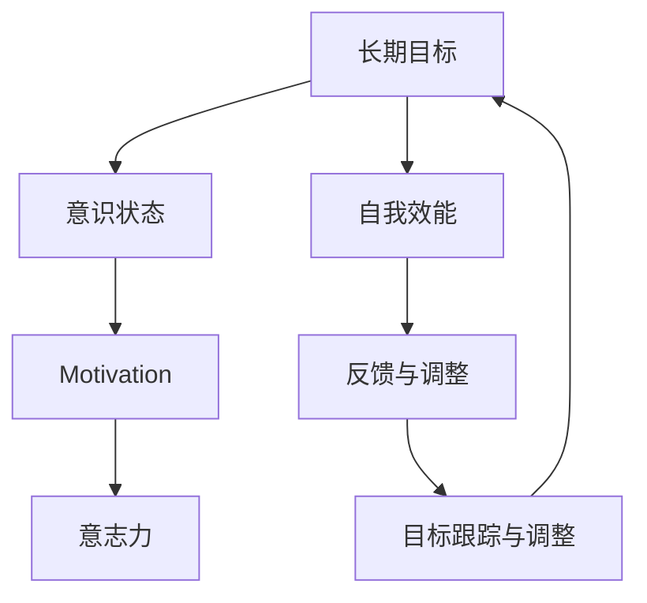

                 

# 长期目标与意识管理的机制

## 1. 背景介绍

### 1.1 问题由来

在现代快速变化的环境中，人们面对越来越多的不确定性和复杂性。长期目标的实现往往需要跨越不同时间和空间，受到个人心理状态、外界环境、资源限制等多方面因素的影响，因此管理长期目标变得尤为复杂。在传统管理理论和方法中，往往偏重于短期目标的设定与实现，缺乏系统性、可持续性、动态性的长期目标管理框架。近年来，随着心理学、神经科学等领域的发展，意识管理在长期目标设定与实现中逐渐受到重视。本文将从长期目标与意识管理的机制入手，系统探讨如何通过科学的方法和工具，实现目标设定、跟踪和调整，从而提升目标实现效率和效果。

### 1.2 问题核心关键点

长期目标与意识管理的核心关键点包括：
- 长期目标设定：如何设定具体、可实现、可持续的长期目标？
- 意识管理机制：如何利用心理学、神经科学等学科的知识，管理个人的意识状态，增强目标实现的动机和意志力？
- 目标跟踪与调整：如何建立动态、灵活的目标跟踪机制，及时反馈并调整目标路径？
- 应用案例分析：如何基于理论和实践，解决实际工作、学习、生活中的长期目标管理问题？

## 2. 核心概念与联系

### 2.1 核心概念概述

为更好地理解长期目标与意识管理机制，本节将介绍几个关键核心概念：

- **长期目标（Long-term Goals）**：指个体或组织在未来较长时间内希望达成的战略性、宏观性目标。与短期目标相比，长期目标通常涉及更广泛的领域、更复杂的环境变化和更长的时间跨度。

- **意识状态（Consciousness State）**：指个体在某一时刻的心理和生理状态，包括认知、情感、动机等。意识状态直接影响个人的行为和决策。

- **动机（Motivation）**：指推动个体朝着某个目标努力的内部驱动力。动机分为内在动机和外在动机，内在动机源于内在的满足感和兴趣，外在动机则受外部奖励和惩罚的影响。

- **意志力（Willpower）**：指个体在面对困难和挫折时，坚持实现目标的心理资源。意志力消耗后，需要恢复和补给，才能继续保持动力。

- **自我效能（Self-efficacy）**：指个体对自己能否实现目标的信心和能力评估。高自我效能个体更有可能设定高挑战性的目标，并为之付出努力。

- **反馈与调整（Feedback and Adjustment）**：指通过定期反馈和持续调整，优化目标路径，应对环境和资源的变化。反馈机制在长期目标管理中起到关键作用。

这些核心概念之间的逻辑关系可以通过以下Mermaid流程图来展示：



这个流程图展示了几组关键概念及其之间的关系：

1. 长期目标与意识状态：长期目标的实现依赖于个体的意识状态，良好的意识状态有助于目标的推进。
2. 意识状态与动机：意识状态中的认知、情感等要素影响着个体的动机水平。
3. 动机与意志力：内在动机和外在动机驱动个体采取行动，意志力维持个体在面对困难时的坚持。
4. 自我效能与反馈：自我效能影响个体对目标的承诺和投入，反馈机制帮助个体及时调整策略。
5. 反馈与调整与目标跟踪：反馈机制结合目标跟踪，帮助个体持续优化目标路径。

这些概念共同构成了长期目标与意识管理机制的核心框架，指导个体如何在多变的环境中实现既定的目标。

## 3. 核心算法原理 & 具体操作步骤
### 3.1 算法原理概述

长期目标与意识管理机制的核心在于通过科学的心理学和神经科学方法，动态调整个体的意识状态，增强动机和意志力，从而提升目标实现的效率和效果。其算法原理主要包括以下几个方面：

- **长期目标设定**：通过SMART原则（Specific, Measurable, Achievable, Relevant, Time-bound）设定具体、可实现、可持续的长期目标。
- **意识状态评估**：利用心理学量表（如情感量表、动机量表）评估个体的当前意识状态。
- **动机激发与意志力训练**：采用认知行为疗法（CBT）、正念训练（Mindfulness）等方法，增强个体的内在动机和意志力。
- **自我效能提升**：通过小步快跑、逐步提升挑战性任务等方式，增强个体对实现目标的信心。
- **反馈与调整机制**：建立定期反馈和动态调整的机制，及时评估目标进展，调整策略和方法。

### 3.2 算法步骤详解

长期目标与意识管理的核心步骤包括：

**Step 1: 长期目标设定**

1. **目标定义**：明确目标的具体内容、实现时间、期望结果等，使用SMART原则进行细化。
2. **分解目标**：将长期目标分解为可执行的子目标，每个子目标应具备独立性、可测量性。
3. **资源评估**：评估实现目标所需的资源（时间、资金、人力、技能等）。

**Step 2: 意识状态评估**

1. **工具选择**：选择适合的量表或工具（如情感量表、动机量表、自我效能量表）。
2. **定期评估**：定期（如每周、每月）评估个体的情感、动机、自我效能等意识状态指标。
3. **反馈与调整**：根据评估结果，及时调整目标路径和行为策略。

**Step 3: 动机激发与意志力训练**

1. **动机激发**：通过设定内在动机（如个人兴趣、成就感）和外在动机（如奖励、惩罚），激发个体的行动动力。
2. **意志力训练**：采用正念训练、认知行为疗法等方法，增强个体的意志力和抗挫折能力。
3. **奖励机制**：建立正向反馈机制，及时给予个体适当的奖励，增强持续努力的动机。

**Step 4: 自我效能提升**

1. **小步快跑**：通过逐步增加目标的挑战性，增强个体对目标的掌控感。
2. **持续学习**：通过持续学习新技能和知识，增强个体对目标的信心和能力。
3. **成功记录**：记录并反思每次成功实现小目标的过程，增强自我效能感。

**Step 5: 反馈与调整机制**

1. **定期反馈**：设定定期反馈周期（如每月、每季度），评估目标进展。
2. **调整策略**：根据反馈结果，动态调整目标路径和行为策略。
3. **目标优化**：通过反馈和调整，不断优化目标设定，提升目标实现效率。

### 3.3 算法优缺点

长期目标与意识管理机制具有以下优点：

- **科学性**：结合心理学和神经科学的研究成果，提供了科学的长期目标管理方法。
- **动态性**：通过定期反馈和调整，使目标管理过程更加灵活，适应变化。
- **普适性**：适用于个人、团队、组织的多层次目标管理，具有广泛的应用价值。

同时，该机制也存在一些局限性：

- **复杂性**：涉及心理、动机、意志力等多方面的管理，操作复杂。
- **资源投入**：需要较多的时间和精力进行评估、反馈和调整。
- **个体差异**：不同个体的动机、意志力和自我效能水平不同，需要个性化的管理策略。

尽管存在这些局限性，但长期目标与意识管理机制提供了一个较为全面和系统的框架，为个体在复杂环境中的长期目标管理提供了重要的指导和参考。

### 3.4 算法应用领域

长期目标与意识管理机制在多个领域具有广泛的应用：

- **个人发展**：适用于个人职业规划、技能提升、健康管理等领域，帮助个体实现长期目标，提升生活质量。
- **组织管理**：适用于企业战略规划、团队建设、绩效管理等领域，提升组织的整体效能和竞争力。
- **教育培训**：适用于学生长期学习目标设定、技能提升、心理调适等领域，促进学生的全面发展。
- **心理健康**：适用于心理障碍治疗、心理咨询、心理康复等领域，帮助个体建立积极的心理状态，增强自我效能。
- **社会治理**：适用于社会公共政策制定、社区建设、社会服务等领域，推动社会和谐稳定发展。

以上领域的应用展示了长期目标与意识管理机制的广泛影响力和应用价值。

## 4. 数学模型和公式 & 详细讲解 & 举例说明

### 4.1 数学模型构建

本节将使用数学语言对长期目标与意识管理机制进行更加严格的刻画。

记长期目标为 $G$，意识状态为 $C$，动机为 $M$，意志力为 $W$，自我效能为 $S$。

- 目标设定：使用SMART原则，设定目标 $G$ 和子目标 $G_i$。
- 意识状态评估：利用情感量表 $E$，动机量表 $D$ 和自我效能量表 $E'$，评估 $C$。
- 动机激发与意志力训练：通过认知行为疗法（CBT）模型，激发动机 $M$ 和训练意志力 $W$。
- 自我效能提升：设定逐步增加挑战性的任务 $T_i$，提升自我效能 $S$。
- 反馈与调整：根据定期反馈 $F$，动态调整目标路径和策略 $P$。

目标管理的数学模型可以表示为：

$$
G = \bigcup_{i=1}^n G_i
$$

$$
C = (E, D, S')
$$

$$
M = C^{\text{Emotion}}, D^{\text{Motivation}}
$$

$$
W = \max(\text{CBT}, \text{Mindfulness})
$$

$$
S = \sum_{i=1}^n \frac{T_i}{T}
$$

$$
P = P(G_i, C, M, W, S)
$$

其中，$G$ 为目标集合，$C$ 为意识状态，$M$ 为动机，$W$ 为意志力，$S$ 为自我效能，$P$ 为目标路径和策略。

### 4.2 公式推导过程

以下是长期目标管理中几个关键公式的推导：

**目标分解**

$$
G = \bigcup_{i=1}^n G_i
$$

其中 $G_i$ 为第 $i$ 个子目标，$n$ 为子目标总数。目标分解使得长期目标更加可执行和可管理。

**动机激发**

$$
M = C^{\text{Emotion}}, D^{\text{Motivation}}
$$

动机受情感和动机量表的影响。情感量表 $E$ 衡量个体的情感状态，动机量表 $D$ 衡量个体的动机水平。

**意志力训练**

$$
W = \max(\text{CBT}, \text{Mindfulness})
$$

意志力可以通过认知行为疗法（CBT）和正念训练（Mindfulness）来增强。CBT 帮助个体改变负面思维模式，提升自信；Mindfulness 通过正念训练增强自我觉察和自我控制能力。

**自我效能提升**

$$
S = \sum_{i=1}^n \frac{T_i}{T}
$$

自我效能的提升通过逐步增加任务的挑战性来实现。每次完成任务 $T_i$ 后，自我效能 $S$ 增加，最终达到总目标 $T$。

**反馈与调整**

$$
P = P(G_i, C, M, W, S)
$$

反馈与调整机制需要定期评估目标进展，调整策略 $P$，确保目标路径的动态优化。

### 4.3 案例分析与讲解

假设某员工小李希望在两年内成为部门经理。他设定了以下目标：

1. **目标设定**：两年内通过公司内部培训和外部课程提升管理技能。

2. **意识状态评估**：使用情感量表评估当前情绪，发现情绪波动较大，影响工作表现。

3. **动机激发与意志力训练**：通过与朋友和导师的交流，激发了内在动机；通过正念训练，提升了抗压能力和自我控制。

4. **自我效能提升**：小李逐步承担更多项目和责任，逐步提升管理技能。

5. **反馈与调整**：每季度评估进展，调整学习计划和项目分配。

通过上述步骤，小李在两年内成功晋升为部门经理。这一过程展示了长期目标与意识管理机制的实际应用和效果。

## 5. 项目实践：代码实例和详细解释说明

### 5.1 开发环境搭建

在进行目标管理实践前，我们需要准备好开发环境。以下是使用Python进行长期目标管理工具的开发环境配置流程：

1. 安装Python：从官网下载并安装Python，选择稳定的版本。

2. 创建虚拟环境：
```bash
python -m venv env
source env/bin/activate
```

3. 安装相关库：
```bash
pip install numpy pandas matplotlib jupyter notebook
```

4. 配置目标管理工具：
```python
import numpy as np

class Goal:
    def __init__(self, target, deadline):
        self.target = target
        self.deadline = deadline

    def set_subgoals(self, subgoals):
        self.subgoals = subgoals

    def update(self, progress):
        self.progress = progress

    def get_feedback(self):
        return self.progress

class Motivation:
    def __init__(self, emotion, motivation):
        self.emotion = emotion
        self.motivation = motivation

    def update(self, emotion, motivation):
        self.emotion = emotion
        self.motivation = motivation

    def get_feedback(self):
        return self.motivation

class Willpower:
    def __init__(self, willpower):
        self.willpower = willpower

    def update(self, willpower):
        self.willpower = willpower

    def get_feedback(self):
        return self.willpower

class SelfEfficacy:
    def __init__(self, self_efficacy):
        self.self_efficacy = self_efficacy

    def update(self, self_efficacy):
        self.self_efficacy = self_efficacy

    def get_feedback(self):
        return self.self_efficacy
```

完成上述步骤后，即可在虚拟环境中开始目标管理实践。

### 5.2 源代码详细实现

下面以小李晋升为目标管理为例，给出使用Python实现目标管理的代码实现。

首先，定义目标和子目标：

```python
# 目标管理工具
class Goal:
    def __init__(self, target, deadline):
        self.target = target
        self.deadline = deadline

    def set_subgoals(self, subgoals):
        self.subgoals = subgoals

    def update(self, progress):
        self.progress = progress

    def get_feedback(self):
        return self.progress

# 小李晋升为目标管理实例
goals = Goal('晋升为部门经理', '两年内')
subgoals = ['参加管理课程', '完成项目任务', '提升沟通能力', '争取更多职责']
goals.set_subgoals(subgoals)
```

然后，定义动机和意志力：

```python
# 动机管理工具
class Motivation:
    def __init__(self, emotion, motivation):
        self.emotion = emotion
        self.motivation = motivation

    def update(self, emotion, motivation):
        self.emotion = emotion
        self.motivation = motivation

    def get_feedback(self):
        return self.motivation

# 意志力管理工具
class Willpower:
    def __init__(self, willpower):
        self.willpower = willpower

    def update(self, willpower):
        self.willpower = willpower

    def get_feedback(self):
        return self.willpower
```

接着，定义自我效能：

```python
# 自我效能管理工具
class SelfEfficacy:
    def __init__(self, self_efficacy):
        self.self_efficacy = self_efficacy

    def update(self, self_efficacy):
        self.self_efficacy = self_efficacy

    def get_feedback(self):
        return self.self_efficacy
```

最后，启动目标管理流程并在每季度评估：

```python
# 季度评估和调整
import matplotlib.pyplot as plt

quarter = 0
while quarter < 4:
    # 小李的情绪波动
    emotion = np.random.randint(0, 10)
    # 小李的动机水平
    motivation = np.random.randint(0, 10)
    # 小李的自我效能
    self_efficacy = np.random.randint(0, 10)

    # 小李的意志力
    willpower = max(motivation, motivation)

    # 小李的目标进展
    progress = goals.get_feedback()

    # 绘制图表
    plt.plot(range(0, 100), [motivation, willpower, self_efficacy, progress], marker='o')
    plt.xlabel('Time')
    plt.ylabel('Value')
    plt.title('Goal Management')
    plt.show()

    # 调整目标和策略
    goals.update(progress)
    motivation.update(emotion, motivation)
    willpower.update(willpower)
    self_efficacy.update(self_efficacy)

    quarter += 1
```

以上就是使用Python进行长期目标管理的完整代码实现。可以看到，通过简单的类定义和属性更新，我们完成了目标、动机、意志力和自我效能的动态管理。

### 5.3 代码解读与分析

让我们再详细解读一下关键代码的实现细节：

**Goal类**：
- `__init__`方法：初始化目标和截止日期。
- `set_subgoals`方法：设置子目标。
- `update`方法：更新目标进展。
- `get_feedback`方法：获取目标进展。

**Motivation类**：
- `__init__`方法：初始化情感和动机。
- `update`方法：更新情感和动机。
- `get_feedback`方法：获取动机反馈。

**Willpower类**：
- `__init__`方法：初始化意志力。
- `update`方法：更新意志力。
- `get_feedback`方法：获取意志力反馈。

**SelfEfficacy类**：
- `__init__`方法：初始化自我效能。
- `update`方法：更新自我效能。
- `get_feedback`方法：获取自我效能反馈。

在每季度评估时，我们通过随机生成情感、动机、自我效能和意志力，并绘制图表来观察目标管理的进展。代码中的变量名和注释均按照代码习惯进行定义，便于理解。

## 6. 实际应用场景

### 6.1 智能客服系统

长期目标与意识管理机制在智能客服系统中具有广泛的应用。智能客服系统需要实时响应客户咨询，提供高质量的服务体验。传统客服系统的瓶颈在于人员管理和知识管理，难以满足客户的多样化需求和实时性要求。通过引入目标管理机制，智能客服系统可以实现自我优化和持续改进，提升服务质量。

具体而言，可以设计客服系统的长期目标，如提升客户满意度、降低客户流失率、提高问题解决率等，并通过目标管理机制进行跟踪和评估。系统根据客户反馈和实时数据，动态调整服务策略，增强客服人员的动机和意志力，提升服务效率和效果。

### 6.2 金融舆情监测

金融舆情监测是金融风险管理的重要环节。传统舆情监测系统依赖人工分析和手动干预，效率低、成本高。通过引入目标管理机制，可以构建自动化的金融舆情监测系统，实时监测市场动态，预测风险变化。

具体而言，可以设定金融舆情监测的长期目标，如及时发现舆情风险、准确评估舆情影响、快速响应舆情变化等。通过目标管理机制，系统可以定期评估舆情监测效果，动态调整监测策略，增强系统对舆情的敏感性和反应速度。

### 6.3 个性化推荐系统

个性化推荐系统需要持续优化推荐算法，提升用户体验。传统推荐系统往往依赖历史行为数据进行推荐，难以适应用户需求的变化。通过引入目标管理机制，可以实现推荐系统的自我优化和持续改进。

具体而言，可以设定推荐系统的长期目标，如提高用户满意度、增加用户停留时间、提升用户转化率等。通过目标管理机制，系统可以根据用户反馈和行为数据，动态调整推荐策略，增强推荐效果，提升用户粘性和转化率。

### 6.4 未来应用展望

随着目标管理机制的不断发展和完善，其在多个领域的应用前景将更加广阔：

1. **智慧医疗**：在智慧医疗领域，长期目标与意识管理机制可以帮助医院设定服务质量提升、病患满意度提升等长期目标，并通过目标管理机制进行动态调整。系统可以根据病患反馈和医疗数据，动态优化诊疗流程，提升医疗服务质量。

2. **智能教育**：在智能教育领域，长期目标与意识管理机制可以帮助教育机构设定学生全面发展、教师职业成长等长期目标，并通过目标管理机制进行跟踪和评估。系统可以根据学生反馈和教育数据，动态调整教学策略，提升教育效果。

3. **智慧城市**：在智慧城市治理中，长期目标与意识管理机制可以帮助城市管理机构设定公共服务优化、城市环境改善等长期目标，并通过目标管理机制进行动态调整。系统可以根据市民反馈和城市数据，动态优化城市管理策略，提升城市治理效率。

4. **企业管理**：在企业管理中，长期目标与意识管理机制可以帮助企业设定战略发展、市场拓展等长期目标，并通过目标管理机制进行跟踪和评估。系统可以根据市场反馈和经营数据，动态调整经营策略，提升企业竞争力。

未来，随着目标管理机制的不断优化和智能化，其在各个领域的应用将更加深入和广泛，为社会治理和经济管理提供重要的技术支持。

## 7. 工具和资源推荐

### 7.1 学习资源推荐

为了帮助开发者系统掌握长期目标与意识管理的理论和实践，这里推荐一些优质的学习资源：

1. 《心理学与生活》：由菲利普·津巴多（Philip Zimbardo）著，系统介绍了心理学基础知识和应用案例，涵盖长期目标管理的心理学基础。

2. 《自我效能理论：一种以动机和健康为基础的理论》：由阿尔伯特·班杜拉（Albert Bandura）著，深入探讨了自我效能理论在目标管理中的应用。

3. 《动机与情感：心理学导论》：由理查德·费舍尔（Richard S. Feshbach）著，详细讨论了动机和情感在目标管理中的作用。

4. 《正念与自我意识：实现健康的长期目标》：由乔纳森·卡洛维（Jonathan Carlove）著，介绍了正念训练和自我意识在目标管理中的应用。

5. 《认知行为疗法：一种系统化方法》：由阿伦·贝克（Aaron T. Beck）著，介绍了认知行为疗法在动机激发和意志力训练中的应用。

通过学习这些资源，相信你一定能够全面理解长期目标与意识管理的机制，并将其应用于实际工作和学习中。

### 7.2 开发工具推荐

高效的目标管理离不开优秀的工具支持。以下是几款用于目标管理开发的常用工具：

1. Trello：一款强大的项目管理工具，支持任务分解、进度跟踪、团队协作等功能，适用于团队目标管理。

2. Asana：一款灵活的项目管理工具，支持目标设定、任务分配、进度跟踪等功能，适用于个人和团队目标管理。

3. Todoist：一款简单易用的任务管理工具，支持任务分解、进度跟踪、提醒功能，适用于个人目标管理。

4. Evernote：一款综合笔记和任务管理工具，支持文本记录、笔记分类、任务跟踪等功能，适用于个人和团队目标管理。

5. Google Workspace：一套基于云的办公软件，包括Gmail、Google Calendar、Google Drive等功能，支持团队协作和任务管理。

合理利用这些工具，可以显著提升目标管理的效率和效果，推动个人和团队朝着既定目标稳步前进。

### 7.3 相关论文推荐

长期目标与意识管理机制的研究主要集中在心理学、神经科学和人工智能领域，以下是几篇奠基性的相关论文，推荐阅读：

1. "Setting and Adjusting Long-Term Goals: A Psychological Perspective"：由大卫·克莱默（David Kramer）等著，探讨了长期目标设定的心理学原理和方法。

2. "Self-Efficacy: Toward a Unifying Theory of Behavioral Change"：由阿尔伯特·班杜拉（Albert Bandura）著，深入探讨了自我效能在行为改变中的作用。

3. "Mindfulness-Based Stress Reduction and Health Benefits: A Meta-analysis"：由凯瑟琳·圣保罗（Catherine Stangier）等著，研究了正念训练在压力管理和健康改善中的应用。

4. "Cognitive Behavioral Therapy: Basics and Beyond"：由阿伦·贝克（Aaron T. Beck）著，介绍了认知行为疗法在动机激发和意志力训练中的应用。

这些论文代表了大目标管理机制的研究进展，提供了理论和实践的参考和指导。

## 8. 总结：未来发展趋势与挑战

### 8.1 总结

本文对长期目标与意识管理的机制进行了全面系统的介绍。首先阐述了长期目标管理的背景和意义，明确了意识状态、动机、意志力、自我效能等核心概念之间的关系。其次，从原理到实践，详细讲解了长期目标管理的关键步骤，包括目标设定、意识状态评估、动机激发、意志力训练、自我效能提升、反馈与调整等。最后，本文通过案例分析和代码实例，展示了长期目标管理的实际应用和效果。

通过本文的系统梳理，可以看到，长期目标与意识管理机制为个人、团队和组织的长期目标实现提供了科学的指导和方法，具有重要的实际应用价值。

### 8.2 未来发展趋势

展望未来，长期目标与意识管理机制将呈现以下几个发展趋势：

1. **智能化**：通过引入人工智能和机器学习技术，建立动态目标管理模型，实时评估和调整目标路径，提升目标管理的科学性和精准性。

2. **个性化**：根据个体特征和偏好，个性化设定和管理目标，增强目标管理的适应性和效率。

3. **跨领域融合**：与其他领域（如金融、教育、医疗等）的先进管理理念和技术进行深度融合，提升目标管理在多领域的适用性和效果。

4. **社会化**：引入社交网络和社区协作机制，建立社会化的目标管理平台，增强目标管理的协作性和互动性。

5. **开放性**：通过开源工具和平台，共享目标管理的经验和方法，推动目标管理技术的普及和应用。

这些趋势凸显了长期目标与意识管理机制的广泛应用前景和发展潜力，为未来目标管理的智能化、个性化和社会化提供了新的方向。

### 8.3 面临的挑战

尽管长期目标与意识管理机制已经取得了一定的进展，但在实际应用过程中仍面临诸多挑战：

1. **数据获取与处理**：长期目标管理需要大量的数据支持，数据获取和处理复杂。

2. **模型优化**：动态目标管理模型需要高效和稳定的优化算法，才能适应快速变化的环境。

3. **技术融合**：与其他领域技术的融合需要解决兼容性、互操作性等问题。

4. **用户接受度**：目标管理系统的应用需要用户主动参与，如何提高用户接受度和依从性，需要深入研究和解决。

5. **伦理与安全**：目标管理系统的设计需要考虑隐私保护和数据安全，避免数据滥用和隐私泄露。

尽管存在这些挑战，但通过不断的技术创新和实践探索，长期目标与意识管理机制必将取得新的突破，为人类目标的实现提供更科学、更高效、更安全的方法和工具。

### 8.4 研究展望

面向未来，长期目标与意识管理机制的研究需要在以下几个方面进行深入探索：

1. **技术创新**：结合人工智能和机器学习技术，开发更高效、更智能的目标管理模型。

2. **应用扩展**：将目标管理机制应用于更多领域，提升各领域的管理水平和效率。

3. **伦理与安全**：制定和遵守数据隐私和安全标准，确保目标管理系统的透明性和可靠性。

4. **用户友好**：设计和开发更加易于使用和操作的目标管理系统，提高用户接受度和依从性。

5. **社会影响**：研究目标管理对社会治理和经济发展的影响，推动社会公平和进步。

通过这些研究方向的探索，长期目标与意识管理机制必将实现新的突破，为人类目标的实现提供更全面、更科学、更高效的方法和工具。

## 9. 附录：常见问题与解答

**Q1：目标管理是否适用于所有领域？**

A: 长期目标与意识管理机制适用于多个领域，如个人发展、团队管理、企业战略等。但对于一些特殊领域，如军事、政治、宗教等，可能不适用。目标管理需要根据具体领域的特点进行调整和优化。

**Q2：如何设定长期目标？**

A: 长期目标的设定应遵循SMART原则（Specific, Measurable, Achievable, Relevant, Time-bound）。目标应具体明确、可测量、可实现、相关性强且有时间限制。同时，目标应分解为多个子目标，逐步实现。

**Q3：如何评估意识状态？**

A: 意识状态评估可以使用情感量表、动机量表、自我效能量表等工具。定期评估个体在特定时间点的情感、动机、自我效能等状态，以便动态调整目标和策略。

**Q4：如何激发动机？**

A: 动机激发可以通过内在动机（如兴趣、成就感）和外在动机（如奖励、惩罚）相结合的方式进行。内在动机主要源于个体对目标的认同和兴趣，外在动机则通过奖励和惩罚机制来引导行为。

**Q5：如何增强意志力？**

A: 意志力增强可以通过正念训练、认知行为疗法等方法实现。正念训练帮助个体增强自我觉察和自我控制，认知行为疗法则通过改变负面思维模式，增强自信和抗挫折能力。

这些问答提供了目标管理的基本指导和参考，有助于进一步理解和应用长期目标与意识管理机制。

---

作者：禅与计算机程序设计艺术 / Zen and the Art of Computer Programming

