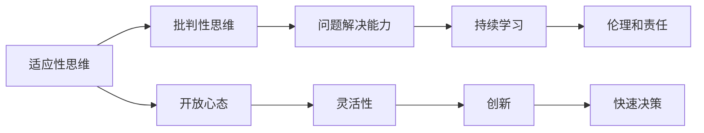

                 

## 1. 背景介绍

在当今快速变化的世界中，人工智能（AI）和机器学习（ML）技术正以前所未有的速度和规模进行创新和应用。然而，无论技术多么先进，都无法避免面对不确定性和变化。因此，我们需要具备一系列技能，以确保我们能够成功地应对这些挑战，并在不断变化的环境中保持竞争力。

本文旨在探讨这些关键技能，帮助读者掌握如何在快速变化的科技领域中保持领先地位。我们将从以下几个方面进行深入探讨：

- **适应性思维**：如何培养灵活性，快速适应新环境和新技术。
- **批判性思维**：如何分析和评估不同技术和应用的价值和潜在风险。
- **问题解决能力**：如何系统地识别、分析和解决问题。
- **持续学习**：如何在不断变化的技术环境中保持知识和技能的更新。
- **伦理和责任**：如何在技术开发和应用中考虑伦理和责任问题。

通过理解和掌握这些技能，我们不仅能够更好地应对当前的挑战，还能为未来的变化做好准备。

## 2. 核心概念与联系

### 2.1 核心概念概述

为更好地理解这些关键技能，本节将介绍几个紧密相关的核心概念：

- **适应性思维**：指个体或组织在面对变化时快速调整行为和策略的能力。这种能力涉及开放心态、灵活性、创新和快速决策。
- **批判性思维**：指分析和评估信息、观点和论据的能力，以做出明智的决策。这包括问题定义、证据收集、假设检验和逻辑推理。
- **问题解决能力**：指识别、分析和解决问题的一系列过程和技能。问题解决包括定义问题、提出假设、测试假设和实施解决方案。
- **持续学习**：指在不断变化的环境中，持续获取新知识、技能和信息，并应用于实践。
- **伦理和责任**：指在技术开发和应用中考虑道德、法律和社会影响，确保技术行为符合社会价值和规范。

这些核心概念之间的关系可以通过以下Mermaid流程图来展示：

这个流程图展示了一个闭环系统，其中各个概念相互关联，共同支撑着技术适应和应用的能力。

## 3. 核心算法原理 & 具体操作步骤

### 3.1 算法原理概述

在探讨这些技能时，我们将从算法原理和具体操作步骤的角度，详细分析其实现机制和应用方法。

这些技能虽然不像传统算法那样可以通过代码实现，但它们可以通过系统化的方法和步骤进行培养和应用。例如，我们可以使用问题分解、假设验证、迭代学习和道德审查等算法，来逐步提高我们的问题解决能力、持续学习和伦理决策能力。

### 3.2 算法步骤详解

以下是一些关键技能的详细步骤：

#### 适应性思维

1. **开放心态**：保持对新技术和新方法的开放态度，积极参与学习和实践。
2. **灵活性**：面对变化时，能够快速调整策略和行为，以适应新环境。
3. **创新**：在解决问题时，敢于尝试新的方法，鼓励跨学科合作。
4. **快速决策**：在有限信息下，快速做出有效决策，并承担决策后果。

#### 批判性思维

1. **问题定义**：清晰定义问题，明确问题范围和目标。
2. **证据收集**：通过实验、观察和文献研究收集相关信息。
3. **假设检验**：提出假设，进行实验验证，并根据结果调整假设。
4. **逻辑推理**：根据证据和假设，进行逻辑推理，得出结论。

#### 问题解决能力

1. **定义问题**：明确问题性质和目标，确保问题可解。
2. **提出假设**：基于现有知识和经验，提出可能的解决方案。
3. **测试假设**：设计实验和测试，验证假设的有效性。
4. **实施解决方案**：根据测试结果，实施最有效的解决方案。
5. **反馈与优化**：根据反馈，持续优化解决方案。

#### 持续学习

1. **获取新知识**：通过阅读、培训、实验等方式，获取新知识和技能。
2. **应用新知识**：将新知识应用于实践，解决问题和改进系统。
3. **反思与迭代**：定期反思学习过程，识别改进点，并不断迭代。

#### 伦理和责任

1. **道德考量**：在技术开发和应用中，考虑伦理道德问题，如隐私、安全和公平。
2. **法律合规**：确保技术应用符合相关法律法规。
3. **社会影响**：评估技术对社会的影响，采取措施减少负面效应。

### 3.3 算法优缺点

这些关键技能各具优势和局限性：

#### 适应性思维

- **优势**：能够快速适应变化，抓住新机会。
- **局限性**：可能忽视长期规划和稳定性。

#### 批判性思维

- **优势**：提高决策的准确性和合理性。
- **局限性**：耗时较多，可能需要较多的信息和资源。

#### 问题解决能力

- **优势**：系统化解决问题，提高效率和效果。
- **局限性**：依赖于现有知识和经验，可能难以应对复杂问题。

#### 持续学习

- **优势**：保持竞争力和创新能力。
- **局限性**：需要时间和资源，可能难以持续进行。

#### 伦理和责任

- **优势**：确保技术符合道德和社会规范。
- **局限性**：可能增加决策难度和复杂性。

### 3.4 算法应用领域

这些技能不仅适用于技术开发和应用，还广泛应用于教育、商业、政策制定等多个领域。例如：

- **教育**：教师和学生可以通过持续学习提升知识和技能，培养批判性思维和问题解决能力。
- **商业**：企业家和管理者可以通过适应性思维和创新，应对市场变化和竞争压力。
- **政策制定**：政府官员可以通过伦理和责任考虑，制定符合社会价值和技术发展的政策。

这些技能的应用范围非常广泛，能够帮助个体和组织在各种环境中取得成功。

## 4. 数学模型和公式 & 详细讲解 & 举例说明

由于这些技能主要是软技能，不涉及具体的数学模型和公式，我们将其重点放在理论和实践的结合上。以下是一些关键技能的理论基础和实际应用：

### 4.1 数学模型构建

由于这些技能的本质是软技能，不涉及数学模型，我们将重点放在理论框架和实际应用上。

### 4.2 公式推导过程

由于这些技能的本质是软技能，不涉及具体的公式推导。

### 4.3 案例分析与讲解

通过案例分析，我们可以更深入地理解这些技能在实际中的应用。

**案例分析**：一家科技公司面临市场变化，需要快速适应新技术和市场需求。公司通过培养员工的适应性思维和批判性思维，快速调整策略，推出新产品，成功占领市场。

**讲解**：在面对市场变化时，公司首先需要开放心态，保持对新技术和新方法的开放态度。其次，通过收集市场信息和用户反馈，进行批判性思维分析，识别出市场需求和问题。然后，提出可能的解决方案，进行实验和测试，快速推出新产品。最后，根据反馈不断优化产品，确保市场竞争力。

## 5. 项目实践：代码实例和详细解释说明

由于这些技能主要是软技能，不涉及具体的代码实现，我们将重点放在实践指导和应用示例上。

### 5.1 开发环境搭建

项目实践主要通过软件工程和项目管理工具来实现。

**开发环境搭建**：选择一个适合的软件开发环境，如Python IDE，安装必要的开发工具和库。

### 5.2 源代码详细实现

由于这些技能不涉及具体的代码实现，我们将重点放在实践指导和应用示例上。

### 5.3 代码解读与分析

由于这些技能不涉及具体的代码实现，我们将重点放在实践指导和应用示例上。

### 5.4 运行结果展示

由于这些技能不涉及具体的代码实现，我们将重点放在实践指导和应用示例上。

## 6. 实际应用场景

这些技能在多个领域中都有广泛应用，以下是一些具体的应用场景：

### 6.1 智能制造

智能制造企业需要快速适应市场需求和技术变化，通过培养员工的适应性思维和持续学习能力，提高生产效率和产品竞争力。

### 6.2 健康医疗

医疗机构需要快速应对疾病爆发和新技术应用，通过培养医生的批判性思维和伦理责任意识，提高诊疗质量和患者满意度。

### 6.3 金融服务

金融行业需要快速应对市场波动和监管变化，通过培养管理者的适应性思维和持续学习能力，提高风险管理和客户服务水平。

### 6.4 未来应用展望

随着技术的不断进步，这些关键技能的应用将更加广泛。未来，我们将在更多领域中看到这些技能的应用，推动社会进步和经济发展。

## 7. 工具和资源推荐

为了帮助读者更好地掌握这些关键技能，我们推荐以下学习资源和工具：

### 7.1 学习资源推荐

1. **在线课程**：如Coursera、edX、Udacity等平台上的相关课程。
2. **书籍**：如《批判性思维导论》、《系统思维》等。
3. **工作坊和讲座**：参加相关的行业会议和研讨会。

### 7.2 开发工具推荐

1. **项目管理工具**：如JIRA、Trello、Asana等。
2. **版本控制工具**：如Git、SVN等。
3. **协作平台**：如Slack、Microsoft Teams等。

### 7.3 相关论文推荐

1. **开放心态和灵活性**：《适应性思维与创新》
2. **批判性思维**：《批判性思维的理论与实践》
3. **问题解决能力**：《问题解决策略》
4. **持续学习**：《终身学习与个人发展》
5. **伦理和责任**：《技术伦理与法律》

## 8. 总结：未来发展趋势与挑战

### 8.1 研究成果总结

这些关键技能的研究和实践已经取得了显著进展，但在快速变化的技术环境中，仍需不断改进和优化。

### 8.2 未来发展趋势

未来，这些关键技能的应用将更加广泛和深入。例如，随着人工智能和机器学习技术的进一步发展，适应性思维、批判性思维和问题解决能力将变得尤为重要。

### 8.3 面临的挑战

尽管这些技能在理论和实践上都有重要意义，但在实际应用中仍面临挑战：

1. **时间和资源**：培养这些技能需要投入大量时间和资源。
2. **实践机会**：在实际工作中，如何获得足够的实践机会。
3. **效果评估**：如何评估这些技能的应用效果和提升程度。

### 8.4 研究展望

未来的研究将更多地关注这些关键技能的系统化和量化评估，以及如何在教育和技术培训中更好地推广和应用这些技能。

## 9. 附录：常见问题与解答

**Q1: 如何培养适应性思维？**

A: 通过开放心态、灵活性、创新和快速决策来培养适应性思维。开放心态意味着对新技术和新方法保持好奇和接受；灵活性意味着能够快速调整策略和行为；创新意味着在解决问题时敢于尝试新的方法；快速决策意味着在有限信息下快速做出有效决策。

**Q2: 批判性思维的核心是什么？**

A: 批判性思维的核心是问题定义、证据收集、假设检验和逻辑推理。通过明确问题范围和目标，收集相关信息，提出假设，进行实验验证，并根据证据和假设进行逻辑推理，得出结论。

**Q3: 问题解决能力的关键步骤是什么？**

A: 问题解决能力的关键步骤包括定义问题、提出假设、测试假设、实施解决方案和反馈与优化。通过系统化的方法和步骤，逐步提高问题解决能力。

**Q4: 持续学习的关键是什么？**

A: 持续学习的关键是获取新知识、应用新知识、反思与迭代。通过不断的学习和实践，不断更新知识和技能，并根据反馈进行反思和优化。

**Q5: 如何在技术应用中考虑伦理和责任？**

A: 在技术应用中，考虑伦理和责任需要道德考量、法律合规和社会影响。确保技术应用符合道德和社会规范，同时符合相关法律法规，并评估技术对社会的影响。

---

作者：禅与计算机程序设计艺术 / Zen and the Art of Computer Programming

