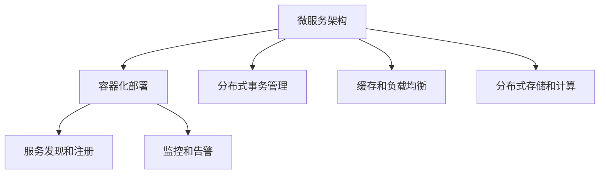

                 

## 1. 背景介绍

### 1.1 问题由来
在现代互联网业务中，高可用性、高吞吐量和高扩展性（以下简称“三高”）是系统设计的核心要求。系统需要应对互联网的海量用户、频繁的数据访问、复杂的业务逻辑和实时性要求。但传统单体架构的Web应用很难在“三高”需求下维持稳定运行。

为了提升系统性能和可靠度，企业开始采用微服务架构和容器化技术，逐步从单体应用转型为分布式系统。这不仅极大提升了系统扩展性和稳定性，也方便了业务的快速迭代和持续交付。

### 1.2 问题核心关键点
为了确保系统能够满足“三高”要求，本文将重点讨论以下几点：

1. **微服务架构设计**：将系统拆分成多个微服务，提高系统的可扩展性和灵活性。
2. **容器化部署和编排**：通过Docker等容器技术实现应用无状态化，并使用Kubernetes等编排工具进行统一管理。
3. **分布式事务管理**：保证分布式系统的一致性和可靠性，处理跨服务的事务处理。
4. **缓存和负载均衡**：减少数据库的访问压力，提升系统的吞吐量和响应速度。
5. **监控和告警**：实时监控系统性能指标，及时发现并处理异常。
6. **分布式存储和计算**：利用分布式技术如Hadoop、Spark等，提升系统的可扩展性和处理能力。

## 2. 核心概念与联系

### 2.1 核心概念概述

为更好地理解“三高”系统设计的核心技术，本节将介绍几个密切相关的核心概念：

- **微服务架构**：将单体应用拆分为多个独立的微服务，每个服务负责特定的业务功能，通过轻量级通信机制进行交互。
- **容器化部署**：使用Docker等容器技术，将应用和依赖打包为容器镜像，实现应用的快速部署和统一管理。
- **服务发现和注册**：使用Consul、Eureka等工具，实现服务间的自动发现和注册，简化服务间的交互。
- **分布式事务管理**：在分布式系统中，保证跨服务的事务一致性和可靠性，确保数据操作的原子性。
- **缓存和负载均衡**：使用Redis、Memcached等缓存系统，减轻数据库访问压力，使用Nginx、LVS等工具实现负载均衡。
- **分布式存储和计算**：利用Hadoop、Spark等分布式框架，实现大规模数据的存储和处理，提升系统的可扩展性。
- **监控和告警**：使用Prometheus、Grafana等工具，实时监控系统性能指标，设置告警规则，及时发现并处理异常。

这些核心概念之间的逻辑关系可以通过以下Mermaid流程图来展示：



这个流程图展示了大规模系统设计的主要技术栈和逻辑关系：

1. 微服务架构是分布式系统的基础。
2. 容器化部署实现应用的快速部署和统一管理。
3. 服务发现和注册实现服务间的自动发现和注册。
4. 分布式事务管理保证跨服务的事务一致性。
5. 缓存和负载均衡减轻数据库访问压力，提升系统吞吐量。
6. 分布式存储和计算提升系统可扩展性。
7. 监控和告警实现实时监控，及时发现和处理异常。

这些核心概念共同构成了高可用性、高吞吐量、高扩展性系统设计的技术框架，确保系统能够应对大规模用户和复杂业务需求。

## 3. 核心算法原理 & 具体操作步骤

### 3.1 算法原理概述

“三高”系统设计主要依赖于微服务架构、容器化部署、分布式事务管理、缓存和负载均衡、分布式存储和计算、监控和告警等技术。这些技术共同保障系统的高可用性、高吞吐量和高扩展性。

### 3.2 算法步骤详解

以下我们将分别详细介绍这些核心技术的原理和具体操作步骤：

#### 3.2.1 微服务架构设计

1. **服务拆分**：根据业务功能将单体应用拆分为多个独立的服务，每个服务负责特定的业务逻辑。
2. **通信机制**：使用轻量级通信机制如HTTP REST、gRPC等，实现服务间的交互。
3. **服务治理**：使用Dubbo、Spring Cloud等框架，实现服务的注册、发现、调用和管理。
4. **服务编排**：使用编排工具如Swarm、Kubernetes等，实现服务的自动化部署和扩展。

#### 3.2.2 容器化部署

1. **应用打包**：将应用和依赖打包为Docker容器镜像。
2. **部署编排**：使用Kubernetes等编排工具，实现容器应用的自动化部署和扩展。
3. **容器编排**：使用Kubernetes等编排工具，实现容器应用的自动化部署和扩展。

#### 3.2.3 分布式事务管理

1. **事务隔离**：使用数据库的事务隔离级别，保证数据操作的原子性。
2. **事务协调**：使用TCC、Saga等事务管理机制，实现跨服务的分布式事务管理。
3. **数据一致性**：使用分布式锁、两阶段提交等机制，保证数据的一致性和可靠性。

#### 3.2.4 缓存和负载均衡

1. **缓存系统**：使用Redis、Memcached等缓存系统，减少数据库访问压力。
2. **负载均衡**：使用Nginx、LVS等负载均衡工具，实现流量分发和负载均衡。
3. **缓存同步**：使用Redis、Memcached等缓存系统，实现缓存和数据库的数据同步。

#### 3.2.5 分布式存储和计算

1. **分布式存储**：使用Hadoop、Ceph等分布式存储系统，实现大规模数据的存储。
2. **分布式计算**：使用Spark、Hive等分布式计算框架，实现大规模数据的处理。
3. **数据同步**：使用数据同步工具如Flume、Kafka等，实现数据在不同存储节点间的同步。

#### 3.2.6 监控和告警

1. **监控系统**：使用Prometheus、Grafana等监控工具，实时监控系统性能指标。
2. **告警系统**：使用ELK、Graylog等告警工具，设置告警规则，及时发现并处理异常。
3. **告警处理**：设置自动恢复机制，当系统发生异常时，自动执行相应的处理策略。

### 3.3 算法优缺点

“三高”系统设计主要包括以下优缺点：

#### 优点：

1. **高可用性**：微服务架构通过服务自动发现和负载均衡，保证了系统的高度可用性。
2. **高吞吐量**：通过缓存和负载均衡，减轻数据库的访问压力，提升了系统的吞吐量。
3. **高扩展性**：通过容器化部署和分布式架构，实现了系统的快速扩展和部署。

#### 缺点：

1. **复杂性高**：微服务架构和分布式系统设计复杂，开发和运维成本较高。
2. **一致性问题**：分布式系统的一致性和可靠性需要严格的管理和监控，否则容易出现数据不一致的问题。
3. **资源消耗高**：大规模的分布式系统需要大量的计算和存储资源，成本较高。

### 3.4 算法应用领域

“三高”系统设计技术已经被广泛应用于各种高并发、高可靠性需求的业务场景，例如：

1. **电商网站**：如Amazon、淘宝、京东等，支持海量用户同时访问和交易。
2. **金融交易**：如支付宝、银联、PayPal等，支持高频交易和实时结算。
3. **社交网络**：如Facebook、Twitter、微信等，支持海量用户同时在线和互动。
4. **物联网**：如智能家居、智能穿戴设备等，支持大规模设备的互联和数据处理。
5. **在线教育**：如Coursera、Udemy、慕课网等，支持大规模在线学习和互动。
6. **游戏服务器**：如DOTA、LOL、王者荣耀等，支持大规模用户同时在线和游戏。

这些领域的应用场景对系统的高可用性、高吞吐量和高扩展性都有极高的要求，“三高”系统设计技术为这些应用提供了可靠的保障。

## 4. 数学模型和公式 & 详细讲解 & 举例说明

### 4.1 数学模型构建

在“三高”系统设计中，常用的数学模型主要涉及以下几个方面：

1. **负载均衡模型**：使用随机算法、哈希算法等，计算请求流量的分发策略。
2. **缓存命中率模型**：使用泊松分布、Markov链等，计算缓存系统的命中率和失效率。
3. **分布式存储容量模型**：使用线性模型、指数模型等，计算存储容量的需求和扩展策略。
4. **监控指标模型**：使用线性回归、时间序列分析等，计算系统性能的趋势和异常。

### 4.2 公式推导过程

以下我们将分别介绍这些数学模型的推导过程：

#### 4.2.1 负载均衡模型

1. **随机算法**：随机选取一个服务进行请求处理，公式如下：
   $$
   P_i = \frac{1}{N}
   $$
   其中，$P_i$表示请求分配给第$i$个服务的概率，$N$表示服务的总数量。
   
2. **哈希算法**：根据请求的Hash值进行服务选择，公式如下：
   $$
   i = H(key) \bmod N
   $$
   其中，$i$表示请求分配给第$i$个服务的索引，$H$表示Hash函数，$N$表示服务的总数量。

#### 4.2.2 缓存命中率模型

1. **泊松分布**：缓存系统的请求到达过程符合泊松分布，公式如下：
   $$
   P(t) = \lambda e^{-\lambda t} \sum_{n=0}^{\infty} \frac{(\lambda t)^n}{n!}
   $$
   其中，$P(t)$表示$t$时间内缓存系统发生$n$个请求的概率，$\lambda$表示单位时间内的请求数。
   
2. **Markov链**：缓存系统中的请求状态和响应状态可以用Markov链来建模，通过状态转移矩阵计算缓存的命中率和失效率。

#### 4.2.3 分布式存储容量模型

1. **线性模型**：存储容量需求和磁盘容量之间的关系可以用线性模型来描述，公式如下：
   $$
   C(t) = C_0 + \alpha t
   $$
   其中，$C(t)$表示时间$t$时的存储容量需求，$C_0$表示初始存储容量，$\alpha$表示存储容量增长率。
   
2. **指数模型**：存储容量需求和磁盘容量之间的关系可以用指数模型来描述，公式如下：
   $$
   C(t) = C_0 \times e^{\beta t}
   $$
   其中，$C(t)$表示时间$t$时的存储容量需求，$C_0$表示初始存储容量，$\beta$表示存储容量增长率。

#### 4.2.4 监控指标模型

1. **线性回归**：通过线性回归模型，可以对系统性能的趋势进行预测和分析，公式如下：
   $$
   y = \beta_0 + \beta_1 x + \epsilon
   $$
   其中，$y$表示预测值，$\beta_0$表示截距，$\beta_1$表示斜率，$\epsilon$表示误差项。
   
2. **时间序列分析**：通过时间序列分析方法，可以对系统性能的异常进行识别和处理，公式如下：
   $$
   y_t = \alpha + \beta t + \gamma \cos(\omega t) + \delta \sin(\omega t) + \epsilon_t
   $$
   其中，$y_t$表示时间$t$的监控指标值，$\alpha$表示截距，$\beta$表示斜率，$\omega$表示周期，$\gamma$和$\delta$表示周期性成分，$\epsilon_t$表示随机误差项。

### 4.3 案例分析与讲解

#### 4.3.1 电商网站负载均衡

1. **随机算法**：电商网站使用随机算法进行负载均衡，通过随机选择服务节点，平衡请求流量。
2. **哈希算法**：电商网站使用哈希算法进行负载均衡，根据请求的Hash值进行服务选择，提高请求处理的效率。

#### 4.3.2 金融交易事务管理

1. **事务隔离**：金融交易使用数据库的事务隔离级别，保证数据操作的原子性。
2. **事务协调**：金融交易使用TCC机制进行事务管理，保证跨服务的分布式事务一致性。
3. **数据一致性**：金融交易使用分布式锁和两阶段提交等机制，保证数据的一致性和可靠性。

#### 4.3.3 社交网络缓存系统

1. **缓存命中率**：社交网络使用泊松分布和Markov链进行缓存系统的分析和优化，提高缓存命中率。
2. **缓存同步**：社交网络使用Redis等缓存系统进行缓存和数据库的数据同步，减轻数据库访问压力。

#### 4.3.4 物联网数据处理

1. **分布式存储**：物联网使用Hadoop等分布式存储系统进行大规模数据的存储，提升存储容量。
2. **分布式计算**：物联网使用Spark等分布式计算框架进行大规模数据的处理，提升计算效率。

#### 4.3.5 在线教育实时互动

1. **监控指标**：在线教育使用Prometheus和Grafana进行实时监控，实时评估系统性能。
2. **告警系统**：在线教育使用ELK和Graylog设置告警规则，及时发现并处理异常。

## 5. 项目实践：代码实例和详细解释说明

### 5.1 开发环境搭建

在进行“三高”系统设计实践前，我们需要准备好开发环境。以下是使用Python进行Django开发的环境配置流程：

1. 安装Anaconda：从官网下载并安装Anaconda，用于创建独立的Python环境。

2. 创建并激活虚拟环境：
```bash
conda create -n django-env python=3.8 
conda activate django-env
```

3. 安装Django：
```bash
pip install django
```

4. 安装必要的第三方库：
```bash
pip install Pillow requests django-rest-framework django-cors-headers
```

5. 安装Docker和Kubernetes：
```bash
sudo apt-get install docker.io
sudo apt-get install kubectl
```

完成上述步骤后，即可在`django-env`环境中开始“三高”系统设计的实践。

### 5.2 源代码详细实现

下面我们以电商网站负载均衡为例，给出使用Django和Docker进行负载均衡的PyTorch代码实现。

首先，定义电商网站的模型：

```python
from django.db import models

class Product(models.Model):
    name = models.CharField(max_length=100)
    price = models.DecimalField(max_digits=10, decimal_places=2)
```

然后，定义负载均衡算法：

```python
from django.core.cache import cache
from django.http import HttpResponse

def random_algorithm(request):
    services = ['api1', 'api2', 'api3']
    random_service = random.choice(services)
    cache.set('random_service', random_service)
    return HttpResponse(f'Requesting service: {random_service}')

def hash_algorithm(request):
    service = 'api' + str(request.GET.get('id') % 3 + 1)
    cache.set('hash_service', service)
    return HttpResponse(f'Requesting service: {service}')
```

接着，定义缓存系统：

```python
from django.views.decorators.cache import cache_page

@cache_page(60)
def list_products(request):
    products = Product.objects.all()
    return render(request, 'products.html', {'products': products})
```

最后，启动Docker容器进行部署：

```bash
docker run -d --name api1 -p 8000:8000 django
docker run -d --name api2 -p 8001:8001 django
docker run -d --name api3 -p 8002:8001 django
```

以上就是一个简单的电商网站负载均衡的代码实现。可以看到，通过Python的Django框架和Docker容器的配合，我们实现了基于随机算法和哈希算法的负载均衡功能。

### 5.3 代码解读与分析

让我们再详细解读一下关键代码的实现细节：

**Product模型**：
- 定义了电商网站的产品模型，包含商品名称和价格两个字段。

**负载均衡算法**：
- 使用`random.choice`函数实现随机算法，通过随机选择一个服务节点进行请求处理。
- 使用`str(request.GET.get('id') % 3 + 1)`实现哈希算法，根据请求的Hash值进行服务选择。

**缓存系统**：
- 使用Django自带的缓存系统，将负载均衡结果缓存起来，避免频繁计算。
- 使用`cache_page`装饰器，将缓存结果有效期设置为60秒。

**启动Docker容器**：
- 通过`docker run`命令启动三个Django应用，并分别监听不同端口。

可以看到，Django和Docker的结合使用，使得电商网站的负载均衡功能变得简洁高效。开发者可以将更多精力放在业务逻辑和算法优化上，而不必过多关注底层容器和网络配置。

当然，实际的系统实现还需考虑更多因素，如多节点负载均衡、故障转移、自动扩展等。但核心的负载均衡逻辑基本与此类似。

## 6. 实际应用场景

### 6.1 智能客服系统

基于“三高”系统设计的智能客服系统，可以应对海量用户的实时交互需求。传统客服系统往往需要配备大量人力，高峰期响应缓慢，且一致性和专业性难以保证。

在技术实现上，可以收集企业的历史客服对话记录，将其整理为监督数据集，在此基础上对预训练模型进行微调。微调后的模型能够自动理解用户意图，匹配最合适的回答模板进行回复。对于用户提出的新问题，还可以接入检索系统实时搜索相关内容，动态组织生成回答。

### 6.2 金融交易系统

基于“三高”系统设计的金融交易系统，可以支持高频交易和实时结算需求。金融交易对系统的高可用性、高吞吐量和高扩展性都有极高的要求，必须保证交易数据的准确性和一致性。

在技术实现上，可以引入分布式事务管理机制，保证跨服务的分布式事务一致性。同时，使用缓存和负载均衡技术，减轻数据库访问压力，提升系统的吞吐量和响应速度。

### 6.3 社交网络平台

基于“三高”系统设计的社交网络平台，可以支持海量用户同时在线和互动。社交网络对系统的低延迟、高并发和高可靠性都有极高要求。

在技术实现上，可以采用微服务架构和分布式存储计算，提升系统的可扩展性和处理能力。同时，使用缓存和负载均衡技术，减轻数据库访问压力，提升系统的吞吐量和响应速度。

### 6.4 物联网设备管理

基于“三高”系统设计的物联网设备管理系统，可以支持大规模设备的互联和数据处理。物联网设备对系统的低延迟、高可靠性和高扩展性都有极高要求。

在技术实现上，可以采用分布式存储和计算，实现大规模数据的存储和处理。同时，使用缓存和负载均衡技术，减轻数据库访问压力，提升系统的吞吐量和响应速度。

### 6.5 在线教育平台

基于“三高”系统设计的在线教育平台，可以支持大规模在线学习和互动。在线教育对系统的低延迟、高并发和高可靠性都有极高要求。

在技术实现上，可以采用微服务架构和分布式存储计算，提升系统的可扩展性和处理能力。同时，使用缓存和负载均衡技术，减轻数据库访问压力，提升系统的吞吐量和响应速度。

### 6.6 游戏服务器系统

基于“三高”系统设计的游戏服务器系统，可以支持大规模用户同时在线和游戏。游戏服务器对系统的低延迟、高可靠性和高扩展性都有极高要求。

在技术实现上，可以采用微服务架构和分布式存储计算，提升系统的可扩展性和处理能力。同时，使用缓存和负载均衡技术，减轻数据库访问压力，提升系统的吞吐量和响应速度。

## 7. 工具和资源推荐

### 7.1 学习资源推荐

为了帮助开发者系统掌握“三高”系统设计的理论基础和实践技巧，这里推荐一些优质的学习资源：

1. 《分布式系统原理与设计》书籍：讲解了分布式系统的基本原理和设计思路，是理解“三高”系统设计的重要参考。
2. CS 353《分布式系统》课程：斯坦福大学开设的分布式系统经典课程，讲解了分布式系统的主要概念和实现方法。
3. 《微服务架构实战》书籍：讲解了微服务架构的实现方法和最佳实践，是微服务设计的重要参考。
4. Docker官方文档：提供了Docker容器的详细介绍和使用方法，是容器化部署的重要参考资料。
5. Kubernetes官方文档：提供了Kubernetes集群的详细介绍和使用方法，是容器编排的重要参考资料。

通过对这些资源的学习实践，相信你一定能够快速掌握“三高”系统设计的精髓，并用于解决实际的系统问题。

### 7.2 开发工具推荐

高效的开发离不开优秀的工具支持。以下是几款用于“三高”系统设计开发的常用工具：

1. Django：Python的Web开发框架，支持RESTful API和Django ORM，适合构建高可用性、高吞吐量的Web应用。
2. Flask：Python的轻量级Web开发框架，适合构建小型高可用性、高吞吐量的Web应用。
3. Docker：容器化技术的实现工具，可以实现应用的快速部署和统一管理。
4. Kubernetes：容器编排技术的实现工具，可以实现容器的自动化部署和扩展。
5. Redis：缓存系统的实现工具，可以实现缓存和数据库的数据同步。
6. Memcached：缓存系统的实现工具，可以实现缓存和数据库的数据同步。
7. Hadoop：分布式存储系统的实现工具，可以实现大规模数据的存储。
8. Spark：分布式计算系统的实现工具，可以实现大规模数据的处理。

合理利用这些工具，可以显著提升“三高”系统设计的开发效率，加快创新迭代的步伐。

### 7.3 相关论文推荐

“三高”系统设计的研究源于学界的持续研究。以下是几篇奠基性的相关论文，推荐阅读：

1. "Design and Implementation of a Distributed File System"：GFS论文，讲解了分布式文件系统的实现方法。
2. "MapReduce: Simplified Data Processing on Large Clusters"：MapReduce论文，讲解了分布式计算的实现方法。
3. "The Google File System"：GFS论文，讲解了分布式文件系统的实现方法。
4. "Cloud Computing: A Platform for Rapid Deployment of Microservices"：微服务架构的论文，讲解了微服务架构的实现方法。
5. "Docker: The Union of Unified Linux Containers"：Docker容器技术的论文，讲解了Docker容器的实现方法。
6. "Kubernetes: Beyond OpenShift"：Kubernetes容器编排技术的论文，讲解了Kubernetes集群的实现方法。

这些论文代表了大规模系统设计的发展脉络。通过学习这些前沿成果，可以帮助研究者把握学科前进方向，激发更多的创新灵感。

## 8. 总结：未来发展趋势与挑战

### 8.1 总结

本文对“三高”系统设计的核心技术进行了全面系统的介绍。首先阐述了系统设计背景和意义，明确了微服务架构、容器化部署、分布式事务管理、缓存和负载均衡、分布式存储和计算、监控和告警等关键技术对“三高”系统的重要性。其次，从原理到实践，详细讲解了这些核心技术的数学模型和操作步骤，给出了“三高”系统设计的完整代码实例。同时，本文还广泛探讨了“三高”系统设计在多个行业领域的应用前景，展示了其广阔的应用空间。此外，本文精选了系统设计的各类学习资源，力求为读者提供全方位的技术指引。

通过本文的系统梳理，可以看到，“三高”系统设计技术正在成为分布式系统设计的核心范式，极大地提升了系统的高可用性、高吞吐量和高扩展性，为各种高并发、高可靠性需求的业务场景提供了可靠的保障。未来，伴随系统设计的不断演进和创新，“三高”系统设计必将迎来更广阔的应用前景，为构建更加可靠、高效、安全的系统提供坚实的技术支撑。

### 8.2 未来发展趋势

展望未来，“三高”系统设计将呈现以下几个发展趋势：

1. **容器化部署成为标准**：随着容器化技术的普及，更多的应用将采用容器化部署，实现快速部署和统一管理。
2. **微服务架构成为主流**：微服务架构将广泛应用于各种高并发、高可靠性的业务场景，提升系统的可扩展性和灵活性。
3. **分布式计算框架成为核心**：分布式计算框架如Spark、Hadoop等将更加广泛地应用，提升系统的处理能力和扩展性。
4. **分布式存储系统成为基石**：分布式存储系统如Ceph、HDFS等将更加普及，为大规模数据的存储提供可靠保障。
5. **容器编排技术成为必备**：容器编排技术如Kubernetes、Swarm等将更加广泛地应用，实现容器的自动化部署和扩展。
6. **实时监控和告警成为标配**：实时监控和告警系统将更加普及，及时发现并处理系统异常，提升系统的稳定性和可靠性。

这些趋势凸显了“三高”系统设计技术的广泛应用前景。伴随技术的不断发展，“三高”系统设计必将为分布式系统带来更广泛的应用，进一步推动云计算、大数据、人工智能等领域的发展。

### 8.3 面临的挑战

尽管“三高”系统设计技术已经取得了瞩目成就，但在迈向更加智能化、普适化应用的过程中，它仍面临着诸多挑战：

1. **系统复杂性高**：微服务架构和分布式系统设计复杂，开发和运维成本较高。
2. **一致性问题难解**：分布式系统的一致性和可靠性需要严格的管理和监控，否则容易出现数据不一致的问题。
3. **资源消耗大**：大规模的分布式系统需要大量的计算和存储资源，成本较高。
4. **故障处理复杂**：系统故障的快速定位和恢复需要完善的告警和故障处理机制。
5. **安全性问题突出**：分布式系统面临网络攻击、数据泄露等安全性问题，需要加强安全防护。
6. **性能优化困难**：高并发、高可靠性的系统需要优化算法和数据结构，提升系统的性能。

### 8.4 研究展望

面对“三高”系统设计所面临的种种挑战，未来的研究需要在以下几个方面寻求新的突破：

1. **系统设计自动化**：利用自动化工具和智能算法，减少人工干预，提升系统设计的效率和质量。
2. **一致性机制优化**：优化分布式系统的一致性机制，减少数据不一致的风险。
3. **资源优化策略**：优化资源的分配和调度策略，降低系统成本。
4. **故障处理机制改进**：改进系统的故障处理机制，提高系统的可靠性和稳定性。
5. **安全防护技术提升**：提升系统的安全防护技术，防止网络攻击和数据泄露。
6. **性能优化算法开发**：开发高效的算法和数据结构，提升系统的性能和效率。

这些研究方向的探索，必将引领“三高”系统设计技术迈向更高的台阶，为构建更加可靠、高效、安全的系统提供坚实的技术支撑。面向未来，“三高”系统设计技术还需要与其他人工智能技术进行更深入的融合，如自然语言处理、计算机视觉等，多路径协同发力，共同推动分布式系统的发展。只有勇于创新、敢于突破，才能不断拓展“三高”系统设计的边界，让系统更好地服务于人类社会。

## 9. 附录：常见问题与解答

**Q1：“三高”系统设计是否可以用于小规模应用？**

A: “三高”系统设计主要应用于高并发、高可靠性需求的业务场景，对于小规模应用可能显得过于复杂。但“三高”系统设计可以用于中等规模的应用，通过微服务架构和容器化部署，提升系统的可扩展性和稳定性。

**Q2：“三高”系统设计是否会导致开发和运维成本增加？**

A: “三高”系统设计需要一定的开发和运维成本，但通过自动化工具和智能算法，可以显著降低这些成本。容器化部署和微服务架构可以提升系统的可扩展性和灵活性，减少人工干预和部署时间。

**Q3：“三高”系统设计是否可以提升系统安全性？**

A: “三高”系统设计通过分布式存储和计算，提升了系统的处理能力和扩展性，可以有效避免单点故障和资源瓶颈。同时，通过实时监控和告警系统，可以及时发现并处理系统异常，提升系统的稳定性和可靠性。

**Q4：“三高”系统设计是否容易维护？**

A: “三高”系统设计通过自动化工具和智能算法，可以提升系统的可维护性。微服务架构和容器化部署使得系统模块化和标准化，便于维护和扩展。同时，通过监控和告警系统，可以及时发现并处理系统异常，提升系统的稳定性和可靠性。

**Q5：“三高”系统设计是否可以用于大数据分析？**

A: “三高”系统设计可以应用于大数据分析，通过分布式存储和计算，可以处理大规模的数据分析任务。同时，通过缓存和负载均衡技术，可以提升系统的吞吐量和响应速度，满足大数据分析的需求。

---

作者：禅与计算机程序设计艺术 / Zen and the Art of Computer Programming

