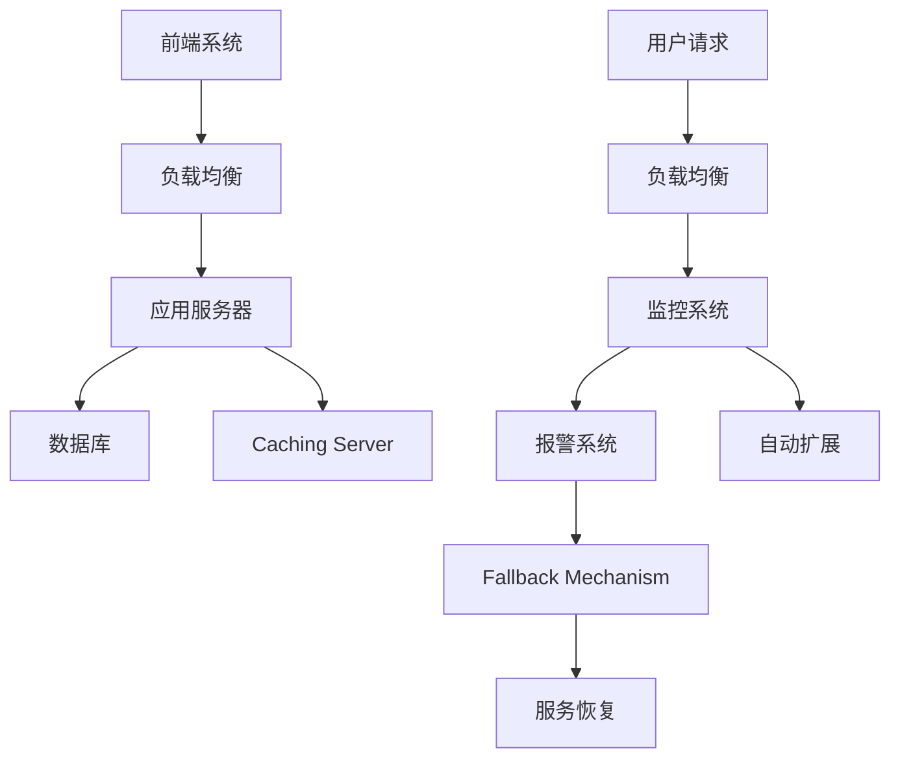
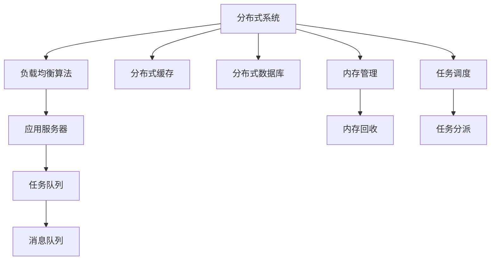

                 

# 高吞吐量系统设计的最佳实践

> 关键词：高吞吐量系统, 设计, 最佳实践, 技术架构, 性能优化, 资源管理, 可扩展性, 负载均衡, 故障恢复

## 1. 背景介绍

### 1.1 问题由来
在互联网的浪潮中，各大公司纷纷推出了自己的云服务、社交网络、电商应用等。随着业务的增长，这些系统都面临着极高的流量峰值和高并发压力，例如：

- 在线电商平台的双11促销、618年中大促等活动，流量瞬间飙升数倍甚至数十倍。
- 社交网络应用的春节红包、双十一等活动，用户互动、信息生成、资源消耗等都急剧增加。
- 云计算平台的服务中断、网络攻击等事件，引起海量请求涌入。

在这样的环境下，如何设计一套高吞吐量、高可用的系统架构，实现高效、稳定、可靠的服务，成为了各大公司面临的重大挑战。随着相关研究的深入，大规模分布式系统的设计已经成为了一门系统性工程，本文将详细介绍其设计理念与实践策略。

### 1.2 问题核心关键点
高吞吐量系统设计涉及多个关键问题，需要综合考虑：

- **设计原则**：系统需要遵循何种设计原则，才能兼顾效率和可靠性？
- **性能优化**：如何通过合理的架构、算法、数据结构等手段，提升系统性能？
- **资源管理**：如何管理计算、内存、存储、网络等系统资源，确保资源利用率最大化？
- **可扩展性**：如何设计系统以支持快速扩展，以应对流量峰值和业务增长的需求？
- **负载均衡**：如何设计均衡的负载分配策略，实现服务器的负载均衡？
- **故障恢复**：系统如何自适应地恢复由硬件或软件故障引发的异常，保证服务的连续性？

## 2. 核心概念与联系

### 2.1 核心概念概述

在深入研究高吞吐量系统设计之前，我们先简要介绍一些核心概念：

- **高吞吐量系统**：能够在高并发、高负载的情况下，维持服务稳定性、高效性和可靠性的系统。
- **分布式系统**：由多台计算机协同工作的系统，可以并行处理多个请求，提高处理能力和系统可扩展性。
- **负载均衡**：将请求均匀分配到多台服务器上，避免单点过载。
- **服务分区**：将系统拆分为多个功能模块，每个模块独立运行，便于横向扩展。
- **容错机制**：在系统硬件或软件发生故障时，自动转移任务，保持系统不中断服务。
- **自动扩展**：系统能够根据负载自动调整资源规模，实现动态扩展。

这些概念彼此紧密联系，共同构成了高吞吐量系统设计的基石。以下是一个简化的Mermaid流程图，描述了高吞吐量系统的关键组成组件和它们之间的交互：



其中，`前端系统`负责接收用户请求，并通过`负载均衡`将请求均衡分配给`应用服务器`处理。`应用服务器`通过访问`数据库`和`缓存`服务获取和存储数据，并返回响应。`监控系统`实时监控服务状态，在出现异常时触发`报警系统`，并启动`自动扩展`以增加服务器数量。`服务恢复`机制保证在部分服务不可用时，也能够快速回退到冗余系统，避免对用户造成影响。

### 2.2 核心概念联系

- **负载均衡与分布式系统**：负载均衡是分布式系统的一个核心组件，将请求分配到多台服务器上，提高系统的可扩展性和鲁棒性。
- **服务分区与容错机制**：通过服务分区，系统被划分为多个功能模块，每个模块独立运行，保证某个模块的故障不会影响其他模块。同时，通过容错机制，即使某个模块不可用，系统仍能继续运行。
- **自动扩展与资源管理**：自动扩展是根据监控系统反馈的负载情况，动态调整服务器资源，实现资源的有效利用。
- **监控与报警**：监控系统实时采集系统性能指标，分析异常并及时报警，是系统稳定运行的重要保障。

通过理解这些核心概念，并合理组合和应用它们，设计出的高吞吐量系统才能具备优秀的性能和稳定性。

## 3. 核心算法原理 & 具体操作步骤
### 3.1 算法原理概述

高吞吐量系统设计涉及多个层次的技术，包括分布式算法、数据结构、资源管理等。为了更好地理解这些概念，我们先进行简单的介绍：

- **分布式算法**：在多台服务器间分配任务，保持系统负载均衡。常用的算法包括随机算法、轮询算法、最小连接数算法等。
- **数据结构**：高吞吐量系统中，常用的数据结构包括红黑树、哈希表、双向链表等。它们可以在支持高并发读写的同时，保持数据的快速访问。
- **资源管理**：合理管理CPU、内存、存储、网络等资源，优化系统性能。常用的技术包括进程调度、内存分页、缓存策略等。

高吞吐量系统设计的核心在于优化以上各个方面，以提升系统性能和可扩展性。以下是一个高吞吐量系统设计的示例：



其中，`负载均衡算法`将请求分配到`应用服务器`；`分布式缓存`和`分布式数据库`分别提供高效的数据存储和查询功能；`任务调度`和`内存管理`确保任务执行和内存使用的高效性；`任务队列`和`消息队列`用于异步处理任务，提高系统吞吐量。

### 3.2 算法步骤详解

高吞吐量系统设计的详细步骤包括：

**Step 1: 系统架构设计**
- 确定系统功能和模块划分，设计分布式架构。
- 确定各个模块之间的通信协议和数据交换方式。
- 设计系统的高可用性和故障恢复机制。

**Step 2: 性能优化**
- 选择合适的算法和数据结构，进行性能评估和调优。
- 使用缓存、内存分页等技术提升数据访问效率。
- 采用分布式缓存和数据库，提高数据处理能力。
- 优化任务调度，实现高效的任务执行。

**Step 3: 资源管理**
- 确定资源的使用策略和优先级。
- 使用监控系统实时跟踪资源使用情况。
- 根据负载自动调整服务器数量和资源配置。

**Step 4: 自动化部署和运维**
- 实现自动化部署流程，提高部署效率。
- 使用容器技术简化系统部署和运维。
- 设计自动化运维工具，快速修复系统异常。

### 3.3 算法优缺点

高吞吐量系统设计具有以下优点：
- 高可用性：通过分布式架构和容错机制，保证系统服务的连续性和稳定性。
- 可扩展性：通过动态扩展服务器资源，系统可以应对突发流量高峰。
- 高效性：通过合理的算法和数据结构，提升系统性能和资源利用率。
- 低成本：通过使用云计算资源，降低了硬件和维护成本。

但同时，它也存在一些缺点：
- 架构复杂：分布式系统设计复杂，需要综合考虑多个模块和组件。
- 调试困难：系统出现问题时，难以快速定位和解决问题。
- 资源浪费：在负载低时，服务器资源利用率较低，存在资源浪费问题。

### 3.4 算法应用领域

高吞吐量系统设计在多个领域都有广泛应用：

- **云计算**：云服务提供商通过高吞吐量系统设计，保障了海量用户数据的存储和处理。
- **电商**：电商平台的订单处理、商品推荐等核心功能，均需要高吞吐量系统来支撑。
- **社交网络**：社交平台的实时消息、图片上传等功能，需要高吞吐量系统来处理。
- **金融**：金融交易、高频交易等业务，对系统的实时性和稳定性能要求极高。
- **游戏**：游戏的实时对战、在线匹配等业务，需要高吞吐量系统来保证用户体验。

这些应用场景中，高吞吐量系统设计都有助于提升系统性能和可扩展性，保障服务的稳定性和高效性。

## 4. 数学模型和公式 & 详细讲解  
### 4.1 数学模型构建

高吞吐量系统的性能优化通常涉及数学模型构建，以下是一些常见的模型：

- **负载均衡模型**：负载均衡算法可以建模为求解最小化系统负载的优化问题。
- **缓存命中率模型**：缓存命中率模型用于评估缓存系统的效率，目标是最小化缓存失效次数。
- **任务调度模型**：任务调度模型用于确定最优的任务执行顺序，以最大化系统吞吐量。

以缓存命中率模型为例，设缓存大小为C，每个缓存槽只能存储一个数据项，当缓存已满时，新数据项会替换掉其中最久未被访问的数据项。假设每次访问缓存的命中率概率为p，需要求解缓存大小C的最优值，使得缓存命中率最大化。数学模型如下：

$$
\max_{C} \sum_{i=1}^{N} \mathbb{P}(访问缓存成功) = \max_{C} \sum_{i=1}^{N} p_i
$$

其中 $p_i$ 是第i次访问缓存的成功概率。根据缓存命中率公式，当$N >> C$时，命中率近似为 $p = 1 - \frac{C}{N}$。

### 4.2 公式推导过程

缓存命中率模型的推导过程如下：

假设系统共处理N次访问请求，每次访问请求的概率为 $p_i$，缓存大小为C。如果某次访问命中缓存，则返回缓存中的数据项；否则，从数据源读取数据，存入缓存。设第i次访问缓存成功概率为 $p_i$，则命中缓存的次数为：

$$
\sum_{i=1}^{N} \mathbb{P}(访问缓存成功) = \sum_{i=1}^{N} p_i
$$

根据缓存命中率公式，第i次访问命中缓存的概率为：

$$
p_i = 1 - (1 - p) \times (1 - p)^{i-1}
$$

其中 $p = 1 - \frac{C}{N}$。所以：

$$
\sum_{i=1}^{N} p_i = N \times (1 - p) \times (1 - (1 - p)^{N-1}) \approx \frac{C}{N}
$$

因此，当缓存大小C与处理次数N的比值最大化时，命中率也达到最大。即 $C = \frac{N}{p}$。

### 4.3 案例分析与讲解

以阿里巴巴的Tmall双11购物节为例，分析高吞吐量系统设计的应用。

Tmall的双11购物节是全球最大的线上购物活动之一，每秒产生的访问请求数以百万计。为此，阿里巴巴设计了高度可扩展、高可靠性的系统架构，以保障双11期间的服务稳定和高效。

Tmall的系统架构如下：

- **负载均衡**：采用DNS轮询和负载均衡服务器，将访问请求均匀分配到多台服务器。
- **分布式缓存**：使用Redis集群，存储热门商品信息、用户状态等数据，减轻数据库压力。
- **分布式数据库**：使用MySQL集群，提供高性能的读写和事务处理能力。
- **任务调度**：使用分布式任务调度系统Kubernetes，实现任务的自动化部署和扩缩容。
- **内存管理**：使用JVM内存管理技术，优化内存使用效率。
- **监控和报警**：使用Zabbix和Prometheus监控系统，实时采集系统指标，并通过短信、邮件等方式进行报警。

在双11期间，系统通过动态扩容，将服务器数量从数百台增加到数千台，确保了系统的稳定性和高效性。同时，系统还具备高可扩展性和自动容错机制，能够在单点故障时自动进行服务转移，保障服务连续性。

## 5. 项目实践：代码实例和详细解释说明
### 5.1 开发环境搭建

为了实践高吞吐量系统设计，我们以阿里云的云数据库实例为例，搭建一个具有高吞吐量的MySQL数据库集群。

首先，登录阿里云的管理控制台，创建MySQL数据库实例：

1. 创建云数据库实例：选择RDS MySQL版本、实例规格、存储大小、安全组等信息。
2. 配置实例参数：设置数据库端口、管理用户名、密码等参数。
3. 启动实例：点击启动实例，开始创建。

### 5.2 源代码详细实现

以下是一个简单的Python代码示例，展示如何通过MySQL的Python API连接和操作数据库：

```python
import pymysql

# 连接数据库
conn = pymysql.connect(host='your_host', user='your_user', password='your_password', database='your_database', charset='utf8')
cursor = conn.cursor()

# 插入数据
sql = 'INSERT INTO your_table (name, age) VALUES (%s, %s)'
name = 'Alice'
age = 20
cursor.execute(sql, (name, age))
conn.commit()

# 查询数据
sql = 'SELECT * FROM your_table WHERE name=%s'
cursor.execute(sql, (name,))
result = cursor.fetchall()
for row in result:
    print(row)

# 关闭连接
cursor.close()
conn.close()
```

### 5.3 代码解读与分析

通过以上代码，可以看到连接和操作MySQL的基本流程：

- `pymysql.connect()`方法用于创建数据库连接，返回一个`Connection`对象。
- `conn.cursor()`方法用于创建游标对象，用于执行SQL语句。
- `cursor.execute()`方法用于执行SQL语句，返回操作结果。
- `conn.commit()`方法用于提交事务，保存修改。
- `cursor.fetchall()`方法用于获取查询结果，返回一个元组列表。

在实际开发中，我们通常使用ORM（对象关系映射）工具来简化数据库操作，如SQLAlchemy。ORM可以将数据库操作转化为对象操作，使代码更加清晰易读。

### 5.4 运行结果展示

执行上述代码，可以看到插入和查询数据的完整过程。例如，插入一条数据后，可以通过以下代码查询：

```python
sql = 'SELECT * FROM your_table WHERE name=%s'
cursor.execute(sql, (name,))
result = cursor.fetchall()
for row in result:
    print(row)
```

结果将打印出数据库中存储的数据行，确认插入操作成功。

## 6. 实际应用场景
### 6.1 智能推荐系统

高吞吐量系统设计在智能推荐系统中也有重要应用。推荐系统需要处理海量用户数据，计算用户和商品之间的关联关系，实时生成推荐结果。高吞吐量系统设计可以提升推荐系统的响应速度和可扩展性，提高推荐的实时性和准确性。

以京东的推荐系统为例，该系统设计了多台服务器协同处理推荐请求，每个服务器独立计算，再将结果合并。同时，采用缓存和CDN技术，提升推荐结果的查询效率。

### 6.2 实时数据处理系统

高吞吐量系统设计还可以应用于实时数据处理系统。大数据平台需要处理海量数据，并实时生成分析报告和数据可视化。高吞吐量系统设计可以提升数据处理和分析的效率，保障数据的实时性。

以Apache Kafka为例，该系统可以处理海量数据流，通过分布式架构和负载均衡，确保数据处理的稳定性和高效性。Kafka的分布式特性还可以支持横向扩展，实现数据流的可靠传输。

### 6.3 云服务

云服务提供商通过高吞吐量系统设计，可以提供高可用性、高可靠性的云服务。例如，亚马逊的AWS服务，通过高吞吐量系统设计，保证了全球用户的访问速度和可用性。

AWS的云服务架构包括：
- **负载均衡**：使用ELB（Elastic Load Balancing），将请求分配到多个EC2（Elastic Compute Cloud）实例。
- **分布式缓存**：使用Redis缓存，减少数据库访问压力。
- **分布式数据库**：使用RDS（Relational Database Service）数据库，提供高性能的数据存储和查询功能。
- **任务调度**：使用ECS（Elastic Container Service），实现任务的自动化部署和扩缩容。
- **内存管理**：使用EC2实例的内存管理技术，优化内存使用效率。
- **监控和报警**：使用AWS CloudWatch，实时监控系统指标，并通过短信、邮件等方式进行报警。

## 7. 工具和资源推荐
### 7.1 学习资源推荐

为了深入学习高吞吐量系统设计，推荐以下学习资源：

1. **《高可用性分布式系统》**：这是一本经典的高可用性分布式系统书籍，涵盖了负载均衡、故障恢复、数据存储等核心概念。
2. **《分布式系统设计》**：斯坦福大学提供的分布式系统课程，涵盖了负载均衡、缓存、数据库等核心组件的设计与实现。
3. **《深入理解分布式系统》**：张裕峰等著，详细介绍了分布式系统的设计原理和实现方法。
4. **《高性能计算机系统》**：何向东等著，介绍了高性能计算机系统的设计与实现，包括负载均衡、缓存、数据库等核心组件。
5. **《Kubernetes实战》**：刘聪等著，介绍了Kubernetes集群的搭建和运维方法，适合实践高吞吐量系统设计。

### 7.2 开发工具推荐

高吞吐量系统设计的开发工具包括：

1. **MySQL**：高吞吐量系统设计离不开高效的数据库，MySQL是一个性能优异的关系型数据库。
2. **Redis**：高吞吐量系统设计需要高效的缓存机制，Redis是一个高性能的分布式缓存系统。
3. **Kafka**：高吞吐量系统设计需要高效的数据处理机制，Kafka是一个高性能的分布式数据流平台。
4. **Nginx**：高吞吐量系统设计需要高效的负载均衡机制，Nginx是一个高性能的Web服务器和反向代理服务器。
5. **ELK Stack**：高吞吐量系统设计需要高效的监控和日志系统，ELK Stack是一个高性能的日志管理和分析系统。

### 7.3 相关论文推荐

以下是一些高吞吐量系统设计的相关论文，推荐阅读：

1. **《高可用性分布式系统》**：Lamport等著，介绍了高可用性分布式系统的设计原理和实现方法。
2. **《高性能计算机系统》**：Cormen等著，详细介绍了高性能计算机系统的设计与实现。
3. **《数据中心操作系统的设计与实现》**：Ahmad等著，介绍了数据中心操作系统的设计与实现方法。
4. **《Kubernetes：一种自动化部署和扩展的系统》**：Hang等著，介绍了Kubernetes集群的搭建和运维方法。

## 8. 总结：未来发展趋势与挑战
### 8.1 总结

本文详细介绍了高吞吐量系统设计的背景、核心概念与联系、算法原理与操作步骤，并通过实际案例展示了高吞吐量系统设计的应用。通过深入学习高吞吐量系统设计，可以设计出高可用性、高效性、可扩展性的分布式系统，保障业务的稳定性和高效性。

### 8.2 未来发展趋势

高吞吐量系统设计的未来发展趋势包括：

1. **分布式架构更加精细化**：未来将出现更加精细化的分布式架构，包括微服务架构、服务网格架构等，能够实现更加细粒度的任务分配和负载均衡。
2. **资源管理更加智能化**：未来将出现更加智能化的资源管理机制，通过机器学习算法，自动调整服务器配置和资源分配，实现最优资源利用。
3. **故障恢复更加自动化**：未来将出现更加自动化的故障恢复机制，通过自动化部署和负载均衡，快速回退到冗余系统，保证服务的连续性。
4. **监控与报警更加精确**：未来将出现更加精确的监控和报警系统，通过实时监控和异常检测，及时发现和解决问题，保证系统的高可用性。
5. **云服务更加普及**：未来云服务将成为主流的系统架构，通过云服务的高可扩展性和高可用性，满足海量用户和业务的需求。

### 8.3 面临的挑战

高吞吐量系统设计虽然取得了显著的进展，但仍面临以下挑战：

1. **架构复杂度增加**：随着系统规模的扩大，分布式架构变得更加复杂，系统设计和维护难度增加。
2. **故障恢复难度加大**：系统复杂度增加，故障恢复难度加大，需要更加精细化的设计和运维。
3. **资源管理更加困难**：系统规模扩大，资源管理变得更加困难，需要更加智能化的资源管理系统。
4. **监控与报警系统复杂**：系统规模扩大，监控与报警系统也变得更加复杂，需要更加精确的监控和报警机制。
5. **云服务成本增加**：云服务虽然高效，但成本较高，需要更加精细化的资源管理策略。

### 8.4 研究展望

高吞吐量系统设计未来的研究展望包括：

1. **智能化系统设计**：未来的系统设计将更加智能化，通过机器学习、大数据等技术，自动优化系统性能。
2. **自动化部署与运维**：未来的系统部署和运维将更加自动化，通过DevOps和CI/CD工具，实现快速部署和持续集成。
3. **高可扩展性架构**：未来的系统架构将更加高可扩展性，通过微服务架构和容器技术，实现快速扩展和部署。
4. **高可用性机制**：未来的系统设计将更加注重高可用性，通过冗余系统、自动容错等机制，保证系统的高可用性。
5. **安全与隐私保护**：未来的系统设计将更加注重安全和隐私保护，通过加密、访问控制等技术，保障数据的安全性和隐私性。

通过以上措施，未来高吞吐量系统设计将更加高效、稳定、可靠，为大规模系统的高性能、高可用性、高可扩展性提供强有力的保障。

