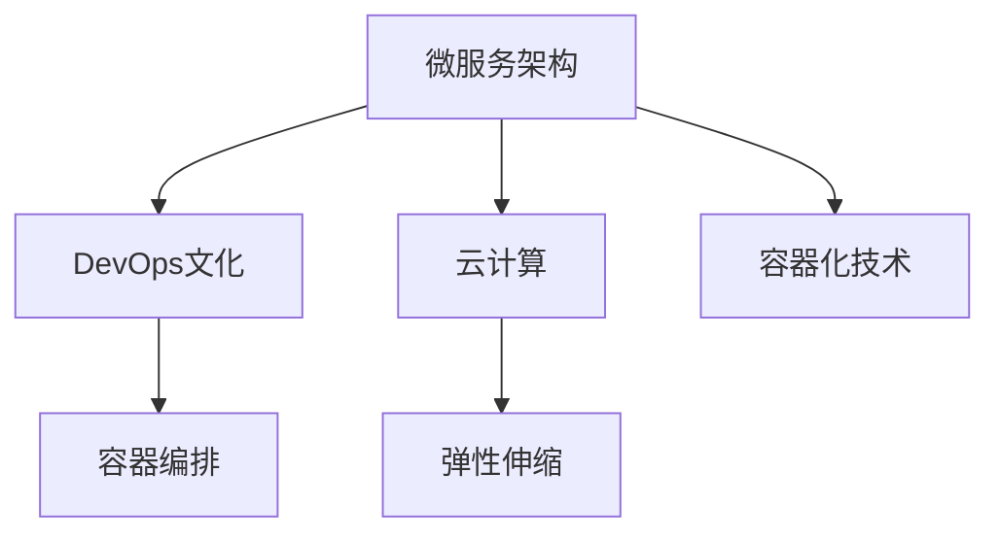

                 

# 高扩展性系统设计的实际案例

> 关键词：高扩展性，系统设计，案例研究，架构模式，DevOps，云计算

## 1. 背景介绍

在当前数字化转型加速的背景下，企业需要构建具备高度可扩展性和灵活性的信息系统，以应对市场变化和业务增长的需求。然而，许多传统企业面临的核心问题是原有系统架构难以支持快速扩展，导致无法及时响应市场变化。高扩展性系统设计的目标是构建一套既能满足当前业务需求，又能快速应对未来增长的信息系统，从而保持持续的竞争力。本文将通过几个实际案例，展示高扩展性系统设计的理念和实践。

## 2. 核心概念与联系

### 2.1 核心概念概述

高扩展性系统设计（High-Scalability System Design）旨在构建具有高度适应性、灵活性和可扩展性的信息系统，以便在业务需求增长、技术迭代和市场变化时，能够快速扩展、升级和适应。

高扩展性系统设计通常涉及以下核心概念：

- **微服务架构（Microservices Architecture）**：将系统分解为多个小型、独立的服务，每个服务专注于单一业务功能，通过API进行通信，提高系统灵活性和可扩展性。

- **DevOps（Development & Operations）文化**：结合软件开发（Development）和运维（Operations），通过持续集成（CI）、持续交付（CD）和持续监控，加速系统构建、部署和维护过程。

- **云计算（Cloud Computing）**：利用云计算平台（如AWS、Azure、Google Cloud等）提供的弹性计算资源和分布式服务，实现系统的高效扩展和资源管理。

- **容器化（Containerization）技术**：通过Docker等容器技术，将应用打包为可移植、可重复使用的容器镜像，简化部署和运维过程。

- **容器编排（Container Orchestration）**：使用Kubernetes等容器编排工具，实现自动化、可扩展的容器部署和调度，支持大规模应用环境的管理。

- **弹性伸缩（Auto-Scaling）**：根据系统负载自动调整资源配置，确保系统在高并发的负载下仍能稳定运行。

这些概念之间通过以下Mermaid流程图进行联系：



## 3. 核心算法原理 & 具体操作步骤

### 3.1 算法原理概述

高扩展性系统设计的主要算法原理是通过微服务架构和容器化技术，将系统分解为多个小型、独立的服务，并通过容器编排工具实现自动化的部署和调度。云计算提供的弹性计算资源支持系统动态扩展和资源管理。DevOps文化则通过持续集成和持续交付，确保系统快速迭代和稳定运行。

### 3.2 算法步骤详解

**Step 1: 设计微服务架构**
- 对系统进行业务拆分，将大系统分解为多个小型、独立的服务。
- 明确每个微服务的职责和接口规范，通过RESTful API进行通信。
- 设计服务间的通信协议和数据格式，确保服务间数据的一致性和可靠性。

**Step 2: 实现容器化**
- 将每个微服务打包为Docker容器镜像，确保应用在任意环境下的一致性和可移植性。
- 定义容器镜像的元数据，包括基础镜像、运行时环境配置等。
- 使用容器编排工具（如Kubernetes）管理容器部署和调度。

**Step 3: 实施弹性伸缩**
- 根据系统负载自动调整计算资源配置，使用云计算平台提供的弹性伸缩功能。
- 设置资源监控指标，如CPU利用率、内存使用率等，动态调整资源分配。
- 定期评估系统性能，优化资源配置，确保系统在高并发负载下仍能稳定运行。

**Step 4: 持续集成与持续交付**
- 使用CI/CD工具（如Jenkins、GitLab CI）自动化构建、测试和部署流程。
- 集成自动化测试（Unit Test、Integration Test、Load Test），确保代码质量和安全。
- 设置持续监控和报警机制，实时监控系统性能和异常，快速定位和解决问题。

### 3.3 算法优缺点

**优点：**
- **灵活性**：微服务架构和容器化技术提高了系统的灵活性和可扩展性，可以独立部署、更新和扩展。
- **可维护性**：通过容器化和容器编排，简化了部署和运维过程，提高了系统的可维护性。
- **高可用性**：云计算和弹性伸缩技术确保了系统的高度可用性，减少了系统故障和停机时间。
- **快速迭代**：DevOps文化通过持续集成和持续交付，实现了快速迭代和快速响应市场需求。

**缺点：**
- **复杂性**：微服务架构和服务通信增加了系统复杂性，需要良好的设计和运维能力。
- **资源消耗**：容器化和容器编排引入了额外的资源消耗，需要良好的资源管理和优化。
- **成本问题**：云计算和弹性伸缩技术虽然提高了系统可扩展性，但同时也增加了运营成本。

### 3.4 算法应用领域

高扩展性系统设计在多个领域得到了广泛应用，包括金融、电商、物流、医疗等。

- **金融行业**：构建高扩展性的金融交易系统，支持大并发交易和高吞吐量的需求。
- **电商行业**：设计高扩展性的电商平台，支持大规模商品管理和用户购物体验。
- **物流行业**：实现高扩展性的物流调度系统，支持复杂的物流网络管理和货物追踪。
- **医疗行业**：构建高扩展性的电子病历系统，支持大量患者的医疗数据存储和查询。

## 4. 数学模型和公式 & 详细讲解 & 举例说明

### 4.1 数学模型构建

假设系统负载为 $L$，计算资源为 $R$，单位时间内的请求量为 $Q$。系统性能优化目标是通过动态调整资源配置，使系统负载 $L$ 和计算资源 $R$ 之间的匹配达到最优。设 $k$ 为资源分配因子，则系统的性能优化模型为：

$$
\max_{R} (L / Q) \times R
$$

其中 $Q$ 为单位时间内的请求量，$L$ 为系统负载，$R$ 为计算资源，$k$ 为资源分配因子。

### 4.2 公式推导过程

为了求解上述优化模型，可以采用拉格朗日乘子法，引入拉格朗日乘子 $\lambda$，构造拉格朗日函数：

$$
L(Q, R, k, \lambda) = \frac{L}{Q} \times R - \lambda (R - R_0)
$$

其中 $R_0$ 为预设的计算资源上限。对 $R$ 求导，得到：

$$
\frac{\partial L}{\partial R} = \frac{L}{Q} - \lambda = 0
$$

解得：

$$
\lambda = \frac{L}{Q}
$$

代入 $\lambda$ 的值，得到：

$$
R = \frac{Q}{\frac{L}{Q}} = \frac{Q^2}{L}
$$

### 4.3 案例分析与讲解

以电商平台为例，假设系统负载为 $L$，每秒请求量为 $Q$，预设计算资源上限为 $R_0$。根据上述模型，可以计算出最优的计算资源 $R$：

$$
R = \frac{Q^2}{L}
$$

在实际应用中，电商平台可以根据实时负载和请求量动态调整计算资源，确保系统在高并发场景下仍能稳定运行。

## 5. 项目实践：代码实例和详细解释说明

### 5.1 开发环境搭建

1. 安装Docker和Kubernetes
```bash
sudo apt-get update
sudo apt-get install -y apt-transport-https ca-certificates curl gnupg-agent software-properties-common
curl -fsSL https://download.docker.com/linux/ubuntu/gpg | sudo apt-key add -
sudo add-apt-repository "deb [arch=amd64] https://download.docker.com/linux/ubuntu $(lsb_release -cs) stable"
sudo apt-get update
sudo apt-get install -y docker-ce docker-ce-cli containerd.io
sudo apt-get install -y kubelet kubeadm kubectl
```

2. 配置环境变量
```bash
export KUBECONFIG=/etc/kubernetes/admin.conf
```

### 5.2 源代码详细实现

以下是一个微服务的示例代码，展示了如何通过Docker和Kubernetes实现微服务部署和调度：

```python
# microservice.py
from flask import Flask
app = Flask(__name__)

@app.route('/')
def hello():
    return "Hello, World!"

if __name__ == '__main__':
    app.run(host='0.0.0.0', port=5000)
```

### 5.3 代码解读与分析

**microservice.py** 是实现微服务的基本代码。通过 Flask 框架，创建一个简单的 HTTP 服务，监听 5000 端口。在容器镜像中，将该代码打包为 Docker 镜像，并配置环境变量和运行时参数。

使用 Kubernetes 部署该微服务，需要编写 Deployment 和 Service 的配置文件，并通过 kubectl 命令进行部署：

```yaml
# deployment.yaml
apiVersion: apps/v1
kind: Deployment
metadata:
  name: microservice-deployment
spec:
  replicas: 3
  selector:
    matchLabels:
      app: microservice
  template:
    metadata:
      labels:
        app: microservice
    spec:
      containers:
      - name: microservice
        image: microservice:latest
        ports:
        - containerPort: 5000
```

```yaml
# service.yaml
apiVersion: v1
kind: Service
metadata:
  name: microservice-service
spec:
  selector:
    app: microservice
  ports:
    - protocol: TCP
      port: 80
      targetPort: 5000
  type: LoadBalancer
```

部署完成后，可以通过 Kubernetes 的 Service 对象，获取微服务的公网地址，进行访问测试：

```bash
kubectl apply -f deployment.yaml
kubectl apply -f service.yaml
kubectl get services
kubectl get pods
```

### 5.4 运行结果展示

运行以上代码后，可以通过公网地址访问微服务，查看“Hello, World!”的响应。

```bash
curl http://<microservice-public-ip>:80
```

输出结果为：

```
Hello, World!
```

## 6. 实际应用场景

### 6.1 金融行业

**背景**：某金融公司需要构建高扩展性的交易系统，支持大并发交易和高吞吐量的需求。

**解决方案**：采用微服务架构，将交易系统分解为多个小型、独立的服务，如订单服务、支付服务、清算服务等。每个服务通过API进行通信，确保系统的高可扩展性和高可用性。使用Docker和Kubernetes进行容器化部署和弹性伸缩，确保系统在高并发场景下的稳定运行。

**结果**：通过高扩展性系统设计，金融公司实现了大并发交易的处理能力，满足了高频交易的需求。同时，系统的高可用性和弹性伸缩特性，确保了交易系统的稳定性和可靠性。

### 6.2 电商行业

**背景**：某电商平台需要支持大规模商品管理和用户购物体验，提升用户体验和平台竞争力。

**解决方案**：采用微服务架构，将电商平台分解为商品管理服务、用户服务、购物车服务等。每个服务通过RESTful API进行通信，确保系统的高可扩展性和高可用性。使用Docker和Kubernetes进行容器化部署和弹性伸缩，确保系统在高并发场景下的稳定运行。

**结果**：通过高扩展性系统设计，电商平台实现了大规模商品管理和用户购物体验的提升。系统的高可用性和弹性伸缩特性，确保了电商平台的稳定性和用户体验。

### 6.3 物流行业

**背景**：某物流公司需要实现复杂的物流网络管理和货物追踪，提升物流效率和用户体验。

**解决方案**：采用微服务架构，将物流系统分解为调度服务、仓储服务、配送服务等。每个服务通过API进行通信，确保系统的高可扩展性和高可用性。使用Docker和Kubernetes进行容器化部署和弹性伸缩，确保系统在高并发场景下的稳定运行。

**结果**：通过高扩展性系统设计，物流公司实现了复杂物流网络管理和货物追踪的提升。系统的高可用性和弹性伸缩特性，确保了物流公司的稳定性和用户体验。

### 6.4 未来应用展望

未来，高扩展性系统设计将更加广泛地应用于各行业，构建更具灵活性、可扩展性和高可用性的信息系统。随着云计算技术的进一步发展，高扩展性系统设计将与云计算、容器化、DevOps等技术深度融合，推动各行业的数字化转型和智能化升级。

## 7. 工具和资源推荐

### 7.1 学习资源推荐

1. **《深入理解高扩展性系统设计》**：一本详细介绍高扩展性系统设计的经典书籍，涵盖微服务架构、DevOps文化、云计算、容器化等核心概念。
2. **《高可用性系统设计》**：一本深入讲解系统高可用性设计的书籍，涵盖系统设计、运维、故障处理等实践经验。
3. **《容器化与微服务设计》**：一本详细介绍容器化和微服务设计的书籍，涵盖Docker、Kubernetes等容器化工具的使用和最佳实践。

### 7.2 开发工具推荐

1. **Docker**：用于容器化应用程序的工具，支持快速构建、测试、部署和运行应用。
2. **Kubernetes**：用于容器编排的工具，支持大规模、高可用的容器化应用部署和调度。
3. **Jenkins**：用于持续集成和持续交付的工具，支持自动化构建、测试和部署流程。
4. **GitLab CI/CD**：用于持续集成和持续交付的工具，支持自动化构建、测试和部署流程。

### 7.3 相关论文推荐

1. **《微服务架构》**：一篇详细介绍微服务架构的论文，涵盖微服务设计的最佳实践和注意事项。
2. **《DevOps文化》**：一篇详细介绍DevOps文化的论文，涵盖持续集成、持续交付、持续监控等实践经验。
3. **《高可用性系统设计》**：一篇详细介绍高可用性系统设计的论文，涵盖系统设计、运维、故障处理等实践经验。

## 8. 总结：未来发展趋势与挑战

### 8.1 总结

本文通过几个实际案例，详细介绍了高扩展性系统设计的理念和实践。首先，阐述了高扩展性系统设计的背景和核心概念，包括微服务架构、DevOps文化、云计算、容器化等。其次，从原理到实践，详细讲解了高扩展性系统设计的算法原理和具体操作步骤，并通过代码实例展示了微服务的部署和调度过程。最后，讨论了高扩展性系统设计在实际应用中的场景和未来展望。

通过本文的系统梳理，可以看到，高扩展性系统设计是构建具备高度可扩展性和灵活性的信息系统的有效途径。高扩展性系统设计通过微服务架构、DevOps文化、云计算、容器化等技术手段，实现了系统的高度可扩展性、高可用性和高可维护性。未来，随着技术的不断发展和应用场景的不断拓展，高扩展性系统设计将发挥越来越重要的作用。

### 8.2 未来发展趋势

展望未来，高扩展性系统设计将呈现以下几个发展趋势：

1. **云计算的普及**：随着云计算技术的不断发展，高扩展性系统设计将与云计算深度融合，提供更高效、更灵活的资源管理和扩展能力。
2. **容器化的普及**：Docker和Kubernetes等容器化技术的普及，将进一步提升系统的灵活性和可扩展性，简化部署和运维过程。
3. **DevOps文化的普及**：DevOps文化的普及将加速系统的快速迭代和交付，提升系统的稳定性和可靠性。
4. **人工智能的融合**：高扩展性系统设计将与人工智能技术深度融合，构建更智能、更高效的自动化系统。
5. **区块链的融合**：区块链技术的高安全性和透明性，将提升系统的信任度和可靠性。

### 8.3 面临的挑战

尽管高扩展性系统设计在实际应用中取得了显著成果，但在迈向更加智能化、普适化应用的过程中，仍面临诸多挑战：

1. **复杂性**：微服务架构和服务通信增加了系统复杂性，需要良好的设计和运维能力。
2. **资源消耗**：容器化和容器编排引入了额外的资源消耗，需要良好的资源管理和优化。
3. **成本问题**：云计算和弹性伸缩技术虽然提高了系统可扩展性，但同时也增加了运营成本。
4. **安全性**：高扩展性系统设计在提升系统灵活性的同时，也增加了系统的安全风险。

### 8.4 研究展望

未来，高扩展性系统设计需要在以下几个方面进行深入研究：

1. **自动化工具的优化**：开发更加高效、易用的自动化工具，简化系统的设计和运维过程。
2. **云原生技术的融合**：探索云原生技术（如Kubernetes、Helm等）在高扩展性系统设计中的应用，提升系统的灵活性和可扩展性。
3. **持续集成和持续交付的优化**：探索新的持续集成和持续交付工具和实践，提升系统的快速迭代和交付能力。
4. **安全和隐私的保护**：开发更加安全和可靠的系统和工具，确保系统的数据安全和隐私保护。
5. **人工智能的融合**：探索人工智能技术在高扩展性系统设计中的应用，提升系统的智能化和自动化水平。

## 9. 附录：常见问题与解答

**Q1：高扩展性系统设计是否适用于所有系统？**

A: 高扩展性系统设计适用于具备高并发、高吞吐量和业务快速迭代需求的系统。对于低负载、低并发、无快速迭代需求的系统，采用微服务架构可能反而增加了系统复杂性和运维成本。

**Q2：如何选择合适的容器编排工具？**

A: 选择合适的容器编排工具需要考虑系统的复杂度、扩展需求、资源管理和运维能力。对于中小型系统，可以选择Kubernetes等主流容器编排工具，对于大型、高并发系统，可以选择Ansible等容器编排工具。

**Q3：如何保证系统的安全性和隐私保护？**

A: 保障系统的安全性和隐私保护需要从多个方面进行努力。包括使用安全协议、加密通信、访问控制、身份认证等措施，确保系统的数据安全和隐私保护。

**Q4：如何应对高扩展性系统设计中的复杂性？**

A: 应对高扩展性系统设计中的复杂性需要良好的设计和运维能力。建议采用模块化设计和DevOps文化，提升系统的可维护性和稳定性。

---

作者：禅与计算机程序设计艺术 / Zen and the Art of Computer Programming

