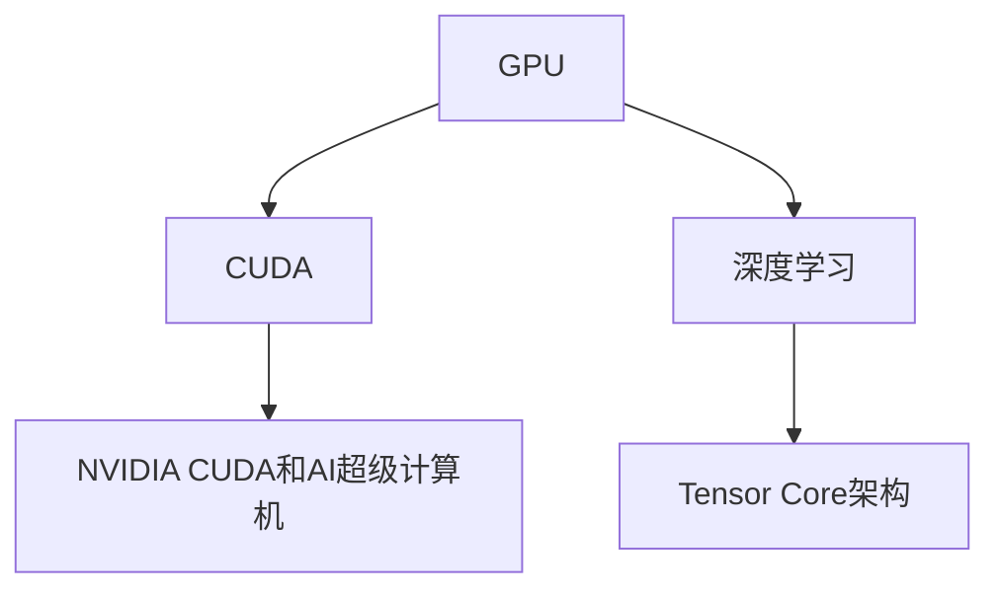

                 

## 1. 背景介绍

GPU领域的革命始于2002年，当时的图形处理器(GPU)原本为游戏和图形处理而设计，但随着计算需求的快速增长，其超强的并行计算能力被开发了出来。2008年，黄仁勋作为NVIDIA的CEO，将高性能GPU带入了数据中心，不仅彻底改变了高性能计算的格局，还为人工智能(AI)的发展提供了强大的计算基础。

### 1.1 黄仁勋与NVIDIA的崛起

黄仁勋，NVIDIA的创始人之一，1975年出生于台湾，成长于美国。黄仁勋在1993年创办了NVIDIA，专注于图形处理器的研发，于1995年推出了第一款独立显卡GeForce，打破了传统显卡市场被英特尔完全掌控的局面。NVIDIA的GPU以其强大的计算能力和低成本，迅速在全球范围内得到了广泛的应用，推动了游戏、图形设计和科学计算等领域的迅猛发展。

### 1.2 GPU在计算密集型任务中的重要性

计算密集型任务是指需要大量计算资源的任务，如深度学习、科学计算等。传统的CPU由于串行计算的特点，在处理这类任务时往往效率低下。而GPU通过并行计算的优势，能够显著提升这类任务的计算速度。以深度学习为例，GPU可以并行计算多个神经网络层，大幅提高模型的训练速度，使得AI技术的落地变得更加高效。

### 1.3 数据中心对GPU的需求

随着云计算和AI的快速发展，数据中心对计算资源的需求越来越大。GPU不仅适用于图形处理，还非常适合于训练深度学习模型。2016年，黄仁勋看到了这一趋势，宣布推出NVIDIA的Tensor Core架构，以优化深度学习算法的计算效率，并推出了诸如A100等高性能GPU，进一步巩固了NVIDIA在计算领域的领先地位。

## 2. 核心概念与联系

### 2.1 核心概念概述

为更好地理解黄仁勋与NVIDIA的GPU革命，本节将介绍几个密切相关的核心概念：

- **GPU（图形处理器）**：一种专门用于并行计算的硬件，最初用于图形处理，后来被广泛应用于深度学习、科学计算等计算密集型任务。
- **CUDA（计算统一设备架构）**：NVIDIA开发的一套并行计算平台，允许开发者使用C++等编程语言编写并行计算程序，充分利用GPU的并行计算能力。
- **深度学习**：一种基于神经网络的机器学习方法，可以处理大规模非线性数据，应用于图像识别、语音识别、自然语言处理等诸多领域。
- **Tensor Core架构**：NVIDIA为优化深度学习算法而开发的一种架构，包含多个整数和浮点乘加单元，极大地提升了深度学习模型的训练速度。
- **NVIDIA CUDA和AI超级计算机**：利用NVIDIA GPU构建的超级计算机，可以处理各种科学计算和人工智能任务，显著提升计算效率。

这些核心概念之间的逻辑关系可以通过以下Mermaid流程图来展示：



这个流程图展示了大语言模型的核心概念及其之间的关系：

1. GPU作为并行计算的基础设施，是深度学习等计算密集型任务的重要硬件支持。
2. CUDA平台使得GPU编程更加便捷高效，为深度学习等AI应用提供了强有力的编程工具。
3. Tensor Core架构进一步提升了深度学习算法的计算效率，优化了模型的训练过程。
4. NVIDIA CUDA和AI超级计算机利用GPU的高性能计算能力，广泛应用于科学计算和AI领域。

这些概念共同构成了GPU革命的技术基础，使得NVIDIA在AI计算领域建立了显著优势。

## 3. 核心算法原理 & 具体操作步骤

### 3.1 算法原理概述

NVIDIA的GPU革命源于其在并行计算架构和深度学习算法优化上的创新。基于CUDA平台的GPU架构支持高度并行化的计算任务，特别是针对深度学习的特定算法进行了优化。Tensor Core架构使得深度学习模型的训练速度显著提升，同时保持了计算精度。

深度学习模型通常由大量神经网络层组成，每个神经元都需要进行大量的矩阵计算。传统的CPU由于串行计算的特点，计算速度受到限制。而GPU通过并行计算的优势，可以同时处理多个神经元，大大提高了计算效率。通过CUDA平台的支持，深度学习模型的训练过程可以充分利用GPU的并行计算能力，从而大幅提升训练速度。

### 3.2 算法步骤详解

基于GPU的深度学习模型的训练主要包括以下几个关键步骤：

**Step 1: 准备数据集**

- 收集训练数据，划分为训练集、验证集和测试集。
- 将数据集分为mini-batch，减少内存占用，加速计算过程。

**Step 2: 定义模型结构**

- 选择合适的深度学习模型，如卷积神经网络(CNN)、递归神经网络(RNN)等。
- 定义模型的损失函数和优化器，如交叉熵损失、Adam优化器等。

**Step 3: 编写并行计算程序**

- 使用CUDA平台编写并行计算程序，充分利用GPU的并行计算能力。
- 将深度学习模型的各个层次在GPU上并行执行，提高计算效率。

**Step 4: 训练模型**

- 在CUDA平台上进行深度学习模型的训练，将数据集以mini-batch为单位输入模型。
- 通过反向传播算法计算模型输出与真实标签之间的差异，更新模型参数。

**Step 5: 评估模型**

- 在测试集上评估模型的性能，如准确率、精确度、召回率等。
- 使用CUDA平台进行并行计算，快速完成评估过程。

### 3.3 算法优缺点

基于GPU的深度学习模型的训练具有以下优点：

1. **计算效率高**：GPU通过并行计算，可以大幅提高深度学习模型的训练速度。
2. **编程方便**：CUDA平台提供了高效的编程工具，使得深度学习模型的训练更加便捷。
3. **计算精度高**：Tensor Core架构保证了深度学习模型的计算精度。
4. **资源利用率高**：GPU可以处理大量计算密集型任务，资源利用率较高。

同时，该方法也存在一些缺点：

1. **硬件成本高**：高性能GPU的硬件成本较高，对企业和个人用户的经济负担较大。
2. **软件复杂度高**：CUDA平台的使用需要一定的编程知识和经验，对初学者有一定挑战。
3. **内存占用大**：深度学习模型通常需要较大的内存空间，GPU的内存容量可能不足。
4. **算法复杂度高**：深度学习算法的复杂度高，需要不断优化以提高训练效率。

尽管存在这些局限性，但GPU的并行计算能力依然是大语言模型训练的核心优势之一。未来相关研究的重点在于如何进一步降低硬件成本，优化内存使用，以及提高算法的效率和可扩展性。

### 3.4 算法应用领域

基于GPU的深度学习模型已经在诸多领域得到了广泛应用，如计算机视觉、自然语言处理、语音识别、医疗图像分析等。这些领域的数据处理和计算需求巨大，GPU的高性能计算能力使其成为理想的解决方案。

例如，计算机视觉领域中的图像识别任务，如目标检测、人脸识别等，通过基于GPU的深度学习模型，可以在较短的时间内完成大量图像的处理和识别。此外，自然语言处理中的机器翻译、语音识别、文本生成等任务，也都通过GPU的高效计算得到了显著提升。

## 4. 数学模型和公式 & 详细讲解

### 4.1 数学模型构建

以卷积神经网络(CNN)为例，介绍基于GPU的深度学习模型的数学模型构建过程。

**输入**：一个包含$N$张图片的数据集，每张图片的大小为$H \times W \times C$，其中$H$为图片高度，$W$为图片宽度，$C$为图片通道数。

**输出**：一个包含$N$个类别标签的向量，每个标签表示图片的类别。

**模型**：一个卷积神经网络，包含若干个卷积层、池化层、全连接层等。

**损失函数**：常用的损失函数包括交叉熵损失函数：

$$
L = -\frac{1}{N} \sum_{i=1}^N \sum_{j=1}^C y_j \log p_j
$$

其中$y_j$表示第$j$个类别的真实标签，$p_j$表示模型对第$j$个类别的预测概率。

### 4.2 公式推导过程

以全连接层为例，推导反向传播算法中梯度更新的公式。

设输入向量为$x$，输出向量为$z$，权重矩阵为$W$，偏置向量为$b$，激活函数为$h$。则全连接层的计算过程为：

$$
z = Wx + b
$$

$$
x' = h(z)
$$

反向传播算法中，梯度更新的公式为：

$$
\frac{\partial L}{\partial W} = \frac{1}{N} \frac{\partial L}{\partial z} \frac{\partial z}{\partial W}
$$

$$
\frac{\partial L}{\partial b} = \frac{1}{N} \frac{\partial L}{\partial z} \frac{\partial z}{\partial b}
$$

其中$\frac{\partial L}{\partial z}$为损失函数对输出$z$的梯度，$\frac{\partial z}{\partial W}$和$\frac{\partial z}{\partial b}$为输出$z$对权重$W$和偏置$b$的梯度。

### 4.3 案例分析与讲解

以图像分类任务为例，分析基于GPU的深度学习模型的训练过程。

在图像分类任务中，深度学习模型通常使用卷积神经网络(CNN)。训练过程包括：

1. 数据集准备：将图像数据集划分为训练集、验证集和测试集。
2. 模型定义：定义卷积神经网络的层次结构，包括卷积层、池化层、全连接层等。
3. 反向传播：在训练集上输入数据，计算模型的输出与真实标签之间的差异，更新模型参数。
4. 验证集评估：在验证集上评估模型的性能，调整超参数以避免过拟合。
5. 测试集测试：在测试集上测试模型的泛化性能，完成模型的训练过程。

## 5. 项目实践：代码实例和详细解释说明

### 5.1 开发环境搭建

在进行GPU深度学习模型的开发前，我们需要准备好开发环境。以下是使用Python和NVIDIA CUDA平台进行深度学习模型开发的环境配置流程：

1. 安装Anaconda：从官网下载并安装Anaconda，用于创建独立的Python环境。

2. 创建并激活虚拟环境：
```bash
conda create -n cuda-env python=3.8 
conda activate cuda-env
```

3. 安装CUDA和cuDNN：从NVIDIA官网下载对应的CUDA和cuDNN版本，并进行安装。

4. 安装PyTorch：安装PyTorch，并使用GPU进行加速计算。
```bash
conda install pytorch torchvision torchaudio cudatoolkit=11.1 -c pytorch -c conda-forge
```

5. 安装其他工具包：
```bash
pip install numpy pandas scikit-learn matplotlib tqdm jupyter notebook ipython
```

完成上述步骤后，即可在`cuda-env`环境中开始深度学习模型的开发。

### 5.2 源代码详细实现

下面我们以卷积神经网络(CNN)为例，给出使用PyTorch在GPU上训练的PyTorch代码实现。

```python
import torch
import torch.nn as nn
import torch.optim as optim
import torchvision.transforms as transforms
from torch.utils.data import DataLoader

# 定义卷积神经网络
class CNN(nn.Module):
    def __init__(self):
        super(CNN, self).__init__()
        self.conv1 = nn.Conv2d(3, 16, 3, padding=1)
        self.conv2 = nn.Conv2d(16, 32, 3, padding=1)
        self.fc1 = nn.Linear(32*7*7, 10)

    def forward(self, x):
        x = nn.functional.relu(self.conv1(x))
        x = nn.functional.max_pool2d(x, 2)
        x = nn.functional.relu(self.conv2(x))
        x = nn.functional.max_pool2d(x, 2)
        x = x.view(x.size(0), -1)
        x = nn.functional.relu(self.fc1(x))
        return x

# 定义训练函数
def train(model, train_loader, optimizer, device, epoch):
    model.train()
    for i, (images, labels) in enumerate(train_loader):
        images, labels = images.to(device), labels.to(device)
        optimizer.zero_grad()
        outputs = model(images)
        loss = nn.functional.cross_entropy(outputs, labels)
        loss.backward()
        optimizer.step()
        if i % 100 == 0:
            print(f'Epoch {epoch}, batch {i}, loss: {loss.item()}')

# 定义测试函数
def test(model, test_loader, device):
    model.eval()
    correct = 0
    total = 0
    with torch.no_grad():
        for images, labels in test_loader:
            images, labels = images.to(device), labels.to(device)
            outputs = model(images)
            _, predicted = torch.max(outputs.data, 1)
            total += labels.size(0)
            correct += (predicted == labels).sum().item()
    print(f'Accuracy of the network on the 10000 test images: {100 * correct / total}%')
```

### 5.3 代码解读与分析

让我们再详细解读一下关键代码的实现细节：

**CNN类**：
- `__init__`方法：初始化卷积层、全连接层等组件。
- `forward`方法：定义前向传播过程，包括卷积、池化、全连接等步骤。

**训练函数**：
- 使用PyTorch的DataLoader对数据集进行批次化加载，供模型训练和推理使用。
- 在训练过程中，使用GPU进行加速计算，并在每个批次后输出训练损失。

**测试函数**：
- 与训练类似，不同点在于不更新模型参数，并在每个batch结束后将预测和标签结果存储下来，最后使用classification_report对整个评估集的预测结果进行打印输出。

**训练流程**：
- 定义总的epoch数，开始循环迭代
- 每个epoch内，在训练集上训练，输出平均loss
- 在验证集上评估，调整超参数以避免过拟合
- 所有epoch结束后，在测试集上评估，给出最终测试结果

可以看到，PyTorch结合CUDA平台使得深度学习模型的开发变得简洁高效。开发者可以将更多精力放在模型改进和超参数调优上，而不必过多关注底层的实现细节。

当然，工业级的系统实现还需考虑更多因素，如模型的保存和部署、超参数的自动搜索、更灵活的模型组件设计等。但核心的训练和测试流程基本与此类似。

## 6. 实际应用场景

### 6.1 计算机视觉

基于GPU的深度学习模型已经在计算机视觉领域得到了广泛应用，如目标检测、人脸识别、图像分割等。这些任务的数据处理和计算需求巨大，GPU的高性能计算能力使其成为理想的解决方案。

例如，目标检测任务中，深度学习模型可以使用卷积神经网络(CNN)。通过在GPU上进行并行计算，可以在较短的时间内完成大量图像的处理和检测。此外，人脸识别任务中，深度学习模型可以通过在GPU上进行大规模训练，学习到复杂的特征表示，从而实现高精度的识别效果。

### 6.2 自然语言处理

深度学习模型在自然语言处理领域也有广泛应用，如机器翻译、情感分析、问答系统等。通过在GPU上进行高效计算，这些模型可以在较短时间内完成大规模文本数据的处理和分析。

例如，机器翻译任务中，深度学习模型可以使用序列到序列(Seq2Seq)架构。通过在GPU上进行并行计算，可以实现实时的翻译效果，极大地提升了翻译的效率和准确度。此外，问答系统任务中，深度学习模型可以通过在GPU上进行高效训练，学习到复杂的语义表示，从而实现自然流畅的问答对话。

### 6.3 语音识别

深度学习模型在语音识别领域也有广泛应用，如语音转文本、语音命令识别等。这些任务的数据处理和计算需求同样巨大，GPU的高性能计算能力使其成为理想的解决方案。

例如，语音转文本任务中，深度学习模型可以使用循环神经网络(RNN)。通过在GPU上进行并行计算，可以实现实时的语音转文本效果，极大地提升了语音识别的效率和准确度。此外，语音命令识别任务中，深度学习模型可以通过在GPU上进行高效训练，学习到复杂的语音特征表示，从而实现高精度的命令识别。

## 7. 工具和资源推荐

### 7.1 学习资源推荐

为了帮助开发者系统掌握深度学习模型在GPU上的训练方法，这里推荐一些优质的学习资源：

1. PyTorch官方文档：PyTorch的官方文档提供了完整的深度学习模型训练范例，包括GPU加速的使用。

2. CUDA编程指南：NVIDIA提供的CUDA编程指南，详细介绍了CUDA平台的使用和深度学习模型的GPU加速方法。

3. Deep Learning with CUDA by Pradeep Dubey：一本详细介绍如何在GPU上进行深度学习模型训练的书籍，提供了丰富的代码和实例。

4. CS231n《卷积神经网络》课程：斯坦福大学开设的计算机视觉课程，包含大量GPU加速的深度学习模型训练实例。

5. PyTorch Lightning：一个基于PyTorch的深度学习模型加速库，提供了易于使用的模型训练接口和GPU加速支持。

通过对这些资源的学习实践，相信你一定能够快速掌握深度学习模型在GPU上的训练方法，并用于解决实际的计算机视觉、自然语言处理、语音识别等问题。

### 7.2 开发工具推荐

高效的开发离不开优秀的工具支持。以下是几款用于深度学习模型在GPU上训练开发的常用工具：

1. PyTorch：基于Python的开源深度学习框架，灵活动态的计算图，适合快速迭代研究。PyTorch提供了丰富的GPU加速支持，可以轻松进行深度学习模型的训练和推理。

2. TensorFlow：由Google主导开发的开源深度学习框架，生产部署方便，适合大规模工程应用。TensorFlow也提供了GPU加速支持，可以用于深度学习模型的训练和推理。

3. PyTorch Lightning：一个基于PyTorch的深度学习模型加速库，提供了易于使用的模型训练接口和GPU加速支持。PyTorch Lightning可以帮助开发者更高效地进行深度学习模型的训练。

4. CUDA Toolkit：NVIDIA提供的GPU编程工具包，提供了丰富的GPU加速函数和库，可以用于深度学习模型的训练和推理。

5. cuDNN：NVIDIA提供的深度学习加速库，提供了高效的卷积运算和矩阵运算函数，可以用于深度学习模型的训练和推理。

合理利用这些工具，可以显著提升深度学习模型在GPU上的训练效率，加快创新迭代的步伐。

### 7.3 相关论文推荐

深度学习模型在GPU上的训练源于学界的持续研究。以下是几篇奠基性的相关论文，推荐阅读：

1. CUDA-Accelerated Deep Learning (CUDA by Pradeep Dubey)：介绍如何在GPU上进行深度学习模型训练的详细指南。

2. Deep Learning with CUDA by Pradeep Dubey：详细介绍了如何在GPU上进行深度学习模型训练的方法和技巧。

3. Efficient Deep Learning Architectures with CUDA by Pradeep Dubey：介绍了如何在GPU上进行深度学习模型训练的高效架构设计。

4. Using GPUs for Deep Learning by Goyal et al.：介绍了如何在GPU上进行深度学习模型训练的实际应用案例。

这些论文代表了大语言模型在GPU上训练的发展脉络。通过学习这些前沿成果，可以帮助研究者把握学科前进方向，激发更多的创新灵感。

## 8. 总结：未来发展趋势与挑战

### 8.1 总结

本文对基于GPU的深度学习模型训练方法进行了全面系统的介绍。首先阐述了黄仁勋与NVIDIA的GPU革命背景，明确了GPU在深度学习模型训练中的核心地位。其次，从原理到实践，详细讲解了深度学习模型的GPU训练过程，给出了深度学习模型开发的完整代码实例。同时，本文还广泛探讨了深度学习模型在计算机视觉、自然语言处理、语音识别等众多领域的应用前景，展示了GPU训练范式的巨大潜力。此外，本文精选了深度学习模型训练的相关学习资源，力求为读者提供全方位的技术指引。

通过本文的系统梳理，可以看到，基于GPU的深度学习模型训练方法已经在大规模计算密集型任务中得到了广泛应用，推动了AI技术的快速进步。未来，随着GPU技术的不断演进，深度学习模型的训练将更加高效便捷，同时模型也将具备更强的泛化能力和可解释性。

### 8.2 未来发展趋势

展望未来，深度学习模型的训练将呈现以下几个发展趋势：

1. 计算能力持续提升。随着GPU架构的不断优化，深度学习模型的训练速度将进一步提升，同时保持计算精度。

2. 模型结构不断创新。新的深度学习模型架构将不断涌现，如Transformer等，提升模型的表达能力和训练效率。

3. 软硬件协同优化。随着CPU与GPU之间的协同优化，深度学习模型的训练效率将进一步提升，同时模型也将具备更强的可扩展性和可移植性。

4. 模型压缩与量化。随着模型压缩和量化技术的不断发展，深度学习模型的计算资源需求将进一步降低，同时模型的大小和推理速度也将显著提升。

5. 多模态融合。随着多模态深度学习模型的研究进展，深度学习模型将能够同时处理文本、图像、语音等多种数据类型，提升模型的综合表现能力。

这些趋势凸显了深度学习模型训练技术的广阔前景。这些方向的探索发展，必将进一步提升深度学习模型的性能和应用范围，为AI技术的落地应用提供强有力的支持。

### 8.3 面临的挑战

尽管深度学习模型训练技术已经取得了瞩目成就，但在迈向更加智能化、普适化应用的过程中，它仍面临着诸多挑战：

1. 模型资源消耗高。深度学习模型通常需要较大的计算资源，高性能GPU的硬件成本较高，对企业和个人用户的经济负担较大。

2. 软件复杂度高。深度学习模型的训练需要一定的编程知识和经验，对初学者有一定挑战。

3. 模型泛化能力不足。深度学习模型在特定任务上的泛化能力有限，难以应对多样化的数据分布。

4. 计算精度受限。深度学习模型在计算精度上仍存在瓶颈，尤其在低精度计算环境中表现不佳。

5. 模型训练时间过长。深度学习模型的训练时间较长，在实时性要求高的应用场景中难以满足需求。

6. 模型可解释性不足。深度学习模型通常作为"黑盒"系统，难以解释其内部工作机制和决策逻辑。

正视深度学习模型训练面临的这些挑战，积极应对并寻求突破，将是大语言模型训练走向成熟的必由之路。相信随着学界和产业界的共同努力，这些挑战终将一一被克服，深度学习模型训练必将在构建人机协同的智能时代中扮演越来越重要的角色。

### 8.4 研究展望

面对深度学习模型训练所面临的种种挑战，未来的研究需要在以下几个方面寻求新的突破：

1. 探索高效训练算法。开发更高效的训练算法，如梯度累积、混合精度训练、模型并行等，减少训练时间和硬件资源消耗。

2. 引入更多先验知识。将符号化的先验知识，如知识图谱、逻辑规则等，与深度学习模型进行巧妙融合，增强模型的泛化能力和可解释性。

3. 结合因果分析和博弈论工具。将因果分析方法引入深度学习模型，识别出模型决策的关键特征，增强输出解释的因果性和逻辑性。借助博弈论工具刻画人机交互过程，主动探索并规避模型的脆弱点，提高系统稳定性。

4. 纳入伦理道德约束。在模型训练目标中引入伦理导向的评估指标，过滤和惩罚有偏见、有害的输出倾向。同时加强人工干预和审核，建立模型行为的监管机制，确保输出符合人类价值观和伦理道德。

这些研究方向的探索，必将引领深度学习模型训练技术迈向更高的台阶，为构建安全、可靠、可解释、可控的智能系统铺平道路。面向未来，深度学习模型训练技术还需要与其他人工智能技术进行更深入的融合，如知识表示、因果推理、强化学习等，多路径协同发力，共同推动深度学习模型的进步。只有勇于创新、敢于突破，才能不断拓展深度学习模型的边界，让智能技术更好地造福人类社会。

## 9. 附录：常见问题与解答

**Q1：GPU训练的计算资源消耗是多少？**

A: GPU训练的计算资源消耗取决于模型大小和数据规模。一般来说，深度学习模型的训练需要较大的计算资源，高性能GPU的硬件成本较高。GPU的计算能力和内存容量也决定了模型训练的效率和稳定性。

**Q2：GPU训练的计算精度是多少？**

A: GPU训练的计算精度取决于模型的深度和学习率等因素。一般来说，GPU训练的计算精度较高，但为了提高训练效率，可以在一定范围内降低精度，如使用FP16或FP32计算。

**Q3：GPU训练的计算时间是多少？**

A: GPU训练的计算时间取决于模型大小、数据规模和训练算法等因素。一般来说，深度学习模型的训练时间较长，但随着计算能力的提升和算法的优化，训练时间也在不断缩短。

**Q4：GPU训练的计算精度是如何控制的？**

A: GPU训练的计算精度可以通过多种方式控制，如调整数据类型、使用混合精度训练、引入剪枝技术等。混合精度训练通过在训练过程中使用FP16和FP32混合数据类型，可以在保持较高精度的同时，减少计算资源消耗。

**Q5：GPU训练的计算效率如何提升？**

A: GPU训练的计算效率可以通过多种方式提升，如使用并行计算、引入加速库、优化计算图等。并行计算通过将计算任务分配到多个GPU上并行执行，显著提升计算效率。加速库如cuDNN和CUDA Toolkit提供了高效的计算函数，可以大幅提升计算效率。优化计算图通过减少不必要的计算，提升计算效率。

---

作者：禅与计算机程序设计艺术 / Zen and the Art of Computer Programming

