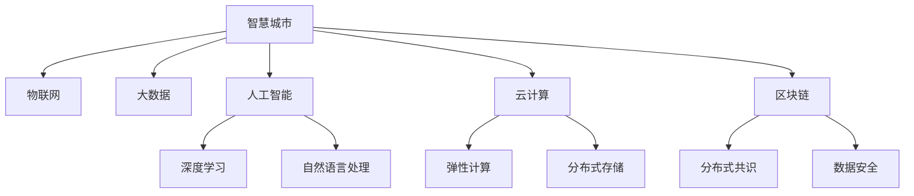

                 

## 1. 背景介绍

### 1.1 问题由来

随着互联网、物联网技术的快速发展，全球进入数据驱动型智能时代。基于AI技术的智慧城市正在成为全球城市建设的新趋势。根据麦肯锡报告，未来15年内，全球智慧城市建设市场将达到1.2万亿美元。

**智慧城市**是基于物联网、云计算、大数据、人工智能等新一代信息技术，通过全面感知、深度融合、智能分析和主动服务，实现城市运行高效化、智能化、精细化、便捷化。

智慧城市已经成为全球各国城市竞争力的重要标志，加快推进智慧城市建设，已成为提升城市治理能力、构建新型城市生活方式的重要途径。然而，当前智慧城市建设中仍面临诸多挑战，如数据孤岛、信息孤岛、资源浪费、服务可达性差等问题。

本文将从智慧城市的背景和重要性入手，深入探讨AI 2.0时代智慧城市建设的关键技术及其应用实践，帮助读者更全面地理解智慧城市的内涵，为智能城市建设的实践提供有益参考。

### 1.2 问题核心关键点

智慧城市的建设核心在于数据整合与协同，离不开AI技术的支撑。AI 2.0时代，以深度学习、增强学习、群体智能为代表的智能技术的发展，将对智慧城市的建设产生深远影响。

1. **数据驱动**：智慧城市建设需海量数据作为支撑，数据采集、清洗、分析和可视化是智慧城市的核心。
2. **自动化决策**：利用AI技术对城市运行数据进行分析，实现自动化、智能化的决策支持，提升城市管理效率。
3. **协同治理**：智慧城市建设涉及政府、企业、市民等多方参与，需构建跨部门、跨层级的协同治理体系。
4. **增强用户体验**：通过智能算法提升城市公共服务品质，改善市民生活体验。

## 2. 核心概念与联系

### 2.1 核心概念概述

为更好理解AI 2.0时代智慧城市的建设，本节将介绍几个密切相关的核心概念：

- **智慧城市**：利用物联网、大数据、人工智能等技术，构建全面感知、深度融合、智能分析和主动服务的智能城市。
- **物联网(IoT)**：通过各种感知技术，实现物与物、人与物的智能互联。
- **大数据(Big Data)**：海量、多源、异构数据的采集、存储、处理和分析技术。
- **人工智能(AI)**：通过机器学习、深度学习、自然语言处理等技术，实现智能决策和自动化服务。
- **云计算(Cloud Computing)**：通过网络技术提供虚拟化、弹性计算、分布式存储等资源。
- **区块链(Blockchain)**：利用分布式共识机制，实现数据的安全、透明、可信。

这些核心概念之间的逻辑关系可以通过以下Mermaid流程图来展示：



这个流程图展示出智慧城市中核心技术的相互关系：

1. 智慧城市通过物联网实现数据的全面感知。
2. 大数据技术对海量数据进行存储和处理，为深度学习和自然语言处理提供数据支撑。
3. 人工智能通过深度学习和自然语言处理技术，实现智能决策和自动化服务。
4. 云计算提供弹性的计算和存储资源，为大规模数据处理和应用服务提供保障。
5. 区块链通过分布式共识机制，保证数据的透明、安全和可信。

## 3. 核心算法原理 & 具体操作步骤

### 3.1 算法原理概述

AI 2.0时代智慧城市的建设，主要依赖于AI技术的核心算法，如深度学习、强化学习、群体智能等。这些算法通过协同处理海量城市运行数据，实现对城市运行状态的全景感知和智能决策。

智慧城市建设的关键在于数据的采集、存储、处理和分析，以提供城市运行状态的可视化、智能化分析与决策支持。这一过程主要包括：

1. **数据采集**：通过各类传感器和设备，采集城市运行的各种数据。
2. **数据存储**：将采集的数据存储在云计算平台，进行数据集中管理。
3. **数据处理**：利用AI技术对存储的数据进行处理，实现数据的实时分析和可视化。
4. **智能决策**：通过深度学习等算法，对城市运行数据进行智能分析和决策。

### 3.2 算法步骤详解

基于AI 2.0技术的智慧城市建设主要包括以下关键步骤：

**Step 1: 数据采集与存储**

- 利用各类传感器、监控摄像头、GPS设备等采集城市运行数据。
- 将采集的数据通过高速网络传输至云计算平台，存储在分布式数据库中。

**Step 2: 数据清洗与预处理**

- 对采集的数据进行清洗，去除噪音数据、异常数据。
- 利用数据挖掘和特征提取技术，对数据进行预处理和特征工程。

**Step 3: 数据处理与分析**

- 利用深度学习、自然语言处理等技术对数据进行处理和分析，实现数据的实时分析和可视化。
- 通过强化学习、群体智能等技术，对数据进行智能分析和决策，生成城市运行报告和预测分析。

**Step 4: 智能决策与优化**

- 利用AI技术对城市运行数据进行分析，实现自动化、智能化的决策支持。
- 根据决策结果，动态调整城市运行策略，优化城市运行状态。

**Step 5: 智能服务与反馈**

- 通过智能算法提升城市公共服务品质，改善市民生活体验。
- 利用市民反馈数据，持续优化城市服务，实现自适应和持续改进。

### 3.3 算法优缺点

AI 2.0时代智慧城市的算法具有以下优点：

1. **数据驱动**：依赖于大规模数据驱动决策，能提升城市管理的精准性和科学性。
2. **智能化决策**：通过AI技术实现自动化、智能化的决策支持，提升城市管理效率。
3. **自适应优化**：通过持续优化和反馈，实现城市运行状态的实时调整和优化。

但同时，这些算法也存在以下局限：

1. **数据依赖性强**：高度依赖于数据采集和存储，数据质量直接影响决策效果。
2. **算法复杂度高**：深度学习、强化学习等算法实现复杂，需要高度专业化的技术支持。
3. **隐私与安全风险**：数据采集和存储过程中，存在隐私泄露和数据安全问题。
4. **透明度不足**：AI算法的决策过程复杂，难以解释其内部工作机制。

### 3.4 算法应用领域

AI 2.0时代智慧城市涉及多个领域的应用，如交通、公共安全、环境保护、医疗、教育等。

- **交通管理**：利用AI技术实现智能交通管理，提升交通流量管理效率。
- **公共安全**：通过AI技术实现视频监控、人脸识别、行为分析等，提升城市安全水平。
- **环境保护**：利用AI技术实现空气质量、水质监测、垃圾分类等，改善城市环境。
- **医疗服务**：通过AI技术实现远程诊疗、疾病预测、药物研发等，提升医疗服务水平。
- **教育服务**：利用AI技术实现个性化教育、智能评估、学习推荐等，改善教育质量。

## 4. 数学模型和公式 & 详细讲解  
### 4.1 数学模型构建

智慧城市的建设依赖于多种AI算法，以下以深度学习为例，介绍其数学模型构建。

假设采集的城市运行数据为 $x_i$，通过深度学习模型 $f_{\theta}$ 进行预测，输出为 $y_i$。定义损失函数为均方误差，则模型训练的目标为：

$$
\min_{\theta} \frac{1}{N} \sum_{i=1}^N (y_i - f_{\theta}(x_i))^2
$$

其中 $N$ 为样本数量。

利用反向传播算法计算损失函数对模型参数 $\theta$ 的梯度，并通过优化算法更新参数。常见优化算法包括随机梯度下降法(SGD)、Adam优化器等。

### 4.2 公式推导过程

以下我们以二分类任务为例，推导深度学习模型的训练过程。

假设模型 $f_{\theta}$ 在输入 $x$ 上的输出为 $\hat{y}=f_{\theta}(x)$，表示样本属于正类的概率。真实标签 $y \in \{0,1\}$。则二分类交叉熵损失函数定义为：

$$
\ell(y, \hat{y}) = -[y\log \hat{y} + (1-y)\log(1-\hat{y})]
$$

将其代入经验风险公式，得：

$$
\mathcal{L}(\theta) = -\frac{1}{N}\sum_{i=1}^N [y_i\log \hat{y}_i+(1-y_i)\log(1-\hat{y}_i)]
$$

根据链式法则，损失函数对模型参数 $\theta$ 的梯度为：

$$
\frac{\partial \mathcal{L}(\theta)}{\partial \theta} = -\frac{1}{N}\sum_{i=1}^N (\frac{y_i}{\hat{y}_i}-\frac{1-y_i}{1-\hat{y}_i}) \frac{\partial f_{\theta}(x)}{\partial \theta}
$$

其中 $\frac{\partial f_{\theta}(x)}{\partial \theta}$ 可进一步递归展开，利用自动微分技术完成计算。

在得到损失函数的梯度后，即可带入优化算法更新模型参数。重复上述过程直至收敛，最终得到适应城市运行数据的最优模型参数 $\theta^*$。

## 5. 项目实践：代码实例和详细解释说明

### 5.1 开发环境搭建

在进行智慧城市项目开发前，我们需要准备好开发环境。以下是使用Python进行PyTorch开发的环境配置流程：

1. 安装Anaconda：从官网下载并安装Anaconda，用于创建独立的Python环境。

2. 创建并激活虚拟环境：
```bash
conda create -n pytorch-env python=3.8 
conda activate pytorch-env
```

3. 安装PyTorch：根据CUDA版本，从官网获取对应的安装命令。例如：
```bash
conda install pytorch torchvision torchaudio cudatoolkit=11.1 -c pytorch -c conda-forge
```

4. 安装各类工具包：
```bash
pip install numpy pandas scikit-learn matplotlib tqdm jupyter notebook ipython
```

完成上述步骤后，即可在`pytorch-env`环境中开始智慧城市项目的开发。

### 5.2 源代码详细实现

这里我们以智能交通系统为例，给出使用PyTorch进行深度学习模型训练的PyTorch代码实现。

首先，定义交通流量预测任务的数据处理函数：

```python
import torch
from torch.utils.data import Dataset
import numpy as np

class TrafficDataset(Dataset):
    def __init__(self, data):
        self.data = data
        
    def __len__(self):
        return len(self.data)
    
    def __getitem__(self, item):
        x = self.data[item][0:6]
        y = self.data[item][6]
        return x, y
```

然后，定义模型和优化器：

```python
from torch import nn, optim
import torch.nn.functional as F

class TrafficNet(nn.Module):
    def __init__(self):
        super(TrafficNet, self).__init__()
        self.fc1 = nn.Linear(6, 128)
        self.fc2 = nn.Linear(128, 128)
        self.fc3 = nn.Linear(128, 1)
    
    def forward(self, x):
        x = F.relu(self.fc1(x))
        x = F.relu(self.fc2(x))
        x = self.fc3(x)
        return x

model = TrafficNet()
optimizer = optim.Adam(model.parameters(), lr=0.001)
```

接着，定义训练和评估函数：

```python
def train_model(model, data_loader, optimizer):
    model.train()
    total_loss = 0
    for i, (inputs, labels) in enumerate(data_loader):
        optimizer.zero_grad()
        outputs = model(inputs)
        loss = F.mse_loss(outputs, labels)
        loss.backward()
        optimizer.step()
        total_loss += loss.item()
    return total_loss / len(data_loader)
    
def evaluate_model(model, data_loader):
    model.eval()
    total_loss = 0
    for i, (inputs, labels) in enumerate(data_loader):
        with torch.no_grad():
            outputs = model(inputs)
            loss = F.mse_loss(outputs, labels)
        total_loss += loss.item()
    return total_loss / len(data_loader)
```

最后，启动训练流程并在测试集上评估：

```python
epochs = 100
data_loader = DataLoader(train_dataset, batch_size=16)

for epoch in range(epochs):
    loss = train_model(model, data_loader, optimizer)
    print(f'Epoch {epoch+1}, loss: {loss:.3f}')
    
test_loader = DataLoader(test_dataset, batch_size=16)
print(f'Test loss: {evaluate_model(model, test_loader):.3f}')
```

以上就是使用PyTorch进行智能交通系统深度学习模型训练的完整代码实现。可以看到，得益于PyTorch的强大封装，我们可以用相对简洁的代码完成模型训练和评估。

### 5.3 代码解读与分析

让我们再详细解读一下关键代码的实现细节：

**TrafficDataset类**：
- `__init__`方法：初始化数据集。
- `__len__`方法：返回数据集样本数量。
- `__getitem__`方法：对单个样本进行处理，返回模型输入和目标输出。

**TrafficNet类**：
- `__init__`方法：定义模型结构，包括输入层、隐藏层和输出层。
- `forward`方法：前向传播计算模型输出。

**train_model和evaluate_model函数**：
- `train_model`函数：遍历训练集数据，前向传播计算损失，反向传播更新模型参数，并累加平均损失。
- `evaluate_model`函数：遍历测试集数据，前向传播计算损失，并累加平均损失。

**训练流程**：
- 定义总迭代次数，创建数据加载器。
- 每个epoch内，在训练集上训练，输出平均loss。
- 在测试集上评估，输出测试平均loss。

可以看到，PyTorch配合TensorFlow库使得模型训练的代码实现变得简洁高效。开发者可以将更多精力放在数据处理、模型改进等高层逻辑上，而不必过多关注底层的实现细节。

## 6. 实际应用场景

### 6.1 智能交通系统

智能交通系统利用AI技术实现交通流量预测、交通信号控制、路径规划等，提升交通管理效率。具体而言，可以通过智能传感器采集交通流量数据，利用深度学习模型预测未来交通流量，生成实时交通报告，并优化交通信号控制和路径规划。

通过智慧城市平台，公众可以实时查看交通状况、出行建议等，改善出行体验。智能交通系统还可以与城市应急管理系统联动，在紧急情况下快速响应，保障市民安全。

### 6.2 智能医疗服务

智慧医疗通过AI技术实现远程诊疗、疾病预测、药物研发等，提升医疗服务水平。具体而言，可以通过智能诊断系统对患者进行影像、文本等多模态数据的分析和诊断，提供精准的医疗建议。利用深度学习技术进行药物分子设计和筛选，加速新药研发进程。

智慧医疗平台还可以实现跨地区医疗资源共享，通过智能推荐系统为患者推荐最佳治疗方案和医院，提升医疗服务的可及性和效率。

### 6.3 智能城市安防

智能城市安防系统利用AI技术实现视频监控、人脸识别、行为分析等，提升城市安全水平。具体而言，可以通过智能视频监控系统对公共区域进行实时监控，自动检测异常行为和事件。利用人脸识别技术进行身份验证和行为跟踪，防范各类安全风险。

智能城市安防系统还可以与紧急报警系统联动，实现快速响应和应急处置，保障市民安全。

### 6.4 未来应用展望

随着AI 2.0技术的发展，智慧城市将呈现出更广阔的应用前景。未来，智慧城市将进一步融合物联网、云计算、区块链等技术，构建全方位、智能化的城市治理体系。

在智慧城市建设中，AI技术将发挥越来越重要的作用：

1. **全方位感知**：利用AI技术实现对城市运行状态的全面感知，提升城市管理效率。
2. **智能化决策**：通过AI技术实现自动化、智能化的决策支持，优化城市运行策略。
3. **自适应优化**：利用AI技术实现城市运行状态的实时调整和优化，提升城市运行水平。
4. **智能化服务**：通过AI技术实现智能化服务，改善市民生活体验。
5. **协同治理**：利用AI技术实现跨部门、跨层级的协同治理，提升城市治理能力。

未来，AI 2.0技术将成为智慧城市建设的重要支撑，推动智慧城市向更加智能化、普适化的方向发展。相信智慧城市将在未来社会发展中发挥更大作用，为城市治理和市民生活带来新的变革。

## 7. 工具和资源推荐
### 7.1 学习资源推荐

为了帮助开发者系统掌握智慧城市的核心技术，这里推荐一些优质的学习资源：

1. **《智慧城市技术与实践》书籍**：详细介绍了智慧城市建设的关键技术，包括物联网、大数据、AI等，适合系统学习智慧城市的建设和应用。
2. **Coursera智慧城市课程**：斯坦福大学开设的智慧城市课程，涵盖智慧城市建设的理论和实践，适合深入学习智慧城市技术。
3. **智慧城市技术博客**：HuggingFace、PyTorch等社区维护的智慧城市博客，分享智慧城市的最新技术和应用案例。
4. **GitHub智慧城市项目**：GitHub上众多智慧城市开源项目，提供丰富的代码和文档，适合实践智慧城市开发。
5. **智慧城市论坛**：各地智慧城市建设论坛，汇集智慧城市建设的实践经验和案例分享。

通过这些资源的学习实践，相信你一定能够全面掌握智慧城市的核心技术，并用于解决实际的智慧城市问题。

### 7.2 开发工具推荐

高效的开发离不开优秀的工具支持。以下是几款用于智慧城市项目开发的常用工具：

1. **Jupyter Notebook**：Python的轻量级开发工具，适合快速迭代研究和实验。
2. **TensorFlow**：由Google主导开发的深度学习框架，支持分布式计算和模型部署。
3. **PyTorch**：Facebook开源的深度学习框架，支持动态计算图和高效模型训练。
4. **D3.js**：用于数据可视化的JavaScript库，适合构建互动式的智慧城市应用界面。
5. **Leaflet.js**：用于地图渲染的JavaScript库，适合构建智慧城市中的地理信息系统(GIS)应用。
6. **OpenStreetMap**：开源地图数据集，适合构建智慧城市中的GIS应用。

合理利用这些工具，可以显著提升智慧城市项目开发效率，加快创新迭代的步伐。

### 7.3 相关论文推荐

智慧城市建设依赖于大量的前沿研究支持。以下是几篇奠基性的相关论文，推荐阅读：

1. **《智慧城市：城市治理的新范式》**：斯坦福大学的城市治理研究，探讨智慧城市建设的理论和实践。
2. **《智能城市：未来城市生活的理想》**：麦肯锡智库的研究报告，详细分析了智慧城市建设对城市治理的影响。
3. **《智慧城市中的AI技术》**：IEEE的智能城市研究报告，探讨AI技术在智慧城市建设中的应用。
4. **《智能交通系统中的深度学习》**：交通领域的顶级期刊文章，介绍了深度学习在智能交通系统中的应用。
5. **《智能医疗系统中的AI技术》**：医疗领域的顶级期刊文章，介绍了AI技术在智能医疗系统中的应用。

这些论文代表了大规模城市建设的最新研究动态，通过学习这些前沿成果，可以帮助研究者把握智慧城市的未来发展方向，激发更多的创新灵感。

## 8. 总结：未来发展趋势与挑战

### 8.1 总结

本文从智慧城市的背景和重要性入手，深入探讨了AI 2.0时代智慧城市建设的关键技术及其应用实践。首先阐述了智慧城市的定义和重要性，明确了智慧城市建设的关键技术。其次，从原理到实践，详细讲解了深度学习、强化学习、群体智能等关键算法的构建和应用。最后，探讨了智慧城市建设中面临的挑战和未来发展方向。

通过本文的系统梳理，可以看到，智慧城市建设离不开AI技术的支撑，AI技术的发展将深刻影响智慧城市的建设。未来，随着AI技术的不断进步，智慧城市建设将迎来更多的创新和突破，为城市治理和市民生活带来新的变革。

### 8.2 未来发展趋势

展望未来，智慧城市建设将呈现以下几个发展趋势：

1. **全面感知**：利用AI技术实现对城市运行状态的全面感知，提升城市管理效率。
2. **智能化决策**：通过AI技术实现自动化、智能化的决策支持，优化城市运行策略。
3. **自适应优化**：利用AI技术实现城市运行状态的实时调整和优化，提升城市运行水平。
4. **智能化服务**：通过AI技术实现智能化服务，改善市民生活体验。
5. **协同治理**：利用AI技术实现跨部门、跨层级的协同治理，提升城市治理能力。
6. **跨模态融合**：利用AI技术实现跨模态数据的融合，提升智慧城市的综合感知能力。
7. **自学习能力**：利用AI技术实现智慧城市的自学习能力和持续改进，提升系统的动态适应性。

以上趋势凸显了智慧城市建设的重要性和未来发展方向，AI技术将在未来智慧城市建设中发挥越来越重要的作用。

### 8.3 面临的挑战

尽管智慧城市建设已经取得诸多成果，但在迈向更加智能化、普适化应用的过程中，仍面临诸多挑战：

1. **数据孤岛和信息孤岛**：智慧城市建设中，数据来源和格式多样，难以实现无缝整合。
2. **资源分配和成本控制**：智慧城市建设需要巨额投入，资源分配和成本控制是重要难题。
3. **隐私和安全风险**：数据采集和存储过程中，存在隐私泄露和数据安全问题。
4. **算法复杂性和可解释性**：AI算法的复杂性高，难以解释其内部工作机制。
5. **技术标准和规范**：缺乏统一的技术标准和规范，难以实现跨区域、跨部门的协同治理。
6. **应用落地难**：智慧城市建设涉及多个领域，技术落地难，应用效果难以评估。

正视智慧城市建设面临的这些挑战，积极应对并寻求突破，将是大规模城市建设走向成熟的必由之路。

### 8.4 研究展望

未来智慧城市建设需要在以下几个方面寻求新的突破：

1. **数据融合与共享**：通过AI技术实现跨部门、跨领域的数据融合与共享，消除数据孤岛和信息孤岛。
2. **资源优化与成本控制**：利用AI技术实现智慧城市的资源优化和成本控制，提升资源利用效率。
3. **隐私保护与安全保障**：利用AI技术实现数据隐私保护和安全保障，防止数据泄露和滥用。
4. **算法透明性与可解释性**：通过AI技术实现智慧城市的算法透明性和可解释性，提高系统的可信度和可控性。
5. **技术标准与规范**：制定统一的技术标准和规范，促进跨区域、跨部门的协同治理。
6. **应用落地与评估**：利用AI技术实现智慧城市的成功落地和应用效果评估，提升智慧城市建设的成功率和效益。

## 9. 附录：常见问题与解答

**Q1：智慧城市建设中，数据采集有哪些方式？**

A: 智慧城市数据采集的方式多种多样，包括：
1. **传感器数据**：利用各类传感器采集城市运行数据，如温度、湿度、光照、空气质量等。
2. **视频监控数据**：通过摄像头采集城市交通、安防等视频数据，进行实时监控和分析。
3. **GPS定位数据**：利用GPS设备采集城市交通、车辆定位数据，进行路径规划和流量预测。
4. **移动设备数据**：利用智能手机、车载设备等采集市民出行、消费等数据，进行行为分析和预测。

数据采集是智慧城市建设的基础，需要充分考虑数据采集的覆盖面、准确性和实时性。

**Q2：智慧城市建设中，数据存储有哪些关键技术？**

A: 智慧城市建设依赖于大规模数据的存储和处理，关键技术包括：
1. **分布式数据库**：利用分布式数据库，实现海量数据的存储和管理。
2. **云计算平台**：利用云计算平台，实现弹性计算和存储资源管理。
3. **大数据平台**：利用大数据平台，实现数据收集、清洗、处理和分析。
4. **区块链技术**：利用区块链技术，实现数据的透明、安全和可信。

数据存储是智慧城市建设的关键环节，需要选择合适的技术手段，确保数据的可靠性和可用性。

**Q3：智慧城市建设中，智能决策有哪些方式？**

A: 智慧城市建设中，智能决策的方式多种多样，包括：
1. **深度学习**：利用深度学习模型，实现城市运行数据的分析和预测，生成智能决策支持。
2. **强化学习**：利用强化学习算法，实现城市运行状态的优化和动态调整，提升城市运行效率。
3. **群体智能**：利用群体智能技术，实现大规模数据协同分析和决策，提升智慧城市的协同治理能力。

智能决策是智慧城市建设的核心，需要选择合适的算法和模型，实现高效、可靠的决策支持。

**Q4：智慧城市建设中，智能服务有哪些应用？**

A: 智慧城市建设中，智能服务的应用非常广泛，包括：
1. **智能交通系统**：利用AI技术实现交通流量预测、交通信号控制、路径规划等，提升交通管理效率。
2. **智能医疗系统**：利用AI技术实现远程诊疗、疾病预测、药物研发等，提升医疗服务水平。
3. **智能安防系统**：利用AI技术实现视频监控、人脸识别、行为分析等，提升城市安全水平。
4. **智能教育系统**：利用AI技术实现个性化教育、智能评估、学习推荐等，改善教育质量。

智能服务是智慧城市建设的重要应用，需要充分利用AI技术的优势，提升服务品质和用户体验。

**Q5：智慧城市建设中，智慧城市平台需要哪些关键组件？**

A: 智慧城市平台需要以下关键组件：
1. **数据管理系统**：实现数据的采集、存储、处理和分析。
2. **智能决策系统**：实现自动化的智能决策支持。
3. **应用接口系统**：提供丰富的API接口，实现各类智慧城市应用集成。
4. **可视化系统**：实现城市运行状态的可视化展示。
5. **安全保障系统**：实现数据的安全保护和隐私保护。
6. **用户交互系统**：实现市民与智慧城市平台的互动和反馈。

智慧城市平台是智慧城市建设的核心，需要合理设计各类关键组件，实现数据的全面管理和高效利用。

---

作者：禅与计算机程序设计艺术 / Zen and the Art of Computer Programming

