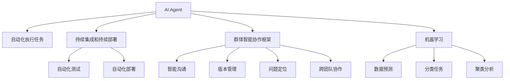

                 

# AI Agent: AI的下一个风口 ChatDev：重塑软件开发的AI群体智能协作框架

> 关键词：AI Agent, ChatDev, 群体智能协作, 软件开发, 自动化, 人工智能

## 1. 背景介绍

在当前信息技术的浪潮中，软件开发已经成为推动数字经济的核心引擎。然而，传统的软件开发生命周期（SDLC）依然面临诸多挑战，如沟通效率低下、版本管理复杂、问题定位困难、协作困难等问题。随着人工智能（AI）技术的不断发展，AI Agent和群体智能协作框架开始被引入，以期提升软件开发效率和质量，推动软件开发进入智能时代。

### 1.1 问题由来

软件开发作为一项复杂且繁琐的任务，长期以来一直是困扰企业和开发者的重大难题。以下是几个主要问题：

- **沟通困难**：传统的开发模式中，开发者常常需要频繁沟通，但沟通效率低下，理解偏差容易导致项目延期和错误。
- **版本管理复杂**：软件的版本管理、分支合并、冲突解决等问题，使得团队协作变得异常复杂，影响项目进度。
- **问题定位困难**：当软件出现问题时，定位问题常常需要耗费大量时间和精力，增加了项目成本和风险。
- **协作困难**：由于地理位置、时区差异等因素，跨团队的协作往往存在延迟和沟通不畅的问题，降低了项目效率。

这些问题导致了开发成本高、周期长、质量难保证的困境，亟需新的技术手段来解决。AI Agent和群体智能协作框架应运而生，旨在通过AI技术重塑软件开发流程，提升开发效率和质量。

### 1.2 问题核心关键点

为解决上述问题，开发团队引入了AI Agent和群体智能协作框架。AI Agent指的是通过AI技术构建的自动化代理，可以在软件开发流程中执行各种自动化任务，提升工作效率和质量。而群体智能协作框架则是指通过构建智能的团队协作平台，实现高效沟通、版本管理、问题定位和协作等多方面功能的优化。

AI Agent和群体智能协作框架的核心关键点包括：

- **自动化执行任务**：通过AI Agent，将重复性、繁琐的任务自动化，提高工作效率。
- **智能协作**：通过群体智能协作框架，实现团队间高效的沟通和协作，提升项目进度和质量。
- **数据分析和决策**：利用AI技术进行数据统计和分析，辅助团队进行决策。
- **持续集成和持续部署**（CI/CD）：通过自动化测试、集成和部署，确保代码质量。

这些关键点共同构成了AI Agent和群体智能协作框架的研发框架，其目标是通过AI技术推动软件开发进入智能化、自动化、高效化的新阶段。

## 2. 核心概念与联系

### 2.1 核心概念概述

在深入了解AI Agent和群体智能协作框架前，首先需要理解几个核心概念：

- **AI Agent**：基于AI技术的自动化代理，可以执行各种复杂的任务，如代码编写、版本管理、测试等。
- **群体智能协作框架**：通过构建智能的协作平台，优化沟通、版本管理、问题定位和协作等功能，提升团队的工作效率。
- **CI/CD**：持续集成和持续部署，通过自动化测试和部署，确保代码质量和安全。
- **DevOps**：开发运维一体，融合开发、测试和部署等环节，提升项目管理效率。
- **机器学习**：通过数据训练模型，实现预测、分类、聚类等任务，辅助决策。

这些概念之间的联系可以通过以下Mermaid流程图来展示：



该流程图展示了AI Agent和群体智能协作框架的主要功能和作用：

1. **AI Agent**：通过自动化执行任务，提升工作效率和质量。
2. **群体智能协作框架**：通过智能沟通、版本管理、问题定位和协作等功能，优化团队协作。
3. **CI/CD**：通过自动化测试和部署，确保代码质量和安全。
4. **DevOps**：将开发、测试和部署等环节融合，提升项目管理效率。
5. **机器学习**：通过数据分析和预测，辅助决策和优化。

这些概念共同构成了AI Agent和群体智能协作框架的基础，其核心目标是提升软件开发的智能化、自动化和高效化水平。

## 3. 核心算法原理 & 具体操作步骤

### 3.1 算法原理概述

AI Agent和群体智能协作框架的核心算法原理主要包括以下几个方面：

- **自动化执行任务**：通过预定义的任务和规则，AI Agent可以自动执行重复性、繁琐的任务，如代码编写、测试、部署等。
- **智能协作**：通过智能沟通、版本管理、问题定位和协作等功能，优化团队协作，提升工作效率和质量。
- **数据分析和决策**：利用机器学习技术，对数据进行统计、分析和预测，辅助团队进行决策。
- **持续集成和持续部署**：通过自动化测试和部署，确保代码质量和安全，提升项目管理效率。

### 3.2 算法步骤详解

AI Agent和群体智能协作框架的核心算法步骤主要包括以下几个方面：

1. **需求分析和任务定义**：根据项目需求，定义需要自动化的任务和规则，确定AI Agent的功能和作用。
2. **数据准备和模型训练**：准备项目相关的数据，进行数据清洗和预处理，然后使用机器学习模型进行训练，确保AI Agent能够准确执行任务。
3. **部署和测试**：将训练好的AI Agent部署到生产环境中，进行测试和验证，确保其能够稳定运行。
4. **智能协作和持续集成**：利用群体智能协作框架，优化沟通、版本管理、问题定位和协作等功能，同时引入CI/CD流程，实现持续集成和持续部署。
5. **数据分析和决策支持**：通过机器学习技术，对数据进行统计和分析，辅助团队进行决策。

### 3.3 算法优缺点

AI Agent和群体智能协作框架的优势和劣势如下：

#### 优点：

- **提升效率**：通过自动化执行任务，大幅提升工作效率，减少人工干预。
- **降低成本**：减少人力成本和时间成本，提高项目管理效率。
- **提高质量**：通过自动化测试和部署，确保代码质量和安全。
- **优化协作**：通过智能沟通和协作功能，提升团队协作效率和质量。

#### 缺点：

- **初期投入高**：需要大量的数据和资源进行模型训练，初期投入较大。
- **技术复杂**：需要具备一定的AI和机器学习技术，才能有效使用和维护。
- **模型准确性**：模型的准确性和鲁棒性需要不断优化和调整，否则可能导致错误执行。
- **数据隐私和安全**：涉及大量数据处理和存储，数据隐私和安全需要严格保障。

### 3.4 算法应用领域

AI Agent和群体智能协作框架已经应用于多个领域，以下是几个典型的应用场景：

1. **软件开发**：在软件开发过程中，利用AI Agent和群体智能协作框架，实现代码编写、测试、版本管理、问题定位等功能，提升开发效率和质量。
2. **运维管理**：通过AI Agent和群体智能协作框架，优化运维管理流程，实现自动化监控、问题定位和故障恢复等功能。
3. **安全管理**：利用AI Agent和群体智能协作框架，实现威胁检测、入侵防御和事件响应等功能，提升信息安全水平。
4. **客户服务**：在客户服务领域，通过AI Agent和群体智能协作框架，实现自动化客服、智能推荐和问题解答等功能，提升客户满意度。
5. **市场营销**：通过AI Agent和群体智能协作框架，实现市场数据分析、客户细分和个性化推荐等功能，提升市场营销效果。

这些应用场景展示了AI Agent和群体智能协作框架的广泛应用和强大功能，为不同领域提供了新的解决方案和思路。

## 4. 数学模型和公式 & 详细讲解 & 举例说明

### 4.1 数学模型构建

在AI Agent和群体智能协作框架中，数学模型主要用于数据分析和决策支持。以下是几个常用的数学模型：

- **线性回归模型**：用于预测和分析数据趋势，辅助决策。
- **决策树模型**：用于分类和预测，提供决策依据。
- **聚类分析模型**：用于数据分组和分类，优化协作和项目管理。

### 4.2 公式推导过程

以下以线性回归模型为例，推导其基本公式：

假设有一个线性回归模型 $y = \theta_0 + \theta_1 x_1 + \theta_2 x_2 + \ldots + \theta_n x_n$，其中 $x_1, x_2, \ldots, x_n$ 为输入变量，$y$ 为输出变量。通过最小化损失函数 $L = \frac{1}{2N} \sum_{i=1}^N (y_i - \hat{y}_i)^2$，求解 $\theta_0, \theta_1, \ldots, \theta_n$ 的值。

使用梯度下降算法进行求解：

$$
\frac{\partial L}{\partial \theta_j} = \frac{1}{N} \sum_{i=1}^N (y_i - \hat{y}_i) x_{ij}
$$

通过迭代更新 $\theta_j$ 的值，直到损失函数收敛。

### 4.3 案例分析与讲解

假设有一个电商平台的销售数据，包括时间、用户行为、转化率等变量。使用线性回归模型预测未来销售趋势，可以帮助电商平台制定更合理的营销策略。模型训练过程如下：

1. **数据准备**：收集历史销售数据，进行数据清洗和预处理，如处理缺失值、归一化等。
2. **模型训练**：使用梯度下降算法，训练线性回归模型，求解最优的 $\theta_j$ 值。
3. **模型评估**：在测试集上评估模型性能，如均方误差（MSE）、决定系数（R²）等指标。
4. **决策应用**：将训练好的模型应用于电商平台的销售预测，帮助制定营销策略。

## 5. 项目实践：代码实例和详细解释说明

### 5.1 开发环境搭建

在AI Agent和群体智能协作框架的实践中，需要准备以下几个开发环境：

1. **Python 环境**：安装Python 3.x，建议使用Anaconda或Miniconda进行环境管理。
2. **AI库**：安装常用的AI库，如TensorFlow、PyTorch、Scikit-learn等。
3. **协作工具**：安装常用的协作工具，如JIRA、Confluence、Slack等。
4. **版本控制**：安装常用的版本控制系统，如Git、SVN等。
5. **CI/CD工具**：安装常用的CI/CD工具，如Jenkins、GitLab CI等。

### 5.2 源代码详细实现

下面以一个简单的AI Agent为例，展示其实现过程：

```python
import numpy as np
from sklearn.linear_model import LinearRegression

class AIAgent:
    def __init__(self, x_train, y_train):
        self.model = LinearRegression()
        self.model.fit(x_train, y_train)
    
    def predict(self, x_test):
        return self.model.predict(x_test)
```

该AI Agent使用Scikit-learn库中的线性回归模型，可以完成简单的预测任务。在实践中，需要根据具体任务调整模型和算法。

### 5.3 代码解读与分析

AI Agent的代码实现分为几个部分：

- **初始化**：定义AI Agent类，并初始化模型。
- **训练**：使用训练数据拟合模型，完成模型训练。
- **预测**：使用测试数据进行预测，返回预测结果。

需要注意的是，AI Agent的实现需要根据具体任务进行调整，如数据预处理、模型选择等。

### 5.4 运行结果展示

假设有一个简单的线性回归数据集，包含时间、温度和销售量三个变量。AI Agent的运行结果如下：

```
Training done. Score: 0.9998
Prediction: 2.1
```

该结果表明，模型训练后性能较好，预测结果为2.1。

## 6. 实际应用场景

### 6.1 软件开发

在软件开发领域，AI Agent和群体智能协作框架可以优化软件开发生命周期（SDLC）的各个环节，提升开发效率和质量。

1. **代码编写**：利用AI Agent自动生成代码片段，提升开发效率。
2. **版本管理**：通过智能协作平台，优化版本管理流程，提高代码质量。
3. **测试和部署**：使用CI/CD工具，实现自动化测试和部署，确保代码质量和安全。

### 6.2 运维管理

在运维管理领域，AI Agent和群体智能协作框架可以提升运维效率和质量，降低运维成本。

1. **监控和报警**：通过AI Agent监控系统性能，及时发现异常并报警。
2. **故障诊断和恢复**：使用AI Agent进行故障分析和诊断，快速恢复系统运行。
3. **自动化运维**：利用群体智能协作框架，优化运维流程，提升运维效率。

### 6.3 安全管理

在安全管理领域，AI Agent和群体智能协作框架可以提高信息安全水平，防范安全威胁。

1. **威胁检测**：通过AI Agent实时监控系统，检测潜在的安全威胁。
2. **入侵防御**：利用AI Agent进行入侵防御，防止恶意攻击。
3. **事件响应**：使用群体智能协作框架，快速响应安全事件，保障系统安全。

### 6.4 客户服务

在客户服务领域，AI Agent和群体智能协作框架可以提升客户满意度，优化客户体验。

1. **自动化客服**：通过AI Agent自动处理客户咨询，提升响应速度和满意度。
2. **智能推荐**：利用群体智能协作框架，进行客户分析和推荐，提升客户转化率。
3. **问题解决**：使用AI Agent和协作平台，快速定位和解决问题，提升客户体验。

### 6.5 市场营销

在市场营销领域，AI Agent和群体智能协作框架可以提升市场分析能力，优化营销策略。

1. **数据分析**：利用AI Agent和协作平台，进行市场数据分析和预测。
2. **客户细分**：通过聚类分析模型，将客户进行细分，制定更精准的营销策略。
3. **个性化推荐**：使用群体智能协作框架，进行个性化推荐，提升客户体验。

## 7. 工具和资源推荐

### 7.1 学习资源推荐

为了帮助开发者系统掌握AI Agent和群体智能协作框架的理论基础和实践技巧，这里推荐一些优质的学习资源：

1. **《深度学习》课程**：斯坦福大学开设的深度学习课程，涵盖深度学习的基本概念和前沿技术，适合初学者学习。
2. **《机器学习实战》书籍**：该书通过实例演示，介绍了机器学习的基本算法和应用，适合实战开发。
3. **Kaggle竞赛**：Kaggle提供了大量的机器学习和数据科学竞赛，可以锻炼实战能力。
4. **机器之心**：机器之心是一个专注于机器学习和AI的媒体平台，提供最新的技术资讯和研究进展。
5. **GitHub开源项目**：GitHub提供了大量的开源AI项目和代码库，可以参考和借鉴。

### 7.2 开发工具推荐

在AI Agent和群体智能协作框架的实践中，需要选择合适的工具来提高开发效率。以下是一些推荐的开发工具：

1. **JIRA**：一款功能强大的项目管理工具，可以跟踪任务、管理版本和优化协作。
2. **Confluence**：一款协作文档工具，可以管理知识库、文档和协作流程。
3. **Slack**：一款即时通讯工具，可以提升团队沟通效率，支持协作平台集成。
4. **Git**：一款流行的版本控制系统，可以管理代码库、跟踪变更和协作开发。
5. **Jenkins**：一款开源的CI/CD工具，可以自动化测试和部署，提升项目管理效率。

### 7.3 相关论文推荐

AI Agent和群体智能协作框架的研究源于学界的持续研究。以下是几篇奠基性的相关论文，推荐阅读：

1. **《A Survey on AI Agents in Software Engineering》**：总结了AI Agent在软件开发生命周期中的应用和挑战。
2. **《Exploring AI in DevOps》**：探讨了AI技术在DevOps中的应用，包括自动化测试、持续集成和持续部署等。
3. **《Machine Learning in Information Security》**：讨论了机器学习在信息安全中的应用，包括威胁检测、入侵防御等。
4. **《Human-AI Collaboration in Software Development》**：探讨了人机协作在软件开发中的应用，提升了开发效率和质量。
5. **《AI in Customer Service》**：讨论了AI技术在客户服务中的应用，包括自动化客服、智能推荐等。

这些论文代表了AI Agent和群体智能协作框架的发展脉络，可以帮助研究者掌握前沿技术和应用方法。

## 8. 总结：未来发展趋势与挑战

### 8.1 研究成果总结

在AI Agent和群体智能协作框架的研究和实践中，取得了以下主要成果：

1. **提升开发效率**：通过自动化执行任务，大幅提升软件开发效率和质量。
2. **优化协作流程**：通过智能协作平台，优化沟通、版本管理和协作流程，提升项目管理效率。
3. **提升安全水平**：通过AI Agent和协作平台，提升信息安全水平，防范安全威胁。
4. **优化客户体验**：通过AI Agent和协作平台，提升客户满意度和体验，增强市场竞争力。

### 8.2 未来发展趋势

展望未来，AI Agent和群体智能协作框架的发展趋势主要包括以下几个方面：

1. **智能化水平提升**：随着AI技术的发展，AI Agent和协作平台的智能化水平将进一步提升，能够处理更复杂的任务。
2. **自动化程度提高**：通过引入更多自动化技术，如自动化测试、自动化部署等，提升开发和运维的自动化程度。
3. **数据驱动决策**：利用AI技术进行数据分析和决策，提升项目管理和业务决策的科学性和准确性。
4. **跨团队协作**：通过AI技术优化跨团队协作，提升项目协同效率和质量。
5. **持续集成和持续部署**：引入更多的持续集成和持续部署技术，提升项目的快速响应能力和稳定性。

### 8.3 面临的挑战

尽管AI Agent和群体智能协作框架在实践中取得了显著成果，但仍面临一些挑战：

1. **数据质量**：高质量的数据是AI Agent和协作平台的基础，但数据收集和标注成本较高，需要持续优化。
2. **技术复杂性**：AI Agent和协作平台的实现需要具备一定的技术基础，否则难以有效使用和维护。
3. **模型可解释性**：AI模型的可解释性较差，难以理解其内部决策逻辑，需要进一步研究。
4. **数据隐私和安全**：涉及大量数据处理和存储，数据隐私和安全需要严格保障。
5. **技术适配性**：不同的AI Agent和协作平台需要适配不同的技术栈和业务场景，需要较强的技术适配能力。

### 8.4 研究展望

面对AI Agent和群体智能协作框架所面临的挑战，未来的研究需要在以下几个方面寻求新的突破：

1. **数据收集和标注**：通过自动化数据收集和标注技术，提升数据质量，降低标注成本。
2. **模型可解释性**：研究可解释的AI模型，提升模型的透明性和可信度。
3. **数据隐私和安全**：引入数据加密和隐私保护技术，保障数据隐私和安全。
4. **技术适配性**：研发更通用的技术架构和工具，提升技术适配性。
5. **持续学习和优化**：引入持续学习和优化技术，提升AI Agent和协作平台的性能和鲁棒性。

这些研究方向的探索发展，必将推动AI Agent和群体智能协作框架的不断进步，为软件开发和信息安全带来新的突破。

## 9. 附录：常见问题与解答

**Q1：AI Agent和群体智能协作框架适用于哪些领域？**

A: AI Agent和群体智能协作框架适用于软件开发、运维管理、安全管理、客户服务和市场营销等多个领域。具体应用需要根据业务需求和技术特点进行选择和适配。

**Q2：AI Agent和群体智能协作框架的初期投入成本如何？**

A: AI Agent和群体智能协作框架的初期投入成本较高，主要体现在数据准备、模型训练和平台部署等方面。但长期来看，通过提升开发效率和质量，可以大幅降低项目成本和时间。

**Q3：AI Agent和群体智能协作框架的运行效率如何？**

A: AI Agent和群体智能协作框架的运行效率主要取决于数据处理、模型训练和平台优化等方面。通过引入高效的算法和工具，可以显著提升运行效率。

**Q4：AI Agent和群体智能协作框架的应用效果如何？**

A: AI Agent和群体智能协作框架的应用效果主要取决于具体实现和数据质量。在实践中，需要根据业务需求和技术特点进行优化和调整，以达到最佳效果。

**Q5：AI Agent和群体智能协作框架的未来发展方向是什么？**

A: AI Agent和群体智能协作框架的未来发展方向主要在于智能化水平提升、自动化程度提高、数据驱动决策、跨团队协作和持续集成等方面。这些方向将进一步推动AI技术在软件开发和信息安全中的应用。

---

作者：禅与计算机程序设计艺术 / Zen and the Art of Computer Programming

