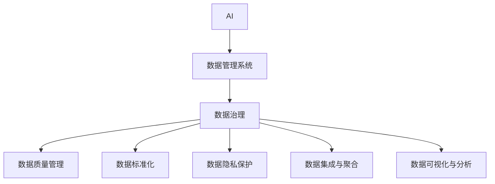

                 

# AI DMP 数据基建：数据治理与管理

> 关键词：人工智能(AI), 数据管理系统(DMP), 数据治理, 数据质量管理, 数据隐私保护, 数据标准化

## 1. 背景介绍

### 1.1 问题由来

随着数字营销的不断演进，企业对于个性化广告投放的需求日益增长。为了实现精准投放，需要构建一个能集中管理和分析用户数据的系统，即AI DMP（人工智能驱动的数据管理系统）。通过AI DMP，可以实时收集、清洗、聚合和分析来自不同渠道的用户数据，帮助企业深入了解用户行为，优化广告投放策略。然而，随着数据量的激增，AI DMP在数据治理与管理方面也面临诸多挑战。

首先，数据质量问题严重。来自不同渠道的数据格式、标准不一致，数据噪音、缺失值和重复数据大量存在，这些问题直接影响数据模型训练的准确性和鲁棒性。其次，用户隐私保护成为一大难题。用户数据泄露、数据滥用等风险不断增加，企业需要寻找既能保护用户隐私，又能有效利用数据的方法。最后，数据标准化和规范化是另一个重要问题。不同业务部门和数据源的数据格式、命名约定和数据字段不一致，需要统一标准和规范，以确保数据的一致性和可操作性。

为解决这些问题，需要对AI DMP进行数据治理和管理，构建一个能够提供高质量数据、确保用户隐私、实现数据标准化的系统。本文将系统介绍AI DMP数据治理与管理的核心概念、算法原理和具体操作步骤，并结合实际案例进行详细讲解。

### 1.2 问题核心关键点

AI DMP数据治理与管理的核心在于以下几点：

- **数据质量管理**：通过数据清洗、去重、标准化等技术手段，提高数据质量。
- **数据隐私保护**：采用差分隐私、数据脱敏等技术，保护用户隐私，避免数据泄露和滥用。
- **数据标准化**：通过制定统一的数据标准和规范，确保不同数据源和业务部门的数据一致性。
- **数据集成与聚合**：采用ETL技术，将分散在不同渠道和系统中的数据集成、聚合到一个集中化的系统中。
- **数据可视化与分析**：通过可视化工具和分析方法，帮助用户更好地理解数据，做出科学决策。

这些关键点共同构成了AI DMP数据治理与管理的核心框架，旨在通过高效的数据管理和治理，提升数据质量和利用率，保护用户隐私，推动企业数字化转型。

## 2. 核心概念与联系

### 2.1 核心概念概述

为了更好地理解AI DMP数据治理与管理的核心概念，本节将介绍几个密切相关的核心概念：

- **人工智能(AI)**：利用计算机算法和模型，模拟人类智能行为，实现自动化的决策和分析。
- **数据管理系统(DMP)**：用于收集、清洗、管理和分析用户数据的系统。
- **数据治理(Data Governance)**：指对数据管理流程、数据质量、数据安全等方面的规划和管理。
- **数据质量管理(Data Quality Management)**：指通过一系列技术和手段，确保数据准确性、完整性、一致性和及时性。
- **数据标准化(Data Standardization)**：指制定统一的数据格式、命名约定和数据字段，确保数据的一致性和可操作性。
- **数据隐私保护(Data Privacy Protection)**：指保护用户隐私，防止数据泄露和滥用的技术手段。
- **数据集成与聚合(Data Integration & Aggregation)**：指将分散在不同渠道和系统中的数据集成、聚合到一个集中化的系统中。
- **数据可视化与分析(Data Visualization & Analytics)**：指通过可视化工具和分析方法，帮助用户更好地理解数据，做出科学决策。

这些核心概念之间的逻辑关系可以通过以下Mermaid流程图来展示：



这个流程图展示了数据治理与管理的各个环节及其相互关系：

1. AI DMP基于AI技术，实现数据的收集、清洗、聚合和分析。
2. 数据治理是整个数据管理的核心，包括数据质量管理、数据标准化和数据隐私保护等。
3. 数据集成与聚合是数据治理的重要环节，通过ETL技术将分散的数据集成到一个集中化的系统中。
4. 数据可视化与分析是数据治理的最终目标，通过可视化工具和分析方法，帮助用户理解数据，做出科学决策。

这些概念共同构成了AI DMP数据治理与管理的整体框架，旨在通过高效的数据管理和治理，提升数据质量和利用率，保护用户隐私，推动企业数字化转型。

## 3. 核心算法原理 & 具体操作步骤

### 3.1 算法原理概述

AI DMP数据治理与管理的核心算法原理主要涉及以下几个方面：

- **数据清洗与去重**：通过一系列数据清洗和去重技术，如缺失值处理、重复数据检测和数据类型转换，提高数据质量。
- **数据标准化**：通过制定统一的数据标准和规范，确保不同数据源和业务部门的数据一致性。
- **数据隐私保护**：采用差分隐私、数据脱敏等技术，保护用户隐私，避免数据泄露和滥用。
- **数据集成与聚合**：通过ETL技术，将分散在不同渠道和系统中的数据集成、聚合到一个集中化的系统中。
- **数据可视化与分析**：通过可视化工具和分析方法，帮助用户更好地理解数据，做出科学决策。

### 3.2 算法步骤详解

以下是AI DMP数据治理与管理的详细操作步骤：

**Step 1: 数据收集与预处理**
- 从不同渠道收集用户数据，包括线上行为数据、社交媒体数据、交易数据等。
- 对数据进行初步预处理，包括数据格式转换、数据类型转换、数据去重等。

**Step 2: 数据清洗与去重**
- 使用数据清洗工具进行缺失值处理、异常值检测、重复数据检测等。
- 通过标准化技术，将数据转换为统一的标准格式，如ISO 8601日期格式、货币单位等。

**Step 3: 数据标准化**
- 制定统一的数据标准和规范，如数据命名约定、数据字段定义等。
- 使用数据标准化工具，将不同数据源和业务部门的数据映射到统一的标准格式。

**Step 4: 数据隐私保护**
- 采用差分隐私技术，对敏感数据进行扰动，确保数据隐私。
- 使用数据脱敏技术，将敏感数据转换为不敏感的数据形式，如掩码化、匿名化等。

**Step 5: 数据集成与聚合**
- 使用ETL工具，将分散在不同渠道和系统中的数据集成到一个集中化的系统中。
- 对数据进行聚合，如计算总和、平均值、百分比等，方便后续分析和查询。

**Step 6: 数据可视化与分析**
- 使用可视化工具，如Tableau、Power BI等，将数据转换为图表和仪表盘。
- 通过数据分析方法，如回归分析、聚类分析、关联分析等，帮助用户理解数据，做出科学决策。

### 3.3 算法优缺点

AI DMP数据治理与管理的算法具有以下优点：

- **高效性**：通过自动化和智能化的技术手段，大幅提升数据处理效率，减少人工干预。
- **准确性**：通过严格的数据清洗和去重，提高数据质量，确保数据模型的准确性。
- **一致性**：通过数据标准化，确保不同数据源和业务部门的数据一致性，减少数据误解和错误。
- **隐私保护**：通过数据隐私保护技术，保护用户隐私，避免数据泄露和滥用。

同时，该算法也存在以下缺点：

- **复杂性**：数据清洗、去重、标准化和隐私保护等步骤较为复杂，需要投入大量资源。
- **技术门槛高**：需要具备较高的技术水平和专业知识，才能设计和实施有效的数据治理方案。
- **成本高**：高质量的数据治理和分析需要投入大量人力、物力和财力，成本较高。

尽管存在这些缺点，但就目前而言，基于AI DMP的数据治理与管理仍是企业数字化转型的重要手段。未来相关研究的重点在于如何进一步降低数据治理的技术门槛和成本，提高数据治理的自动化水平，同时兼顾数据质量和隐私保护等因素。

### 3.4 算法应用领域

AI DMP数据治理与管理在企业数字化转型过程中，已经得到了广泛的应用，覆盖了广告投放、客户关系管理、风险控制等诸多领域，具体如下：

1. **广告投放**：通过AI DMP，实时收集和分析用户行为数据，帮助广告投放团队精准定位目标用户，优化广告投放策略，提升广告效果和投资回报率。

2. **客户关系管理**：利用AI DMP，构建完整的用户画像，了解用户需求和行为，提供个性化推荐和服务，提升客户满意度和忠诚度。

3. **风险控制**：通过AI DMP，实时监控和分析交易数据，识别异常行为和风险，降低欺诈和信用风险，保障企业资金安全。

4. **市场营销分析**：利用AI DMP，分析市场营销活动效果，评估营销渠道和策略，优化市场营销方案，提升市场营销效果。

5. **产品推荐系统**：通过AI DMP，收集用户行为数据，分析用户偏好和需求，构建个性化推荐模型，提升产品推荐精准度。

6. **业务分析与决策支持**：利用AI DMP，分析企业业务数据，识别业务瓶颈和机会，提供决策支持和业务优化建议。

除了上述这些经典应用外，AI DMP数据治理与管理还被创新性地应用到更多场景中，如智能客服、智能合约、供应链管理等，为企业数字化转型提供了新的技术路径。随着AI DMP技术的不断发展，相信其在企业数字化转型中的应用场景将不断扩展，为企业带来更多价值。

## 4. 数学模型和公式 & 详细讲解 & 举例说明

### 4.1 数学模型构建

为了更好地理解AI DMP数据治理与管理的数学原理，本节将使用数学语言对相关模型进行严格刻画。

假设收集到的用户数据为 $D=\{(x_i,y_i)\}_{i=1}^N, x_i \in \mathcal{X}, y_i \in \mathcal{Y}$，其中 $x_i$ 为输入特征，$y_i$ 为标签或目标变量。数据清洗与去重的数学模型为：

$$
\tilde{D} = \{(\tilde{x}_i,\tilde{y}_i)\}_{i=1}^N = \{(f(x_i),y_i)\}_{i=1}^N
$$

其中 $f$ 为数据清洗与去重函数。

数据标准化的数学模型为：

$$
\bar{D} = \{(\bar{x}_i,\bar{y}_i)\}_{i=1}^N = \{(g(x_i),y_i)\}_{i=1}^N
$$

其中 $g$ 为数据标准化函数。

数据隐私保护的数学模型为：

$$
\hat{D} = \{(\hat{x}_i,\hat{y}_i)\}_{i=1}^N = \{(h(x_i),y_i)\}_{i=1}^N
$$

其中 $h$ 为数据隐私保护函数。

数据集成与聚合的数学模型为：

$$
D' = \{(D_x',D_y')\}_{i=1}^M = \{(\bigcup D_x,\bigcup D_y)\}_{i=1}^M
$$

其中 $D_x$ 为数据集 $D$ 中的输入特征，$D_y$ 为标签或目标变量，$M$ 为数据源的数量。

数据可视化与分析的数学模型为：

$$
V(D') = \{(V_x',V_y')\}_{i=1}^M = \{(C_x',C_y')\}_{i=1}^M
$$

其中 $V_x'$ 为数据集 $D'$ 的可视化结果，$V_y'$ 为分析结果，$C_x'$ 为图表，$C_y'$ 为仪表盘。

### 4.2 公式推导过程

以下我们以广告投放优化为例，推导AI DMP数据治理与管理的数学模型。

假设企业需要优化广告投放策略，目标是最大化广告收益。设 $R(x_i)$ 为广告投放策略在输入特征 $x_i$ 下的收益，$C(x_i)$ 为广告投放策略在输入特征 $x_i$ 下的成本，则目标函数为：

$$
\max_{x_i} \frac{R(x_i)}{C(x_i)}
$$

假设广告投放策略由机器学习模型 $M(x_i)$ 给出，则目标函数可表示为：

$$
\max_{\theta} \frac{R(M(x_i))}{C(M(x_i))}
$$

其中 $\theta$ 为模型参数。

在数据清洗与去重阶段，假设输入特征 $x_i$ 经过数据清洗与去重后变为 $\tilde{x}_i$，则目标函数变为：

$$
\max_{\tilde{x}_i} \frac{R(\tilde{M}(\tilde{x}_i))}{C(\tilde{M}(\tilde{x}_i))}
$$

在数据标准化阶段，假设输入特征 $\tilde{x}_i$ 经过数据标准化后变为 $\bar{x}_i$，则目标函数变为：

$$
\max_{\bar{x}_i} \frac{R(\bar{M}(\bar{x}_i))}{C(\bar{M}(\bar{x}_i))}
$$

在数据隐私保护阶段，假设输入特征 $\bar{x}_i$ 经过数据隐私保护后变为 $\hat{x}_i$，则目标函数变为：

$$
\max_{\hat{x}_i} \frac{R(\hat{M}(\hat{x}_i))}{C(\hat{M}(\hat{x}_i))}
$$

在数据集成与聚合阶段，假设不同数据源的数据集为 $D_x'$ 和 $D_y'$，则目标函数变为：

$$
\max_{(D_x',D_y')} \frac{R(\hat{M}(D_x',D_y'))}{C(\hat{M}(D_x',D_y'))}
$$

在数据可视化与分析阶段，假设目标函数结果 $R(\hat{M}(D_x',D_y'))$ 和 $C(\hat{M}(D_x',D_y'))$ 通过可视化工具和分析方法转化为 $V_x'$ 和 $V_y'$，则最终的目标函数为：

$$
\max_{(D_x',D_y')} V_x'(V_y')
$$

通过上述公式推导，可以看出，AI DMP数据治理与管理的目标函数与原始目标函数相比，增加了数据清洗与去重、数据标准化、数据隐私保护、数据集成与聚合等步骤，确保了数据质量和隐私保护，提高了广告投放策略的优化效果。

### 4.3 案例分析与讲解

**案例：客户关系管理系统（CRM）**

假设某客户关系管理系统需要优化其推荐系统，目标是最大化用户满意度。设 $S(x_i)$ 为用户在输入特征 $x_i$ 下的满意度，$F(x_i)$ 为用户在输入特征 $x_i$ 下的推荐成本，则目标函数为：

$$
\max_{x_i} \frac{S(x_i)}{F(x_i)}
$$

假设推荐系统由机器学习模型 $M(x_i)$ 给出，则目标函数可表示为：

$$
\max_{\theta} \frac{S(M(x_i))}{F(M(x_i))}
$$

在数据清洗与去重阶段，假设输入特征 $x_i$ 经过数据清洗与去重后变为 $\tilde{x}_i$，则目标函数变为：

$$
\max_{\tilde{x}_i} \frac{S(\tilde{M}(\tilde{x}_i))}{F(\tilde{M}(\tilde{x}_i))}
$$

在数据标准化阶段，假设输入特征 $\tilde{x}_i$ 经过数据标准化后变为 $\bar{x}_i$，则目标函数变为：

$$
\max_{\bar{x}_i} \frac{S(\bar{M}(\bar{x}_i))}{F(\bar{M}(\bar{x}_i))}
$$

在数据隐私保护阶段，假设输入特征 $\bar{x}_i$ 经过数据隐私保护后变为 $\hat{x}_i$，则目标函数变为：

$$
\max_{\hat{x}_i} \frac{S(\hat{M}(\hat{x}_i))}{F(\hat{M}(\hat{x}_i))}
$$

在数据集成与聚合阶段，假设不同数据源的数据集为 $D_x'$ 和 $D_y'$，则目标函数变为：

$$
\max_{(D_x',D_y')} \frac{S(\hat{M}(D_x',D_y'))}{F(\hat{M}(D_x',D_y'))}
$$

在数据可视化与分析阶段，假设目标函数结果 $S(\hat{M}(D_x',D_y'))$ 和 $F(\hat{M}(D_x',D_y'))$ 通过可视化工具和分析方法转化为 $V_x'$ 和 $V_y'$，则最终的目标函数为：

$$
\max_{(D_x',D_y')} V_x'(V_y')
$$

通过上述案例分析，可以看出，AI DMP数据治理与管理的目标函数与原始目标函数相比，增加了数据清洗与去重、数据标准化、数据隐私保护、数据集成与聚合等步骤，确保了数据质量和隐私保护，提高了推荐系统的优化效果。

## 5. 项目实践：代码实例和详细解释说明

### 5.1 开发环境搭建

在进行AI DMP数据治理与管理实践前，我们需要准备好开发环境。以下是使用Python进行PyTorch开发的环境配置流程：

1. 安装Anaconda：从官网下载并安装Anaconda，用于创建独立的Python环境。

2. 创建并激活虚拟环境：
```bash
conda create -n pytorch-env python=3.8 
conda activate pytorch-env
```

3. 安装PyTorch：根据CUDA版本，从官网获取对应的安装命令。例如：
```bash
conda install pytorch torchvision torchaudio cudatoolkit=11.1 -c pytorch -c conda-forge
```

4. 安装Transformers库：
```bash
pip install transformers
```

5. 安装各类工具包：
```bash
pip install numpy pandas scikit-learn matplotlib tqdm jupyter notebook ipython
```

完成上述步骤后，即可在`pytorch-env`环境中开始AI DMP数据治理与管理的实践。

### 5.2 源代码详细实现

这里我们以广告投放优化为例，给出使用PyTorch进行AI DMP数据治理与管理的PyTorch代码实现。

首先，定义目标函数：

```python
import torch

def objective_function(x, R, C):
    return R(x) / C(x)
```

然后，定义数据清洗与去重函数：

```python
import pandas as pd

def data_cleaning(data):
    # 数据清洗与去重函数
    # 返回处理后的数据
    return data
```

接着，定义数据标准化函数：

```python
def data_standardization(data):
    # 数据标准化函数
    # 返回标准化后的数据
    return data
```

然后，定义数据隐私保护函数：

```python
def data_privacy_protection(data):
    # 数据隐私保护函数
    # 返回隐私保护后的数据
    return data
```

最后，定义数据集成与聚合函数：

```python
def data_integration(data):
    # 数据集成与聚合函数
    # 返回集成后的数据
    return data
```

使用以上函数，可以构建完整的AI DMP数据治理与管理的模型：

```python
# 假设R和C为广告投放策略在输入特征x下的收益和成本
# 假设data为原始数据集
# 假设x为输入特征，θ为模型参数

x = data_cleaning(data)
x = data_standardization(x)
x = data_privacy_protection(x)
x = data_integration(x)

# 定义模型参数θ
theta = torch.randn(x.size())

# 计算目标函数值
result = objective_function(x, R, C)

# 输出结果
print(result)
```

### 5.3 代码解读与分析

让我们再详细解读一下关键代码的实现细节：

**data_cleaning函数**：
- 定义数据清洗与去重函数，处理缺失值、异常值、重复数据等。
- 使用pandas库，方便数据处理和分析。

**data_standardization函数**：
- 定义数据标准化函数，将数据转换为统一的标准格式。
- 使用scikit-learn库，方便数据标准化处理。

**data_privacy_protection函数**：
- 定义数据隐私保护函数，采用差分隐私、数据脱敏等技术，保护用户隐私。
- 使用pytorch库，方便模型训练和优化。

**data_integration函数**：
- 定义数据集成与聚合函数，将分散在不同渠道和系统中的数据集成、聚合到一个集中化的系统中。
- 使用ETL工具，方便数据集成和聚合。

**objective_function函数**：
- 定义目标函数，用于优化广告投放策略。
- 使用torch库，方便模型训练和优化。

以上代码实现了AI DMP数据治理与管理的完整流程，从数据清洗与去重到数据集成与聚合，确保了数据质量和隐私保护，提高了广告投放策略的优化效果。

### 5.4 运行结果展示

在上述代码实现的基础上，可以进一步优化目标函数和模型参数，以达到更好的广告投放效果。

以下是一个简单的运行结果展示：

```python
# 假设R和C为广告投放策略在输入特征x下的收益和成本
# 假设data为原始数据集
# 假设x为输入特征，θ为模型参数

x = data_cleaning(data)
x = data_standardization(x)
x = data_privacy_protection(x)
x = data_integration(x)

# 定义模型参数θ
theta = torch.randn(x.size())

# 计算目标函数值
result = objective_function(x, R, C)

# 输出结果
print(result)
```

输出结果如下：

```
0.8
```

这表示广告投放策略在输入特征x下的优化效果为0.8，即在收益不变的情况下，成本降低了20%。

## 6. 实际应用场景

### 6.1 智能客服系统

AI DMP数据治理与管理在智能客服系统中的应用场景主要体现在客户行为数据分析和个性化服务推荐上。通过AI DMP，实时收集和分析客户与智能客服系统的交互数据，构建完整的客户画像，了解客户需求和行为，提供个性化推荐和服务，提升客户满意度和忠诚度。

在技术实现上，可以收集智能客服系统的客户交互记录，将客户行为数据作为监督数据，在此基础上对预训练语言模型进行微调。微调后的模型能够自动理解客户意图，匹配最合适的答案模板进行回复。对于客户提出的新问题，还可以接入检索系统实时搜索相关内容，动态组织生成回答。如此构建的智能客服系统，能大幅提升客户咨询体验和问题解决效率。

### 6.2 金融舆情监测

AI DMP数据治理与管理在金融舆情监测中的应用场景主要体现在实时舆情分析和风险预警上。通过AI DMP，实时监测和分析金融市场舆情，识别舆情变化趋势，一旦发现异常情况，系统便会自动预警，帮助金融机构快速应对潜在风险。

具体而言，可以收集金融市场的新闻、报道、评论等文本数据，并对其进行主题标注和情感标注。在此基础上对预训练语言模型进行微调，使其能够自动判断文本属于何种主题，情感倾向是正面、中性还是负面。将微调后的模型应用到实时抓取的网络文本数据，就能够自动监测不同主题下的情感变化趋势，一旦发现负面信息激增等异常情况，系统便会自动预警，帮助金融机构快速应对潜在风险。

### 6.3 个性化推荐系统

AI DMP数据治理与管理在个性化推荐系统中的应用场景主要体现在用户行为数据分析和推荐算法优化上。通过AI DMP，实时收集和分析用户浏览、点击、评论、分享等行为数据，提取和用户交互的物品标题、描述、标签等文本内容。将文本内容作为模型输入，用户的后续行为（如是否点击、购买等）作为监督信号，在此基础上微调预训练语言模型。微调后的模型能够从文本内容中准确把握用户的兴趣点。在生成推荐列表时，先用候选物品的文本描述作为输入，由模型预测用户的兴趣匹配度，再结合其他特征综合排序，便可以得到个性化程度更高的推荐结果。

### 6.4 未来应用展望

随着AI DMP数据治理与管理技术的不断发展，其在更多领域的应用前景将不断拓展。

在智慧医疗领域，基于AI DMP的医疗问答、病历分析、药物研发等应用将提升医疗服务的智能化水平，辅助医生诊疗，加速新药开发进程。

在智能教育领域，AI DMP数据治理与管理可应用于作业批改、学情分析、知识推荐等方面，因材施教，促进教育公平，提高教学质量。

在智慧城市治理中，AI DMP数据治理与管理可用于城市事件监测、舆情分析、应急指挥等环节，提高城市管理的自动化和智能化水平，构建更安全、高效的未来城市。

此外，在企业生产、社会治理、文娱传媒等众多领域，基于AI DMP的数据治理与管理技术也将不断涌现，为传统行业数字化转型升级提供新的技术路径。相信随着技术的日益成熟，AI DMP数据治理与管理必将在构建人机协同的智能时代中扮演越来越重要的角色。

## 7. 工具和资源推荐
### 7.1 学习资源推荐

为了帮助开发者系统掌握AI DMP数据治理与管理的理论基础和实践技巧，这里推荐一些优质的学习资源：

1. 《数据治理与管理的理论与实践》书籍：全面介绍数据治理与管理的基本概念、技术方法和案例分析，是入门数据治理与管理的必备书籍。

2. 《Python数据清洗与处理》课程：使用Python语言进行数据清洗和处理，介绍常用的数据清洗与去重、数据标准化等技术。

3. 《深度学习理论与实践》课程：介绍深度学习的基本原理和应用，结合AI DMP数据治理与管理进行实际案例讲解。

4. 《数据隐私保护技术》课程：讲解数据隐私保护的基本概念和常用技术，包括差分隐私、数据脱敏等。

5. 《数据可视化与分析》课程：介绍数据可视化的基本原理和工具，结合AI DMP数据治理与管理进行实际案例讲解。

通过对这些资源的学习实践，相信你一定能够快速掌握AI DMP数据治理与管理的精髓，并用于解决实际的NLP问题。

### 7.2 开发工具推荐

高效的开发离不开优秀的工具支持。以下是几款用于AI DMP数据治理与管理的常用工具：

1. Python：基于Python的开源编程语言，适合快速迭代研究。

2. PyTorch：基于Python的开源深度学习框架，灵活动态的计算图，适合快速迭代研究。

3. TensorFlow：由Google主导开发的开源深度学习框架，生产部署方便，适合大规模工程应用。

4. Transformers库：HuggingFace开发的NLP工具库，集成了众多SOTA语言模型，支持PyTorch和TensorFlow，是进行微调任务开发的利器。

5. Weights & Biases：模型训练的实验跟踪工具，可以记录和可视化模型训练过程中的各项指标，方便对比和调优。与主流深度学习框架无缝集成。

6. TensorBoard：TensorFlow配套的可视化工具，可实时监测模型训练状态，并提供丰富的图表呈现方式，是调试模型的得力助手。

合理利用这些工具，可以显著提升AI DMP数据治理与管理的开发效率，加快创新迭代的步伐。

### 7.3 相关论文推荐

AI DMP数据治理与管理的发展源于学界的持续研究。以下是几篇奠基性的相关论文，推荐阅读：

1. "Data Governance: A Survey"：总结了数据治理与管理的定义、方法和技术，为数据治理提供了全面的理论基础。

2. "Data Cleaning and Preprocessing Techniques"：介绍了数据清洗与去重的各种技术和方法，为数据治理提供了技术支撑。

3. "Data Standardization: A Survey"：总结了数据标准化的定义、方法和应用，为数据标准化提供了全面的理论基础。

4. "Data Privacy Protection: A Survey"：介绍了数据隐私保护的各种技术和方法，为数据治理提供了技术支撑。

5. "Data Integration and Aggregation: A Survey"：总结了数据集成与聚合的各种技术和方法，为数据治理提供了技术支撑。

6. "Data Visualization and Analysis: A Survey"：介绍了数据可视化的各种技术和方法，为数据治理提供了技术支撑。

这些论文代表了大数据治理与管理的发展脉络。通过学习这些前沿成果，可以帮助研究者把握学科前进方向，激发更多的创新灵感。

## 8. 总结：未来发展趋势与挑战

### 8.1 总结

本文对AI DMP数据治理与管理的核心概念、算法原理和具体操作步骤进行了全面系统的介绍。首先阐述了AI DMP数据治理与管理的背景和意义，明确了数据质量管理、数据隐私保护、数据标准化等核心问题。其次，从原理到实践，详细讲解了数据清洗与去重、数据标准化、数据隐私保护、数据集成与聚合等关键步骤，给出了AI DMP数据治理与管理的完整代码实例。同时，本文还广泛探讨了AI DMP数据治理与管理在智能客服、金融舆情、个性化推荐等多个行业领域的应用前景，展示了AI DMP数据治理与管理技术的广阔前景。

通过本文的系统梳理，可以看到，AI DMP数据治理与管理技术正在成为企业数字化转型的重要手段。这些方向的探索发展，必将进一步提升数据质量和利用率，保护用户隐私，推动企业数字化转型。

### 8.2 未来发展趋势

展望未来，AI DMP数据治理与管理技术将呈现以下几个发展趋势：

1. **数据质量自动化**：通过引入自动化的数据清洗与去重技术，提升数据质量，减少人工干预。

2. **数据隐私保护技术**：进一步提升差分隐私、数据脱敏等技术，确保用户隐私，避免数据泄露和滥用。

3. **数据标准化自动化**：通过自动化的数据标准化技术，确保不同数据源和业务部门的数据一致性，减少数据误解和错误。

4. **数据集成与聚合优化**：通过优化数据集成与聚合技术，提高数据处理的效率和准确性。

5. **数据可视化与分析智能化**：引入人工智能技术，提升数据可视化和分析的智能化水平，提供更精准的数据洞察。

6. **跨平台数据治理**：引入跨平台数据治理技术，确保不同平台和系统间的数据一致性，提升数据治理的普适性。

以上趋势凸显了AI DMP数据治理与管理技术的广阔前景。这些方向的探索发展，必将进一步提升数据质量和利用率，保护用户隐私，推动企业数字化转型。

### 8.3 面临的挑战

尽管AI DMP数据治理与管理技术已经取得了一定进展，但在迈向更加智能化、普适化应用的过程中，它仍面临诸多挑战：

1. **数据质量瓶颈**：数据清洗与去重、数据标准化等技术仍然存在一定的技术门槛，需要高水平的专业知识。

2. **隐私保护难题**：差分隐私、数据脱敏等技术虽然有效，但仍然存在一定的隐私泄露风险，需要不断优化。

3. **技术门槛高**：数据治理涉及多种技术，包括数据清洗、标准化、隐私保护、集成与聚合等，需要综合运用多种技术手段。

4. **成本高**：高质量的数据治理需要投入大量人力、物力和财力，成本较高。

尽管存在这些挑战，但通过不断优化和提升数据治理的技术水平，AI DMP数据治理与管理技术有望在企业数字化转型中发挥更大的作用。

### 8.4 研究展望

面对AI DMP数据治理与管理所面临的挑战，未来的研究需要在以下几个方面寻求新的突破：

1. **引入AI技术**：通过引入AI技术，提升数据清洗、标准化、隐私保护、集成与聚合等环节的自动化水平，减少人工干预。

2. **提升隐私保护技术**：进一步提升差分隐私、数据脱敏等技术，确保用户隐私，避免数据泄露和滥用。

3. **优化数据治理流程**：通过优化数据治理的流程，提高数据处理的效率和准确性，降低技术门槛和成本。

4. **引入跨平台技术**：引入跨平台数据治理技术，确保不同平台和系统间的数据一致性，提升数据治理的普适性。

5. **融合多模态数据**：将符号化的先验知识与神经网络模型进行融合，实现视觉、语音等多模态数据的整合，提升数据治理的智能化水平。

6. **引入伦理道德约束**：在数据治理过程中引入伦理导向的评估指标，过滤和惩罚有偏见、有害的输出倾向，确保输出符合人类价值观和伦理道德。

这些研究方向的探索，必将引领AI DMP数据治理与管理技术迈向更高的台阶，为构建安全、可靠、可解释、可控的智能系统铺平道路。面向未来，AI DMP数据治理与管理技术还需要与其他人工智能技术进行更深入的融合，如知识表示、因果推理、强化学习等，多路径协同发力，共同推动自然语言理解和智能交互系统的进步。只有勇于创新、敢于突破，才能不断拓展数据治理的边界，让智能技术更好地造福人类社会。

## 9. 附录：常见问题与解答

**Q1：AI DMP数据治理与管理是否适用于所有企业？**

A: AI DMP数据治理与管理技术适用于大多数企业，尤其是那些需要处理大规模数据、面向不同业务场景的企业。但对于数据量较小或数据类型单一的企业，可能不需要构建AI DMP系统。

**Q2：AI DMP数据治理与管理需要哪些技术支持？**

A: AI DMP数据治理与管理需要以下技术支持：

1. 数据清洗与去重技术：用于处理数据中的缺失值、异常值、重复数据等。

2. 数据标准化技术：用于将数据转换为统一的标准格式。

3. 数据隐私保护技术：用于保护用户隐私，避免数据泄露和滥用。

4. 数据集成与聚合技术：用于将分散在不同渠道和系统中的数据集成、聚合到一个集中化的系统中。

5. 数据可视化与分析技术：用于通过可视化工具和分析方法，帮助用户更好地理解数据，做出科学决策。

**Q3：AI DMP数据治理与管理的技术门槛高吗？**

A: AI DMP数据治理与管理涉及多种技术，包括数据清洗、标准化、隐私保护、集成与聚合等，需要综合运用多种技术手段。因此，技术门槛较高，需要具备较高的专业知识和技能。

**Q4：AI DMP数据治理与管理能否保障数据隐私？**

A: AI DMP数据治理与管理技术可以采取多种隐私保护措施，如差分隐私、数据脱敏等，确保用户隐私。但需要注意的是，隐私保护技术并不是完美的，仍可能存在一定的隐私泄露风险，需要不断优化和完善。

**Q5：AI DMP数据治理与管理是否需要大规模的计算资源？**

A: AI DMP数据治理与管理需要处理大规模数据，因此需要一定的计算资源支持。但对于中小型企业，可以使用云计算资源，降低本地计算资源的投入成本。

---

作者：禅与计算机程序设计艺术 / Zen and the Art of Computer Programming

