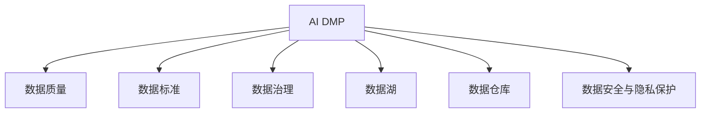

                 

# AI DMP 数据基建：数据质量与数据标准

> 关键词：AI DMP, 数据质量, 数据标准, 数据治理, 数据管理, 数据仓库, 数据湖

## 1. 背景介绍

### 1.1 问题由来

在数字时代，数据已经成为推动企业发展、洞察市场趋势、优化用户体验的关键资产。然而，数据质量的高低直接决定了企业数据驱动决策的准确性和效率。数据质量问题可能导致诸多严重的后果，包括决策失误、品牌受损、消费者信任度下降等。因此，高质量的数据基础设施（Data Infrastructure）建设，尤其是数据管理平台（DMP）的构建，已经成为企业提升竞争力的核心要素。

当前，大数据和人工智能技术的快速发展，为DMP的构建提供了前所未有的技术支撑。AI DMP，即基于人工智能的数据管理平台，能够利用先进的数据处理和分析技术，提高数据质量和利用效率，从而更好地服务于业务决策和用户体验。然而，在AI DMP的构建过程中，数据质量与数据标准的把控是至关重要的，这直接影响到平台能否有效支撑企业业务需求和客户价值。

### 1.2 问题核心关键点

构建高效、准确的AI DMP，需要解决以下几个核心关键点：

1. **数据质量监控**：确保数据来源、处理和存储过程中的质量，避免错误、遗漏和不一致性。
2. **数据标准制定**：建立统一的数据分类、编码、格式和标签标准，提升数据的一致性和可理解性。
3. **数据治理体系**：形成跨部门的数据管理流程和规范，实现数据的全生命周期管理。
4. **数据湖与数据仓库**：选择合适的技术架构，高效存储和管理大规模异构数据，支持复杂查询和分析。
5. **数据安全与隐私保护**：确保数据在收集、处理和传输过程中的安全性，符合法律法规和隐私保护要求。

### 1.3 问题研究意义

高质量的数据基础设施是AI DMP成功的基础，对提升企业数据驱动能力、优化用户体验、驱动业务创新具有重要意义：

1. **提升决策效率与精准性**：通过准确的数据质量监控和标准制定，确保数据驱动决策的可靠性和准确性。
2. **增强客户洞察力**：利用高标准的数据管理，深度分析客户行为和偏好，实现更精准的个性化推荐和服务。
3. **优化运营效率**：通过数据治理和自动化流程，减少人工干预，提高数据处理和分析的效率。
4. **促进业务创新**：基于数据驱动的洞察，发现新的商业机会，驱动业务模式创新和转型。
5. **强化数据合规**：遵循数据安全与隐私保护法规，确保业务运营合法合规，规避法律风险。

## 2. 核心概念与联系

### 2.1 核心概念概述

在AI DMP的构建过程中，涉及多个关键概念，包括：

- **AI DMP**：基于人工智能技术的数据管理平台，通过机器学习、自然语言处理等技术，提升数据处理的效率和质量。
- **数据质量**：指数据符合既定标准的程度，包括数据的准确性、完整性、一致性、时效性和可用性。
- **数据标准**：一套规范化、统一的数据分类、编码和格式规则，确保数据的可理解性和一致性。
- **数据治理**：指对数据进行全生命周期管理，包括数据采集、存储、处理、分析和使用的规范和流程。
- **数据湖与数据仓库**：用于存储和管理大规模异构数据的技术架构，数据湖支持多种数据格式，数据仓库则提供结构化数据的高效查询和分析。
- **数据安全与隐私保护**：指在数据生命周期的各个环节，确保数据的安全性和隐私保护，遵循相关法律法规和最佳实践。

这些概念之间的逻辑关系可以通过以下Mermaid流程图来展示：



这个流程图展示了几大核心概念之间的关系：

1. AI DMP以数据质量、标准、治理等为基础，通过数据湖和数据仓库技术，实现数据的存储和管理。
2. 数据质量与标准是AI DMP的前提，确保数据的一致性和可靠性。
3. 数据治理确保数据的规范化管理和高效利用。
4. 数据湖和数据仓库是数据存储和管理的有效架构。
5. 数据安全与隐私保护是数据管理的核心要求，确保数据的合法合规。

## 3. 核心算法原理 & 具体操作步骤
### 3.1 算法原理概述

AI DMP构建过程中，数据质量与数据标准的管理是基础，其核心算法原理可概括为：

- **数据清洗与标准化**：通过数据清洗技术，去除或修复数据中的错误、缺失、异常值，统一数据格式和编码规则。
- **数据质量评估**：利用数据质量评估模型，定期检查数据的质量状态，识别和修复数据问题。
- **数据标准制定**：建立统一的数据分类、编码和格式规则，提升数据的一致性和可理解性。
- **数据治理流程**：制定数据治理流程和规范，确保数据在全生命周期中的标准化和规范化管理。
- **数据湖与数据仓库管理**：选择合适的数据湖或数据仓库架构，实现大规模异构数据的存储和管理。
- **数据安全与隐私保护**：采用数据加密、访问控制等技术，确保数据在存储、处理和传输过程中的安全性。

### 3.2 算法步骤详解

AI DMP构建过程中，数据质量与数据标准的管理步骤如下：

**Step 1: 数据质量评估与监控**

1. 收集数据质量评估指标，如完整性、准确性、一致性、时效性和可用性。
2. 定义数据质量监控规则和阈值，自动检测数据质量问题。
3. 根据监控结果生成报警，及时处理数据质量问题。

**Step 2: 数据清洗与标准化**

1. 识别和修复数据中的错误、缺失、异常值，确保数据准确性和完整性。
2. 统一数据格式和编码规则，如日期格式、货币单位等，提升数据一致性。
3. 数据标准化处理，如数据类型转换、缺失值填充等。

**Step 3: 数据标准制定**

1. 建立统一的数据分类、编码和格式规则，如行业标准、公司内部标准等。
2. 制定数据标签规范，确保标签的一致性和可理解性。
3. 发布数据标准文档，指导数据处理和分析。

**Step 4: 数据治理流程**

1. 制定数据治理流程和规范，确保数据在全生命周期中的标准化和规范化管理。
2. 建立跨部门的数据管理团队，确保数据治理的协同与持续改进。
3. 利用数据治理工具，实现数据管理流程的自动化和可视化。

**Step 5: 数据湖与数据仓库管理**

1. 选择合适的数据湖或数据仓库架构，实现大规模异构数据的存储和管理。
2. 设计高效的数据湖架构，支持多种数据格式和实时数据处理。
3. 优化数据仓库查询性能，确保复杂查询和分析的高效执行。

**Step 6: 数据安全与隐私保护**

1. 采用数据加密技术，确保数据在存储和传输过程中的安全性。
2. 实施访问控制策略，限制数据访问权限，防止数据泄露。
3. 遵循数据隐私保护法规，如GDPR、CCPA等，确保业务运营合法合规。

### 3.3 算法优缺点

**优点**：

1. 数据质量与标准的管理，确保数据的一致性和可靠性，提升数据驱动决策的准确性。
2. 数据治理流程，提升数据处理的效率和质量，减少人工干预。
3. 数据湖与数据仓库架构，支持大规模异构数据的存储和管理，提升数据利用效率。
4. 数据安全与隐私保护，确保数据在全生命周期中的合法合规，避免法律风险。

**缺点**：

1. 数据清洗与标准化可能需要大量资源和人力，成本较高。
2. 数据标准制定和实施需要跨部门协调，过程复杂。
3. 数据治理流程的建立和维护需要持续投入，过程繁琐。
4. 数据湖与数据仓库架构的构建和优化需要高级技术支持，复杂度较高。

### 3.4 算法应用领域

AI DMP的数据质量与标准管理技术，在以下领域具有广泛应用：

- **零售行业**：通过数据分析和个性化推荐，提升客户体验和销售转化率。
- **金融行业**：利用客户行为分析和信用评估，优化风险管理和金融服务。
- **互联网行业**：基于用户行为数据，实现精准广告投放和内容推荐。
- **医疗行业**：通过数据挖掘和分析，提升疾病预测和医疗服务质量。
- **政府行业**：利用公共数据和社会大数据，提升公共服务和政策制定。

## 4. 数学模型和公式 & 详细讲解 & 举例说明

### 4.1 数学模型构建

在AI DMP的数据质量与标准管理中，需要建立以下数学模型：

- **数据质量评估模型**：用于评估数据的完整性、准确性、一致性、时效性和可用性。
- **数据清洗与标准化模型**：用于数据清洗和标准化处理。
- **数据标准模型**：用于定义和统一数据分类、编码和格式规则。
- **数据治理流程模型**：用于制定数据治理流程和规范。
- **数据湖与数据仓库管理模型**：用于设计高效的数据湖架构和优化数据仓库性能。
- **数据安全与隐私保护模型**：用于设计数据加密和访问控制策略。

### 4.2 公式推导过程

以数据质量评估模型为例，其基本公式如下：

$$
Q = \frac{A}{N} \times 100\%
$$

其中，$Q$ 表示数据质量评分，$A$ 表示数据符合质量标准的数量，$N$ 表示数据总数量。

### 4.3 案例分析与讲解

以零售行业的用户行为数据分析为例，分析数据质量与标准管理的实际应用：

1. **数据收集**：从在线销售平台、社交媒体、客户反馈等渠道收集用户行为数据。
2. **数据清洗与标准化**：清洗数据中的错误、缺失、异常值，统一日期格式和货币单位。
3. **数据标准制定**：定义产品分类、订单状态、客户标签等标准。
4. **数据治理流程**：制定数据治理流程和规范，确保数据在全生命周期中的标准化和规范化管理。
5. **数据湖与数据仓库管理**：设计高效的数据湖架构，实现大规模异构数据的存储和管理。
6. **数据安全与隐私保护**：采用数据加密和访问控制技术，确保数据在存储和传输过程中的安全性。

## 5. 项目实践：代码实例和详细解释说明
### 5.1 开发环境搭建

在AI DMP构建过程中，需要进行以下开发环境搭建：

1. 安装Python和相关依赖库，如Pandas、NumPy、Scikit-learn等。
2. 安装数据治理工具，如Data Quality Tool、ETL工具等。
3. 安装数据湖和数据仓库系统，如AWS Data Lake、Google BigQuery等。

**Step 1: 数据质量评估与监控**

1. 使用Pandas库读取数据，计算数据质量指标。
2. 使用ETL工具进行数据清洗和标准化处理。
3. 设计数据质量监控规则和阈值，自动检测数据质量问题。

**Step 2: 数据清洗与标准化**

1. 使用Pandas库识别和修复数据中的错误、缺失、异常值。
2. 使用ETL工具统一数据格式和编码规则。
3. 设计数据标准化处理流程。

**Step 3: 数据标准制定**

1. 使用Data Quality Tool定义数据标准和规范。
2. 发布数据标准文档，指导数据处理和分析。

**Step 4: 数据治理流程**

1. 使用ETL工具和Data Quality Tool制定数据治理流程和规范。
2. 建立跨部门的数据管理团队，确保数据治理的协同与持续改进。

**Step 5: 数据湖与数据仓库管理**

1. 设计高效的数据湖架构，支持多种数据格式和实时数据处理。
2. 优化数据仓库查询性能，确保复杂查询和分析的高效执行。

**Step 6: 数据安全与隐私保护**

1. 使用加密技术对数据进行保护。
2. 实施访问控制策略，限制数据访问权限。
3. 遵循数据隐私保护法规，确保业务运营合法合规。

### 5.2 源代码详细实现

以下是一个数据质量评估与监控的Python代码实现：

```python
import pandas as pd
from sqlalchemy import create_engine

# 读取数据
data = pd.read_csv('data.csv')

# 数据清洗与标准化
data = data.dropna()
data['date'] = pd.to_datetime(data['date'], format='%Y-%m-%d')

# 数据质量评估
def data_quality_score(data):
    quality = data['status'].value_counts() / len(data) * 100
    return quality

# 数据质量监控
def data_quality_monitor(data, threshold=90):
    score = data_quality_score(data)
    if score < threshold:
        print('Data quality below threshold, please take action.')
    else:
        print('Data quality meets threshold.')

data_quality_monitor(data)
```

### 5.3 代码解读与分析

代码实现了数据质量评估与监控的功能，主要包括以下几个步骤：

1. **数据读取**：使用Pandas库读取CSV文件，将其转换为DataFrame对象。
2. **数据清洗与标准化**：使用Pandas库的`dropna`方法去除缺失值，使用`pd.to_datetime`方法统一日期格式。
3. **数据质量评估**：使用自定义函数`data_quality_score`计算数据质量评分。
4. **数据质量监控**：使用自定义函数`data_quality_monitor`检查数据质量评分是否达到预设阈值，若未达到则输出报警信息。

## 6. 实际应用场景
### 6.1 智能客服系统

在智能客服系统中，数据质量与标准管理至关重要。通过AI DMP构建高质量的客户行为数据，可以提升客户服务体验和满意度。具体应用场景包括：

1. **客户行为分析**：通过数据分析，了解客户需求和行为模式，优化服务流程和策略。
2. **客户体验管理**：基于数据质量评估结果，提升客服系统的响应速度和准确性。
3. **客户投诉分析**：利用数据质量监控，及时发现并解决客户投诉问题，提升客户满意度。

### 6.2 金融风控系统

在金融风控系统中，数据质量与标准管理能够有效提升风险评估和信用评估的准确性。具体应用场景包括：

1. **信用评分模型**：利用客户行为数据，构建高精度的信用评分模型。
2. **欺诈检测**：通过数据分析和质量评估，识别和预防潜在的欺诈行为。
3. **投资风险管理**：基于高质量的财务数据和市场数据，进行投资风险分析和预测。

### 6.3 个性化推荐系统

在个性化推荐系统中，数据质量与标准管理能够提升推荐算法的精准性和用户满意度。具体应用场景包括：

1. **用户行为分析**：通过数据分析，了解用户偏好和行为模式，优化推荐策略。
2. **个性化推荐**：基于数据质量评估结果，提供更精准的个性化推荐。
3. **用户满意度管理**：利用数据质量监控，提升推荐系统的用户体验。

### 6.4 未来应用展望

未来，AI DMP的数据质量与标准管理技术将在更多领域得到应用，为各行各业带来变革性影响：

1. **医疗行业**：通过数据分析和质量评估，提升疾病预测和医疗服务质量。
2. **政府行业**：利用公共数据和社会大数据，提升公共服务和政策制定。
3. **交通行业**：通过数据分析，优化交通管理和服务，提升交通效率和安全性。
4. **物流行业**：基于数据质量与标准管理，优化物流管理流程和效率。
5. **能源行业**：通过数据分析，提升能源生产和消费的智能化水平。

## 7. 工具和资源推荐
### 7.1 学习资源推荐

为帮助开发者系统掌握AI DMP的数据质量与标准管理技术，这里推荐一些优质的学习资源：

1. **《数据质量管理》书籍**：介绍数据质量管理的理论和方法，包括数据质量评估、数据清洗、数据标准化等。
2. **Data Quality Tool官方文档**：提供详细的工具使用方法和示例，包括数据质量监控、数据清洗等功能。
3. **Data Lake和Data Warehouse技术博客**：介绍AWS、Google等主流数据湖和数据仓库系统的使用方法和最佳实践。
4. **数据安全与隐私保护指南**：提供数据安全与隐私保护的理论和实践方法，确保数据在全生命周期中的安全性。
5. **Data Lake和Data Warehouse开源项目**：如Apache Hive、Apache Hadoop等，提供开源的解决方案和工具。

通过对这些资源的学习实践，相信你一定能够快速掌握AI DMP的数据质量与标准管理技术的精髓，并用于解决实际的业务问题。

### 7.2 开发工具推荐

高效的工具支持是AI DMP构建过程中不可或缺的，以下是几款用于数据质量与标准管理的常用工具：

1. **Data Quality Tool**：提供数据质量监控、数据清洗、数据标准化等功能。
2. **ETL工具**：如Talend、Apache NiFi等，用于数据采集、转换和加载。
3. **数据治理工具**：如DataGovern、Alation等，提供数据治理流程和规范的管理。
4. **数据湖和数据仓库系统**：如AWS Data Lake、Google BigQuery等，支持大规模异构数据的存储和管理。
5. **数据加密和安全工具**：如AES、RSA等，确保数据在存储和传输过程中的安全性。

合理利用这些工具，可以显著提升AI DMP的数据质量与标准管理效率，加快创新迭代的步伐。

### 7.3 相关论文推荐

AI DMP的数据质量与标准管理技术的发展源于学界的持续研究。以下是几篇奠基性的相关论文，推荐阅读：

1. **《大数据质量管理框架研究》**：探讨大数据环境下的数据质量管理框架和方法。
2. **《基于机器学习的数据质量评估》**：介绍机器学习技术在数据质量评估中的应用。
3. **《数据标准化和规范制定》**：探讨数据标准化和规范制定的理论和实践方法。
4. **《数据治理体系建设》**：介绍数据治理体系的构建和管理方法。
5. **《数据安全与隐私保护技术》**：探讨数据安全与隐私保护的理论和实践方法。

这些论文代表了大数据管理技术的发展脉络。通过学习这些前沿成果，可以帮助研究者把握学科前进方向，激发更多的创新灵感。

## 8. 总结：未来发展趋势与挑战

### 8.1 总结

本文对AI DMP的数据质量与标准管理技术进行了全面系统的介绍。首先阐述了数据质量与标准管理在AI DMP构建中的重要性，明确了数据质量与标准管理对提升企业数据驱动能力、优化用户体验和驱动业务创新的核心价值。其次，从原理到实践，详细讲解了数据质量与标准管理的数学模型和操作步骤，给出了数据质量与标准管理的完整代码实现。同时，本文还广泛探讨了数据质量与标准管理在智能客服、金融风控、个性化推荐等多个行业领域的应用前景，展示了数据质量与标准管理的巨大潜力。此外，本文精选了数据质量与标准管理技术的各类学习资源，力求为读者提供全方位的技术指引。

通过本文的系统梳理，可以看到，数据质量与标准管理在AI DMP构建中的重要地位，对提升企业数据驱动能力、优化用户体验和驱动业务创新的核心价值。未来，伴随数据质量与标准管理技术的持续演进，相信AI DMP必将在构建人机协同的智能时代中扮演越来越重要的角色。

### 8.2 未来发展趋势

展望未来，AI DMP的数据质量与标准管理技术将呈现以下几个发展趋势：

1. **自动化和智能化提升**：通过AI技术，实现数据质量与标准管理的自动化和智能化，减少人工干预，提高效率。
2. **跨部门数据协同**：建立跨部门的数据协同机制，确保数据在全生命周期中的标准化和规范化管理。
3. **实时数据质量监控**：利用实时数据流处理技术，实现对数据质量的实时监控和即时反馈。
4. **数据标准演进与更新**：随着行业的发展和技术的进步，数据标准的演进与更新将成为常态。
5. **数据治理工具的优化**：开发更加高效、易用的数据治理工具，提升数据治理流程的灵活性和可扩展性。

这些趋势凸显了数据质量与标准管理技术的广阔前景。这些方向的探索发展，必将进一步提升AI DMP的数据处理和分析能力，为构建安全、可靠、可解释、可控的智能系统铺平道路。

### 8.3 面临的挑战

尽管AI DMP的数据质量与标准管理技术已经取得了瞩目成就，但在迈向更加智能化、普适化应用的过程中，它仍面临着诸多挑战：

1. **数据质量监控的全面覆盖**：实现对数据质量问题的全面监控和实时反馈，减少人工干预，提高效率。
2. **跨部门数据协同的协调性**：确保跨部门数据协同的高效性和一致性，避免数据标准和流程的冲突。
3. **数据标准演进与更新的挑战**：随着行业的发展和技术的进步，数据标准的演进与更新需要持续投入和协调。
4. **数据治理工具的灵活性和可扩展性**：开发更加高效、易用的数据治理工具，提升数据治理流程的灵活性和可扩展性。

### 8.4 研究展望

面对数据质量与标准管理面临的挑战，未来的研究需要在以下几个方面寻求新的突破：

1. **自动化和智能化**：开发更加自动化和智能化的数据质量与标准管理工具，减少人工干预，提高效率。
2. **跨部门数据协同**：建立跨部门的数据协同机制，确保数据在全生命周期中的标准化和规范化管理。
3. **实时数据质量监控**：利用实时数据流处理技术，实现对数据质量的实时监控和即时反馈。
4. **数据标准演进与更新**：建立数据标准演进与更新的机制，确保数据标准的持续改进和应用。
5. **数据治理工具的优化**：开发更加高效、易用的数据治理工具，提升数据治理流程的灵活性和可扩展性。

这些研究方向的探索，必将引领AI DMP的数据质量与标准管理技术迈向更高的台阶，为构建安全、可靠、可解释、可控的智能系统铺平道路。面向未来，数据质量与标准管理技术还需要与其他人工智能技术进行更深入的融合，如知识表示、因果推理、强化学习等，多路径协同发力，共同推动自然语言理解和智能交互系统的进步。只有勇于创新、敢于突破，才能不断拓展AI DMP的边界，让智能技术更好地造福人类社会。

## 9. 附录：常见问题与解答

**Q1：AI DMP的数据质量与标准管理对业务运营有哪些影响？**

A: AI DMP的数据质量与标准管理对业务运营有显著影响，主要体现在以下几个方面：

1. **提升决策效率与精准性**：通过数据质量与标准管理，确保数据驱动决策的可靠性和准确性，提升业务运营效率和精准性。
2. **增强客户洞察力**：利用高标准的数据管理，深度分析客户行为和偏好，实现更精准的个性化推荐和服务，提升客户满意度和忠诚度。
3. **优化运营效率**：通过数据治理和自动化流程，减少人工干预，提高数据处理和分析的效率，降低运营成本。
4. **促进业务创新**：基于数据驱动的洞察，发现新的商业机会，驱动业务模式创新和转型，提升市场竞争力。

**Q2：如何构建高效的数据质量与标准管理流程？**

A: 构建高效的数据质量与标准管理流程，需要以下几个关键步骤：

1. **数据质量评估与监控**：通过数据质量评估指标和监控规则，定期检查数据质量问题，生成报警，及时处理数据质量问题。
2. **数据清洗与标准化**：识别和修复数据中的错误、缺失、异常值，统一数据格式和编码规则，确保数据准确性和完整性。
3. **数据标准制定**：建立统一的数据分类、编码和格式规则，提升数据的一致性和可理解性。
4. **数据治理流程**：制定数据治理流程和规范，确保数据在全生命周期中的标准化和规范化管理。
5. **数据湖与数据仓库管理**：选择合适的数据湖或数据仓库架构，实现大规模异构数据的存储和管理，设计高效的数据湖架构和优化数据仓库性能。
6. **数据安全与隐私保护**：采用数据加密和访问控制技术，确保数据在存储和传输过程中的安全性，遵循数据隐私保护法规，确保业务运营合法合规。

**Q3：数据质量与标准管理在AI DMP构建中面临的主要挑战有哪些？**

A: 数据质量与标准管理在AI DMP构建中面临的主要挑战包括：

1. **数据质量监控的全面覆盖**：实现对数据质量问题的全面监控和实时反馈，减少人工干预，提高效率。
2. **跨部门数据协同的协调性**：确保跨部门数据协同的高效性和一致性，避免数据标准和流程的冲突。
3. **数据标准演进与更新的挑战**：随着行业的发展和技术的进步，数据标准的演进与更新需要持续投入和协调。
4. **数据治理工具的灵活性和可扩展性**：开发更加高效、易用的数据治理工具，提升数据治理流程的灵活性和可扩展性。

**Q4：AI DMP的数据质量与标准管理对企业数据驱动决策有哪些帮助？**

A: AI DMP的数据质量与标准管理对企业数据驱动决策有显著帮助，主要体现在以下几个方面：

1. **提升决策效率与精准性**：通过数据质量与标准管理，确保数据驱动决策的可靠性和准确性，提升业务运营效率和精准性。
2. **增强客户洞察力**：利用高标准的数据管理，深度分析客户行为和偏好，实现更精准的个性化推荐和服务，提升客户满意度和忠诚度。
3. **优化运营效率**：通过数据治理和自动化流程，减少人工干预，提高数据处理和分析的效率，降低运营成本。
4. **促进业务创新**：基于数据驱动的洞察，发现新的商业机会，驱动业务模式创新和转型，提升市场竞争力。

**Q5：AI DMP的数据质量与标准管理在构建过程中需要注意哪些问题？**

A: AI DMP的数据质量与标准管理在构建过程中需要注意以下几个问题：

1. **数据质量监控的全面覆盖**：实现对数据质量问题的全面监控和实时反馈，减少人工干预，提高效率。
2. **跨部门数据协同的协调性**：确保跨部门数据协同的高效性和一致性，避免数据标准和流程的冲突。
3. **数据标准演进与更新的挑战**：随着行业的发展和技术的进步，数据标准的演进与更新需要持续投入和协调。
4. **数据治理工具的灵活性和可扩展性**：开发更加高效、易用的数据治理工具，提升数据治理流程的灵活性和可扩展性。

通过本文的系统梳理，可以看到，AI DMP的数据质量与标准管理在构建过程中的重要性，对提升企业数据驱动能力、优化用户体验和驱动业务创新的核心价值。未来，伴随数据质量与标准管理技术的持续演进，相信AI DMP必将在构建人机协同的智能时代中扮演越来越重要的角色。

---

作者：禅与计算机程序设计艺术 / Zen and the Art of Computer Programming

