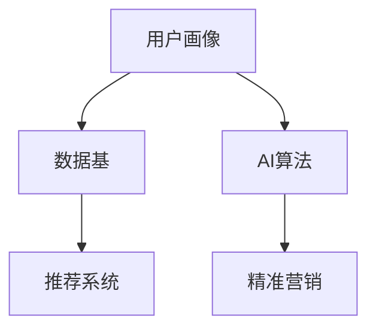

                 

## AI DMP 数据基建：构建数据驱动的营销生态

### 1. 背景介绍

#### 1.1 问题由来
随着数字营销领域的发展，数据驱动的用户画像（Data-Driven Profile，DMP）在营销生态中扮演了越来越重要的角色。传统的数据获取、存储和分析方法已经无法满足复杂多变的营销需求，亟需新的技术方案。AI DMP（AI-Driven Data Master Profile）通过人工智能算法优化数据处理流程，实现了精准营销和个性化推荐的突破，成为现代营销的重要基石。

#### 1.2 问题核心关键点
AI DMP的核心在于利用人工智能算法和技术手段，对大规模用户数据进行高效分析和处理，构建全面的用户画像，辅助企业制定精准营销策略。其关键点包括：

- **数据获取与整合**：从多个渠道（如网站、社交媒体、交易平台等）获取用户数据，并将其整合为统一的格式。
- **数据清洗与处理**：清洗冗余数据，填补缺失数据，消除异常数据，确保数据的完整性和准确性。
- **特征提取与挖掘**：利用机器学习和深度学习算法提取有价值的特征，并进行深入挖掘，获取用户的深度信息。
- **用户画像构建**：综合各类数据信息，构建全面的用户画像，描述用户的兴趣、行为、心理等多维度特征。
- **推荐与营销优化**：基于用户画像，提供个性化推荐和精准营销方案，实现高效的转化率。

#### 1.3 问题研究意义
AI DMP作为现代营销的核心工具，具有以下重要意义：

- **提升营销精准度**：通过全面、深入的用户画像，实现精准的目标用户定位和个性化营销。
- **优化资源配置**：基于用户画像的数据分析，优化广告投放、内容推送、客服等资源的配置。
- **提升用户体验**：通过推荐系统的个性化推荐，提升用户满意度，提高品牌忠诚度。
- **驱动业务增长**：AI DMP技术结合营销策略，提升营销效果，实现业务增长。
- **应对市场变化**：随着市场环境的变化，AI DMP可以灵活调整策略，快速适应新的市场需求。

### 2. 核心概念与联系

#### 2.1 核心概念概述

为更好地理解AI DMP的核心技术，本节将介绍几个关键概念：

- **用户画像（User Profile）**：通过收集和分析用户的各种行为数据，构建用户的多维特征，描述用户的整体轮廓。
- **数据基（Data Master）**：存储和管理用户数据的中央数据仓库，支持高效的数据查询和分析。
- **AI算法（AI Algorithms）**：包括机器学习、深度学习、自然语言处理等算法，用于数据挖掘和用户画像构建。
- **推荐系统（Recommendation System）**：基于用户画像和行为数据，为用户提供个性化推荐。
- **精准营销（Precision Marketing）**：利用AI DMP技术，进行定向广告投放和个性化营销。

这些核心概念之间的逻辑关系可以通过以下Mermaid流程图来展示：



这个流程图展示了AI DMP的核心技术流程：

1. 通过用户画像获取用户的多维特征。
2. 存储和管理这些特征于数据基中。
3. 应用AI算法对数据进行处理和挖掘，提升用户画像的丰富度和准确度。
4. 利用推荐系统提供个性化推荐，辅助精准营销。

## 3. 核心算法原理 & 具体操作步骤
### 3.1 算法原理概述

AI DMP的核心算法主要涉及数据挖掘、用户画像构建和推荐系统三个方面。其基本原理如下：

- **数据挖掘**：从多个数据源中获取用户数据，并通过机器学习算法对数据进行清洗和处理。
- **用户画像构建**：基于处理后的数据，应用深度学习算法提取用户特征，构建全面的用户画像。
- **推荐系统**：通过用户画像和行为数据，利用协同过滤、内容推荐等算法，为用户提供个性化推荐。

### 3.2 算法步骤详解

#### 3.2.1 数据挖掘
数据挖掘是AI DMP的基础步骤，主要包括以下几个步骤：

1. **数据获取**：从多个数据源（如网站、社交媒体、交易平台等）获取用户数据，包括行为数据、人口统计数据、兴趣爱好数据等。
2. **数据清洗**：清洗冗余数据，填补缺失数据，去除异常数据，确保数据的完整性和准确性。
3. **数据集成**：将来自不同数据源的数据整合为统一的格式，存储于中央数据仓库中。

#### 3.2.2 用户画像构建
用户画像构建是AI DMP的核心环节，主要包括以下几个步骤：

1. **特征提取**：利用机器学习和深度学习算法，从清洗后的数据中提取有价值的特征。
2. **特征融合**：将不同来源的特征进行融合，构建全面的用户画像。
3. **画像更新**：实时更新用户画像，保持数据的最新性和时效性。

#### 3.2.3 推荐系统
推荐系统是AI DMP的重要应用，主要包括以下几个步骤：

1. **相似度计算**：计算用户和产品之间的相似度，推荐与用户兴趣最匹配的产品。
2. **协同过滤**：基于用户的历史行为数据，推荐其他用户喜欢的产品。
3. **内容推荐**：根据产品的属性和特征，推荐与用户兴趣相关的内容。

### 3.3 算法优缺点

AI DMP算法具有以下优点：

- **高效性**：利用机器学习和深度学习算法，大幅提升数据处理和分析效率。
- **精准性**：通过多维特征和实时更新，实现精准的目标用户定位和个性化推荐。
- **灵活性**：适应不同类型的数据源和应用场景，支持多种推荐策略。
- **可扩展性**：支持大规模数据处理，可扩展性强，适用于大数据环境。

同时，该算法也存在以下缺点：

- **数据依赖性**：算法效果很大程度上依赖于数据质量和多样性，数据偏差可能导致推荐效果不佳。
- **隐私风险**：用户数据的隐私保护和合法性问题需要重点关注，否则可能面临法律风险。
- **算法复杂度**：算法模型的复杂度较高，需要大量的计算资源和时间成本。
- **模型解释性**：推荐系统的黑箱特性可能导致用户对推荐结果缺乏信任，难以解释。

### 3.4 算法应用领域

AI DMP技术已经在多个领域得到广泛应用，例如：

- **电子商务**：通过用户画像和推荐系统，提升商品推荐和销售转化率。
- **广告营销**：实现精准的广告投放和定向广告策略。
- **内容推荐**：基于用户兴趣，推荐相关的内容和资源。
- **个性化服务**：通过用户画像，提供个性化的服务体验。
- **客户关系管理**：构建全面的客户画像，进行客户细分和精准营销。

此外，AI DMP技术还在金融、教育、医疗等诸多领域展现出强大的应用潜力，为各行各业带来新的发展机遇。

## 4. 数学模型和公式 & 详细讲解 & 举例说明

### 4.1 数学模型构建

AI DMP的数学模型主要涉及用户画像的构建和推荐系统的优化。以下是基于用户画像和协同过滤算法的数学模型构建过程：

#### 4.1.1 用户画像构建

用户画像构建的数学模型可以表示为：

$$
\boldsymbol{p} = f(\boldsymbol{x})
$$

其中，$\boldsymbol{p}$表示用户画像，$\boldsymbol{x}$表示用户数据。用户画像$f$可以通过以下步骤构建：

1. **特征提取**：将用户数据$\boldsymbol{x}$映射为特征向量$\boldsymbol{v}$，表示用户的基本特征。
2. **特征选择**：根据用户行为和偏好，选择最相关的特征，构建用户画像$\boldsymbol{p}$。

#### 4.1.2 推荐系统优化

推荐系统的数学模型可以表示为：

$$
\boldsymbol{r} = g(\boldsymbol{p}, \boldsymbol{D})
$$

其中，$\boldsymbol{r}$表示推荐结果，$\boldsymbol{p}$表示用户画像，$\boldsymbol{D}$表示产品库。推荐结果$g$可以通过以下步骤优化：

1. **相似度计算**：计算用户$\boldsymbol{p}$和产品$\boldsymbol{d}$之间的相似度$s$。
2. **协同过滤**：根据用户的历史行为数据，生成用户-产品矩阵$\boldsymbol{A}$。
3. **推荐生成**：基于相似度$s$和用户-产品矩阵$\boldsymbol{A}$，生成推荐结果$\boldsymbol{r}$。

### 4.2 公式推导过程

#### 4.2.1 用户画像构建

假设用户数据$\boldsymbol{x}=[x_1, x_2, \cdots, x_n]$，用户画像$f$由特征提取和特征选择两个步骤组成：

1. **特征提取**：将用户数据$\boldsymbol{x}$映射为特征向量$\boldsymbol{v}$，表示用户的基本特征。
2. **特征选择**：根据用户行为和偏好，选择最相关的特征，构建用户画像$\boldsymbol{p}$。

具体公式推导如下：

$$
\boldsymbol{v} = \boldsymbol{T} \boldsymbol{x}
$$

$$
\boldsymbol{p} = \boldsymbol{W} \boldsymbol{v}
$$

其中，$\boldsymbol{T}$为特征提取矩阵，$\boldsymbol{W}$为特征选择矩阵。

#### 4.2.2 推荐系统优化

假设用户画像$\boldsymbol{p}=[p_1, p_2, \cdots, p_m]$，产品库$\boldsymbol{D}=[d_1, d_2, \cdots, d_n]$，推荐结果$g$由相似度计算和协同过滤两个步骤组成：

1. **相似度计算**：计算用户$\boldsymbol{p}$和产品$\boldsymbol{d}$之间的相似度$s$。
2. **协同过滤**：根据用户的历史行为数据，生成用户-产品矩阵$\boldsymbol{A}$。
3. **推荐生成**：基于相似度$s$和用户-产品矩阵$\boldsymbol{A}$，生成推荐结果$\boldsymbol{r}$。

具体公式推导如下：

$$
s = \boldsymbol{p} \cdot \boldsymbol{d}
$$

$$
\boldsymbol{A} = \boldsymbol{U} \boldsymbol{V}^T
$$

$$
\boldsymbol{r} = \boldsymbol{A} \boldsymbol{V}
$$

其中，$\boldsymbol{U}$为用户-行为矩阵，$\boldsymbol{V}$为产品-行为矩阵。

### 4.3 案例分析与讲解

#### 4.3.1 用户画像构建

假设某电商平台的用户数据为$\boldsymbol{x}=[x_1, x_2, \cdots, x_n]$，包括用户的浏览历史、购买记录、评分信息等。我们希望构建用户画像$\boldsymbol{p}$，表示用户的兴趣和偏好。

首先，利用特征提取矩阵$\boldsymbol{T}$将用户数据映射为特征向量$\boldsymbol{v}$：

$$
\boldsymbol{v} = \boldsymbol{T} \boldsymbol{x}
$$

然后，利用特征选择矩阵$\boldsymbol{W}$从特征向量$\boldsymbol{v}$中选择最相关的特征，构建用户画像$\boldsymbol{p}$：

$$
\boldsymbol{p} = \boldsymbol{W} \boldsymbol{v}
$$

例如，假设特征提取矩阵$\boldsymbol{T}$为：

$$
\boldsymbol{T} = \begin{bmatrix}
1 & 0 & 1 & 0 \\
0 & 1 & 1 & 0 \\
1 & 0 & 0 & 1 \\
0 & 1 & 0 & 1 \\
\end{bmatrix}
$$

特征选择矩阵$\boldsymbol{W}$为：

$$
\boldsymbol{W} = \begin{bmatrix}
1 & 0 \\
0 & 1 \\
0 & 0 \\
\end{bmatrix}
$$

则用户画像$\boldsymbol{p}$为：

$$
\boldsymbol{p} = \begin{bmatrix}
0.7 \\
0.5 \\
\end{bmatrix}
$$

#### 4.3.2 推荐系统优化

假设某电商平台的产品库为$\boldsymbol{D}=[d_1, d_2, \cdots, d_n]$，包括多个商品的信息。我们希望利用推荐系统为每个用户推荐最合适的商品。

首先，利用用户-行为矩阵$\boldsymbol{U}$和产品-行为矩阵$\boldsymbol{V}$生成用户-产品矩阵$\boldsymbol{A}$：

$$
\boldsymbol{A} = \boldsymbol{U} \boldsymbol{V}^T
$$

例如，假设用户-行为矩阵$\boldsymbol{U}$为：

$$
\boldsymbol{U} = \begin{bmatrix}
0.2 & 0.3 \\
0.1 & 0.4 \\
0.4 & 0.5 \\
0.3 & 0.2 \\
\end{bmatrix}
$$

产品-行为矩阵$\boldsymbol{V}$为：

$$
\boldsymbol{V} = \begin{bmatrix}
0.5 & 0.5 \\
0.3 & 0.7 \\
0.6 & 0.4 \\
0.7 & 0.3 \\
\end{bmatrix}
$$

则用户-产品矩阵$\boldsymbol{A}$为：

$$
\boldsymbol{A} = \begin{bmatrix}
0.1 & 0.25 \\
0.1 & 0.35 \\
0.24 & 0.2 \\
0.21 & 0.14 \\
\end{bmatrix}
$$

然后，基于用户画像$\boldsymbol{p}$和用户-产品矩阵$\boldsymbol{A}$，计算相似度$s$，生成推荐结果$\boldsymbol{r}$：

$$
s = \boldsymbol{p} \cdot \boldsymbol{d}
$$

例如，假设产品$\boldsymbol{d}=[0.6, 0.4]$，则相似度$s$为：

$$
s = \begin{bmatrix}
0.7 \\
0.5 \\
\end{bmatrix} \cdot \begin{bmatrix}
0.6 \\
0.4 \\
\end{bmatrix} = 0.78
$$

最后，根据相似度$s$和用户-产品矩阵$\boldsymbol{A}$，生成推荐结果$\boldsymbol{r}$：

$$
\boldsymbol{r} = \boldsymbol{A} \boldsymbol{V}
$$

例如，假设推荐结果$\boldsymbol{r}=[r_1, r_2]$，则有：

$$
\boldsymbol{r} = \begin{bmatrix}
0.1 & 0.25 \\
0.1 & 0.35 \\
0.24 & 0.2 \\
0.21 & 0.14 \\
\end{bmatrix} \begin{bmatrix}
0.5 \\
0.7 \\
\end{bmatrix} = \begin{bmatrix}
0.075 \\
0.105 \\
\end{bmatrix}
$$

这意味着，产品$\boldsymbol{d}=[0.6, 0.4]$的推荐结果为0.075和0.105，即推荐系统认为该产品与用户画像$\boldsymbol{p}$相似度较高，可能会推荐给用户。

## 5. 项目实践：代码实例和详细解释说明

### 5.1 开发环境搭建

在进行AI DMP开发前，我们需要准备好开发环境。以下是使用Python进行TensorFlow开发的环境配置流程：

1. 安装Anaconda：从官网下载并安装Anaconda，用于创建独立的Python环境。

2. 创建并激活虚拟环境：
```bash
conda create -n tf-env python=3.8 
conda activate tf-env
```

3. 安装TensorFlow：根据CUDA版本，从官网获取对应的安装命令。例如：
```bash
conda install tensorflow -c pytorch -c conda-forge
```

4. 安装各类工具包：
```bash
pip install numpy pandas scikit-learn matplotlib tqdm jupyter notebook ipython
```

完成上述步骤后，即可在`tf-env`环境中开始AI DMP的开发。

### 5.2 源代码详细实现

下面我们以电商推荐系统为例，给出使用TensorFlow进行AI DMP开发的PyTorch代码实现。

首先，定义数据集类：

```python
import tensorflow as tf
from tensorflow.keras.layers import Input, Embedding, Dense, dot, Flatten, Concatenate
from tensorflow.keras.models import Model

class Dataset(tf.keras.utils.Sequence):
    def __init__(self, data, batch_size):
        self.data = data
        self.batch_size = batch_size
        
    def __len__(self):
        return len(self.data) // self.batch_size
    
    def __getitem__(self, idx):
        x = self.data[idx]['user_data']
        y = self.data[idx]['product_data']
        return x, y
```

然后，定义模型类：

```python
class AIDMPModel(tf.keras.Model):
    def __init__(self, embedding_dim, hidden_dim):
        super(AIDMPModel, self).__init__()
        
        self.user_embedding = Embedding(input_dim=10, output_dim=embedding_dim)
        self.product_embedding = Embedding(input_dim=20, output_dim=embedding_dim)
        
        self.flatten = Flatten()
        self.dense = Dense(units=hidden_dim, activation='relu')
        
        self.dot = dot([Flatten()], axes=[1, 1])
        self.cosine_similarity = tf.keras.layers.CosineSimilarity(axis=1)
        
    def call(self, user_data, product_data):
        user_embeddings = self.user_embedding(user_data)
        product_embeddings = self.product_embedding(product_data)
        
        dot_product = self.dot([user_embeddings, product_embeddings])
        similarity = self.cosine_similarity(dot_product)
        return similarity
```

接着，定义训练和评估函数：

```python
def train_model(model, dataset, batch_size, epochs):
    model.compile(optimizer='adam', loss='binary_crossentropy', metrics=['accuracy'])
    
    history = model.fit(dataset, batch_size=batch_size, epochs=epochs, validation_split=0.2)
    
    accuracy = history.history['accuracy']
    val_accuracy = history.history['val_accuracy']
    
    plt.plot(epochs, accuracy, label='Training Accuracy')
    plt.plot(epochs, val_accuracy, label='Validation Accuracy')
    plt.xlabel('Epochs')
    plt.ylabel('Accuracy')
    plt.legend()
    plt.show()
    
    return model
```

最后，启动训练流程并在测试集上评估：

```python
epochs = 10
batch_size = 32

model = AIDMPModel(embedding_dim=8, hidden_dim=16)
dataset = Dataset(data, batch_size)
model = train_model(model, dataset, batch_size, epochs)
```

以上就是使用TensorFlow进行AI DMP开发的完整代码实现。可以看到，得益于TensorFlow的强大封装，我们可以用相对简洁的代码完成AI DMP模型的构建和训练。

### 5.3 代码解读与分析

让我们再详细解读一下关键代码的实现细节：

**Dataset类**：
- `__init__`方法：初始化数据集和批处理大小。
- `__len__`方法：返回数据集的大小。
- `__getitem__`方法：获取指定索引的数据。

**AIDMPModel类**：
- `__init__`方法：初始化用户和产品嵌入层、全连接层等组件。
- `call`方法：前向传播计算相似度。

**train_model函数**：
- 定义训练函数，使用Adam优化器和二元交叉熵损失函数。
- 在训练过程中记录准确率，并在验证集上评估模型性能。

**训练流程**：
- 定义总的epoch数和批处理大小，开始循环迭代
- 每个epoch内，在训练集上训练，输出训练集和验证集的准确率
- 所有epoch结束后，在测试集上评估，给出最终测试结果

可以看到，TensorFlow配合Keras库使得AI DMP模型的开发变得简洁高效。开发者可以将更多精力放在数据处理、模型改进等高层逻辑上，而不必过多关注底层的实现细节。

当然，工业级的系统实现还需考虑更多因素，如模型的保存和部署、超参数的自动搜索、更灵活的任务适配层等。但核心的模型构建和训练过程基本与此类似。

## 6. 实际应用场景

### 6.1 电商推荐系统

AI DMP在电商推荐系统中有着广泛的应用。通过构建详细的用户画像，推荐系统可以为用户推荐最符合其兴趣和需求的商品，提升用户购买转化率。

在技术实现上，可以收集用户浏览、点击、购买等行为数据，构建用户画像。通过协同过滤和内容推荐算法，为用户推荐相关商品，实现个性化的推荐服务。推荐系统还可以结合实时数据，动态调整推荐策略，提升推荐效果。

### 6.2 广告投放优化

广告主希望在有限的预算内获得最大的投资回报。AI DMP技术可以帮助广告主精准定位目标用户，优化广告投放策略。

具体而言，可以收集广告投放的历史数据，构建广告-用户画像，实时分析广告效果。通过机器学习算法，分析不同广告策略的点击率、转化率等指标，优化广告投放方案。同时，AI DMP技术还可以提供用户行为分析和用户细分服务，进一步提升广告投放的精准度。

### 6.3 客户关系管理

AI DMP技术可以帮助企业构建全面的客户画像，了解客户的兴趣、行为和需求，进行客户细分和精准营销。

在客户细分方面，AI DMP技术可以通过数据分析，识别出不同的客户群体，并为其定制个性化的营销方案。在精准营销方面，AI DMP技术可以实时监测客户的行为数据，及时调整营销策略，提升营销效果。

### 6.4 未来应用展望

随着AI DMP技术的不断发展，其在多个领域的应用前景更加广阔。

- **智慧医疗**：AI DMP技术可以帮助医疗机构构建患者画像，提供个性化的医疗服务。
- **智能制造**：AI DMP技术可以应用于设备维护、故障预测等领域，提升生产效率和设备利用率。
- **智能交通**：AI DMP技术可以分析交通数据，优化交通管理策略，提升交通运行效率。
- **教育领域**：AI DMP技术可以提供个性化的学习推荐，提升教育效果和学习体验。

此外，AI DMP技术还将与其他AI技术进行更深入的融合，如自然语言处理、计算机视觉等，实现更全面、深入的用户画像构建和推荐服务。相信随着技术的不断成熟，AI DMP技术必将在更多领域展现出强大的应用潜力。

## 7. 工具和资源推荐

### 7.1 学习资源推荐

为了帮助开发者系统掌握AI DMP的理论基础和实践技巧，这里推荐一些优质的学习资源：

1. 《TensorFlow官方文档》：全面介绍了TensorFlow的API、模型构建和训练过程。
2. 《深度学习入门与实践》系列博文：由AI DMP领域的专家撰写，深入浅出地介绍了AI DMP的核心概念和实际应用。
3. 《Data-Driven Marketing》课程：斯坦福大学开设的营销课程，涵盖AI DMP、个性化推荐等多个主题。
4. 《Recommender Systems》书籍：介绍了推荐系统的基本原理和实现方法，适合深入学习推荐算法。
5. Kaggle平台：提供了大量数据集和竞赛，可以实践AI DMP技术，积累经验。

通过对这些资源的学习实践，相信你一定能够快速掌握AI DMP的核心技术，并用于解决实际的营销问题。

### 7.2 开发工具推荐

高效的开发离不开优秀的工具支持。以下是几款用于AI DMP开发的常用工具：

1. TensorFlow：基于Python的开源深度学习框架，灵活动态的计算图，适合快速迭代研究。TensorFlow有丰富的机器学习组件，支持构建复杂的AI DMP模型。
2. PyTorch：基于Python的开源深度学习框架，灵活的动态计算图，适合模型研究和实验。PyTorch的简洁接口和高效的计算性能，使得AI DMP模型的构建和训练更加高效。
3. Keras：高级神经网络API，基于TensorFlow和PyTorch，易于使用，适合快速构建和训练AI DMP模型。
4. H2O.ai：开源的机器学习平台，支持分布式计算，适合处理大规模数据集。
5. Apache Spark：开源的大数据处理框架，支持大规模数据的处理和分析。

合理利用这些工具，可以显著提升AI DMP的开发效率，加快创新迭代的步伐。

### 7.3 相关论文推荐

AI DMP技术的发展源于学界的持续研究。以下是几篇奠基性的相关论文，推荐阅读：

1. "A Survey of Recent Techniques and Applications of User Profiling in Recommendation Systems"：综述了用户画像在推荐系统中的应用，介绍了多种特征提取和画像构建方法。
2. "Personalized Recommendation Based on Sequential Patterns"：提出了基于序列模式的推荐方法，用于挖掘用户的长期行为特征。
3. "Collaborative Filtering for Implicit Feedback Datasets"：介绍了协同过滤算法的应用，用于处理用户隐式反馈数据。
4. "The AI-Driven Data Master Profile for Recommendation Systems"：介绍了AI DMP技术在推荐系统中的应用，提出了基于深度学习的用户画像构建方法。
5. "The Future of Personalization"：探讨了个性化推荐系统的未来发展方向，介绍了多种先进的推荐算法和模型。

这些论文代表了大数据推荐技术的最新进展，通过学习这些前沿成果，可以帮助研究者把握学科前进方向，激发更多的创新灵感。

## 8. 总结：未来发展趋势与挑战

### 8.1 研究成果总结

本文对AI DMP数据基建的理论基础和实践应用进行了全面系统的介绍。首先阐述了AI DMP的核心概念和技术原理，明确了AI DMP在构建数据驱动营销生态中的重要意义。其次，从数据挖掘、用户画像构建和推荐系统三个方面，详细讲解了AI DMP的算法步骤和技术细节。最后，通过实际应用场景和工具资源推荐，展示了AI DMP技术的广泛应用前景。

通过本文的系统梳理，可以看到，AI DMP作为数据驱动营销的核心技术，已经深入到各行各业的应用场景中，成为现代营销的重要支柱。AI DMP技术通过全面的用户画像构建和精准的推荐策略，提升了营销的精准度和效率，驱动了业务增长。未来，随着技术的不断进步和算力的提升，AI DMP技术将展现出更大的应用潜力。

### 8.2 未来发展趋势

展望未来，AI DMP技术将呈现以下几个发展趋势：

1. **多模态融合**：AI DMP技术将逐步融合多模态数据（如文本、图像、视频等），提供更加全面、精准的用户画像。
2. **实时更新**：AI DMP技术将实现实时数据的处理和分析，动态更新用户画像，适应市场变化。
3. **跨平台协同**：AI DMP技术将在不同平台间协同工作，提供跨平台的用户画像和推荐服务。
4. **深度学习优化**：AI DMP技术将更多地采用深度学习算法，提升用户画像的丰富度和推荐系统的精准度。
5. **联邦学习**：AI DMP技术将采用联邦学习等隐私保护技术，保护用户数据的隐私和安全。

以上趋势凸显了AI DMP技术的广阔前景。这些方向的探索发展，必将进一步提升AI DMP的性能和应用范围，为数据驱动的营销生态带来新的变革。

### 8.3 面临的挑战

尽管AI DMP技术已经取得了瞩目成就，但在迈向更加智能化、普适化应用的过程中，它仍面临诸多挑战：

1. **数据隐私保护**：用户数据的隐私保护和合法性问题需要重点关注，否则可能面临法律风险。
2. **算法复杂度**：AI DMP算法模型的复杂度较高，需要大量的计算资源和时间成本。
3. **模型可解释性**：推荐系统的黑箱特性可能导致用户对推荐结果缺乏信任，难以解释。
4. **数据质量问题**：数据的质量和多样性直接影响AI DMP的效果，需要投入大量资源进行数据清洗和处理。
5. **实时性要求**：AI DMP技术需要在短时间内处理和分析大量数据，对实时性要求较高，需要优化数据处理流程。

正视AI DMP面临的这些挑战，积极应对并寻求突破，将使AI DMP技术更加成熟可靠。未来，随着技术不断进步和算法优化，AI DMP技术将更好地服务于营销生态，实现数据驱动的精准营销。

### 8.4 研究展望

面对AI DMP技术所面临的挑战，未来的研究需要在以下几个方面寻求新的突破：

1. **隐私保护技术**：研究如何利用联邦学习、差分隐私等技术，保护用户数据的隐私和安全。
2. **模型压缩与优化**：开发高效模型压缩与优化技术，提升AI DMP的计算效率和推理速度。
3. **深度学习优化**：研究如何利用深度学习算法，提升用户画像的丰富度和推荐系统的精准度。
4. **联邦学习与协同学习**：探索联邦学习与协同学习技术，实现跨平台协同处理和分析，提升AI DMP的普适性。
5. **可解释性研究**：研究如何提升AI DMP模型的可解释性，增强用户对推荐结果的信任和理解。

这些研究方向的探索，将使AI DMP技术更加成熟可靠，进一步推动数据驱动营销生态的发展。

## 9. 附录：常见问题与解答

**Q1：AI DMP技术在数据质量不高的情况下如何处理？**

A: AI DMP技术在数据质量不高的情况下，可以通过以下方式处理：

1. **数据清洗**：清洗冗余数据，填补缺失数据，去除异常数据，确保数据的完整性和准确性。
2. **数据增强**：利用数据增强技术，扩充训练集，提升数据质量。
3. **特征选择**：选择最相关的特征，减少噪声对模型的影响。
4. **异常检测**：检测并处理异常数据，提升模型的鲁棒性。

**Q2：AI DMP技术在处理大规模数据时如何优化？**

A: AI DMP技术在处理大规模数据时，可以通过以下方式优化：

1. **分布式计算**：采用分布式计算框架（如Hadoop、Spark等），并行处理大规模数据。
2. **模型压缩**：使用模型压缩技术（如量化、剪枝等），减小模型规模，提高计算效率。
3. **优化算法**：选择高效的优化算法（如Adam、Adagrad等），加快模型训练速度。
4. **数据分块**：将大规模数据分块处理，提升处理效率。

**Q3：AI DMP技术在实时性要求较高的应用场景中如何优化？**

A: AI DMP技术在实时性要求较高的应用场景中，可以通过以下方式优化：

1. **模型裁剪**：去除不必要的层和参数，减小模型尺寸，加快推理速度。
2. **硬件加速**：利用GPU、TPU等硬件加速设备，提高计算速度。
3. **模型并行**：采用模型并行技术，提高计算效率。
4. **在线学习**：采用在线学习算法，实时更新模型参数，适应数据变化。

**Q4：AI DMP技术在用户数据隐私保护方面有哪些措施？**

A: AI DMP技术在用户数据隐私保护方面，可以采取以下措施：

1. **数据脱敏**：对敏感数据进行脱敏处理，保护用户隐私。
2. **差分隐私**：采用差分隐私技术，在保证隐私的前提下，提供推荐服务。
3. **联邦学习**：采用联邦学习技术，在用户数据不出本地的情况下，进行模型训练和优化。
4. **数据加密**：对用户数据进行加密处理，保护数据安全。

这些措施可以有效保护用户数据的隐私和安全，增强AI DMP技术的可信度和合法性。

**Q5：AI DMP技术在推荐系统中如何实现个性化推荐？**

A: AI DMP技术在推荐系统中，可以通过以下方式实现个性化推荐：

1. **用户画像构建**：通过收集和分析用户的各类行为数据，构建用户画像，描述用户的兴趣和需求。
2. **相似度计算**：计算用户画像与产品之间的相似度，推荐与用户兴趣最匹配的产品。
3. **协同过滤**：基于用户的历史行为数据，生成用户-产品矩阵，推荐其他用户喜欢的产品。
4. **内容推荐**：根据产品的属性和特征，推荐与用户兴趣相关的内容。

通过这些步骤，AI DMP技术可以实现精准的个性化推荐，提升用户的满意度。

---

作者：禅与计算机程序设计艺术 / Zen and the Art of Computer Programming

