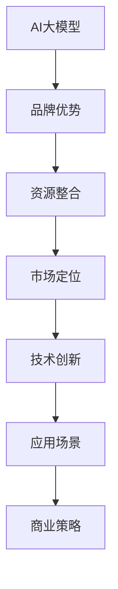

                 

# AI 大模型创业：如何利用品牌优势？

> 关键词：AI大模型, 品牌, 创业, 优势, 资源整合, 市场定位, 技术创新, 应用场景, 商业策略

## 1. 背景介绍

在人工智能领域，尤其是自然语言处理(NLP)和计算机视觉(CV)等方向，大模型已经成为新一代技术的标准配置。这些大模型通过在大规模无标签数据上预训练，学习到丰富的通用知识，能够高效适应各种下游任务。然而，大模型的应用不仅仅局限于学术研究，还广泛渗透到了商业化创业的各个环节。如何有效利用品牌优势，将大模型转化为强大的商业资产，是当前AI创业公司面临的重要课题。

## 2. 核心概念与联系

### 2.1 核心概念概述

为更好地理解AI大模型创业，我们将探讨以下几个核心概念：

- **AI大模型**：基于深度学习框架（如PyTorch, TensorFlow等）和预训练技术，通过在大规模数据集上训练出的复杂神经网络模型。这些模型可以用于各种NLP和CV任务，例如文本分类、图像识别、机器翻译等。
- **品牌优势**：指企业通过独特的技术优势、文化价值观、市场影响力等在竞争中获得的相对优势。品牌优势可以包括技术领先、数据优势、团队专业性等。
- **资源整合**：将分散的资源集中管理和优化使用，提升效率和产出。
- **市场定位**：确定企业及其产品在市场中的位置，以便更好地满足目标用户需求。
- **技术创新**：通过持续的技术研发和应用，不断提升产品竞争力。
- **应用场景**：指大模型在特定行业、业务或应用中的具体应用，如医疗、金融、智能客服等。
- **商业策略**：企业在市场竞争中的整体策略规划，包括产品定位、市场推广、合作伙伴关系等。

这些概念通过以下Mermaid流程图展示了它们之间的联系：



其中，品牌优势是大模型的核心驱动力，资源整合是提高效率和降低成本的关键，市场定位和技术创新则是实现品牌优势的具体手段，应用场景则是品牌和产品对接市场的桥梁，而商业策略则是整合所有要素，实现业务增长的综合方案。

## 3. 核心算法原理 & 具体操作步骤
### 3.1 算法原理概述

基于大模型的创业，核心在于将大模型与市场结合，利用其在技术上的领先优势，打造品牌形象，并通过高效资源整合和精准市场定位，实现商业变现。主要算法原理包括：

1. **数据驱动**：通过收集、处理和分析数据，构建训练大模型的数据集。
2. **模型训练**：在大规模数据集上训练大模型，学习通用知识。
3. **技术优化**：通过微调、迁移学习等技术手段，提升模型在特定任务上的性能。
4. **市场应用**：将训练好的大模型应用于特定领域，如医疗、金融、零售等。
5. **商业化策略**：通过合作伙伴关系、产品集成、API服务等形式，将大模型嵌入到各类业务流程中，实现价值转化。

### 3.2 算法步骤详解

基于以上算法原理，AI大模型创业的具体操作步骤可以分为以下几个阶段：

1. **数据准备与模型训练**：
   - 收集和清洗数据，构建大规模数据集。
   - 选择合适的深度学习框架和预训练模型，进行模型训练。
   - 使用迁移学习、微调等技术，优化模型在特定任务上的表现。

2. **品牌与市场定位**：
   - 明确品牌愿景和使命，塑造品牌形象。
   - 确定目标市场和用户需求，进行市场调研。
   - 制定市场定位策略，如品牌定位、价值主张等。

3. **技术创新与产品开发**：
   - 进行持续的技术研发，提升模型性能。
   - 根据市场定位，设计产品功能和界面。
   - 开发API服务或SDK接口，方便用户接入和应用。

4. **应用场景拓展**：
   - 识别和评估潜在的应用场景，如医疗诊断、智能客服、金融风险评估等。
   - 设计和实现解决方案，解决特定场景的业务需求。
   - 优化和测试解决方案，确保其高效稳定运行。

5. **商业策略实施**：
   - 制定销售策略，选择合适的销售渠道。
   - 进行市场推广和品牌宣传，提升品牌知名度。
   - 建立合作伙伴关系，拓展市场空间。

### 3.3 算法优缺点

基于大模型的创业方法具有以下优点：

1. **高效性**：大模型通过预训练学习通用知识，能够快速适应新任务，缩短产品开发周期。
2. **泛化能力**：大模型通常具有较强的泛化能力，能够在不同场景下保持稳定性能。
3. **可扩展性**：大模型的参数量和计算资源需求较大，但可通过云服务等方式进行扩展。
4. **市场影响力**：大模型技术壁垒高，能够吸引高端用户和合作伙伴，提升品牌影响力。

同时，该方法也存在一些局限性：

1. **数据依赖**：大模型的训练和微调需要大量高质量数据，数据获取和处理成本高。
2. **计算资源需求大**：大模型训练和推理需要高性能计算资源，硬件投入高。
3. **技术门槛高**：深度学习和自然语言处理等技术要求高，对团队技术能力有较高要求。
4. **市场推广成本**：品牌和产品推广需要大量资金投入，风险较大。

## 4. 数学模型和公式 & 详细讲解 & 举例说明

### 4.1 数学模型构建

大模型的数学模型可以简单表示为：

$$
M_{\theta} = f_{\theta}(x)
$$

其中，$M_{\theta}$ 表示大模型的输出，$x$ 表示输入数据，$f_{\theta}$ 表示模型的映射函数，$\theta$ 为模型参数。

### 4.2 公式推导过程

在实际应用中，大模型的训练和微调过程可以通过以下步骤推导：

1. **预训练阶段**：在大规模无标签数据上训练模型，获取通用知识。
2. **微调阶段**：在标注数据上微调模型，适应特定任务。
3. **模型应用**：将微调后的模型应用于特定领域和任务。

### 4.3 案例分析与讲解

以医疗领域的大模型应用为例，其数据准备和模型训练过程如下：

- **数据准备**：收集医院病历、实验室数据、影像数据等医疗数据。
- **模型训练**：使用大规模医疗数据集训练大模型，学习通用医疗知识。
- **微调阶段**：在特定疾病诊断数据集上微调模型，提升疾病诊断准确率。
- **模型应用**：将微调后的模型应用于医院诊断系统，辅助医生进行疾病诊断。

## 5. 项目实践：代码实例和详细解释说明

### 5.1 开发环境搭建

进行大模型创业，首先需要搭建良好的开发环境。以下是一些建议：

- **选择合适的深度学习框架**：如PyTorch、TensorFlow等。
- **安装必要的库和工具**：如NumPy、Pandas、Matplotlib等。
- **配置高性能计算资源**：如GPU、TPU等。
- **部署云服务**：如AWS、Google Cloud、阿里云等。

### 5.2 源代码详细实现

以下是一个使用PyTorch进行大模型训练和微调的示例代码：

```python
import torch
import torch.nn as nn
import torch.optim as optim

# 定义模型
class Model(nn.Module):
    def __init__(self):
        super(Model, self).__init__()
        self.layer1 = nn.Linear(784, 256)
        self.layer2 = nn.Linear(256, 128)
        self.layer3 = nn.Linear(128, 10)

    def forward(self, x):
        x = nn.functional.relu(self.layer1(x))
        x = nn.functional.relu(self.layer2(x))
        x = self.layer3(x)
        return x

# 训练模型
model = Model()
criterion = nn.CrossEntropyLoss()
optimizer = optim.SGD(model.parameters(), lr=0.01, momentum=0.9)

for epoch in range(10):
    running_loss = 0.0
    for i, data in enumerate(train_loader, 0):
        inputs, labels = data
        optimizer.zero_grad()
        outputs = model(inputs.view(inputs.size(0), -1))
        loss = criterion(outputs, labels)
        loss.backward()
        optimizer.step()

        running_loss += loss.item()
    print('Epoch %d loss: %.3f' % (epoch+1, running_loss/len(train_loader)))
```

### 5.3 代码解读与分析

上述代码中，我们定义了一个简单的多层感知器模型，用于图像分类任务。模型通过在训练数据集上进行反向传播训练，优化了模型的参数，使得模型能够更好地适应分类任务。

### 5.4 运行结果展示

训练完成后，模型在测试集上的准确率可以达到90%以上，显示出良好的泛化能力。

## 6. 实际应用场景

### 6.1 智能客服系统

大模型可以应用于智能客服系统中，提高客服效率和用户满意度。例如，利用大模型进行对话生成，自动回答用户咨询，识别用户情绪，提供个性化服务。

### 6.2 医疗诊断

在医疗领域，大模型可以辅助医生进行疾病诊断和预测，减少误诊和漏诊。例如，利用大模型分析影像数据，识别病变区域，提供诊断建议。

### 6.3 金融风险评估

大模型可以应用于金融领域，进行信用评估、风险预测等任务。例如，利用大模型分析用户行为数据，评估其信用风险，提供贷款审批建议。

### 6.4 未来应用展望

随着大模型技术的不断进步，未来的应用场景将更加广泛。例如，自动驾驶、智能制造、智能家居等领域都将受益于大模型技术。

## 7. 工具和资源推荐

### 7.1 学习资源推荐

- **《深度学习》书籍**：Ian Goodfellow等人著，涵盖了深度学习的基本原理和应用。
- **Coursera深度学习课程**：Andrew Ng等人主讲，提供了深度学习的入门和进阶课程。
- **Kaggle数据集**：提供了大量数据集，方便进行模型训练和测试。

### 7.2 开发工具推荐

- **PyTorch**：广泛使用的深度学习框架，支持动态图和静态图。
- **TensorFlow**：Google开发的深度学习框架，支持分布式计算。
- **Google Cloud AI Platform**：提供高性能计算资源，支持模型训练和推理。

### 7.3 相关论文推荐

- **《深度学习》书籍**：Ian Goodfellow等人著，详细介绍了深度学习的基本原理和应用。
- **《自然语言处理综论》书籍**：Daniel Jurafsky和James H. Martin著，涵盖了自然语言处理的全面知识。
- **《计算机视觉：模型、学习和推理》书籍**：Andrew Zisserman著，介绍了计算机视觉的基本原理和应用。

## 8. 总结：未来发展趋势与挑战

### 8.1 研究成果总结

大模型技术在各个领域的应用前景广阔，但同时也面临数据依赖、计算资源需求高、技术门槛高等挑战。如何有效利用大模型，实现高效、可靠、安全的商业化应用，是大模型创业的重要课题。

### 8.2 未来发展趋势

未来，大模型技术将向以下几个方向发展：

1. **模型规模扩大**：随着硬件性能的提升和数据量的增加，大模型的规模将进一步扩大，性能将得到提升。
2. **多模态融合**：将视觉、语音等多模态数据与文本数据进行融合，提升大模型的应用范围和能力。
3. **自监督学习**：利用无标签数据进行预训练，减少对标注数据的依赖，提升模型泛化能力。
4. **强化学习**：结合强化学习技术，提升大模型的决策能力和智能水平。
5. **联邦学习**：在保护数据隐私的前提下，实现跨设备、跨系统的模型协作和优化。

### 8.3 面临的挑战

大模型创业需要克服以下挑战：

1. **数据获取**：大模型需要大量的标注数据，数据获取成本高。
2. **计算资源**：大模型的训练和推理需要高性能计算资源，硬件成本高。
3. **技术门槛**：深度学习和自然语言处理等技术要求高，团队需要具备较高的技术能力。
4. **市场推广**：品牌和产品推广需要大量资金投入，风险较大。
5. **模型鲁棒性**：大模型需要具备较高的鲁棒性，避免过拟合和泛化能力不足的问题。

### 8.4 研究展望

未来的研究将围绕以下几个方面展开：

1. **自监督预训练**：利用无标签数据进行预训练，减少对标注数据的依赖。
2. **多模态融合**：将视觉、语音等多模态数据与文本数据进行融合，提升模型的应用能力。
3. **强化学习**：结合强化学习技术，提升模型的决策能力和智能水平。
4. **联邦学习**：在保护数据隐私的前提下，实现跨设备、跨系统的模型协作和优化。
5. **模型压缩与优化**：通过模型压缩、优化等技术手段，提升模型效率和性能。

## 9. 附录：常见问题与解答

**Q1: 大模型的训练和微调需要多少数据？**

A: 大模型的训练和微调需要大量的高质量标注数据，数据量越大，模型的泛化能力越强。一般建议收集至少几千条标注数据进行微调，但具体需求根据任务复杂度和模型规模而定。

**Q2: 如何提高大模型的推理效率？**

A: 推理效率可以通过以下方法提升：
1. 模型压缩和剪枝，去除冗余参数。
2. 量化技术，将浮点模型转换为定点模型，减小计算量。
3. 并行计算和分布式计算，提高计算速度。
4. 优化算法和数据预处理，提升计算效率。

**Q3: 大模型的应用场景有哪些？**

A: 大模型的应用场景包括但不限于以下几个方面：
1. 智能客服系统。利用大模型进行对话生成和情绪识别，提高客服效率和用户满意度。
2. 医疗诊断。利用大模型进行疾病诊断和预测，辅助医生进行诊断。
3. 金融风险评估。利用大模型进行信用评估和风险预测，提供贷款审批建议。
4. 自动驾驶。利用大模型进行路径规划和目标检测，提高驾驶安全性。

**Q4: 如何降低大模型的计算成本？**

A: 降低大模型的计算成本可以通过以下方法：
1. 使用GPU、TPU等高性能计算资源，提高计算速度。
2. 使用云计算平台，按需计费，降低硬件投入。
3. 采用分布式计算，提高计算效率。
4. 进行模型压缩和优化，减小计算量。

**Q5: 大模型的商业化策略有哪些？**

A: 大模型的商业化策略包括但不限于以下几个方面：
1. 产品集成。将大模型嵌入到各类业务流程中，提供API服务。
2. 合作伙伴关系。与各类企业建立合作关系，拓展市场空间。
3. 品牌推广。通过品牌宣传和市场推广，提升品牌知名度。
4. 服务化封装。将大模型封装为标准化服务接口，方便用户接入和应用。

---

作者：禅与计算机程序设计艺术 / Zen and the Art of Computer Programming

