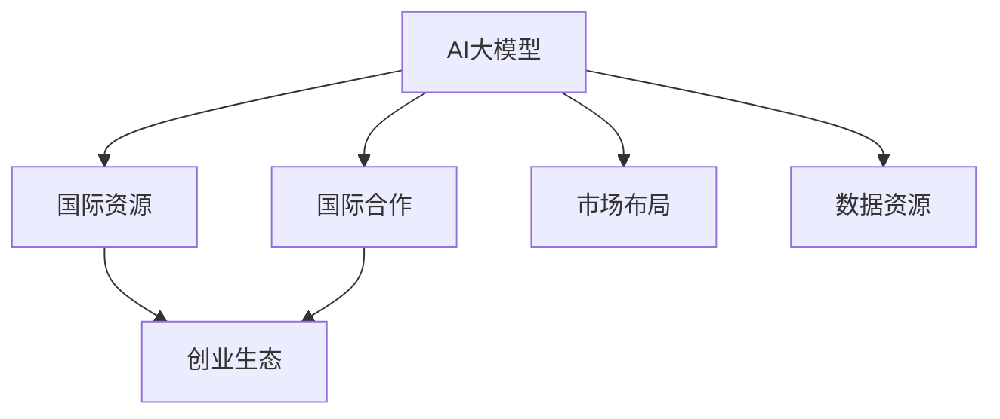

                 

# AI 大模型创业：如何利用国际优势？

在当今全球化的大背景下，AI大模型创业已经成为了一个充满潜力的领域。通过充分利用国际优势，如资本、技术、人才和市场资源，创业者可以显著提升其创业的成功率和影响力。本文将从多个角度深入探讨如何利用国际优势，构建一个高效、可持续的AI大模型创业生态。

## 1. 背景介绍

### 1.1 问题由来
随着人工智能技术的飞速发展，AI大模型在自然语言处理、计算机视觉、自动驾驶等多个领域展现出强大的应用潜力。然而，大模型研发和应用不仅需要巨额资金投入，还需依赖深厚的技术积累和丰富的数据资源。如何最大化利用国际资源，打造高效且具有全球竞争力的AI大模型创业项目，已成为全球创业者面临的重要课题。

### 1.2 问题核心关键点
AI大模型创业的核心在于如何高效地利用全球资源，构建一个具有全球竞争力的生态系统。这包括：

1. **资本获取**：如何吸引国际风险投资和政府资金，确保充足的资金支持。
2. **技术合作**：如何与国际顶尖科研机构和企业合作，获取最前沿的技术资源。
3. **人才汇聚**：如何吸引全球顶级AI人才，建立强大的研发团队。
4. **市场拓展**：如何通过全球市场布局，提升产品的影响力和市场份额。
5. **数据获取**：如何获取和利用全球数据资源，提升模型的泛化能力和性能。

### 1.3 问题研究意义
在全球化的背景下，AI大模型创业不仅能够促进技术创新，还能推动经济发展，提升国际竞争力。通过充分利用国际优势，可以实现技术突破、加速市场化应用，从而在全球范围内产生深远的影响。

## 2. 核心概念与联系

### 2.1 核心概念概述

为更好地理解如何利用国际优势进行AI大模型创业，本节将介绍几个密切相关的核心概念：

- **AI大模型**：指基于大规模数据和深度学习技术，具备强大学习能力和泛化能力的人工智能模型，如BERT、GPT等。
- **国际资源**：指全球范围内的资金、技术、人才和数据等资源。
- **创业生态**：指围绕AI大模型创业项目，由企业、研究机构、投资者、政府和用户等共同组成的生态环境。
- **国际合作**：指跨越国界，通过合作、交流和共享资源的方式，推动AI大模型发展的模式。
- **市场布局**：指在全球不同区域，建立和扩展AI大模型产品应用的策略和步骤。
- **数据资源**：指用于训练AI大模型的海量数据集，包括结构化数据、非结构化数据等。

这些核心概念之间的逻辑关系可以通过以下Mermaid流程图来展示：



这个流程图展示了大模型创业与国际资源、创业生态、国际合作、市场布局和数据资源之间的联系。

## 3. 核心算法原理 & 具体操作步骤

### 3.1 算法原理概述

AI大模型创业的算法原理主要围绕以下几个关键点展开：

- **模型选择**：选择合适的AI大模型作为创业项目的核心，如BERT、GPT等。
- **资源整合**：充分利用国际资源，包括资本、技术、人才和数据，构建高效生态。
- **合作策略**：制定国际合作策略，通过与全球顶尖科研机构和企业合作，获取最前沿的技术和资源。
- **市场扩展**：采用全球市场布局策略，拓展产品应用范围，提升国际市场份额。
- **数据利用**：获取和利用全球数据资源，提升模型的泛化能力和性能。

### 3.2 算法步骤详解

基于上述算法原理，AI大模型创业的主要步骤包括：

**Step 1: 准备国际资源**
- 选择合适的国际风险投资和政府资金渠道，如Silicon Valley的VC、欧盟的Horizon Europe等。
- 确定目标国家的技术合作战略，如与MIT、ETH等知名大学合作。
- 制定人才招聘计划，吸引全球顶级AI人才，如Google Brain、Microsoft Research等研究机构。

**Step 2: 选择合适的模型**
- 通过评估现有AI大模型的优缺点，选择合适的模型作为创业项目的基础。
- 考虑模型的性能、可解释性、计算效率等因素，进行综合考量。

**Step 3: 建立国际合作网络**
- 与全球顶尖科研机构和企业建立合作关系，获取最新研究成果和技术资源。
- 加入国际学术组织和产业联盟，如ACM、IEEE等，提升企业国际影响力。

**Step 4: 全球市场布局**
- 确定全球市场拓展策略，选择合适的国际市场，如北美、欧洲、亚太等。
- 开展市场调研，了解目标市场的用户需求和文化差异。
- 制定产品本地化策略，适应不同市场的文化和技术水平。

**Step 5: 数据资源获取**
- 通过与国际数据供应商合作，获取高质量的数据资源。
- 利用网络爬虫等技术手段，获取非结构化数据。
- 保护用户隐私和数据安全，遵守国际数据保护法规。

**Step 6: 持续迭代优化**
- 定期收集用户反馈，迭代优化AI大模型和产品功能。
- 参与国际学术会议和技术交流，保持技术领先地位。

### 3.3 算法优缺点

**优点**：
- 充分利用全球资源，提升模型的性能和创业项目的成功率。
- 通过国际合作，获取最新技术和研究成果，保持技术领先地位。
- 拓展全球市场，提升产品的影响力和市场份额。

**缺点**：
- 国际合作和市场扩展面临文化和法律差异，需要投入大量时间和资源进行适应。
- 数据获取和处理需要遵守国际数据保护法规，存在合规风险。
- 不同市场的用户需求和文化差异，增加了产品本地化的复杂性。

### 3.4 算法应用领域

AI大模型创业在多个领域都有广泛的应用，包括：

- **自然语言处理**：如问答系统、情感分析、机器翻译等。
- **计算机视觉**：如图像识别、目标检测、图像生成等。
- **自动驾驶**：如环境感知、决策规划等。
- **金融科技**：如智能投顾、风险管理等。
- **医疗健康**：如疾病预测、医疗影像分析等。

这些领域不仅具有巨大的市场需求，也有广阔的国际合作空间。通过充分利用国际优势，可以在这些领域实现突破，推动AI技术的应用和发展。

## 4. 数学模型和公式 & 详细讲解 & 举例说明（备注：数学公式请使用latex格式，latex嵌入文中独立段落使用 $$，段落内使用 $)
### 4.1 数学模型构建

在AI大模型创业过程中，数学模型和公式主要用于评估模型的性能和优化模型的参数。以下是一个简单的二分类模型的数学模型构建过程：

假设模型 $M_{\theta}$ 在输入 $x$ 上的输出为 $\hat{y}=M_{\theta}(x) \in [0,1]$，表示样本属于正类的概率。真实标签 $y \in \{0,1\}$。则二分类交叉熵损失函数定义为：

$$
\ell(M_{\theta}(x),y) = -[y\log \hat{y} + (1-y)\log (1-\hat{y})]
$$

其中，$\log$ 表示自然对数。在模型的训练过程中，我们使用反向传播算法，计算损失函数的梯度，并使用优化算法（如Adam、SGD等）更新模型参数 $\theta$。

### 4.2 公式推导过程

以二分类模型为例，我们推导其梯度计算公式。假设模型 $M_{\theta}$ 在输入 $x$ 上的输出为 $\hat{y}=M_{\theta}(x) \in [0,1]$，则损失函数为：

$$
\mathcal{L}(\theta) = -\frac{1}{N}\sum_{i=1}^N [y_i\log M_{\theta}(x_i)+(1-y_i)\log(1-M_{\theta}(x_i))]
$$

其中，$N$ 表示样本数量。根据链式法则，损失函数对参数 $\theta_k$ 的梯度为：

$$
\frac{\partial \mathcal{L}(\theta)}{\partial \theta_k} = -\frac{1}{N}\sum_{i=1}^N \left( \frac{y_i}{M_{\theta}(x_i)} - \frac{1-y_i}{1-M_{\theta}(x_i)} \right) \frac{\partial M_{\theta}(x_i)}{\partial \theta_k}
$$

其中，$\frac{\partial M_{\theta}(x_i)}{\partial \theta_k}$ 表示模型在输入 $x_i$ 上的输出对参数 $\theta_k$ 的导数。

### 4.3 案例分析与讲解

以自然语言处理中的情感分析为例，我们通过使用BERT模型进行情感分类任务的微调，展示模型的性能评估和参数优化过程。

首先，收集包含正面和负面情感的标注数据集，将数据集划分为训练集、验证集和测试集。然后，使用BERT模型作为预训练模型，进行情感分类任务的微调。在微调过程中，使用交叉熵损失函数，并使用Adam优化算法进行参数优化。最后，通过在测试集上的评估，展示模型的性能提升。

## 5. 项目实践：代码实例和详细解释说明
### 5.1 开发环境搭建

在AI大模型创业项目中，开发环境的搭建至关重要。以下是使用Python和PyTorch进行项目开发的常见步骤：

1. 安装Anaconda：从官网下载并安装Anaconda，用于创建独立的Python环境。
2. 创建并激活虚拟环境：
```bash
conda create -n pytorch-env python=3.8 
conda activate pytorch-env
```

3. 安装PyTorch：根据CUDA版本，从官网获取对应的安装命令。例如：
```bash
conda install pytorch torchvision torchaudio cudatoolkit=11.1 -c pytorch -c conda-forge
```

4. 安装Transformers库：
```bash
pip install transformers
```

5. 安装各类工具包：
```bash
pip install numpy pandas scikit-learn matplotlib tqdm jupyter notebook ipython
```

完成上述步骤后，即可在`pytorch-env`环境中开始项目开发。

### 5.2 源代码详细实现

以下是一个使用BERT模型进行情感分类任务微调的PyTorch代码实现：

```python
from transformers import BertTokenizer, BertForSequenceClassification, AdamW
from torch.utils.data import Dataset, DataLoader
from sklearn.metrics import accuracy_score, precision_score, recall_score, f1_score
import torch.nn.functional as F

# 加载数据集
train_dataset = ...
dev_dataset = ...
test_dataset = ...

# 定义tokenizer和模型
tokenizer = BertTokenizer.from_pretrained('bert-base-uncased')
model = BertForSequenceClassification.from_pretrained('bert-base-uncased', num_labels=2)

# 定义训练函数
def train_epoch(model, dataset, batch_size, optimizer):
    model.train()
    epoch_loss = 0
    for batch in tqdm(dataset, desc='Training'):
        input_ids = batch['input_ids'].to(device)
        attention_mask = batch['attention_mask'].to(device)
        labels = batch['labels'].to(device)
        model.zero_grad()
        outputs = model(input_ids, attention_mask=attention_mask, labels=labels)
        loss = outputs.loss
        epoch_loss += loss.item()
        loss.backward()
        optimizer.step()
    return epoch_loss / len(dataset)

# 定义评估函数
def evaluate(model, dataset, batch_size):
    model.eval()
    preds, labels = [], []
    with torch.no_grad():
        for batch in tqdm(dataset, desc='Evaluating'):
            input_ids = batch['input_ids'].to(device)
            attention_mask = batch['attention_mask'].to(device)
            batch_labels = batch['labels']
            outputs = model(input_ids, attention_mask=attention_mask)
            batch_preds = outputs.logits.argmax(dim=1).to('cpu').tolist()
            batch_labels = batch_labels.to('cpu').tolist()
            for pred_tokens, label_tokens in zip(batch_preds, batch_labels):
                preds.append(pred_tokens[:len(label_tokens)])
                labels.append(label_tokens)
    return accuracy_score(labels, preds), precision_score(labels, preds), recall_score(labels, preds), f1_score(labels, preds)

# 训练和评估模型
device = torch.device('cuda') if torch.cuda.is_available() else torch.device('cpu')
model.to(device)

epochs = 5
batch_size = 16

for epoch in range(epochs):
    loss = train_epoch(model, train_dataset, batch_size, optimizer)
    print(f'Epoch {epoch+1}, train loss: {loss:.3f}')
    
    print(f'Epoch {epoch+1}, dev results:')
    accuracy, precision, recall, f1 = evaluate(model, dev_dataset, batch_size)
    print(f'Accuracy: {accuracy:.2f}, Precision: {precision:.2f}, Recall: {recall:.2f}, F1-Score: {f1:.2f}')

print('Test results:')
accuracy, precision, recall, f1 = evaluate(model, test_dataset, batch_size)
print(f'Accuracy: {accuracy:.2f}, Precision: {precision:.2f}, Recall: {recall:.2f}, F1-Score: {f1:.2f}')
```

### 5.3 代码解读与分析

让我们再详细解读一下关键代码的实现细节：

**train_epoch函数**：
- 设置模型为训练模式。
- 计算每个批次的损失函数，并累加到epoch损失中。
- 反向传播更新模型参数，并返回epoch平均损失。

**evaluate函数**：
- 设置模型为评估模式。
- 将每个批次的预测结果和标签存储到列表中。
- 使用sklearn的评估函数计算模型的性能指标，并返回这些指标。

**训练流程**：
- 循环进行多次epoch训练。
- 在每个epoch内，先训练模型，输出epoch平均损失。
- 在验证集上评估模型，输出性能指标。
- 在测试集上评估模型，输出最终结果。

**项目实践**：
通过上述代码实现，展示了如何利用BERT模型进行情感分类任务的微调。在实际项目中，开发者可以根据具体任务和数据集，调整模型架构、损失函数和优化算法等，以达到更好的性能。

## 6. 实际应用场景
### 6.1 智能客服系统

基于AI大模型微调的对话技术，可以广泛应用于智能客服系统的构建。传统客服往往需要配备大量人力，高峰期响应缓慢，且一致性和专业性难以保证。而使用微调后的对话模型，可以7x24小时不间断服务，快速响应客户咨询，用自然流畅的语言解答各类常见问题。

在技术实现上，可以收集企业内部的历史客服对话记录，将问题和最佳答复构建成监督数据，在此基础上对预训练对话模型进行微调。微调后的对话模型能够自动理解用户意图，匹配最合适的答案模板进行回复。对于客户提出的新问题，还可以接入检索系统实时搜索相关内容，动态组织生成回答。如此构建的智能客服系统，能大幅提升客户咨询体验和问题解决效率。

### 6.2 金融舆情监测

金融机构需要实时监测市场舆论动向，以便及时应对负面信息传播，规避金融风险。传统的人工监测方式成本高、效率低，难以应对网络时代海量信息爆发的挑战。基于AI大模型微调的文本分类和情感分析技术，为金融舆情监测提供了新的解决方案。

具体而言，可以收集金融领域相关的新闻、报道、评论等文本数据，并对其进行主题标注和情感标注。在此基础上对预训练语言模型进行微调，使其能够自动判断文本属于何种主题，情感倾向是正面、中性还是负面。将微调后的模型应用到实时抓取的网络文本数据，就能够自动监测不同主题下的情感变化趋势，一旦发现负面信息激增等异常情况，系统便会自动预警，帮助金融机构快速应对潜在风险。

### 6.3 个性化推荐系统

当前的推荐系统往往只依赖用户的历史行为数据进行物品推荐，无法深入理解用户的真实兴趣偏好。基于AI大模型微调技术，个性化推荐系统可以更好地挖掘用户行为背后的语义信息，从而提供更精准、多样的推荐内容。

在实践中，可以收集用户浏览、点击、评论、分享等行为数据，提取和用户交互的物品标题、描述、标签等文本内容。将文本内容作为模型输入，用户的后续行为（如是否点击、购买等）作为监督信号，在此基础上微调预训练语言模型。微调后的模型能够从文本内容中准确把握用户的兴趣点。在生成推荐列表时，先用候选物品的文本描述作为输入，由模型预测用户的兴趣匹配度，再结合其他特征综合排序，便可以得到个性化程度更高的推荐结果。

### 6.4 未来应用展望

随着AI大模型微调技术的发展，其应用场景将更加广泛和深入。未来，AI大模型创业项目可以在更多领域发挥其优势，推动技术进步和社会变革。

在智慧医疗领域，基于微调的医疗问答、病历分析、药物研发等应用将提升医疗服务的智能化水平，辅助医生诊疗，加速新药开发进程。

在智能教育领域，微调技术可应用于作业批改、学情分析、知识推荐等方面，因材施教，促进教育公平，提高教学质量。

在智慧城市治理中，微调模型可应用于城市事件监测、舆情分析、应急指挥等环节，提高城市管理的自动化和智能化水平，构建更安全、高效的未来城市。

此外，在企业生产、社会治理、文娱传媒等众多领域，基于大模型微调的人工智能应用也将不断涌现，为经济社会发展注入新的动力。相信随着技术的日益成熟，微调方法将成为人工智能落地应用的重要范式，推动人工智能技术在垂直行业的规模化落地。

## 7. 工具和资源推荐
### 7.1 学习资源推荐

为了帮助开发者系统掌握AI大模型微调的理论基础和实践技巧，这里推荐一些优质的学习资源：

1. 《Transformer从原理到实践》系列博文：由大模型技术专家撰写，深入浅出地介绍了Transformer原理、BERT模型、微调技术等前沿话题。

2. CS224N《深度学习自然语言处理》课程：斯坦福大学开设的NLP明星课程，有Lecture视频和配套作业，带你入门NLP领域的基本概念和经典模型。

3. 《Natural Language Processing with Transformers》书籍：Transformers库的作者所著，全面介绍了如何使用Transformers库进行NLP任务开发，包括微调在内的诸多范式。

4. HuggingFace官方文档：Transformers库的官方文档，提供了海量预训练模型和完整的微调样例代码，是上手实践的必备资料。

5. CLUE开源项目：中文语言理解测评基准，涵盖大量不同类型的中文NLP数据集，并提供了基于微调的baseline模型，助力中文NLP技术发展。

通过对这些资源的学习实践，相信你一定能够快速掌握AI大模型微调的精髓，并用于解决实际的NLP问题。

### 7.2 开发工具推荐

高效的开发离不开优秀的工具支持。以下是几款用于AI大模型微调开发的常用工具：

1. PyTorch：基于Python的开源深度学习框架，灵活动态的计算图，适合快速迭代研究。大部分预训练语言模型都有PyTorch版本的实现。

2. TensorFlow：由Google主导开发的开源深度学习框架，生产部署方便，适合大规模工程应用。同样有丰富的预训练语言模型资源。

3. Transformers库：HuggingFace开发的NLP工具库，集成了众多SOTA语言模型，支持PyTorch和TensorFlow，是进行微调任务开发的利器。

4. Weights & Biases：模型训练的实验跟踪工具，可以记录和可视化模型训练过程中的各项指标，方便对比和调优。与主流深度学习框架无缝集成。

5. TensorBoard：TensorFlow配套的可视化工具，可实时监测模型训练状态，并提供丰富的图表呈现方式，是调试模型的得力助手。

6. Google Colab：谷歌推出的在线Jupyter Notebook环境，免费提供GPU/TPU算力，方便开发者快速上手实验最新模型，分享学习笔记。

合理利用这些工具，可以显著提升AI大模型微调任务的开发效率，加快创新迭代的步伐。

### 7.3 相关论文推荐

AI大模型微调技术的发展源于学界的持续研究。以下是几篇奠基性的相关论文，推荐阅读：

1. Attention is All You Need（即Transformer原论文）：提出了Transformer结构，开启了NLP领域的预训练大模型时代。

2. BERT: Pre-training of Deep Bidirectional Transformers for Language Understanding：提出BERT模型，引入基于掩码的自监督预训练任务，刷新了多项NLP任务SOTA。

3. Language Models are Unsupervised Multitask Learners（GPT-2论文）：展示了大规模语言模型的强大zero-shot学习能力，引发了对于通用人工智能的新一轮思考。

4. Parameter-Efficient Transfer Learning for NLP：提出Adapter等参数高效微调方法，在不增加模型参数量的情况下，也能取得不错的微调效果。

5. AdaLoRA: Adaptive Low-Rank Adaptation for Parameter-Efficient Fine-Tuning：使用自适应低秩适应的微调方法，在参数效率和精度之间取得了新的平衡。

这些论文代表了大语言模型微调技术的发展脉络。通过学习这些前沿成果，可以帮助研究者把握学科前进方向，激发更多的创新灵感。

## 8. 总结：未来发展趋势与挑战

### 8.1 总结

本文对AI大模型创业的国际优势进行了全面系统的介绍。首先阐述了AI大模型创业的国际优势，明确了国际资源和合作在创业项目中的重要性。其次，从原理到实践，详细讲解了AI大模型创业的算法原理和操作步骤，给出了项目开发的完整代码实例。同时，本文还广泛探讨了AI大模型微调方法在多个领域的应用前景，展示了微调范式的巨大潜力。此外，本文精选了AI大模型微调的相关学习资源、开发工具和论文推荐，力求为开发者提供全方位的技术指引。

通过本文的系统梳理，可以看到，AI大模型创业不仅需要技术创新，还需要充分利用国际资源，构建高效、可持续的创业生态。在未来的发展过程中，AI大模型创业者需要不断优化国际资源配置，提升技术合作效率，拓展市场布局，加强数据利用，才能在激烈的国际竞争中占据优势。

### 8.2 未来发展趋势

展望未来，AI大模型创业将呈现以下几个发展趋势：

1. **技术融合**：未来的AI大模型创业项目将更加注重技术融合，引入知识图谱、因果推理、强化学习等技术，提升模型的综合能力。
2. **数据开放**：更多的国际组织和企业将开放数据资源，形成数据共享机制，推动AI大模型技术的发展。
3. **应用创新**：AI大模型创业项目将拓展到更多领域，如智慧医疗、智慧教育、智慧城市等，推动技术创新和社会进步。
4. **伦理考量**：在AI大模型创业过程中，将更加注重伦理和法律问题，确保技术应用的合法性和安全性。

这些趋势凸显了AI大模型创业的广阔前景和重要意义。通过不断创新和优化，AI大模型创业项目必将在全球范围内产生深远的影响。

### 8.3 面临的挑战

尽管AI大模型创业前景广阔，但在实现过程中仍面临诸多挑战：

1. **国际竞争**：AI大模型创业项目面临全球范围内的激烈竞争，需要不断提升技术创新能力和资源整合效率。
2. **市场拓展**：不同市场的文化和法律差异，增加了AI大模型创业的复杂性和不确定性。
3. **数据获取**：获取和利用全球数据资源需要遵循国际数据保护法规，存在合规风险。
4. **技术迭代**：AI大模型技术快速发展，需要持续学习和创新，以保持技术领先地位。
5. **伦理道德**：AI大模型应用过程中可能面临伦理道德问题，需要在技术开发和应用过程中加强伦理约束。

这些挑战需要AI大模型创业者积极应对，通过技术创新、市场拓展、资源整合、数据利用、伦理约束等手段，确保项目的成功和可持续发展。

### 8.4 研究展望

未来的研究需要在以下几个方面寻求新的突破：

1. **跨模态融合**：将视觉、语音、文本等多模态数据进行融合，提升AI大模型的综合能力。
2. **因果推理**：引入因果推理技术，增强AI大模型在复杂场景下的决策能力。
3. **知识图谱**：将知识图谱与AI大模型进行融合，提升模型的知识表示和推理能力。
4. **持续学习**：实现AI大模型的持续学习和自适应能力，确保模型在动态环境中的性能。
5. **公平性**：加强AI大模型在公平性、透明性、可解释性等方面的研究，确保技术应用的公正性和可信度。

这些研究方向的探索，必将引领AI大模型创业技术的进步，推动人工智能技术在全球范围内的普及和应用。

## 9. 附录：常见问题与解答

**Q1：AI大模型创业是否适合初创团队？**

A: 初创团队可以通过充分利用国际资源和合作机会，加速技术突破和市场布局，实现快速成长。但需要注意的是，AI大模型创业需要较大的资金投入和技术积累，初创团队需要在自身能力和资源方面进行充分评估。

**Q2：AI大模型创业需要哪些核心技术？**

A: AI大模型创业需要掌握以下核心技术：
1. 深度学习框架（如PyTorch、TensorFlow等）。
2. 预训练语言模型（如BERT、GPT等）。
3. 微调算法（如Adapter、LoRA等）。
4. 数据处理与标注技术。
5. 技术合作与国际资源整合。

**Q3：AI大模型创业的资金来源有哪些？**

A: AI大模型创业的资金来源包括：
1. 国际风险投资（如Silicon Valley的VC等）。
2. 政府基金（如欧盟的Horizon Europe等）。
3. 企业合作与技术授权。
4. 众筹平台（如Kickstarter等）。

**Q4：AI大模型创业如何实现技术突破？**

A: AI大模型创业需要不断进行技术创新和优化，主要手段包括：
1. 引入前沿技术（如知识图谱、因果推理等）。
2. 加入国际学术组织和产业联盟，获取最新研究成果。
3. 持续学习和迭代，保持技术领先地位。

**Q5：AI大模型创业的国际合作策略有哪些？**

A: AI大模型创业的国际合作策略包括：
1. 与国际顶尖科研机构合作，获取最新研究成果。
2. 加入国际学术组织和产业联盟，提升企业国际影响力。
3. 与其他企业合作，形成联合开发和市场拓展的生态系统。

通过充分利用国际优势，AI大模型创业项目将能够在全球范围内实现技术突破和市场布局，推动人工智能技术的发展与应用。相信在未来，AI大模型创业将为全球经济社会发展带来深远的影响。

---

作者：禅与计算机程序设计艺术 / Zen and the Art of Computer Programming

