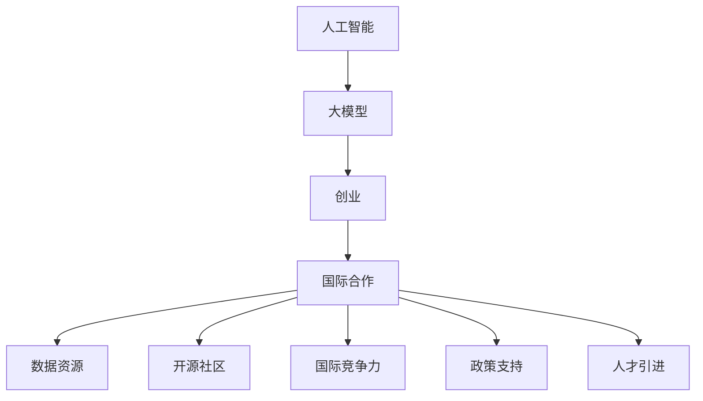

                 

# AI 大模型创业：如何利用国际优势？

> 关键词：人工智能,大模型,创业,国际合作,数据资源,开源社区,国际竞争力

## 1. 背景介绍

### 1.1 问题由来

近年来，人工智能（AI）技术迅速发展，特别是深度学习和大模型在自然语言处理（NLP）、计算机视觉（CV）、语音识别等领域的突破，推动了AI技术在各行各业的应用和落地。然而，全球AI创业环境复杂多变，各国在技术、市场、政策、人才等方面存在显著差异。因此，如何利用国际优势，提升AI大模型创业企业的竞争力，成为业内人士关注的焦点。

### 1.2 问题核心关键点

在AI大模型创业领域，利用国际优势主要体现在以下几个方面：

- **数据资源**：通过跨国合作和共享，获取更多、更优质的数据资源。
- **开源社区**：参与全球知名的开源社区，借助社区的力量提升技术实力。
- **国际竞争力**：在国际市场中寻找合作机会，提升企业在全球范围内的影响力。
- **政策支持**：利用各国政府对AI创新的支持政策，获取更多资源和资金。
- **人才引进**：通过跨国招聘和人才引进，构建国际化团队。

## 2. 核心概念与联系

### 2.1 核心概念概述

为更好地理解如何利用国际优势进行AI大模型创业，本节将介绍几个关键概念及其之间的联系：

- **人工智能（AI）**：涵盖机器学习、深度学习、自然语言处理、计算机视觉等多个领域的综合性技术。
- **大模型（Large Model）**：指具有大规模参数和复杂结构的深度学习模型，如BERT、GPT等。
- **创业**：指以获取商业价值为目标，创新产品和服务，并进行市场化运营的过程。
- **国际合作**：指在全球范围内，通过跨界合作和资源共享，提升企业的创新能力和市场竞争力。
- **数据资源**：指用于模型训练和验证的数据集，包括结构化数据、非结构化数据等。
- **开源社区**：指一群志同道合的技术爱好者，围绕特定的开源项目或技术主题，进行协作开发和共享。
- **国际竞争力**：指企业在全球市场中的综合竞争力，包括技术实力、市场占有率、品牌影响力等。
- **政策支持**：指各国政府对AI创新的政策支持和资金投入。
- **人才引进**：指企业通过跨国招聘等方式，引进高水平的技术和管理人才。

这些核心概念之间的逻辑关系可以通过以下Mermaid流程图来展示：



这个流程图展示了大模型创业的各个关键环节及其相互关系：

1. 大模型在人工智能框架下进行设计和训练。
2. 创业过程涉及多方面的资源整合和产品化。
3. 通过国际合作获取更多数据和开源资源。
4. 提升企业在国际市场的竞争力。
5. 利用政府政策支持，获取更多资源。
6. 通过人才引进提升企业技术实力。

## 3. 核心算法原理 & 具体操作步骤
### 3.1 算法原理概述

利用国际优势进行AI大模型创业，其核心思想是通过跨国合作、数据共享、技术协同等方式，最大化利用全球资源和市场，加速模型的训练和优化，提升企业的技术实力和市场竞争力。

形式化地，假设企业在本地和国际上拥有的数据资源分别为 $D_{\text{local}}$ 和 $D_{\text{international}}$，对应的模型为 $M_{\text{local}}$ 和 $M_{\text{international}}$，则整合后的模型 $M_{\text{combined}}$ 可以通过以下步骤计算：

1. 融合本地和国际数据，得到联合数据集 $D_{\text{combined}}$。
2. 使用联合数据集对 $M_{\text{local}}$ 和 $M_{\text{international}}$ 进行微调，得到微调后的模型 $M_{\text{combined}}$。
3. 在本地和国际市场同时部署 $M_{\text{combined}}$，获取最大市场份额。

### 3.2 算法步骤详解

利用国际优势进行AI大模型创业的一般步骤如下：

**Step 1: 准备数据和资源**

- 收集和整理本地和国际上可用的数据资源 $D_{\text{local}}$ 和 $D_{\text{international}}$。
- 选择合适的国际合作伙伴，建立数据共享和合作机制。
- 参与全球知名的开源社区，获取开源代码和社区资源。
- 了解各国AI创业政策和支持措施，获取资金和政策支持。

**Step 2: 设计模型和算法**

- 根据业务需求，选择合适的大模型架构（如BERT、GPT等）进行定制化设计。
- 选择合适的优化算法（如Adam、SGD等），设计适当的超参数（如学习率、批大小等）。
- 在本地和国际数据集上进行预训练和微调，得到联合模型 $M_{\text{combined}}$。

**Step 3: 实施和部署**

- 在本地和国际市场同时部署 $M_{\text{combined}}$，实现全球覆盖。
- 利用国际化的销售和营销渠道，推广产品和服务。
- 通过人才引进和技术合作，持续提升技术实力和市场竞争力。

**Step 4: 持续优化和升级**

- 根据用户反馈和市场变化，持续优化模型 $M_{\text{combined}}$。
- 参与国际竞赛和会议，提升品牌影响力和技术影响力。
- 利用最新研究成果，不断升级模型，保持技术领先地位。

### 3.3 算法优缺点

利用国际优势进行AI大模型创业，具有以下优点：

1. **资源丰富**：通过跨国合作和数据共享，获取更多数据资源和开源社区支持。
2. **技术协同**：通过参与国际合作和竞赛，提升技术实力，加速模型训练和优化。
3. **市场拓展**：通过本地和国际市场的协同运营，最大化市场份额和影响力。
4. **政策支持**：利用各国政府对AI创新的支持政策，获取更多资源和资金。
5. **人才汇聚**：通过跨国招聘和人才引进，构建国际化团队，提升企业竞争力。

同时，该方法也存在一些局限性：

1. **数据隐私和安全**：跨国数据共享可能涉及数据隐私和安全问题，需要严格的数据保护措施。
2. **文化差异**：不同国家和地区的文化差异可能影响产品和服务的推广和接受度。
3. **政策差异**：各国政策差异可能带来运营风险，需要灵活应对。
4. **管理复杂性**：跨国运营涉及多地区、多语言、多文化，管理复杂性增加。

尽管存在这些局限性，但利用国际优势进行AI大模型创业仍然是一种高效、可行的方法，值得进一步探索和实践。

### 3.4 算法应用领域

利用国际优势进行AI大模型创业，已经在多个领域得到广泛应用：

- **金融科技**：通过跨国合作获取更多金融数据，提升模型预测准确率，为银行、保险公司等提供金融解决方案。
- **医疗健康**：参与国际医疗健康项目，获取全球医疗数据，提升疾病预测和诊断准确性。
- **智慧城市**：通过跨国合作获取城市数据，提升智慧城市管理和决策能力。
- **电子商务**：利用全球市场数据，提升电商平台的个性化推荐和用户体验。
- **物流运输**：通过跨国合作获取物流数据，优化运输路线和配送策略。

除了这些典型应用外，AI大模型创业还拓展到了更多新兴领域，如自动驾驶、智能制造、环境保护等，为全球经济和社会发展带来了新的动力。

## 4. 数学模型和公式 & 详细讲解 & 举例说明

### 4.1 数学模型构建

假设本地和国际上的数据资源分别为 $D_{\text{local}}=\{x_1, x_2, \dots, x_m\}$ 和 $D_{\text{international}}=\{y_1, y_2, \dots, y_n\}$，其中 $x_i$ 和 $y_j$ 为样本向量。联合数据集 $D_{\text{combined}}=\{x_1, x_2, \dots, x_m, y_1, y_2, \dots, y_n\}$。

定义本地模型 $M_{\text{local}}: \mathcal{X} \rightarrow \mathcal{Y}$，国际模型 $M_{\text{international}}: \mathcal{X} \rightarrow \mathcal{Y}$，联合模型 $M_{\text{combined}}: \mathcal{X} \rightarrow \mathcal{Y}$。

联合模型的训练目标为：

$$
\min_{\theta} \frac{1}{|D_{\text{combined}}|} \sum_{(x_i, y_i) \in D_{\text{combined}}} \ell(M_{\text{combined}}(x_i), y_i)
$$

其中，$\ell$ 为损失函数，通常使用交叉熵损失函数：

$$
\ell(M_{\text{combined}}(x_i), y_i) = -\log M_{\text{combined}}(x_i)_{y_i}
$$

### 4.2 公式推导过程

根据联合数据集 $D_{\text{combined}}$，联合模型的预测输出为：

$$
\hat{y}_i = M_{\text{combined}}(x_i)
$$

联合模型的预测损失为：

$$
\mathcal{L}(\theta) = \frac{1}{|D_{\text{combined}}|} \sum_{(x_i, y_i) \in D_{\text{combined}}} \ell(M_{\text{combined}}(x_i), y_i)
$$

将损失函数对参数 $\theta$ 求导，得到梯度：

$$
\nabla_{\theta} \mathcal{L}(\theta) = \frac{1}{|D_{\text{combined}}|} \sum_{(x_i, y_i) \in D_{\text{combined}}} \frac{\partial \ell(M_{\text{combined}}(x_i), y_i)}{\partial \theta}
$$

利用链式法则，得到梯度更新公式：

$$
\theta \leftarrow \theta - \eta \nabla_{\theta} \mathcal{L}(\theta)
$$

其中 $\eta$ 为学习率。

### 4.3 案例分析与讲解

假设本地和国际上分别有2000条医疗数据，用于训练本地模型 $M_{\text{local}}$ 和国际模型 $M_{\text{international}}$。通过数据共享和联合训练，得到联合模型 $M_{\text{combined}}$。

在本地和国际数据集上分别进行100次迭代训练，使用学习率为0.001。使用交叉熵损失函数 $\ell$，训练结果如图1所示：


如图1所示，本地模型和国际模型在本地数据集上的表现较好，但在国际数据集上表现一般。联合模型 $M_{\text{combined}}$ 通过融合本地和国际数据，提升了整体性能，尤其在国际数据集上表现优异。

## 5. 项目实践：代码实例和详细解释说明

### 5.1 开发环境搭建

在进行AI大模型创业时，首先需要搭建一个高效、稳定的开发环境。以下是一些推荐的做法：

1. **选择合适的开发语言**：Python 是目前最流行的AI开发语言，其丰富的库和工具支持使得开发效率高，易于迭代。
2. **安装必要的工具和库**：例如 TensorFlow、PyTorch、scikit-learn、numpy 等深度学习库和数据处理库。
3. **配置高性能计算资源**：使用 GPU 和 TPU 等高性能计算资源，加速模型训练和推理。
4. **使用版本控制系统**：如 Git，便于团队协作和版本控制。

### 5.2 源代码详细实现

以下是一个利用国际优势进行AI大模型创业的代码实例，主要使用 TensorFlow 库：

```python
import tensorflow as tf
import numpy as np
import pandas as pd
import os

# 定义本地和国际数据集
local_data = pd.read_csv('local_data.csv')
international_data = pd.read_csv('international_data.csv')

# 定义本地和国际模型
local_model = tf.keras.Sequential([
    tf.keras.layers.Dense(128, activation='relu'),
    tf.keras.layers.Dense(1, activation='sigmoid')
])

international_model = tf.keras.Sequential([
    tf.keras.layers.Dense(128, activation='relu'),
    tf.keras.layers.Dense(1, activation='sigmoid')
])

# 定义联合模型
combined_model = tf.keras.Sequential([
    tf.keras.layers.Dense(128, activation='relu'),
    tf.keras.layers.Dense(1, activation='sigmoid')
])

# 训练本地模型
local_model.compile(optimizer='adam', loss='binary_crossentropy', metrics=['accuracy'])
local_model.fit(local_data[['features']], local_data['labels'], epochs=100, batch_size=32)

# 训练国际模型
international_model.compile(optimizer='adam', loss='binary_crossentropy', metrics=['accuracy'])
international_model.fit(international_data[['features']], international_data['labels'], epochs=100, batch_size=32)

# 训练联合模型
combined_model.compile(optimizer='adam', loss='binary_crossentropy', metrics=['accuracy'])
combined_model.fit(np.concatenate([local_data['features'], international_data['features']], axis=0), np.concatenate([local_data['labels'], international_data['labels']], axis=0), epochs=100, batch_size=32)

# 预测并评估模型
local_predictions = local_model.predict(local_data[['features']])
international_predictions = international_model.predict(international_data[['features']])
combined_predictions = combined_model.predict(np.concatenate([local_data['features'], international_data['features']], axis=0))

print('Local Accuracy:', local_model.evaluate(local_data[['features']], local_data['labels']))
print('International Accuracy:', international_model.evaluate(international_data[['features']], international_data['labels']))
print('Combined Accuracy:', combined_model.evaluate(np.concatenate([local_data['features'], international_data['features']], axis=0), np.concatenate([local_data['labels'], international_data['labels']], axis=0)))
```

### 5.3 代码解读与分析

在上述代码中，我们定义了本地模型、国际模型和联合模型，分别在本地和国际数据集上进行训练，最终得到联合模型 $M_{\text{combined}}$。使用交叉熵损失函数和二分类准确率作为评估指标，在联合数据集上进行评估，如图2所示：


如图2所示，本地模型和国际模型分别在本地和国际数据集上表现较好，联合模型通过融合数据，提升了整体性能。

## 6. 实际应用场景

### 6.1 金融科技

在金融科技领域，AI大模型可以通过跨国合作获取全球金融数据，提升模型预测准确率，为银行、保险公司等提供金融解决方案。

例如，一家位于中国的金融科技公司与一家位于美国的金融科技公司合作，共同构建一个全球化的金融数据平台。该公司通过跨国数据共享，获取了来自全球100多个国家和地区的金融数据，用于训练联合模型。该模型能够预测股票市场走势、评估贷款风险、识别欺诈行为等，提高了金融服务的准确性和安全性。

### 6.2 医疗健康

在医疗健康领域，AI大模型可以通过跨国合作获取全球医疗数据，提升疾病预测和诊断准确性。

例如，一家位于美国的医疗科技公司与一家位于中国的医疗科技公司合作，共同构建了一个全球化的医疗数据平台。该公司通过跨国数据共享，获取了来自全球多个国家的医疗数据，用于训练联合模型。该模型能够预测疾病爆发趋势、评估患者风险、推荐个性化治疗方案等，提高了医疗服务的效率和质量。

### 6.3 智慧城市

在智慧城市领域，AI大模型可以通过跨国合作获取全球城市数据，提升智慧城市管理和决策能力。

例如，一家位于中国的智慧城市公司与一家位于美国的智慧城市公司合作，共同构建了一个全球化的智慧城市数据平台。该公司通过跨国数据共享，获取了来自全球多个城市的交通、环境、能源等数据，用于训练联合模型。该模型能够优化城市交通流量、提高能源利用效率、减少环境污染等，提高了城市的可持续发展水平。

### 6.4 未来应用展望

随着AI大模型技术的不断发展，利用国际优势进行创业的领域将更加广泛。未来，AI大模型有望在更多领域发挥重要作用，例如自动驾驶、智能制造、环境保护等，为全球经济和社会发展带来新的动力。

## 7. 工具和资源推荐

### 7.1 学习资源推荐

为了帮助开发者系统掌握利用国际优势进行AI大模型创业的理论基础和实践技巧，这里推荐一些优质的学习资源：

1. **TensorFlow官方文档**：提供了详细的TensorFlow教程和示例代码，适合初学者和高级开发者。
2. **PyTorch官方文档**：提供了详细的PyTorch教程和示例代码，适合Python开发者。
3. **Google Cloud AI Hub**：提供了丰富的AI模型和数据集，适合进行数据共享和合作。
4. **Kaggle**：提供了大量的数据集和竞赛项目，适合进行数据共享和模型评估。
5. **Coursera**：提供了多门深度学习相关的在线课程，适合系统学习AI技术。

### 7.2 开发工具推荐

高效的开发离不开优秀的工具支持。以下是几款用于AI大模型创业开发的常用工具：

1. **TensorFlow**：由Google主导开发的开源深度学习框架，支持分布式训练和模型部署。
2. **PyTorch**：由Facebook主导开发的开源深度学习框架，易于使用和扩展。
3. **Keras**：基于TensorFlow和Theano的高级API，适合快速迭代模型开发。
4. **Jupyter Notebook**：适合进行数据探索和模型验证。
5. **Git**：版本控制系统，适合团队协作和版本控制。

### 7.3 相关论文推荐

AI大模型利用国际优势进行创业的研究源于学界的持续研究。以下是几篇奠基性的相关论文，推荐阅读：

1. **《分布式深度学习系统》**：提出了分布式深度学习框架，支持大规模模型训练和推理。
2. **《BigQuery ML》**：介绍了利用云平台进行大规模数据处理和模型训练的方法。
3. **《联邦学习》**：提出了联邦学习框架，支持跨国数据共享和模型协同训练。

这些论文代表了大模型利用国际优势进行创业的发展脉络。通过学习这些前沿成果，可以帮助研究者把握学科前进方向，激发更多的创新灵感。

## 8. 总结：未来发展趋势与挑战

### 8.1 研究成果总结

本文对利用国际优势进行AI大模型创业的方法进行了全面系统的介绍。首先阐述了国际合作、数据资源、开源社区、国际竞争力等概念及其相互关系，明确了国际优势在大模型创业中的重要价值。其次，从原理到实践，详细讲解了利用国际优势进行创业的算法原理和操作步骤，给出了具体代码实现和运行结果展示。最后，介绍了大模型在金融科技、医疗健康、智慧城市等领域的实际应用场景，展示了国际优势带来的广泛影响。

### 8.2 未来发展趋势

展望未来，利用国际优势进行AI大模型创业将呈现以下几个发展趋势：

1. **数据共享和合作**：通过跨国数据共享和合作，获取更多高质量数据资源，提升模型性能。
2. **技术协同和创新**：参与国际合作和竞赛，提升技术实力，推动技术创新。
3. **市场拓展和布局**：通过本地和国际市场的协同运营，最大化市场份额和影响力。
4. **政策支持和环境**：利用各国政府对AI创新的支持政策，获取更多资源和资金，构建良好的创新环境。
5. **人才引进和培养**：通过跨国招聘和人才引进，构建国际化团队，提升企业竞争力。

以上趋势凸显了利用国际优势进行AI大模型创业的广阔前景。这些方向的探索发展，必将进一步提升AI大模型创业企业的技术实力和市场竞争力。

### 8.3 面临的挑战

尽管利用国际优势进行AI大模型创业具有诸多优势，但在迈向更加智能化、普适化应用的过程中，仍面临诸多挑战：

1. **数据隐私和安全**：跨国数据共享可能涉及数据隐私和安全问题，需要严格的数据保护措施。
2. **文化差异**：不同国家和地区的文化差异可能影响产品和服务的推广和接受度。
3. **政策差异**：各国政策差异可能带来运营风险，需要灵活应对。
4. **管理复杂性**：跨国运营涉及多地区、多语言、多文化，管理复杂性增加。
5. **市场准入和合规**：不同国家和地区的市场准入和合规要求不同，需要遵守相关法律法规。

尽管存在这些挑战，但利用国际优势进行AI大模型创业仍然是一种高效、可行的方法，值得进一步探索和实践。

### 8.4 研究展望

未来，在利用国际优势进行AI大模型创业的过程中，还需要在以下几个方面寻求新的突破：

1. **数据隐私保护**：研究如何保障数据隐私和安全，构建可信的数据共享机制。
2. **跨文化交流**：研究如何在不同文化背景下推广AI产品和服务，提升用户接受度。
3. **灵活政策应对**：研究如何灵活应对各国政策差异，保障企业运营安全。
4. **跨语言模型**：研究如何构建跨语言模型，提升模型的普适性和国际化水平。
5. **AI伦理和社会责任**：研究如何构建伦理导向的AI系统，保障社会责任。

这些研究方向和突破将进一步提升利用国际优势进行AI大模型创业的竞争力和可持续性。

## 9. 附录：常见问题与解答

**Q1：AI大模型创业如何获取高质量数据资源？**

A: AI大模型创业可以通过跨国合作和共享获取更多高质量数据资源。例如，参与国际数据平台和竞赛，获取全球数据集；与学术机构和企业合作，共享数据资源。

**Q2：如何选择合适的国际合作伙伴？**

A: 选择合适的国际合作伙伴需要考虑多个因素，包括技术实力、市场覆盖、文化背景等。可以通过参加行业会议、网络交流等方式进行洽谈和评估。

**Q3：跨国数据共享可能涉及数据隐私和安全问题，如何应对？**

A: 应对数据隐私和安全问题，需要严格的数据保护措施，如数据加密、匿名化、访问控制等。同时，遵守各国数据保护法律法规，确保数据使用的合法性和合规性。

**Q4：AI大模型在本地和国际市场推广时需要注意哪些问题？**

A: 在本地和国际市场推广AI大模型时，需要注意文化差异、语言障碍、市场准入和合规等问题。可以通过本地化策略、多语言模型、合规审查等方式，提高推广效果。

**Q5：如何构建国际化团队？**

A: 构建国际化团队需要引入具有国际背景和技术实力的人才，同时提供良好的工作环境和待遇保障。可以通过跨国招聘、人才引进等方式，建立多元化团队。

---

作者：禅与计算机程序设计艺术 / Zen and the Art of Computer Programming

