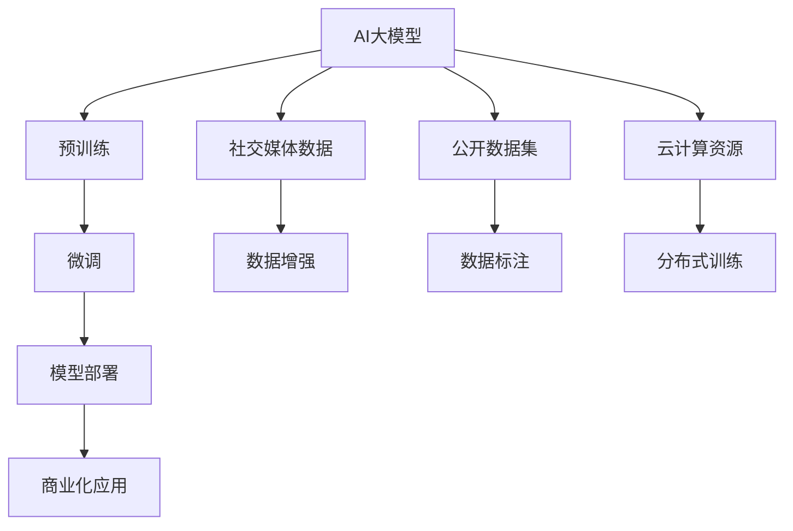

                 

# AI 大模型创业：如何利用社会优势？

在AI大模型创业的浪潮中，利用社会优势成为企业快速发展的关键。本文从背景介绍、核心概念与联系、核心算法原理、数学模型与公式、项目实践、应用场景、工具与资源推荐、未来展望与挑战等维度，全面解析AI大模型如何有效利用社会优势，推动企业发展。

## 1. 背景介绍

### 1.1 问题由来

AI大模型的兴起带来了新的创业机遇，尤其是在自然语言处理(NLP)、计算机视觉(CV)等领域。AI大模型通过预训练和微调，可以实现高精度的任务完成。然而，预训练需要大量的数据和计算资源，微调则需要专业知识和经验。创业企业如何在这一领域取得突破？

### 1.2 问题核心关键点

- 社会优势：利用现有的社交媒体、开放数据集、云计算资源等社会资源，大幅降低创业成本。
- 技术壁垒：克服技术难题，实现高性能的AI大模型训练与部署。
- 商业化：找到实际应用场景，进行快速落地，提升商业价值。
- 市场竞争：在激烈的市场竞争中，通过独特优势占据有利地位。

### 1.3 问题研究意义

利用社会优势，可以有效降低AI大模型创业的门槛，提高创业成功率。同时，充分挖掘社会资源，可以实现更快、更好的商业应用，加速AI技术的产业化进程。

## 2. 核心概念与联系

### 2.1 核心概念概述

- AI大模型：通过预训练和微调，具有高性能的AI模型，适用于各种自然语言处理和计算机视觉任务。
- 预训练：在大规模无标签数据上进行自监督学习，学习通用的知识表示。
- 微调：在特定任务上，使用少量有标签数据，通过有监督学习优化模型性能。
- 社会资源：包括社交媒体数据、公开数据集、云计算资源等。
- 技术壁垒：需要克服的数据处理、模型训练、优化部署等技术难题。
- 商业化：将AI大模型应用于实际业务场景，提升企业效益。

### 2.2 核心概念原理和架构的 Mermaid 流程图(Mermaid 流程节点中不要有括号、逗号等特殊字符)


这个流程图展示了AI大模型从预训练到微调，再到应用的社会资源链条：

1. 利用社交媒体数据进行预训练。
2. 使用公开数据集进行微调。
3. 借助云计算资源进行分布式训练。
4. 通过商业化应用获取回报。

## 3. 核心算法原理 & 具体操作步骤

### 3.1 算法原理概述

AI大模型的核心算法包括预训练和微调两部分。预训练在大规模无标签数据上，通过自监督学习，学习通用的知识表示。微调在特定任务上，使用少量有标签数据，通过有监督学习，优化模型性能。

### 3.2 算法步骤详解

1. **数据准备**
   - 收集社交媒体数据、公开数据集、标注数据。
   - 数据预处理：清洗、分词、向量化等。

2. **预训练**
   - 选择预训练模型，如BERT、GPT等。
   - 在大规模无标签数据上，通过自监督学习，学习通用的知识表示。

3. **微调**
   - 选择微调任务，如NLP、CV等。
   - 在特定任务上，使用少量有标签数据，通过有监督学习，优化模型性能。

4. **评估与部署**
   - 在验证集上评估模型性能。
   - 部署到实际应用场景，如客户服务、推荐系统等。

### 3.3 算法优缺点

**优点**：
- 利用社会资源，大幅降低创业成本。
- 高效利用预训练模型，提升模型性能。
- 快速进入市场，获取回报。

**缺点**：
- 数据质量影响模型效果。
- 技术门槛较高，需要专业知识和经验。
- 存在隐私和安全问题。

### 3.4 算法应用领域

- NLP：情感分析、机器翻译、问答系统等。
- CV：图像识别、目标检测、图像生成等。
- 推荐系统：商品推荐、内容推荐等。
- 客户服务：智能客服、智能助手等。

## 4. 数学模型和公式 & 详细讲解 & 举例说明

### 4.1 数学模型构建

预训练模型的目标是学习通用的知识表示。常用的预训练模型包括BERT、GPT等。微调模型的目标是优化特定任务的表现。常用的微调任务包括情感分析、机器翻译等。

### 4.2 公式推导过程

以BERT为例，预训练模型的目标函数为：
$$ L = \frac{1}{N} \sum_{i=1}^{N} \ell(x_i, y_i) $$
其中，$\ell$为损失函数，$x_i$为输入数据，$y_i$为标签。

微调模型的目标函数为：
$$ L = \frac{1}{N} \sum_{i=1}^{N} \ell'(x_i, y_i, \theta) $$
其中，$\ell'$为微调的损失函数，$\theta$为模型参数。

### 4.3 案例分析与讲解

以BERT为例，微调情感分析任务的公式为：
$$ L = \frac{1}{N} \sum_{i=1}^{N} \log\sigma(bert(x_i; \theta) \cdot y_i) $$
其中，$bert(x_i; \theta)$为BERT模型在输入$x_i$上的输出，$y_i$为情感标签，$\sigma$为sigmoid函数。

## 5. 项目实践：代码实例和详细解释说明

### 5.1 开发环境搭建

- 安装Python：
```bash
sudo apt-get update
sudo apt-get install python3-pip
```

- 安装PyTorch和TensorFlow：
```bash
pip install torch torchvision torchaudio tensorboard
```

- 安装Jupyter Notebook：
```bash
pip install jupyter notebook
```

### 5.2 源代码详细实现

以BERT情感分析微调为例：

```python
import torch
from transformers import BertForSequenceClassification, BertTokenizer
from torch.utils.data import DataLoader, Dataset
from sklearn.model_selection import train_test_split

class SentimentDataset(Dataset):
    def __init__(self, texts, labels):
        self.texts = texts
        self.labels = labels
        self.tokenizer = BertTokenizer.from_pretrained('bert-base-uncased')
    
    def __len__(self):
        return len(self.texts)
    
    def __getitem__(self, idx):
        text = self.texts[idx]
        label = self.labels[idx]
        
        encoding = self.tokenizer(text, truncation=True, padding='max_length', max_length=256)
        input_ids = torch.tensor(encoding.input_ids)
        attention_mask = torch.tensor(encoding.attention_mask)
        label = torch.tensor(label, dtype=torch.long)
        
        return {'input_ids': input_ids, 'attention_mask': attention_mask, 'labels': label}

# 加载数据集
train_dataset, test_dataset = train_test_split(train_data, test_size=0.2)
train_loader = DataLoader(train_dataset, batch_size=16, shuffle=True)
test_loader = DataLoader(test_dataset, batch_size=16)

# 加载模型和优化器
model = BertForSequenceClassification.from_pretrained('bert-base-uncased', num_labels=2)
optimizer = AdamW(model.parameters(), lr=1e-5)

# 训练模型
for epoch in range(10):
    model.train()
    total_loss = 0
    
    for batch in train_loader:
        input_ids = batch['input_ids'].to(device)
        attention_mask = batch['attention_mask'].to(device)
        labels = batch['labels'].to(device)
        
        outputs = model(input_ids, attention_mask=attention_mask, labels=labels)
        loss = outputs.loss
        total_loss += loss.item()
        optimizer.zero_grad()
        loss.backward()
        optimizer.step()
        
    print(f"Epoch {epoch+1}, train loss: {total_loss/len(train_loader):.4f}")
    
# 测试模型
model.eval()
total_correct = 0
total_pred = 0
with torch.no_grad():
    for batch in test_loader:
        input_ids = batch['input_ids'].to(device)
        attention_mask = batch['attention_mask'].to(device)
        labels = batch['labels'].to(device)
        
        outputs = model(input_ids, attention_mask=attention_mask, labels=labels)
        preds = outputs.predictions.argmax(dim=1)
        total_correct += (preds == labels).sum().item()
        total_pred += preds.size(0)
    
print(f"Test accuracy: {total_correct/total_pred:.4f}")
```

### 5.3 代码解读与分析

这段代码实现了BERT模型在情感分析任务上的微调。

1. **数据集处理**：
   - `SentimentDataset`类用于加载和处理数据集。
   - `train_test_split`函数用于将数据集分为训练集和测试集。

2. **模型和优化器**：
   - `BertForSequenceClassification`用于加载预训练模型。
   - `AdamW`优化器用于更新模型参数。

3. **训练过程**：
   - 在每个epoch内，对训练集进行迭代训练。
   - 使用梯度下降更新模型参数。
   - 在每个epoch后，评估模型在测试集上的准确率。

## 6. 实际应用场景

### 6.1 智能客服系统

基于社交媒体数据的AI大模型，可以用于智能客服系统的构建。通过分析用户的情感和意图，提供个性化的服务，提升客户体验。

### 6.2 推荐系统

利用公开数据集和用户行为数据，AI大模型可以用于推荐系统，提升推荐效果，增加用户粘性。

### 6.3 健康管理

通过社交媒体数据分析，AI大模型可以用于健康管理，实时监测用户的健康状况，提供个性化的健康建议。

### 6.4 未来应用展望

随着AI大模型的发展，未来将应用于更多领域，如金融、教育、农业等，推动社会进步和产业升级。

## 7. 工具和资源推荐

### 7.1 学习资源推荐

- 《深度学习》课程：斯坦福大学提供的深度学习入门课程，涵盖各种前沿技术。
- 《TensorFlow实战》书籍：Google官方文档，帮助学习TensorFlow的使用。
- Kaggle：数据科学社区，提供大量数据集和竞赛。

### 7.2 开发工具推荐

- Jupyter Notebook：开源的交互式笔记本，支持Python代码的快速迭代。
- TensorBoard：TensorFlow的可视化工具，帮助监控模型训练状态。
- PyTorch Lightning：简化PyTorch代码，快速实现模型训练。

### 7.3 相关论文推荐

- "BERT: Pre-training of Deep Bidirectional Transformers for Language Understanding"：BERT模型的论文，介绍自监督预训练方法。
- "Transformers is All You Need"：介绍Transformer模型的经典论文。
- "Socially-aware Attention for Adaptive Roadway Departure Warning System"：利用社交媒体数据进行自监督预训练的论文。

## 8. 总结：未来发展趋势与挑战

### 8.1 研究成果总结

AI大模型利用社会资源，提高了创业效率，加速了技术落地。预训练和微调方法不断进步，推动了AI技术的发展。

### 8.2 未来发展趋势

- AI大模型将继续扩大应用场景，推动各行各业的智能化升级。
- 社交媒体数据的利用将更加广泛，推动社会进步。
- 分布式训练和模型压缩技术的发展，将进一步提升AI大模型的性能。

### 8.3 面临的挑战

- 数据隐私和安全问题。
- 技术壁垒高，需要专业知识和经验。
- 市场竞争激烈，需要不断创新。

### 8.4 研究展望

未来AI大模型的研究将集中在以下几个方向：

- 自动化数据标注：通过技术手段，降低人工标注成本。
- 跨模态数据融合：将文本、图像、语音等多种数据进行融合，提升AI大模型的泛化能力。
- 因果推理：利用因果推理方法，增强AI大模型的解释性和可靠性。
- 知识表示：通过符号化知识与神经网络结合，提升AI大模型的泛化能力和推理能力。

## 9. 附录：常见问题与解答

**Q1：如何选择合适的预训练模型？**

A: 根据任务的复杂度和数据规模，选择合适的预训练模型。BERT适用于NLP任务，GPT适用于文本生成任务，ResNet适用于CV任务。

**Q2：如何避免数据隐私问题？**

A: 使用匿名化处理，去除敏感信息。使用差分隐私技术，保护用户隐私。

**Q3：如何解决模型过拟合问题？**

A: 使用正则化技术，如L2正则、Dropout等。使用分布式训练，避免单点故障。

**Q4：如何快速部署模型？**

A: 使用模型压缩技术，减小模型大小。使用分布式训练，提升推理速度。

**Q5：如何提升模型泛化能力？**

A: 利用社交媒体数据进行预训练，学习通用的知识表示。使用对抗训练，增强模型的鲁棒性。

**Q6：如何实现模型压缩？**

A: 使用知识蒸馏、剪枝、量化等方法，减小模型参数规模。

---

作者：禅与计算机程序设计艺术 / Zen and the Art of Computer Programming

