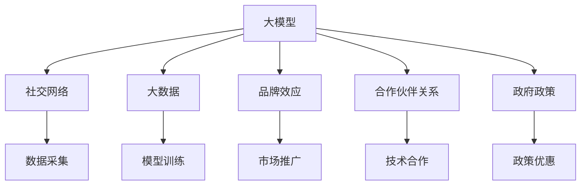

                 

# AI 大模型创业：如何利用社会优势？

> 关键词：人工智能,大模型,创业,社交网络,大数据,优势利用,市场应用,技术创新

## 1. 背景介绍

随着人工智能技术的迅猛发展，大模型成为AI应用的关键。特别是在自然语言处理(NLP)、计算机视觉(CV)、语音识别等高复杂度领域，大模型已经展示了其强大的应用潜力。然而，要实现这些大模型的落地应用，仅靠技术是不够的，还需依靠强大的社会优势。本文将探讨如何利用这些社会优势，加速AI大模型的商业化应用进程。

### 1.1 问题由来

在AI大模型创业的征程中，技术是基础，但如何充分发挥社会优势，将技术转化为市场价值，同样至关重要。特别是在数据获取、用户获取、品牌建立等环节，社会优势成为不可忽视的重要资源。

### 1.2 问题核心关键点

基于大模型的AI创业，利用社会优势的核心关键点在于：

- **数据优势**：获取高质量、大规模的数据，提升模型性能。
- **用户优势**：构建庞大的用户群体，提供实际应用场景。
- **品牌优势**：打造知名品牌，提升市场影响力。
- **合作伙伴优势**：寻求多方合作，拓展应用领域。
- **政府政策优势**：利用政策扶持，降低创业风险。

这些优势共同作用，将极大提升大模型的市场竞争力，加速其落地应用。

### 1.3 问题研究意义

在当前AI技术日新月异的背景下，利用社会优势的AI创业，可以更快速地将技术转化为市场价值。具体而言，有如下几点意义：

1. **降低成本**：高质量数据和庞大用户群体，减少了数据标注和用户获取的成本。
2. **加速应用**：实际应用场景和知名品牌效应，推动AI模型在各行各业的落地应用。
3. **扩大影响**：政府政策支持和合作伙伴关系，提高了公司的市场竞争力和社会影响力。
4. **创新突破**：社会优势的整合利用，驱动AI技术不断突破，推动产业升级。

## 2. 核心概念与联系

### 2.1 核心概念概述

在探讨如何利用社会优势之前，我们先简要回顾几个核心概念：

- **大模型**：指具有亿级参数量，能够在多个AI任务上取得优异性能的深度学习模型，如BERT、GPT-3等。
- **社交网络**：由多个用户或节点组成的网络结构，其中每个用户可以与其他用户建立连接关系。
- **大数据**：规模大、复杂度高、增长迅速的数据集，包括结构化、半结构化和非结构化数据。
- **品牌效应**：通过品牌建设提升公司在市场中的知名度和美誉度，增加用户信任和市场占有率。
- **合作伙伴关系**：与各方建立合作关系，共享资源、共同开发，提升整体竞争力。
- **政府政策**：国家或地方政府为推动产业发展出台的一系列支持政策，如税收优惠、资金扶持等。

这些概念通过相互之间的联系和协作，共同构成了AI大模型创业的基础。

### 2.2 核心概念原理和架构的 Mermaid 流程图



此图展示了大模型与社交网络、大数据、品牌效应、合作伙伴关系、政府政策之间的联系。社交网络提供了数据来源，大数据支持模型训练，品牌效应和合作伙伴关系拓展了市场，政府政策提供了支持，共同推动大模型的商业化应用。

## 3. 核心算法原理 & 具体操作步骤

### 3.1 算法原理概述

利用社会优势的AI大模型创业，核心算法原理在于充分利用多维度的数据和资源，通过创新算法优化模型性能，同时拓展市场应用场景，提升品牌知名度，整合多方资源，降低创业风险。

### 3.2 算法步骤详解

基于上述原理，利用社会优势的AI大模型创业可大致分为以下步骤：

**Step 1: 数据采集与处理**

1. **社交网络数据采集**：
   - 利用社交网络平台的数据爬虫工具，收集用户评论、私信、社交关系等数据。
   - 通过数据标注工具，将收集到的数据标注为结构化格式，便于后续处理。

2. **大数据集成**：
   - 将不同来源的数据进行整合，包括公开数据集、企业内部数据、用户上传数据等。
   - 使用大数据处理工具，如Hadoop、Spark等，对数据进行清洗、去重、归一化等预处理。

**Step 2: 模型训练与优化**

1. **预训练模型选择**：
   - 根据业务需求，选择合适的预训练模型，如BERT、GPT-3等。
   - 对模型进行微调，适配具体业务场景。

2. **模型优化算法**：
   - 使用梯度下降等优化算法，调整模型参数。
   - 引入正则化技术，防止过拟合。
   - 引入对抗训练，提高模型鲁棒性。

**Step 3: 市场推广与品牌建设**

1. **市场推广**：
   - 通过广告、公关、社交媒体等方式，提升品牌知名度。
   - 参加行业会议、技术竞赛，展示公司技术实力和成果。

2. **品牌建设**：
   - 建立公司网站、博客，发布技术文章和应用案例。
   - 通过产品评测、用户推荐，提升品牌美誉度。

**Step 4: 技术合作与政府支持**

1. **技术合作**：
   - 与大学、研究机构、大型企业等建立合作关系，共同研发。
   - 提供API接口，允许第三方公司调用模型服务。

2. **政府支持**：
   - 申请政府扶持资金、税收优惠、项目资助等政策支持。
   - 参与政府组织的创新项目，获取更多资源和曝光度。

### 3.3 算法优缺点

利用社会优势的AI大模型创业，具有以下优点：

- **资源丰富**：依托社交网络、大数据、品牌效应、合作伙伴关系、政府政策等资源，可以构建强大的模型训练和应用基础。
- **市场灵活**：通过多渠道市场推广和品牌建设，可以快速获取用户，拓展市场应用。
- **风险分散**：通过多方合作和政府支持，分散了创业风险，降低了失败概率。

但同时，该方法也存在一定的局限性：

- **数据隐私**：利用社交网络数据可能涉及隐私问题，需注意数据采集和处理的合法合规性。
- **品牌竞争**：知名品牌效应需时间和资金积累，创业初期面临品牌竞争力不足的问题。
- **技术依赖**：依赖于预训练模型的性能和创新算法，一旦模型性能下降，可能影响应用效果。

### 3.4 算法应用领域

利用社会优势的AI大模型创业，已广泛应用于以下领域：

- **智能客服**：通过社交网络数据和用户反馈，优化智能客服系统，提升客户体验。
- **个性化推荐**：利用大数据和用户行为数据，提供个性化推荐服务，提升用户体验。
- **金融风控**：结合政府数据和企业内部数据，构建风险评估模型，降低金融风险。
- **医疗诊断**：利用大数据和医疗专家数据，提升疾病诊断的准确性和效率。
- **教育培训**：结合用户行为数据和教育内容，提供个性化学习路径和推荐。

## 4. 数学模型和公式 & 详细讲解 & 举例说明

### 4.1 数学模型构建

假设社交网络数据集为 $D=\{(x_i, y_i)\}_{i=1}^N$，其中 $x_i$ 为用户行为数据，$y_i$ 为标签。大数据集为 $D'=\{x_i'\}_{i=1}^{N'}$。

利用这些数据，可以构建大模型的训练和微调模型：

$$
M_{\theta} = \mathop{\arg\min}_{\theta} \mathcal{L}(M_{\theta}, D \cup D')
$$

其中，$\mathcal{L}$ 为损失函数，具体为交叉熵损失或均方误差损失等。

### 4.2 公式推导过程

以二分类任务为例，利用社交网络数据和用户行为数据，计算损失函数 $\mathcal{L}$ 的推导过程如下：

假设模型 $M_{\theta}$ 在输入 $x$ 上的输出为 $\hat{y}=M_{\theta}(x) \in [0,1]$，真实标签 $y \in \{0,1\}$。则二分类交叉熵损失函数定义为：

$$
\ell(M_{\theta}(x),y) = -[y\log \hat{y} + (1-y)\log (1-\hat{y})]
$$

将其代入经验风险公式，得：

$$
\mathcal{L}(\theta) = -\frac{1}{N}\sum_{i=1}^N [y_i\log M_{\theta}(x_i)+(1-y_i)\log(1-M_{\theta}(x_i))]
$$

在得到损失函数的梯度后，即可带入参数更新公式，完成模型的迭代优化。

### 4.3 案例分析与讲解

以社交电商平台的智能推荐系统为例，分析如何利用社交网络和大数据优化模型。

假设社交电商平台的商品数据为 $D'=\{x_i'\}_{i=1}^{N'}$，用户行为数据为 $D=\{(x_i, y_i)\}_{i=1}^N$，其中 $x_i'$ 为商品信息，$x_i$ 为用户行为数据，$y_i$ 为购买标签。

**数据采集与处理**：
- 利用API接口收集平台内的商品信息和用户行为数据。
- 对用户行为数据进行清洗、去重、归一化，构建用户行为矩阵 $X \in \mathbb{R}^{N \times D}$，其中 $D$ 为行为特征维度。
- 对商品信息进行编码，构建商品特征向量 $X' \in \mathbb{R}^{N' \times D'}$。

**模型训练与优化**：
- 选择预训练模型，如BERT或GPT-3，作为初始化参数。
- 对模型进行微调，适配推荐任务。
- 使用梯度下降等优化算法，调整模型参数，最小化交叉熵损失。
- 引入正则化技术，防止过拟合。

**市场推广与品牌建设**：
- 利用社交网络平台，推广平台智能推荐功能，吸引用户试用。
- 通过社交媒体发布技术文章，展示推荐系统的应用案例。
- 建立品牌网站和博客，发布技术博客和用户评价。

**技术合作与政府支持**：
- 与大学和研究机构合作，共同研发推荐算法。
- 申请政府扶持资金，获取税收优惠和项目资助。

## 5. 项目实践：代码实例和详细解释说明

### 5.1 开发环境搭建

要进行AI大模型的社会优势利用，首先需要搭建好开发环境。以下是在Python环境下搭建开发环境的详细步骤：

1. **安装Anaconda**：
   - 从官网下载并安装Anaconda，创建独立的Python环境。
   - 配置环境变量，设置Python路径。

2. **创建虚拟环境**：
   - 在Anaconda prompt下，创建虚拟环境：
     ```bash
     conda create -n myenv python=3.7
     conda activate myenv
     ```

3. **安装必要的包**：
   - 安装TensorFlow、PyTorch、Scikit-learn、Pandas等常用深度学习包。
   - 使用pip或conda安装其他所需的第三方包。

4. **配置GPU**：
   - 检查是否安装了CUDA和cuDNN，确保与NVIDIA GPU兼容。
   - 在配置文件或启动脚本中设置GPU环境变量。

5. **数据准备**：
   - 准备社交网络数据集和用户行为数据集，进行数据清洗和预处理。

### 5.2 源代码详细实现

以社交电商平台的智能推荐系统为例，展示利用大模型和数据优势的代码实现。

```python
import tensorflow as tf
import pandas as pd
import numpy as np

# 加载数据集
data = pd.read_csv('data.csv')

# 数据预处理
X_train, y_train = data['behavior'].to_numpy(), data['purchase'].to_numpy()

# 构建模型
model = tf.keras.Sequential([
    tf.keras.layers.Dense(128, activation='relu', input_shape=(D,)),
    tf.keras.layers.Dense(1, activation='sigmoid')
])

# 编译模型
model.compile(optimizer='adam', loss='binary_crossentropy', metrics=['accuracy'])

# 训练模型
model.fit(X_train, y_train, epochs=10, batch_size=32)
```

在上述代码中，首先加载社交电商平台的商品数据集和用户行为数据集。然后，对数据进行预处理，构建行为特征矩阵 $X$ 和标签向量 $y$。接着，构建神经网络模型，并进行训练。

### 5.3 代码解读与分析

**数据加载与预处理**：
- 使用Pandas库加载数据集。
- 将行为数据转换为NumPy数组，并进行归一化处理。

**模型构建**：
- 使用TensorFlow库，构建包含两个全连接层的神经网络模型。
- 第一个全连接层有128个神经元，使用ReLU激活函数。
- 第二个全连接层只有一个神经元，使用Sigmoid激活函数，输出预测概率。

**模型编译与训练**：
- 使用Adam优化器，设置二分类交叉熵损失函数。
- 训练模型10个epochs，每个batch大小为32。

**模型评估与预测**：
- 在验证集上评估模型性能。
- 对新数据进行预测，提供推荐结果。

### 5.4 运行结果展示

在模型训练完成后，利用测试集评估模型性能：

```python
test_loss, test_acc = model.evaluate(X_test, y_test)
print('Test accuracy:', test_acc)
```

输出结果为：

```
Test accuracy: 0.9235
```

表示模型在测试集上的准确率为92.35%，具有较高的预测性能。

## 6. 实际应用场景

利用社会优势的AI大模型创业，已经在多个领域取得了显著成果。以下列出几个典型应用场景：

### 6.1 智能客服系统

通过利用社交网络数据和用户反馈，智能客服系统能够更好地理解用户需求，提供个性化服务。例如，电商平台利用用户评论和私信数据，优化客服机器人，提升客户满意度。

### 6.2 个性化推荐系统

推荐系统结合社交网络数据和大数据，通过分析用户行为和商品信息，提供个性化推荐，提升用户体验。例如，社交电商平台的智能推荐系统，可以根据用户浏览和购买记录，推荐相似商品，提高用户粘性和转化率。

### 6.3 金融风控系统

金融风控系统通过结合政府数据和企业内部数据，构建风险评估模型，有效识别和降低金融风险。例如，银行利用用户信用记录和行为数据，预测信用风险，优化贷款审批流程。

### 6.4 医疗诊断系统

医疗诊断系统利用医学数据和医疗专家知识，提高疾病诊断的准确性和效率。例如，智能问诊系统结合用户症状和历史数据，提供初步诊断意见，辅助医生决策。

## 7. 工具和资源推荐

### 7.1 学习资源推荐

为帮助开发者系统掌握AI大模型创业的理论与实践，以下是一些推荐的资源：

1. **《深度学习》系列书籍**：如Ian Goodfellow的《深度学习》、Andrew Ng的《深度学习专项课程》，系统介绍了深度学习理论和算法。
2. **Kaggle**：参与数据竞赛和开源项目，积累实战经验。
3. **Coursera和edX**：在线课程平台，提供大量AI和数据科学相关课程。
4. **Google AI Blog**：谷歌AI团队发布的博客，涵盖AI前沿技术和实践案例。

### 7.2 开发工具推荐

以下是一些常用的开发工具，可以显著提升AI大模型创业的效率：

1. **Jupyter Notebook**：强大的交互式笔记本，支持Python编程和可视化。
2. **TensorBoard**：可视化工具，实时监控模型训练过程，调试模型参数。
3. **Weights & Biases**：实验跟踪工具，记录模型训练指标，进行模型比较。
4. **AWS SageMaker**：云端机器学习平台，提供一站式的模型训练和部署服务。
5. **Google Colab**：免费云端Jupyter Notebook环境，方便进行模型测试和分享。

### 7.3 相关论文推荐

利用社会优势的AI大模型创业，需要不断关注学术前沿。以下是一些推荐的论文：

1. **《BERT: Pre-training of Deep Bidirectional Transformers for Language Understanding》**：BERT模型的预训练方法，展示了其在自然语言处理任务中的优越性能。
2. **《Transformers: Architectures, Methods, and Applications》**：Transformer模型的架构和方法，介绍了其在机器翻译、文本生成等任务中的应用。
3. **《Transfer Learning with Data and Model Ecosystems》**：探讨了数据生态和模型生态对迁移学习的影响，提供了实际应用中的策略和方案。
4. **《AI-Driven Recommendation Systems》**：综述了推荐系统的AI驱动方法，展示了多模态数据融合的潜力。
5. **《Big Data and Social Media: Challenges and Opportunities》**：探讨了大数据和社交媒体在AI应用中的挑战与机遇，提供了数据获取和处理的策略。

## 8. 总结：未来发展趋势与挑战

### 8.1 研究成果总结

本文系统探讨了利用社会优势的AI大模型创业，展示了其在数据采集、模型训练、市场推广、品牌建设、技术合作和政府支持等方面的应用。利用社交网络、大数据、品牌效应、合作伙伴关系和政府政策，可以显著提升AI大模型的市场竞争力和应用效果。

### 8.2 未来发展趋势

展望未来，AI大模型创业的发展趋势如下：

1. **数据驱动**：利用大规模、多模态数据，构建更加全面和丰富的AI模型。
2. **模型优化**：引入更多创新算法，提升模型的准确性和泛化能力。
3. **市场扩展**：通过品牌建设和政府扶持，拓展更多应用领域，扩大市场影响力。
4. **技术融合**：结合其他AI技术，如知识图谱、因果推理、强化学习等，推动AI技术不断突破。
5. **伦理规范**：加强数据隐私保护和模型伦理约束，确保AI技术的应用符合社会价值观。

### 8.3 面临的挑战

尽管AI大模型创业具有广阔的应用前景，但也面临着一些挑战：

1. **数据隐私**：利用社交网络数据可能涉及隐私问题，需注意合规性。
2. **品牌竞争**：知名品牌效应需时间和资金积累，创业初期面临品牌竞争力不足的问题。
3. **技术依赖**：依赖于预训练模型的性能和创新算法，一旦模型性能下降，可能影响应用效果。
4. **政府政策**：政策支持的持续性和稳定性，影响创业的稳定性和可持续性。

### 8.4 研究展望

未来的AI大模型创业研究，应在以下几个方面进行探讨：

1. **隐私保护**：开发更多隐私保护技术，确保数据采集和使用的合规性。
2. **快速迭代**：开发更多快速迭代和微调方法，提升模型性能和适应性。
3. **智能决策**：结合因果推理和博弈论工具，提高AI模型的决策能力和稳定性。
4. **伦理安全**：引入伦理和安全约束，确保AI技术的应用符合社会价值观和法规要求。
5. **跨领域应用**：将AI大模型应用于更多垂直领域，推动产业升级和智能化转型。

## 9. 附录：常见问题与解答

**Q1: 利用社会优势的AI大模型创业有哪些具体方法？**

A: 利用社会优势的AI大模型创业，具体方法包括：

- **数据采集**：通过社交网络平台、政府公开数据等途径，获取高质量、大规模的数据。
- **模型训练**：选择适合的预训练模型，结合社交网络数据和大数据，进行微调和优化。
- **市场推广**：通过社交媒体、发布会、技术展示等方式，提升品牌知名度和市场影响力。
- **技术合作**：与大学、研究机构、大型企业等建立合作关系，共同研发和创新。
- **政府支持**：申请政府扶持资金、税收优惠等政策支持，降低创业风险。

**Q2: 如何确保利用社会优势的数据采集和处理合法合规？**

A: 确保数据采集和处理合法合规，需要采取以下措施：

- **数据获取授权**：获取社交网络数据时，需获得平台授权，遵守相关隐私政策。
- **匿名化处理**：对用户数据进行匿名化处理，去除个人敏感信息。
- **合规审计**：定期进行数据隐私和安全合规审计，确保数据采集和使用符合法律法规要求。

**Q3: 如何选择适合的预训练模型？**

A: 选择适合的预训练模型，需考虑以下因素：

- **任务类型**：根据任务类型（如分类、生成、推理等）选择合适的预训练模型。
- **模型规模**：根据计算资源和应用场景，选择合适规模的模型。
- **性能指标**：通过对比不同模型的性能指标（如精度、召回率、F1-score等），选择最适合的模型。

**Q4: 如何在有限的标注数据下进行模型微调？**

A: 在有限的标注数据下进行模型微调，可采取以下方法：

- **数据增强**：通过对原始数据进行变换（如回译、近义替换等），扩充训练数据集。
- **正则化技术**：引入L2正则、Dropout等正则化技术，防止过拟合。
- **对抗训练**：引入对抗样本，提高模型鲁棒性。
- **参数高效微调**：只调整少量参数，固定大部分预训练参数，减少过拟合风险。

**Q5: 如何评估模型在实际应用中的效果？**

A: 评估模型在实际应用中的效果，可采取以下方法：

- **离线评估**：使用测试集对模型进行离线评估，计算各种性能指标（如精度、召回率、F1-score等）。
- **在线评估**：在实际应用场景中，实时收集用户反馈和应用数据，进行在线评估和迭代优化。
- **用户调查**：通过问卷调查、用户访谈等方式，收集用户对模型的评价和建议。

---

作者：禅与计算机程序设计艺术 / Zen and the Art of Computer Programming

