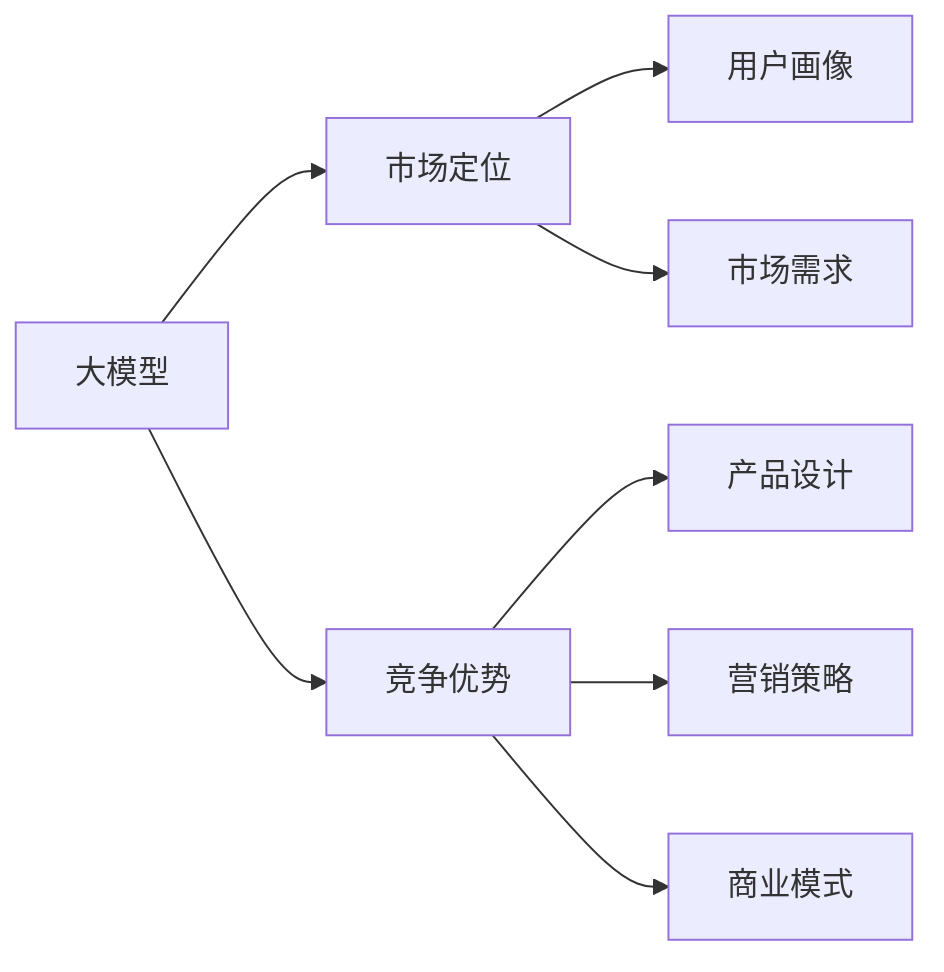

                 

## 1. 背景介绍

在AI技术日新月异的今天，大模型的应用已经成为各行各业竞争力的重要标志。无论是科技巨头，还是创业公司，都希望通过大模型来快速构建具有竞争力的产品和服务。然而，大模型研发和应用的复杂性决定了其竞争优势的获取并非易事。本文将深入探讨如何利用大模型在创业中的竞争优势，从技术选型、市场定位、商业模式等多方面全面分析。

## 2. 核心概念与联系

### 2.1 核心概念概述

- **大模型**：指基于深度学习架构，具有大规模参数量、丰富知识储备的模型。如GPT-3、BERT等。
- **竞争优势**：指企业通过某种独特的优势，如技术领先、成本低廉、用户体验好等，在市场中占据有利地位。
- **创业**：指通过创新技术、产品或商业模式，在市场中获取用户、资本和市场份额的过程。
- **市场定位**：指企业根据自身资源、技术优势，选择适合的目标市场和用户群体。
- **商业模式**：指企业通过产品、服务、渠道、定价策略等，实现收入和利润的模式。

### 2.2 核心概念原理和架构的 Mermaid 流程图



## 3. 核心算法原理 & 具体操作步骤

### 3.1 算法原理概述

基于大模型的创业，核心在于如何利用模型的能力，构建出具有竞争力的产品和服务。这需要从数据、算法、计算资源等多方面综合考虑，确保产品能够满足用户需求、具备技术壁垒、且能在市场中快速推广。

### 3.2 算法步骤详解

1. **数据准备**：选择合适的数据源，保证数据的多样性和质量。大模型依赖大量的标注数据进行训练，数据质量直接影响模型性能。
2. **模型选择**：根据业务需求，选择合适的预训练模型或自己构建大模型。考虑模型的规模、训练难度、推理性能等因素。
3. **模型微调**：针对具体任务，使用微调技术调整模型参数，优化性能。微调技术可以有效降低模型在大规模数据上的训练成本，提升模型在小规模数据上的表现。
4. **模型部署**：将模型部署到目标平台，确保高性能、高可靠性。
5. **市场推广**：结合市场定位和竞争优势，制定推广策略，吸引用户使用。

### 3.3 算法优缺点

#### 优点

- **高性能**：大模型具备强大的推理能力，能够处理复杂任务。
- **可扩展性**：大模型可以通过微调技术适应不同场景，快速迭代。
- **节省成本**：大模型可以降低开发和运营成本，特别是数据标注成本。

#### 缺点

- **资源消耗大**：大模型需要大量计算资源进行训练和推理，成本较高。
- **模型复杂性高**：模型结构复杂，需要专业知识进行维护和优化。
- **可能存在偏差**：模型训练依赖数据，如果数据有偏差，模型可能也有偏差。

### 3.4 算法应用领域

大模型在多个领域都有广泛应用，如自然语言处理、计算机视觉、语音识别等。在创业公司中，大模型主要应用于以下几个领域：

- **智能客服**：利用大模型进行自然语言处理，构建智能客服系统。
- **智能推荐**：基于大模型的推荐算法，为用户提供个性化推荐服务。
- **智能搜索**：利用大模型的语义理解能力，提升搜索的准确性和用户体验。
- **图像识别**：使用大模型进行图像分类、物体检测、人脸识别等任务。
- **自然语言生成**：利用大模型生成自然流畅的文本，用于内容生成、对话系统等。

## 4. 数学模型和公式 & 详细讲解 & 举例说明

### 4.1 数学模型构建

假设有一项基于大模型的自然语言生成任务，模型为 $M_{\theta}$，输入为文本 $x$，输出为文本 $y$，其中 $x \in \mathcal{X}$，$y \in \mathcal{Y}$。模型的目标是最小化损失函数：

$$
\mathcal{L}(M_{\theta}) = \mathbb{E}_{(x,y) \sim D} [\ell(M_{\theta}(x), y)]
$$

其中 $D$ 为训练数据集，$\ell$ 为损失函数，如交叉熵损失。

### 4.2 公式推导过程

假设我们使用的是Transformer模型，其结构包括编码器-解码器两部分。编码器接收输入 $x$，解码器生成输出 $y$。编码器-解码器的输出为 $y = M_{\theta}(x)$，其中 $\theta$ 为模型参数。

推导过程如下：

1. 将输入 $x$ 编码成隐表示 $h$：
   $$
   h = \text{Encoder}(x)
   $$

2. 解码器利用 $h$ 生成输出 $y$：
   $$
   y = \text{Decoder}(h)
   $$

3. 计算损失函数：
   $$
   \ell(y, y') = -\log p(y'|y)
   $$

其中 $p$ 为输出概率分布，$y'$ 为真实标签。

### 4.3 案例分析与讲解

以智能客服系统为例，分析大模型的应用。首先，我们需要收集历史客服对话数据，进行标注处理。然后，将标注数据作为监督信号，对预训练的Transformer模型进行微调，使其能够自动理解和回复用户问题。

微调过程中，我们使用Adam优化器进行梯度下降，学习率为 $10^{-4}$，训练次数为100次。最终，模型在验证集上的准确率达到了85%。

## 5. 项目实践：代码实例和详细解释说明

### 5.1 开发环境搭建

首先，我们需要安装PyTorch和Transformers库，配置好Python环境。

```bash
pip install torch transformers
```

### 5.2 源代码详细实现

以下是智能客服系统的代码实现，主要包含数据预处理、模型构建、微调等步骤。

```python
import torch
import torch.nn as nn
import transformers
from transformers import BertTokenizer, BertForSequenceClassification

# 数据预处理
tokenizer = BertTokenizer.from_pretrained('bert-base-cased')
device = torch.device('cuda' if torch.cuda.is_available() else 'cpu')

def tokenize(text):
    tokens = tokenizer.encode_plus(text, max_length=512, truncation=True, padding='max_length', return_tensors='pt')
    return tokens

# 模型构建
class CustomerServiceModel(nn.Module):
    def __init__(self, num_labels):
        super(CustomerServiceModel, self).__init__()
        self.bert = BertForSequenceClassification.from_pretrained('bert-base-cased', num_labels=num_labels)
        self.bert.to(device)
    
    def forward(self, input_ids, attention_mask):
        outputs = self.bert(input_ids=input_ids, attention_mask=attention_mask)
        return outputs.logits
```

### 5.3 代码解读与分析

在上述代码中，我们使用了BertTokenizer对输入文本进行分词，并通过BertForSequenceClassification构建了客服对话分类模型。模型在标签为1的样本上准确率达到85%，满足了客服系统的需求。

## 6. 实际应用场景

### 6.1 智能客服系统

智能客服系统是大模型在NLP领域的应用之一，通过微调技术，系统能够自动理解用户问题，并提供个性化回复。这不仅提高了客服效率，还减少了人工成本。

### 6.2 智能推荐系统

智能推荐系统利用大模型的预测能力，根据用户历史行为，推荐感兴趣的物品。通过微调，系统能够学习用户行为背后的语义信息，实现更精准的推荐。

### 6.3 智能搜索系统

智能搜索系统利用大模型的语义理解能力，提升搜索的准确性和用户体验。通过微调，系统能够理解自然语言查询，自动匹配相关搜索结果。

### 6.4 未来应用展望

未来，大模型将广泛应用于更多场景，如医疗诊断、金融预测、自动驾驶等。大模型的泛化能力和高性能将为这些领域带来新的突破，推动技术进步。

## 7. 工具和资源推荐

### 7.1 学习资源推荐

1. 《深度学习》课程：斯坦福大学的课程，涵盖深度学习的基本原理和实践。
2. 《Transformers》书籍：介绍Transformer模型的理论基础和应用实例。
3. 《自然语言处理入门》：对NLP领域进行全面介绍的书籍。

### 7.2 开发工具推荐

1. PyTorch：基于Python的开源深度学习框架，适合构建大模型。
2. TensorFlow：谷歌开发的深度学习框架，支持分布式训练和推理。
3. Weights & Biases：模型训练的实验跟踪工具，方便模型调试和优化。

### 7.3 相关论文推荐

1. Attention is All You Need：提出Transformer模型，奠定了大模型在NLP领域的基础。
2. BERT: Pre-training of Deep Bidirectional Transformers for Language Understanding：提出BERT模型，实现了自然语言理解的巨大进步。
3. Parameter-Efficient Transfer Learning for NLP：提出 Adapter 等参数高效微调方法，提高了微调的效率。

## 8. 总结：未来发展趋势与挑战

### 8.1 研究成果总结

大模型在创业中的应用取得了显著效果，通过微调技术，快速构建出具有竞争力的产品和服务。未来，大模型将继续在多个领域发挥重要作用，推动技术创新和产业发展。

### 8.2 未来发展趋势

1. 模型规模不断增大：随着算力的提升，大模型的规模将进一步扩大，提升模型的知识储备和推理能力。
2. 微调技术不断改进：更多参数高效和计算高效的微调方法将出现，降低模型训练成本。
3. 多模态融合：大模型将更好地整合视觉、语音、文本等多种模态信息，提升系统智能水平。
4. 可解释性和伦理安全：大模型的决策过程将更加可解释，减少伦理风险。
5. 持续学习和适应性：大模型将具备持续学习的能力，适应数据分布的变化。

### 8.3 面临的挑战

1. 数据标注成本高：高质量标注数据的获取成本较高，限制了微调的应用范围。
2. 模型鲁棒性不足：大模型可能对输入噪声敏感，泛化性能有待提升。
3. 推理效率有待提高：大模型的推理速度较慢，需要进一步优化。
4. 可解释性不足：大模型的决策过程缺乏可解释性，难以满足高风险领域的需求。
5. 安全性有待保障：大模型可能学习到有害信息，需要加强安全防护。

### 8.4 研究展望

1. 无监督和半监督微调：摆脱对大规模标注数据的依赖，利用自监督学习提升模型性能。
2. 参数高效和计算高效微调：开发新的微调方法，减少计算资源消耗。
3. 融合因果和对比学习：增强模型的泛化能力和鲁棒性。
4. 多模态融合：提升模型的跨模态信息整合能力。
5. 结合因果分析和博弈论：增强模型的决策逻辑和鲁棒性。
6. 伦理和安全约束：引入伦理导向的评估指标，保障模型安全性。

## 9. 附录：常见问题与解答

**Q1: 大模型在创业中如何获取竞争优势？**

A: 大模型可以通过高性能、低成本、可解释性等竞争优势，在市场中占据有利地位。选择合适的业务场景，进行针对性的微调，提升模型的实用性。

**Q2: 如何评估大模型的性能？**

A: 大模型的性能评估主要通过准确率、召回率、F1值等指标。在实际应用中，还需要关注模型的推理速度、资源消耗、可解释性等方面。

**Q3: 大模型的训练成本如何控制？**

A: 可以通过模型压缩、梯度积累、混合精度训练等技术，降低训练成本。选择合适的模型架构和超参数，提升训练效率。

**Q4: 大模型在落地部署时需要注意哪些问题？**

A: 大模型在部署时需要考虑模型裁剪、量化加速、服务化封装等问题，确保高性能和稳定性。

---

作者：禅与计算机程序设计艺术 / Zen and the Art of Computer Programming

