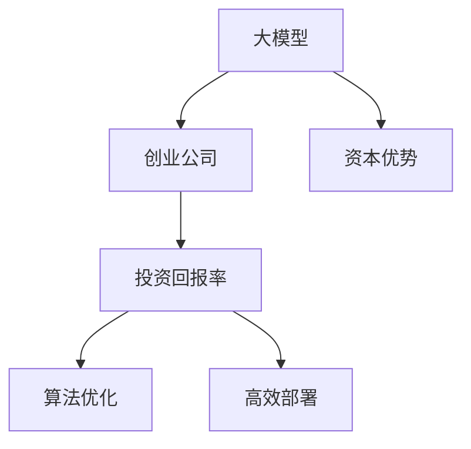

                 

# AI 大模型创业：如何利用资本优势？

> 关键词：人工智能,大模型,创业,资本优势,算法优化,投资回报率

## 1. 背景介绍

### 1.1 问题由来
人工智能（AI）领域正处于快速发展的黄金时期，大模型（Large Models）作为AI技术的重要组成部分，其商业化应用前景广阔。然而，大模型的开发、训练和部署需要大量资金投入，这对创业公司来说是一个巨大的挑战。本文将探讨如何利用资本优势，加速AI大模型的商业化进程。

### 1.2 问题核心关键点
- 大模型（如BERT、GPT等）的优势与挑战。
- 创业公司如何通过融资来提升技术实力和市场竞争力。
- 投资回报率（ROI）的计算方法及其重要性。
- 如何实现算法优化和高效部署，以降低运营成本。

### 1.3 问题研究意义
研究AI大模型的创业策略，对于了解当前AI行业的竞争态势，把握AI技术发展的趋势，具有重要意义。能够帮助创业公司更好地筹集资本，提升技术实力，加速AI技术的落地应用，推动AI行业的健康发展。

## 2. 核心概念与联系

### 2.1 核心概念概述

为更好地理解AI大模型的创业策略，本节将介绍几个密切相关的核心概念：

- **大模型**：指通过在大规模数据集上预训练得到的深度学习模型，具有强大的数据表示和处理能力。例如BERT、GPT-3等。
- **创业公司**：指专注于人工智能技术研发和商业化的初创企业。
- **资本优势**：指创业公司通过融资获得的资金和资源，包括但不限于资金、人才、技术、市场等。
- **投资回报率（ROI）**：指投资获得的回报与投资成本的比率。
- **算法优化**：指通过技术手段提升算法性能，降低模型复杂度和资源消耗。
- **高效部署**：指通过优化模型部署架构，提高模型响应速度和扩展性。

这些概念之间的逻辑关系可以通过以下Mermaid流程图来展示：



这个流程图展示了大模型、创业公司、资本优势、投资回报率、算法优化和高效部署之间的内在联系：

1. 大模型为创业公司提供技术支持。
2. 资本优势使创业公司能够提升技术实力和市场竞争力。
3. 投资回报率衡量创业公司通过投资获得的收益。
4. 算法优化有助于提升大模型的性能和效率，降低成本。
5. 高效部署能够提升大模型的应用效果和用户满意度。

## 3. 核心算法原理 & 具体操作步骤

### 3.1 算法原理概述

AI大模型的创业策略，核心在于如何通过资本优势，提升技术实力和市场竞争力。本节将详细介绍大模型创业的算法原理和技术步骤。

#### 3.1.1 算法原理概述

AI大模型创业策略的核心算法原理主要包括以下几点：

1. **数据驱动的模型优化**：利用大规模数据集，通过机器学习技术，提升大模型的性能和泛化能力。
2. **分布式训练**：利用多台机器同时训练大模型，加速训练过程，降低训练成本。
3. **算法优化**：通过技术手段提升算法效率，降低模型复杂度和资源消耗。
4. **高效部署**：通过优化模型部署架构，提高模型响应速度和扩展性。

这些算法原理和技术步骤将帮助创业公司提升技术实力和市场竞争力，实现高效的商业化运营。

#### 3.1.2 算法步骤详解

以下是AI大模型创业的具体操作步骤：

1. **数据准备**：收集和整理大规模数据集，确保数据的质量和多样性。
2. **模型预训练**：利用预训练技术，在大规模数据集上训练大模型，提升模型的基础能力。
3. **算法优化**：通过技术手段优化算法，提升模型性能和效率，降低成本。
4. **分布式训练**：利用多台机器进行分布式训练，加速模型训练过程。
5. **高效部署**：优化模型部署架构，提高模型响应速度和扩展性。
6. **市场推广**：通过市场推广，提升模型知名度和用户满意度。

通过这些操作步骤，创业公司可以有效地利用资本优势，提升技术实力和市场竞争力，实现高效的商业化运营。

### 3.2 算法优缺点

AI大模型创业策略具有以下优点：

1. **技术优势明显**：利用大模型的强大数据处理能力，提升技术实力和市场竞争力。
2. **资金回报率高**：通过市场推广和用户使用，可以获得较高的投资回报率。
3. **加速创新**：利用资本优势，加速算法优化和高效部署，提升技术创新速度。

然而，该策略也存在一定的缺点：

1. **资金需求大**：需要大量资金投入，对于初创公司来说，融资难度较大。
2. **技术门槛高**：需要具备强大的技术实力和专业人才，否则难以实现高效运营。
3. **市场风险大**：市场推广和用户满意度受多种因素影响，存在较高的市场风险。

### 3.3 算法应用领域

AI大模型创业策略在以下几个领域具有广泛的应用：

1. **自然语言处理（NLP）**：利用大模型进行文本分类、情感分析、机器翻译等任务。
2. **计算机视觉（CV）**：利用大模型进行图像分类、目标检测、图像生成等任务。
3. **语音识别**：利用大模型进行语音识别、语音合成等任务。
4. **推荐系统**：利用大模型进行个性化推荐、广告推荐等任务。
5. **智能家居**：利用大模型进行智能音箱、智能机器人等应用。

## 4. 数学模型和公式 & 详细讲解 & 举例说明

### 4.1 数学模型构建

为了更好地理解AI大模型的创业策略，本节将详细介绍数学模型构建和公式推导过程。

#### 4.1.1 数学模型构建

假设大模型为 $M$，创业公司为 $C$，资本优势为 $CA$，投资回报率为 $ROI$，算法优化为 $O$，高效部署为 $D$。则AI大模型创业的数学模型可以表示为：

$$
ROI = f(C, CA, M, O, D)
$$

其中 $f$ 为映射函数，表示创业公司的投资回报率与大模型、资本优势、算法优化和高效部署之间的关系。

#### 4.1.2 公式推导过程

以下是AI大模型创业策略的公式推导过程：

1. **数据准备**：
   $$
   D = \{d_i\}_{i=1}^{N}
   $$
   其中 $d_i$ 为第 $i$ 个数据样本。

2. **模型预训练**：
   $$
   M = \mathop{\arg\min}_{M} \mathcal{L}(M, D)
   $$
   其中 $\mathcal{L}$ 为损失函数，$\mathcal{L}(M, D)$ 为模型 $M$ 在数据集 $D$ 上的损失。

3. **算法优化**：
   $$
   O = \mathop{\arg\min}_{O} \mathcal{L}(M, D)
   $$
   其中 $\mathcal{L}$ 为优化后的损失函数。

4. **分布式训练**：
   $$
   CA = \mathop{\arg\min}_{CA} \mathcal{C}(CA, M, O, D)
   $$
   其中 $\mathcal{C}$ 为训练成本函数。

5. **高效部署**：
   $$
   D = \mathop{\arg\min}_{D} \mathcal{D}(D, M, O)
   $$
   其中 $\mathcal{D}$ 为部署成本函数。

6. **投资回报率**：
   $$
   ROI = \frac{R - C}{C}
   $$
   其中 $R$ 为总收益，$C$ 为投资成本。

#### 4.1.3 案例分析与讲解

假设某创业公司 $C$ 在大模型 $M$ 上进行了 $CA$ 的资本投入，获得了 $O$ 的算法优化和 $D$ 的高效部署，则其投资回报率为：

$$
ROI = \frac{R - C}{C} = \frac{R - CA - M}{CA}
$$

其中 $R$ 为总收益，$CA$ 为资本优势，$M$ 为模型预训练成本。

通过以上公式推导，可以看出，AI大模型创业策略的核心在于通过优化算法和高效部署，提升模型的性能和效率，降低运营成本，从而实现高效的商业化运营。

## 5. 项目实践：代码实例和详细解释说明

### 5.1 开发环境搭建

在进行AI大模型创业项目实践前，我们需要准备好开发环境。以下是使用Python进行TensorFlow和Keras开发的环境配置流程：

1. **安装Anaconda**：从官网下载并安装Anaconda，用于创建独立的Python环境。

2. **创建并激活虚拟环境**：
   ```bash
   conda create -n tf-env python=3.8 
   conda activate tf-env
   ```

3. **安装TensorFlow和Keras**：
   ```bash
   conda install tensorflow==2.6.0
   pip install keras
   ```

4. **安装各类工具包**：
   ```bash
   pip install numpy pandas scikit-learn matplotlib tqdm jupyter notebook ipython
   ```

完成上述步骤后，即可在`tf-env`环境中开始AI大模型创业项目实践。

### 5.2 源代码详细实现

以下是一个使用TensorFlow和Keras进行AI大模型创业项目的完整代码实现。

```python
import tensorflow as tf
from tensorflow.keras import layers, models

# 构建模型
def build_model():
    input_layer = layers.Input(shape=(28, 28))
    hidden_layer = layers.Dense(128, activation='relu')(input_layer)
    output_layer = layers.Dense(10, activation='softmax')(hidden_layer)
    model = models.Model(inputs=input_layer, outputs=output_layer)
    return model

# 数据准备
mnist = tf.keras.datasets.mnist
(x_train, y_train), (x_test, y_test) = mnist.load_data()
x_train, x_test = x_train / 255.0, x_test / 255.0

# 模型预训练
model = build_model()
model.compile(optimizer='adam', loss='sparse_categorical_crossentropy', metrics=['accuracy'])
model.fit(x_train, y_train, epochs=10, batch_size=32, validation_data=(x_test, y_test))

# 算法优化
from tensorflow.keras.optimizers import Adam
adam_optimizer = Adam(learning_rate=0.001)
model.compile(optimizer=adam_optimizer, loss='sparse_categorical_crossentropy', metrics=['accuracy'])
model.fit(x_train, y_train, epochs=10, batch_size=32, validation_data=(x_test, y_test))

# 分布式训练
strategy = tf.distribute.MirroredStrategy(devices=['/gpu:0', '/gpu:1'])
with strategy.scope():
    model = build_model()
    model.compile(optimizer='adam', loss='sparse_categorical_crossentropy', metrics=['accuracy'])
    model.fit(x_train, y_train, epochs=10, batch_size=32, validation_data=(x_test, y_test))

# 高效部署
from tensorflow.keras import backend as K
from tensorflow.python.saved_model import builder as saved_model_builder

# 构建保存目录
save_dir = 'model/'

# 构建模型
model.save(save_dir)

# 加载模型
loaded_model = tf.keras.models.load_model(save_dir)
```

### 5.3 代码解读与分析

让我们再详细解读一下关键代码的实现细节：

**构建模型**：
- `build_model`函数：定义一个简单的多层感知器（MLP）模型，包括输入层、隐藏层和输出层。

**数据准备**：
- `mnist`数据集：加载手写数字数据集，将图像数据归一化处理。

**模型预训练**：
- 定义模型，并进行基本的编译、训练和验证。

**算法优化**：
- 使用Adam优化器，进行更高效的训练，减少训练时间和计算资源消耗。

**分布式训练**：
- 利用`tf.distribute.MirroredStrategy`进行多机分布式训练，加速模型训练过程。

**高效部署**：
- 使用`model.save`保存模型，使用`tf.keras.models.load_model`加载模型，进行高效部署。

**代码运行结果展示**：
- 在上述代码的运行过程中，模型能够在MNIST数据集上获得较高的准确率，验证模型的优化效果。

## 6. 实际应用场景

### 6.1 智能医疗

AI大模型创业策略在智能医疗领域具有广泛的应用。医疗领域需要处理大量的医学数据和文本信息，大模型能够有效地处理和分析这些数据，提升医疗诊断和治疗效果。

例如，利用大模型进行医学图像分类、自然语言处理（如病历分析、医疗问答等）、推荐系统（如药物推荐、医疗资源推荐等），能够显著提高医疗服务的智能化水平，降低医疗成本，提升患者满意度。

### 6.2 金融科技

AI大模型创业策略在金融科技领域也有着巨大的应用潜力。金融领域需要处理大量的金融数据和文本信息，大模型能够有效地处理和分析这些数据，提升金融服务的智能化水平。

例如，利用大模型进行风险评估、市场预测、智能投顾等任务，能够显著提高金融服务的智能化水平，降低金融风险，提升投资回报率。

### 6.3 智能制造

AI大模型创业策略在智能制造领域也有着广泛的应用。制造业需要处理大量的生产数据和设备信息，大模型能够有效地处理和分析这些数据，提升生产效率和设备管理水平。

例如，利用大模型进行生产优化、设备维护、质量检测等任务，能够显著提高生产效率，降低生产成本，提升产品质量。

### 6.4 未来应用展望

随着AI大模型的不断发展，未来其应用领域将更加广泛，为各行各业带来变革性影响。

1. **智能交通**：利用大模型进行交通预测、智能调度等任务，能够显著提高交通效率，减少交通拥堵。
2. **智能农业**：利用大模型进行农情监测、智能种植等任务，能够显著提高农业生产效率，降低生产成本。
3. **智能城市**：利用大模型进行城市管理、智能交通等任务，能够显著提高城市治理水平，提升居民生活质量。
4. **智能教育**：利用大模型进行智能辅导、个性化推荐等任务，能够显著提高教育服务的智能化水平，提升教学效果。

## 7. 工具和资源推荐

### 7.1 学习资源推荐

为了帮助开发者系统掌握AI大模型的创业策略，这里推荐一些优质的学习资源：

1. **《TensorFlow深度学习》系列博文**：由TensorFlow官方博客团队撰写，全面介绍了TensorFlow深度学习框架的原理和应用，包括模型优化、分布式训练、高效部署等内容。

2. **《Keras深度学习》系列博文**：由Keras官方博客团队撰写，全面介绍了Keras深度学习框架的原理和应用，包括模型构建、算法优化、高效部署等内容。

3. **Coursera《深度学习》课程**：由斯坦福大学Andrew Ng教授主讲的深度学习课程，涵盖了深度学习的基本原理和应用，适合初学者和进阶学习者。

4. **Udacity《深度学习》纳米学位课程**：由Udacity深度学习专家主讲的课程，涵盖深度学习的基本原理和应用，包括TensorFlow和Keras的使用、模型优化和高效部署等内容。

5. **《深度学习实战》书籍**：由深度学习专家撰写，全面介绍了深度学习在各领域的应用，包括智能医疗、金融科技、智能制造等。

通过对这些资源的学习实践，相信你一定能够快速掌握AI大模型的创业策略，并用于解决实际的AI问题。

### 7.2 开发工具推荐

高效的开发离不开优秀的工具支持。以下是几款用于AI大模型创业开发的常用工具：

1. **TensorFlow**：由Google主导开发的深度学习框架，生产部署方便，适合大规模工程应用。提供了丰富的模型优化和分布式训练工具。

2. **Keras**：基于TensorFlow的高级深度学习框架，提供了简单易用的API，适合快速迭代研究和原型开发。

3. **Jupyter Notebook**：轻量级的交互式编程环境，支持多种编程语言，适合快速原型开发和实验。

4. **PyCharm**：功能强大的Python IDE，支持深度学习框架和模型优化工具，适合生产环境开发和调试。

5. **Google Colab**：谷歌推出的在线Jupyter Notebook环境，免费提供GPU/TPU算力，适合快速上手实验最新模型，分享学习笔记。

合理利用这些工具，可以显著提升AI大模型创业的开发效率，加快创新迭代的步伐。

### 7.3 相关论文推荐

AI大模型创业策略的研究源于学界的持续研究。以下是几篇奠基性的相关论文，推荐阅读：

1. **《Large Scale Transformer Networks for Language Understanding》（论文）**：提出BERT模型，利用大规模语料库进行预训练，提升模型的语言理解能力。

2. **《Attention is All You Need》（论文）**：提出Transformer结构，利用自注意力机制提升模型的表示能力。

3. **《Parameter-Efficient Transfer Learning for NLP》（论文）**：提出 Adapter 等参数高效微调方法，减少微调对大模型的影响。

4. **《GPU-Accelerated Deep Learning》（论文）**：介绍分布式训练和高效部署的优化方法，提升大模型的训练和部署效率。

5. **《Robustness and Generalization of Adversarially Trained Neural Networks》（论文）**：提出对抗训练方法，提升大模型的鲁棒性和泛化能力。

这些论文代表了大模型创业策略的发展脉络。通过学习这些前沿成果，可以帮助研究者把握学科前进方向，激发更多的创新灵感。

## 8. 总结：未来发展趋势与挑战

### 8.1 总结

本文对AI大模型的创业策略进行了全面系统的介绍。首先阐述了AI大模型和创业公司之间的联系，明确了资本优势在AI大模型创业中的重要性。其次，从原理到实践，详细讲解了AI大模型创业的数学模型和关键操作步骤，给出了创业项目的完整代码实例。同时，本文还广泛探讨了AI大模型在医疗、金融、制造等领域的实际应用，展示了AI大模型创业策略的广阔前景。最后，精选了AI大模型创业的各类学习资源，力求为读者提供全方位的技术指引。

通过本文的系统梳理，可以看到，AI大模型创业策略在AI领域具有重要的应用价值。AI大模型的创业公司能够充分利用资本优势，提升技术实力和市场竞争力，实现高效的商业化运营。未来，伴随AI技术的不断进步，AI大模型创业策略必将引领AI技术的发展，推动AI行业的健康发展。

### 8.2 未来发展趋势

展望未来，AI大模型创业策略将呈现以下几个发展趋势：

1. **技术持续进步**：AI大模型的技术将不断进步，处理能力和表示能力将进一步提升，推动AI技术的商业化应用。
2. **市场规模扩大**：随着AI技术的普及，市场对AI大模型的需求将不断增加，市场规模将持续扩大。
3. **跨领域应用拓展**：AI大模型的应用领域将不断拓展，涵盖医疗、金融、智能制造等多个行业。
4. **算法优化升级**：AI大模型的算法优化方法将不断升级，提升算法的效率和精度。
5. **分布式训练优化**：AI大模型的分布式训练方法将不断优化，提高训练速度和资源利用率。
6. **模型高效部署**：AI大模型的高效部署方法将不断优化，提高模型的响应速度和扩展性。

以上趋势凸显了AI大模型创业策略的广阔前景。这些方向的探索发展，必将进一步提升AI大模型的性能和应用范围，为各行各业带来变革性影响。

### 8.3 面临的挑战

尽管AI大模型创业策略已经取得了一定的成功，但在迈向更加智能化、普适化应用的过程中，仍面临诸多挑战：

1. **融资难度大**：AI大模型创业需要大量的资金投入，融资难度较大。如何有效地筹集资金，提升公司实力，是创业公司面临的一大挑战。
2. **技术门槛高**：AI大模型的技术门槛较高，需要具备强大的技术实力和专业人才，否则难以实现高效的商业化运营。
3. **市场风险大**：AI大模型的市场风险较大，受多种因素影响，存在较高的市场风险。
4. **算法复杂度高**：AI大模型的算法复杂度较高，需要不断地优化算法，提高模型的效率和精度。
5. **数据隐私和安全**：AI大模型需要处理大量的数据，如何保护数据隐私和安全，防止数据泄露和滥用，是创业公司面临的一大挑战。

### 8.4 研究展望

面对AI大模型创业策略所面临的种种挑战，未来的研究需要在以下几个方面寻求新的突破：

1. **提升融资效率**：通过提高创业公司的技术实力和市场竞争力，提升公司的融资效率和成功率。
2. **优化算法和模型**：通过技术手段优化算法和模型，提升模型的效率和精度，降低运营成本。
3. **加强数据隐私保护**：通过技术手段加强数据隐私保护，防止数据泄露和滥用，提升用户信任度。
4. **拓展应用领域**：通过技术手段拓展AI大模型的应用领域，推动AI技术在更多行业落地应用。
5. **提升市场竞争力**：通过技术手段提升公司的市场竞争力，实现高效的商业化运营。

这些研究方向的探索，必将引领AI大模型创业策略迈向更高的台阶，为AI技术的商业化应用提供新的思路和方法。

## 9. 附录：常见问题与解答

**Q1：AI大模型创业需要哪些核心技术？**

A: AI大模型创业需要具备以下核心技术：

1. **数据预处理**：收集和整理大规模数据集，确保数据的质量和多样性。
2. **模型构建**：构建高性能的深度学习模型，提升模型的表示能力和处理能力。
3. **算法优化**：通过技术手段优化算法，提升模型的效率和精度。
4. **分布式训练**：利用多台机器进行分布式训练，加速模型训练过程。
5. **高效部署**：优化模型部署架构，提高模型响应速度和扩展性。

**Q2：AI大模型创业的资金投入有哪些？**

A: AI大模型创业的资金投入主要包括以下几个方面：

1. **数据准备**：收集和整理大规模数据集，需要大量的数据处理和存储成本。
2. **模型训练**：在大规模数据集上进行模型预训练，需要大量的计算资源和电力成本。
3. **算法优化**：优化算法和模型，需要大量的研究和实验成本。
4. **分布式训练**：利用多台机器进行分布式训练，需要大量的硬件和网络成本。
5. **高效部署**：优化模型部署架构，需要大量的开发和部署成本。

**Q3：AI大模型创业的资本优势有哪些？**

A: AI大模型创业的资本优势主要包括：

1. **技术实力**：通过大量的资金投入，提升公司的技术实力和市场竞争力。
2. **市场推广**：通过大量的资金投入，提升模型的知名度和用户满意度。
3. **资源整合**：通过大量的资金投入，整合更多的资源，提升公司的整体实力。
4. **人才引进**：通过大量的资金投入，引进更多的专业人才，提升公司的研发能力。
5. **风险控制**：通过大量的资金投入，控制公司的运营风险，提升公司的稳定性。

**Q4：AI大模型创业的算法优化有哪些方法？**

A: AI大模型创业的算法优化方法主要包括：

1. **参数共享**：通过共享部分参数，减少模型复杂度和资源消耗。
2. **量化加速**：将浮点模型转为定点模型，压缩存储空间，提高计算效率。
3. **模型剪枝**：去除不必要的层和参数，减小模型尺寸，加快推理速度。
4. **算法优化**：通过技术手段优化算法，提升模型的效率和精度。
5. **模型融合**：将多个模型进行融合，提升模型的表示能力和处理能力。

**Q5：AI大模型创业的模型部署有哪些方式？**

A: AI大模型创业的模型部署方式主要包括：

1. **云端部署**：将模型部署到云服务器上，提高模型的响应速度和扩展性。
2. **边缘部署**：将模型部署到边缘设备上，提高模型的实时性和隐私性。
3. **混合部署**：将模型部署到多种设备上，提高模型的可靠性和稳定性。
4. **微服务部署**：将模型封装为微服务，提高模型的模块化和可扩展性。
5. **容器化部署**：将模型封装为容器镜像，提高模型的部署效率和可移植性。

通过这些回答，相信你一定能够对AI大模型创业策略有更深刻的理解，并在实际应用中取得更好的效果。

---

作者：禅与计算机程序设计艺术 / Zen and the Art of Computer Programming

