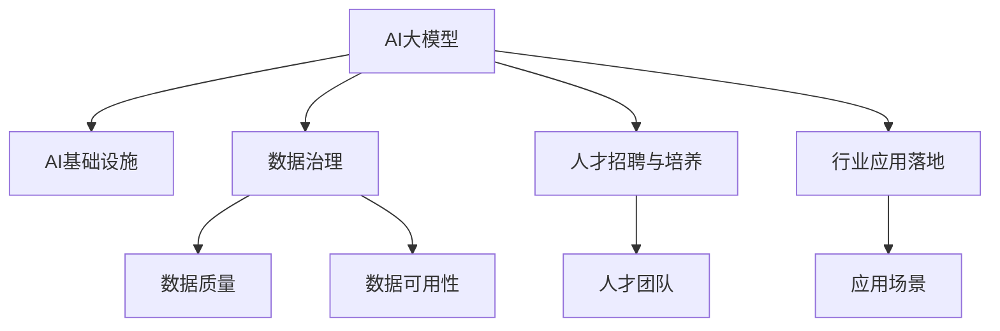

                 

# AI 大模型创业：如何利用资源优势？

> 关键词：大模型创业, 创业公司, 资源优势, AI基础设施, 云计算, 数据治理, 人才招聘

## 1. 背景介绍

### 1.1 问题由来

随着人工智能技术的迅速发展，AI大模型成为各行各业关注的焦点。它们具备强大的学习能力和泛化能力，能够在自然语言处理、计算机视觉、语音识别等众多领域发挥重要作用。但大模型的研发和应用，需要极高的技术门槛和资源投入，对创业公司而言，挑战巨大。

为了应对这些挑战，近年来，越来越多的创业公司开始探索如何利用现有资源优势，在有限的条件下实现大模型的快速迭代和应用落地。本文将深入探讨这些策略，帮助创业者了解如何在AI大模型创业中占据优势。

### 1.2 问题核心关键点

创业公司利用资源优势，主要体现在以下几个方面：

- **AI基础设施建设**：构建高性能的计算集群和存储系统，支撑大规模模型的训练和推理。
- **数据治理与获取**：整合多源数据，实现数据高效管理和治理，提升数据质量与可用性。
- **人才招聘与培养**：吸引并培养顶尖的AI人才，构建跨学科的团队。
- **行业应用落地**：将大模型应用于特定行业，创造有价值的应用场景。

这些关键点构成了创业公司成功利用资源优势的核心。以下将详细分析这些方面的策略和方法。

## 2. 核心概念与联系

### 2.1 核心概念概述

在深入讨论这些关键点之前，需要先了解几个核心概念：

- **AI大模型**：指基于深度学习技术，具有高参数量和复杂结构的大型模型，如BERT、GPT-3、ViT等。
- **创业公司**：指以技术创新为核心驱动力，专注于特定领域，致力于快速成长和市场竞争的公司。
- **AI基础设施**：指支持AI模型开发、训练、推理的软硬件环境，包括高性能计算集群、深度学习框架、存储系统等。
- **数据治理**：指通过标准化的流程和方法，确保数据的完整性、一致性和安全性，提升数据质量和可用性。
- **人才招聘与培养**：指吸引并培养顶尖的AI技术人才，建立跨学科、跨领域的人才团队。

这些概念之间的逻辑关系可以通过以下Mermaid流程图来展示：



这个流程图展示了大模型的开发、治理、人才和管理与实际应用之间的关系：

1. 大模型依赖AI基础设施，提供计算和存储支持。
2. 数据治理提升数据质量与可用性，为大模型训练和推理提供数据保障。
3. 人才招聘与培养为项目提供团队支持，是创新的根本。
4. 行业应用落地实现商业价值，检验模型的实际效果。

## 3. 核心算法原理 & 具体操作步骤
### 3.1 算法原理概述

利用AI大模型资源优势，涉及到模型训练、推理、数据治理等多个环节的优化。以下是核心的算法原理和具体操作步骤：

- **模型训练优化**：选择合适的训练策略和算法，确保模型快速收敛。
- **推理性能优化**：采用模型压缩、量化等技术，提升推理速度和效率。
- **数据治理优化**：实现数据的高效管理和利用，提升数据质量和可用性。
- **人才招聘与培养**：通过吸引和培养顶尖人才，构建高效的团队。

### 3.2 算法步骤详解

#### 3.2.1 模型训练优化

模型训练是创业公司利用AI大模型资源优势的核心环节。具体步骤如下：

1. **选择合适的训练框架和硬件**：选择如TensorFlow、PyTorch等主流深度学习框架，并在高性能计算集群上训练模型。
2. **设计高效的训练策略**：如分布式训练、混合精度训练、自动混合精度（AMP）等，以提高训练效率。
3. **优化损失函数和评估指标**：设计合理的损失函数和评估指标，如交叉熵损失、Top-1/Top-5精度等，确保模型在合理目标下训练。
4. **实施模型正则化**：使用L2正则、Dropout等技术，防止过拟合，提升模型泛化能力。
5. **监控训练过程**：通过可视化工具如TensorBoard等，实时监控训练状态，确保模型快速收敛。

#### 3.2.2 推理性能优化

推理是大模型应用落地的关键环节。为提高推理性能，可采取以下措施：

1. **模型压缩与量化**：通过剪枝、权重共享等技术，减小模型参数量，提升推理速度。采用定点量化技术，进一步降低内存和计算消耗。
2. **优化推理框架**：选择如TensorFlow Lite、ONNXRuntime等高效的推理框架，并结合特定硬件加速（如GPU、TPU等）。
3. **实现多模型部署**：将模型部署到多台服务器，实现负载均衡和容错，提升系统可用性和稳定性。

#### 3.2.3 数据治理优化

数据是大模型训练和推理的基础。数据治理策略包括：

1. **数据标注与清洗**：通过人工标注和自动化清洗，确保数据质量和一致性。
2. **数据标准化与一致性**：采用统一的数据标准，实现跨平台、跨数据源的数据一致性。
3. **数据隐私保护**：在数据收集、存储、传输等环节，采用加密、去标识化等措施，保护用户隐私。
4. **数据访问管理**：设置合理的访问权限和策略，确保数据安全和合规。

#### 3.2.4 人才招聘与培养

人才是创业公司利用AI大模型资源优势的关键因素。具体步骤包括：

1. **吸引顶尖人才**：通过提供高薪酬、福利待遇、股票期权等激励措施，吸引顶尖AI人才。
2. **建立跨学科团队**：结合计算机科学、统计学、数学、领域专家等，构建跨学科的团队，促进多领域创新。
3. **提供持续培训**：通过内训、外培、在线课程等，不断提升团队成员的专业技能和创新能力。
4. **建立激励机制**：通过绩效评估、股权激励等手段，激励员工积极参与项目，提高团队凝聚力。

### 3.3 算法优缺点

利用AI大模型资源优势，具有以下优点：

- **快速迭代**：借助高性能计算资源和优化算法，可以大幅缩短模型训练和推理时间。
- **数据驱动**：通过高效的数据治理策略，确保模型训练和推理的数据质量与可用性。
- **人才集聚**：通过吸引和培养顶尖人才，构建高效的创新团队，提高技术突破能力。
- **应用广泛**：大模型可以应用于多个行业和领域，创造广泛的商业价值。

同时，也存在一些缺点：

- **高昂成本**：高性能计算和存储资源的投入成本较高，需平衡技术投入和商业回报。
- **技术门槛高**：AI大模型的训练和推理需要高度专业化的知识和技能，对人才要求高。
- **数据隐私问题**：数据收集、存储、传输等环节需严格控制，避免隐私泄露风险。
- **模型风险**：模型训练和推理过程中的偏差和错误可能导致模型表现不稳定。

### 3.4 算法应用领域

基于AI大模型的创业，可以广泛应用于以下几个领域：

- **自然语言处理**：如问答系统、情感分析、机器翻译等。
- **计算机视觉**：如图像识别、目标检测、图像生成等。
- **语音识别与处理**：如语音识别、语音合成、语音命令解析等。
- **智能推荐系统**：如电商平台商品推荐、新闻推荐、广告推荐等。
- **医疗健康**：如疾病诊断、健康管理、药物研发等。

## 4. 数学模型和公式 & 详细讲解 & 举例说明

### 4.1 数学模型构建

在大模型创业中，数学模型的构建是确保模型性能和技术突破的基础。以下是核心数学模型的构建过程：

**数据模型**：采用数学模型描述数据特征，如高斯分布、泊松分布等，用于数据生成和模拟。

**模型训练**：利用统计学习理论，构建损失函数和优化算法，如梯度下降、Adam等，确保模型快速收敛。

**模型评估**：设计评估指标，如精度、召回率、F1-score等，用于评估模型性能。

**模型优化**：使用正则化技术、数据增强等，提升模型泛化能力和鲁棒性。

### 4.2 公式推导过程

#### 4.2.1 损失函数设计

以分类任务为例，设计损失函数如下：

$$
L(y,\hat{y}) = -\sum_{i=1}^{N} y_i \log \hat{y_i} + (1-y_i) \log (1-\hat{y_i})
$$

其中，$y$为真实标签，$\hat{y}$为模型预测输出，$N$为样本总数。

#### 4.2.2 梯度更新算法

采用梯度下降算法更新模型参数$\theta$，如下：

$$
\theta \leftarrow \theta - \eta \nabla_{\theta}L(y,\hat{y})
$$

其中，$\eta$为学习率，$\nabla_{\theta}L(y,\hat{y})$为损失函数对模型参数的梯度。

#### 4.2.3 模型正则化

引入L2正则化，防止过拟合，如下：

$$
\mathcal{L}(\theta) = L(y,\hat{y}) + \lambda \| \theta \|_2^2
$$

其中，$\lambda$为正则化系数，$\| \theta \|_2^2$为L2正则项。

### 4.3 案例分析与讲解

#### 4.3.1 文本分类任务

以文本分类任务为例，展示模型训练过程：

1. **数据准备**：收集文本数据，并进行预处理，如分词、去除停用词等。
2. **特征提取**：使用词嵌入或Transformer编码器，将文本转换为向量表示。
3. **模型构建**：构建多层感知机（MLP）或卷积神经网络（CNN），作为分类器。
4. **模型训练**：使用梯度下降算法，最小化损失函数，更新模型参数。
5. **模型评估**：在测试集上评估模型性能，调整模型参数和训练策略，提高模型泛化能力。

#### 4.3.2 图像识别任务

以图像识别任务为例，展示模型推理过程：

1. **数据准备**：收集图像数据，并进行预处理，如归一化、数据增强等。
2. **特征提取**：使用卷积神经网络（CNN）提取图像特征。
3. **模型构建**：构建全连接层或分类器，用于分类预测。
4. **模型推理**：在测试集上推理预测，输出分类结果。
5. **模型优化**：使用正则化、Dropout等技术，提升模型鲁棒性和泛化能力。

## 5. 项目实践：代码实例和详细解释说明

### 5.1 开发环境搭建

在进行AI大模型创业项目实践前，需要准备好开发环境。以下是使用Python进行TensorFlow开发的详细环境配置：

1. 安装Anaconda：从官网下载并安装Anaconda，用于创建独立的Python环境。

2. 创建并激活虚拟环境：
```bash
conda create -n tf-env python=3.8 
conda activate tf-env
```

3. 安装TensorFlow：从官网获取对应的安装命令。例如：
```bash
conda install tensorflow
```

4. 安装各类工具包：
```bash
pip install numpy pandas scikit-learn matplotlib tqdm jupyter notebook ipython
```

完成上述步骤后，即可在`tf-env`环境中开始项目实践。

### 5.2 源代码详细实现

下面以图像识别任务为例，给出使用TensorFlow对卷积神经网络进行训练和推理的代码实现。

首先，定义卷积神经网络模型：

```python
import tensorflow as tf
from tensorflow.keras import layers, models

def create_model(input_shape):
    model = models.Sequential()
    model.add(layers.Conv2D(32, (3,3), activation='relu', input_shape=input_shape))
    model.add(layers.MaxPooling2D((2,2)))
    model.add(layers.Conv2D(64, (3,3), activation='relu'))
    model.add(layers.MaxPooling2D((2,2)))
    model.add(layers.Conv2D(128, (3,3), activation='relu'))
    model.add(layers.MaxPooling2D((2,2)))
    model.add(layers.Flatten())
    model.add(layers.Dense(128, activation='relu'))
    model.add(layers.Dense(10, activation='softmax'))
    return model

input_shape = (64, 64, 3)
model = create_model(input_shape)
```

然后，定义数据集和数据增强：

```python
from tensorflow.keras.preprocessing.image import ImageDataGenerator

train_datagen = ImageDataGenerator(rescale=1./255,
                                  shear_range=0.2,
                                  zoom_range=0.2,
                                  horizontal_flip=True)

test_datagen = ImageDataGenerator(rescale=1./255)

train_generator = train_datagen.flow_from_directory('train_dir',
                                                  target_size=input_shape[:2],
                                                  batch_size=32,
                                                  class_mode='categorical')

test_generator = test_datagen.flow_from_directory('test_dir',
                                                 target_size=input_shape[:2],
                                                 batch_size=32,
                                                 class_mode='categorical')
```

接着，定义模型编译和训练：

```python
model.compile(optimizer='adam',
              loss='categorical_crossentropy',
              metrics=['accuracy'])

model.fit_generator(train_generator,
                    steps_per_epoch=100,
                    epochs=10,
                    validation_data=test_generator,
                    validation_steps=50)
```

最后，进行模型推理：

```python
import numpy as np
from tensorflow.keras.preprocessing import image

img = image.load_img('test.jpg', target_size=(64, 64))
img_array = image.img_to_array(img)
img_array = np.expand_dims(img_array, axis=0)
prediction = model.predict(img_array)
```

### 5.3 代码解读与分析

让我们再详细解读一下关键代码的实现细节：

**模型定义**：
```python
def create_model(input_shape):
    model = models.Sequential()
    model.add(layers.Conv2D(32, (3,3), activation='relu', input_shape=input_shape))
    model.add(layers.MaxPooling2D((2,2)))
    model.add(layers.Conv2D(64, (3,3), activation='relu'))
    model.add(layers.MaxPooling2D((2,2)))
    model.add(layers.Conv2D(128, (3,3), activation='relu'))
    model.add(layers.MaxPooling2D((2,2)))
    model.add(layers.Flatten())
    model.add(layers.Dense(128, activation='relu'))
    model.add(layers.Dense(10, activation='softmax'))
    return model

input_shape = (64, 64, 3)
model = create_model(input_shape)
```
通过Keras定义了一个简单的卷积神经网络模型，包含卷积层、池化层、全连接层等，用于图像分类。

**数据预处理**：
```python
from tensorflow.keras.preprocessing.image import ImageDataGenerator

train_datagen = ImageDataGenerator(rescale=1./255,
                                  shear_range=0.2,
                                  zoom_range=0.2,
                                  horizontal_flip=True)

test_datagen = ImageDataGenerator(rescale=1./255)

train_generator = train_datagen.flow_from_directory('train_dir',
                                                  target_size=input_shape[:2],
                                                  batch_size=32,
                                                  class_mode='categorical')

test_generator = test_datagen.flow_from_directory('test_dir',
                                                 target_size=input_shape[:2],
                                                 batch_size=32,
                                                 class_mode='categorical')
```
使用Keras的ImageDataGenerator对数据进行预处理和增强，包括归一化、旋转、缩放和翻转等。

**模型编译和训练**：
```python
model.compile(optimizer='adam',
              loss='categorical_crossentropy',
              metrics=['accuracy'])

model.fit_generator(train_generator,
                    steps_per_epoch=100,
                    epochs=10,
                    validation_data=test_generator,
                    validation_steps=50)
```
定义模型的编译参数，包括优化器、损失函数和评估指标。使用fit_generator函数进行模型训练，设置训练和验证数据集。

**模型推理**：
```python
import numpy as np
from tensorflow.keras.preprocessing import image

img = image.load_img('test.jpg', target_size=(64, 64))
img_array = image.img_to_array(img)
img_array = np.expand_dims(img_array, axis=0)
prediction = model.predict(img_array)
```
使用预训练好的模型进行图像推理，得到分类预测结果。

## 6. 实际应用场景

### 6.1 智能推荐系统

AI大模型在智能推荐系统中的应用非常广泛，如电商平台、视频平台等。通过分析用户行为数据，构建推荐模型，为用户推荐相关商品或内容。

具体步骤如下：

1. **数据收集**：收集用户浏览、点击、购买等行为数据，构建用户行为矩阵。
2. **特征提取**：将用户和商品/内容特征转化为向量表示，使用卷积神经网络或Transformer模型进行特征提取。
3. **模型训练**：构建推荐模型，如协同过滤、基于深度学习的推荐系统等，进行模型训练。
4. **模型部署**：将训练好的模型部署到线上，进行实时推荐。
5. **模型优化**：通过在线A/B测试等手段，不断优化推荐策略和模型性能。

### 6.2 智能客服系统

智能客服系统利用AI大模型进行自然语言处理和对话生成，提供高效、个性化的客户服务。

具体步骤如下：

1. **数据收集**：收集历史客服对话记录，构建对话语料库。
2. **模型训练**：使用语言模型（如GPT-3、BERT等）进行微调，训练对话生成模型。
3. **对话交互**：系统接收用户输入，利用微调后的模型进行回答，生成自然流畅的对话。
4. **模型优化**：通过用户反馈和A/B测试等手段，不断优化对话策略和模型性能。

### 6.3 医疗影像分析

AI大模型在医疗影像分析中，可以用于病变检测、影像分割等任务。

具体步骤如下：

1. **数据收集**：收集大量医疗影像数据，包括正常影像和病理性影像。
2. **特征提取**：使用卷积神经网络提取影像特征。
3. **模型训练**：构建病变检测或分割模型，如U-Net、ResNet等，进行模型训练。
4. **模型部署**：将训练好的模型部署到医疗系统中，进行实时影像分析。
5. **模型优化**：通过医生反馈和评估，不断优化模型性能。

### 6.4 未来应用展望

随着AI大模型的不断发展和优化，其应用场景将不断拓展，带来更多的创新和突破。

1. **智能城市**：在智能交通、公共安全、环境监测等方面，利用AI大模型进行数据分析和决策支持，提升城市治理智能化水平。
2. **金融科技**：在信用评估、风险控制、欺诈检测等方面，利用AI大模型进行智能分析和预测，提升金融服务质量和效率。
3. **教育科技**：在个性化学习、智能辅导、教育资源推荐等方面，利用AI大模型进行知识创新和教育模式变革。
4. **智能制造**：在生产调度、质量控制、设备维护等方面，利用AI大模型进行智能分析和决策，提升制造效率和质量。

## 7. 工具和资源推荐

### 7.1 学习资源推荐

为了帮助创业者系统掌握AI大模型的开发和应用，推荐以下学习资源：

1. **TensorFlow官方文档**：详细介绍了TensorFlow的开发环境搭建、API使用、模型训练、推理等，是TensorFlow开发者的必备指南。
2. **PyTorch官方文档**：详细介绍了PyTorch的开发环境搭建、API使用、模型训练、推理等，是PyTorch开发者的必备指南。
3. **Keras官方文档**：详细介绍了Keras的开发环境搭建、API使用、模型训练、推理等，是Keras开发者的必备指南。
4. **《深度学习》教材**：由Goodfellow等人编写，系统介绍了深度学习的基本概念、算法和应用，是深度学习领域的经典教材。
5. **Coursera深度学习课程**：由Andrew Ng等人开设，涵盖了深度学习的基本理论和实践技术，适合初学者和进阶者。

通过这些学习资源，创业者可以系统掌握AI大模型的开发和应用，提高技术水平和项目成功率。

### 7.2 开发工具推荐

为了提高AI大模型的开发效率，推荐以下开发工具：

1. **Jupyter Notebook**：开源的Python交互式开发环境，适合数据处理、模型训练、推理等开发任务。
2. **TensorBoard**：TensorFlow的可视化工具，用于监控模型训练状态、评估模型性能等。
3. **Weights & Biases**：模型实验跟踪工具，用于记录模型训练过程、评估模型性能等。
4. **AWS SageMaker**：亚马逊提供的云机器学习平台，支持模型的训练、推理、部署等全流程管理。
5. **Google Cloud AI Platform**：谷歌提供的云AI平台，支持模型的训练、推理、部署等全流程管理。

合理利用这些开发工具，可以显著提升AI大模型的开发效率和效果，缩短项目周期。

### 7.3 相关论文推荐

AI大模型的发展离不开学界的研究支持。以下是几篇经典的相关论文，推荐阅读：

1. **ImageNet Classification with Deep Convolutional Neural Networks**：AlexNet的论文，展示了卷积神经网络在图像分类任务中的强大能力。
2. **Inception-v3, Inception-resnet and the Impact of Resnet Blocks on ImageNet Classification**：Inception网络的论文，展示了多层次卷积网络的结构优化。
3. **BERT: Pre-training of Deep Bidirectional Transformers for Language Understanding**：BERT的论文，展示了预训练语言模型的强大泛化能力。
4. **GPT-3: Language Models are Unsupervised Multitask Learners**：GPT-3的论文，展示了大语言模型的零样本学习能力。
5. **AdaLoRA: Adaptive Low-Rank Adaptation for Parameter-Efficient Fine-Tuning**：AdaLoRA的论文，展示了参数高效微调方法的性能提升。

这些论文代表了AI大模型的发展脉络，通过学习这些前沿成果，创业者可以更好地把握技术方向，推进项目落地。

## 8. 总结：未来发展趋势与挑战

### 8.1 总结

本文对利用AI大模型资源优势的创业实践进行了全面系统的介绍。首先，详细分析了创业公司利用AI大模型的主要策略，包括AI基础设施建设、数据治理、人才招聘与培养、行业应用落地等方面。其次，结合数学模型构建和代码实例，展示了模型训练、推理和优化的具体过程。最后，展望了AI大模型的未来应用前景，并推荐了相关的学习资源和开发工具。

通过本文的梳理，可以看到，AI大模型创业不仅需要技术上的突破，还需要对资源优势的合理利用。只有结合多方面的努力，才能在激烈的市场竞争中占据优势，实现商业价值和创新突破。

### 8.2 未来发展趋势

展望未来，AI大模型创业将呈现以下几个发展趋势：

1. **模型规模增大**：随着算力成本的下降和数据规模的扩张，AI大模型的参数量和计算资源将不断增大。超大规模模型将能够处理更加复杂和多样化的任务。
2. **模型优化多样化**：除了传统的模型训练和推理优化，将涌现更多参数高效、计算高效的优化方法，如模型压缩、量化、蒸馏等，提升模型资源利用率和部署效率。
3. **数据治理智能化**：采用更多智能数据治理技术，如数据联邦、隐私保护等，实现数据的高效管理和利用。
4. **人才集聚多样化**：除了AI技术人才，将更加注重跨学科、跨领域的人才集聚，提升团队的创新能力和问题解决能力。
5. **应用场景泛化**：AI大模型将应用于更多行业和领域，推动各行各业的智能化转型和创新。

### 8.3 面临的挑战

尽管AI大模型创业具有广阔的发展前景，但在迈向市场化应用的过程中，仍面临诸多挑战：

1. **技术门槛高**：AI大模型的开发和应用需要高度专业化的知识和技能，对创业公司的技术储备和人才储备提出高要求。
2. **数据隐私问题**：数据收集、存储、传输等环节需严格控制，避免隐私泄露风险。
3. **市场竞争激烈**：AI大模型创业市场竞争激烈，需要不断创新和优化，才能在市场中获得优势。
4. **商业模式不明朗**：AI大模型的商业化模式尚未成熟，需要探索更多的盈利途径和商业路径。

### 8.4 研究展望

面对AI大模型创业所面临的挑战，未来的研究需要在以下几个方面寻求新的突破：

1. **技术突破**：开发更多参数高效、计算高效的优化方法，提升模型资源利用率和部署效率。
2. **数据治理**：采用更多智能数据治理技术，实现数据的高效管理和利用。
3. **人才集聚**：注重跨学科、跨领域的人才集聚，提升团队的创新能力和问题解决能力。
4. **商业模式创新**：探索更多的盈利途径和商业路径，实现AI大模型的市场化应用。

这些研究方向的探索，必将引领AI大模型创业迈向更高的台阶，为更多行业带来创新和突破。面向未来，AI大模型创业需要更多学界和产业界的共同努力，才能真正实现技术突破和市场落地。

## 9. 附录：常见问题与解答

**Q1：AI大模型创业需要哪些核心技术？**

A: AI大模型创业需要以下核心技术：
1. **AI基础设施建设**：构建高性能的计算集群和存储系统。
2. **数据治理与获取**：整合多源数据，实现数据高效管理和治理。
3. **人才招聘与培养**：吸引并培养顶尖的AI人才，构建跨学科的团队。
4. **模型训练与推理**：构建高性能的模型，进行模型训练和推理优化。

**Q2：如何选择合适的AI大模型进行创业？**

A: 选择合适的AI大模型进行创业，需要考虑以下因素：
1. **任务需求**：根据具体应用场景，选择适合的模型类型和架构。
2. **数据规模**：考虑数据规模和质量，选择参数规模和训练效率合适的模型。
3. **技术储备**：评估团队的技术水平和资源，选择可行性较高的模型。
4. **商业模式**：考虑模型的商业化模式，选择具有市场潜力和盈利空间的项目。

**Q3：AI大模型创业有哪些主要成本？**

A: AI大模型创业的主要成本包括：
1. **计算资源**：高性能计算集群和存储系统的建设、维护和升级成本。
2. **数据治理**：数据收集、标注、清洗、治理等环节的成本。
3. **人才招聘**：顶尖AI人才的招聘和培养成本。
4. **技术研发**：模型开发、训练、部署、优化等环节的成本。

**Q4：如何降低AI大模型创业的资源成本？**

A: 降低AI大模型创业的资源成本，可以采取以下措施：
1. **利用云平台**：选择云服务提供商（如AWS、Google Cloud、阿里云等），利用其基础设施资源，降低计算和存储成本。
2. **采用开源工具**：使用开源的深度学习框架和工具，降低开发和部署成本。
3. **数据共享与协作**：参与开源数据集和社区项目，共享数据资源，降低数据获取成本。
4. **模型压缩与量化**：采用模型压缩和量化技术，降低模型推理资源消耗，提高部署效率。

**Q5：如何提高AI大模型的商业化效果？**

A: 提高AI大模型的商业化效果，可以采取以下措施：
1. **选择合适的应用场景**：选择具有广泛市场前景和商业价值的应用场景，提升模型应用效果。
2. **用户需求分析**：深入了解用户需求，优化模型设计，提供更好的用户体验。
3. **市场推广策略**：通过市场营销、合作推广等方式，提高模型知名度和市场影响力。
4. **服务与支持**：提供优质的技术支持和售后服务，增强用户粘性和满意度。

---

作者：禅与计算机程序设计艺术 / Zen and the Art of Computer Programming

