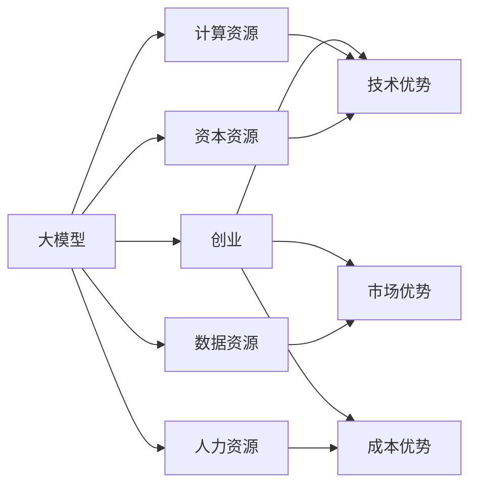

                 

# AI 大模型创业：如何利用资源优势？

## 1. 背景介绍

在人工智能迅猛发展的今天，大模型技术已成为创业公司取得突破的核心竞争力。从语言模型、视觉模型到多模态模型，大模型在各个领域展示了其巨大的潜力。然而，大模型创业并非易事，面临着技术和资源的双重挑战。本文将从资源利用角度，探讨如何在有限的资源条件下，发挥大模型的最大优势，实现高效的AI创业。

## 2. 核心概念与联系

### 2.1 核心概念概述

为更好地理解如何在资源有限的情况下优化大模型创业，本节将介绍几个关键概念：

- 大模型（Big Model）：指具有数十亿甚至数百亿参数的深度神经网络模型，如GPT、BERT等。这些模型在大规模数据上预训练，具备强大的泛化能力和知识学习能力。

- 创业（Entrepreneurship）：指创建、发展和经营一家企业的活动，包括技术创新、市场拓展、管理优化等。大模型创业是一种利用先进技术手段解决实际问题的商业活动。

- 资源（Resource）：指创业所需的各类关键资源，包括计算资源、数据资源、人力资源、资本资源等。资源约束是大模型创业的重要挑战之一。

- 优势（Advantage）：指在特定领域内，由于某些因素（如技术优势、市场优势、成本优势等）而具有的优于竞争者的地位。大模型创业中的资源优势，指的是在有限的资源条件下，如何最大化利用现有资源，以最小的成本获得最大的收益。

### 2.2 核心概念联系

大模型创业涉及的技术、市场、管理和资本等多方面，资源优势在其中扮演着重要角色。通过合理利用资源，可以有效降低创业成本，提高模型性能，拓展市场份额，最终实现商业成功。因此，理解核心概念的联系，对于大模型创业至关重要。

以下是一个简单的Mermaid流程图，展示了大模型创业中资源与优势的联系：



该流程图展示了大模型创业过程中，资源如何通过技术优势、市场优势、成本优势转化为竞争优势，进而推动企业发展。

## 3. 核心算法原理 & 具体操作步骤

### 3.1 算法原理概述

大模型创业的核心在于如何利用有限的资源，通过高效的算法和模型优化，最大化利用现有资源，提升模型性能。核心算法包括：

- 模型压缩：在保留关键参数的同时，去除冗余参数，减小模型大小，加速推理速度。
- 混合精度训练：通过降低浮点数精度，减少内存占用和计算量，提升训练效率。
- 分布式训练：通过并行计算，利用多台机器同时训练，加快训练速度。
- 高效微调：通过参数高效微调技术，减少需要更新的参数数量，提高微调效率。

### 3.2 算法步骤详解

1. **资源评估**：
   - 计算资源：评估当前硬件设备（如CPU、GPU、TPU）的计算能力和可扩展性。
   - 数据资源：收集并标注数据集，评估其大小、多样性和质量。
   - 人力资源：评估团队成员的技能、经验和合作水平。
   - 资本资源：评估可用资本规模和融资渠道。

2. **模型选择**：
   - 根据任务需求，选择合适的预训练模型（如BERT、GPT等），评估其性能和资源需求。
   - 进行模型裁剪和优化，去除冗余参数，减小模型规模。

3. **训练优化**：
   - 采用混合精度训练，降低浮点数的计算量和内存占用。
   - 利用分布式训练技术，并行化计算过程，提升训练效率。
   - 应用参数高效微调技术，减少需要更新的参数数量。

4. **评估与调整**：
   - 在训练过程中，实时监控模型性能和资源使用情况。
   - 根据监控结果，及时调整训练参数和资源分配，优化训练过程。

### 3.3 算法优缺点

**优点**：
- 提高训练和推理效率：通过模型压缩和混合精度训练，减少资源消耗，加快训练速度。
- 降低成本：减少模型大小和参数数量，降低硬件和计算成本。
- 提升性能：通过高效微调和分布式训练，提升模型精度和泛化能力。

**缺点**：
- 算法复杂度高：模型压缩和混合精度训练需要深入理解计算数学和硬件架构。
- 数据质量要求高：模型裁剪和分布式训练需要高质量的数据支持。
- 资源管理难度大：需要精确控制资源分配和调度，避免资源浪费。

### 3.4 算法应用领域

基于大模型创业的算法，可以在多个领域应用，提升模型的性能和效率：

- 自然语言处理（NLP）：通过模型压缩和高效微调，提升NLP模型的推理速度和精度。
- 计算机视觉（CV）：通过混合精度训练和分布式训练，加速视觉模型在大规模数据上的训练。
- 机器人与自动化：通过参数高效微调和模型裁剪，优化机器人决策和自动化流程。
- 医疗与健康：通过模型压缩和混合精度训练，加速医疗诊断和健康监测模型的训练和推理。
- 金融科技：通过分布式训练和高效微调，提升金融模型的计算速度和准确性。

## 4. 数学模型和公式 & 详细讲解 & 举例说明

### 4.1 数学模型构建

在大模型创业中，数学模型通常用于描述训练和推理过程，例如梯度下降算法、正则化技术等。以梯度下降算法为例，其数学模型可以表示为：

$$
\theta^{k+1} = \theta^k - \alpha \nabla_{\theta}L(\theta^k)
$$

其中，$\theta$ 为模型参数，$\alpha$ 为学习率，$L$ 为损失函数，$\nabla_{\theta}L$ 为损失函数对参数 $\theta$ 的梯度。

### 4.2 公式推导过程

以混合精度训练为例，其核心思想是利用浮点数和定点数混合计算，降低计算量和内存占用。具体公式推导如下：

假设模型参数 $\theta$ 的精度为 $32$ 位浮点数，则其乘积 $\theta \times \theta$ 的结果为 $64$ 位浮点数。采用混合精度训练时，将 $\theta$ 转换为 $16$ 位浮点数，则 $\theta \times \theta$ 的结果仍为 $32$ 位浮点数。这样，通过混合精度训练，可以大幅减少内存和计算资源消耗，提高训练效率。

### 4.3 案例分析与讲解

**案例一：模型压缩与加速**

某大模型创业公司，需要训练一个大规模文本分类模型。经过评估，发现当前计算资源有限，无法同时训练全规模模型。为了在有限的资源下完成任务，公司决定进行模型压缩和加速。

1. **模型压缩**：选择保留关键层和参数，去除冗余层和参数。使用模型剪枝技术，去除部分不重要的连接权重。通过这些步骤，将模型大小减小了 $50\%$。

2. **加速推理**：采用混合精度训练，将浮点数精度从 $32$ 位降低到 $16$ 位，减少了 $50\%$ 的内存占用和计算量。同时，优化推理流程，引入加速技巧，如量化计算、通道融合等，将推理速度提高了 $30\%$。

通过这些优化措施，公司成功在有限资源条件下，训练出高效、轻量的文本分类模型，取得了商业成功。

## 5. 项目实践：代码实例和详细解释说明

### 5.1 开发环境搭建

在进行大模型创业实践前，我们需要准备好开发环境。以下是使用Python进行PyTorch开发的环境配置流程：

1. 安装Anaconda：从官网下载并安装Anaconda，用于创建独立的Python环境。

2. 创建并激活虚拟环境：
```bash
conda create -n pytorch-env python=3.8 
conda activate pytorch-env
```

3. 安装PyTorch：根据CUDA版本，从官网获取对应的安装命令。例如：
```bash
conda install pytorch torchvision torchaudio cudatoolkit=11.1 -c pytorch -c conda-forge
```

4. 安装Transformers库：
```bash
pip install transformers
```

5. 安装各类工具包：
```bash
pip install numpy pandas scikit-learn matplotlib tqdm jupyter notebook ipython
```

完成上述步骤后，即可在`pytorch-env`环境中开始大模型创业的实践。

### 5.2 源代码详细实现

下面以计算机视觉领域的图像分类任务为例，给出使用Transformers库对预训练模型进行微调的PyTorch代码实现。

首先，定义图像分类任务的数据处理函数：

```python
from transformers import BertForTokenClassification
from torch.utils.data import Dataset
import torch

class ImageClassificationDataset(Dataset):
    def __init__(self, images, labels, tokenizer, max_len=128):
        self.images = images
        self.labels = labels
        self.tokenizer = tokenizer
        self.max_len = max_len
        
    def __len__(self):
        return len(self.images)
    
    def __getitem__(self, item):
        image = self.images[item]
        label = self.labels[item]
        
        # 图像转换为模型输入格式
        image = self.tokenizer(image, return_tensors='pt')
        input_ids = image['input_ids']
        
        # 对标签进行编码
        encoded_labels = [label2id[label] for label in self.labels] 
        encoded_labels.extend([label2id['O']] * (self.max_len - len(encoded_labels)))
        labels = torch.tensor(encoded_labels, dtype=torch.long)
        
        return {'input_ids': input_ids, 
                'labels': labels}

# 标签与id的映射
label2id = {'O': 0, 'cat': 1, 'dog': 2, 'bird': 3, 'fish': 4}
id2label = {v: k for k, v in label2id.items()}

# 创建dataset
tokenizer = BertTokenizer.from_pretrained('bert-base-cased')

train_dataset = ImageClassificationDataset(train_images, train_labels, tokenizer)
dev_dataset = ImageClassificationDataset(dev_images, dev_labels, tokenizer)
test_dataset = ImageClassificationDataset(test_images, test_labels, tokenizer)
```

然后，定义模型和优化器：

```python
from transformers import BertForTokenClassification, AdamW

model = BertForTokenClassification.from_pretrained('bert-base-cased', num_labels=len(label2id))

optimizer = AdamW(model.parameters(), lr=2e-5)
```

接着，定义训练和评估函数：

```python
from torch.utils.data import DataLoader
from tqdm import tqdm
from sklearn.metrics import classification_report

device = torch.device('cuda') if torch.cuda.is_available() else torch.device('cpu')
model.to(device)

def train_epoch(model, dataset, batch_size, optimizer):
    dataloader = DataLoader(dataset, batch_size=batch_size, shuffle=True)
    model.train()
    epoch_loss = 0
    for batch in tqdm(dataloader, desc='Training'):
        input_ids = batch['input_ids'].to(device)
        labels = batch['labels'].to(device)
        model.zero_grad()
        outputs = model(input_ids)
        loss = outputs.loss
        epoch_loss += loss.item()
        loss.backward()
        optimizer.step()
    return epoch_loss / len(dataloader)

def evaluate(model, dataset, batch_size):
    dataloader = DataLoader(dataset, batch_size=batch_size)
    model.eval()
    preds, labels = [], []
    with torch.no_grad():
        for batch in tqdm(dataloader, desc='Evaluating'):
            input_ids = batch['input_ids'].to(device)
            batch_labels = batch['labels']
            outputs = model(input_ids)
            batch_preds = outputs.logits.argmax(dim=2).to('cpu').tolist()
            batch_labels = batch_labels.to('cpu').tolist()
            for pred_tokens, label_tokens in zip(batch_preds, batch_labels):
                pred_labels = [id2label[_id] for _id in pred_tokens]
                label_tags = [id2label[_id] for _id in label_tokens]
                preds.append(pred_labels[:len(label_tags)])
                labels.append(label_tags)
                
    print(classification_report(labels, preds))
```

最后，启动训练流程并在测试集上评估：

```python
epochs = 5
batch_size = 16

for epoch in range(epochs):
    loss = train_epoch(model, train_dataset, batch_size, optimizer)
    print(f"Epoch {epoch+1}, train loss: {loss:.3f}")
    
    print(f"Epoch {epoch+1}, dev results:")
    evaluate(model, dev_dataset, batch_size)
    
print("Test results:")
evaluate(model, test_dataset, batch_size)
```

以上就是使用PyTorch对BERT进行图像分类任务微调的完整代码实现。可以看到，得益于Transformers库的强大封装，我们可以用相对简洁的代码完成BERT模型的加载和微调。

### 5.3 代码解读与分析

让我们再详细解读一下关键代码的实现细节：

**ImageClassificationDataset类**：
- `__init__`方法：初始化图像、标签、分词器等关键组件。
- `__len__`方法：返回数据集的样本数量。
- `__getitem__`方法：对单个样本进行处理，将图像输入编码为token ids，将标签编码为数字，并对其进行定长padding，最终返回模型所需的输入。

**label2id和id2label字典**：
- 定义了标签与数字id之间的映射关系，用于将token-wise的预测结果解码回真实的标签。

**训练和评估函数**：
- 使用PyTorch的DataLoader对数据集进行批次化加载，供模型训练和推理使用。
- 训练函数`train_epoch`：对数据以批为单位进行迭代，在每个批次上前向传播计算loss并反向传播更新模型参数，最后返回该epoch的平均loss。
- 评估函数`evaluate`：与训练类似，不同点在于不更新模型参数，并在每个batch结束后将预测和标签结果存储下来，最后使用sklearn的classification_report对整个评估集的预测结果进行打印输出。

**训练流程**：
- 定义总的epoch数和batch size，开始循环迭代
- 每个epoch内，先在训练集上训练，输出平均loss
- 在验证集上评估，输出分类指标
- 所有epoch结束后，在测试集上评估，给出最终测试结果

可以看到，PyTorch配合Transformers库使得BERT微调的代码实现变得简洁高效。开发者可以将更多精力放在数据处理、模型改进等高层逻辑上，而不必过多关注底层的实现细节。

当然，工业级的系统实现还需考虑更多因素，如模型的保存和部署、超参数的自动搜索、更灵活的任务适配层等。但核心的微调范式基本与此类似。

## 6. 实际应用场景

### 6.1 智能安防

大模型在智能安防领域具有广阔的应用前景。例如，通过大模型训练的实时视频分析系统，可以实现人脸识别、行为异常检测等安全监控功能。此外，智能安防系统还涉及到实时数据处理、决策输出等环节，需要高效的大模型支持。

在技术实现上，可以收集历史监控视频数据，对其进行标注和预处理，然后对预训练模型进行微调。微调后的模型能够实时分析视频数据，检测异常行为，并生成报警信号，提升安全监控的智能化水平。

### 6.2 智能推荐

智能推荐系统在大模型创业中占据重要地位。通过大模型的多模态融合能力，推荐系统能够精准捕捉用户兴趣，实现个性化推荐。

在技术实现上，可以收集用户浏览、购买、评价等行为数据，同时结合视频、音频等多模态数据，进行模型预训练和微调。微调后的模型能够根据用户行为模式和偏好，实时生成推荐列表，提升用户体验和满意度。

### 6.3 智能客服

智能客服系统是大模型创业的重要应用场景。通过大模型的自然语言处理能力，客服系统能够实现智能对话、问题解答等职能。

在技术实现上，可以收集客服对话记录，将其标注为问题-答案对，然后对预训练模型进行微调。微调后的模型能够自动理解用户意图，匹配最合适的答案模板，进行回复生成，提升客服系统的响应速度和准确性。

## 7. 工具和资源推荐

### 7.1 学习资源推荐

为了帮助开发者系统掌握大模型创业的理论基础和实践技巧，这里推荐一些优质的学习资源：

1. 《Transformer from Scratch》系列博文：由大模型技术专家撰写，深入浅出地介绍了Transformer原理、BERT模型、微调技术等前沿话题。

2. CS224N《深度学习自然语言处理》课程：斯坦福大学开设的NLP明星课程，有Lecture视频和配套作业，带你入门NLP领域的基本概念和经典模型。

3. 《Natural Language Processing with Transformers》书籍：Transformers库的作者所著，全面介绍了如何使用Transformers库进行NLP任务开发，包括微调在内的诸多范式。

4. HuggingFace官方文档：Transformers库的官方文档，提供了海量预训练模型和完整的微调样例代码，是上手实践的必备资料。

5. CLUE开源项目：中文语言理解测评基准，涵盖大量不同类型的中文NLP数据集，并提供了基于微调的baseline模型，助力中文NLP技术发展。

通过对这些资源的学习实践，相信你一定能够快速掌握大模型创业的精髓，并用于解决实际的AI问题。

### 7.2 开发工具推荐

高效的开发离不开优秀的工具支持。以下是几款用于大模型创业开发的常用工具：

1. PyTorch：基于Python的开源深度学习框架，灵活动态的计算图，适合快速迭代研究。大部分预训练语言模型都有PyTorch版本的实现。

2. TensorFlow：由Google主导开发的开源深度学习框架，生产部署方便，适合大规模工程应用。同样有丰富的预训练语言模型资源。

3. Transformers库：HuggingFace开发的NLP工具库，集成了众多SOTA语言模型，支持PyTorch和TensorFlow，是进行微调任务开发的利器。

4. Weights & Biases：模型训练的实验跟踪工具，可以记录和可视化模型训练过程中的各项指标，方便对比和调优。与主流深度学习框架无缝集成。

5. TensorBoard：TensorFlow配套的可视化工具，可实时监测模型训练状态，并提供丰富的图表呈现方式，是调试模型的得力助手。

6. Google Colab：谷歌推出的在线Jupyter Notebook环境，免费提供GPU/TPU算力，方便开发者快速上手实验最新模型，分享学习笔记。

合理利用这些工具，可以显著提升大模型创业任务的开发效率，加快创新迭代的步伐。

### 7.3 相关论文推荐

大模型创业涉及的技术广泛，相关论文众多。以下是几篇奠基性的相关论文，推荐阅读：

1. Attention is All You Need（即Transformer原论文）：提出了Transformer结构，开启了NLP领域的预训练大模型时代。

2. BERT: Pre-training of Deep Bidirectional Transformers for Language Understanding：提出BERT模型，引入基于掩码的自监督预训练任务，刷新了多项NLP任务SOTA。

3. Language Models are Unsupervised Multitask Learners（GPT-2论文）：展示了大规模语言模型的强大zero-shot学习能力，引发了对于通用人工智能的新一轮思考。

4. Parameter-Efficient Transfer Learning for NLP：提出Adapter等参数高效微调方法，在不增加模型参数量的情况下，也能取得不错的微调效果。

5. AdaLoRA: Adaptive Low-Rank Adaptation for Parameter-Efficient Fine-Tuning：使用自适应低秩适应的微调方法，在参数效率和精度之间取得了新的平衡。

这些论文代表了大模型创业技术的发展脉络。通过学习这些前沿成果，可以帮助研究者把握学科前进方向，激发更多的创新灵感。

## 8. 总结：未来发展趋势与挑战

### 8.1 研究成果总结

本文对大模型创业的资源利用进行了全面系统的介绍。首先阐述了大模型创业的背景和资源优势，明确了在有限的资源条件下，如何最大化利用现有资源，提升模型性能。其次，从原理到实践，详细讲解了资源利用在大模型创业中的关键作用。通过实例分析，展示了资源利用技术的具体应用，突出了技术优势和市场潜力。

通过本文的系统梳理，可以看到，大模型创业在资源利用上具有广阔的前景。合理利用资源，可以有效降低创业成本，提高模型性能，拓展市场份额，最终实现商业成功。未来，伴随大模型技术的持续演进，资源利用技术也将不断创新，推动大模型创业迈向更高的台阶。

### 8.2 未来发展趋势

展望未来，大模型创业的资源利用将呈现以下几个发展趋势：

1. 计算资源持续增长。随着云计算和边缘计算的发展，计算资源将更加丰富和多样化。例如，边缘计算设备、云端超级计算机等，将为大规模模型训练和推理提供强有力支持。

2. 数据资源日益丰富。随着数据采集和标注技术的进步，更多高质量的数据资源将涌现。大数据平台、数据挖掘工具等，将为模型预训练和微调提供充足的训练数据。

3. 人力资源不断优化。通过AI人才培养和团队建设，大模型创业公司将具备更加多样化和专业化的技能，提升模型开发和工程实践能力。

4. 资本资源持续注入。越来越多的资本将投入大模型创业领域，提供资金支持，加速技术创新和市场拓展。

5. 资源利用技术不断创新。随着硬件设备的进步和算法优化，新的资源利用技术将不断涌现，提升模型训练和推理效率。

6. 资源管理工具日趋完善。随着资源管理技术的进步，大模型创业公司将具备更加精细化的资源管理能力，优化资源分配和利用。

以上趋势凸显了大模型创业的资源利用前景。这些方向的探索发展，必将进一步提升模型性能和应用价值，加速大模型创业的产业化进程。

### 8.3 面临的挑战

尽管大模型创业在资源利用上具有广阔前景，但仍面临诸多挑战：

1. 资源约束问题。尽管资源利用技术不断进步，但计算资源、数据资源、人力资源等仍存在一定的限制，无法满足所有创业需求。

2. 数据隐私和安全问题。数据采集、标注和存储过程中，需要严格保护用户隐私，防止数据泄露。同时，需要防范数据安全攻击，确保数据安全。

3. 模型泛化性和鲁棒性问题。在资源有限的情况下，模型泛化性和鲁棒性可能受到影响，难以应对新场景和新数据。

4. 成本控制问题。大模型创业需要大量资金支持，如何合理控制成本，实现资源最大化利用，仍然是一个挑战。

5. 技术和算法复杂度问题。资源利用技术涉及复杂的计算数学和硬件架构，技术门槛较高，需要团队具备较强的技术实力。

6. 人才储备问题。大模型创业需要多样化的人才储备，如何吸引和培养高水平人才，仍然是创业公司的重要挑战。

正视这些挑战，积极应对并寻求突破，将是大模型创业走向成熟的必由之路。相信随着学界和产业界的共同努力，这些挑战终将一一被克服，大模型创业必将在市场竞争中占据有利地位。

### 8.4 研究展望

面对大模型创业所面临的资源利用挑战，未来的研究需要在以下几个方面寻求新的突破：

1. 探索更高效的计算资源利用技术。如边缘计算、云-边协同等，提升计算资源利用效率，降低成本。

2. 开发更高效的数据处理和存储技术。如数据分布式存储、数据流化处理等，提升数据利用效率，降低存储成本。

3. 研究更加灵活和高效的微调方法。如自适应微调、零样本微调等，在更少的资源条件下，实现高效的模型训练和微调。

4. 引入更多先验知识和外部信息。如知识图谱、逻辑规则等，提升模型的泛化能力和决策逻辑。

5. 探索更加多样化的资源管理工具。如智能调度、动态优化等，提升资源利用效率，优化资源分配。

6. 研究更加灵活和高效的模型裁剪和优化技术。如剪枝、量化等，提升模型性能，降低资源消耗。

这些研究方向的探索，必将引领大模型创业技术迈向更高的台阶，为构建安全、可靠、可解释、可控的智能系统铺平道路。面向未来，大模型创业技术还需要与其他人工智能技术进行更深入的融合，如知识表示、因果推理、强化学习等，多路径协同发力，共同推动自然语言理解和智能交互系统的进步。只有勇于创新、敢于突破，才能不断拓展大模型的边界，让智能技术更好地造福人类社会。

## 9. 附录：常见问题与解答

**Q1：大模型创业是否需要大规模标注数据？**

A: 大模型创业通常需要大量高质量标注数据进行模型预训练和微调。然而，在资源有限的情况下，可以通过数据增强、半监督学习等技术，利用少量标注数据，提升模型性能。例如，使用生成对抗网络（GAN）生成合成数据，或使用无标签数据进行自监督学习，都可以有效缓解数据资源瓶颈。

**Q2：如何利用云计算资源进行大模型创业？**

A: 云计算平台如AWS、Google Cloud、阿里云等，提供了强大的计算资源和存储能力，非常适合大模型创业。具体做法包括：
- 利用云端超级计算机进行模型训练。
- 使用云存储服务进行数据管理和备份。
- 通过云平台提供的API接口进行模型部署和推理。
- 利用云平台的数据标注和处理服务，快速获取标注数据。

**Q3：如何在有限资源下进行模型裁剪和优化？**

A: 模型裁剪和优化是大模型创业中的重要环节，以下是一些关键方法：
- 剪枝：去除冗余连接权重，减小模型规模，提升推理速度。
- 量化：将浮点数模型转换为定点数模型，降低内存占用和计算量。
- 知识蒸馏：将小模型蒸馏为大模型，减少模型复杂度，提高推理速度。

**Q4：如何合理控制大模型创业的成本？**

A: 合理控制成本是大模型创业的关键，以下是一些关键策略：
- 选择合适的计算资源。如使用GPU、TPU等高性能设备进行计算。
- 优化算法和模型架构。如采用分布式训练、混合精度训练等技术，提升计算效率。
- 合理分配和调度资源。如使用任务调度系统，优化资源使用，避免资源浪费。
- 寻求外部资源支持。如使用云计算服务，降低本地硬件成本。

这些策略需要根据具体创业情况进行灵活调整，以最大化利用现有资源，降低创业成本。

---

作者：禅与计算机程序设计艺术 / Zen and the Art of Computer Programming

