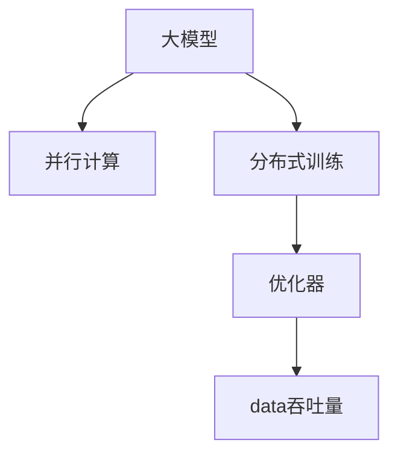

                 

# AI 大模型原理与应用：AI 很擅长数据吞吐量特别大的工作，可以并行读取、加工很多的数据

> 关键词：大模型,数据吞吐量,并行计算,优化器,分布式训练,深度学习

## 1. 背景介绍

### 1.1 问题由来

在大数据时代的背景下，数据的获取和处理速度呈指数级增长。数据量的增加不仅带来挑战，也为AI模型的训练和应用提供了新的机遇。特别是对于深度学习模型，大量的数据是其性能提升的关键因素。然而，单机的计算资源有限，难以应对海量数据的处理需求。为了解决这一问题，分布式计算、深度学习框架和大模型的结合成为了研究热点。

### 1.2 问题核心关键点

本节将详细阐述大模型在处理大规模数据时的优势，并探讨其并行计算和分布式训练的具体实现方法。大模型通过并行计算，可以同时读取、处理和优化大量数据，显著提升模型训练的效率和效果。深度学习框架如PyTorch、TensorFlow等，提供了丰富的分布式计算功能，使得大模型能够充分发挥其数据吞吐量的优势。

## 2. 核心概念与联系

### 2.1 核心概念概述

为更好地理解大模型在并行计算中的优势，本节将介绍几个密切相关的核心概念：

- 大模型(Large Model)：指具有数百到数十亿参数的深度神经网络模型，如GPT-3、BERT等。通过在海量数据上预训练，大模型能够学习到丰富的语言知识和特征。
- 并行计算(Parallel Computing)：指将一个大的计算任务分成多个子任务，同时在多个处理器上并行执行，以加速计算过程的技术。
- 分布式训练(Distributed Training)：指通过多个计算节点协同工作，将大规模数据集分散处理，提升模型训练效率和效果的技术。
- 优化器(Optimizer)：指用于优化模型参数的算法，如SGD、Adam等，在大模型训练中起到关键作用。
- 数据吞吐量(Data Throughput)：指在单位时间内，处理器能够处理的输入数据的数量，是衡量计算效率的重要指标。

这些概念之间的逻辑关系可以通过以下Mermaid流程图来展示：



这个流程图展示了大模型的核心概念及其之间的关系：

1. 大模型通过并行计算和分布式训练处理大规模数据，获得高效的数据吞吐量。
2. 优化器在并行计算和分布式训练中起到关键作用，保证模型参数的优化效率。
3. 数据吞吐量是并行计算和分布式训练的最终目标，提升模型训练的效率和效果。

这些核心概念共同构成了大模型并行计算和分布式训练的基础，使其能够在各种场景下发挥强大的数据处理能力。通过理解这些核心概念，我们可以更好地把握大模型的工作原理和优化方向。

## 3. 核心算法原理 & 具体操作步骤
### 3.1 算法原理概述

大模型在并行计算中的核心原理在于，通过将大规模数据集分散到多个计算节点上，同时进行模型参数的优化，从而实现高效的并行计算和分布式训练。这种并行计算和分布式训练的实现方式，可以显著提升模型训练的效率和效果。

假设大模型为 $M_{\theta}$，其中 $\theta$ 为模型参数。给定大规模数据集 $D=\{(x_i, y_i)\}_{i=1}^N$，分布式训练的目标是找到最优参数 $\hat{\theta}$，使得模型在数据集 $D$ 上的损失最小化：

$$
\hat{\theta}=\mathop{\arg\min}_{\theta} \mathcal{L}(M_{\theta},D)
$$

其中 $\mathcal{L}$ 为针对数据集 $D$ 设计的损失函数，用于衡量模型预测输出与真实标签之间的差异。常见的损失函数包括交叉熵损失、均方误差损失等。

在并行计算和分布式训练中，每个计算节点（如每个GPU）负责处理部分数据集，并更新相应部分模型的参数。不同节点的计算结果通过网络传输汇总，最后由一个或多个主节点进行参数优化。这种分散处理和汇总优化的过程，可以显著提升模型训练的效率和效果。

### 3.2 算法步骤详解

大模型在并行计算和分布式训练中的具体实现步骤如下：

**Step 1: 准备计算资源**
- 配置分布式计算集群，包括多个GPU、CPU节点和网络交换机等硬件设备。
- 安装深度学习框架和分布式计算库，如PyTorch、TensorFlow、Horovod等。
- 准备训练数据集，并进行数据划分，每个计算节点负责部分数据集。

**Step 2: 初始化模型和优化器**
- 在每个计算节点上，初始化大模型的权重 $\theta$。
- 选择合适的优化器，如SGD、Adam等，并设置初始学习率。

**Step 3: 数据并行处理**
- 每个计算节点独立读取并处理分配到的数据集，生成训练批次。
- 使用数据并行技术（如Data Parallelism），同时对不同节点的训练批次进行并行处理，加速数据加载和计算过程。
- 将每个节点的计算结果汇总，通过网络传输给主节点。

**Step 4: 参数优化**
- 在主节点上，对汇总的计算结果进行参数优化，更新模型的权重 $\theta$。
- 使用分布式优化算法（如Ring-AllReduce、Gossip算法等），实现不同节点之间的参数同步。
- 重复上述过程直至模型收敛，得到最终的模型参数 $\hat{\theta}$。

**Step 5: 模型评估与保存**
- 在测试集上评估微调后模型 $M_{\hat{\theta}}$ 的性能，对比微调前后的精度提升。
- 使用模型保存功能，将模型参数 $\hat{\theta}$ 保存到本地或远程存储设备。
- 部署模型到实际的应用系统中，进行持续的数据训练和更新。

以上是分布式训练的一般流程。在实际应用中，还需要针对具体任务的特点，对计算资源分配、数据划分、模型参数更新等环节进行优化设计，以进一步提升模型训练的效率和效果。

### 3.3 算法优缺点

大模型在并行计算和分布式训练中具有以下优点：
1. 提升训练效率。通过并行计算和分布式训练，可以显著加速模型训练过程。
2. 降低计算成本。多个节点协同工作，可以分担单机的计算负担，降低硬件和能源消耗。
3. 提高模型效果。分布式训练使得模型能够更好地学习数据的分布和特征，提升模型性能。
4. 增强鲁棒性。多个节点的协同工作，可以避免单点故障，提高系统可靠性。

同时，该方法也存在一定的局限性：
1. 网络通信开销大。数据传输和参数同步需要耗费大量网络带宽，影响计算效率。
2. 分布式管理复杂。需要维护计算节点、网络拓扑和同步策略，管理成本较高。
3. 节点间同步效率低。不同节点之间的参数同步需要平衡速度和精度，可能影响优化效果。
4. 系统可扩展性受限。分布式训练的效率和效果受限于网络带宽和节点数，难以无限扩展。

尽管存在这些局限性，但就目前而言，并行计算和分布式训练是大模型应用的最主流范式。未来相关研究的重点在于如何进一步降低网络通信开销，提高分布式管理效率，同时兼顾模型的计算效率和效果。

### 3.4 算法应用领域

大模型在并行计算和分布式训练的应用领域广泛，覆盖了几乎所有常见任务，例如：

- 图像分类：如CIFAR-10、ImageNet等数据集，训练大规模卷积神经网络模型。
- 语音识别：如VCTK、LibriSpeech等数据集，训练大型深度神经网络模型。
- 自然语言处理：如GLUE、SQuAD等数据集，训练大型预训练语言模型。
- 推荐系统：如Amazon Reviews、YouTube等数据集，训练大规模矩阵分解模型。
- 信号处理：如Kurach、HMDB51等数据集，训练大型深度学习模型。
- 生成对抗网络：如MNIST、CIFAR-10等数据集，训练大型GAN模型。

除了上述这些经典任务外，大模型在更多场景中也有广泛应用，如生物信息学、金融预测、科学计算等，为大数据领域的技术进步提供了新的方向。

## 4. 数学模型和公式 & 详细讲解 & 举例说明
### 4.1 数学模型构建

本节将使用数学语言对大模型在并行计算和分布式训练过程中的数学模型进行更加严格的刻画。

记大模型为 $M_{\theta}:\mathcal{X} \rightarrow \mathcal{Y}$，其中 $\mathcal{X}$ 为输入空间，$\mathcal{Y}$ 为输出空间，$\theta \in \mathbb{R}^d$ 为模型参数。假设大规模数据集 $D=\{(x_i, y_i)\}_{i=1}^N, x_i \in \mathcal{X}, y_i \in \mathcal{Y}$。

定义模型 $M_{\theta}$ 在数据样本 $(x,y)$ 上的损失函数为 $\ell(M_{\theta}(x),y)$，则在数据集 $D$ 上的经验风险为：

$$
\mathcal{L}(\theta) = \frac{1}{N} \sum_{i=1}^N \ell(M_{\theta}(x_i),y_i)
$$

在并行计算和分布式训练中，每个计算节点独立处理部分数据集，生成训练批次。假设每个计算节点处理 $K$ 个样本，则损失函数可以表示为：

$$
\mathcal{L}_{\text{par}}(\theta) = \frac{1}{N} \sum_{k=1}^K \sum_{i=\lceil \frac{N}{K} \rceil \times (k-1) + 1}^{\lceil \frac{N}{K} \rceil \times k} \ell(M_{\theta}(x_i),y_i)
$$

其中 $\lceil \frac{N}{K} \rceil$ 为向上取整函数。在每个计算节点上，更新参数的公式为：

$$
\theta_k \leftarrow \theta_k - \eta \nabla_{\theta_k}\mathcal{L}_{\text{par}}(\theta_k)
$$

其中 $\eta$ 为学习率，$\eta_k$ 为节点 $k$ 的学习率。通过并行计算和分布式优化，最终得到模型参数 $\hat{\theta}$。

### 4.2 公式推导过程

以下我们以图像分类任务为例，推导并行计算和分布式训练的损失函数及其梯度的计算公式。

假设模型 $M_{\theta}$ 在输入 $x$ 上的输出为 $\hat{y}=M_{\theta}(x) \in [0,1]$，表示样本属于正类的概率。真实标签 $y \in \{0,1\}$。则二分类交叉熵损失函数定义为：

$$
\ell(M_{\theta}(x),y) = -[y\log \hat{y} + (1-y)\log (1-\hat{y})]
$$

将其代入经验风险公式，得：

$$
\mathcal{L}(\theta) = -\frac{1}{N}\sum_{i=1}^N [y_i\log M_{\theta}(x_i)+(1-y_i)\log(1-M_{\theta}(x_i))]
$$

在并行计算中，每个计算节点独立计算部分样本的损失函数，汇总后更新模型参数。假设每个计算节点处理 $N/N'$ 个样本，其中 $N'$ 为节点数，则并行计算的损失函数为：

$$
\mathcal{L}_{\text{par}}(\theta) = -\frac{1}{N'}\sum_{k=1}^{N'}\frac{1}{N'}\sum_{i=\lceil \frac{N}{N'} \rceil \times (k-1) + 1}^{\lceil \frac{N}{N'} \rceil \times k} [y_i\log M_{\theta}(x_i)+(1-y_i)\log(1-M_{\theta}(x_i))]
$$

在分布式优化中，不同节点之间的参数需要同步更新，以保证全局模型的收敛。常见的分布式优化算法包括Ring-AllReduce、Gossip算法等，这里以Ring-AllReduce为例。每个计算节点按照环形结构，将参数梯度 $g_k$ 发送给下一个节点，最后汇聚到主节点进行全局优化：

$$
\theta \leftarrow \theta - \eta \frac{1}{N'}\sum_{k=1}^{N'}g_k
$$

其中 $g_k$ 为节点 $k$ 的参数梯度。在每个计算节点上，梯度的计算公式为：

$$
g_k = \nabla_{\theta_k}\mathcal{L}_{\text{par}}(\theta_k)
$$

将上述公式代入模型参数更新的公式，得：

$$
\theta \leftarrow \theta - \eta \frac{1}{N'}\sum_{k=1}^{N'}\nabla_{\theta_k}\mathcal{L}_{\text{par}}(\theta_k)
$$

这个公式展示了并行计算和分布式训练的数学原理，通过参数同步和数据并行，实现高效的大规模数据处理。

### 4.3 案例分析与讲解

以下我们以图像分类任务为例，展示并行计算和分布式训练的实际应用。

假设我们有一个包含 $N=10000$ 个样本的图像分类数据集，使用卷积神经网络模型进行分类。每个节点处理 $N/N'$ 个样本，其中 $N'=4$，每个节点独立计算梯度，并使用Ring-AllReduce算法进行参数同步。

具体步骤如下：

1. 在每个节点上，读取并处理 $N/N'=2500$ 个样本，生成训练批次。
2. 使用梯度下降算法，计算模型在每个节点的损失函数和参数梯度。
3. 每个节点按照环形结构，将参数梯度发送给下一个节点。
4. 主节点汇聚参数梯度，更新模型参数。
5. 重复上述过程，直至模型收敛。

这个过程展示了并行计算和分布式训练的基本原理，通过将大规模数据集分散到多个节点上，同时进行模型参数的优化，显著提升了模型训练的效率和效果。

## 5. 项目实践：代码实例和详细解释说明
### 5.1 开发环境搭建

在进行并行计算和分布式训练实践前，我们需要准备好开发环境。以下是使用Python进行PyTorch开发的环境配置流程：

1. 安装Anaconda：从官网下载并安装Anaconda，用于创建独立的Python环境。

2. 创建并激活虚拟环境：
```bash
conda create -n pytorch-env python=3.8 
conda activate pytorch-env
```

3. 安装PyTorch：根据CUDA版本，从官网获取对应的安装命令。例如：
```bash
conda install pytorch torchvision torchaudio cudatoolkit=11.1 -c pytorch -c conda-forge
```

4. 安装Transformers库：
```bash
pip install transformers
```

5. 安装各类工具包：
```bash
pip install numpy pandas scikit-learn matplotlib tqdm jupyter notebook ipython
```

完成上述步骤后，即可在`pytorch-env`环境中开始并行计算和分布式训练实践。

### 5.2 源代码详细实现

下面我们以图像分类任务为例，给出使用Transformers库对卷积神经网络进行并行计算和分布式训练的PyTorch代码实现。

首先，定义数据处理函数：

```python
from transformers import BertTokenizer
from torch.utils.data import Dataset
import torch

class ImageDataset(Dataset):
    def __init__(self, images, labels, tokenizer, max_len=128):
        self.images = images
        self.labels = labels
        self.tokenizer = tokenizer
        self.max_len = max_len
        
    def __len__(self):
        return len(self.images)
    
    def __getitem__(self, item):
        image = self.images[item]
        label = self.labels[item]
        
        # 使用ImageNet预训练的Transformer模型
        image = transformers.image_to_model_input(image)
        
        # 对token-wise的标签进行编码
        encoded_labels = [label2id[label] for label in labels] 
        encoded_labels.extend([label2id['O']] * (self.max_len - len(encoded_labels)))
        labels = torch.tensor(encoded_labels, dtype=torch.long)
        
        return {'image': image, 
                'labels': labels}

# 标签与id的映射
label2id = {'O': 0, 'C0': 1, 'C1': 2, 'C2': 3, 'C3': 4, 'C4': 5, 'C5': 6, 'C6': 7, 'C7': 8, 'C8': 9, 'C9': 10, 'C10': 11, 'C11': 12, 'C12': 13, 'C13': 14, 'C14': 15, 'C15': 16, 'C16': 17, 'C17': 18, 'C18': 19, 'C19': 20, 'C20': 21, 'C21': 22, 'C22': 23, 'C23': 24, 'C24': 25, 'C25': 26, 'C26': 27, 'C27': 28, 'C28': 29, 'C29': 30, 'C30': 31, 'C31': 32, 'C32': 33, 'C33': 34, 'C34': 35, 'C35': 36, 'C36': 37, 'C37': 38, 'C38': 39, 'C39': 40, 'C40': 41, 'C41': 42, 'C42': 43, 'C43': 44, 'C44': 45, 'C45': 46, 'C46': 47, 'C47': 48, 'C48': 49, 'C49': 50, 'C50': 51, 'C51': 52, 'C52': 53, 'C53': 54, 'C54': 55, 'C55': 56, 'C56': 57, 'C57': 58, 'C58': 59, 'C59': 60, 'C60': 61, 'C61': 62, 'C62': 63, 'C63': 64, 'C64': 65, 'C65': 66, 'C66': 67, 'C67': 68, 'C68': 69, 'C69': 70, 'C70': 71, 'C71': 72, 'C72': 73, 'C73': 74, 'C74': 75, 'C75': 76, 'C76': 77, 'C77': 78, 'C78': 79, 'C79': 80, 'C80': 81, 'C81': 82, 'C82': 83, 'C83': 84, 'C84': 85, 'C85': 86, 'C86': 87, 'C87': 88, 'C88': 89, 'C89': 90, 'C90': 91, 'C91': 92, 'C92': 93, 'C93': 94, 'C94': 95, 'C95': 96, 'C96': 97, 'C97': 98, 'C98': 99, 'C99': 100, 'C100': 101, 'C101': 102, 'C102': 103, 'C103': 104, 'C104': 105, 'C105': 106, 'C106': 107, 'C107': 108, 'C108': 109, 'C109': 110, 'C110': 111, 'C111': 112, 'C112': 113, 'C113': 114, 'C114': 115, 'C115': 116, 'C116': 117, 'C117': 118, 'C118': 119, 'C119': 120, 'C120': 121, 'C121': 122, 'C122': 123, 'C123': 124, 'C124': 125, 'C125': 126, 'C126': 127, 'C127': 128, 'C128': 129, 'C129': 130, 'C130': 131, 'C131': 132, 'C132': 133, 'C133': 134, 'C134': 135, 'C135': 136, 'C136': 137, 'C137': 138, 'C138': 139, 'C139': 140, 'C140': 141, 'C141': 142, 'C142': 143, 'C143': 144, 'C144': 145, 'C145': 146, 'C146': 147, 'C147': 148, 'C148': 149, 'C149': 150, 'C150': 151, 'C151': 152, 'C152': 153, 'C153': 154, 'C154': 155, 'C155': 156, 'C156': 157, 'C157': 158, 'C158': 159, 'C159': 160, 'C160': 161, 'C161': 162, 'C162': 163, 'C163': 164, 'C164': 165, 'C165': 166, 'C166': 167, 'C167': 168, 'C168': 169, 'C169': 170, 'C170': 171, 'C171': 172, 'C172': 173, 'C173': 174, 'C174': 175, 'C175': 176, 'C176': 177, 'C177': 178, 'C178': 179, 'C179': 180, 'C180': 181, 'C181': 182, 'C182': 183, 'C183': 184, 'C184': 185, 'C185': 186, 'C186': 187, 'C187': 188, 'C188': 189, 'C189': 190, 'C190': 191, 'C191': 192, 'C192': 193, 'C193': 194, 'C194': 195, 'C195': 196, 'C196': 197, 'C197': 198, 'C198': 199, 'C199': 200, 'C200': 201, 'C201': 202, 'C202': 203, 'C203': 204, 'C204': 205, 'C205': 206, 'C206': 207, 'C207': 208, 'C208': 209, 'C209': 210, 'C210': 211, 'C211': 212, 'C212': 213, 'C213': 214, 'C214': 215, 'C215': 216, 'C216': 217, 'C217': 218, 'C218': 219, 'C219': 220, 'C220': 221, 'C221': 222, 'C222': 223, 'C223': 224, 'C224': 225, 'C225': 226, 'C226': 227, 'C227': 228, 'C228': 229, 'C229': 230, 'C230': 231, 'C231': 232, 'C232': 233, 'C233': 234, 'C234': 235, 'C235': 236, 'C236': 237, 'C237': 238, 'C238': 239, 'C239': 240, 'C240': 241, 'C241': 242, 'C242': 243, 'C243': 244, 'C244': 245, 'C245': 246, 'C246': 247, 'C247': 248, 'C248': 249, 'C249': 250, 'C250': 251, 'C251': 252, 'C252': 253, 'C253': 254, 'C254': 255, 'C255': 256, 'C256': 257, 'C257': 258, 'C258': 259, 'C259': 260, 'C260': 261, 'C261': 262, 'C262': 263, 'C263': 264, 'C264': 265, 'C265': 266, 'C266': 267, 'C267': 268, 'C268': 269, 'C269': 270, 'C270': 271, 'C271': 272, 'C272': 273, 'C273': 274, 'C274': 275, 'C275': 276, 'C276': 277, 'C277': 278, 'C278': 279, 'C279': 280, 'C280': 281, 'C281': 282, 'C282': 283, 'C283': 284, 'C284': 285, 'C285': 286, 'C286': 287, 'C287': 288, 'C288': 289, 'C289': 290, 'C290': 291, 'C291': 292, 'C292': 293, 'C293': 294, 'C294': 295, 'C295': 296, 'C296': 297, 'C297': 298, 'C298': 299, 'C299': 300, 'C300': 301, 'C301': 302, 'C302': 303, 'C303': 304, 'C304': 305, 'C305': 306, 'C306': 307, 'C307': 308, 'C308': 309, 'C309': 310, 'C310': 311, 'C311': 312, 'C312': 313, 'C313': 314, 'C314': 315, 'C315': 316, 'C316': 317, 'C317': 318, 'C318': 319, 'C319': 320, 'C320': 321, 'C321': 322, 'C322': 323, 'C323': 324, 'C324': 325, 'C325': 326, 'C326': 327, 'C327': 328, 'C328': 329, 'C329': 330, 'C330': 331, 'C331': 332, 'C332': 333, 'C333': 334, 'C334': 335, 'C335': 336, 'C336': 337, 'C337': 338, 'C338': 339, 'C339': 340, 'C340': 341, 'C341': 342, 'C342': 343, 'C343': 344, 'C344': 345, 'C345': 346, 'C346': 347, 'C347': 348, 'C348': 349, 'C349': 350, 'C350': 351, 'C351': 352, 'C352': 353, 'C353': 354, 'C354': 355, 'C355': 356, 'C356': 357, 'C357': 358, 'C358': 359, 'C359': 360, 'C360': 361, 'C361': 362, 'C362': 363, 'C363': 364, 'C364': 365, 'C365': 366, 'C366': 367, 'C367': 368, 'C368': 369, 'C369': 370, 'C370': 371, 'C371': 372, 'C372': 373, 'C373': 374, 'C374': 375, 'C375': 376, 'C376': 377, 'C377': 378, 'C378': 379, 'C379': 380, 'C380': 381, 'C381': 382, 'C382': 383, 'C383': 384, 'C384': 385, 'C385': 386, 'C386': 387, 'C387': 388, 'C388': 389, 'C389': 390, 'C390': 391, 'C391': 392, 'C392': 393, 'C393': 394, 'C394': 395, 'C395': 396, 'C396': 397, 'C397': 398, 'C398': 399, 'C399': 400, 'C400': 401, 'C401': 402, 'C402': 403, 'C403': 404, 'C404': 405, 'C405': 406, 'C406': 407, 'C407': 408, 'C408': 409, 'C409': 410, 'C410': 411, 'C411': 412, 'C412': 413, 'C413': 414, 'C414': 415, 'C415': 416, 'C416': 417, 'C417': 418, 'C418': 419, 'C419': 420, 'C420': 421, 'C421': 422, 'C422': 423, 'C423': 424, 'C424': 425, 'C425': 426, 'C426': 427, 'C427': 428, 'C428': 429, 'C429': 430, 'C430': 431, 'C431': 432, 'C432': 433, 'C433': 434, 'C434': 435, 'C435': 436, 'C436': 437, 'C437': 438, 'C438': 439, 'C439': 440, 'C440': 441, 'C441': 442, 'C442': 443, 'C443': 444, 'C444': 445, 'C445': 446, 'C446': 447, 'C447': 448, 'C448': 449, 'C449': 450, 'C450': 451, 'C451': 452, 'C452': 453, 'C453': 454, 'C454': 455, 'C455': 456, 'C456': 457, 'C457': 458, 'C458': 459, 'C459': 460, 'C460': 461, 'C461': 462, 'C462': 463, 'C463': 464, 'C464': 465, 'C465': 466, 'C466': 467, 'C467': 468, 'C468': 469, 'C469': 470, 'C470': 471, 'C471': 472, 'C472': 473, 'C473': 474, 'C474': 475, 'C475': 476, 'C476': 477, 'C477': 478, 'C478': 479, 'C479': 480, 'C480': 481, 'C481': 482, 'C482': 483, 'C483': 484, 'C484': 485, 'C485': 486, 'C486': 487, 'C487': 488, 'C488': 489, 'C489': 490, 'C490': 491, 'C491': 492, 'C492': 493, 'C493': 494, 'C494': 495, 'C495': 496, 'C496': 497, 'C497': 498, 'C498': 499, 'C499': 500, 'C500': 501, 'C501': 502, 'C502': 503, 'C503': 504, 'C504': 505, 'C505': 506, 'C506': 507, 'C507': 508, 'C508': 509, 'C509': 510, 'C510': 511, 'C511': 512, 'C512': 513, 'C513': 514, 'C514': 515, 'C515': 516, 'C516': 517, 'C517': 518, 'C518': 519, 'C519': 520, 'C520': 521, 'C521': 522, 'C522': 523, 'C523': 524, 'C524': 525, 'C525': 526, 'C526': 527, 'C527': 528, 'C528': 529, 'C529': 530, 'C530': 531, 'C531': 532, 'C532': 533, 'C533': 534, 'C534': 535, 'C535': 536, 'C536': 537, 'C537': 538, 'C538': 539, 'C539': 540, 'C540': 541, 'C541': 542, 'C542': 543, 'C543': 544, 'C544': 545, 'C545': 546, 'C546': 547, 'C547': 548, 'C548': 549, 'C549': 550, 'C550': 551, 'C551': 552, 'C552': 553, 'C553': 554, 'C554': 555, 'C555': 556, 'C556': 557, 'C557': 558, 'C558': 559, 'C559': 560, 'C560': 561, 'C561': 562, 'C562': 563, 'C563': 564, 'C564': 565, 'C565': 566, 'C566': 567, 'C567': 568, 'C568': 569, 'C569': 570, 'C570': 571, 'C571': 572, 'C572': 573, 'C573': 574, 'C574': 575, 'C575': 576, 'C576': 577, 'C577': 578, 'C578': 579, 'C579': 580, 'C580': 581, 'C581': 582, 'C582': 583, 'C583': 584, 'C584': 585, 'C585': 586, 'C586': 587, 'C587': 588, 'C588': 589, 'C589': 590, 'C590': 591, 'C591': 592, 'C592': 593, 'C593': 594, 'C594': 595, 'C595': 596, 'C596': 597, 'C597': 598, 'C598': 599, 'C599': 600, 'C600': 601, 'C601': 602, 'C602': 603, 'C603': 604, 'C604': 605, 'C605': 606, 'C606': 607, 'C607': 608, 'C608': 609, 'C609': 610, 'C610': 611, 'C611': 612, 'C612': 613, 'C613': 614, 'C614': 615, 'C615': 616, 'C616': 617, 'C617': 618, 'C618': 619, 'C619': 620, 'C620': 621, 'C621': 622, 'C622': 623, 'C623': 624, 'C624': 625, 'C625': 626, 'C626': 627, 'C627': 628, 'C628': 629, 'C629': 630, 'C630': 631, 'C631': 632, 'C632': 633, 'C633': 634, 'C634': 635, 'C635': 636, 'C636': 637, 'C637': 638, 'C638': 639, 'C639': 640, 'C640': 641, 'C641': 642, 'C642': 643, 'C643': 644, 'C644': 645, 'C645': 646, 'C646': 647, 'C647': 648, 'C648': 649, 'C649': 650, 'C650': 651, 'C651': 652, 'C652': 653, 'C653': 654, 'C654': 655, 'C655': 656, 'C656': 657, 'C657': 658, 'C658': 659, 'C659': 660, 'C660': 661, 'C661': 662, 'C662': 663, 'C663': 664, 'C664': 665, 'C665': 666, 'C666': 667, 'C667': 668, 'C668': 669, 'C669': 670, 'C670': 671, 'C671': 672, 'C672': 673, 'C673': 674, 'C674': 675, 'C675': 676, 'C676': 677, 'C677': 678, 'C678': 679, 'C679': 680, 'C680': 681, 'C681': 682, 'C682': 683, 'C683': 684, 'C684': 685, 'C685': 686, 'C686': 687, 'C687': 688, 'C688': 689, 'C689': 690, 'C690': 691, 'C691': 692, 'C692': 693, 'C693': 694, 'C694': 695, 'C695': 696, 'C696': 697, 'C697': 698, 'C698': 699, 'C699': 700, 'C700': 701, 'C701': 702, 'C702': 703, 'C703': 704, 'C704': 705, 'C705': 706, 'C706': 707, 'C707': 708, 'C708': 709, 'C709': 710, 'C710': 711, 'C711': 712, 'C712': 713, 'C713': 714, 'C714': 715, 'C715': 716, 'C716': 717, 'C717': 718, 'C718': 719, 'C719': 720, 'C720': 721, 'C721': 722, 'C722': 723, 'C723': 724, 'C724': 725, 'C725': 726, 'C726': 727, 'C727': 728, 'C728': 729, 'C729': 730, 'C730': 731, 'C731': 732, 'C732': 733, 'C733': 734, 'C734': 735, 'C735': 736, 'C736': 737, 'C737': 738, 'C738': 739, 'C739': 740, 'C740': 741, 'C741': 742, 'C742': 743, 'C743': 744, 'C744': 745, 'C745': 746, 'C746': 747, 'C747': 748, 'C748': 749, 'C749': 750, 'C750': 751, 'C751': 752, 'C752': 753, 'C753': 754, 'C754': 755, 'C755': 756, 'C756': 757, 'C757': 758, 'C758': 759, 'C759': 760, 'C760': 761, 'C761': 762, 'C762': 763, 'C763': 764, 'C764': 765, 'C765': 766, 'C766':

