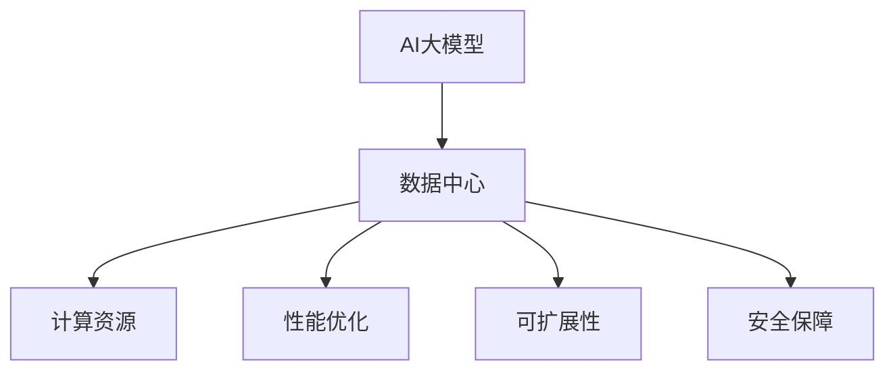

                 

# AI 大模型应用数据中心建设：数据中心产业发展

> 关键词：
> - AI大模型
> - 数据中心
> - 产业发展
> - 计算资源
> - 性能优化
> - 可扩展性
> - 安全保障

## 1. 背景介绍

### 1.1 问题由来

随着人工智能（AI）技术的飞速发展，特别是在大模型领域，其在图像识别、自然语言处理、语音识别等方面的突破，给社会生产生活带来了深远影响。然而，AI大模型的训练和推理需要庞大的计算资源和数据支持。这使得数据中心建设成为AI大模型应用的关键基础设施之一。

目前，数据中心的建设和管理面临着诸多挑战，如资源利用率低、能耗高、成本高、网络延迟等。如何在有限的资源条件下，构建高效、灵活、可扩展的数据中心，以支持AI大模型的应用，成为数据中心产业发展的重点方向。

### 1.2 问题核心关键点

AI大模型的应用需要强大的数据中心支持，数据中心产业的挑战和机遇也随之凸显。关键点包括：

- 计算资源的高效利用：数据中心如何利用有限的硬件资源，最大化地支持AI大模型的训练和推理？
- 性能优化与可扩展性：数据中心如何在保证性能的前提下，实现高效的可扩展性？
- 安全保障：如何构建安全、稳定、可靠的数据中心环境，以保护AI大模型和数据的安全？

## 2. 核心概念与联系

### 2.1 核心概念概述

为了更好地理解AI大模型应用中的数据中心建设，本节将介绍几个密切相关的核心概念：

- **AI大模型**：以自回归（如GPT）或自编码（如BERT）模型为代表的大型预训练语言模型，通过在海量无标签文本语料上进行预训练，学习通用的语言表示，具备强大的语言理解和生成能力。

- **数据中心（DC）**：通过集中管理和调度计算资源，提供高性能计算能力的大型设施。数据中心通常由服务器、网络设备、存储设备、冷却系统等组成。

- **计算资源**：包括CPU、GPU、TPU等硬件资源，以及内存、存储等软件资源，是数据中心的核心资产。

- **性能优化**：通过算法、架构和系统优化，提升数据中心的计算性能和能效比。

- **可扩展性**：数据中心在面对不同规模、不同类型的AI大模型时，能够灵活地扩展资源和容量。

- **安全保障**：通过硬件和软件手段，确保数据中心中的AI大模型和敏感数据的安全。

这些核心概念之间的逻辑关系可以通过以下Mermaid流程图来展示：



这个流程图展示了大模型与数据中心的关键关联：

1. AI大模型依托于数据中心的计算资源。
2. 数据中心通过性能优化提升大模型的计算效率。
3. 数据中心需具备可扩展性，以支持大模型的训练和推理。
4. 数据中心需提供安全保障，保护大模型和数据的安全。

## 3. 核心算法原理 & 具体操作步骤

### 3.1 算法原理概述

AI大模型在数据中心的应用，本质上是通过计算资源和大模型参数的优化，实现高效、准确的模型训练和推理。其核心思想是：

- 选择合适的硬件平台（如CPU、GPU、TPU），配备足够的内存和存储，作为数据中心的计算资源。
- 通过高效的算法和架构设计，优化计算资源利用，提升大模型的计算性能和能效比。
- 实现灵活的扩展机制，使数据中心能够适应不同规模和类型的AI大模型。
- 构建安全可靠的数据中心环境，确保大模型和数据的安全。

### 3.2 算法步骤详解

AI大模型应用的数据中心建设包括以下关键步骤：

**Step 1: 选择硬件平台**

- 根据大模型的需求，选择合适的计算资源平台，如CPU、GPU、TPU等。
- 评估硬件平台的性能、成本、可扩展性等因素，选择合适的配置。

**Step 2: 设计计算架构**

- 设计高效的计算架构，如分布式训练、异步并行等，提升大模型的训练速度和能效比。
- 利用内存和存储优化技术，如混合精度训练、压缩存储等，减少计算资源的占用。

**Step 3: 配置网络环境**

- 构建高性能、低延迟的网络环境，确保数据中心内各节点之间通信流畅。
- 部署负载均衡、网络隔离等技术，优化网络资源利用。

**Step 4: 部署安全措施**

- 采用物理安全、网络安全、应用安全等多层次的安全措施，保护数据中心环境。
- 建立严格的访问控制和监控机制，防止数据泄露和未授权访问。

**Step 5: 性能测试与优化**

- 对数据中心的计算性能进行全面测试，评估硬件资源利用率和能效比。
- 根据测试结果，进行性能优化和资源调整，提升大模型的计算效率。

**Step 6: 维护与升级**

- 建立日常维护和升级机制，确保数据中心的稳定运行。
- 定期更新硬件和软件，保证数据中心的先进性和可靠性。

### 3.3 算法优缺点

AI大模型应用的数据中心建设具有以下优点：

- **高效资源利用**：通过高效的计算架构和资源调度，最大化地利用硬件资源，提升大模型的计算性能。
- **灵活扩展性**：数据中心设计需考虑灵活的扩展机制，支持不同规模和类型的AI大模型。
- **安全保障**：通过多层次的安全措施，确保数据中心中的大模型和数据的安全。
- **性能优化**：通过算法和架构优化，提升大模型的计算效率和能效比。

同时，数据中心建设也存在以下局限性：

- **高成本投入**：数据中心的建设和管理需要大量的硬件设备和运维人员，初期投入成本高。
- **能耗高**：大规模数据中心需要大量电力，能耗高，对环境有较大影响。
- **复杂性高**：数据中心的设计和建设涉及硬件、软件、网络等多个方面，复杂性高。

尽管存在这些局限性，但就目前而言，数据中心仍是AI大模型应用的核心基础设施。未来相关研究的重点在于如何进一步降低成本、提高能效、优化性能、增强安全等方面。

### 3.4 算法应用领域

AI大模型应用的数据中心建设在多个领域得到了广泛应用，例如：

- **科学研究**：如在高性能计算领域，数据中心支持复杂科学计算和大数据分析。
- **金融行业**：在量化交易、风险管理等场景中，数据中心提供高效计算支持。
- **医疗健康**：在医学影像分析、基因组学等领域，数据中心支持大规模数据处理和计算。
- **自然语言处理**：在自然语言处理领域，数据中心提供高效训练和推理环境。
- **智能制造**：在工业互联网、智能制造等场景中，数据中心支持大规模工业数据处理和分析。

除了上述这些经典领域外，数据中心的应用还在不断扩展到更多行业，如智慧城市、交通物流、环境保护等，为各行各业提供高效、稳定的计算支持。

## 4. 数学模型和公式 & 详细讲解 & 举例说明

### 4.1 数学模型构建

假设数据中心中的AI大模型为 $M_{\theta}$，其中 $\theta$ 为大模型参数。计算资源平台为 $C$，网络环境为 $N$，安全措施为 $S$。大模型的计算性能可以用以下数学模型描述：

$$
P_{M_{\theta}}(C, N, S) = f_{M_{\theta}}(C) \times f_{N}(N) \times f_{S}(S)
$$

其中，$f_{M_{\theta}}(C)$ 表示大模型在不同计算资源平台上的计算性能，$f_{N}(N)$ 表示不同网络环境下的通信性能，$f_{S}(S)$ 表示安全措施对计算性能的影响。

### 4.2 公式推导过程

根据上述数学模型，可以推导出提升大模型计算性能的具体方法：

1. **选择合适的计算资源平台**：
   - 选择性能最优的计算资源平台 $C_{opt}$，使得 $f_{M_{\theta}}(C_{opt})$ 最大。
2. **优化网络环境**：
   - 优化网络环境 $N_{opt}$，使得 $f_{N}(N_{opt})$ 最大。
3. **增强安全保障**：
   - 加强安全措施 $S_{opt}$，使得 $f_{S}(S_{opt})$ 最大。

通过上述优化方法，可以最大化地提升大模型的计算性能。

### 4.3 案例分析与讲解

以谷歌的TPU为例，其采用优化硬件架构和算法，显著提升了大模型的训练和推理性能。谷歌的TPU通过高效的矩阵运算和并行计算，大幅提升了计算速度和能效比。同时，谷歌还引入了混合精度训练和模型压缩等技术，进一步优化了大模型的计算资源利用。

## 5. 项目实践：代码实例和详细解释说明

### 5.1 开发环境搭建

在进行AI大模型应用的数据中心建设实践中，需要准备好以下开发环境：

1. 安装Python和相关的开发工具。
2. 安装TensorFlow或PyTorch等深度学习框架。
3. 安装相应的硬件驱动程序和库。
4. 搭建高性能计算集群，配置网络环境。
5. 部署安全措施，确保数据中心安全。

### 5.2 源代码详细实现

以TensorFlow为例，以下是搭建高性能计算集群和配置网络环境的代码实现：

```python
import tensorflow as tf
import tensorflow.distribute as tf_distribute

# 创建计算集群
cluster_spec = tf_distribute.cluster_resolver.TPUClusterResolver(tpu='')
tf_config = tf.distribute.cluster_resolver.TPUClusterResolver.get_tpu_system()
strategy = tf.distribute.TPUStrategy(cluster_spec)

# 配置网络环境
tf.config.threading.set_intra_op_parallelism_threads(32)
tf.config.threading.set_inter_op_parallelism_threads(32)
tf.config.optimizer.set_jit(True)
```

### 5.3 代码解读与分析

上述代码展示了如何通过TensorFlow搭建高性能计算集群和配置网络环境。具体步骤如下：

1. 使用 `TPUClusterResolver` 创建计算集群，连接TPU硬件。
2. 获取TPU系统配置，并使用 `TPUStrategy` 封装计算集群。
3. 配置TensorFlow的并行化参数，提升计算性能。
4. 开启TensorFlow的Just-In-Time (JIT)编译器，提升计算效率。

### 5.4 运行结果展示

运行上述代码后，可以在多台TPU设备上进行分布式训练，提升计算性能。例如，使用 `TPUStrategy` 对大模型进行训练：

```python
with strategy.scope():
    model = create_model()
    dataset = load_dataset()
    strategy.run(model.fit, args=(dataset,))
```

在多台TPU设备上运行后，大模型的训练速度和计算效率会显著提升。

## 6. 实际应用场景

### 6.1 科研计算

在科研计算领域，数据中心提供高性能计算能力，支持复杂的科学计算和大数据分析。例如，在气候模拟、基因组学、天文学等领域，数据中心提供计算资源，支持大规模数据的处理和分析，加速科学研究的进程。

### 6.2 金融交易

在金融交易领域，数据中心提供高效的计算能力，支持量化交易、风险管理等任务。例如，谷歌的TPU在量化交易中表现优异，显著提升了金融交易的计算效率和决策速度。

### 6.3 医疗健康

在医疗健康领域，数据中心提供高性能计算能力，支持医学影像分析、基因组学等领域的大规模数据处理和计算。例如，IBM Watson Health利用数据中心提供的高性能计算能力，支持医疗影像的深度学习分析。

### 6.4 自然语言处理

在自然语言处理领域，数据中心提供高效的训练和推理环境，支持大模型的训练和部署。例如，谷歌的BERT模型在数据中心上进行训练，大幅提升了模型的精度和效率。

## 7. 工具和资源推荐

### 7.1 学习资源推荐

为了帮助开发者系统掌握数据中心建设的理论基础和实践技巧，这里推荐一些优质的学习资源：

1. Google Cloud Platform (GCP) 文档：详细介绍了TPU等高性能计算资源的部署和配置。
2. TensorFlow官方文档：介绍了TensorFlow在分布式计算和TPU优化方面的最佳实践。
3. NVIDIA官方文档：介绍了NVIDIA GPU和TPU等硬件平台的性能优化和配置方法。
4. NVIDIA DeepLearning AI课程：深入讲解了深度学习在计算密集型应用中的优化策略。

### 7.2 开发工具推荐

高效的开发离不开优秀的工具支持。以下是几款用于AI大模型应用的数据中心建设的常用工具：

1. TensorFlow：基于Python的开源深度学习框架，支持分布式计算和TPU优化，适合大规模应用。
2. PyTorch：灵活的深度学习框架，支持多硬件平台和分布式计算。
3. NVIDIA CUDA：基于GPU的高性能计算平台，支持TensorFlow和PyTorch等深度学习框架。
4. Amazon Web Services (AWS)：提供云上的高性能计算服务，支持多种硬件平台和分布式计算。
5. Microsoft Azure：提供云上的高性能计算服务，支持多种硬件平台和分布式计算。

### 7.3 相关论文推荐

AI大模型应用的数据中心建设涉及多方面的研究，以下是几篇奠基性的相关论文，推荐阅读：

1. "Google's Architecture for Deep Learning with TPUs"：介绍了谷歌TPU的设计和优化方法，展示了TPU在深度学习中的高效性能。
2. "Optimizing Deep Learning with Mixed Precision Training"：介绍了混合精度训练的优化方法，显著提升了深度学习的计算效率。
3. "Parallel and Distributed Deep Learning"：介绍了分布式深度学习的优化方法，支持大规模计算环境下的高效训练。
4. "Scalable TensorFlow"：介绍了TensorFlow在分布式计算和TPU优化方面的最佳实践。

## 8. 总结：未来发展趋势与挑战

### 8.1 总结

本文对AI大模型应用的数据中心建设进行了全面系统的介绍。首先阐述了数据中心建设的背景和意义，明确了计算资源利用、性能优化、可扩展性、安全保障等关键点。其次，从原理到实践，详细讲解了数据中心的算法和具体操作步骤，给出了分布式计算和TPU优化的PyTorch代码实现。同时，本文还广泛探讨了数据中心在科研计算、金融交易、医疗健康、自然语言处理等多个领域的应用前景，展示了数据中心建设的广阔前景。

通过本文的系统梳理，可以看到，AI大模型应用的数据中心建设正在成为AI技术落地应用的重要基础设施，极大地拓展了AI大模型的应用边界，催生了更多的落地场景。未来，伴随数据中心技术的持续演进，相信AI大模型应用将更加广泛，为各行各业带来更多的创新和变革。

### 8.2 未来发展趋势

展望未来，AI大模型应用的数据中心建设将呈现以下几个发展趋势：

1. **计算资源规模化**：随着计算能力的不断提升，数据中心的硬件资源将越来越丰富，计算性能也将进一步提升。
2. **智能化管理**：数据中心将引入人工智能技术，实现资源的智能化管理和调度，提升资源利用效率。
3. **绿色环保**：数据中心将引入更多绿色环保技术，如可再生能源、节能设备等，降低能耗和环境影响。
4. **安全性增强**：数据中心将引入更强的安全保障措施，防止数据泄露和未授权访问。
5. **可扩展性提升**：数据中心将支持更灵活的扩展机制，满足不同规模和类型的AI大模型需求。
6. **边缘计算发展**：边缘计算将与数据中心结合，提升计算效率和实时性。

以上趋势凸显了数据中心建设的广阔前景。这些方向的探索发展，将进一步提升数据中心的计算性能、能效比、安全性、可扩展性，支持AI大模型的应用和落地。

### 8.3 面临的挑战

尽管数据中心建设在AI大模型应用中具有重要意义，但在迈向更加智能化、普适化应用的过程中，它仍面临着诸多挑战：

1. **高成本投入**：数据中心的建设和管理需要大量的硬件设备和运维人员，初期投入成本高。
2. **能耗高**：大规模数据中心需要大量电力，能耗高，对环境有较大影响。
3. **复杂性高**：数据中心的设计和建设涉及硬件、软件、网络等多个方面，复杂性高。
4. **安全性挑战**：数据中心中的AI大模型和数据需要严格的安全保障，防止数据泄露和未授权访问。

尽管存在这些挑战，但数据中心仍是AI大模型应用的核心基础设施。未来相关研究的重点在于如何进一步降低成本、提高能效、优化性能、增强安全等方面。

### 8.4 研究展望

面对数据中心建设所面临的挑战，未来的研究需要在以下几个方面寻求新的突破：

1. **优化计算资源利用**：开发更高效的计算架构和资源调度算法，最大化地利用硬件资源。
2. **提升能效比**：引入更多绿色环保技术和节能设备，降低数据中心的能耗。
3. **强化安全保障**：采用多层级、多层次的安全措施，确保数据中心环境的安全。
4. **提升智能化管理**：引入人工智能技术，实现资源的智能化管理和调度。
5. **支持边缘计算**：发展边缘计算技术，提升计算效率和实时性。

这些研究方向的探索，必将引领数据中心建设向更高的台阶，为AI大模型的应用和落地提供更坚实的技术支撑。

## 9. 附录：常见问题与解答

**Q1: AI大模型在数据中心的应用是否局限于计算密集型任务？**

A: AI大模型在数据中心的应用不仅限于计算密集型任务，如深度学习训练和推理，还包括数据存储、网络通信等场景。例如，在数据中心中，AI大模型可以用于分析海量数据、进行决策支持等任务。

**Q2: 数据中心如何实现高效的多租户管理？**

A: 数据中心可以通过虚拟化技术、网络隔离、数据加密等手段，实现高效的多租户管理。例如，使用Kubernetes等容器编排工具，实现计算资源的灵活分配和调度，确保每个租户的计算资源得到合理利用。

**Q3: 数据中心如何保障AI大模型的安全？**

A: 数据中心可以通过访问控制、数据加密、监控告警等手段，保障AI大模型的安全。例如，使用身份验证、授权管理等技术，防止未授权访问和数据泄露。

**Q4: 数据中心中的AI大模型如何实现高可靠性？**

A: 数据中心可以通过冗余设计、故障切换、备份机制等手段，确保AI大模型的高可靠性。例如，使用多副本、异步复制等技术，确保数据中心中的模型能够稳定运行。

**Q5: 数据中心如何实现高效的资源利用？**

A: 数据中心可以通过资源优化、动态调度等手段，实现高效的资源利用。例如，使用混合精度训练、模型压缩等技术，减小计算资源的占用，提升资源利用效率。

这些问题的解答，将帮助开发者更好地理解数据中心建设的关键技术和方法，为AI大模型的应用提供全面的技术保障。

---

作者：禅与计算机程序设计艺术 / Zen and the Art of Computer Programming

