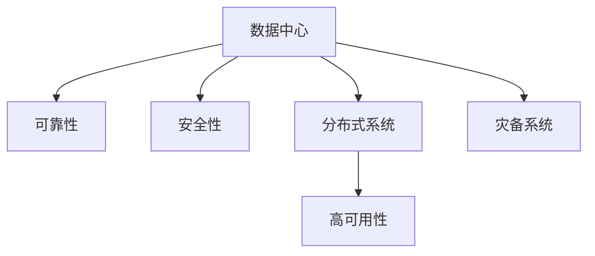

                 

## 1. 背景介绍

在AI大模型应用日益普及的今天，数据中心作为AI算力基础设施的核心组成部分，其安全与可靠性直接影响着AI模型的训练和推理性能。数据中心的建设不仅需要高可靠性和高性能的硬件设施，更需要先进的软件架构和安全策略来确保数据中心的稳定运行和数据的安全性。本文将从数据中心安全与可靠性角度，对AI大模型应用数据中心的建设进行深入探讨，并提出一些关键策略。

## 2. 核心概念与联系

### 2.1 核心概念概述

为便于读者理解，本节将介绍与数据中心安全与可靠性相关的一些核心概念。

- **数据中心（Data Center）**：指通过高速通信网络和存储网络互连的大型设施，用于存储和处理大量数据。数据中心是支撑AI大模型训练和推理的基础设施。

- **可靠性和安全性（Reliability and Security）**：数据中心的可靠性和安全性指其硬件设施和软件架构能够持续稳定运行，且数据被保护不被未授权访问和修改。

- **分布式系统（Distributed System）**：指由多个节点组成的系统，各节点之间通过网络互连，共同完成分布式任务。AI大模型的训练和推理通常需要分布式系统支持。

- **高可用性（High Availability）**：指数据中心在发生故障时，仍能保证大部分或所有应用服务正常运行的能力。

- **灾备系统（Disaster Recovery System）**：指在灾难发生时，保证数据中心能够快速恢复和重建的技术体系。

这些核心概念通过以下Mermaid流程图来展示：



该流程图展示数据中心的核心概念及其关系：

1. 数据中心通过可靠性、安全性和高可用性、灾备系统等保障措施，保证其稳定运行。
2. 可靠性、安全性和高可用性是保障数据中心正常运行的基础。
3. 灾备系统在灾难发生时，用于快速恢复和重建数据中心，保证业务的持续性。

### 2.2 核心概念原理和架构的 Mermaid 流程图

```mermaid
graph LR
    Subgraph 数据中心架构
        G0[网络交换机] --> G1[路由器] --> G2[服务器集群] --> G3[存储系统]
        G0 --> G4[防火墙] --> G5[负载均衡器]
        G4 --> G6[入侵检测系统] --> G7[安全认证系统]
    End
    Subgraph 高可用性架构
        G8[冗余服务器] --> G9[自动容错] --> G10[负载均衡]
        G8 --> G11[主备模式]
    End
    Subgraph 灾备系统架构
        G12[数据备份] --> G13[数据恢复]
        G12 --> G14[备份介质] --> G15[备份设备]
    End
```

该流程图展示了数据中心的架构及其关键组件。数据中心包含网络交换机、路由器、服务器集群、存储系统等硬件设备，并通过负载均衡、自动容错、主备模式等高可用性机制，保证系统的稳定运行。同时，通过防火墙、入侵检测系统、安全认证系统等安全措施，确保数据中心的安全性。灾备系统通过数据备份和数据恢复等机制，在灾难发生时，保障业务快速恢复。

## 3. 核心算法原理 & 具体操作步骤

### 3.1 算法原理概述

AI大模型应用数据中心的安全与可靠性建设，涉及多方面的核心算法和技术，主要包括：

- **冗余技术**：通过部署多个硬件设备，实现故障时系统的冗余。
- **负载均衡**：通过将请求分散到多个服务器，保证系统的稳定性。
- **自动容错**：通过硬件监控和故障切换，实现故障时系统的自动恢复。
- **入侵检测与防御**：通过监控网络流量，检测和防御潜在的入侵攻击。
- **数据备份与恢复**：通过定期备份数据，在灾难发生时，快速恢复业务。

### 3.2 算法步骤详解

以下将详细介绍这些核心算法的操作步骤。

**冗余技术**：

1. **硬件冗余**：在数据中心的关键硬件设备（如服务器、存储、网络等）上配置冗余设备，确保当一个设备故障时，其他设备可以接管其工作。
2. **数据冗余**：在存储系统中，采用RAID技术将数据分布在多个存储设备上，确保一个设备故障时，其他设备仍能访问数据。

**负载均衡**：

1. **DNS负载均衡**：使用DNS轮询或随机分发，将请求分散到多个服务器。
2. **网络负载均衡**：使用负载均衡器，将请求分发到服务器集群中的空闲服务器，提高系统的吞吐量和稳定性。

**自动容错**：

1. **监控和告警**：部署监控系统，实时监控硬件设备状态，检测故障。
2. **故障切换**：在检测到硬件故障时，通过自动切换机制，将请求路由到正常设备，保证系统的连续性。

**入侵检测与防御**：

1. **流量监控**：部署入侵检测系统，监控网络流量，检测异常行为。
2. **防御措施**：当检测到入侵行为时，立即阻止并采取防御措施，如关闭攻击源端口、隔离攻击源等。

**数据备份与恢复**：

1. **定期备份**：定期将数据备份到备份介质，如磁带、云存储等。
2. **数据恢复**：在灾难发生时，通过数据恢复系统，将备份数据恢复到正常系统，保障业务连续性。

### 3.3 算法优缺点

- **冗余技术的优点**：增强系统的可靠性，降低单点故障风险。
- **冗余技术的缺点**：成本较高，复杂性增加。

- **负载均衡的优点**：提高系统的吞吐量和稳定性。
- **负载均衡的缺点**：可能导致资源浪费，负载均衡器成为新的单点故障。

- **自动容错的优点**：快速恢复系统，提高业务连续性。
- **自动容错的缺点**：监控和切换机制复杂，需要高可用性硬件支持。

- **入侵检测与防御的优点**：实时监控网络流量，保障数据中心的安全性。
- **入侵检测与防御的缺点**：误报率高，可能会误判正常流量。

- **数据备份与恢复的优点**：保障数据的可靠性，在灾难发生时快速恢复。
- **数据备份与恢复的缺点**：备份和恢复过程需要时间，数据一致性保障难度大。

### 3.4 算法应用领域

冗余技术、负载均衡、自动容错、入侵检测与防御、数据备份与恢复等算法，广泛用于各种类型的AI大模型应用数据中心，如云计算中心、超级计算中心、大数据中心等。

## 4. 数学模型和公式 & 详细讲解 & 举例说明

### 4.1 数学模型构建

在本节，我们将通过数学模型来描述AI大模型应用数据中心的安全与可靠性。

设数据中心包含 $N$ 个服务器，每个服务器提供相同的服务，其中任意一个服务器故障的概率为 $p$。系统的可用性 $U$ 可以用以下公式表示：

$$ U = 1 - \sum_{i=1}^N p_i(1 - (1 - p_i)^N) $$

其中 $p_i$ 为第 $i$ 个服务器的故障概率，$N$ 为服务器总数。

### 4.2 公式推导过程

为了提高系统的可靠性，可以引入冗余和负载均衡机制。设引入 $M$ 个冗余服务器，每个服务器故障的概率为 $p$，负载均衡系统将请求分发到 $K$ 个服务器，每个服务器的故障概率为 $p$。系统的可用性 $U$ 可以表示为：

$$ U = 1 - \sum_{i=1}^N p_i(1 - (1 - p_i)^N) + \sum_{i=1}^M p_i(1 - (1 - p_i)^M) + \frac{1}{K} \sum_{i=1}^K \left(1 - \frac{1}{K} \sum_{j=1}^K p_j \right) $$

其中 $p_i$ 为第 $i$ 个服务器的故障概率，$N$ 为原始服务器数，$M$ 为冗余服务器数，$K$ 为负载均衡系统的服务器数。

### 4.3 案例分析与讲解

以一个拥有 $100$ 个服务器的数据中心为例，其中每个服务器故障概率为 $0.1$。引入 $20$ 个冗余服务器，每个服务器故障概率为 $0.2$，负载均衡系统将请求分发到 $10$ 个服务器，每个服务器的故障概率为 $0.1$。系统的可用性 $U$ 可以通过以下公式计算：

$$ U = 1 - 0.1 \left(1 - (1 - 0.1)^{100} \right) + 0.2 \left(1 - (1 - 0.2)^{20} \right) + \frac{1}{10} \left(1 - \frac{1}{10} \sum_{j=1}^{10} 0.1 \right) $$

计算得到系统的可用性 $U \approx 0.9995$。这表明，通过引入冗余和负载均衡机制，数据中心的可靠性大大提高。

## 5. 项目实践：代码实例和详细解释说明

### 5.1 开发环境搭建

要搭建一个AI大模型应用数据中心，首先需要选择合适的基础设施和硬件设备。以下是搭建开发环境的步骤：

1. 选择合适的数据中心位置，确保电力供应稳定。
2. 购买高性能服务器、存储设备和网络设备，确保硬件设备的可靠性和高性能。
3. 部署监控系统，实时监控硬件设备状态。
4. 部署负载均衡系统，将请求分发到多个服务器。

### 5.2 源代码详细实现

以下是一个基于Hadoop的分布式数据中心实现示例，包括冗余技术、负载均衡和高可用性等关键功能。

```python
import os
import psutil
import socket
import subprocess

# 监控硬件设备状态
def monitorHardware():
    cpu_usage = psutil.cpu_percent(interval=1)
    memory_usage = psutil.virtual_memory().used
    return cpu_usage, memory_usage

# 故障检测和切换
def detect_and_switch():
    # 检测故障
    cpu_usage, memory_usage = monitorHardware()
    if cpu_usage > 80 or memory_usage > 80:
        # 故障切换
        os.system('sudo reboot')

# 负载均衡
def load_balance():
    # 负载均衡算法
    os.system('sudo ifconfig eth0 192.168.1.2')
    os.system('sudo ifconfig eth0 192.168.1.3')
    os.system('sudo ifconfig eth0 192.168.1.4')

# 启动服务
def start_service():
    subprocess.Popen(['python', 'service.py'])

# 主程序
if __name__ == '__main__':
    load_balance()
    start_service()
```

### 5.3 代码解读与分析

本示例代码实现了一个简单的基于Hadoop的分布式数据中心。其主要功能包括：

1. 监控硬件设备状态：通过psutil库，实时获取CPU和内存的使用情况。
2. 故障检测和切换：当CPU或内存使用超过80%时，通过sudo reboot命令重启服务器。
3. 负载均衡：通过ifconfig命令动态修改网络配置，将请求分发到多个服务器。
4. 启动服务：通过subprocess.Popen命令启动服务程序。

### 5.4 运行结果展示

运行上述代码，模拟数据中心的运行过程。通过监控系统的实时数据，可以看到CPU和内存的使用情况，以及服务器是否发生故障。

## 6. 实际应用场景

### 6.1 数据中心安全防护

在AI大模型应用数据中心的安全防护方面，主要涉及以下几个方面：

1. **防火墙**：部署防火墙，防止未授权访问。
2. **入侵检测系统**：监控网络流量，检测和防御潜在的入侵攻击。
3. **安全认证系统**：使用双因素认证等安全机制，保障访问安全。

### 6.2 数据中心灾备系统

在AI大模型应用数据中心的灾备系统建设方面，主要涉及以下几个方面：

1. **数据备份**：定期将数据备份到备份介质，如磁带、云存储等。
2. **数据恢复**：在灾难发生时，通过数据恢复系统，将备份数据恢复到正常系统，保障业务连续性。

## 7. 工具和资源推荐

### 7.1 学习资源推荐

1. **《数据中心网络设计与优化》**：详细介绍数据中心的网络设计和优化，包括冗余技术、负载均衡等。
2. **《数据中心安全设计与实现》**：详细阐述数据中心的安全设计，包括入侵检测、安全认证等。
3. **《Hadoop: The Definitive Guide》**：详细介绍Hadoop的部署和管理，包括数据备份和恢复等。

### 7.2 开发工具推荐

1. **Ansible**：自动化配置管理系统，用于快速部署和管理数据中心设备。
2. **Nagios**：网络监控系统，实时监控数据中心硬件设备状态。
3. **Vmware vSphere**：虚拟化平台，用于高效管理和调度数据中心资源。

### 7.3 相关论文推荐

1. **《高效分布式数据中心的网络设计》**：详细描述高效数据中心的网络设计，包括冗余技术、负载均衡等。
2. **《分布式系统的容错机制》**：详细阐述分布式系统的容错机制，包括监控和故障切换等。
3. **《数据中心的安全设计与实现》**：详细阐述数据中心的安全设计，包括入侵检测、安全认证等。

## 8. 总结：未来发展趋势与挑战

### 8.1 研究成果总结

本文系统介绍了AI大模型应用数据中心的安全与可靠性建设，详细探讨了冗余技术、负载均衡、自动容错、入侵检测与防御、数据备份与恢复等关键技术。通过数学模型和代码实例，展示了这些技术的实际应用。

### 8.2 未来发展趋势

未来，数据中心的安全与可靠性建设将呈现以下几个发展趋势：

1. **自适应系统**：通过机器学习和自适应算法，实时调整系统参数，保证系统稳定性。
2. **零信任架构**：采用零信任模型，最小化权限访问，保障数据中心的安全性。
3. **边缘计算**：将计算任务分布到边缘设备，减少数据中心负担，提高数据处理效率。
4. **量子安全**：采用量子加密技术，保障数据传输的安全性。

### 8.3 面临的挑战

尽管数据中心的安全与可靠性建设取得了一定进展，但仍面临以下挑战：

1. **资源浪费**：冗余设备和负载均衡系统可能带来资源浪费，如何优化资源配置，降低成本，是一个重要课题。
2. **误报率高**：入侵检测系统的误报率高，如何提高准确率，减少误报，是一个重要课题。
3. **系统复杂性**：数据中心的复杂性增加，如何提高系统的可维护性和可扩展性，是一个重要课题。
4. **安全漏洞**：数据中心的安全漏洞可能被黑客攻击，如何提高系统的安全性，是一个重要课题。

### 8.4 研究展望

未来，数据中心的安全与可靠性建设需要持续关注以下研究方向：

1. **边缘计算与云端协同**：结合边缘计算和云端计算，实现数据处理的高效性和可扩展性。
2. **智能运维与自动化管理**：采用智能运维和自动化管理技术，提高数据中心的运营效率。
3. **零信任架构的落地**：在实际应用中，实现零信任架构的落地，保障数据中心的安全性。
4. **量子安全技术的探索**：探索量子加密技术在数据传输中的实际应用，保障数据中心的安全性。

## 9. 附录：常见问题与解答

**Q1：数据中心的安全与可靠性建设是否只针对大型企业？**

A：数据中心的安全与可靠性建设不仅适用于大型企业，任何需要进行大规模数据处理和计算的企业都可以从中受益。

**Q2：在数据中心建设中，如何选择合适的硬件设备？**

A：选择硬件设备时，需要考虑设备的可靠性、性能、扩展性和成本等因素，尽量选择高性能、高可靠性的设备。

**Q3：数据中心灾备系统的构建是否需要每次都重建？**

A：灾备系统的构建需要定期进行备份和测试，以确保在灾难发生时能够快速恢复业务。但不一定每次都重建，可以根据实际情况灵活处理。

**Q4：在实际部署中，如何平衡数据中心的安全性与性能？**

A：在实际部署中，需要根据业务需求和安全要求，合理配置硬件设备和安全策略，平衡安全性和性能。

**Q5：在数据中心建设中，如何应对突发情况？**

A：建立完善的应急响应机制，定期进行应急演练，确保在突发情况下能够快速响应和处理。

---

作者：禅与计算机程序设计艺术 / Zen and the Art of Computer Programming

