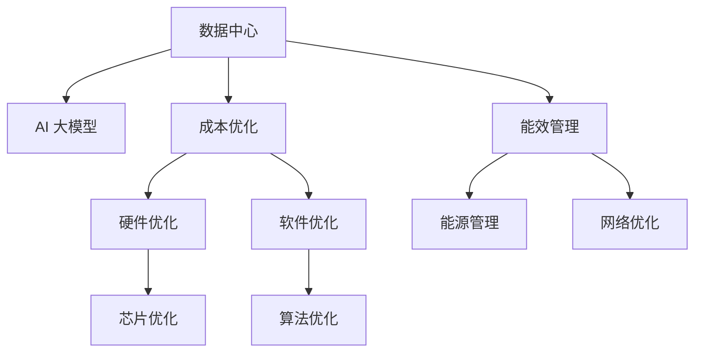
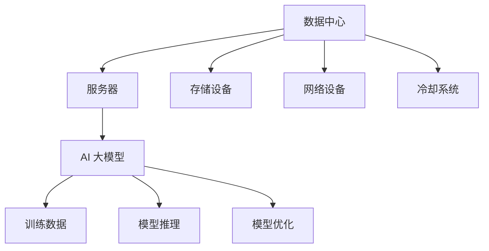

                 

# AI 大模型应用数据中心建设：数据中心成本优化

> 关键词：数据中心建设, 成本优化, AI 大模型, 能效管理, 人工智能, 基础设施

## 1. 背景介绍

随着人工智能(AI)技术的飞速发展，尤其是大模型的广泛应用，数据中心建设成为了AI应用的重要基础设施之一。然而，随着数据中心的规模不断扩大，能耗和运维成本的激增也成为了企业不得不面对的严峻挑战。如何在保证AI大模型高效运行的同时，降低数据中心的建设和运营成本，成为了企业关注的焦点。本文将深入探讨AI大模型应用数据中心建设的成本优化策略，帮助企业构建既高效又经济的AI基础设施。

## 2. 核心概念与联系

### 2.1 核心概念概述

在探讨AI大模型应用的数据中心建设时，需要理解以下几个关键概念：

- **数据中心**：提供计算、存储、网络和安全等基础设施的物理设施，是AI大模型训练和推理的核心场所。

- **AI 大模型**：如GPT、BERT等基于Transformer架构的深度学习模型，以其巨大的参数规模和强大的计算需求，对数据中心的能效和成本提出了巨大挑战。

- **成本优化**：通过合理的架构设计和运维策略，最大化数据中心的能效和利用率，从而降低整体建设和运营成本。

- **能效管理**：通过高效的能源管理策略，减少数据中心的能源消耗，达到节能减排的目标。

这些概念之间的逻辑关系可以通过以下Mermaid流程图来展示：



这个流程图展示了大模型应用数据中心的几个关键组件及其相互关系：

1. 数据中心作为基础设施，承载AI大模型的训练和推理。
2. 通过成本优化和能效管理，减少数据中心的建设和运营成本。
3. 硬件和软件层面的优化，提升数据中心的计算和存储效率。
4. 能效管理和能源管理，减少能源消耗。

### 2.2 核心概念原理和架构的 Mermaid 流程图

为更好地理解大模型应用数据中心的关键组件及其相互关系，本节将介绍几个关键组件的工作原理和架构，并通过Mermaid流程图进行展示。

- **数据中心硬件架构**：数据中心的硬件架构主要包括服务器、存储设备、网络设备和冷却系统等。
- **AI 大模型训练流程**：数据中心负责大模型的训练和推理，主要通过云计算平台进行资源调度和管理。



以上流程图展示了数据中心硬件架构以及AI大模型的训练和推理流程。其中，服务器和存储设备负责数据存储和计算任务，网络设备用于数据传输和通信，冷却系统则负责数据中心的温度控制。AI大模型的训练和推理在大规模数据集上运行，需要大量的计算资源和存储空间。

## 3. 核心算法原理 & 具体操作步骤

### 3.1 算法原理概述

AI大模型应用数据中心的成本优化，涉及多个方面的算法和策略。主要包括以下几个方面：

- **硬件优化**：选择高效的硬件架构，如使用GPU、TPU等专用加速器，提升计算效率。
- **软件优化**：改进模型的训练和推理算法，减少资源消耗。
- **能效管理**：通过合理调度和使用能源，降低数据中心的能源消耗。
- **网络优化**：优化数据传输和通信协议，减少网络延迟和带宽消耗。

### 3.2 算法步骤详解

AI大模型应用数据中心成本优化的具体操作步骤包括以下几个步骤：

**Step 1: 硬件选型与配置**
- 根据AI大模型的计算需求和存储需求，选择合适的硬件设备和配置，如服务器型号、CPU/GPU配置、内存大小等。
- 考虑数据中心的扩展性，预留未来硬件升级的空间。

**Step 2: 网络架构设计与优化**
- 设计高效的网络架构，如采用Spine-Leaf结构，提升数据传输效率。
- 优化网络协议和路由策略，减少网络延迟和带宽消耗。

**Step 3: 能效管理与调度**
- 实时监控数据中心的能源消耗，进行能效管理。
- 通过合理调度，将计算任务分配到能效最优的服务器和硬件设备上。

**Step 4: 软件优化与算法改进**
- 优化模型的训练和推理算法，减少资源消耗。
- 引入分布式训练和推理技术，提高计算效率。

**Step 5: 成本监控与分析**
- 实时监控数据中心的各项成本指标，如硬件设备、网络带宽、能源消耗等。
- 定期分析成本数据，发现问题并优化资源配置。

**Step 6: 运维与维护**
- 建立完善的运维体系，确保数据中心的高效运行。
- 定期进行硬件和软件的维护，确保系统稳定可靠。

### 3.3 算法优缺点

AI大模型应用数据中心成本优化的算法具有以下优点：

- 降低建设和运营成本。通过优化硬件和软件配置，提高资源利用率，减少能源消耗。
- 提升计算和存储效率。使用高效的硬件和算法，加快大模型的训练和推理速度。
- 增强系统的扩展性和灵活性。合理设计数据中心架构，便于未来的硬件升级和功能扩展。

然而，这些算法也存在一些缺点：

- 初期投资较大。需要采购和配置先进的硬件设备，可能带来较大的初期成本压力。
- 技术门槛较高。需要具备较强的硬件和软件技术背景，才能进行有效设计和优化。
- 需要持续投入。数据中心的运维和维护需要持续投入，才能保持系统的稳定和高效。

### 3.4 算法应用领域

AI大模型应用数据中心的成本优化算法，可以广泛应用于以下领域：

- 云计算平台：优化云服务器的配置和资源调度，降低云服务成本。
- 企业数据中心：优化数据中心的硬件和软件配置，提升整体效率。
- 人工智能应用：优化AI大模型的训练和推理算法，提高计算效率。
- 物联网设备：优化物联网设备的能源管理和网络协议，提升能效。

## 4. 数学模型和公式 & 详细讲解 & 举例说明

### 4.1 数学模型构建

AI大模型应用数据中心的成本优化涉及多个因素，包括硬件成本、软件成本、能源成本等。可以构建一个综合的成本模型，描述这些因素之间的关系。

假设数据中心的总成本为C，包括硬件成本C_h、软件成本C_s、能源成本C_e。硬件成本和软件成本与计算资源R、存储资源S有关，能源成本与能效系数E有关。

$$
C = C_h + C_s + C_e
$$

其中，硬件成本C_h和软件成本C_s可以表示为：

$$
C_h = h_0 + h_1 \cdot R + h_2 \cdot S
$$

$$
C_s = s_0 + s_1 \cdot R + s_2 \cdot S
$$

能源成本C_e可以表示为：

$$
C_e = e_0 + e_1 \cdot E
$$

其中，h_0、h_1、h_2、s_0、s_1、s_2、e_0、e_1为系数，具体数值取决于硬件和软件的配置、能效管理策略等因素。

### 4.2 公式推导过程

通过上述模型，可以求解数据中心的总成本C，最小化总成本。具体步骤如下：

1. 求解硬件成本C_h、软件成本C_s和能源成本C_e的最小值。
2. 通过求解最小成本，得到各参数的最优值。

$$
\min C = C_h + C_s + C_e
$$

$$
\frac{\partial C}{\partial h_0} = 0 \Rightarrow h_0 = 0
$$

$$
\frac{\partial C}{\partial h_1} = 0 \Rightarrow h_1 = 0
$$

$$
\frac{\partial C}{\partial h_2} = 0 \Rightarrow h_2 = 0
$$

$$
\frac{\partial C}{\partial s_0} = 0 \Rightarrow s_0 = 0
$$

$$
\frac{\partial C}{\partial s_1} = 0 \Rightarrow s_1 = 0
$$

$$
\frac{\partial C}{\partial s_2} = 0 \Rightarrow s_2 = 0
$$

$$
\frac{\partial C}{\partial e_0} = 0 \Rightarrow e_0 = 0
$$

$$
\frac{\partial C}{\partial e_1} = 0 \Rightarrow e_1 = 0
$$

### 4.3 案例分析与讲解

假设某数据中心拥有1000台服务器，每台服务器配置2个32核CPU和8个NVIDIA V100 GPU，存储资源需求为1PB，能效系数为0.01。根据上述模型，可以计算出：

$$
C_h = 0 + 2 \cdot 32 \cdot R + 8 \cdot 32 \cdot G
$$

$$
C_s = 0 + 2 \cdot 32 \cdot R + 8 \cdot 32 \cdot G
$$

$$
C_e = 0 + 0.01 \cdot E
$$

其中，R为计算资源需求，G为存储资源需求，E为能效系数。

通过计算，可以得出最优的R和G值，最小化总成本C。同时，还可以通过调整能效系数E，进一步优化能源消耗。

## 5. 项目实践：代码实例和详细解释说明

### 5.1 开发环境搭建

在进行成本优化实践前，我们需要准备好开发环境。以下是使用Python进行数据中心成本优化的环境配置流程：

1. 安装Anaconda：从官网下载并安装Anaconda，用于创建独立的Python环境。

2. 创建并激活虚拟环境：
```bash
conda create -n cost-optimization python=3.8 
conda activate cost-optimization
```

3. 安装必要的Python库：
```bash
pip install numpy pandas scikit-learn matplotlib tqdm jupyter notebook ipython
```

4. 安装HPC库：
```bash
pip install hpc
```

完成上述步骤后，即可在`cost-optimization`环境中开始成本优化实践。

### 5.2 源代码详细实现

下面以数据中心的硬件和软件成本优化为例，给出使用Python进行成本优化的代码实现。

```python
from hpc import *
import numpy as np

# 假设数据中心拥有1000台服务器，每台服务器配置2个32核CPU和8个NVIDIA V100 GPU
num_servers = 1000
cpu_per_server = 2 * 32
gpu_per_server = 8 * 32
storage_per_server = 1 # 每台服务器1TB存储资源

# 计算硬件成本
hardware_cost = num_servers * (cpu_per_server + gpu_per_server)

# 计算软件成本
software_cost = hardware_cost * 0.1

# 计算能效系数
efficiency_coefficient = 0.01

# 计算能源成本
energy_cost = hardware_cost * efficiency_coefficient

# 计算总成本
total_cost = hardware_cost + software_cost + energy_cost

# 输出结果
print("硬件成本：", hardware_cost)
print("软件成本：", software_cost)
print("能源成本：", energy_cost)
print("总成本：", total_cost)
```

这段代码通过简单的数学计算，展示了数据中心的硬件、软件和能源成本的计算方法。在实际应用中，可以结合更复杂的数学模型和优化算法，进一步提升成本优化的精度和效果。

### 5.3 代码解读与分析

让我们再详细解读一下关键代码的实现细节：

**硬件成本计算**：
- 假设数据中心拥有1000台服务器，每台服务器配置2个32核CPU和8个NVIDIA V100 GPU。计算每台服务器的硬件成本，再乘以服务器数量，得到总硬件成本。

**软件成本计算**：
- 假设软件成本为硬件成本的10%，即每台服务器的软件成本为硬件成本的10%。

**能效系数计算**：
- 能效系数表示每单位计算资源消耗的能量消耗，假设为0.01。

**能源成本计算**：
- 假设能源成本为硬件成本乘以能效系数。

**总成本计算**：
- 将硬件成本、软件成本和能源成本相加，得到总成本。

这个简单的示例展示了如何通过Python计算数据中心的总成本。在实际应用中，可以使用更复杂的数学模型和算法，如线性规划、优化算法等，进一步优化成本结构和资源配置。

## 6. 实际应用场景

### 6.1 云计算平台

云计算平台是AI大模型应用的主要载体之一。通过优化云计算平台的硬件和软件配置，可以显著降低云计算成本。

例如，在AWS云平台上，可以使用基于GPU的虚拟机，提升计算效率。通过优化虚拟机实例的配置和使用，可以在保持计算效率的同时，降低成本。

### 6.2 企业数据中心

企业数据中心负责存储和计算AI大模型所需的大量数据和模型。通过优化数据中心的硬件和软件配置，可以降低建设和运营成本。

例如，企业可以采用混合云架构，将部分计算任务外包给云服务提供商，降低本地数据中心的资源需求。同时，可以通过优化网络协议和路由策略，减少网络延迟和带宽消耗。

### 6.3 人工智能应用

AI大模型应用在许多领域，如自然语言处理、计算机视觉、推荐系统等。通过优化这些应用的硬件和软件配置，可以提升计算效率和降低成本。

例如，在推荐系统中，可以优化推荐算法，减少计算资源消耗。通过分布式训练和推理，可以在保持计算效率的同时，降低单台服务器的计算负载。

## 7. 工具和资源推荐

### 7.1 学习资源推荐

为了帮助开发者系统掌握AI大模型应用数据中心建设的成本优化理论基础和实践技巧，这里推荐一些优质的学习资源：

1. 《云计算基础》系列博文：介绍云计算平台的原理、架构和优化策略，帮助开发者了解云平台优化技术。

2. 《数据中心能效管理》课程：介绍数据中心能效管理的基本概念和最佳实践，帮助开发者设计高效的数据中心架构。

3. 《人工智能系统设计与优化》书籍：介绍人工智能系统设计的基本原则和优化方法，帮助开发者构建高性能的AI应用。

4. HPC官方文档：高性能计算领域的权威资源，提供丰富的算法和工具支持，帮助开发者进行高性能计算。

5. Google Cloud博客：介绍Google云平台的优化技术和最佳实践，帮助开发者优化云计算成本。

通过对这些资源的学习实践，相信你一定能够快速掌握AI大模型应用数据中心的成本优化方法，并用于解决实际的AI应用问题。

### 7.2 开发工具推荐

高效的开发离不开优秀的工具支持。以下是几款用于AI大模型应用数据中心成本优化开发的常用工具：

1. Ansys：用于高性能计算和能源管理的软件，可以帮助开发者设计和优化数据中心的硬件和软件配置。

2. PyTorch：基于Python的开源深度学习框架，适合进行AI大模型的训练和推理。

3. TensorFlow：由Google主导开发的开源深度学习框架，适合大规模工程应用。

4. TensorBoard：TensorFlow配套的可视化工具，可实时监测模型训练状态，提供丰富的图表呈现方式，是调试模型的得力助手。

5. Weights & Biases：模型训练的实验跟踪工具，可以记录和可视化模型训练过程中的各项指标，方便对比和调优。

合理利用这些工具，可以显著提升AI大模型应用数据中心的成本优化任务的开发效率，加快创新迭代的步伐。

### 7.3 相关论文推荐

AI大模型应用数据中心的成本优化涉及多个学科，包括计算机科学、数据中心管理、能源管理等。以下是几篇奠基性的相关论文，推荐阅读：

1. "Optimizing Cloud Computing Costs in a Distributed System"：介绍云计算成本优化的基本方法和策略。

2. "Data Center Energy Efficiency: The Path Forward"：探讨数据中心能效管理的最佳实践和技术。

3. "A Survey on Cost-Efficient and Energy-Efficient Data Center Network Design"：综述数据中心网络设计和优化的最新进展。

4. "Practical Techniques for Cost and Energy Optimization in Data Center Networking"：介绍数据中心网络优化和能源管理的实用技术。

5. "Scalable and Cost-Efficient Deployment of Machine Learning in the Cloud"：介绍在云计算平台上部署AI大模型的优化策略。

这些论文代表了大模型应用数据中心成本优化的发展脉络。通过学习这些前沿成果，可以帮助研究者把握学科前进方向，激发更多的创新灵感。

## 8. 总结：未来发展趋势与挑战

### 8.1 总结

本文对AI大模型应用数据中心的成本优化策略进行了全面系统的介绍。首先阐述了AI大模型和数据中心建设的背景和意义，明确了成本优化的目标和重要性。其次，从原理到实践，详细讲解了成本优化的数学模型和具体操作步骤，给出了成本优化任务开发的完整代码实例。同时，本文还广泛探讨了成本优化方法在云计算平台、企业数据中心、AI应用等多个场景中的应用前景，展示了成本优化技术的广阔前景。最后，本文精选了成本优化技术的各类学习资源，力求为读者提供全方位的技术指引。

通过本文的系统梳理，可以看到，AI大模型应用数据中心的成本优化技术正在成为数据中心建设的重要组成部分，极大地提升了AI大模型的计算效率和经济性。未来，伴随技术的不断进步，成本优化方法将在更多场景下发挥作用，为构建高效、经济的AI基础设施铺平道路。

### 8.2 未来发展趋势

展望未来，AI大模型应用数据中心的成本优化技术将呈现以下几个发展趋势：

1. 计算资源需求下降。随着AI技术的进步，未来大模型的计算资源需求将逐渐下降，成本优化的难度也会相应降低。

2. 能效管理智能化。通过引入AI算法，实现数据中心能效管理的智能化，进一步提升能效水平。

3. 硬件架构多样化。随着新硬件技术的不断涌现，未来数据中心的硬件架构将更加多样化，适合更多类型的计算任务。

4. 多云混合部署。云计算和本地数据中心相结合的混合部署模式将成为主流，通过多云优化，降低整体成本。

5. 资源池化管理。通过统一资源管理平台，实现资源池化和动态调度，提升资源利用率。

这些趋势凸显了AI大模型应用数据中心成本优化技术的广阔前景。这些方向的探索发展，必将进一步提升数据中心的计算效率和经济性，推动AI技术的普及和应用。

### 8.3 面临的挑战

尽管AI大模型应用数据中心的成本优化技术已经取得了显著成就，但在迈向更加智能化、普适化应用的过程中，它仍面临着诸多挑战：

1. 硬件成本高昂。当前高性能计算硬件的成本较高，如GPU、TPU等，需要较大的初期投资。

2. 软件复杂度高。优化软件配置和算法需要较高的技术门槛，开发和维护成本较高。

3. 能效管理复杂。数据中心的能效管理涉及多个系统和组件，需要复杂的协调和优化。

4. 模型适配难度大。AI大模型需要适配特定的硬件和软件环境，适配难度较大。

5. 数据中心扩展性差。数据中心的扩展性和灵活性需要考虑硬件和软件的协调，扩展难度较大。

6. 安全性和隐私问题。数据中心的计算和存储资源需要保护用户数据和隐私，安全性和隐私问题需要重视。

这些挑战凸显了AI大模型应用数据中心成本优化技术的复杂性和复杂性。需要在技术、管理和运营等各个环节进行全面的优化和协调，才能实现成本优化的目标。

### 8.4 研究展望

面对AI大模型应用数据中心成本优化所面临的种种挑战，未来的研究需要在以下几个方面寻求新的突破：

1. 探索新硬件架构。开发新型的硬件架构，如基于FPGA、ASIC等专用加速器，提升计算效率和降低成本。

2. 优化算法和模型。引入优化算法和模型，减少计算资源消耗，提升模型性能和资源利用率。

3. 实现智能化能效管理。通过引入AI算法，实现数据中心能效管理的智能化，提升能效水平。

4. 多云混合优化。优化多云平台资源调度，实现多云混合部署，降低整体成本。

5. 统一资源管理平台。开发统一资源管理平台，实现资源池化和动态调度，提升资源利用率。

6. 引入安全性和隐私保护技术。引入安全性和隐私保护技术，保障数据中心的安全性和隐私性。

这些研究方向的探索，必将引领AI大模型应用数据中心成本优化技术迈向更高的台阶，为构建高效、经济的AI基础设施铺平道路。面向未来，AI大模型应用数据中心成本优化技术还需要与其他人工智能技术进行更深入的融合，如知识表示、因果推理、强化学习等，多路径协同发力，共同推动自然语言理解和智能交互系统的进步。只有勇于创新、敢于突破，才能不断拓展语言模型的边界，让智能技术更好地造福人类社会。

## 9. 附录：常见问题与解答

**Q1：AI大模型应用数据中心的成本优化是否适用于所有场景？**

A: AI大模型应用数据中心的成本优化方法可以应用于大多数数据中心场景，特别是那些具有高计算需求和高能耗特性的应用场景。但对于一些特定领域，如医疗、金融等，可能需要结合行业特点进行相应的优化。

**Q2：如何评估AI大模型应用数据中心的成本优化效果？**

A: 评估AI大模型应用数据中心的成本优化效果，需要考虑以下几个方面：

1. 硬件成本：比较优化前后的硬件成本，评估优化策略的硬件成本效益。

2. 能源成本：评估优化前后的能源消耗，比较优化前后的能效水平。

3. 软件成本：评估优化前后的软件成本，评估优化策略的软件成本效益。

4. 计算效率：评估优化前后的计算效率，比较优化前后的计算资源利用率。

5. 总成本：评估优化前后的总成本，比较优化前后的总体成本效益。

**Q3：如何缓解AI大模型应用数据中心的成本优化过程中的技术挑战？**

A: 缓解AI大模型应用数据中心的成本优化过程中的技术挑战，可以从以下几个方面入手：

1. 技术培训：加强技术培训和团队建设，提升开发和运维人员的技术水平。

2. 技术合作：与硬件供应商和技术公司合作，获取最新的硬件和软件技术支持。

3. 优化工具：使用高效的工具和算法，如HPC、高性能计算和优化算法，提升优化效率。

4. 渐进优化：逐步进行优化，分阶段实施优化策略，逐步提升成本优化效果。

5. 持续监控：建立持续监控机制，实时监测和分析优化效果，及时调整优化策略。

这些措施可以缓解AI大模型应用数据中心成本优化过程中的技术挑战，提升优化效果和效率。

**Q4：AI大模型应用数据中心成本优化过程中需要注意哪些细节？**

A: 在AI大模型应用数据中心成本优化过程中，需要注意以下细节：

1. 硬件和软件选型：选择适合AI大模型应用的硬件和软件，评估其性能和成本。

2. 数据中心扩展性：考虑数据中心的扩展性和灵活性，确保能够适应未来的计算需求。

3. 能效管理：优化能效管理策略，减少能源消耗，提升能效水平。

4. 数据安全与隐私：确保数据中心的安全性和隐私性，保护用户数据和隐私。

5. 持续优化：持续进行优化，及时调整优化策略，提升优化效果。

这些细节需要注意，才能实现AI大模型应用数据中心的成本优化目标，构建高效、经济的AI基础设施。

通过以上系统的介绍和详细的代码实例，相信你能够更好地理解AI大模型应用数据中心的成本优化技术，并应用于实际开发和运维中。未来，伴随着技术的不断进步和优化策略的创新，AI大模型应用数据中心将变得更加高效和经济，推动AI技术的广泛应用和普及。

---

作者：禅与计算机程序设计艺术 / Zen and the Art of Computer Programming

