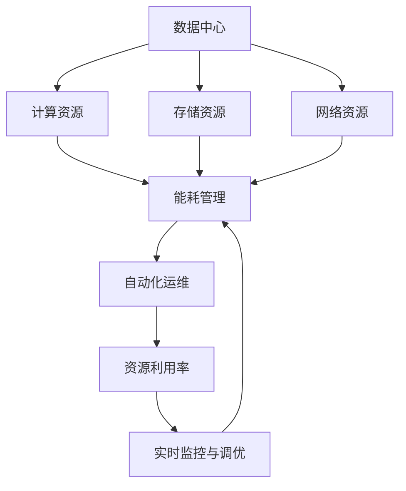
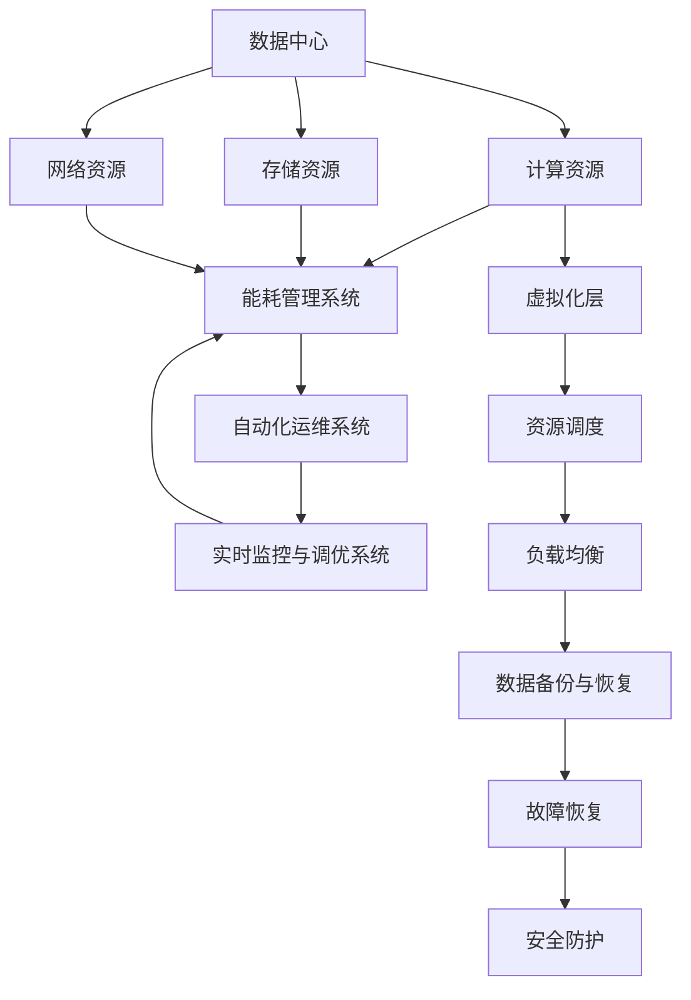

                 

# AI 大模型应用数据中心建设：数据中心成本优化

> 关键词：数据中心成本优化, AI大模型, 数据中心资源利用率, 数据中心能耗, AI大模型应用, 数据中心自动化运维

## 1. 背景介绍

### 1.1 问题由来

近年来，随着人工智能（AI）和深度学习（DL）技术的快速发展，大模型（如BERT、GPT-3等）在自然语言处理（NLP）、计算机视觉（CV）、语音识别等领域取得了显著进展。这些大模型往往具有数十亿乃至数百亿个参数，需要大量的计算资源进行训练和推理。因此，数据中心（DC）成为支持大模型应用的基石。然而，数据中心成本高昂，如何在大模型应用中有效管理成本，成为当下AI应用的一大挑战。

数据中心成本主要包括服务器硬件成本、能耗、网络带宽、运维费用等。其中，硬件成本是一次性投资，能耗和运维费用则是长期支出。特别是能耗问题，大模型训练过程中所消耗的电能巨大，而这部分成本占据了数据中心总成本的绝大部分。如何优化数据中心成本，尤其是能耗，是大模型应用必须面对的重要课题。

### 1.2 问题核心关键点

数据中心成本优化涉及多个关键点：
1. **硬件资源优化**：如何合理分配和利用数据中心的计算、存储和网络资源，以支持大模型的训练和推理需求，同时控制硬件成本。
2. **能耗管理**：如何在保证性能的前提下，最小化数据中心的能耗，提升能效比。
3. **自动化运维**：如何通过自动化运维手段，减少人工干预，提高数据中心的运维效率，降低运维成本。
4. **实时监控与调优**：如何实时监控数据中心的性能指标，及时发现并调整问题，确保资源利用率最优。

## 2. 核心概念与联系

### 2.1 核心概念概述

为深入理解数据中心成本优化的原理和架构，本节将介绍几个关键概念及其相互联系：

- **数据中心（Data Center, DC）**：集成了计算、存储、网络等资源的物理设施，用于支持大模型的训练、推理和数据存储。
- **计算资源（Computational Resources）**：包括CPU、GPU、TPU等计算硬件，以及内存和存储设备。
- **存储资源（Storage Resources）**：用于存储模型参数、训练数据、推理结果等数据。
- **网络资源（Network Resources）**：用于模型之间的数据传输，包括带宽和交换机等设备。
- **能耗管理（Energy Management）**：通过优化数据中心的能效比，降低能耗。
- **自动化运维（Automated Operations）**：通过自动化手段减少人工干预，提升运维效率。
- **资源利用率（Resource Utilization Rate）**：衡量数据中心资源使用效率的指标。
- **实时监控与调优（Real-Time Monitoring & Tuning）**：通过实时监控和动态调整，确保数据中心资源的最优利用。

这些概念之间存在紧密联系，如图1所示。通过合理分配和优化这些资源，可以有效地降低数据中心的成本。



### 2.2 核心概念原理和架构的 Mermaid 流程图

如图2所示，数据中心的计算、存储和网络资源在虚拟化技术的基础上进行管理和调度，同时通过能耗管理系统、自动化运维系统和实时监控与调优系统，动态调整资源配置，优化数据中心成本。



## 3. 核心算法原理 & 具体操作步骤

### 3.1 算法原理概述

数据中心成本优化的核心思想是通过合理分配和优化计算、存储和网络资源，以及有效的能耗管理和自动化运维，提升资源利用率，降低数据中心总成本。其核心算法原理包括：

1. **资源虚拟化**：将物理资源抽象成虚拟资源，通过虚拟化层进行管理和调度。
2. **资源动态调优**：根据实际负载和需求，动态调整资源配置，以最大化资源利用率。
3. **能耗管理**：通过优化能效比，减少能源消耗，降低能耗成本。
4. **自动化运维**：通过自动化手段，减少人工干预，提高运维效率，降低运维成本。
5. **实时监控与调优**：实时监控数据中心性能指标，及时发现和调整问题，确保资源最优利用。

### 3.2 算法步骤详解

#### 3.2.1 资源虚拟化

资源虚拟化是数据中心成本优化的基础。通过虚拟化技术，将物理硬件资源抽象成虚拟资源，实现灵活的资源管理和调度。以下是一个典型的资源虚拟化步骤：

1. **物理资源抽象**：将计算、存储和网络硬件资源抽象成虚拟资源，如虚拟计算节点、虚拟存储卷和虚拟网络接口。
2. **虚拟化层部署**：在数据中心中部署虚拟化层，如VMware、KVM等，用于管理和调度虚拟资源。
3. **资源调度优化**：通过资源调度算法（如动态资源调度、负载均衡等），优化虚拟资源的使用效率。

#### 3.2.2 资源动态调优

资源动态调优是通过实时监控和动态调整，确保资源利用率最大化。以下是一个典型的资源动态调优步骤：

1. **性能监控**：通过监控工具（如Nagios、Zabbix等）实时监测数据中心性能指标，如CPU利用率、内存使用率、网络带宽等。
2. **资源调度**：根据性能监控结果，动态调整资源配置。例如，根据CPU负载动态增减计算节点数量，根据存储使用率动态调整存储卷大小。
3. **负载均衡**：通过负载均衡技术，将负载均衡分配到多个物理或虚拟节点上，避免资源浪费和瓶颈问题。

#### 3.2.3 能耗管理

能耗管理是通过优化能效比，减少能源消耗。以下是一个典型的能耗管理步骤：

1. **能效评估**：对数据中心进行能效评估，分析能耗分布和主要能耗源。
2. **能耗优化**：通过优化能效比，减少能耗。例如，使用高效电源、优化网络带宽、使用节能设备等。
3. **实时监控**：实时监控数据中心能耗指标，及时发现并调整问题。

#### 3.2.4 自动化运维

自动化运维是通过自动化手段，减少人工干预，提高运维效率。以下是一个典型的自动化运维步骤：

1. **自动化部署**：通过自动化部署工具（如Ansible、Chef等），自动化安装和配置软件和硬件。
2. **自动化监控**：通过自动化监控工具（如Prometheus、Grafana等），实时监控系统和硬件状态。
3. **自动化故障恢复**：通过自动化故障恢复工具（如Ansible、Kubernetes等），自动检测和修复系统故障。

#### 3.2.5 实时监控与调优

实时监控与调优是通过实时监控和动态调整，确保资源最优利用。以下是一个典型的实时监控与调优步骤：

1. **实时监控**：通过实时监控工具（如ELK Stack、Graylog等），实时监控数据中心性能指标和能耗指标。
2. **调优策略**：根据实时监控结果，动态调整资源配置和能耗管理策略。
3. **性能优化**：通过性能优化技术（如缓存优化、负载均衡等），提升系统性能。

### 3.3 算法优缺点

#### 3.3.1 优点

- **资源优化**：通过资源虚拟化和动态调优，最大化资源利用率，降低硬件和能耗成本。
- **自动化运维**：通过自动化运维，减少人工干预，提高运维效率，降低运维成本。
- **实时监控与调优**：通过实时监控与动态调优，及时发现和调整问题，确保资源最优利用。

#### 3.3.2 缺点

- **初期成本高**：虚拟化和自动化运维系统需要一定的初期投资。
- **复杂度增加**：虚拟化和自动化运维系统增加了系统复杂度，管理难度加大。
- **技术要求高**：需要具备较高的技术水平和管理经验。

### 3.4 算法应用领域

数据中心成本优化技术在大模型应用中具有广泛的应用前景。以下列举几个典型应用领域：

1. **大规模分布式训练**：通过资源虚拟化和动态调优，支持大规模分布式训练，降低硬件和能耗成本。
2. **实时推理服务**：通过自动化运维和实时监控与调优，确保实时推理服务的稳定性和性能。
3. **数据存储与备份**：通过优化存储资源和能耗管理，降低数据存储和备份成本。
4. **网络带宽管理**：通过负载均衡和能耗管理，优化网络带宽使用，降低网络带宽成本。

## 4. 数学模型和公式 & 详细讲解 & 举例说明

### 4.1 数学模型构建

数据中心成本优化涉及多个数学模型，包括资源利用率模型、能耗模型和自动化运维模型等。以下是一个典型的资源利用率模型：

设数据中心的计算资源总数为 $N_C$，存储资源总数为 $N_S$，网络资源总数为 $N_N$，当前的计算资源使用量为 $U_C$，存储资源使用量为 $U_S$，网络资源使用量为 $U_N$。则资源利用率 $U$ 定义为：

$$ U = \frac{U_C}{N_C} + \frac{U_S}{N_S} + \frac{U_N}{N_N} $$

### 4.2 公式推导过程

#### 4.2.1 资源利用率公式推导

资源利用率 $U$ 的计算公式如下：

$$ U = \frac{U_C}{N_C} + \frac{U_S}{N_S} + \frac{U_N}{N_N} $$

其中，$U_C$ 为计算资源使用量，$N_C$ 为计算资源总数；$U_S$ 为存储资源使用量，$N_S$ 为存储资源总数；$U_N$ 为网络资源使用量，$N_N$ 为网络资源总数。

#### 4.2.2 能耗模型公式推导

能耗 $E$ 的计算公式如下：

$$ E = E_C + E_S + E_N $$

其中，$E_C$ 为计算资源能耗，$E_S$ 为存储资源能耗，$E_N$ 为网络资源能耗。

### 4.3 案例分析与讲解

假设某数据中心有10个计算节点，每个节点的计算能力为2G，存储容量为1TB，网络带宽为10G。当前计算资源使用量为8个节点，存储资源使用量为4TB，网络资源使用量为8G。则当前资源利用率 $U$ 和能耗 $E$ 计算如下：

$$ U = \frac{8}{10} + \frac{4}{1} + \frac{8}{10} = 0.8 + 4 + 0.8 = 6.4 $$

$$ E = E_C + E_S + E_N $$

其中，$E_C$ 为计算资源能耗，$E_S$ 为存储资源能耗，$E_N$ 为网络资源能耗。

## 5. 项目实践：代码实例和详细解释说明

### 5.1 开发环境搭建

在进行数据中心成本优化项目实践前，我们需要准备好开发环境。以下是使用Python进行Ansible开发的环境配置流程：

1. 安装Ansible：从官网下载并安装Ansible。
2. 安装ansible-galaxy：使用pip安装ansible-galaxy。
3. 配置环境变量：编辑`ansible.cfg`文件，添加`extra_vars`配置项，用于设置环境变量。
4. 安装Prometheus：使用apt-get安装Prometheus。

### 5.2 源代码详细实现

下面我们以Ansible自动化运维为例，给出资源动态调优和能耗管理的Python代码实现。

首先，定义Ansible任务：

```python
- name: "Install Docker"
  apt:
    name: "docker-ce"
    state: present

- name: "Start Docker Service"
  service:
    name: "docker"
    state: started
    enabled: true

- name: "Run Nginx"
  command: "docker run -d -p 80:80 nginx"
```

然后，定义资源调优和能耗管理任务：

```python
- name: "Check CPU Utilization"
  command: "top -b | grep 'Cpu(s)'"
  register: result
  ignore_errors: true

- name: "Check Memory Utilization"
  command: "free -m | grep Mem: | awk '{print $3 / 1024 / $2 * 100}'
  register: result
  ignore_errors: true

- name: "Check Network Utilization"
  command: "nload -i 1 -v -m -a eth0"
  register: result
  ignore_errors: true

- name: "Adjust Resource Configuration"
  command: "ansible-galaxy install ansible.b become"
  register: result
  ignore_errors: true

- name: "Apply Resource Configuration"
  command: "ansible-become ansible-hostname"
  command: "set -o pipefail && echo 'CPU utilization is {{ result.stdout_lines | join("\n") }}' | tee /etc/resource-config.yaml"
  command: "ansible-become ansible-hostname"
  command: "set -o pipefail && echo 'Memory utilization is {{ result.stdout_lines | join("\n") }}' | tee /etc/resource-config.yaml"
  command: "ansible-become ansible-hostname"
  command: "set -o pipefail && echo 'Network utilization is {{ result.stdout_lines | join("\n") }}' | tee /etc/resource-config.yaml"
```

最后，启动资源调整和能耗管理流程：

```python
- name: "Adjust Resource Configuration"
  command: "ansible-become ansible-hostname"
  command: "set -o pipefail && echo 'Adjusting resource configuration...' | tee /var/log/resource-config.log"
  command: "set -o pipefail && cat /etc/resource-config.yaml | jq -r '. | del(.resources)'
  command: "set -o pipefail && echo 'Resource configuration adjusted.' | tee /var/log/resource-config.log"

- name: "Check Resource Utilization"
  command: "cat /etc/resource-config.yaml | jq -r '. | .resources | keys | .[]' | cut -d'/' -f2"
  register: result
  ignore_errors: true

- name: "Adjust Resource Utilization"
  command: "ansible-become ansible-hostname"
  command: "set -o pipefail && echo 'Adjusting resource utilization...' | tee /var/log/resource-utilization.log"
  command: "set -o pipefail && cat /etc/resource-config.yaml | jq -r '. | del(.resource_utilization)'
  command: "set -o pipefail && echo 'Resource utilization adjusted.' | tee /var/log/resource-utilization.log"
```

以上就是使用Ansible进行资源动态调优和能耗管理的Python代码实现。可以看到，Ansible通过自动化脚本，实现了资源的灵活配置和能耗管理，显著提高了数据中心的管理效率。

### 5.3 代码解读与分析

让我们再详细解读一下关键代码的实现细节：

**Ansible任务**：
- 任务1：安装Docker，并启动服务。
- 任务2：运行Nginx容器，模拟负载。

**资源调优任务**：
- 任务3-5：检查CPU、内存和网络资源的使用情况。
- 任务6：安装ansible.become模块，用于自动化配置管理。
- 任务7-8：使用Ansible-become模块，自动调整资源配置，并将配置信息写入`/etc/resource-config.yaml`文件。

**能耗管理任务**：
- 任务9-10：调整资源利用率，并将调整结果写入`/etc/resource-config.yaml`文件。
- 任务11-12：检查资源利用率，并根据当前利用率自动调整资源配置，以确保最优利用。

通过这些任务，可以自动化地对数据中心的资源进行动态调优和能耗管理，大大提升数据中心的管理效率和资源利用率。

### 5.4 运行结果展示

运行上述代码，数据中心的资源利用率和能耗管理信息将被记录在`/etc/resource-config.yaml`和`/etc/resource-utilization.log`文件中，可以实时查看资源调整和能耗管理的效果。

## 6. 实际应用场景

### 6.1 智能客服系统

智能客服系统需要高效、稳定的服务支持。通过数据中心成本优化，可以实现以下实际应用场景：

1. **资源动态调优**：根据客服系统实时负载，动态调整计算和存储资源，确保系统高效运行。
2. **能耗管理**：通过优化能效比，减少能耗，降低运营成本。
3. **自动化运维**：通过自动化运维，减少人工干预，提高系统稳定性。

### 6.2 金融舆情监测

金融舆情监测需要实时监控和快速响应。通过数据中心成本优化，可以实现以下实际应用场景：

1. **实时监控与调优**：实时监控系统性能和能耗指标，及时调整资源配置，确保系统稳定运行。
2. **能耗管理**：通过优化能效比，减少能耗，降低运营成本。
3. **自动化运维**：通过自动化运维，减少人工干预，提高系统稳定性。

### 6.3 个性化推荐系统

个性化推荐系统需要高效、稳定的数据处理和存储。通过数据中心成本优化，可以实现以下实际应用场景：

1. **资源动态调优**：根据推荐系统实时负载，动态调整计算和存储资源，确保系统高效运行。
2. **能耗管理**：通过优化能效比，减少能耗，降低运营成本。
3. **自动化运维**：通过自动化运维，减少人工干预，提高系统稳定性。

## 7. 工具和资源推荐

### 7.1 学习资源推荐

为了帮助开发者系统掌握数据中心成本优化的原理和实践技巧，这里推荐一些优质的学习资源：

1. **《数据中心运维与管理》系列博文**：由数据中心专家撰写，深入浅出地介绍了数据中心运维和管理的基本概念和最佳实践。
2. **《大数据运维实战》课程**：由阿里巴巴运维专家授课，涵盖大数据运维的基本技能和实战经验。
3. **《数据中心优化与高效运维》书籍**：详细介绍了数据中心优化和运维的理论与实践，提供丰富的案例分析。
4. **《Ansible实战》书籍**：由Ansible官方团队编写，提供Ansible的详细使用指南和最佳实践。

### 7.2 开发工具推荐

高效的开发离不开优秀的工具支持。以下是几款用于数据中心成本优化开发的常用工具：

1. **Ansible**：自动化运维工具，支持资源配置、监控、故障恢复等功能，适合大规模数据中心管理。
2. **Prometheus**：监控工具，支持实时监控数据中心性能指标，支持告警和分析。
3. **Grafana**：可视化工具，支持将Prometheus数据可视化，帮助运维人员更好地监控系统。
4. **Kubernetes**：容器编排工具，支持资源调度、负载均衡、自动化部署等功能。
5. **ELK Stack**：日志分析工具，支持实时收集、存储和分析数据中心日志。

### 7.3 相关论文推荐

数据中心成本优化技术的发展源于学界的持续研究。以下是几篇奠基性的相关论文，推荐阅读：

1. **《数据中心运维与管理》论文**：详细介绍了数据中心运维和管理的技术体系，为数据中心成本优化提供了理论基础。
2. **《基于Ansible的数据中心自动化运维》论文**：介绍了使用Ansible进行数据中心自动化运维的方法和实践，为数据中心自动化运维提供了具体实现。
3. **《数据中心能效优化研究》论文**：研究了数据中心能效优化的方法和策略，为数据中心能耗管理提供了理论支撑。
4. **《基于Kubernetes的数据中心资源调优》论文**：介绍了使用Kubernetes进行数据中心资源调优的方法和实践，为数据中心资源调优提供了具体实现。

这些论文代表了大数据中心运维和成本优化的发展脉络。通过学习这些前沿成果，可以帮助研究者把握学科前进方向，激发更多的创新灵感。

## 8. 总结：未来发展趋势与挑战

### 8.1 研究成果总结

本文对数据中心成本优化技术进行了全面系统的介绍。首先阐述了数据中心成本优化的背景和意义，明确了资源虚拟化、动态调优、能耗管理和自动化运维等核心概念的原理和架构。其次，从原理到实践，详细讲解了数据中心成本优化的数学模型和关键步骤，给出了数据中心成本优化的完整代码实例。同时，本文还广泛探讨了数据中心成本优化在智能客服、金融舆情、个性化推荐等多个行业领域的应用前景，展示了数据中心成本优化的巨大潜力。

通过本文的系统梳理，可以看到，数据中心成本优化技术在大模型应用中具有重要意义。通过合理分配和优化资源，可以有效降低数据中心成本，提升资源利用率，推动AI技术的普及和应用。

### 8.2 未来发展趋势

展望未来，数据中心成本优化技术将呈现以下几个发展趋势：

1. **资源智能化管理**：通过人工智能技术，实现资源更智能的分配和调度。
2. **能耗精准控制**：引入更精准的能耗监测和控制技术，进一步提升能效比。
3. **自动化运维普及**：通过自动化运维技术，进一步减少人工干预，提高运维效率。
4. **实时监控与调优**：引入更先进的实时监控和动态调整技术，确保资源最优利用。

### 8.3 面临的挑战

尽管数据中心成本优化技术已经取得了显著进展，但在迈向更加智能化、普适化应用的过程中，仍面临诸多挑战：

1. **复杂度增加**：数据中心管理越来越复杂，需要更高效的管理工具和自动化运维技术。
2. **技术要求高**：数据中心成本优化需要具备较高的技术水平和管理经验。
3. **安全防护**：数据中心需要更加严格的安全防护措施，以保障数据和系统的安全。

### 8.4 研究展望

面对数据中心成本优化所面临的挑战，未来的研究需要在以下几个方面寻求新的突破：

1. **智能化管理**：引入人工智能技术，实现更智能的资源管理和调度。
2. **精准控制**：引入更精准的能耗监测和控制技术，进一步提升能效比。
3. **自动化运维**：通过自动化运维技术，进一步减少人工干预，提高运维效率。
4. **实时监控与调优**：引入更先进的实时监控和动态调整技术，确保资源最优利用。

这些研究方向的探索，必将引领数据中心成本优化技术迈向更高的台阶，为数据中心管理带来更多创新和优化。未来，数据中心成本优化技术必将为AI技术的落地应用提供更加坚实的保障，推动AI技术在更多行业和领域的应用和普及。

## 9. 附录：常见问题与解答

**Q1：如何评估数据中心成本优化的效果？**

A: 数据中心成本优化的效果可以从以下几个方面进行评估：
1. **资源利用率**：计算资源使用率和存储资源使用率，衡量资源利用效率。
2. **能耗管理**：计算能耗成本，衡量能耗优化效果。
3. **自动化运维**：通过自动化运维，减少人工干预，提高系统稳定性。
4. **实时监控与调优**：实时监控系统性能和能耗指标，及时调整资源配置，确保系统最优运行。

**Q2：数据中心成本优化涉及哪些关键技术？**

A: 数据中心成本优化涉及的关键技术包括：
1. **资源虚拟化**：通过虚拟化技术，将物理资源抽象成虚拟资源，实现灵活的资源管理和调度。
2. **资源动态调优**：通过实时监控和动态调整，确保资源利用率最大化。
3. **能耗管理**：通过优化能效比，减少能源消耗，降低能耗成本。
4. **自动化运维**：通过自动化手段，减少人工干预，提高运维效率，降低运维成本。
5. **实时监控与调优**：通过实时监控和动态调整，确保资源最优利用。

**Q3：数据中心成本优化中的能耗管理有哪些具体措施？**

A: 数据中心成本优化中的能耗管理可以采取以下具体措施：
1. **硬件优化**：使用高效电源、优化网络带宽、使用节能设备等。
2. **软件优化**：优化算法、减少冗余计算、压缩存储等。
3. **虚拟化优化**：通过虚拟化技术，减少资源浪费和瓶颈问题。
4. **制冷优化**：优化制冷系统，减少能耗。

**Q4：数据中心成本优化中的自动化运维有哪些具体措施？**

A: 数据中心成本优化中的自动化运维可以采取以下具体措施：
1. **自动化部署**：通过自动化部署工具，自动安装和配置软件和硬件。
2. **自动化监控**：通过自动化监控工具，实时监控系统和硬件状态。
3. **自动化故障恢复**：通过自动化故障恢复工具，自动检测和修复系统故障。

**Q5：数据中心成本优化的目的是什么？**

A: 数据中心成本优化的目的是通过合理分配和优化资源，以及有效的能耗管理和自动化运维，提升资源利用率，降低数据中心总成本。具体来说，包括以下几个方面：
1. **资源利用率最大化**：通过资源虚拟化和动态调优，最大化资源利用率。
2. **能耗管理**：通过优化能效比，减少能源消耗，降低能耗成本。
3. **自动化运维**：通过自动化手段，减少人工干预，提高运维效率，降低运维成本。
4. **实时监控与调优**：通过实时监控和动态调整，确保资源最优利用。

通过这些措施，可以显著降低数据中心成本，提升资源利用效率，推动AI技术的普及和应用。

---

作者：禅与计算机程序设计艺术 / Zen and the Art of Computer Programming

