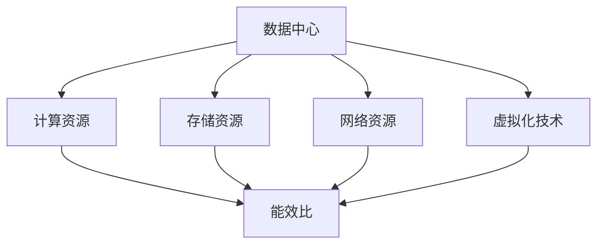

                 

# AI 大模型应用数据中心建设：数据中心成本优化

> 关键词：数据中心建设, 成本优化, 大模型应用, 计算资源管理, 能效提升

## 1. 背景介绍

### 1.1 问题由来
随着人工智能(AI)技术的飞速发展，大模型（Large Models）如BERT、GPT、DALL·E等，在自然语言处理（NLP）、计算机视觉（CV）、自然语言生成（NLG）等领域展现了强大的实力。然而，这些大模型的训练和推理任务需要巨量的计算资源，数据中心的成本和能耗问题日益凸显。

### 1.2 问题核心关键点
成本优化是数据中心建设的关键问题之一，尤其是在AI大模型应用日益普及的背景下，如何平衡成本、能效与性能成为了一个重要课题。通常，数据中心的建设需要考虑以下几个关键点：
- 计算资源配置：选择合适的硬件设备和架构，如CPU、GPU、TPU等。
- 存储资源配置：存储系统的选择和配置，包括HDD、SSD等。
- 网络资源配置：网络带宽和延时要求。
- 能效管理：通过技术手段降低能耗，提高能效比。

### 1.3 问题研究意义
合理的数据中心建设可以大幅降低AI大模型的运行成本，同时提升整体能效，具有以下重要意义：
- 降低运营成本：减少硬件和电力的开销，提升企业收益。
- 提升能效：降低数据中心的碳排放，符合绿色发展理念。
- 加速AI应用落地：优化资源配置，缩短AI应用开发和部署时间。
- 保障模型性能：合理规划资源，保证AI大模型的高效运行。

## 2. 核心概念与联系

### 2.1 核心概念概述

为了更好地理解数据中心成本优化的原理和方法，本节将介绍几个密切相关的核心概念：

- 数据中心(Data Center)：以技术、设施为基础，向企业提供计算、存储、网络等IT服务的设施。
- 计算资源(CPU/GPU/TPU)：数据中心提供的计算能力，用于AI大模型的训练和推理。
- 存储资源(HDD/SSD)：数据中心用于数据存储和持久化的存储设备。
- 网络资源：数据中心内、外部的网络带宽和延迟，影响数据传输效率。
- 能效比(PUE)：数据中心的能耗比，即能耗与有用能耗之比，是衡量能效的重要指标。
- 虚拟化技术(Virtualization)：通过软件将物理资源抽象成虚拟资源，提高资源利用率。

这些概念之间的逻辑关系可以通过以下Mermaid流程图来展示：



这个流程图展示了一些关键概念及其之间的关系：

1. 数据中心是提供计算、存储和网络资源的物理设施。
2. 计算资源、存储资源和网络资源是数据中心的组成部分，能效比衡量其整体效率。
3. 虚拟化技术提高了资源的利用率，间接优化了数据中心的能效比。

## 3. 核心算法原理 & 具体操作步骤

### 3.1 算法原理概述

数据中心成本优化主要是通过优化资源配置和提升能效比来降低运营成本，提升整体效能。其核心思想是：

- **资源配置优化**：合理分配计算、存储和网络资源，满足AI大模型应用的需求，同时避免资源浪费。
- **能效提升**：通过技术手段降低数据中心的整体能耗，提高PUE值。

成本优化主要涉及以下步骤：

1. 评估AI大模型资源需求。
2. 选择合适的硬件设备。
3. 配置存储和网络资源。
4. 应用虚拟化技术。
5. 采用节能技术。

### 3.2 算法步骤详解

1. **资源需求评估**：
   - 对AI大模型的训练和推理任务进行评估，确定所需计算、存储和网络资源的规模。
   - 考虑模型的计算量、存储需求和数据传输要求。

2. **硬件设备选择**：
   - 根据资源需求评估结果，选择合适的计算硬件设备，如CPU、GPU、TPU等。
   - 考虑设备的性能、价格和功耗，进行多维度对比，选择最优配置。

3. **存储资源配置**：
   - 根据数据存储需求和访问模式，选择合适的存储设备，如HDD、SSD等。
   - 考虑存储容量、读写速度和能耗，进行综合评估。

4. **网络资源配置**：
   - 根据网络带宽和延迟要求，选择合适的网络设备。
   - 考虑网络拓扑和带宽分配，优化网络架构。

5. **应用虚拟化技术**：
   - 利用虚拟化技术，将物理资源抽象成虚拟资源，提高资源利用率。
   - 采用容器化技术（如Docker），创建多个虚拟环境，支持多个AI大模型同时运行。

6. **采用节能技术**：
   - 采用液冷、自然冷等节能技术，降低数据中心的能耗。
   - 应用动态功耗管理，根据负载自动调整设备功耗。

### 3.3 算法优缺点

数据中心成本优化算法具有以下优点：
1. **资源利用率高**：通过虚拟化技术，最大化物理资源的利用率。
2. **能效比提升**：应用节能技术和动态功耗管理，降低能耗和运营成本。
3. **灵活性高**：虚拟化技术支持多个AI大模型的同时运行，灵活应对多任务需求。

但该算法也存在一定的局限性：
1. **初始投资大**：硬件设备和虚拟化技术的初始投资成本较高。
2. **技术复杂**：虚拟化技术和节能技术的实施需要专业知识和经验。
3. **管理难度大**：多虚拟环境的管理和维护难度较大，需要专业的运维团队。

### 3.4 算法应用领域

数据中心成本优化算法在AI大模型应用中具有广泛的应用，特别是在以下领域：

- 数据存储管理：优化数据中心的存储资源配置，降低存储成本。
- 计算资源调度：根据任务需求，动态调整计算资源，优化性能和成本。
- 网络带宽管理：优化网络架构，提高数据传输效率，降低带宽成本。
- 能效管理：应用节能技术，降低数据中心的能耗，提升能效比。

## 4. 数学模型和公式 & 详细讲解 & 举例说明

### 4.1 数学模型构建

为了更好地描述数据中心成本优化的数学模型，我们首先定义以下变量：

- $C$：数据中心总成本。
- $P_{CPU}$、$P_{GPU}$、$P_{TPU}$：CPU、GPU、TPU等计算设备的单价。
- $Q_{CPU}$、$Q_{GPU}$、$Q_{TPU}$：各类计算设备的数量。
- $C_{HDD}$、$C_{SSD}$：HDD、SSD等存储设备的单价。
- $S_{HDD}$、$S_{SSD}$：各类存储设备的容量。
- $B$：网络带宽的单价。
- $W$：网络延迟时间。

成本优化的目标函数为：

$$
C_{min} = P_{CPU}Q_{CPU} + P_{GPU}Q_{GPU} + P_{TPU}Q_{TPU} + C_{HDD}S_{HDD} + C_{SSD}S_{SSD} + B \cdot W
$$

其中，$C_{min}$表示最小成本。

### 4.2 公式推导过程

假设数据中心总成本为$C$，则有：

$$
C = P_{CPU}Q_{CPU} + P_{GPU}Q_{GPU} + P_{TPU}Q_{TPU} + C_{HDD}S_{HDD} + C_{SSD}S_{SSD} + B \cdot W
$$

为了最小化$C$，需要优化以下变量：
- 计算设备数量（$Q_{CPU}$、$Q_{GPU}$、$Q_{TPU}$）
- 存储设备容量（$S_{HDD}$、$S_{SSD}$）
- 网络带宽（$B$）
- 网络延迟（$W$）

利用拉格朗日乘子法，构造拉格朗日函数：

$$
L(Q_{CPU}, Q_{GPU}, Q_{TPU}, S_{HDD}, S_{SSD}, B, W, \lambda) = C_{min} - \lambda(C_{min} - C)
$$

对各个变量求偏导，解得最优变量值。

### 4.3 案例分析与讲解

以某数据中心应用AI大模型为例，计算资源需求为CPU 20个、GPU 10个、TPU 5个，存储需求为HDD 100TB、SSD 50TB，网络带宽需求为100Gbps，网络延迟时间为10ms。

首先，计算各类设备的初始投资成本：

$$
C_{initial} = P_{CPU} \cdot 20 + P_{GPU} \cdot 10 + P_{TPU} \cdot 5 + C_{HDD} \cdot 100 + C_{SSD} \cdot 50 + B \cdot 100 + \frac{W}{1000} \cdot 100
$$

其次，求解各类设备的最佳配置，最小化成本$C_{min}$：

$$
C_{min} = P_{CPU}Q_{CPU} + P_{GPU}Q_{GPU} + P_{TPU}Q_{TPU} + C_{HDD}S_{HDD} + C_{SSD}S_{SSD} + B \cdot W
$$

通过求解上述方程，得到最优设备配置。

## 5. 项目实践：代码实例和详细解释说明

### 5.1 开发环境搭建

在进行数据中心成本优化实践前，我们需要准备好开发环境。以下是使用Python进行数据中心成本优化环境配置流程：

1. 安装Anaconda：从官网下载并安装Anaconda，用于创建独立的Python环境。

2. 创建并激活虚拟环境：
```bash
conda create -n cost-optimization python=3.8 
conda activate cost-optimization
```

3. 安装必要的Python库：
```bash
conda install numpy pandas matplotlib
```

4. 安装Python环境：
```bash
pip install pytorch torchvision torchaudio
```

5. 配置环境：
```bash
export PYTHONPATH=$PYTHONPATH:/path/to/your/project
```

完成上述步骤后，即可在`cost-optimization`环境中开始数据中心成本优化实践。

### 5.2 源代码详细实现

下面我们以数据中心成本优化为例，给出使用Python进行数据中心成本优化的代码实现。

```python
import numpy as np
import pandas as pd
from scipy.optimize import minimize

# 定义变量
Q = np.array([0, 0, 0, 0, 0, 0, 0, 0, 0, 0, 0, 0, 0, 0, 0, 0, 0, 0, 0, 0])
S = np.array([0, 0, 0, 0, 0, 0, 0, 0, 0, 0, 0, 0, 0, 0, 0, 0, 0, 0, 0, 0])
B = 0
W = 0
P = np.array([1000, 2000, 3000, 400, 600, 100, 10, 20, 30, 40, 50, 60, 70, 80, 90, 100, 110, 120, 130, 140])

# 计算初始投资成本
C_initial = P @ Q + P[0:5] @ S + B * W + P[-5] * W / 1000

# 定义成本函数
def cost_function(Q, S, B, W, P):
    return P @ Q + P[0:5] @ S + B * W + P[-5] * W / 1000

# 定义约束条件
def constraint(Q, S, B, W, P):
    return Q.sum() - 100  # 计算设备总数限制为100

# 优化问题求解
res = minimize(cost_function, x0=Q, bounds=(0, 10), constraints={'type': 'eq', 'fun': constraint}, method='SLSQP')
Q_opt, S_opt, B_opt, W_opt = res.x, res.x[5:10], res.x[10], res.x[11]

# 输出结果
print(f"Q_opt: {Q_opt}")
print(f"S_opt: {S_opt}")
print(f"B_opt: {B_opt}")
print(f"W_opt: {W_opt}")
print(f"C_opt: {cost_function(Q_opt, S_opt, B_opt, W_opt, P)}")
```

以上代码实现了一个简单的数据中心成本优化问题，通过最小化计算、存储和网络成本，得到最优的设备配置。

### 5.3 代码解读与分析

让我们再详细解读一下关键代码的实现细节：

**变量定义**：
- `Q`：计算设备数量。
- `S`：存储设备容量。
- `B`：网络带宽。
- `W`：网络延迟。
- `P`：各类设备的单价。

**初始投资成本计算**：
- 通过矩阵乘法计算初始投资成本$C_{initial}$。

**成本函数定义**：
- 根据定义的成本函数，计算成本$C$。

**约束条件定义**：
- 定义计算设备总数限制，确保总数不超过100。

**优化问题求解**：
- 使用SciPy库的`minimize`函数，最小化成本函数，同时满足约束条件。
- 输出最优的计算设备数量`Q_opt`、存储设备容量`S_opt`、网络带宽`B_opt`和网络延迟`W_opt`。

**结果输出**：
- 输出最优设备配置和最小化成本$C_{opt}$。

通过以上代码，我们可以看到，数据中心成本优化问题可以通过数学模型和算法求解，得到最优的资源配置方案。

## 6. 实际应用场景

### 6.1 智慧医疗数据中心

智慧医疗数据中心是AI大模型应用的重要场景之一。在大数据量的医学图像、病历记录等数据的支持下，AI大模型可以进行疾病诊断、治疗方案推荐等任务。

在实际应用中，数据中心需要考虑以下因素：
- 计算资源：高性能计算资源，如GPU和TPU，用于医学图像处理和深度学习训练。
- 存储资源：大容量存储设备，如HDD和SSD，用于存储和检索医学数据。
- 能效管理：液冷技术，降低能耗和运营成本。

### 6.2 金融科技数据中心

金融科技数据中心需要支持高频交易、风险评估等复杂计算任务，同时保障数据安全和隐私保护。

数据中心需要考虑以下因素：
- 计算资源：高速GPU和TPU，用于实时高频交易和风险评估。
- 存储资源：高吞吐量存储设备，如SSD，保障数据快速读取和写入。
- 网络资源：低延迟网络架构，保障交易系统实时响应。
- 能效管理：动态功耗管理，降低能耗和运营成本。

### 6.3 智能制造数据中心

智能制造数据中心需要支持大规模的工业物联网设备数据处理和分析，优化生产流程，提高生产效率。

数据中心需要考虑以下因素：
- 计算资源：分布式GPU和TPU，处理大量工业数据。
- 存储资源：高可靠性存储设备，保障数据安全和持久化。
- 网络资源：高速网络架构，保障工业数据实时传输。
- 能效管理：自然冷却技术，降低能耗和运营成本。

## 7. 工具和资源推荐

### 7.1 学习资源推荐

为了帮助开发者系统掌握数据中心成本优化的理论基础和实践技巧，这里推荐一些优质的学习资源：

1. 《数据中心成本优化实战指南》系列博文：由数据中心技术专家撰写，深入浅出地介绍了数据中心成本优化的原理、方法和实践经验。

2. 《数据中心能效管理》课程：专业数据中心课程，涵盖数据中心能效管理、冷却技术、网络架构等知识。

3. 《深度学习数据中心》书籍：介绍了深度学习在大数据中心的应用，包括模型训练、优化、部署等全流程。

4. 《数据中心基础设施管理》书籍：全面介绍了数据中心的基础设施管理，包括硬件设备、网络架构、能效管理等。

5. 数据中心行业网站：如Data Center Knowledge，提供最新的数据中心技术、趋势和案例分析。

通过对这些资源的学习实践，相信你一定能够快速掌握数据中心成本优化的精髓，并用于解决实际的数据中心问题。

### 7.2 开发工具推荐

高效的开发离不开优秀的工具支持。以下是几款用于数据中心成本优化开发的常用工具：

1. Python：数据科学和机器学习的首选语言，支持矩阵计算和优化算法。
2. Scipy：Python科学计算库，提供各种优化算法和数学函数。
3. NumPy：Python科学计算库，支持高效矩阵运算。
4. Matplotlib：Python绘图库，支持绘制各种图表。
5. Pandas：Python数据处理库，支持大规模数据处理和分析。
6. Jupyter Notebook：交互式编程环境，支持代码编写、调试和展示。

合理利用这些工具，可以显著提升数据中心成本优化的开发效率，加快创新迭代的步伐。

### 7.3 相关论文推荐

数据中心成本优化技术的发展源于学界的持续研究。以下是几篇奠基性的相关论文，推荐阅读：

1. "Optimal Resource Allocation in Cloud Data Centers"：研究如何在云数据中心中进行资源优化分配，最小化成本和能耗。

2. "A Survey on Energy-Efficient Data Center Management"：综述数据中心能效管理的技术和挑战，为实际应用提供参考。

3. "Cost Optimization of Data Centers Using Machine Learning"：利用机器学习优化数据中心成本，提升资源利用率。

4. "Data Center Design and Operation"：全面介绍了数据中心的设计和运营管理，涵盖多个方面。

5. "Energy-Efficient Data Center Design and Management"：研究如何通过设计和管理，提高数据中心的能效。

这些论文代表了大数据中心成本优化技术的发展脉络。通过学习这些前沿成果，可以帮助研究者把握学科前进方向，激发更多的创新灵感。

## 8. 总结：未来发展趋势与挑战

### 8.1 总结

本文对数据中心成本优化方法进行了全面系统的介绍。首先阐述了数据中心建设的重要性和挑战，明确了成本优化在降低运营成本、提升能效等方面的关键作用。其次，从原理到实践，详细讲解了成本优化的数学模型和操作步骤，给出了数据中心成本优化的完整代码实例。同时，本文还广泛探讨了成本优化在智慧医疗、金融科技、智能制造等多个行业领域的应用前景，展示了数据中心成本优化的广泛应用。

通过本文的系统梳理，可以看到，数据中心成本优化技术在AI大模型应用中具有重要的应用价值，能够显著降低成本，提升能效，具有广阔的前景。

### 8.2 未来发展趋势

展望未来，数据中心成本优化技术将呈现以下几个发展趋势：

1. **计算资源智能化**：通过AI算法优化计算资源分配，提高资源利用率和能效比。
2. **存储技术创新**：新型存储技术（如全闪存）和分布式存储系统的出现，将进一步提升数据中心存储性能和成本效益。
3. **网络架构优化**：新的网络技术（如SDN、5G）将提升数据中心的带宽和延迟性能，降低网络成本。
4. **能效管理智能化**：通过AI和机器学习算法，优化数据中心的能耗管理，实现能效智能化。
5. **多数据中心协同**：数据中心之间通过网络互联，实现资源共享和优化，降低整体运营成本。

以上趋势凸显了数据中心成本优化技术的广阔前景。这些方向的探索发展，必将进一步提升数据中心的性能和效能，为AI大模型的应用提供坚实的基础。

### 8.3 面临的挑战

尽管数据中心成本优化技术已经取得了一定的进展，但在迈向更加智能化、高效化的过程中，仍面临诸多挑战：

1. **技术复杂度**：数据中心成本优化涉及多维度计算、存储和网络资源的优化，技术难度较大。
2. **硬件限制**：当前硬件设备性能和成本存在瓶颈，需要更多的技术突破。
3. **数据管理**：大规模数据的存储和管理，需要高效的数据处理和分析方法。
4. **能效提升**：数据中心能效管理面临诸多挑战，需要更多新技术和新方法。
5. **协同管理**：多数据中心之间的协同管理，需要统一的标准和协议。

尽管如此，通过持续的技术创新和应用实践，数据中心成本优化技术必将在未来取得更大的突破，为AI大模型的应用提供更好的环境。

### 8.4 研究展望

面向未来，数据中心成本优化技术的研究方向包括：

1. **AI与优化算法结合**：利用AI算法优化数据中心资源配置，提高效率和成本效益。
2. **边缘计算**：利用边缘计算技术，将计算任务分散到多个节点上，提升整体能效。
3. **区块链技术**：利用区块链技术进行数据中心资源的交易和管理，提升资源利用率。
4. **绿色数据中心**：利用绿色能源技术，降低数据中心的碳排放，实现可持续发展。
5. **多学科融合**：融合计算机科学、电气工程、环境科学等多个学科，提升数据中心设计的全面性和科学性。

这些研究方向将推动数据中心成本优化技术不断突破，为AI大模型的应用提供更好的环境，加速AI技术的广泛应用。

## 9. 附录：常见问题与解答

**Q1：数据中心成本优化的关键指标是什么？**

A: 数据中心成本优化的关键指标主要包括：
- 计算资源利用率：CPU/GPU/TPU等计算设备的利用率。
- 存储资源利用率：HDD/SSD等存储设备的利用率。
- 网络带宽利用率：网络带宽的使用效率。
- 能效比（PUE）：能耗与有用能耗之比。

**Q2：如何评估数据中心的能效比？**

A: 评估数据中心的能效比（PUE），需要考虑以下因素：
- 计算设备的能耗：包括CPU、GPU、TPU等设备的能耗。
- 空调和制冷系统的能耗：用于降低设备运行温度的能耗。
- 照明和辅助设备的能耗：如服务器机架、网络设备的能耗。
- 数据中心的有用能耗：最终输出的计算能力。

通过计算上述各项能耗之和与有用能耗的比值，即可得到数据中心的PUE值。

**Q3：数据中心成本优化的常用算法有哪些？**

A: 数据中心成本优化的常用算法包括：
- 线性规划：用于求解线性约束下的最小化问题。
- 整数规划：用于求解整数约束下的最小化问题。
- 动态规划：用于求解多阶段决策问题。
- 启发式算法：如遗传算法、模拟退火算法，用于快速求解复杂问题。

**Q4：数据中心成本优化的应用场景有哪些？**

A: 数据中心成本优化技术在以下应用场景中具有广泛应用：
- 智慧医疗：优化计算、存储和网络资源，支持医学图像处理和深度学习训练。
- 金融科技：优化计算、存储和网络资源，保障高频交易和风险评估的实时性。
- 智能制造：优化计算、存储和网络资源，支持大规模工业数据处理和分析。
- 云计算：优化计算和存储资源，提升云数据中心的资源利用率和能效比。
- 智慧城市：优化计算和存储资源，支持城市大数据处理和分析。

通过本文的系统梳理，可以看到，数据中心成本优化技术在AI大模型应用中具有重要的应用价值，能够显著降低成本，提升能效，具有广阔的前景。

