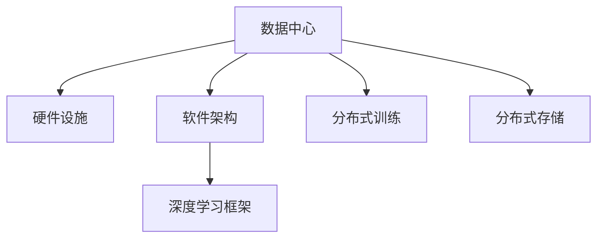

                 

# AI 大模型应用数据中心建设：数据中心技术与应用

## 1. 背景介绍

### 1.1 问题由来
在人工智能(AI)领域，数据中心（Data Center, DC）已成为支持大模型训练和推理的核心基础设施。数据中心不仅负责存储和处理海量数据，还需要提供高性能计算资源，以支持模型训练和推理。随着AI大模型的不断发展，数据中心的建设和管理也变得更加复杂。因此，本文旨在深入探讨AI大模型在数据中心的应用，涵盖数据中心的硬件设施、软件架构、技术栈和未来发展方向。

### 1.2 问题核心关键点
AI大模型应用数据中心建设的核心在于如何构建高效、稳定、可扩展的计算和存储环境，以支持模型的训练和推理。这包括：
1. **硬件设施**：选择合适的硬件设备（如CPU、GPU、TPU等）和网络设备，以满足大模型对计算和带宽的需求。
2. **软件架构**：设计灵活、可扩展的软件框架，以支持大模型的分布式训练和推理。
3. **技术栈**：选择或开发合适的开源软件工具，以实现高效的模型训练和推理。
4. **未来发展**：考虑如何优化数据中心资源利用率，提升系统性能，同时降低运营成本。

### 1.3 问题研究意义
研究AI大模型在数据中心的应用，对于加速AI技术的落地，提升模型的训练和推理效率，具有重要意义：
1. **加速模型开发**：通过高效的数据中心基础设施，大幅缩短模型训练和推理的时间，加快AI模型的迭代速度。
2. **提高系统性能**：优化数据中心资源配置和调度，提升系统的吞吐量和响应速度，满足实时应用的需求。
3. **降低运营成本**：通过资源共享和技术优化，降低数据中心的能耗和维护成本，提高经济性。
4. **推动产业发展**：构建高效的数据中心环境，支持AI技术的广泛应用，推动各行业数字化转型升级。

## 2. 核心概念与联系

### 2.1 核心概念概述

为更好地理解AI大模型在数据中心的应用，本节将介绍几个关键概念：

- **数据中心（Data Center, DC）**：用于存储和处理海量数据的设施，通常由服务器、存储设备、网络设备等组成。
- **大模型（Large Model）**：具有亿计参数的深度学习模型，如BERT、GPT-3等，用于处理大规模自然语言处理任务。
- **分布式训练（Distributed Training）**：将大规模模型的训练任务分布到多个计算节点上，以提高训练效率和扩展性。
- **分布式存储（Distributed Storage）**：通过分布式文件系统和对象存储，存储和管理大模型训练和推理过程中的海量数据。
- **深度学习框架（Deep Learning Framework）**：如TensorFlow、PyTorch等，提供高效的工具和API，支持大模型的训练和推理。

这些核心概念之间的逻辑关系可以通过以下Mermaid流程图来展示：



这个流程图展示了大模型在数据中心的应用核心概念及其之间的关系：

1. 数据中心通过硬件设施和大规模数据存储支持模型的训练和推理。
2. 软件架构设计提供分布式计算和存储能力，支持大模型的扩展。
3. 深度学习框架提供高效的工具和API，支持模型的训练和推理。
4. 分布式训练和存储系统，在大模型训练和推理中发挥关键作用。

## 3. 核心算法原理 & 具体操作步骤
### 3.1 算法原理概述

AI大模型在数据中心的应用，主要依赖于分布式训练和推理技术。其核心思想是：

- **分布式训练**：将大模型的训练任务分布到多个计算节点上，并行计算和数据通信，提高训练效率和扩展性。
- **分布式存储**：通过分布式文件系统和对象存储，存储和管理模型训练和推理过程中的海量数据，支持模型的高效访问和读写。

具体来说，分布式训练和存储系统通常包括以下步骤：

1. **数据分布**：将训练数据和模型参数分布到多个计算节点上，进行并行计算和通信。
2. **参数同步**：使用参数服务器或全复制的方式，确保各节点之间的参数一致性。
3. **梯度聚合**：聚合各节点计算的梯度，进行全局参数更新。
4. **存储优化**：采用高效的分布式存储系统，存储和管理训练数据和模型参数，支持快速访问和读写。

### 3.2 算法步骤详解

#### 3.2.1 数据中心硬件设施

数据中心硬件设施包括CPU、GPU、TPU等计算设备，以及网络交换机、存储设备等网络设备。选择合适的硬件设施，是确保数据中心高性能和可靠性的关键。

1. **计算设备**：选择高性能的CPU、GPU或TPU等计算设备，以满足大模型对计算资源的需求。
2. **网络设备**：配置高性能的网络交换机，支持高速数据传输和网络通信。
3. **存储设备**：选择高效的存储设备，如SSD硬盘、NVMe等，保证数据读取和写入速度。

#### 3.2.2 分布式训练系统

分布式训练系统通过并行计算和数据通信，提高模型的训练效率和扩展性。其核心包括：

1. **计算节点**：将训练任务分布到多个计算节点上，进行并行计算。
2. **参数同步**：使用参数服务器或全复制的方式，确保各节点之间的参数一致性。
3. **梯度聚合**：聚合各节点计算的梯度，进行全局参数更新。

#### 3.2.3 分布式存储系统

分布式存储系统通过分布式文件系统和对象存储，存储和管理大模型训练和推理过程中的海量数据，支持模型的高效访问和读写。其核心包括：

1. **分布式文件系统**：如Hadoop HDFS、Ceph等，提供高效的文件存储和读写服务。
2. **对象存储系统**：如Amazon S3、Google Cloud Storage等，提供高效的数据访问和分布式存储。

### 3.3 算法优缺点

AI大模型在数据中心的应用，具有以下优点：
1. **高效计算**：通过分布式训练和存储，大幅提高模型的训练效率和扩展性。
2. **高可靠性**：通过冗余和容错机制，提高系统的可靠性和可用性。
3. **低成本**：通过资源共享和技术优化，降低数据中心的能耗和维护成本。

同时，也存在以下缺点：
1. **复杂性高**：分布式系统和硬件设施的管理和维护复杂，需要专业团队和技术支持。
2. **能耗高**：大模型训练和推理的高能耗需求，对数据中心的能耗和散热提出较高要求。
3. **扩展性挑战**：随着模型规模和数据量的增加，系统的扩展性面临挑战，需要持续优化和升级。

### 3.4 算法应用领域

AI大模型在数据中心的应用，主要集中在以下几个领域：

- **自然语言处理（NLP）**：如BERT、GPT-3等模型，用于文本分类、情感分析、机器翻译等任务。
- **计算机视觉（CV）**：如ResNet、VGG等模型，用于图像识别、物体检测、人脸识别等任务。
- **推荐系统**：如LightFM、Wide & Deep等模型，用于个性化推荐、广告投放等任务。
- **语音识别与生成**：如Wav2Vec 2.0、GPT-3等模型，用于语音识别、语音合成等任务。
- **时间序列预测**：如LSTM、GRU等模型，用于股票预测、天气预测等任务。

## 4. 数学模型和公式 & 详细讲解 & 举例说明

### 4.1 数学模型构建

AI大模型在数据中心的训练和推理，主要基于深度学习框架提供的高效工具和API。这里以TensorFlow为例，构建AI大模型的数学模型。

TensorFlow提供了一个高效的计算图环境，支持分布式计算和自动微分。假设我们有一个大模型 $M(x)$，输入为 $x$，输出为 $y$。则模型的计算过程如下：

$$
y = M(x)
$$

其中，$M(x)$ 可以表示为多个子模块的组合，如卷积层、全连接层等。例如，一个典型的卷积神经网络（CNN）可以表示为：

$$
y = M(x) = \mathrm{Conv}(\mathrm{BatchNorm}(\mathrm{ReLU}(\mathrm{Conv}(\mathrm{BatchNorm}(x)))) + \mathrm{MaxPool}(y)
$$

### 4.2 公式推导过程

对于大模型的分布式训练，TensorFlow提供了相应的API和优化器，支持多节点并行计算。假设训练数据集为 $D = \{(x_i, y_i)\}_{i=1}^N$，训练任务分布到 $k$ 个计算节点上，每个节点上的训练过程如下：

1. **前向传播**：将输入 $x_i$ 传递给模型 $M(x)$，计算输出 $y_i$。
2. **计算损失**：计算模型输出 $y_i$ 和真实标签 $y_i$ 之间的损失函数 $L(y_i, y_i')$。
3. **反向传播**：根据损失函数 $L$，计算模型参数的梯度 $\nabla_\theta L$。
4. **参数更新**：使用优化器（如SGD、Adam等）更新模型参数 $\theta$。

具体来说，假设优化器的参数更新公式为：

$$
\theta \leftarrow \theta - \eta \nabla_\theta L
$$

其中，$\eta$ 为学习率，$\nabla_\theta L$ 为损失函数对模型参数的梯度。

### 4.3 案例分析与讲解

以BERT模型为例，分析其在数据中心的应用。BERT模型是一个典型的预训练大模型，通过在大规模无标签文本上预训练，学习通用的语言表示。具体步骤如下：

1. **数据预处理**：将训练数据集 $D$ 划分为训练集 $D_{train}$、验证集 $D_{valid}$ 和测试集 $D_{test}$。
2. **模型初始化**：使用预训练模型作为初始化参数。
3. **分布式训练**：将模型参数分布到多个计算节点上，进行并行计算和通信。
4. **参数同步**：使用参数服务器或全复制的方式，确保各节点之间的参数一致性。
5. **梯度聚合**：聚合各节点计算的梯度，进行全局参数更新。
6. **测试和评估**：在测试集上评估模型的性能，调整超参数和训练策略。

## 5. 项目实践：代码实例和详细解释说明

### 5.1 开发环境搭建

在进行AI大模型在数据中心的应用实践前，我们需要准备好开发环境。以下是使用Python进行TensorFlow开发的环境配置流程：

1. 安装Anaconda：从官网下载并安装Anaconda，用于创建独立的Python环境。

2. 创建并激活虚拟环境：
```bash
conda create -n tf-env python=3.8 
conda activate tf-env
```

3. 安装TensorFlow：根据CUDA版本，从官网获取对应的安装命令。例如：
```bash
pip install tensorflow tensorflow-addons
```

4. 安装各类工具包：
```bash
pip install numpy pandas scikit-learn matplotlib tqdm jupyter notebook ipython
```

完成上述步骤后，即可在`tf-env`环境中开始AI大模型在数据中心的应用实践。

### 5.2 源代码详细实现

下面我们以BERT模型为例，给出使用TensorFlow对BERT模型进行分布式训练的PyTorch代码实现。

首先，定义BERT模型的计算图：

```python
import tensorflow as tf

# 定义BERT模型的计算图
model = tf.keras.Sequential([
    tf.keras.layers.LayerNormalization(),
    tf.keras.layers.Dropout(0.1),
    tf.keras.layers.Bidirectional(tf.keras.layers.LSTM(256)),
    tf.keras.layers.Bidirectional(tf.keras.layers.LSTM(256)),
    tf.keras.layers.Bidirectional(tf.keras.layers.LSTM(256)),
    tf.keras.layers.Bidirectional(tf.keras.layers.LSTM(256)),
    tf.keras.layers.Dense(2, activation='softmax')
])
```

然后，定义分布式训练过程中的数据输入和参数更新：

```python
# 定义分布式计算环境
with tf.distribute.Strategy(tf.distribute.MirroredStrategy()) as strategy:
    # 定义计算图
    with strategy.scope():
        model.compile(optimizer=tf.keras.optimizers.Adam(learning_rate=0.001),
                      loss=tf.keras.losses.CategoricalCrossentropy(from_logits=True),
                      metrics=[tf.keras.metrics.CategoricalAccuracy()])
    
    # 定义数据输入
    dataset = tf.data.Dataset.from_tensor_slices((x_train, y_train))
    dataset = dataset.shuffle(buffer_size=10000).batch(batch_size=32).repeat()
    
    # 定义训练循环
    model.fit(dataset, epochs=10)
```

最后，运行训练流程并在测试集上评估：

```python
# 在测试集上评估模型性能
test_dataset = tf.data.Dataset.from_tensor_slices((x_test, y_test))
test_dataset = test_dataset.shuffle(buffer_size=10000).batch(batch_size=32).repeat()
model.evaluate(test_dataset)
```

以上就是使用TensorFlow对BERT模型进行分布式训练的完整代码实现。可以看到，TensorFlow提供了丰富的API和优化器，支持大模型的高效分布式训练和评估。

### 5.3 代码解读与分析

让我们再详细解读一下关键代码的实现细节：

**模型定义**：
- 使用 `tf.keras.Sequential` 构建计算图，包括多个LSTM层和全连接层。
- 使用 `LayerNormalization` 和 `Dropout` 层进行正则化和噪声注入。

**分布式训练**：
- 使用 `tf.distribute.Strategy` 定义分布式计算策略，这里我们选择了 `tf.distribute.MirroredStrategy`，表示将计算图分布到多个计算节点上，进行并行计算和通信。
- 在策略作用域内，编译模型，定义损失函数和评估指标。
- 定义数据集，并进行批处理和重复。
- 在训练循环中，使用 `model.fit` 方法进行模型训练，指定训练集、批次大小、迭代次数等参数。

**测试评估**：
- 定义测试集，并进行批处理和重复。
- 使用 `model.evaluate` 方法在测试集上评估模型性能，返回损失和评估指标。

可以看到，TensorFlow提供了丰富的API和优化器，支持大模型的高效分布式训练和评估。开发者可以将更多精力放在数据处理、模型改进等高层逻辑上，而不必过多关注底层的实现细节。

## 6. 实际应用场景

### 6.1 智能客服系统

基于AI大模型的分布式训练和推理技术，可以应用于智能客服系统的构建。传统客服往往需要配备大量人力，高峰期响应缓慢，且一致性和专业性难以保证。而使用分布式训练和推理技术，可以构建7x24小时不间断服务，快速响应客户咨询，用自然流畅的语言解答各类常见问题。

在技术实现上，可以收集企业内部的历史客服对话记录，将问题和最佳答复构建成监督数据，在此基础上对预训练模型进行分布式训练和推理。分布式模型能够自动理解用户意图，匹配最合适的答案模板进行回复。对于客户提出的新问题，还可以接入检索系统实时搜索相关内容，动态组织生成回答。如此构建的智能客服系统，能大幅提升客户咨询体验和问题解决效率。

### 6.2 金融舆情监测

金融机构需要实时监测市场舆论动向，以便及时应对负面信息传播，规避金融风险。传统的人工监测方式成本高、效率低，难以应对网络时代海量信息爆发的挑战。基于AI大模型的分布式训练和推理技术，为金融舆情监测提供了新的解决方案。

具体而言，可以收集金融领域相关的新闻、报道、评论等文本数据，并对其进行主题标注和情感标注。在此基础上对预训练语言模型进行分布式训练和推理，使其能够自动判断文本属于何种主题，情感倾向是正面、中性还是负面。将分布式模型应用到实时抓取的网络文本数据，就能够自动监测不同主题下的情感变化趋势，一旦发现负面信息激增等异常情况，系统便会自动预警，帮助金融机构快速应对潜在风险。

### 6.3 个性化推荐系统

当前的推荐系统往往只依赖用户的历史行为数据进行物品推荐，无法深入理解用户的真实兴趣偏好。基于AI大模型的分布式训练和推理技术，可以更好地挖掘用户行为背后的语义信息，从而提供更精准、多样的推荐内容。

在实践中，可以收集用户浏览、点击、评论、分享等行为数据，提取和用户交互的物品标题、描述、标签等文本内容。将文本内容作为模型输入，用户的后续行为（如是否点击、购买等）作为监督信号，在此基础上分布式训练预训练语言模型。分布式模型能够从文本内容中准确把握用户的兴趣点。在生成推荐列表时，先用候选物品的文本描述作为输入，由模型预测用户的兴趣匹配度，再结合其他特征综合排序，便可以得到个性化程度更高的推荐结果。

### 6.4 未来应用展望

随着AI大模型的不断发展，基于分布式训练和推理技术的AI系统将在更多领域得到应用，为传统行业带来变革性影响。

在智慧医疗领域，基于分布式训练和推理技术的医疗问答、病历分析、药物研发等应用将提升医疗服务的智能化水平，辅助医生诊疗，加速新药开发进程。

在智能教育领域，分布式训练和推理技术可应用于作业批改、学情分析、知识推荐等方面，因材施教，促进教育公平，提高教学质量。

在智慧城市治理中，分布式训练和推理技术可应用于城市事件监测、舆情分析、应急指挥等环节，提高城市管理的自动化和智能化水平，构建更安全、高效的未来城市。

此外，在企业生产、社会治理、文娱传媒等众多领域，基于分布式训练和推理技术的AI应用也将不断涌现，为经济社会发展注入新的动力。相信随着预训练语言模型和分布式训练技术的持续演进，分布式训练和推理技术必将在构建人机协同的智能时代中扮演越来越重要的角色。

## 7. 工具和资源推荐

### 7.1 学习资源推荐

为了帮助开发者系统掌握AI大模型在数据中心的应用理论基础和实践技巧，这里推荐一些优质的学习资源：

1. 《深度学习》系列博文：由AI专家撰写，深入浅出地介绍了深度学习的基本概念和经典模型。

2. 《TensorFlow官方文档》：TensorFlow官方提供的详细文档，包括分布式训练、深度学习框架等技术细节。

3. 《Deep Learning with Python》书籍：深度学习实战指南，提供丰富的实践代码和案例分析。

4. 《PyTorch官方文档》：PyTorch官方提供的详细文档，涵盖深度学习框架、分布式训练等技术细节。

5. 《自然语言处理实战》课程：斯坦福大学开设的NLP课程，涵盖深度学习在NLP中的应用，包括分布式训练。

通过对这些资源的学习实践，相信你一定能够快速掌握AI大模型在数据中心的应用精髓，并用于解决实际的NLP问题。

### 7.2 开发工具推荐

高效的开发离不开优秀的工具支持。以下是几款用于AI大模型在数据中心应用开发的常用工具：

1. TensorFlow：基于Python的开源深度学习框架，提供分布式训练、自动微分等功能，支持大规模模型训练和推理。

2. PyTorch：基于Python的开源深度学习框架，提供灵活的计算图、高效的自动微分等功能，支持分布式训练和推理。

3. Amazon SageMaker：提供集成的数据中心服务，包括分布式训练、自动调优等功能，适合工业级应用。

4. Google Cloud AI Platform：提供集成的数据中心服务，包括分布式训练、模型部署等功能，适合大规模模型应用。

5. Microsoft Azure Machine Learning：提供集成的数据中心服务，包括分布式训练、自动调优等功能，适合企业级应用。

合理利用这些工具，可以显著提升AI大模型在数据中心的应用开发效率，加快创新迭代的步伐。

### 7.3 相关论文推荐

AI大模型在数据中心的应用源于学界的持续研究。以下是几篇奠基性的相关论文，推荐阅读：

1. "Large-Scale Distributed Deep Learning Training"：论文介绍了分布式训练的基本原理和技术，包括参数服务器、模型并行等方法。

2. "Training Deep Architectures with Synchronous Updates"：论文介绍了分布式训练的算法和实现细节，包括梯度聚合、参数同步等方法。

3. "DistBERT: A Distributed Implementation of BERT"：论文介绍了BERT模型的分布式训练方法，包括数据并行、模型并行等技术。

4. "TensorFlow for Deep Learning"：TensorFlow官方提供的深度学习实战指南，详细介绍了TensorFlow的基本概念和实现技术。

5. "Distributed Training with TensorFlow"：TensorFlow官方提供的分布式训练指南，涵盖分布式计算、参数同步等技术细节。

这些论文代表了大模型在数据中心的应用发展脉络。通过学习这些前沿成果，可以帮助研究者把握学科前进方向，激发更多的创新灵感。

## 8. 总结：未来发展趋势与挑战

### 8.1 研究成果总结

本文对AI大模型在数据中心的应用进行了全面系统的介绍。首先阐述了AI大模型和数据中心建设的研究背景和意义，明确了分布式训练和推理技术在支持大模型应用中的重要价值。其次，从原理到实践，详细讲解了分布式训练和推理的数学原理和关键步骤，给出了分布式训练的代码实现。同时，本文还广泛探讨了分布式训练和推理技术在智能客服、金融舆情、个性化推荐等多个行业领域的应用前景，展示了分布式训练和推理技术的巨大潜力。此外，本文精选了分布式训练和推理技术的各类学习资源，力求为读者提供全方位的技术指引。

通过本文的系统梳理，可以看到，基于分布式训练和推理技术的AI系统正在成为AI技术的核心基础设施，极大地提升了模型的训练和推理效率，加速了AI技术的落地应用。未来，伴随预训练语言模型和分布式训练技术的持续演进，分布式训练和推理技术必将在构建人机协同的智能时代中扮演越来越重要的角色。

### 8.2 未来发展趋势

展望未来，分布式训练和推理技术将呈现以下几个发展趋势：

1. **更大规模模型**：随着算力成本的下降和数据规模的扩张，预训练语言模型的参数量还将持续增长。超大模型的分布式训练和推理，将进一步提升模型的训练效率和扩展性。

2. **更多分布式架构**：除了传统的参数服务器和全复制架构，未来将涌现更多高效的分布式架构，如Ring-based、Mesh-based等，进一步提升系统性能。

3. **更高效的数据传输**：通过网络优化和硬件改进，降低数据传输的延迟和带宽消耗，提升系统的吞吐量。

4. **更灵活的资源调度**：通过智能资源调度算法，动态调整计算资源，优化资源利用率，降低能耗和维护成本。

5. **更智能的训练策略**：引入更多的优化策略，如模型剪枝、量化加速等，提升训练效率和模型压缩率。

6. **更全面的系统监控**：实时采集系统指标，设置异常告警阈值，确保系统稳定性和可靠性。

以上趋势凸显了分布式训练和推理技术的广阔前景。这些方向的探索发展，必将进一步提升AI大模型的训练和推理效率，推动AI技术的广泛应用。

### 8.3 面临的挑战

尽管分布式训练和推理技术已经取得了瞩目成就，但在迈向更加智能化、普适化应用的过程中，仍面临诸多挑战：

1. **能耗高**：大模型训练和推理的高能耗需求，对数据中心的能耗和散热提出较高要求。如何降低能耗，提高能源利用率，是未来需要解决的重要问题。

2. **管理复杂**：分布式系统的管理和维护复杂，需要专业团队和技术支持。如何简化管理流程，提升运维效率，是未来需要优化的方向。

3. **扩展性挑战**：随着模型规模和数据量的增加，系统的扩展性面临挑战，需要持续优化和升级。如何设计高效的扩展机制，满足大规模应用的需求，是未来需要突破的方向。

4. **数据隐私**：分布式训练和推理过程中，涉及大量的数据传输和存储，数据隐私和安全成为重要问题。如何保障数据隐私和安全，防止数据泄露和滥用，是未来需要关注的重点。

5. **系统稳定性**：分布式训练和推理系统在面对网络波动、设备故障等情况时，需要具备较强的鲁棒性和容错能力。如何设计稳定、可靠的分布式系统，是未来需要优化的方向。

### 8.4 研究展望

面对分布式训练和推理技术面临的种种挑战，未来的研究需要在以下几个方面寻求新的突破：

1. **更高效的数据传输和存储**：引入新的数据传输和存储技术，如AllReduce、Ring-based架构等，降低延迟和带宽消耗，提升系统的吞吐量和可靠性。

2. **更智能的资源调度**：设计智能资源调度算法，动态调整计算资源，优化资源利用率，降低能耗和维护成本。

3. **更全面的系统监控**：实时采集系统指标，设置异常告警阈值，确保系统稳定性和可靠性。

4. **更高效的正则化和优化策略**：引入更多的正则化和优化策略，如模型剪枝、量化加速等，提升训练效率和模型压缩率。

5. **更安全的分布式训练**：引入加密技术、联邦学习等方法，保障数据隐私和安全，防止数据泄露和滥用。

这些研究方向将引领分布式训练和推理技术迈向更高的台阶，为构建安全、可靠、可扩展的AI系统铺平道路。面向未来，分布式训练和推理技术还需要与其他人工智能技术进行更深入的融合，如知识表示、因果推理、强化学习等，多路径协同发力，共同推动自然语言理解和智能交互系统的进步。只有勇于创新、敢于突破，才能不断拓展语言模型的边界，让智能技术更好地造福人类社会。

## 9. 附录：常见问题与解答

**Q1：分布式训练和推理的硬件设施如何选择？**

A: 选择分布式训练和推理的硬件设施，需要考虑以下几个方面：

1. **计算能力**：选择高性能的CPU、GPU或TPU等计算设备，以满足大模型对计算资源的需求。
2. **存储能力**：选择高效的存储设备，如SSD硬盘、NVMe等，保证数据读取和写入速度。
3. **网络带宽**：选择高性能的网络交换机，支持高速数据传输和网络通信。
4. **容错能力**：选择具备冗余和容错机制的设备，确保系统的高可靠性和可用性。

**Q2：分布式训练和推理的算法有哪些？**

A: 分布式训练和推理的算法主要包括以下几种：

1. **参数服务器架构（PS, Parameter Server）**：将计算图分割成多个子图，部分子图在参数服务器上进行计算，其余部分在计算节点上计算。
2. **全复制架构（All-Reduce）**：将计算图分割成多个子图，各节点计算本地部分，并将结果汇总到参数服务器上进行全局更新。
3. **Ring-based架构**：将计算图分割成多个环状子图，各节点计算本地部分，并将结果传递给相邻节点。
4. **Mesh-based架构**：将计算图分割成多个子图，各节点计算本地部分，并将结果传递给与之相邻的节点。

**Q3：分布式训练和推理的优化策略有哪些？**

A: 分布式训练和推理的优化策略主要包括以下几种：

1. **数据并行（Data Parallelism）**：将数据分割成多个子集，并行计算。
2. **模型并行（Model Parallelism）**：将模型分割成多个子模型，并行计算。
3. **混合并行（Hybrid Parallelism）**：同时使用数据并行和模型并行，提升系统的吞吐量和扩展性。
4. **优化器优化**：选择高效的优化器，如Adam、SGD等，提升训练效率和收敛速度。
5. **正则化和正则化**：使用L2正则、Dropout等正则化技术，防止过拟合。

这些优化策略可以灵活组合，提升分布式训练和推理的效率和效果。

**Q4：分布式训练和推理的资源调度有哪些方法？**

A: 分布式训练和推理的资源调度方法主要包括以下几种：

1. **静态资源调度**：在训练前静态分配计算资源，适用于模型规模固定的情况。
2. **动态资源调度**：根据训练过程中的性能指标动态调整计算资源，提升资源利用率。
3. **自适应资源调度**：根据任务的复杂度和计算资源的使用情况，动态调整资源分配策略，优化资源利用率。

合理选择和优化资源调度方法，可以有效提升分布式训练和推理的效率和效果。

---

作者：禅与计算机程序设计艺术 / Zen and the Art of Computer Programming

