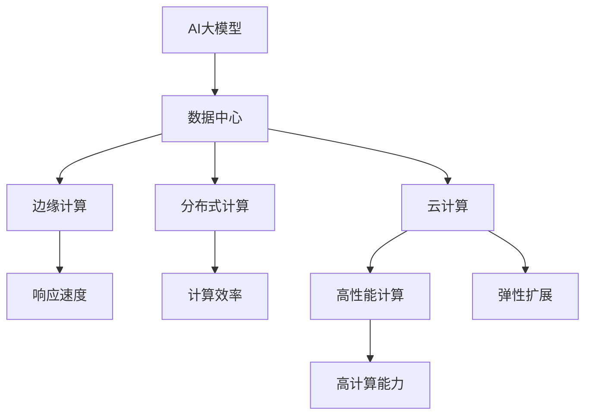

                 

# AI 大模型应用数据中心建设：数据中心技术与应用

> 关键词：人工智能,大模型,数据中心,边缘计算,分布式计算,云计算

## 1. 背景介绍

### 1.1 问题由来
随着人工智能技术的迅猛发展，大模型（Large Models）逐渐成为推动AI应用的重要力量。这些大模型，如BERT、GPT-3、T5等，通常具有数十亿个参数，能够处理复杂的多模态数据，具备强大的计算和推理能力。然而，大模型的训练和部署需要极其强大的计算资源和数据中心支持。传统的数据中心在处理大规模数据和复杂任务时，面临着计算效率、扩展性、资源管理等多方面的挑战。

### 1.2 问题核心关键点
如何高效、安全地构建和部署大模型，是当前AI领域的一大研究热点。为了解决这个问题，需要构建高度集成的AI数据中心（AI Data Center, ADC），通过先进的计算架构、数据管理、网络技术和安全机制，为大模型提供高性能、可扩展、安全可靠的应用环境。本文将重点讨论AI大模型的数据中心技术与应用，包括硬件基础设施、软件架构、云服务等方面，以期为AI应用落地提供技术参考。

## 2. 核心概念与联系

### 2.1 核心概念概述

为了更好地理解AI大模型数据中心建设，本节将介绍几个密切相关的核心概念：

- **AI大模型（Large AI Models）**：指具有亿级参数量级的人工智能模型，如BERT、GPT-3、T5等，具备强大的自然语言处理、计算机视觉、语音识别等能力。
- **数据中心（Data Center, DC）**：由多个计算节点和存储节点构成的，通过高速网络互联的计算资源池。
- **边缘计算（Edge Computing）**：在数据源附近进行数据处理和分析的计算架构，降低延迟，提升响应速度。
- **分布式计算（Distributed Computing）**：将计算任务分布在多个计算节点上并行执行，提高计算效率和扩展性。
- **云计算（Cloud Computing）**：通过互联网提供按需扩展的计算资源和服务的计算模型，具有弹性、可扩展性等特点。
- **高性能计算（High-Performance Computing, HPC）**：使用并行计算技术，以获得高性能计算能力的计算模型。

这些核心概念之间的逻辑关系可以通过以下Mermaid流程图来展示：



这个流程图展示了大模型与数据中心各组件之间的联系：

1. AI大模型通过数据中心获取计算资源。
2. 数据中心通过边缘计算、分布式计算、云计算等方式，提升大模型的处理能力和响应速度。
3. 高性能计算为大模型提供强大的计算能力支持。
4. 这些技术架构共同构成AI大模型的应用环境，以支持大规模数据处理、模型训练和推理任务。

## 3. 核心算法原理 & 具体操作步骤
### 3.1 算法原理概述

AI大模型的数据中心建设，本质上是构建一个能够高效、安全地支持AI大模型训练和推理的计算环境。这个环境的核心在于如何构建一个高度集成的计算架构，以及如何有效地管理和优化计算资源，以适应不断变化的需求。

大模型的训练通常需要大量的数据和计算资源，包括GPU、TPU等高性能计算设备，以及大规模存储系统。而推理任务也需要考虑模型的加载时间、响应速度等因素。因此，数据中心需要提供高可扩展性、高性能、安全可靠的应用环境，以便支持大规模的AI应用。

### 3.2 算法步骤详解

AI大模型数据中心的建设步骤一般包括以下几个关键步骤：

**Step 1: 硬件选型与配置**

- 选择合适的硬件设备，如GPU、TPU等，根据模型需求进行配置。
- 构建多节点集群，通过高速网络互联，提供高并发的计算能力。

**Step 2: 软件架构设计与实现**

- 设计数据流架构，确保数据在大模型训练和推理过程中高效流动。
- 实现分布式训练框架，支持大规模数据并行处理。
- 部署模型优化工具，提高模型训练和推理的效率。

**Step 3: 数据管理与存储**

- 构建高效的数据管理平台，支持数据的分布式存储和访问。
- 设计数据冗余与备份策略，确保数据安全。

**Step 4: 网络与通信**

- 设计高速网络架构，支持大模型训练和推理的实时通信。
- 实现数据传输优化技术，如数据压缩、缓存等，提升数据传输效率。

**Step 5: 安全与合规**

- 设计安全机制，确保数据中心和模型训练的安全性。
- 遵循法律法规，确保AI大模型应用符合隐私保护和伦理要求。

**Step 6: 监控与运维**

- 设计监控系统，实时监测大模型训练和推理过程中的各项指标。
- 实现自动化的运维系统，确保系统稳定运行。

通过上述步骤，可以构建一个高效、安全、可扩展的AI大模型应用环境，支持大规模AI应用的需求。

### 3.3 算法优缺点

AI大模型数据中心建设的优势包括：

- **高性能**：通过分布式计算和边缘计算，可以提供强大的计算能力，支持大规模模型的训练和推理。
- **高扩展性**：通过云计算和分布式架构，可以按需扩展计算资源，支持模型的动态扩展。
- **安全性**：通过多层次的安全机制和合规策略，可以确保数据和模型的安全。
- **灵活性**：通过模块化的设计和工具，可以灵活部署和维护AI大模型应用。

但该方法也存在一些局限性：

- **资源消耗大**：大模型需要大量的计算和存储资源，对硬件配置要求高。
- **运维复杂**：大规模分布式系统的运维复杂，需要专业的运维团队和技术支持。
- **成本高**：建设和运维成本较高，需要大量的资金投入。
- **数据隐私问题**：在数据处理和存储过程中，需要严格保护用户隐私和数据安全。

尽管存在这些局限性，AI大模型数据中心仍是目前AI应用落地的主流范式，通过不断的技术创新和优化，可以逐步降低其成本和复杂度，更好地支持AI大模型的应用需求。

### 3.4 算法应用领域

AI大模型数据中心建设技术在多个领域得到了广泛应用，包括但不限于：

- **自然语言处理（NLP）**：如BERT、GPT-3等大模型，通过数据中心的高性能计算，可以进行大规模语言模型训练和推理，应用于问答系统、文本生成、情感分析等任务。
- **计算机视觉（CV）**：如ResNet、Inception等大模型，通过数据中心的高性能计算，可以进行大规模图像识别和处理，应用于人脸识别、图像分类、物体检测等任务。
- **语音识别（ASR）**：如DeepSpeech、Wav2Vec等大模型，通过数据中心的高性能计算，可以进行大规模语音识别和处理，应用于智能语音助手、语音翻译等任务。
- **推荐系统**：如Wide & Deep模型，通过数据中心的高性能计算，可以进行大规模推荐数据的处理和分析，应用于电商推荐、内容推荐等任务。
- **智能客服**：通过数据中心的高性能计算，可以构建智能客服系统，实时响应用户查询，提高客户服务质量。
- **金融风控**：通过数据中心的高性能计算，可以进行大规模金融数据的分析和处理，应用于信用评分、欺诈检测等任务。

## 4. 数学模型和公式 & 详细讲解  
### 4.1 数学模型构建

本节将使用数学语言对AI大模型数据中心建设过程进行更加严格的刻画。

设大模型为 $M$，其输入为 $x$，输出为 $y$。数据中心由多个计算节点构成，节点数量为 $n$。每个节点的计算能力为 $C_i$，存储能力为 $S_i$。假设训练任务为 $T$，数据集大小为 $D$。

定义数据中心的总计算能力为 $C$，总存储能力为 $S$。则总计算能力和总存储能力的表达式为：

$$
C = \sum_{i=1}^n C_i, \quad S = \sum_{i=1}^n S_i
$$

定义数据流架构中数据传输的带宽为 $B$。假设每个节点的带宽为 $B_i$，则总带宽表达式为：

$$
B = \sum_{i=1}^n B_i
$$

定义数据中心的通信延迟为 $\tau$，每个节点的通信延迟为 $\tau_i$。则总通信延迟表达式为：

$$
\tau = \sum_{i=1}^n \tau_i
$$

### 4.2 公式推导过程

以下我们以自然语言处理（NLP）任务为例，推导数据中心的负载和效率评估公式。

假设大模型 $M$ 在输入 $x$ 上的训练时间为 $T_x$，推理时间为 $T_y$。每个节点的计算能力和存储能力分别为 $C_i$ 和 $S_i$，节点数量为 $n$。假设数据传输带宽为 $B$，通信延迟为 $\tau$，每个节点的数据传输带宽和通信延迟分别为 $B_i$ 和 $\tau_i$。

定义数据中心处理NLP任务的总负载 $L$ 和总效率 $E$：

$$
L = T_x + T_y
$$

$$
E = \frac{C}{L}
$$

将上述表达式代入计算能力 $C$ 和存储能力 $S$ 的表达式，得到：

$$
E = \frac{\sum_{i=1}^n C_i}{T_x + T_y}
$$

简化表达式，得到：

$$
E = \frac{\sum_{i=1}^n \frac{C_i}{T_x + T_y}}{n}
$$

上式表明，数据中心的总效率取决于单个节点的计算能力和训练推理时间之比，以及节点的数量。

### 4.3 案例分析与讲解

以Google TPU集群为例，分析其对大模型训练和推理效率的影响。

Google TPU集群由多个TPU核心组成，每个TPU核心具备强大的计算能力。假设每个TPU核心的计算能力为 $C_{TPU}$，训练和推理时间分别为 $T_{TPU}$。假设TPU集群由 $n_{TPU}$ 个TPU核心组成。

根据上述推导公式，TPU集群的效率 $E_{TPU}$ 为：

$$
E_{TPU} = \frac{\sum_{i=1}^{n_{TPU}} \frac{C_{TPU}}{T_{TPU}}}{n_{TPU}}
$$

假设 $C_{TPU} = 10^{14}$ FLOPS（每秒十万亿次浮点运算），$T_{TPU} = 0.1$ 秒，$n_{TPU} = 1000$，则：

$$
E_{TPU} = \frac{\sum_{i=1}^{1000} \frac{10^{14}}{0.1}}{1000} = 1000000 \text{ FLOPS/s}
$$

可以看出，Google TPU集群通过大规模的并行计算，大大提升了NLP任务的处理效率。

## 5. 项目实践：代码实例和详细解释说明
### 5.1 开发环境搭建

在进行AI大模型数据中心建设实践前，我们需要准备好开发环境。以下是使用Python进行Kubernetes集群开发的环境配置流程：

1. 安装Kubernetes和Minikube：从官网下载并安装Kubernetes和Minikube。
2. 创建并激活虚拟环境：
```bash
conda create -n pytorch-env python=3.8 
conda activate pytorch-env
```

3. 安装TensorFlow和Keras：
```bash
pip install tensorflow keras
```

4. 安装Kubeflow Pipelines：
```bash
pip install kubeflow-pipelines
```

5. 安装Kubernetes工具：
```bash
pip install kubernetes
```

完成上述步骤后，即可在`pytorch-env`环境中开始集群开发。

### 5.2 源代码详细实现

下面我们以基于GPU集群的数据中心为例，给出使用Kubernetes实现的大模型训练和推理代码实现。

首先，定义大模型的输入和输出：

```python
from tensorflow.keras.models import Sequential
from tensorflow.keras.layers import Dense, Dropout, Input
from tensorflow.keras.optimizers import Adam

# 定义模型
model = Sequential()
model.add(Dense(128, activation='relu', input_shape=(100,)))
model.add(Dropout(0.5))
model.add(Dense(10, activation='softmax'))

# 定义优化器
optimizer = Adam(lr=0.001)

# 编译模型
model.compile(loss='categorical_crossentropy', optimizer=optimizer, metrics=['accuracy'])

# 定义输入和输出
x_train = # 训练数据
y_train = # 训练标签
x_test = # 测试数据
y_test = # 测试标签
```

然后，定义Kubernetes集群和Pod配置：

```python
from kubernetes import client, config
config.load_kube_config()

v1 = client.V1Api()

# 定义Pod配置
pod_config = {
    'apiVersion': 'v1',
    'kind': 'Pod',
    'metadata': {
        'name': 'model',
        'labels': {
            'hello': 'world'
        }
    },
    'spec': {
        'containers': [
            {
                'name': 'tensorflow',
                'image': 'tensorflow/tensorflow:2.0',
                'command': ['python', 'train.py'],
                'args': ['--data', '/data/train', '--model', '/data/model']
            }
        ],
        'volumes': [
            {
                'name': 'data-volume',
                'config_map': {
                    'name': 'data-config'
                }
            }
        ],
        'volume_mounts': [
            {
                'name': 'data-volume',
                'mount_path': '/data'
            }
        ]
    }
}

# 创建Pod
v1.create_namespaced_pod(pod_config)
```

接着，定义Kubernetes集群和Pod管理：

```python
# 获取Pod列表
pod_list = v1.list_pod_for_all_namespaces()

# 获取Pod状态
for pod in pod_list.items:
    print(f"Pod status: {pod.metadata.name}, {pod.status.phase}")
```

最后，启动大模型训练流程：

```python
# 定义训练脚本
train_script = """
import tensorflow as tf

# 加载数据
train_data = # 训练数据
train_labels = # 训练标签

# 构建模型
model = # 模型定义

# 训练模型
model.fit(train_data, train_labels, epochs=10, batch_size=32)

# 保存模型
model.save('/data/model')

print("Model trained successfully!")
"""

# 创建Pod配置
train_config = {
    'apiVersion': 'v1',
    'kind': 'Pod',
    'metadata': {
        'name': 'train',
        'labels': {
            'hello': 'world'
        }
    },
    'spec': {
        'containers': [
            {
                'name': 'tensorflow',
                'image': 'tensorflow/tensorflow:2.0',
                'command': ['bash', '-c', train_script]
            }
        ],
        'volumes': [
            {
                'name': 'data-volume',
                'config_map': {
                    'name': 'data-config'
                }
            }
        ],
        'volume_mounts': [
            {
                'name': 'data-volume',
                'mount_path': '/data'
            }
        ]
    }
}

# 创建Pod
v1.create_namespaced_pod(train_config)
```

### 5.3 代码解读与分析

让我们再详细解读一下关键代码的实现细节：

**Pod配置**：
- `metadata`：定义Pod的元数据，如Pod的名称和标签。
- `spec`：定义Pod的计算资源和存储资源需求，以及容器配置。

**Pod管理**：
- `list_pod_for_all_namespaces`：获取所有Pod的列表。
- `pod.status.phase`：获取Pod的状态，如运行中、已停止等。

**训练脚本**：
- 定义训练数据和标签。
- 构建和训练模型。
- 保存模型到指定路径。

以上代码展示了使用Kubernetes实现基于GPU集群的大模型训练和推理的完整流程。可以看到，Kubernetes提供了便捷的集群管理和任务调度功能，可以显著提高AI应用的部署和运维效率。

## 6. 实际应用场景
### 6.1 智能客服系统

智能客服系统是AI大模型数据中心建设的重要应用场景之一。传统的客服系统依赖于人工客服，难以处理大规模的客户咨询。而基于大模型的智能客服系统，能够24小时不间断响应客户咨询，提供快速、精准的智能客服服务。

在技术实现上，可以构建基于TensorFlow的大模型训练和推理环境，利用GPU集群加速模型的训练和推理过程。同时，通过Kubernetes实现Pod的管理和调度，确保系统的稳定性和可扩展性。最终，将训练好的模型部署到生产环境，进行实时响应和数据反馈，持续优化模型的性能。

### 6.2 金融风控系统

金融风控系统需要处理大规模的金融数据，进行风险评估和欺诈检测。基于大模型的金融风控系统，能够通过大规模数据的训练，提取高维度的特征，进行复杂的风险分析。

在技术实现上，可以构建基于TensorFlow的大模型训练和推理环境，利用GPU集群加速模型的训练和推理过程。同时，通过Kubernetes实现Pod的管理和调度，确保系统的稳定性和可扩展性。最终，将训练好的模型部署到生产环境，进行实时风险评估和欺诈检测，提升金融风险管理的效率和准确性。

### 6.3 医疗诊断系统

医疗诊断系统需要处理大量的医学图像和病历数据，进行疾病诊断和治疗方案推荐。基于大模型的医疗诊断系统，能够通过大规模数据的训练，提取高维度的特征，进行精准的疾病诊断。

在技术实现上，可以构建基于TensorFlow的大模型训练和推理环境，利用GPU集群加速模型的训练和推理过程。同时，通过Kubernetes实现Pod的管理和调度，确保系统的稳定性和可扩展性。最终，将训练好的模型部署到生产环境，进行实时疾病诊断和治疗方案推荐，提升医疗服务的质量和效率。

## 7. 工具和资源推荐
### 7.1 学习资源推荐

为了帮助开发者系统掌握AI大模型数据中心建设的技术基础和实践技巧，这里推荐一些优质的学习资源：

1. 《TensorFlow官方文档》：提供全面的TensorFlow介绍和使用指南，涵盖模型训练、推理、优化等方面。
2. 《Kubernetes官方文档》：提供全面的Kubernetes介绍和使用指南，涵盖集群部署、资源管理、调度等方面。
3. 《TensorFlow Kubeflow Pipeline官方文档》：提供Kubeflow Pipeline的使用指南，涵盖大规模数据流和机器学习流水线的构建。
4. 《Kubeflow官方文档》：提供全面的Kubeflow介绍和使用指南，涵盖机器学习、数据管理、模型训练等方面。
5. 《Kubernetes实战》：系统介绍Kubernetes的部署、管理、调度等方面，适合实战开发者。

通过对这些资源的学习实践，相信你一定能够快速掌握AI大模型数据中心建设的技术要点，并用于解决实际的AI应用问题。

### 7.2 开发工具推荐

高效的开发离不开优秀的工具支持。以下是几款用于AI大模型数据中心建设的常用工具：

1. TensorFlow：由Google主导开发的深度学习框架，提供高效的计算图和自动微分功能，适合大规模模型训练和推理。
2. Kubernetes：由Google主导开发的容器编排平台，支持大规模集群管理和任务调度。
3. Kubeflow Pipeline：基于Kubernetes的机器学习流水线编排工具，支持大规模数据流和机器学习流水线的构建。
4. TensorBoard：TensorFlow配套的可视化工具，可实时监测模型训练状态，并提供丰富的图表呈现方式。
5. Kubeflow：基于Kubernetes的机器学习平台，提供模型训练、数据管理、模型部署等功能。

合理利用这些工具，可以显著提升AI大模型数据中心建设的开发效率，加快创新迭代的步伐。

### 7.3 相关论文推荐

AI大模型数据中心建设的研究源于学界的持续研究。以下是几篇奠基性的相关论文，推荐阅读：

1. Google Brain的《TensorFlow: A System for Large-Scale Machine Learning》：介绍TensorFlow架构和性能优化技术。
2. Kubernetes团队的《Google Kubernetes: Architecture and Evolution》：介绍Kubernetes的架构和演进过程。
3. Kubeflow团队的《Kubeflow: Composability and Interoperability in Machine Learning》：介绍Kubeflow的组成和应用。
4. IBM的《Scalable Deep Learning with Kubernetes》：介绍Kubernetes在深度学习中的应用和优化。
5. Google的《Scalable Machine Learning in a Distributed Datacenter》：介绍在大数据中心中进行机器学习训练的架构和优化技术。

这些论文代表了大模型数据中心建设的技术发展脉络。通过学习这些前沿成果，可以帮助研究者把握学科前进方向，激发更多的创新灵感。

## 8. 总结：未来发展趋势与挑战

### 8.1 总结

本文对AI大模型数据中心建设进行了全面系统的介绍。首先阐述了AI大模型和数据中心的基本概念，以及两者之间的联系。其次，从原理到实践，详细讲解了AI大模型数据中心的构建过程，包括硬件选型、软件架构、数据管理等方面。同时，本文还广泛探讨了AI大模型数据中心在多个行业领域的应用前景，展示了其广阔的想象空间。

通过本文的系统梳理，可以看到，AI大模型数据中心建设技术正在成为AI应用落地的重要范式，极大地提升了AI应用的计算能力和效率，加速了AI技术在各个领域的落地应用。未来，伴随技术的不断进步，AI大模型数据中心必将成为AI应用的重要基础设施，为人工智能技术的普及和应用提供坚实的技术保障。

### 8.2 未来发展趋势

展望未来，AI大模型数据中心建设技术将呈现以下几个发展趋势：

1. **边缘计算的普及**：随着5G网络的普及和IoT设备的增加，边缘计算将在大模型训练和推理中扮演越来越重要的角色，降低延迟，提升响应速度。
2. **云-边混合架构**：云-边混合架构将结合云端的强大计算能力和边缘设备的低延迟特性，构建高效、安全的大模型应用环境。
3. **分布式计算的扩展**：随着大规模GPU集群和高性能计算资源的发展，分布式计算将在大模型训练和推理中发挥更大的作用，提升计算效率和扩展性。
4. **云服务与AI一体化的融合**：云计算平台将与AI大模型构建深度融合，提供按需扩展、弹性计算、自动化运维等能力，降低大模型应用门槛。
5. **多云生态的构建**：多云生态将构建跨云、跨平台、跨应用的大模型应用环境，提升资源利用率，降低系统复杂度。
6. **数据隐私与安全**：数据隐私与安全将成为大模型应用的重要保障，通过加密、匿名化、联邦学习等技术，确保数据的安全性和隐私保护。

以上趋势凸显了AI大模型数据中心建设的广阔前景。这些方向的探索发展，必将进一步提升AI大模型的计算能力和应用范围，为构建安全、可靠、可扩展的AI应用提供技术保障。

### 8.3 面临的挑战

尽管AI大模型数据中心建设技术已经取得了瞩目成就，但在迈向更加智能化、普适化应用的过程中，它仍面临着诸多挑战：

1. **计算资源瓶颈**：大模型需要大量的计算和存储资源，对硬件配置要求高。如何降低计算资源成本，提高资源利用率，是未来需要重点解决的问题。
2. **运维复杂性**：大规模分布式系统的运维复杂，需要专业的运维团队和技术支持。如何提高系统的稳定性和可靠性，降低运维成本，是未来需要重点解决的问题。
3. **数据隐私与安全**：在大模型训练和推理过程中，需要严格保护用户隐私和数据安全。如何设计安全机制，确保数据的安全性和隐私保护，是未来需要重点解决的问题。
4. **系统扩展性**：随着数据规模的不断增长，系统需要具备良好的扩展性，以适应不断变化的需求。如何设计高效的数据流架构和任务调度机制，是未来需要重点解决的问题。
5. **模型优化**：在大模型训练和推理过程中，需要高效的模型优化技术，以提升模型的训练效率和推理速度。如何设计高效的模型优化算法，是未来需要重点解决的问题。

尽管存在这些挑战，AI大模型数据中心建设仍是目前AI应用落地的主流范式，通过不断的技术创新和优化，可以逐步降低其成本和复杂度，更好地支持AI大模型的应用需求。

### 8.4 研究展望

面对AI大模型数据中心建设所面临的挑战，未来的研究需要在以下几个方面寻求新的突破：

1. **边缘计算与云服务融合**：探索边缘计算与云计算的深度融合，构建高效、安全、灵活的大模型应用环境。
2. **分布式计算与集中计算优化**：探索分布式计算与集中计算的优化，提升大模型训练和推理的效率和可扩展性。
3. **多云生态的构建**：探索多云生态的构建，提升资源利用率和系统稳定性。
4. **数据隐私与安全技术**：探索数据隐私与安全技术，确保数据的安全性和隐私保护。
5. **模型优化与自动化**：探索高效的模型优化技术，提升模型的训练效率和推理速度。
6. **自动化运维系统**：探索自动化的运维系统，提高系统的稳定性和可靠性。

这些研究方向的探索，必将引领AI大模型数据中心建设技术迈向更高的台阶，为构建安全、可靠、可扩展的AI应用提供技术保障。面向未来，AI大模型数据中心建设技术需要与其他AI技术进行更深入的融合，如知识表示、因果推理、强化学习等，多路径协同发力，共同推动AI技术的发展。

## 9. 附录：常见问题与解答

**Q1：如何选择合适的硬件设备？**

A: 选择合适的硬件设备需要考虑大模型的规模和需求，通常可以选择GPU、TPU等高性能计算设备。同时，还需要考虑设备的可用性、扩展性、成本等方面。

**Q2：如何设计高效的数据流架构？**

A: 设计高效的数据流架构需要考虑数据传输的带宽、延迟、通信方式等方面。通常需要设计数据缓存、数据压缩、数据分区等技术，确保数据在大模型训练和推理过程中高效流动。

**Q3：如何设计安全机制？**

A: 设计安全机制需要考虑数据隐私、模型安全等方面。通常需要设计加密、匿名化、访问控制等技术，确保数据和模型的安全。

**Q4：如何设计自动化的运维系统？**

A: 设计自动化的运维系统需要考虑任务调度、监控告警、日志分析等方面。通常需要设计容器编排、任务调度器、监控系统等技术，确保系统的稳定性和可靠性。

以上问题及其解答，展示了AI大模型数据中心建设的实际操作要点，通过合理选择硬件设备、设计高效数据流架构、设计安全机制、设计自动化运维系统，可以构建高效、安全、可扩展的大模型应用环境。

---

作者：禅与计算机程序设计艺术 / Zen and the Art of Computer Programming

