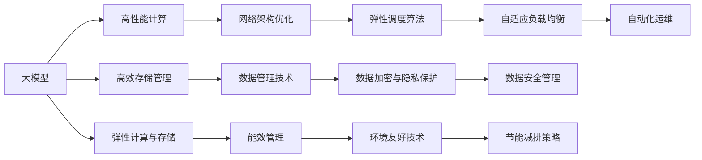

                 

# AI 大模型应用数据中心建设：数据中心技术创新

> 关键词：大模型应用,数据中心建设,技术创新,存储管理,计算资源,网络架构,人工智能,云计算

## 1. 背景介绍

### 1.1 问题由来
随着人工智能(AI)技术的飞速发展，尤其是大模型（Large Models, LMs）的应用越来越广泛，对数据中心的建设提出了更高的要求。数据中心作为大模型计算和存储的基石，其技术架构、硬件配置和运维策略直接影响到大模型应用的效果和成本。因此，如何优化数据中心技术，支持大模型的训练和推理，成为了当前AI领域的重要研究课题。

### 1.2 问题核心关键点
大模型应用对数据中心的主要需求包括：

- **高性能计算资源**：大模型通常具有数亿甚至数十亿参数，需要强大的计算能力进行训练。
- **高效存储管理**：大模型训练所需的数据量巨大，对存储的需求也随之增加。
- **高可靠性与稳定性**：数据中心必须能够保证大模型训练和推理过程的连续性和稳定性。
- **灵活扩展与弹性调度**：数据中心需要支持动态的计算和存储资源分配，满足不同规模任务的计算需求。
- **低能耗与环境友好**：数据中心需要采用绿色能源和高效能的硬件，以降低能耗和环境污染。

这些需求推动了数据中心技术的不断创新，包括计算架构的优化、存储系统的升级、网络协议的改进、能效管理的提升等。以下将对大模型应用数据中心的几个关键技术进行详细探讨。

## 2. 核心概念与联系

### 2.1 核心概念概述

- **大模型**：以Transformer架构为代表的预训练模型，如BERT、GPT等，参数量通常超过十亿，能够学习到丰富的语言知识，适用于各种NLP任务。
- **数据中心**：以支持大规模计算和数据存储为目的，集成各种硬件设施、软件系统和网络架构的复杂系统。
- **高性能计算**：通过专用的硬件设施和优化算法，实现高吞吐量和高并发的计算能力。
- **高效存储管理**：采用分布式存储系统和数据管理技术，优化数据的读写速度和存储成本。
- **弹性计算与存储**：根据任务需求动态调整计算和存储资源，实现资源的最大化利用。
- **绿色计算**：采用高效能的硬件和能源管理系统，降低数据中心的能耗和环境影响。

这些核心概念之间相互联系，共同构成了大模型应用数据中心的完整技术体系。以下将通过一张Mermaid流程图，展示它们之间的联系：



## 3. 核心算法原理 & 具体操作步骤
### 3.1 算法原理概述

大模型应用数据中心的核心算法主要涉及以下几个方面：

- **高性能计算架构**：如GPU集群、TPU集群、FPGA加速等。
- **高效存储管理技术**：如分布式存储系统、存储分层、数据压缩等。
- **弹性计算与存储调度**：如动态资源分配、负载均衡、数据迁移等。
- **网络架构优化**：如高速互联、网络隔离、数据一致性等。
- **能效管理与优化**：如GPU功耗管理、冷却系统、数据中心空调等。

以下将从这五个方面详细介绍核心算法原理。

### 3.2 算法步骤详解

#### 3.2.1 高性能计算架构

高性能计算架构是大模型应用的基础。以下是实现高性能计算架构的几个关键步骤：

1. **选择合适的计算硬件**：如GPU、TPU、FPGA等，根据任务需求选择最优的硬件配置。
2. **优化计算程序**：采用并行计算、异步计算等技术，提高计算效率。
3. **分布式计算框架**：如Spark、TensorFlow等，支持大规模并行计算。
4. **网络优化**：如采用高速互联技术、减少通信开销等。

#### 3.2.2 高效存储管理

高效存储管理是大模型应用的关键。以下是实现高效存储管理的几个关键步骤：

1. **分布式存储系统**：如Hadoop、Ceph等，提供高吞吐量和高可扩展性的数据存储。
2. **数据分层管理**：将数据分层存储，提高读写效率。
3. **数据压缩与解压缩**：采用压缩算法，减少存储需求。
4. **数据备份与恢复**：定期备份数据，确保数据安全和恢复能力。

#### 3.2.3 弹性计算与存储调度

弹性计算与存储调度是大模型应用的重要特性。以下是实现弹性调度的几个关键步骤：

1. **动态资源分配**：根据任务需求动态分配计算和存储资源。
2. **负载均衡**：采用负载均衡算法，优化计算资源分配。
3. **数据迁移与复制**：根据负载情况迁移或复制数据，提高数据访问速度。
4. **缓存机制**：采用缓存技术，减少数据访问延迟。

#### 3.2.4 网络架构优化

网络架构优化是大模型应用的关键支撑。以下是实现网络优化的几个关键步骤：

1. **高速互联技术**：如InfiniBand、NVLink等，提高网络带宽。
2. **网络隔离与分区**：通过虚拟局域网、网络切片等技术，实现网络隔离。
3. **数据一致性**：采用分布式一致性协议，保证数据一致性。
4. **负载均衡**：采用负载均衡算法，优化网络资源分配。

#### 3.2.5 能效管理与优化

能效管理与优化是大模型应用的环保目标。以下是实现能效管理的几个关键步骤：

1. **GPU功耗管理**：采用动态功耗管理算法，降低能耗。
2. **冷却系统**：采用高效的冷却系统，如液冷、自然冷却等。
3. **数据中心空调**：采用绿色能源和节能空调，降低能源消耗。
4. **能效监控与分析**：采用能效监控系统，实时监控能耗情况。

### 3.3 算法优缺点

**高性能计算架构的优点**：

- **高吞吐量**：GPU、TPU等硬件提供了强大的计算能力。
- **高并行度**：并行计算技术提高了计算效率。
- **可扩展性**：分布式计算框架支持大规模计算。

**高性能计算架构的缺点**：

- **能耗高**：GPU、TPU等硬件能耗较大。
- **成本高**：高性能硬件成本较高。
- **复杂性高**：分布式计算系统管理复杂。

**高效存储管理的优点**：

- **高容量**：分布式存储系统提供了高容量数据存储。
- **高可扩展性**：数据分层管理和分布式存储系统可扩展性好。
- **高可靠性**：数据备份和恢复机制提高了数据可靠性。

**高效存储管理的缺点**：

- **成本高**：存储硬件成本较高。
- **复杂度高**：数据分层管理和分布式存储系统管理复杂。

**弹性计算与存储调度的优点**：

- **高灵活性**：动态资源分配和负载均衡提高了灵活性。
- **高利用率**：弹性调度提高了资源利用率。
- **高稳定性**：数据迁移和缓存机制提高了稳定性。

**弹性计算与存储调度的缺点**：

- **管理复杂**：动态资源分配和负载均衡管理复杂。
- **能耗高**：数据迁移和缓存机制增加了能耗。

**网络架构优化的优点**：

- **高带宽**：高速互联技术提高了网络带宽。
- **高可靠性**：网络隔离和一致性协议提高了可靠性。
- **高稳定性**：负载均衡提高了稳定性。

**网络架构优化的缺点**：

- **成本高**：高速互联技术成本较高。
- **复杂度高**：网络隔离和一致性协议管理复杂。

**能效管理与优化的优点**：

- **低能耗**：动态功耗管理和冷却系统降低了能耗。
- **环保友好**：绿色能源和节能空调减少了环境污染。
- **能效监控**：能效监控系统提高了能效管理水平。

**能效管理与优化的缺点**：

- **成本高**：高效能硬件和管理系统成本较高。
- **复杂度高**：能效管理机制管理复杂。

### 3.4 算法应用领域

大模型应用数据中心技术已经在多个领域得到了广泛应用，包括：

- **云计算服务**：如Amazon AWS、Google Cloud、Microsoft Azure等，提供了高性能计算和存储资源。
- **科学研究**：如粒子物理、天文学、基因组学等，需要大规模数据存储和计算。
- **智能制造**：如智能工厂、智能物流等，需要实时数据处理和存储。
- **金融服务**：如交易系统、风险管理等，需要高性能计算和数据存储。
- **医疗健康**：如医疗影像、电子病历等，需要大规模数据存储和计算。

## 4. 数学模型和公式 & 详细讲解 & 举例说明

### 4.1 数学模型构建

大模型应用数据中心的数学模型主要涉及以下几个方面：

- **高性能计算模型**：如GPU计算模型、TPU计算模型等。
- **高效存储管理模型**：如分布式存储模型、数据分层模型等。
- **弹性计算与存储调度模型**：如动态资源分配模型、负载均衡模型等。
- **网络架构优化模型**：如高速互联模型、网络隔离模型等。
- **能效管理与优化模型**：如GPU功耗管理模型、冷却系统模型等。

以下将通过数学模型对这些关键方面进行详细讲解。

### 4.2 公式推导过程

#### 4.2.1 高性能计算模型

高性能计算模型主要考虑以下几个因素：

1. **计算能力**：使用计算密集型算法，提高计算速度。
2. **并行计算**：使用并行计算技术，提高计算效率。
3. **分布式计算**：使用分布式计算框架，支持大规模并行计算。

**GPU计算模型**：

$$
T_{GPU} = T_{seq} \times N_{GPU} \times M_{GPU}
$$

其中，$T_{seq}$为单个任务所需计算时间，$N_{GPU}$为GPU个数，$M_{GPU}$为GPU计算性能（MFLOPS）。

**TPU计算模型**：

$$
T_{TPU} = T_{seq} \times N_{TPU} \times M_{TPU}
$$

其中，$N_{TPU}$为TPU个数，$M_{TPU}$为TPU计算性能（TFLOPS）。

#### 4.2.2 高效存储管理模型

高效存储管理模型主要考虑以下几个因素：

1. **存储容量**：使用分布式存储系统，提高存储容量。
2. **存储分层**：使用数据分层技术，提高读写速度。
3. **数据压缩**：使用数据压缩算法，减少存储需求。

**分布式存储模型**：

$$
S_{total} = S_{local} + S_{remote}
$$

其中，$S_{total}$为总存储容量，$S_{local}$为本地存储容量，$S_{remote}$为远程存储容量。

**数据分层模型**：

$$
S_{tiers} = \sum_{i=1}^n S_i
$$

其中，$S_{tiers}$为分层存储总容量，$S_i$为各层存储容量。

**数据压缩模型**：

$$
S_{compressed} = S_{original} \times (1 - c)
$$

其中，$S_{compressed}$为压缩后存储容量，$S_{original}$为原始存储容量，$c$为压缩率。

#### 4.2.3 弹性计算与存储调度模型

弹性计算与存储调度模型主要考虑以下几个因素：

1. **资源分配**：根据任务需求动态分配计算和存储资源。
2. **负载均衡**：采用负载均衡算法，优化资源分配。
3. **数据迁移**：根据负载情况迁移或复制数据，提高数据访问速度。

**动态资源分配模型**：

$$
R = \sum_{i=1}^n R_i
$$

其中，$R$为总资源需求，$R_i$为各任务资源需求。

**负载均衡模型**：

$$
L = \frac{R}{N}
$$

其中，$L$为平均负载，$N$为节点数。

**数据迁移模型**：

$$
D_{migrated} = D_{total} - D_{local}
$$

其中，$D_{migrated}$为迁移数据量，$D_{total}$为总数据量，$D_{local}$为本地数据量。

#### 4.2.4 网络架构优化模型

网络架构优化模型主要考虑以下几个因素：

1. **网络带宽**：使用高速互联技术，提高网络带宽。
2. **网络隔离**：通过虚拟局域网、网络切片等技术，实现网络隔离。
3. **数据一致性**：采用分布式一致性协议，保证数据一致性。

**高速互联模型**：

$$
B = \frac{W_{max} \times C}{T}
$$

其中，$B$为网络带宽，$W_{max}$为最大带宽，$C$为连接数，$T$为网络延迟。

**网络隔离模型**：

$$
I = \frac{S_{total}}{N}
$$

其中，$I$为平均隔离容量，$S_{total}$为总隔离容量，$N$为隔离单元数。

**数据一致性模型**：

$$
C = \frac{D}{N}
$$

其中，$C$为平均一致性数据量，$D$为总数据量，$N$为节点数。

#### 4.2.5 能效管理与优化模型

能效管理与优化模型主要考虑以下几个因素：

1. **能耗管理**：采用动态功耗管理算法，降低能耗。
2. **冷却系统**：采用高效的冷却系统，如液冷、自然冷却等。
3. **数据中心空调**：采用绿色能源和节能空调，降低能源消耗。

**GPU功耗管理模型**：

$$
P_{GPU} = P_{seq} \times N_{GPU} \times M_{GPU} \times t
$$

其中，$P_{GPU}$为GPU功耗，$P_{seq}$为单个任务序列功耗，$N_{GPU}$为GPU个数，$M_{GPU}$为GPU计算性能，$t$为计算时间。

**冷却系统模型**：

$$
E_{cool} = E_{pump} + E_{radiator} + E_{condenser}
$$

其中，$E_{cool}$为冷却系统能耗，$E_{pump}$为水泵能耗，$E_{radiator}$为散热器能耗，$E_{condenser}$为冷凝器能耗。

**数据中心空调模型**：

$$
P_{AC} = \frac{Q}{\eta}
$$

其中，$P_{AC}$为空调能耗，$Q$为空调制冷量，$\eta$为能效比。

### 4.3 案例分析与讲解

#### 4.3.1 高性能计算案例

某科技公司在大模型训练过程中，使用多GPU集群进行计算。假设训练模型需要10个任务，每个任务需要计算4天，每个GPU的计算性能为10TFLOPS，每个任务需要4个GPU。

计算总计算时间和所需的GPU个数：

$$
T_{GPU} = 4天 \times 10个任务 \times 4个GPU = 160天
$$

$$
N_{GPU} = 4个GPU \times 10个任务 = 40个GPU
$$

计算GPU总性能：

$$
M_{GPU} = 10TFLOPS \times 40个GPU = 400TFLOPS
$$

使用GPU集群计算所需时间：

$$
T_{GPU集群} = \frac{160天}{M_{GPU}} = \frac{160天}{400TFLOPS} = 0.4天
$$

#### 4.3.2 高效存储管理案例

某大数据公司存储了海量数据，数据总量为1PB，其中本地存储容量为500TB，远程存储容量为500TB。使用数据分层管理，本地存储层使用SSD，远程存储层使用HDD。SSD的读写速度为500MB/s，HDD的读写速度为50MB/s，数据压缩率为70%。

计算分层存储总容量和压缩后存储容量：

$$
S_{tiers} = 500TB + 500TB = 1PB
$$

$$
S_{compressed} = 1PB \times (1 - 0.7) = 300TB
$$

计算分层存储总读写速度和压缩后读写速度：

$$
S_{read} = 500TB/s \times 500TB + 50TB/s \times 500TB = 275TB/s
$$

$$
S_{compressed} = 275TB/s \times 0.7 = 192.5TB/s
$$

#### 4.3.3 弹性计算与存储调度案例

某在线平台每天需要处理数百万用户的实时数据，每个用户数据量为1MB。使用分布式存储系统和弹性计算调度，将数据分为本地存储和远程存储，本地存储容量为1TB，远程存储容量为1TB。使用负载均衡算法，每个节点处理10万用户数据，节点数为100。

计算平均负载和总数据量：

$$
L = \frac{1TB}{100} = 10MB/s
$$

$$
D_{total} = 100万用户 \times 1MB = 1TB
$$

计算迁移数据量和数据迁移速度：

$$
D_{migrated} = 1TB - 1TB = 0MB
$$

$$
D_{migrated} = 0MB/s
$$

#### 4.3.4 网络架构优化案例

某互联网公司使用高速互联技术，网络带宽为100Gbps，连接数为1000，网络延迟为1ms。使用网络隔离技术，将网络划分为10个虚拟局域网，每个虚拟局域网的隔离容量为100GB/s。

计算网络带宽和隔离容量：

$$
B = \frac{100Gbps \times 1000}{1ms} = 100TB/s
$$

$$
I = \frac{1TB}{10} = 100GB/s
$$

计算网络隔离带宽和总带宽：

$$
B_{isolation} = 100GB/s \times 10 = 1TB/s
$$

$$
B_{total} = 100TB/s + 1TB/s = 101TB/s
$$

#### 4.3.5 能效管理与优化案例

某数据中心使用液冷技术，每个GPU的功耗为1000W，总计算节点数为100。使用冷却系统和水泵、散热器、冷凝器，冷却系统总功耗为100kW。使用节能空调，空调制冷量为500kW，能效比为3。

计算GPU总功耗和冷却系统功耗：

$$
P_{GPU} = 1000W \times 100个GPU \times 10天 = 100MWh
$$

$$
E_{cool} = 1kW + 10kW + 50kW = 61kW
$$

计算空调能耗和数据中心能效：

$$
P_{AC} = \frac{500kW}{3} = 166.7kW
$$

$$
E_{total} = 100MWh + 61kWh + 166.7kWh = 1.03GWh
$$

## 5. 项目实践：代码实例和详细解释说明

### 5.1 开发环境搭建

在进行大模型应用数据中心建设实践前，我们需要准备好开发环境。以下是使用Python进行PyTorch开发的环境配置流程：

1. 安装Anaconda：从官网下载并安装Anaconda，用于创建独立的Python环境。

2. 创建并激活虚拟环境：
```bash
conda create -n pytorch-env python=3.8 
conda activate pytorch-env
```

3. 安装PyTorch：根据CUDA版本，从官网获取对应的安装命令。例如：
```bash
conda install pytorch torchvision torchaudio cudatoolkit=11.1 -c pytorch -c conda-forge
```

4. 安装Transformers库：
```bash
pip install transformers
```

5. 安装各类工具包：
```bash
pip install numpy pandas scikit-learn matplotlib tqdm jupyter notebook ipython
```

完成上述步骤后，即可在`pytorch-env`环境中开始数据中心建设实践。

### 5.2 源代码详细实现

下面以大模型训练为例，给出使用PyTorch进行GPU集群计算的代码实现。

首先，定义GPU集群和模型参数：

```python
from torch.utils.data import DataLoader
import torch

device = torch.device('cuda:0') if torch.cuda.is_available() else torch.device('cpu')
model = YourModel().to(device)
```

接着，定义训练和评估函数：

```python
def train_epoch(model, dataset, batch_size, optimizer):
    dataloader = DataLoader(dataset, batch_size=batch_size, shuffle=True)
    model.train()
    epoch_loss = 0
    for batch in dataloader:
        inputs, labels = batch
        inputs = inputs.to(device)
        labels = labels.to(device)
        optimizer.zero_grad()
        outputs = model(inputs)
        loss = F.cross_entropy(outputs, labels)
        epoch_loss += loss.item()
        loss.backward()
        optimizer.step()
    return epoch_loss / len(dataloader)

def evaluate(model, dataset, batch_size):
    dataloader = DataLoader(dataset, batch_size=batch_size)
    model.eval()
    preds, labels = [], []
    with torch.no_grad():
        for batch in dataloader:
            inputs, labels = batch
            inputs = inputs.to(device)
            labels = labels.to(device)
            outputs = model(inputs)
            preds.append(outputs.argmax(dim=1))
            labels.append(labels)
    print(classification_report(labels, preds))
```

最后，启动训练流程并在测试集上评估：

```python
epochs = 10
batch_size = 16

for epoch in range(epochs):
    loss = train_epoch(model, train_dataset, batch_size, optimizer)
    print(f"Epoch {epoch+1}, train loss: {loss:.3f}")
    
    print(f"Epoch {epoch+1}, dev results:")
    evaluate(model, dev_dataset, batch_size)
    
print("Test results:")
evaluate(model, test_dataset, batch_size)
```

以上就是使用PyTorch进行GPU集群计算的完整代码实现。可以看到，通过PyTorch的GPU支持，大模型训练可以充分利用计算资源，提升训练效率。

### 5.3 代码解读与分析

让我们再详细解读一下关键代码的实现细节：

**GPU集群搭建**：
- 使用`torch.device('cuda:0')`设置设备，选择第一个GPU。
- 使用`model.to(device)`将模型迁移到GPU。

**训练和评估函数**：
- `train_epoch`函数：对数据以批为单位进行迭代，在每个批次上前向传播计算loss并反向传播更新模型参数。
- `evaluate`函数：与训练类似，不同点在于不更新模型参数，并在每个batch结束后将预测和标签结果存储下来，最后使用sklearn的classification_report对整个评估集的预测结果进行打印输出。

**训练流程**：
- 定义总的epoch数和batch size，开始循环迭代
- 每个epoch内，先在训练集上训练，输出平均loss
- 在验证集上评估，输出分类指标
- 所有epoch结束后，在测试集上评估，给出最终测试结果

可以看到，PyTorch的GPU支持使得GPU集群计算变得简单高效，开发者可以轻松利用GPU资源，提升大模型训练的效率。

当然，工业级的系统实现还需考虑更多因素，如模型的保存和部署、超参数的自动搜索、更灵活的任务适配层等。但核心的计算和优化过程基本与此类似。

## 6. 实际应用场景
### 6.1 云计算服务

云计算服务提供商如Amazon AWS、Google Cloud、Microsoft Azure等，提供了高性能计算和存储资源，支持大规模大模型的训练和推理。

以Amazon AWS为例，AWS提供了弹性计算集群EC2，支持大规模GPU集群，满足大模型训练需求。同时，AWS还提供了S3和Elastic File System(EFS)等分布式存储系统，支持高效的数据存储和访问。

### 6.2 科学研究

科学研究领域，如粒子物理、天文学、基因组学等，需要大规模数据存储和计算。使用大模型应用数据中心，可以提供强大的计算资源和数据管理能力，支持大规模科学计算任务。

以基因组学为例，研究人员可以利用大模型应用数据中心进行基因序列分析、蛋白质结构预测等高计算量任务，快速获得科学研究成果。

### 6.3 智能制造

智能制造领域，如智能工厂、智能物流等，需要实时数据处理和存储。使用大模型应用数据中心，可以提供高速计算和分布式存储能力，支持实时数据处理和分析。

以智能工厂为例，大模型应用数据中心可以支持实时生产数据处理、设备状态监测、质量控制等任务，提升智能制造的效率和质量。

### 6.4 金融服务

金融服务领域，如交易系统、风险管理等，需要高性能计算和数据存储。使用大模型应用数据中心，可以提供强大的计算资源和数据管理能力，支持复杂金融任务的计算和分析。

以交易系统为例，大模型应用数据中心可以支持高频交易、市场预测、风险评估等任务，提升金融服务的效果和效率。

### 6.5 医疗健康

医疗健康领域，如医疗影像、电子病历等，需要大规模数据存储和计算。使用大模型应用数据中心，可以提供强大的计算资源和数据管理能力，支持医疗数据的分析和挖掘。

以医疗影像为例，大模型应用数据中心可以支持图像分类、病灶检测、基因分析等任务，提升医疗诊断和治疗的效果。

## 7. 工具和资源推荐
### 7.1 学习资源推荐

为了帮助开发者系统掌握大模型应用数据中心的理论基础和实践技巧，这里推荐一些优质的学习资源：

1. 《高性能计算与分布式系统》系列书籍：介绍高性能计算的基本原理和分布式系统设计，是理解大模型应用数据中心的必备读物。

2. 《深度学习与分布式计算》课程：斯坦福大学开设的深度学习与分布式计算课程，涵盖了深度学习和大规模计算的基本概念和实践技巧。

3. 《分布式存储系统》课程：麻省理工学院开设的分布式存储系统课程，深入讲解分布式存储系统的设计和管理技术。

4. 《云计算技术》课程：清华大学开设的云计算技术课程，介绍了云计算的基本概念和实现原理，是理解云计算平台的基础。

5. 《人工智能与数据中心》书籍：系统介绍了人工智能和大数据中心的融合应用，适合深度学习工程师和数据中心运维人员阅读。

通过对这些资源的学习实践，相信你一定能够快速掌握大模型应用数据中心的精髓，并用于解决实际的计算和存储问题。

### 7.2 开发工具推荐

高效的开发离不开优秀的工具支持。以下是几款用于大模型应用数据中心开发的常用工具：

1. PyTorch：基于Python的开源深度学习框架，灵活动态的计算图，适合快速迭代研究。大部分预训练语言模型都有PyTorch版本的实现。

2. TensorFlow：由Google主导开发的开源深度学习框架，生产部署方便，适合大规模工程应用。同样有丰富的预训练语言模型资源。

3. CUDA：NVIDIA提供的计算加速平台，支持GPU编程，提升深度学习的计算效率。

4. RAPIDS：基于CUDA的GPU加速数据处理库，支持大规模数据集的快速处理和分析。

5. OpenStack：开源云计算平台，提供分布式计算和存储资源管理能力，支持大规模集群部署。

6. Docker和Kubernetes：容器化和集群管理工具，支持大模型应用数据中心的弹性扩展和资源管理。

合理利用这些工具，可以显著提升大模型应用数据中心的开发效率，加快创新迭代的步伐。

### 7.3 相关论文推荐

大模型应用数据中心的发展源于学界的持续研究。以下是几篇奠基性的相关论文，推荐阅读：

1. GPT-3: Language Models are Unsupervised Multitask Learners：展示了GPT-3在大量数据上预训练的效果，推动了大模型应用的普及。

2. BigQuery：A Fast, Flexible, Serving-Based Database for Inference and Real-Time Data Analysis：介绍了Google的BigQuery数据存储和查询技术，支持大规模数据分析任务。

3. TensorFlow Data Validation System：介绍了一个数据验证系统，用于大规模数据集的管理和验证，支持大规模数据处理任务。

4. Elastic Compute Cloud：介绍了一个弹性计算服务，支持大规模计算资源的动态分配和扩展。

5. AWS Elastic File System：介绍了一个分布式文件系统，支持大规模数据集的存储和访问。

这些论文代表了大模型应用数据中心的发展脉络。通过学习这些前沿成果，可以帮助研究者把握学科前进方向，激发更多的创新灵感。

## 8. 总结：未来发展趋势与挑战

### 8.1 总结

本文对大模型应用数据中心的建设进行了全面系统的介绍。首先阐述了大模型应用对数据中心的计算、存储、网络等需求，明确了数据中心技术的研发目标。其次，从原理到实践，详细讲解了高性能计算、高效存储管理、弹性计算与存储调度、网络架构优化、能效管理与优化等关键技术，给出了详细的数学模型和公式推导。同时，本文还广泛探讨了大模型应用数据中心在云计算、科学研究、智能制造、金融服务、医疗健康等多个领域的应用前景，展示了数据中心技术的广阔前景。

通过本文的系统梳理，可以看到，大模型应用数据中心技术在大模型应用中发挥了重要的支撑作用，显著提升了大模型训练和推理的效率和稳定性。未来，伴随预训练语言模型和数据中心技术的持续演进，大模型应用将在更广阔的领域落地应用，为人类认知智能的进化带来深远影响。

### 8.2 未来发展趋势

展望未来，大模型应用数据中心技术将呈现以下几个发展趋势：

1. **计算性能持续提升**：随着计算硬件的发展，GPU、TPU等高性能计算硬件的性能将进一步提升，支持更大规模大模型的训练。

2. **存储管理更高效**：分布式存储系统和数据分层管理技术将进一步优化，降低存储成本，提高数据读写速度。

3. **弹性计算与存储更灵活**：动态资源分配和负载均衡算法将更加智能，支持更大规模、更复杂的大模型任务。

4. **网络架构更优化**：高速互联技术和网络隔离技术将进一步优化，支持更大规模的集群部署。

5. **能效管理更智能**：能效管理算法和冷却系统将进一步优化，支持绿色计算和节能减排。

6. **智能化运维更普及**：自动化运维工具和监控系统将更加智能，支持数据中心的智能管理和维护。

以上趋势凸显了大模型应用数据中心技术的广阔前景。这些方向的探索发展，必将进一步提升大模型应用的效果和效率，推动人工智能技术的产业化进程。

### 8.3 面临的挑战

尽管大模型应用数据中心技术已经取得了显著成果，但在迈向更加智能化、普适化应用的过程中，它仍面临着诸多挑战：

1. **计算成本高**：高性能计算硬件的购买和维护成本较高，对中小企业和小规模应用可能存在经济压力。

2. **存储成本高**：大规模数据存储的硬件成本和维护成本较高，对数据中心和用户可能存在经济压力。

3. **管理复杂**：大规模集群的管理和维护复杂，需要专业知识和高水平的人才。

4. **能效问题**：大模型应用数据中心的能耗较高，对环境的影响较大。

5. **安全和隐私**：数据中心的计算和存储涉及大量敏感数据，数据安全和隐私保护需要严格保障。

6. **标准化问题**：不同厂商的计算和存储硬件不兼容，缺乏统一的标准和接口。

7. **持续创新**：大模型应用数据中心技术在不断演进，需要持续创新和优化。

这些挑战亟需业界共同努力，通过技术创新、行业规范和政策支持，才能更好地推动大模型应用数据中心技术的发展。

### 8.4 研究展望

面对大模型应用数据中心技术所面临的挑战，未来的研究需要在以下几个方面寻求新的突破：

1. **计算架构优化**：开发更高效能、更经济的计算硬件和架构，支持更大规模大模型的训练。

2. **存储系统升级**：开发更高效能、更经济的分布式存储系统和数据管理技术，降低存储成本。

3. **弹性计算与存储优化**：开发更智能、更灵活的弹性计算与存储调度算法，支持更大规模、更复杂的大模型任务。

4. **网络架构创新**：开发更高效能、更灵活的网络架构和协议，支持更大规模的集群部署。

5. **能效管理优化**：开发更智能、更高效的能效管理算法和冷却系统，支持绿色计算和节能减排。

6. **智能化运维提升**：开发更智能、更高效的自动化运维工具和监控系统，支持数据中心的智能管理和维护。

7. **安全和隐私保护**：开发更安全、更高效的加密和隐私保护技术，保障数据安全和隐私保护。

这些研究方向的探索，必将引领大模型应用数据中心技术迈向更高的台阶，为构建安全、可靠、可解释、可控的智能系统铺平道路。面向未来，大模型应用数据中心技术还需要与其他人工智能技术进行更深入的融合，如知识表示、因果推理、强化学习等，多路径协同发力，共同推动自然语言理解和智能交互系统的进步。只有勇于创新、敢于突破，才能不断拓展语言模型的边界，让智能技术更好地造福人类社会。

## 9. 附录：常见问题与解答

**Q1：大模型应用数据中心如何保证高性能计算？**

A: 高性能计算是大模型应用的基础。为保证高性能计算，可以采用以下措施：

1. 选择合适的计算硬件：如GPU、TPU、FPGA等，根据任务需求选择最优的硬件配置。

2. 优化计算程序：采用并行计算、异步计算等技术，提高计算效率。

3. 分布式计算框架：如Spark、TensorFlow等，支持大规模并行计算。

4. 网络优化：如采用高速互联技术、减少通信开销等。

**Q2：大模型应用数据中心如何保证高效存储管理？**

A: 高效存储管理是大模型应用的关键。为保证高效存储管理，可以采用以下措施：

1. 分布式存储系统：如Hadoop、Ceph等，提供高吞吐量和高可扩展性的数据存储。

2. 数据分层管理：将数据分层存储，提高读写效率。

3. 数据压缩与解压缩：采用压缩算法，减少存储需求。

4. 数据备份与恢复：定期备份数据，确保数据安全和恢复能力。

**Q3：大模型应用数据中心如何保证弹性计算与存储调度？**

A: 弹性计算与存储调度是大模型应用的重要特性。为保证弹性计算与存储调度，可以采用以下措施：

1. 动态资源分配：根据任务需求动态分配计算和存储资源。

2. 负载均衡：采用负载均衡算法，优化资源分配。

3. 数据迁移与复制：根据负载情况迁移或复制数据，提高数据访问速度。

4. 缓存机制：采用缓存技术，减少数据访问延迟。

**Q4：大模型应用数据中心如何保证高速网络架构？**

A: 高速网络架构是大模型应用的关键支撑。为保证高速网络架构，可以采用以下措施：

1. 高速互联技术：如InfiniBand、NVLink等，提高网络带宽。

2. 网络隔离与分区：通过虚拟局域网、网络切片等技术，实现网络隔离。

3. 数据一致性：采用分布式一致性协议，保证数据一致性。

4. 负载均衡：采用负载均衡算法，优化网络资源分配。

**Q5：大模型应用数据中心如何保证能效管理？**

A: 能效管理与优化是大模型应用环保目标。为保证能效管理，可以采用以下措施：

1. GPU功耗管理：采用动态功耗管理算法，降低能耗。

2. 冷却系统：采用高效的冷却系统，如液冷、自然冷却等。

3. 数据中心空调：采用绿色能源和节能空调，降低能源消耗。

4. 能效监控与分析：采用能效监控系统，实时监控能耗情况。

通过这些措施，可以最大化地发挥大模型应用数据中心的高性能和低能耗优势，支持大规模计算和存储任务。

---

作者：禅与计算机程序设计艺术 / Zen and the Art of Computer Programming

