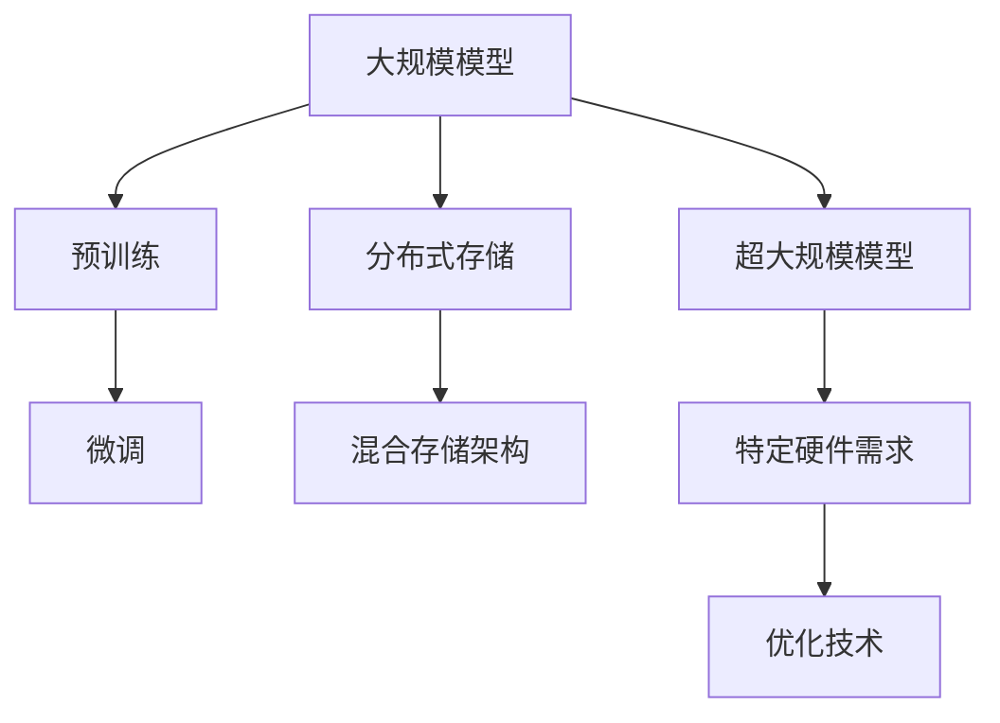

                 

# AI 大模型应用数据中心建设：数据中心技术创新

> 关键词：AI大模型,数据中心建设,大规模计算,云计算,分布式存储,超大规模模型,预训练模型,微调,数据中心创新,机器学习,深度学习,自然语言处理

## 1. 背景介绍

### 1.1 问题由来
人工智能领域，特别是深度学习技术的快速发展，为数据中心的创新和发展提供了新的思路和技术。预训练的大规模模型，如BERT、GPT-3、Transformer等，已经在自然语言处理(NLP)和其他领域取得了显著的成果。这些模型通常由大量数据训练而成，需大规模的计算资源和复杂的存储架构来支持它们的训练和部署。

然而，随着AI技术的不断深入发展，大规模模型的训练和部署对数据中心的技术和资源要求越来越高，既包括强大的计算能力，也包括高效的存储解决方案。因此，如何建设和管理能够有效支撑大规模模型训练和部署的数据中心，成为了当前的一个关键问题。

### 1.2 问题核心关键点
大模型应用数据中心的建设，涉及到以下几个关键点：
1. 高性能计算（HPC）：支持模型训练和部署的计算资源，包括GPU、TPU等加速器。
2. 高效存储解决方案：处理大量训练数据和模型参数的存储需求，包括分布式存储系统和混合存储架构。
3. 模型微调与部署：适应不同任务的模型微调，以及模型在数据中心的部署和管理。
4. 能耗管理与可持续性：大规模计算和存储的能耗，需要合理管理和优化，确保数据中心的可持续发展。

### 1.3 问题研究意义
研究大模型应用数据中心的技术创新，对于推动人工智能技术的发展，提高算法和模型的性能，对于数据中心的能源效率和可持续性至关重要。它将带来以下几个方面的影响：
1. 数据中心资源的合理使用：数据中心的运算能力、存储能力、能源消耗都需要合理规划和管理。
2. AI应用的普及和深入：大规模模型的训练和部署能够支持更广泛的AI应用领域。
3. 技术创新与产业化：通过大模型应用数据中心的建设，能够推动数据中心技术创新和产业化。
4. 促进能源效率：通过合理的能耗管理和优化，可以减少数据中心的能源消耗，降低环境影响。

## 2. 核心概念与联系

### 2.1 核心概念概述

为了更好地理解大模型应用数据中心的建设，下面我们将介绍几个密切相关的核心概念：

- **预训练模型**：通过大量数据和大型计算资源进行预训练的模型，如BERT、GPT-3、Transformer等。

- **微调**：预训练模型的微调，是在特定任务上对模型进行小规模数据训练的过程，适应不同任务的性能提升。

- **分布式存储系统**：针对大量数据和模型参数的存储需求，分布式存储系统能够提供高吞吐量和高可靠性的存储解决方案。

- **混合存储架构**：结合各种存储技术的架构，如SSD与HDD结合，提供灵活的存储策略以适应不同数据的存储需求。

- **超大规模模型**：指训练数据规模和模型参数量非常大的预训练模型，通常需要特定的硬件和优化技术来训练和部署。

这些核心概念间的逻辑关系可以通过以下Mermaid流程图来展示：



这个流程图展示了大规模模型的核心概念及其之间的关系：

1. 大模型通过预训练获得基础能力。
2. 微调是对预训练模型进行任务适应的过程。
3. 分布式存储系统支持大量数据和模型参数的存储需求。
4. 混合存储架构提供灵活的存储策略以适应不同数据的存储需求。
5. 超大规模模型需要特定的硬件和优化技术来训练和部署。

这些概念构成了大模型应用数据中心的技术基础，使其能够在支持模型训练和部署的同时，提高数据中心的效率和可持续性。

## 3. 核心算法原理 & 具体操作步骤
### 3.1 算法原理概述

构建大规模模型应用数据中心的核心是如何有效地利用计算和存储资源以支持模型的训练和部署。数据中心的技术创新包括了分布式计算架构、存储系统的优化、以及对能耗的管理等。

在数据中心技术中，分布式计算架构通常包括多个计算节点，这些节点可以是GPU、TPU或CPU等类型。它们通过网络相互连接，能够在不同的任务之间分配计算负载。

分布式存储系统则负责存储大量数据和模型参数。例如，使用HDFS（Hadoop Distributed File System）或Ceph等分布式文件系统，可以实现数据的高吞吐量和高可靠性存储。

### 3.2 算法步骤详解

以下是构建大模型应用数据中心的几个关键步骤：

1. **需求分析和规划**：根据预期的模型训练需求，规划数据中心的硬件配置、存储需求和能耗预算。

2. **硬件和软件选择**：根据模型规模和特点选择合适的计算节点（如GPU/TPU）和存储系统（如HDFS/Ceph）。

3. **网络架构设计**：设计数据中心的网络架构，以保证计算节点之间高效的数据传输和模型迁移。

4. **数据和模型的存储**：采用混合存储架构，结合SSD和HDD的优势，合理分配数据存储策略。

5. **能耗管理和优化**：使用智能管理系统，合理调度资源，减少不必要的能源消耗，确保数据中心的可持续运行。

### 3.3 算法优缺点

大规模模型应用数据中心的技术创新具有以下优点：
1. 提高模型训练效率：通过分布式计算架构，可以同时处理大量的计算任务，显著缩短模型训练时间。
2. 提升数据存储能力：分布式存储系统能够高效地存储和管理大量数据和模型参数。
3. 精细化能耗管理：通过智能管理系统，数据中心可以更好地控制能源消耗，提高资源利用率。
4. 提升数据中心的可扩展性：新的技术和架构设计使得数据中心更加容易扩展以应对未来增长的需求。

同时，这些技术也存在一些缺点：
1. 高初始投资：构建大规模的数据中心需要大量的投资，包括硬件、网络和软件的成本。
2. 维护和管理复杂度：数据中心的运维工作复杂，需要专业的技术团队进行管理。
3. 能源消耗：虽然有优化技术，但大规模数据中心的能源消耗仍然是环境和经济问题。

### 3.4 算法应用领域

大模型应用数据中心的技术创新主要应用于以下几个领域：
1. **人工智能和机器学习**：AI模型的训练和部署，包括预训练模型的微调。
2. **深度学习和神经网络**：需要大规模计算和存储资源的模型训练。
3. **自然语言处理**：利用预训练模型进行各种NLP任务，如文本分类、翻译、问答等。
4. **自动驾驶和物联网**：大规模模型应用在提高计算和存储效率方面有重要作用。

随着数据中心技术的不断发展和完善，大规模模型应用数据中心的应用将会更加广泛，成为支撑AI技术发展的重要基石。

## 4. 数学模型和公式 & 详细讲解 & 举例说明
### 4.1 数学模型构建

构建数据中心的数学模型通常需要考虑计算资源、存储资源、能耗等多个方面。以下是一个简化的例子：

假设数据中心的计算资源由$n$个节点组成，每个节点具有计算能力$P$，存储资源由$m$个节点组成，每个节点具有存储空间$S$。能耗为$E = k \cdot P \cdot T$，其中$k$是能耗系数，$T$是总计算时间。

对于一个特定的任务，模型的训练时间和存储需求可以用以下数学模型表示：

训练时间 $T = \frac{W}{P}$
存储需求 $S = \frac{D}{m}$

其中$W$是任务的工作量，$D$是数据的大小。

### 4.2 公式推导过程

数据中心的优化目标通常是最小化总能耗。因此，我们需要优化能耗函数$E$，使其与计算资源和存储资源的关系最小。

$$
E = k \cdot P \cdot T = k \cdot P \cdot \frac{W}{P} = k \cdot W
$$

由上式可以看出，能耗与计算资源的数量无关，但与工作量$W$成正比。因此，为了降低能耗，我们可以减少工作量，例如通过数据压缩或模型剪枝等方法。

### 4.3 案例分析与讲解

以下是一个简化的案例分析：
假设一个数据中心有10个GPU节点，每个节点的计算能力是1PFLOPS，存储空间是100TB。我们想要训练一个模型，这个模型的训练数据量为1PB，模型参数量为10GB。我们可以使用上述的数学模型来估算模型的训练时间和存储需求：

训练时间 $T = \frac{W}{P} = \frac{1PB}{1PFLOPS} = 1s$
存储需求 $S = \frac{D}{m} = \frac{1PB}{10 \cdot 100TB} = 0.1$

因此，我们需要10个GPU节点并行工作1秒来训练这个模型，并且需要1/10的数据中心存储空间来存储模型参数。

## 5. 项目实践：代码实例和详细解释说明
### 5.1 开发环境搭建

在开始实践大模型应用数据中心的项目之前，我们需要确保我们的开发环境足够强大。以下是构建大模型应用数据中心的基本步骤：

1. 安装必要的软件：包括操作系统、编程语言环境、机器学习框架等。
2. 配置硬件：选择合适的GPU、CPU和网络设备以支持模型训练和数据传输。
3. 部署分布式存储系统：如HDFS或Ceph，用于存储和管理模型数据和参数。

### 5.2 源代码详细实现

以下是一个简单的例子，展示了如何使用Python和Dask库在数据中心环境中并行训练一个模型：

```python
import dask.array as da
from dask.distributed import Client

# 假设我们有一个大型数组，我们想并行计算它的和
large_array = da.from_array(np.random.random((1000, 1000)), chunks=(100, 100))

# 创建一个Dask客户端
client = Client()

# 使用Dask并行计算数组的和
result = large_array.sum().compute()

print(result)
```

### 5.3 代码解读与分析

在上述代码中，我们首先定义了一个大型数组，并指定了每个计算块的大小。然后，我们使用Dask客户端来配置和管理分布式计算集群。最后，我们使用Dask的`sum`函数并行计算数组的和。

### 5.4 运行结果展示

执行上述代码后，Dask将自动分配任务到可用的计算节点上，并返回数组和的结果。

## 6. 实际应用场景
### 6.1 虚拟现实(VR)和增强现实(AR)技术

AI模型应用在虚拟现实和增强现实技术中的应用场景包括动态环境渲染、交互响应、路径规划等。这些模型需要处理大量数据并进行复杂的计算以提供高质量的视觉和体验。

### 6.2 自动驾驶汽车

自动驾驶汽车需要处理来自传感器的海量数据，进行实时处理和决策。AI模型应用在这方面可以帮助提高车辆的安全性和效率。

### 6.3 机器人和无人机

在机器人和无人机领域，AI模型可以用于控制和导航任务，处理来自各种传感器的数据并根据模型的预测执行动作。

### 6.4 未来应用展望

随着技术的发展和进一步的创新，AI模型应用在这些领域的潜力将会更加巨大。我们可以预见，在未来的应用中，人工智能将更加融合和自适应，不仅仅用于特定的任务或应用场景，而是成为我们日常生活的重要组成部分。

## 7. 工具和资源推荐
### 7.1 学习资源推荐

为了帮助开发者系统掌握大模型应用数据中心的知识，这里推荐一些优质的学习资源：

1. 《深度学习》：由Ian Goodfellow、Yoshua Bengio、Aaron Courville撰写的深度学习教材，全面介绍了深度学习的基础知识和算法。

2. 《机器学习》：由Andrew Ng撰写的机器学习教材，介绍了机器学习的基本概念和实践。

3. 《Dask编程指南》：介绍了Dask库的使用方法，用于并行处理大规模数据集。

4. 《分布式系统原理与实践》：介绍了分布式系统的原理和实践，包括网络架构和数据存储。

5. 《高性能计算》：介绍了高性能计算的原理和实践，包括硬件优化和软件优化。

通过这些资源的学习和实践，你将能够更好地理解大模型应用数据中心的基础知识，并在实践中应用这些知识。

### 7.2 开发工具推荐

以下是一些用于构建大模型应用数据中心的开发工具推荐：

1. **Dask**:一个开源的分布式计算库，用于并行处理大数据集。

2. **Apache Spark**:一个开源的集群计算框架，用于处理大规模数据集。

3. **TensorFlow**:一个开源的机器学习库，用于构建和部署AI模型。

4. **PyTorch**:一个开源的机器学习库，用于构建和部署AI模型。

5. **Ceph**:一个开源的分布式文件系统，用于存储和管理大规模数据集。

6. **Hadoop**:一个开源的分布式存储和计算平台，用于处理大规模数据集。

这些工具将帮助你构建和部署大规模模型的应用数据中心。

### 7.3 相关论文推荐

以下是一些关于大模型应用数据中心的相关论文推荐：

1. "A Framework for Distributed Deep Learning"：介绍了分布式深度学习的框架及其应用。

2. "Scalability in Distributed Deep Learning"：讨论了分布式深度学习的可扩展性问题。

3. "Efficient Data Center Design for AI Workloads"：讨论了如何设计高效的数据中心以优化AI工作负载。

4. "Power-Efficient Distributed Deep Learning"：讨论了如何通过优化数据中心的能耗来提高分布式深度学习的效率。

通过阅读这些论文，你将能够更深入地理解大模型应用数据中心的技术和挑战。

## 8. 总结：未来发展趋势与挑战
### 8.1 研究成果总结

本文全面介绍了大模型应用数据中心的关键技术和实践指南，包括分布式计算架构、存储系统的优化、能耗管理等。通过实际案例和代码示例，提供了理解和应用大模型数据中心的具体方法。我们讨论了大模型应用数据中心的优点和挑战，并分析了这些技术在AI领域的潜在应用场景。

### 8.2 未来发展趋势

未来，随着技术的不断发展和技术的不断优化，大模型应用数据中心将面临以下几大发展趋势：
1. **技术进步**：计算能力、存储空间和网络传输速率将会随着技术的进步而不断提升。
2. **算法创新**：新的机器学习和深度学习算法将被开发，以更好地利用大模型应用数据中心的能力。
3. **应用扩展**：大模型应用数据中心将被用于更多的领域，包括虚拟现实、自动驾驶、医疗等。
4. **能耗优化**：随着对环境影响的关注日益增强，大模型应用数据中心将更加注重能耗的优化和减少。

### 8.3 面临的挑战

尽管大模型应用数据中心的技术和实践正在迅速发展，但它仍面临以下挑战：
1. **成本问题**：构建和维护大规模的数据中心需要大量的资金。
2. **复杂性**：大模型应用数据中心需要复杂的硬件和软件架构，维护和管理更为复杂。
3. **安全问题**：大数据中心存储的数据量巨大，面临的安全风险也相应增加。
4. **环境影响**：大数据中心的运营需要大量电能，可能对环境造成负面影响。

### 8.4 研究展望

面对这些挑战，我们认为未来研究应该重点在以下几个方面：
1. **算法创新**：开发新的算法和优化技术，以提高模型训练效率和精度，同时减少能耗。
2. **硬件优化**：研究和开发更高效的硬件架构，以支持大模型的训练和部署。
3. **系统优化**：优化数据中心的系统设计，以提高能效和降低成本。
4. **安全和可靠性**：研究如何确保数据中心的安全性和可靠性，防止数据泄露和系统故障。

通过解决这些问题，AI大模型应用数据中心将更加先进和实用，为社会带来更大的价值。

## 9. 附录：常见问题与解答

### Q1：为什么需要分布式计算架构来训练AI模型？

A: 分布式计算架构能够处理大规模数据集和复杂模型，训练时间可以显著减少，同时提高训练效率。

### Q2：如何选择合适的存储系统？

A: 选择存储系统应考虑数据量大小、访问模式和可扩展性。混合存储架构结合SSD和HDD的优点，适应不同数据的存储需求。

### Q3：如何优化能耗？

A: 优化能耗包括合理调度资源、使用高效的硬件设备、应用能效优化技术等。智能管理系统可以帮助实现这些目标。

### Q4：大模型应用数据中心对环境有何影响？

A: 大数据中心的运营需要大量电能，可能对环境造成负面影响。因此，能耗管理和优化是提高可持续性的关键。

### Q5：如何确保数据中心的安全性？

A: 通过实施严格的安全措施，如访问控制、数据加密和灾难恢复计划，可以提高数据中心的安全性。

---

作者：禅与计算机程序设计艺术 / Zen and the Art of Computer Programming

