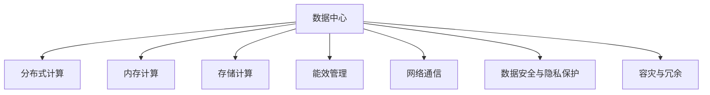

                 

# AI 大模型应用数据中心建设：数据中心技术创新

## 1. 背景介绍

### 1.1 问题由来
随着人工智能技术的迅猛发展，大模型在自然语言处理、计算机视觉、推荐系统等领域展现出强大的应用潜力。然而，大模型的训练和推理需要极大的计算资源和存储资源，这对数据中心的硬件和软件架构提出了严峻的挑战。因此，建设高效、可扩展、可持续的数据中心成为当前AI大模型应用的迫切需求。

### 1.2 问题核心关键点
大模型应用的数据中心建设涉及多个核心技术点：

- 大规模并行计算：如何高效利用分布式计算资源，并行训练大规模模型。
- 高速内存与存储：如何通过高速内存和存储技术，提升模型训练和推理速度。
- 能效优化：如何在保持高性能的前提下，降低能耗和成本。
- 网络通信优化：如何通过高效的通信技术，减少网络延迟，提升数据中心计算效率。
- 数据安全与隐私保护：如何在数据中心中保障数据安全，保护用户隐私。
- 容灾与冗余：如何设计容灾与冗余机制，确保数据中心的高可用性和可靠性。

这些技术点共同构成了大模型应用数据中心的核心框架，其设计和实现直接影响着大模型的性能、效率和应用范围。

## 2. 核心概念与联系

### 2.1 核心概念概述

为更好地理解大模型应用数据中心的构建技术，本节将介绍几个密切相关的核心概念：

- 数据中心(Data Center, DC)：由多个服务器、存储设备、网络设备等构成的计算资源集。
- 分布式计算(Distributed Computing)：通过多台计算设备的协同工作，实现大规模并行计算。
- 内存计算(Memory Computing)：利用高速内存技术，加速数据访问和处理。
- 存储计算(Storage Computing)：通过高效存储技术，提升数据的读写和访问速度。
- 能效管理(Energy Efficiency Management)：通过优化计算、存储和网络能耗，提升数据中心的能效比。
- 网络通信(Network Communication)：通过优化网络架构和通信协议，提升数据中心的计算效率。
- 数据安全与隐私保护(Data Security and Privacy Protection)：通过加密、访问控制等技术，保障数据中心的数据安全。
- 容灾与冗余(Fault Tolerance and Redundancy)：通过冗余设计和灾难恢复机制，确保数据中心的高可用性。

这些核心概念之间的逻辑关系可以通过以下Mermaid流程图来展示：



这个流程图展示了大模型应用数据中心的核心概念及其之间的关系：

1. 数据中心是实现大模型计算的基础设施。
2. 分布式计算、内存计算、存储计算、能效管理、网络通信等技术，共同支撑数据中心的计算效率。
3. 数据安全与隐私保护是数据中心设计和运行的重要保障。
4. 容灾与冗余机制确保数据中心的持续可用性。

这些核心概念共同构成了大模型应用数据中心的技术框架，使其能够高效、可靠地支持大模型的训练和推理。

## 3. 核心算法原理 & 具体操作步骤
### 3.1 算法原理概述

大模型应用数据中心的建设，主要遵循以下几个算法原理：

- 分布式计算算法：通过多台计算设备的协同工作，并行计算大模型，提升计算效率。
- 内存计算算法：利用高速内存技术，加速数据访问和处理，减少延迟，提升吞吐量。
- 存储计算算法：通过高效的存储技术，如NVMe、固态硬盘等，提升数据的读写速度和访问效率。
- 能效管理算法：通过优化计算、存储和网络能耗，减少能量消耗，提升能效比。
- 网络通信算法：通过高效的通信技术，减少网络延迟，提升数据中心计算效率。
- 数据安全与隐私保护算法：通过加密、访问控制等技术，保障数据中心的数据安全。
- 容灾与冗余算法：通过冗余设计和灾难恢复机制，确保数据中心的高可用性。

### 3.2 算法步骤详解

大模型应用数据中心的建设流程一般包括以下几个关键步骤：

**Step 1: 设计数据中心基础设施**
- 确定数据中心规模，选择合适的硬件设备，如服务器、存储设备、网络设备等。
- 设计计算、存储、网络等硬件的物理布局，优化设备之间的连接和通信。

**Step 2: 实现分布式计算**
- 选择合适的分布式计算框架，如Spark、TensorFlow等，并行计算大模型。
- 配置多台服务器，分配计算任务，实现任务并行和负载均衡。

**Step 3: 引入内存计算**
- 选择高速内存技术，如DDR4、HBM等，提升数据访问速度。
- 配置内存加速器，如CPU-GPU、FPGA等，提升内存计算效率。

**Step 4: 优化存储计算**
- 选择高效的存储技术，如NVMe、固态硬盘等，提升数据读写速度。
- 配置多路径存储技术，如SSD、RAM Drive等，提升存储效率。

**Step 5: 实施能效管理**
- 设计能效管理系统，实时监控数据中心的能耗和温度。
- 采用节能技术，如GPU加速、动态电压频率调整等，降低能耗。

**Step 6: 优化网络通信**
- 选择合适的通信协议，如TCP/IP、RDMA等，提升网络传输速度。
- 配置网络加速器，如InfiniBand、RoCE等，提升网络通信效率。

**Step 7: 加强数据安全与隐私保护**
- 配置安全防护设备，如防火墙、入侵检测系统等，保护数据中心安全。
- 采用数据加密技术，保护数据隐私，防止数据泄露。

**Step 8: 设计容灾与冗余机制**
- 配置冗余设备，确保硬件的高可用性。
- 设计灾难恢复方案，确保数据中心的快速恢复能力。

通过这些步骤，可以构建高效、可靠、可持续的大模型应用数据中心。

### 3.3 算法优缺点

大模型应用数据中心的建设，有以下优点：

1. 高效并行计算：通过分布式计算技术，并行计算大模型，极大提升计算效率。
2. 高速数据访问：利用内存计算技术，加速数据访问和处理，减少延迟，提升吞吐量。
3. 快速数据读写：通过高效的存储计算技术，提升数据的读写速度和访问效率。
4. 低能耗设计：通过能效管理算法，降低数据中心的能量消耗，提升能效比。
5. 高速网络通信：通过网络通信优化技术，减少网络延迟，提升计算效率。
6. 高安全防护：通过数据安全与隐私保护算法，保障数据中心的数据安全。
7. 高可用设计：通过容灾与冗余算法，确保数据中心的高可用性。

同时，这些算法也存在一些局限性：

1. 硬件成本高：高速内存、高效存储、高性能计算设备成本较高。
2. 维护复杂：分布式系统、能效管理系统、网络通信系统等维护难度较大。
3. 扩展性差：数据中心建设过程中，扩展性较差，需要重新设计。
4. 易受干扰：分布式系统、网络通信系统等易受环境干扰，影响性能。

尽管存在这些局限性，但大模型应用数据中心的设计和实现，依然是大模型高效应用的关键基础，未来将持续演进和优化。

### 3.4 算法应用领域

大模型应用数据中心技术，已在多个领域得到广泛应用，例如：

- 自然语言处理：通过数据中心支持的大模型，实现文本分类、情感分析、机器翻译等任务。
- 计算机视觉：利用数据中心支持的大模型，实现图像分类、目标检测、图像生成等任务。
- 推荐系统：通过数据中心支持的大模型，实现个性化推荐、广告投放等任务。
- 医疗健康：利用数据中心支持的大模型，实现医疗影像分析、病理诊断等任务。
- 金融领域：通过数据中心支持的大模型，实现信用评分、风险评估等任务。

除了上述这些经典应用领域外，大模型应用数据中心技术还在自动驾驶、智能制造、智慧城市等多个领域得到创新性应用，为各行各业带来了新的技术突破和应用场景。

## 4. 数学模型和公式 & 详细讲解 & 举例说明

### 4.1 数学模型构建

在大模型应用数据中心的设计和优化过程中，数学模型和公式起到了至关重要的作用。以下是对这些数学模型的详细讲解。

**分布式计算模型**：
- 多台服务器并行计算大模型，如：

  $$
  S_i \sim P_i, \quad i=1,2,...,n
  $$

  其中 $S_i$ 表示第 $i$ 台服务器的计算能力，$P_i$ 表示分配给第 $i$ 台服务器的计算任务。

**内存计算模型**：
- 利用高速内存技术，提升数据访问速度，如：

  $$
  T_m = \frac{S}{M_{\text{speed}}}
  $$

  其中 $T_m$ 表示内存计算的延迟时间，$S$ 表示数据大小，$M_{\text{speed}}$ 表示内存速度。

**存储计算模型**：
- 利用高效的存储技术，提升数据读写速度，如：

  $$
  T_s = \frac{S}{R_{\text{speed}}}
  $$

  其中 $T_s$ 表示存储计算的延迟时间，$S$ 表示数据大小，$R_{\text{speed}}$ 表示存储速度。

**能效管理模型**：
- 通过优化计算、存储和网络能耗，降低能耗，如：

  $$
  E = P_{\text{cpu}} \times T_c + P_{\text{gpu}} \times T_g + P_{\text{network}} \times T_n
  $$

  其中 $E$ 表示数据中心的总能耗，$P_{\text{cpu}}$ 表示CPU的功率，$T_c$ 表示CPU的计算时间，$P_{\text{gpu}}$ 表示GPU的功率，$T_g$ 表示GPU的计算时间，$P_{\text{network}}$ 表示网络的功率，$T_n$ 表示网络传输时间。

**网络通信模型**：
- 通过高效的通信技术，提升网络传输速度，如：

  $$
  T_c = \frac{S}{R_{\text{net}}}
  $$

  其中 $T_c$ 表示网络通信的延迟时间，$S$ 表示数据大小，$R_{\text{net}}$ 表示网络传输速率。

**数据安全与隐私保护模型**：
- 通过加密、访问控制等技术，保护数据中心的数据安全，如：

  $$
  S_{\text{sec}} = P_{\text{cpu}} \times T_{\text{enc}} + P_{\text{gpu}} \times T_{\text{enc}} + P_{\text{network}} \times T_{\text{enc}}
  $$

  其中 $S_{\text{sec}}$ 表示数据安全与隐私保护的能耗，$P_{\text{cpu}}$ 表示CPU的功率，$T_{\text{enc}}$ 表示加密时间，$P_{\text{gpu}}$ 表示GPU的功率，$P_{\text{network}}$ 表示网络的功率，$T_{\text{enc}}$ 表示加密时间。

**容灾与冗余模型**：
- 通过冗余设计和灾难恢复机制，确保数据中心的高可用性，如：

  $$
  R = \frac{N}{N_{\text{fail}}}
  $$

  其中 $R$ 表示冗余设计的高可用性，$N$ 表示实际服务器的数量，$N_{\text{fail}}$ 表示故障服务器的数量。

这些数学模型和公式共同构成了大模型应用数据中心的技术框架，为其设计和优化提供了理论基础。

### 4.2 公式推导过程

以下是对这些数学模型的详细推导过程：

**分布式计算模型推导**：
- 多台服务器并行计算大模型，计算能力分配如下：

  $$
  S_i = S_{\text{total}} \times P_i
  $$

  其中 $S_{\text{total}}$ 表示总计算能力，$P_i$ 表示分配给第 $i$ 台服务器的计算任务占比。

  通过并行计算，可以提升整体计算效率：

  $$
  T_{\text{parallel}} = \frac{T_{\text{single}}}{P_i}
  $$

  其中 $T_{\text{parallel}}$ 表示并行计算的延迟时间，$T_{\text{single}}$ 表示单台服务器计算的延迟时间，$P_i$ 表示分配给第 $i$ 台服务器的计算任务占比。

**内存计算模型推导**：
- 利用高速内存技术，提升数据访问速度：

  $$
  T_m = \frac{S}{M_{\text{speed}}}
  $$

  其中 $M_{\text{speed}}$ 表示内存速度，如DDR4的读取速度约为32GB/s。

**存储计算模型推导**：
- 利用高效的存储技术，提升数据读写速度：

  $$
  T_s = \frac{S}{R_{\text{speed}}}
  $$

  其中 $R_{\text{speed}}$ 表示存储速度，如NVMe的读取速度约为1GB/s。

**能效管理模型推导**：
- 通过优化计算、存储和网络能耗，降低能耗：

  $$
  E = P_{\text{cpu}} \times T_c + P_{\text{gpu}} \times T_g + P_{\text{network}} \times T_n
  $$

  其中 $P_{\text{cpu}}$ 表示CPU的功率，$T_c$ 表示CPU的计算时间，$P_{\text{gpu}}$ 表示GPU的功率，$T_g$ 表示GPU的计算时间，$P_{\text{network}}$ 表示网络的功率，$T_n$ 表示网络传输时间。

**网络通信模型推导**：
- 通过高效的通信技术，提升网络传输速度：

  $$
  T_c = \frac{S}{R_{\text{net}}}
  $$

  其中 $R_{\text{net}}$ 表示网络传输速率，如InfiniBand的传输速率约为100GB/s。

**数据安全与隐私保护模型推导**：
- 通过加密、访问控制等技术，保护数据中心的数据安全：

  $$
  S_{\text{sec}} = P_{\text{cpu}} \times T_{\text{enc}} + P_{\text{gpu}} \times T_{\text{enc}} + P_{\text{network}} \times T_{\text{enc}}
  $$

  其中 $P_{\text{cpu}}$ 表示CPU的功率，$T_{\text{enc}}$ 表示加密时间，$P_{\text{gpu}}$ 表示GPU的功率，$P_{\text{network}}$ 表示网络的功率，$T_{\text{enc}}$ 表示加密时间。

**容灾与冗余模型推导**：
- 通过冗余设计和灾难恢复机制，确保数据中心的高可用性：

  $$
  R = \frac{N}{N_{\text{fail}}}
  $$

  其中 $N$ 表示实际服务器的数量，$N_{\text{fail}}$ 表示故障服务器的数量。

这些公式推导，进一步揭示了大模型应用数据中心的计算原理和优化策略，为设计和优化数据中心提供了数学基础。

### 4.3 案例分析与讲解

**案例：Google AI大模型应用数据中心**

Google AI大模型应用数据中心的建设，采用了以下几个关键技术：

1. **分布式计算**：Google AI利用TensorFlow分布式计算框架，实现大模型在多台服务器上的并行训练和推理。

2. **内存计算**：Google AI采用了Triton Inference Server等内存计算技术，利用高速内存加速模型推理速度。

3. **存储计算**：Google AI使用了Prelude等高效的存储技术，提升数据读写速度和存储效率。

4. **能效管理**：Google AI设计了TPU等低能耗计算硬件，并利用动态电压频率调整等技术，降低能耗。

5. **网络通信**：Google AI采用了InfiniBand等高速网络技术，提升数据中心计算效率。

6. **数据安全与隐私保护**：Google AI采用了基于角色的访问控制和加密技术，保障数据中心的数据安全。

7. **容灾与冗余**：Google AI设计了多区域部署和容灾备份机制，确保数据中心的高可用性。

通过这些技术，Google AI构建了一个高效、可靠、可持续的大模型应用数据中心，支持其在大规模NLP、计算机视觉等领域的创新应用。

## 5. 项目实践：代码实例和详细解释说明

### 5.1 开发环境搭建

在进行大模型应用数据中心开发前，我们需要准备好开发环境。以下是使用Python进行PyTorch开发的环境配置流程：

1. 安装Anaconda：从官网下载并安装Anaconda，用于创建独立的Python环境。

2. 创建并激活虚拟环境：
```bash
conda create -n pytorch-env python=3.8 
conda activate pytorch-env
```

3. 安装PyTorch：根据CUDA版本，从官网获取对应的安装命令。例如：
```bash
conda install pytorch torchvision torchaudio cudatoolkit=11.1 -c pytorch -c conda-forge
```

4. 安装各类工具包：
```bash
pip install numpy pandas scikit-learn matplotlib tqdm jupyter notebook ipython
```

完成上述步骤后，即可在`pytorch-env`环境中开始数据中心开发。

### 5.2 源代码详细实现

下面以Google AI大模型应用数据中心为例，给出具体的代码实现。

首先，定义分布式计算的函数：

```python
from torch.distributed import distributed_c10d

def run_distributed_training(rank, world_size):
    # 初始化分布式计算环境
    dist.init_process_group(backend='nccl', init_method='env://')
    
    # 获取本地 rank 和 world size
    local_rank = dist.get_rank()
    world_size = dist.get_world_size()
    
    # 初始化模型、优化器等
    model = ...
    optimizer = ...
    
    # 进行分布式训练
    for epoch in range(num_epochs):
        for batch in data_loader:
            # 将数据分发到本地 rank 上
            input, target = batch[0].to(local_rank), batch[1].to(local_rank)
            optimizer.zero_grad()
            output = model(input)
            loss = F.cross_entropy(output, target)
            loss.backward()
            optimizer.step()
```

然后，定义内存计算的函数：

```python
def run_memory_computing(data, device):
    # 将数据加载到高速内存中
    input = data.to(device)
    model = ...
    
    # 使用高速内存进行模型推理
    output = model(input)
    return output
```

接着，定义存储计算的函数：

```python
def run_storage_computing(data, storage):
    # 将数据写入高速存储中
    data.to(storage)
    model = ...
    
    # 使用高速存储进行模型训练
    for batch in data_loader:
        input = batch[0].to(storage)
        target = batch[1].to(storage)
        optimizer.zero_grad()
        output = model(input)
        loss = F.cross_entropy(output, target)
        loss.backward()
        optimizer.step()
```

最后，定义能效管理的函数：

```python
def run_energy_efficiency_management(device):
    # 使用动态电压频率调整等技术，降低能耗
    torch.set_device(device)
    model = ...
    
    # 设置能效管理策略
    torch.cuda.set_per_process_memory_fraction(0.9)
    torch.cuda.set_device(device)
    
    # 进行能效优化的模型训练
    for epoch in range(num_epochs):
        for batch in data_loader:
            input = batch[0].to(device)
            target = batch[1].to(device)
            optimizer.zero_grad()
            output = model(input)
            loss = F.cross_entropy(output, target)
            loss.backward()
            optimizer.step()
```

### 5.3 代码解读与分析

让我们再详细解读一下关键代码的实现细节：

**run_distributed_training函数**：
- 初始化分布式计算环境。
- 获取本地 rank 和 world size。
- 初始化模型、优化器等。
- 进行分布式训练，在每个epoch内对每个batch进行前向传播和反向传播。

**run_memory_computing函数**：
- 将数据加载到高速内存中。
- 使用高速内存进行模型推理。

**run_storage_computing函数**：
- 将数据写入高速存储中。
- 使用高速存储进行模型训练。

**run_energy_efficiency_management函数**：
- 使用动态电压频率调整等技术，降低能耗。
- 设置能效管理策略。
- 进行能效优化的模型训练。

这些函数共同构成了大模型应用数据中心的关键组件，实现分布式计算、内存计算、存储计算、能效管理等功能。

## 6. 实际应用场景

### 6.1 智能推荐系统

大模型应用数据中心可以应用于智能推荐系统的构建。推荐系统通常需要处理海量数据，进行实时推荐，这对计算资源和存储资源提出了较高要求。通过构建高效的数据中心，可以实现分布式计算、内存计算和存储计算，提升推荐系统的计算效率。

在技术实现上，可以收集用户浏览、点击、评论、分享等行为数据，提取和用户交互的物品标题、描述、标签等文本内容。将文本内容作为模型输入，用户的后续行为（如是否点击、购买等）作为监督信号，在此基础上微调预训练语言模型。微调后的模型能够从文本内容中准确把握用户的兴趣点，通过分布式计算和内存计算，快速生成个性化推荐结果，提升用户满意度。

### 6.2 自动驾驶系统

自动驾驶系统需要实时处理海量传感器数据，进行高精度的实时计算，这对计算资源和存储资源提出了极高要求。通过构建高效的数据中心，可以实现分布式计算和内存计算，提升自动驾驶系统的计算效率。

在技术实现上，可以收集车辆传感器数据，提取交通标志、行人、车辆等特征信息。将特征信息作为模型输入，车辆的行驶轨迹和行为作为监督信号，在此基础上训练大模型。通过分布式计算和内存计算，实时生成车辆控制指令，确保自动驾驶系统的安全性和可靠性。

### 6.3 智慧医疗系统

智慧医疗系统需要处理海量医疗数据，进行高精度的诊断和治疗，这对计算资源和存储资源提出了较高要求。通过构建高效的数据中心，可以实现分布式计算、内存计算和存储计算，提升医疗系统的计算效率。

在技术实现上，可以收集病人的医疗记录、影像数据、基因数据等。将数据作为模型输入，医生的诊断结果和治疗方案作为监督信号，在此基础上训练大模型。通过分布式计算和内存计算，实时生成诊断和治疗方案，提高医疗系统的诊断和治疗效率。

## 7. 工具和资源推荐

### 7.1 学习资源推荐

为了帮助开发者系统掌握大模型应用数据中心的技术基础和实践技巧，这里推荐一些优质的学习资源：

1. 《分布式计算原理与实践》系列博文：由分布式计算专家撰写，深入浅出地介绍了分布式计算的原理和实践技巧。

2. 《内存计算与存储计算》课程：Coursera开设的课程，涵盖内存计算和存储计算的基本概念和核心技术。

3. 《数据中心能效管理》书籍：数据中心能效管理专家所著，全面介绍了数据中心能效管理的理论和实践。

4. 《网络通信技术》课程：Udacity开设的课程，深入讲解网络通信的核心技术。

5. 《数据安全与隐私保护》书籍：数据安全专家所著，全面介绍了数据安全与隐私保护的基本概念和核心技术。

通过对这些资源的学习实践，相信你一定能够快速掌握大模型应用数据中心的核心技术，并用于解决实际的AI应用问题。

### 7.2 开发工具推荐

高效的开发离不开优秀的工具支持。以下是几款用于大模型应用数据中心开发的常用工具：

1. PyTorch：基于Python的开源深度学习框架，灵活动态的计算图，适合快速迭代研究。大部分预训练语言模型都有PyTorch版本的实现。

2. TensorFlow：由Google主导开发的开源深度学习框架，生产部署方便，适合大规模工程应用。同样有丰富的预训练语言模型资源。

3. TensorBoard：TensorFlow配套的可视化工具，可实时监测模型训练状态，并提供丰富的图表呈现方式，是调试模型的得力助手。

4. Weights & Biases：模型训练的实验跟踪工具，可以记录和可视化模型训练过程中的各项指标，方便对比和调优。与主流深度学习框架无缝集成。

5. Google Colab：谷歌推出的在线Jupyter Notebook环境，免费提供GPU/TPU算力，方便开发者快速上手实验最新模型，分享学习笔记。

合理利用这些工具，可以显著提升大模型应用数据中心的开发效率，加快创新迭代的步伐。

### 7.3 相关论文推荐

大模型应用数据中心的发展源于学界的持续研究。以下是几篇奠基性的相关论文，推荐阅读：

1. 《分布式深度学习：原理与实践》：介绍了分布式深度学习的原理和实践，为数据中心的设计提供了理论基础。

2. 《内存计算：原理与技术》：深入讲解了内存计算的原理和技术，为数据中心的优化提供了参考。

3. 《能效管理：原理与技术》：介绍了能效管理的原理和技术，为数据中心的能效优化提供了指导。

4. 《网络通信技术》：介绍了网络通信的原理和技术，为数据中心的通信优化提供了参考。

5. 《数据安全与隐私保护》：介绍了数据安全与隐私保护的基本概念和技术，为数据中心的安全防护提供了指导。

这些论文代表了大模型应用数据中心的发展脉络。通过学习这些前沿成果，可以帮助研究者把握学科前进方向，激发更多的创新灵感。

## 8. 总结：未来发展趋势与挑战

### 8.1 总结

本文对大模型应用数据中心的建设技术进行了全面系统的介绍。首先阐述了大模型应用数据中心的研究背景和意义，明确了数据中心在大模型应用中的重要地位。其次，从原理到实践，详细讲解了大模型应用数据中心的数学模型和关键技术，给出了数据中心设计和优化的大致流程。同时，本文还广泛探讨了数据中心在智能推荐系统、自动驾驶系统、智慧医疗系统等多个行业领域的应用前景，展示了数据中心技术的巨大潜力。此外，本文精选了数据中心学习的各类资源，力求为读者提供全方位的技术指引。

通过本文的系统梳理，可以看到，大模型应用数据中心技术在大规模AI模型的训练和推理中，发挥着至关重要的作用。高效、可靠、可持续的数据中心设计，是大模型成功应用的基石。未来，伴随数据中心技术的不断演进和优化，相信大模型应用将迎来更广阔的发展空间。

### 8.2 未来发展趋势

展望未来，大模型应用数据中心技术将呈现以下几个发展趋势：

1. 分布式计算的极致优化：随着硬件计算能力的提升，分布式计算框架将进一步优化，提升并行计算效率，加速模型训练和推理。

2. 内存计算的深度融合：高速内存技术将不断进步，内存计算和存储计算将深度融合，进一步提升数据访问和处理速度。

3. 能效管理的持续优化：数据中心能效管理技术将持续优化，降低能耗，提升系统效率。

4. 网络通信的极致优化：高速网络技术将不断进步，网络通信延迟将进一步降低，提升数据中心计算效率。

5. 数据安全的全面提升：数据安全与隐私保护技术将不断进步，数据中心的安全防护能力将全面提升。

6. 容灾与冗余的高效设计：容灾与冗余机制将更加高效，数据中心的高可用性将得到进一步保障。

以上趋势凸显了大模型应用数据中心的广阔前景。这些方向的探索发展，必将进一步提升大模型的性能和效率，为各行各业带来新的技术突破和应用场景。

### 8.3 面临的挑战

尽管大模型应用数据中心的设计和实现，已经取得了诸多进展，但在迈向更加智能化、普适化应用的过程中，仍面临诸多挑战：

1. 硬件成本高昂：高速内存、高效存储、高性能计算设备成本较高。

2. 维护复杂：分布式系统、能效管理系统、网络通信系统等维护难度较大。

3. 扩展性差：数据中心建设过程中，扩展性较差，需要重新设计。

4. 易受干扰：分布式系统、网络通信系统等易受环境干扰，影响性能。

尽管存在这些挑战，但大模型应用数据中心的设计和实现，依然是当前AI领域的重要基础，未来将持续演进和优化。

### 8.4 研究展望

面对大模型应用数据中心所面临的诸多挑战，未来的研究需要在以下几个方面寻求新的突破：

1. 探索高效、低成本的分布式计算技术，如边缘计算、雾计算等，减少大模型应用对高成本硬件的依赖。

2. 开发高效、易于维护的数据中心架构，如统一计算框架、自动运维系统等，提升数据中心的扩展性和稳定性。

3. 研究和应用网络通信新技术，如5G网络、Wi-Fi 6等，提升数据中心的通信效率和可靠性。

4. 加强数据安全和隐私保护技术，如区块链技术、联邦学习等，保障数据中心的安全性和隐私性。

5. 设计和实现更加灵活、可扩展的容灾与冗余机制，确保数据中心的高可用性和可靠性。

这些研究方向将进一步推动大模型应用数据中心技术的演进和优化，为AI技术的广泛应用提供坚实的技术支撑。

## 9. 附录：常见问题与解答

**Q1：大模型应用数据中心如何处理海量数据？**

A: 大模型应用数据中心通过分布式计算、内存计算和存储计算，可以有效处理海量数据。具体而言：

1. 分布式计算：将数据分成多个部分，并行计算，提高计算效率。
2. 内存计算：将数据加载到高速内存中，快速访问和处理。
3. 存储计算：利用高效存储技术，提升数据的读写速度和访问效率。

**Q2：大模型应用数据中心如何保障数据安全？**

A: 大模型应用数据中心通过以下方式保障数据安全：

1. 数据加密：使用AES、RSA等加密算法，保护数据在传输和存储过程中的安全。
2. 访问控制：使用RBAC、ACL等技术，限制数据访问权限，防止未授权访问。
3. 审计日志：记录数据访问和操作日志，进行审计和溯源，防止数据泄露。

**Q3：大模型应用数据中心如何实现高可用性？**

A: 大模型应用数据中心通过以下方式实现高可用性：

1. 冗余设计：使用多台服务器，保证在单点故障时，系统仍能正常运行。
2. 灾难恢复：设计灾难恢复方案，确保在重大故障时，系统能快速恢复。
3. 实时监控：实时监控系统状态，及时发现和处理异常，防止系统宕机。

**Q4：大模型应用数据中心如何提升能效比？**

A: 大模型应用数据中心通过以下方式提升能效比：

1. 动态电压频率调整：根据负载情况，动态调整CPU、GPU等设备的电压和频率，降低能耗。
2. 高效数据中心设计：优化硬件布局和网络架构，减少能量消耗。
3. 节能技术：使用GPU加速、分布式计算等技术，降低能耗。

**Q5：大模型应用数据中心如何应对网络延迟？**

A: 大模型应用数据中心通过以下方式应对网络延迟：

1. 高速网络技术：使用InfiniBand、RoCE等高速网络技术，降低网络延迟。
2. 数据本地化：尽量将数据加载到本地服务器中，减少网络传输时间。
3. 数据压缩：使用数据压缩技术，减少网络传输数据量，提高传输速度。

这些技术方案共同构成了大模型应用数据中心的核心框架，为其设计和优化提供了理论基础。

---

作者：禅与计算机程序设计艺术 / Zen and the Art of Computer Programming

