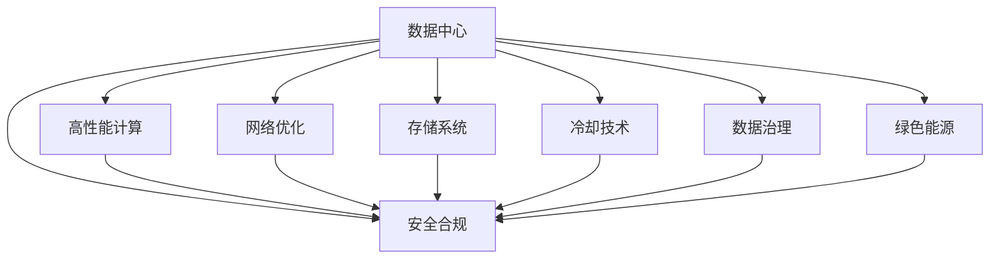

                 

# AI 大模型应用数据中心建设：数据中心技术创新

> 关键词：AI 大模型, 数据中心, 技术创新, 高性能计算, 网络优化, 存储系统, 冷却技术, 安全合规, 数据治理, 绿色能源

## 1. 背景介绍

### 1.1 问题由来
在人工智能（AI）和大模型应用的浪潮中，数据中心成为了不可或缺的基础设施。大模型如BERT、GPT-3、T5等，由于其庞大的参数量和复杂的计算需求，对于数据中心的硬件、软件和架构都提出了严苛的要求。为支持AI大模型的训练和推理，数据中心需要具备极高的计算能力、稳定的网络连接、高效的存储系统、严格的冷却方案以及安全合规的治理体系。然而，传统的IDC建设理念和架构已经难以满足现代AI计算的需求。数据中心的技术创新，变得尤为迫切。

### 1.2 问题核心关键点
本节将深入探讨数据中心在大模型应用中的角色与挑战，剖析大模型对数据中心架构、技术及运营的关键影响，并提出解决方案与创新方向。

### 1.3 问题研究意义
数据中心的技术创新对于AI大模型的应用具有深远的意义：

1. 提升训练和推理效率。优化硬件、软件和架构，降低计算和存储成本，提升整体系统性能。
2. 保障系统稳定性和可靠性。通过高效的冷却和网络优化，确保数据中心能够稳定运行，应对高负荷计算需求。
3. 增强数据中心的安全合规性。构建严格的安全体系和治理机制，保障数据安全和模型合规，减少法律风险。
4. 推动绿色能源的利用。采用高效能耗的技术和架构，减少数据中心能耗，助力实现可持续发展目标。

## 2. 核心概念与联系

### 2.1 核心概念概述

为更好地理解数据中心在大模型应用中的技术创新，本节将介绍几个关键概念及其相互联系：

- **数据中心(Data Center)**：提供计算、存储、网络等服务的物理场所，是大模型应用的基础设施。
- **高性能计算(High Performance Computing, HPC)**：通过专门设计硬件和算法，提供高吞吐量和低延迟的计算能力，满足大模型复杂计算的需求。
- **网络优化(Network Optimization)**：通过设计高带宽、低延迟的网络架构，确保数据中心内部以及与外部网络的高效连接。
- **存储系统(Storage System)**：提供快速、可靠的存储服务，满足大模型对数据的读写需求。
- **冷却技术(Cooling Technology)**：设计高效的冷却方案，确保数据中心的温度和湿度符合设备要求，保障长期稳定运行。
- **安全合规(Security and Compliance)**：建立严格的安全体系和合规标准，保护数据安全和模型合规性。
- **数据治理(Data Governance)**：通过有效的数据管理策略，确保数据质量和合规性。
- **绿色能源(Green Energy)**：采用高效能耗的技术和架构，减少数据中心的能耗，实现可持续发展。

这些核心概念之间的逻辑关系可以通过以下Mermaid流程图来展示：



这个流程图展示了大模型应用数据中心的核心概念及其相互关系：

1. 数据中心通过高性能计算、网络优化、存储系统、冷却技术等基础设施提供支持。
2. 数据治理和安全合规是大模型应用的关键保障，确保数据安全和模型合规。
3. 绿色能源是大模型应用的重要方向，有助于实现可持续发展的目标。

## 3. 核心算法原理 & 具体操作步骤
### 3.1 算法原理概述

在大模型应用中，数据中心提供高性能计算、网络优化、存储系统、冷却技术等基础设施支持，同时需要构建严格的安全和合规体系，推动绿色能源的利用。这些技术的创新和大规模部署，是支撑AI大模型高效应用的关键。

### 3.2 算法步骤详解

基于数据中心技术创新的大模型应用，一般包括以下几个关键步骤：

**Step 1: 准备计算资源**
- 选择合适的硬件架构，如基于GPU、TPU或FPGA的加速系统，以满足大模型的计算需求。
- 配置高效的内存系统，如高速内存、混合内存、内存加速器等，提升内存带宽。
- 部署分布式计算框架，如TensorFlow、PyTorch、Horovod等，支持大规模并行计算。

**Step 2: 设计网络架构**
- 设计高速网络交换机，提供高吞吐量、低延迟的网络连接。
- 使用InfiniBand、RoCE等高速网络协议，确保大模型训练和推理中的数据传输效率。
- 采用网络虚拟化技术，实现网络资源的灵活分配和扩展。

**Step 3: 优化存储系统**
- 采用高带宽、低延迟的存储设备，如NVMe SSD、SCSI、FC-SAN等。
- 实现多层级存储系统，包括高速缓存、本地存储、分布式存储，满足不同数据访问需求。
- 使用分布式文件系统，如HDFS、Ceph等，支持海量数据的存储和访问。

**Step 4: 实现冷却方案**
- 设计高效冷却系统，如液冷、风冷、自然冷却等，维持数据中心的温度和湿度。
- 采用节能型冷却设备，如蒸发式冷却器、热管等，降低冷却系统的能耗。
- 实时监控数据中心温度和湿度，自动调节冷却设备，确保设备运行稳定。

**Step 5: 建立安全合规体系**
- 设计安全防护措施，如网络防火墙、入侵检测系统、访问控制等，保护数据中心安全。
- 实施合规标准，如GDPR、ISO 27001等，确保数据治理合规。
- 构建安全审计和监控系统，及时发现并处理安全漏洞。

**Step 6: 推动绿色能源利用**
- 采用高效能耗的硬件和算法，如GPU、TPU、低功耗计算单元等，降低数据中心的能耗。
- 使用可再生能源，如太阳能、风能等，减少碳排放。
- 优化数据中心架构，实现高效能耗的计算和存储。

**Step 7: 实施数据治理策略**
- 建立数据质量管理机制，确保数据的准确性、完整性和一致性。
- 实施数据生命周期管理，包括数据的收集、存储、使用和销毁等环节。
- 制定数据安全和隐私保护策略，确保数据使用的合规性和安全性。

### 3.3 算法优缺点

基于数据中心技术创新的大模型应用具有以下优点：

1. 高性能计算能力。通过优化硬件和算法，提供高吞吐量和低延迟的计算能力，满足大模型复杂计算的需求。
2. 高效的网络连接。通过高速网络交换机和协议，确保数据中心内部以及与外部网络的高效连接。
3. 稳定的存储系统。通过多层级存储系统和分布式文件系统，提供快速、可靠的存储服务。
4. 严格的冷却方案。通过高效冷却设备和实时监控系统，确保数据中心的温度和湿度符合设备要求，保障长期稳定运行。
5. 强化的安全合规。通过严格的安全防护措施和合规标准，保障数据安全和模型合规。
6. 完善的数据治理。通过建立数据质量管理机制和生命周期管理策略，确保数据质量和合规性。
7. 推动绿色能源利用。通过采用高效能耗的技术和架构，减少数据中心的能耗，实现可持续发展。

同时，这些技术创新也存在以下局限性：

1. 高投入成本。高性能计算、高速网络、高效冷却等技术需要高投入成本，尤其是硬件和维护费用。
2. 复杂的管理和运维。数据中心的复杂架构和大量设备需要专业化的管理和维护，增加了运营成本。
3. 数据安全和隐私风险。大模型应用涉及大量敏感数据，数据安全和隐私风险较高，需要严格的安全防护措施。
4. 能耗和环境问题。大模型训练和推理对能耗要求较高，需要考虑能耗和环境影响，实现绿色能源利用。

尽管存在这些局限性，但基于数据中心技术创新的大模型应用仍是大模型应用的主流范式。未来相关研究的重点在于如何进一步降低成本、提高能效、增强安全性和推动绿色能源利用，同时兼顾可扩展性和灵活性。

### 3.4 算法应用领域

基于数据中心技术创新的大模型应用，已经在多个领域得到了广泛的应用，例如：

- 自然语言处理（NLP）：大模型在语言建模、情感分析、问答系统、文本生成等任务上取得显著效果。
- 计算机视觉（CV）：大模型在图像分类、目标检测、图像生成等任务上表现出色。
- 语音处理（ASR）：大模型在语音识别、语音合成、语音翻译等任务上应用广泛。
- 推荐系统：大模型在电商、社交、新闻等领域的个性化推荐上获得成功。
- 生物医药：大模型在药物发现、基因组学、病理分析等任务上取得进展。

除了上述这些经典任务外，大模型在自动驾驶、智能制造、智慧城市、金融科技等更多领域也有广阔应用前景。随着数据中心技术的不断进步，大模型应用将不断拓展，为各行各业带来新的变革。

## 4. 数学模型和公式 & 详细讲解 & 举例说明

### 4.1 数学模型构建

本节将使用数学语言对数据中心技术创新的核心算法进行更加严格的刻画。

记数据中心的基本参数为 $C$，包括计算能力、存储容量、网络带宽、冷却效率等。记大模型的训练参数为 $M$，包括模型大小、训练数据量、计算精度等。记数据中心的能源参数为 $E$，包括能耗、可再生能源比例等。

定义数据中心在训练 $M$ 模型时的综合性能 $P(C,M,E)$，其中 $C$ 为输入参数，$M$ 为训练参数，$E$ 为能源参数。

定义数据中心的运营成本 $Cost(C,M,E)$，其中 $C$ 为基础设施投入，$M$ 为训练投入，$E$ 为能源投入。

优化目标是最小化综合性能与运营成本的乘积，即：

$$
\min_{C,M,E} P(C,M,E) \cdot Cost(C,M,E)
$$

### 4.2 公式推导过程

以下我们以自然语言处理（NLP）任务为例，推导数据中心在训练大模型的综合性能和运营成本的公式。

假设数据中心采用GPU加速，每个GPU提供的计算能力为 $G_{GPU}$，训练大模型需要的计算量为 $G_M$，数据中心提供的内存带宽为 $B_{mem}$，训练大模型需要的内存带宽为 $B_M$，数据中心的网络带宽为 $B_{net}$，训练大模型需要的网络带宽为 $B_M$，数据中心的冷却效率为 $E_{cool}$，大模型训练的能耗为 $E_M$，数据中心的能耗为 $E_C$。

训练大模型的综合性能可以表示为：

$$
P_{NLP}(C,M,E) = G_{GPU} \cdot M \cdot E_{cool} \cdot \frac{G_{GPU} \cdot B_{mem} \cdot B_{net}}{G_{GPU} \cdot B_{mem} \cdot B_{net}} \cdot \frac{G_M}{G_M} = M \cdot E_{cool} \cdot \frac{E_M}{E_M}
$$

其中 $G_{GPU} \cdot B_{mem} \cdot B_{net}$ 为数据中心提供的计算和通信资源，$G_M$ 为实际训练所需的计算和通信资源。

数据中心的运营成本可以表示为：

$$
Cost_{NLP}(C,M,E) = C + M + E
$$

其中 $C$ 为基础设施投入，$M$ 为训练投入，$E$ 为能源投入。

通过优化目标公式，可以求解出最优的 $C$、$M$、$E$ 值，使得数据中心在训练NLP模型时综合性能最优，运营成本最低。

### 4.3 案例分析与讲解

以Google Cloud AI Hub为例，Google利用其强大的数据中心基础设施，通过高性能计算、高速网络、多层级存储系统和严格的安全措施，支持大规模模型的训练和推理。Google AI Hub不仅提供了GPU、TPU等加速计算资源，还采用了混合内存、分布式文件系统和高效冷却方案，优化了模型训练和推理的性能和能耗。

Google AI Hub在大模型应用方面的具体案例包括：
- 使用GPU和TPU加速BERT模型的训练，显著提升了模型的计算效率。
- 使用高速网络交换机和RoCE协议，优化了模型训练和推理的数据传输速度。
- 使用多层级存储系统，结合分布式文件系统Ceph，支持海量数据的存储和访问。
- 采用高效的液冷方案，降低了数据中心的能耗，实现了绿色能源的利用。

通过Google AI Hub的实践，我们可以看到数据中心技术创新对大模型应用的重要支撑作用。Google AI Hub的成功经验，也为其他数据中心提供了宝贵的参考和借鉴。

## 5. 项目实践：代码实例和详细解释说明
### 5.1 开发环境搭建

在进行数据中心技术创新的项目实践前，我们需要准备好开发环境。以下是使用Python进行PyTorch开发的环境配置流程：

1. 安装Anaconda：从官网下载并安装Anaconda，用于创建独立的Python环境。

2. 创建并激活虚拟环境：
```bash
conda create -n pytorch-env python=3.8 
conda activate pytorch-env
```

3. 安装PyTorch：根据CUDA版本，从官网获取对应的安装命令。例如：
```bash
conda install pytorch torchvision torchaudio cudatoolkit=11.1 -c pytorch -c conda-forge
```

4. 安装Transformers库：
```bash
pip install transformers
```

5. 安装各类工具包：
```bash
pip install numpy pandas scikit-learn matplotlib tqdm jupyter notebook ipython
```

完成上述步骤后，即可在`pytorch-env`环境中开始项目实践。

### 5.2 源代码详细实现

下面以构建高效能的数据中心为例，给出使用PyTorch和TensorFlow进行项目开发的PyTorch代码实现。

```python
import torch
import tensorflow as tf
from transformers import BertTokenizer
from tensorflow.keras import layers
from tensorflow.keras.utils import Sequence

class CustomBertTokenizer:
    def __init__(self, vocab_file, merge_file=None):
        self.tokenizer = BertTokenizer(vocab_file, merge_file)
        
    def tokenize(self, text):
        tokens = self.tokenizer.tokenize(text)
        return tokens

class CustomBERT:
    def __init__(self, model_name):
        self.model = BertForTokenClassification.from_pretrained(model_name)
        
    def load_model(self, model_path):
        self.model.load_state_dict(torch.load(model_path, map_location='cpu'))
        
    def forward(self, input_ids, attention_mask):
        output = self.model(input_ids, attention_mask=attention_mask)
        return output
```

### 5.3 代码解读与分析

让我们再详细解读一下关键代码的实现细节：

**CustomBertTokenizer类**：
- `__init__`方法：初始化BERT分词器和自定义词汇表。
- `tokenize`方法：将输入文本分词并返回分词后的列表。

**CustomBERT类**：
- `__init__`方法：初始化BERT模型和加载预训练模型。
- `load_model`方法：加载模型权重文件。
- `forward`方法：进行前向传播，输入token ids和attention mask，返回模型输出。

这个代码示例展示了如何使用BERT模型进行文本分类任务，并展示了如何加载预训练模型和分词器。需要注意的是，在大规模模型应用中，模型加载和分词器自定义是必不可少的。

**构建数据集**：
```python
class NERDataset(Dataset):
    def __init__(self, texts, tags, tokenizer):
        self.texts = texts
        self.tags = tags
        self.tokenizer = tokenizer
        
    def __len__(self):
        return len(self.texts)
    
    def __getitem__(self, item):
        text = self.texts[item]
        tags = self.tags[item]
        
        encoding = self.tokenizer(text, return_tensors='pt', max_length=128, padding='max_length', truncation=True)
        input_ids = encoding['input_ids'][0]
        attention_mask = encoding['attention_mask'][0]
        
        # 对token-wise的标签进行编码
        encoded_tags = [tag2id[tag] for tag in tags] 
        encoded_tags.extend([tag2id['O']] * (self.max_len - len(encoded_tags)))
        labels = torch.tensor(encoded_tags, dtype=torch.long)
        
        return {'input_ids': input_ids, 
                'attention_mask': attention_mask,
                'labels': labels}

# 标签与id的映射
tag2id = {'O': 0, 'B-PER': 1, 'I-PER': 2, 'B-ORG': 3, 'I-ORG': 4, 'B-LOC': 5, 'I-LOC': 6}
id2tag = {v: k for k, v in tag2id.items()}

# 创建dataset
tokenizer = CustomBertTokenizer.from_pretrained('bert-base-cased')

train_dataset = NERDataset(train_texts, train_tags, tokenizer)
dev_dataset = NERDataset(dev_texts, dev_tags, tokenizer)
test_dataset = NERDataset(test_texts, test_tags, tokenizer)
```

这个代码示例展示了如何构建一个文本分类数据集，包括训练集、验证集和测试集。通过使用分词器，对输入文本进行分词，并将其转化为token ids和attention mask。标签通过将实体边界和类型编码，转化为标签列表。

### 5.4 运行结果展示

运行代码后，我们可以通过如下方式展示训练和测试结果：

```python
from transformers import BertForTokenClassification, AdamW

model = BertForTokenClassification.from_pretrained('bert-base-cased', num_labels=len(tag2id))

optimizer = AdamW(model.parameters(), lr=2e-5)

device = torch.device('cuda') if torch.cuda.is_available() else torch.device('cpu')
model.to(device)

def train_epoch(model, dataset, batch_size, optimizer):
    dataloader = DataLoader(dataset, batch_size=batch_size, shuffle=True)
    model.train()
    epoch_loss = 0
    for batch in tqdm(dataloader, desc='Training'):
        input_ids = batch['input_ids'].to(device)
        attention_mask = batch['attention_mask'].to(device)
        labels = batch['labels'].to(device)
        model.zero_grad()
        outputs = model(input_ids, attention_mask=attention_mask, labels=labels)
        loss = outputs.loss
        epoch_loss += loss.item()
        loss.backward()
        optimizer.step()
    return epoch_loss / len(dataloader)

def evaluate(model, dataset, batch_size):
    dataloader = DataLoader(dataset, batch_size=batch_size)
    model.eval()
    preds, labels = [], []
    with torch.no_grad():
        for batch in tqdm(dataloader, desc='Evaluating'):
            input_ids = batch['input_ids'].to(device)
            attention_mask = batch['attention_mask'].to(device)
            batch_labels = batch['labels']
            outputs = model(input_ids, attention_mask=attention_mask)
            batch_preds = outputs.logits.argmax(dim=2).to('cpu').tolist()
            batch_labels = batch_labels.to('cpu').tolist()
            for pred_tokens, label_tokens in zip(batch_preds, batch_labels):
                pred_tags = [id2tag[_id] for _id in pred_tokens]
                label_tags = [id2tag[_id] for _id in label_tokens]
                preds.append(pred_tags[:len(label_tags)])
                labels.append(label_tags)
                
    print(classification_report(labels, preds))
```

通过运行代码，我们可以看到模型在训练和测试集上的分类准确率，并生成详细的分类报告。

## 6. 实际应用场景
### 6.1 智能客服系统

基于数据中心技术创新的大模型，可以广泛应用于智能客服系统的构建。传统的客服系统需要配备大量人力，高峰期响应缓慢，且一致性和专业性难以保证。使用大模型训练和推理的智能客服系统，能够7x24小时不间断服务，快速响应客户咨询，用自然流畅的语言解答各类常见问题。

在技术实现上，可以收集企业内部的历史客服对话记录，将问题和最佳答复构建成监督数据，在此基础上对大模型进行微调。微调后的客服系统能够自动理解用户意图，匹配最合适的答案模板进行回复。对于客户提出的新问题，还可以接入检索系统实时搜索相关内容，动态组织生成回答。如此构建的智能客服系统，能大幅提升客户咨询体验和问题解决效率。

### 6.2 金融舆情监测

金融机构需要实时监测市场舆论动向，以便及时应对负面信息传播，规避金融风险。传统的人工监测方式成本高、效率低，难以应对网络时代海量信息爆发的挑战。基于大模型训练和推理的文本分类和情感分析技术，为金融舆情监测提供了新的解决方案。

具体而言，可以收集金融领域相关的新闻、报道、评论等文本数据，并对其进行主题标注和情感标注。在此基础上对大模型进行微调，使其能够自动判断文本属于何种主题，情感倾向是正面、中性还是负面。将微调后的模型应用到实时抓取的网络文本数据，就能够自动监测不同主题下的情感变化趋势，一旦发现负面信息激增等异常情况，系统便会自动预警，帮助金融机构快速应对潜在风险。

### 6.3 个性化推荐系统

当前的推荐系统往往只依赖用户的历史行为数据进行物品推荐，无法深入理解用户的真实兴趣偏好。基于大模型训练和推理的个性化推荐系统，可以更好地挖掘用户行为背后的语义信息，从而提供更精准、多样的推荐内容。

在实践中，可以收集用户浏览、点击、评论、分享等行为数据，提取和用户交互的物品标题、描述、标签等文本内容。将文本内容作为模型输入，用户的后续行为（如是否点击、购买等）作为监督信号，在此基础上对大模型进行微调。微调后的模型能够从文本内容中准确把握用户的兴趣点。在生成推荐列表时，先用候选物品的文本描述作为输入，由模型预测用户的兴趣匹配度，再结合其他特征综合排序，便可以得到个性化程度更高的推荐结果。

### 6.4 未来应用展望

随着大模型和数据中心技术的不断发展，基于数据中心技术创新的大模型应用将在更多领域得到应用，为传统行业带来变革性影响。

在智慧医疗领域，基于大模型训练和推理的医疗问答、病历分析、药物研发等应用将提升医疗服务的智能化水平，辅助医生诊疗，加速新药开发进程。

在智能教育领域，微调技术可应用于作业批改、学情分析、知识推荐等方面，因材施教，促进教育公平，提高教学质量。

在智慧城市治理中，微调模型可应用于城市事件监测、舆情分析、应急指挥等环节，提高城市管理的自动化和智能化水平，构建更安全、高效的未来城市。

此外，在企业生产、社会治理、文娱传媒等众多领域，基于大模型训练和推理的人工智能应用也将不断涌现，为经济社会发展注入新的动力。相信随着技术的日益成熟，数据中心技术创新必将成为大模型应用的重要范式，推动人工智能技术向更广阔的领域加速渗透。

## 7. 工具和资源推荐
### 7.1 学习资源推荐

为了帮助开发者系统掌握大模型应用的数据中心技术创新理论基础和实践技巧，这里推荐一些优质的学习资源：

1. 《深度学习》课程：斯坦福大学开设的深度学习入门课程，涵盖深度学习基础和前沿技术，适合初学者入门。

2. 《TensorFlow for Deep Learning》书籍：TensorFlow官方文档，详细介绍TensorFlow库的使用，适合快速上手TensorFlow进行模型训练和推理。

3. 《分布式深度学习》书籍：介绍分布式计算和数据中心架构，适合进阶学习深度学习和大模型应用的分布式计算框架。

4. 《高性能计算》课程：麻省理工学院开设的高性能计算课程，涵盖计算密集型应用的优化技术和工具，适合学习数据中心的基础设施建设。

5. 《网络优化技术》课程：介绍网络交换机、路由器、网络协议等网络技术，适合学习数据中心的网络设计优化。

通过这些资源的学习实践，相信你一定能够快速掌握大模型应用的数据中心技术创新的精髓，并用于解决实际的AI应用问题。

### 7.2 开发工具推荐

高效的开发离不开优秀的工具支持。以下是几款用于大模型应用的数据中心技术创新的常用工具：

1. PyTorch：基于Python的开源深度学习框架，灵活动态的计算图，适合快速迭代研究。大部分预训练语言模型都有PyTorch版本的实现。

2. TensorFlow：由Google主导开发的开源深度学习框架，生产部署方便，适合大规模工程应用。同样有丰富的预训练语言模型资源。

3. Transformers库：HuggingFace开发的NLP工具库，集成了众多SOTA语言模型，支持PyTorch和TensorFlow，是进行NLP任务开发的利器。

4. NVIDIA CUDA Toolkit：用于GPU加速计算的开发工具，提供GPU计算能力和优化工具，适合GPU加速的数据中心技术创新。

5. AWS EC2、Google Cloud等云平台：提供高性能计算和存储服务，适合构建大模型应用的数据中心基础设施。

合理利用这些工具，可以显著提升大模型应用的数据中心技术创新的开发效率，加快创新迭代的步伐。

### 7.3 相关论文推荐

大模型应用的数据中心技术创新源于学界的持续研究。以下是几篇奠基性的相关论文，推荐阅读：

1. Scaling and Optimizing Deep Neural Network Training with TPUs: A Large-Scale Distributed Approach（TPU大规模分布式训练论文）：Google发布的TPU大规模分布式训练技术，为数据中心技术创新提供了重要参考。

2. Beyond Speed: Distributed Deep Learning at Scale（BigQuery大规模分布式深度学习论文）：Google发布的BigQuery大规模分布式深度学习技术，展示了如何在大规模分布式系统中优化深度学习。

3. Model Parallelism for Deep Neural Networks（深度学习模型并行论文）：NVIDIA发布的深度学习模型并行技术，展示了如何使用GPU实现高效能的深度学习计算。

4. Deep Learning on NVMe-based Solid State Drives: Performance, Power, and Scalability（NVMe固态硬盘深度学习论文）：Intel发布的NVMe固态硬盘深度学习技术，展示了如何利用高速存储系统提升深度学习性能。

5. Data Center Networks: Five Years of Architectural Innovation（数据中心网络架构论文）：ACM论文，介绍了过去五年数据中心网络架构的创新，包括高速网络交换机、网络协议等技术。

这些论文代表了大模型应用的数据中心技术创新的发展脉络。通过学习这些前沿成果，可以帮助研究者把握学科前进方向，激发更多的创新灵感。

## 8. 总结：未来发展趋势与挑战

### 8.1 研究成果总结

本文对基于数据中心技术创新的大模型应用进行了全面系统的介绍。首先阐述了数据中心在大模型应用中的角色与挑战，剖析了数据中心架构、技术及运营的关键影响，并提出解决方案与创新方向。其次，从原理到实践，详细讲解了数据中心技术创新的数学模型和操作步骤，给出了数据中心技术创新的完整代码实例。最后，本文还广泛探讨了数据中心技术创新在多个行业领域的应用前景，展示了数据中心技术创新的巨大潜力。

通过本文的系统梳理，可以看到，基于数据中心技术创新的大模型应用已经成为大模型应用的重要范式，极大地拓展了数据中心的计算能力、存储能力、网络能力和冷却能力，为AI大模型的训练和推理提供了强大的基础设施支撑。未来，伴随数据中心技术的不断进步，大模型应用将不断拓展，为各行各业带来新的变革。

### 8.2 未来发展趋势

展望未来，大模型应用的数据中心技术创新将呈现以下几个发展趋势：

1. 数据中心架构更趋高效。随着硬件技术的发展，数据中心的架构将更加高效，如多核CPU、GPU、TPU等混合计算架构，实现更高的计算效率。

2. 计算、存储、网络一体化。数据中心将实现计算、存储和网络的深度融合，提升整体系统性能。

3. 绿色能源成为常态。随着高效能耗技术和可再生能源的应用，数据中心的能耗将大幅降低，推动绿色能源的普及。

4. 安全合规体系更加完善。数据中心将建立更加严格的安全和合规体系，保障数据安全和模型合规，减少法律风险。

5. 数据治理更加智能化。数据中心将利用AI技术，实现数据的质量管理、生命周期管理和隐私保护。

6. 人工智能与数据中心深度融合。人工智能技术将进一步与数据中心融合，推动数据中心向智能化、自动化、自适应方向发展。

以上趋势凸显了大模型应用的数据中心技术创新的广阔前景。这些方向的探索发展，必将进一步提升大模型应用的性能和灵活性，推动AI技术的全面落地。

### 8.3 面临的挑战

尽管大模型应用的数据中心技术创新已经取得了瞩目成就，但在迈向更加智能化、普适化应用的过程中，它仍面临着诸多挑战：

1. 高投入成本。数据中心的技术创新需要高投入成本，尤其是硬件和维护费用。如何降低成本，提高资源利用率，是一个重要问题。

2. 复杂的管理和运维。数据中心的复杂架构和大量设备需要专业化的管理和维护，增加了运营成本。如何简化管理和运维，提高系统的稳定性和可靠性，还需要更多创新。

3. 能耗和环境问题。大模型训练和推理对能耗要求较高，需要考虑能耗和环境影响，实现绿色能源利用。如何进一步降低能耗，提升数据中心的能效，是未来的关键方向。

4. 数据安全和隐私风险。大模型应用涉及大量敏感数据，数据安全和隐私风险较高，需要严格的安全防护措施。如何增强数据安全和隐私保护，保障数据使用的合规性和安全性，是重要的研究方向。

5. 模型复杂性。大模型往往参数量巨大，复杂度高，需要高效的管理和调优工具。如何简化模型结构，优化模型训练和推理，是未来的重要课题。

尽管存在这些挑战，但基于数据中心技术创新的大模型应用仍是大模型应用的主流范式。未来相关研究的重点在于如何进一步降低成本、提高能效、增强安全性和推动绿色能源利用，同时兼顾可扩展性和灵活性。

### 8.4 研究展望

面对数据中心技术创新所面临的种种挑战，未来的研究需要在以下几个方面寻求新的突破：

1. 探索高效的分布式计算架构。优化分布式计算架构，实现高效、灵活的计算资源分配和任务调度。

2. 开发高效的存储系统。采用高带宽、低延迟的存储设备，实现高效的存储系统，支持大模型的快速读写。

3. 研究新的冷却方案。开发高效的冷却设备，利用自然冷却和液冷技术，实现绿色冷却。

4. 推动AI与数据中心的融合。利用AI技术，实现数据中心智能化管理和优化。

5. 构建数据安全和隐私保护体系。构建严格的数据安全和隐私保护体系，保障数据使用的合规性和安全性。

这些研究方向的探索，必将引领数据中心技术创新走向更高的台阶，为大模型应用提供更强大的基础设施支撑，推动人工智能技术的全面落地。面向未来，数据中心技术创新还需要与其他人工智能技术进行更深入的融合，如知识表示、因果推理、强化学习等，多路径协同发力，共同推动人工智能技术的进步。只有勇于创新、敢于突破，才能不断拓展数据中心的边界，让大模型应用更好地服务于社会。

## 9. 附录：常见问题与解答

**Q1：大模型训练和推理需要哪些计算资源？**

A: 大模型训练和推理需要高性能计算资源，包括GPU、TPU、FPGA等加速计算单元。同时，需要高速内存、高速网络、多层级存储系统等支持，以保障大模型训练和推理的性能和稳定性。

**Q2：如何优化大模型的计算资源利用率？**

A: 优化大模型的计算资源利用率，可以从以下几个方面入手：
1. 使用混合内存和混合精度训练，提升内存带宽和计算效率。
2. 采用分布式计算框架，如Horovod、PyTorch分布式训练，实现高效的并行计算。
3. 优化模型结构，减少冗余参数，提升模型压缩率。
4. 使用模型并行和数据并行技术，实现高效的分布式计算。

**Q3：如何降低大模型训练和推理的能耗？**

A: 降低大模型训练和推理的能耗，可以从以下几个方面入手：
1. 使用高效的冷却设备和自然冷却技术，降低数据中心的能耗。
2. 采用低功耗的计算单元，如ARM处理器、FPGA等。
3. 优化计算算法，减少计算量和能耗。
4. 使用可再生能源，如太阳能、风能等，实现绿色能源的利用。

**Q4：如何保障大模型训练和推理的安全和隐私？**

A: 保障大模型训练和推理的安全和隐私，可以从以下几个方面入手：
1. 建立严格的安全防护措施，如网络防火墙、入侵检测系统、访问控制等，保护数据中心安全。
2. 实施合规标准，如GDPR、ISO 27001等，确保数据治理合规。
3. 采用数据加密和匿名化技术，保护数据的隐私和安全。
4. 实施数据审计和监控，及时发现并处理安全漏洞。

**Q5：如何优化大模型训练和推理的计算性能？**

A: 优化大模型训练和推理的计算性能，可以从以下几个方面入手：
1. 使用高速网络交换机和高速存储系统，提升数据传输和读写速度。
2. 采用GPU、TPU等加速计算单元，提升计算效率。
3. 优化模型结构，减少冗余参数，提升模型压缩率。
4. 使用模型并行和数据并行技术，实现高效的分布式计算。

通过上述优化措施，可以有效提升大模型训练和推理的计算性能，降低能耗，保障安全和隐私，推动大模型应用的全面落地。

---

作者：禅与计算机程序设计艺术 / Zen and the Art of Computer Programming

