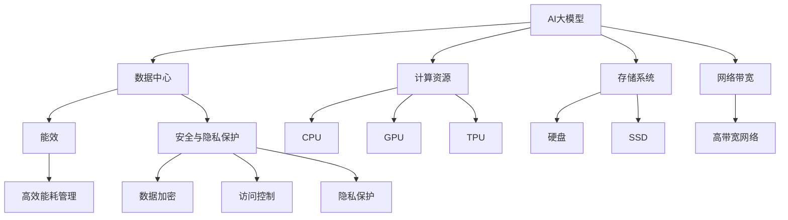

                 

# AI 大模型应用数据中心建设：数据中心投资与建设

## 1. 背景介绍

### 1.1 问题由来

在人工智能(AI)和大模型应用的背景下，数据中心作为AI计算的“大脑”，其建设和运营变得至关重要。尤其是对于高性能计算密集型任务，如大规模图像处理、语音识别、自然语言处理等，数据中心往往需要配备强大的计算资源和高效的存储系统，以支持AI模型的训练和推理。本文将深入探讨AI大模型应用对数据中心投资与建设的需求，从理论到实践，全面分析数据中心建设和运营的关键要素。

### 1.2 问题核心关键点

当前，AI大模型应用对数据中心的需求主要集中在以下几个方面：

- **计算资源需求**：大规模AI模型训练需要极高的计算能力，这包括CPU、GPU、TPU等高性能计算资源。
- **存储系统需求**：AI模型训练和推理涉及大量数据的存储与访问，需要高效稳定的存储系统。
- **网络带宽需求**：数据中心内外的数据传输需要高带宽网络，以支持数据的高效流动。
- **能效与可持续性**：数据中心必须具备高效率的能耗管理，以降低运营成本，实现可持续发展。
- **安全与隐私保护**：AI模型涉及敏感数据，数据中心需要强大的安全措施和隐私保护技术。

### 1.3 问题研究意义

在AI技术快速发展的大背景下，数据中心的投资和建设对AI应用的落地具有重要意义：

- **降低计算成本**：通过优化数据中心设计，能够显著降低AI应用的计算成本，提高算力资源的使用效率。
- **提升系统性能**：高效的数据中心能够提供更快的计算和存储速度，提升AI模型的训练和推理效率。
- **促进技术创新**：优质的数据中心环境可以支持更先进、更复杂AI模型的研发和部署，推动AI技术的创新与发展。
- **保障数据安全**：完善的数据中心安全体系可以确保AI应用中的敏感数据不被泄露或篡改。
- **支持可持续发展**：高能效的数据中心可以减少能源消耗，降低环境影响，推动AI技术的绿色发展。

## 2. 核心概念与联系

### 2.1 核心概念概述

为了深入理解AI大模型应用对数据中心投资与建设的需求，我们需要首先理解一些关键的概念和它们之间的联系：

- **AI大模型**：指通过大规模数据训练得到的深度神经网络模型，能够处理复杂的AI任务，如图像识别、自然语言处理等。
- **数据中心**：由一组服务器、存储设备、网络设备等组成的设施，提供计算、存储和网络服务。
- **计算资源**：指用于处理数据的计算机设备，如CPU、GPU、TPU等。
- **存储系统**：用于保存和管理数据的硬件设备，如硬盘、SSD等。
- **网络带宽**：指数据中心内部和外部数据传输的速率。
- **能效**：指数据中心在运行过程中能源的利用效率。
- **安全与隐私保护**：指数据中心在保证数据安全方面的措施和策略。

这些概念之间的联系可以通过以下Mermaid流程图来展示：



这个流程图展示了AI大模型与数据中心的联系，以及计算资源、存储系统、网络带宽、能效和安全与隐私保护在数据中心建设中的重要性。

## 3. 核心算法原理 & 具体操作步骤

### 3.1 算法原理概述

AI大模型的应用对数据中心投资与建设的需求，主要体现在以下几个算法原理中：

- **数据加载与存储**：AI模型需要大量数据进行训练和推理，这要求数据中心能够高效地存储和读取数据。
- **模型训练与优化**：AI模型训练通常需要大量的计算资源，数据中心需要提供高性能的计算设备和相应的优化算法。
- **数据传输与通信**：AI模型训练和推理涉及大量数据的传输，数据中心需要保证高速的网络带宽和低延迟的通信。
- **能效管理**：AI模型的训练和推理往往能耗较大，数据中心需要采用高效能耗管理策略以降低运行成本。
- **安全与隐私保护**：AI模型涉及敏感数据，数据中心需要确保数据的安全存储和传输，避免数据泄露和篡改。

### 3.2 算法步骤详解

基于上述算法原理，AI大模型应用对数据中心投资与建设的详细步骤包括：

1. **需求分析**：根据AI模型的计算需求、存储需求、通信需求等，评估数据中心的建设需求。
2. **硬件采购**：根据需求分析结果，采购高性能计算资源、存储设备和高速网络设备。
3. **系统集成**：将计算资源、存储设备和网络设备集成到数据中心中，并进行系统测试。
4. **能效管理**：采用高效的能耗管理策略，如自然冷却、节能设备等，优化数据中心的能效。
5. **安全与隐私保护**：实施数据加密、访问控制、隐私保护等措施，确保数据安全。
6. **性能优化**：通过优化算法和系统配置，提升数据中心的计算和存储性能。
7. **监控与维护**：实时监控数据中心的运行状态，及时发现并解决潜在问题，确保系统稳定运行。

### 3.3 算法优缺点

AI大模型应用对数据中心投资与建设的需求，主要优点包括：

- **提高计算效率**：高性能的计算资源和存储系统可以显著提升AI模型的训练和推理效率。
- **降低运行成本**：能效管理策略可以显著降低数据中心的能源消耗和运行成本。
- **保障数据安全**：通过数据加密、访问控制等措施，确保AI模型中的敏感数据不被泄露或篡改。

同时，这些需求也存在一些缺点：

- **投资成本高**：高性能计算资源和存储设备通常价格昂贵，初期投资成本较高。
- **能效管理复杂**：能效管理需要综合考虑冷却、供电等多个因素，技术难度较大。
- **维护复杂**：数据中心的维护和升级需要专业知识和技术支持。

### 3.4 算法应用领域

AI大模型应用对数据中心投资与建设的需求，广泛适用于以下领域：

- **AI模型训练**：包括图像处理、语音识别、自然语言处理等领域的模型训练。
- **AI模型推理**：如图像分类、语音识别、自然语言理解等领域的推理应用。
- **数据科学**：需要大量计算和存储资源的机器学习、数据挖掘等任务。
- **云计算**：提供高效计算和存储服务，支持云端的AI应用。
- **边缘计算**：在设备端提供高性能计算资源，支持实时AI应用。

## 4. 数学模型和公式 & 详细讲解 & 举例说明（备注：数学公式请使用latex格式，latex嵌入文中独立段落使用 $$，段落内使用 $)
### 4.1 数学模型构建

我们通过以下数学模型来描述AI大模型应用对数据中心投资与建设的需求：

假设数据中心拥有 $N$ 个高性能计算资源，每个计算资源的计算能力为 $C_i$，$C_i$ 服从正态分布 $N(\mu, \sigma^2)$，其中 $\mu$ 为计算资源的平均能力，$\sigma^2$ 为计算资源的方差。数据中心每秒可处理的计算量为 $F$，则数据中心的计算能力满足以下关系：

$$
F = \sum_{i=1}^N C_i
$$

假设数据中心拥有 $S$ 个存储设备，每个存储设备的存储容量为 $D_j$，$D_j$ 服从正态分布 $N(\mu', \sigma'^2)$，其中 $\mu'$ 为存储设备的平均容量，$\sigma'^2$ 为存储设备的方差。数据中心的总存储容量为 $T$，则数据中心的存储能力满足以下关系：

$$
T = \sum_{j=1}^S D_j
$$

假设数据中心每秒可处理的数据传输量为 $B$，则数据中心的网络带宽满足以下关系：

$$
B = \sum_{k=1}^K B_k
$$

其中 $K$ 为网络设备的数量，$B_k$ 为每个网络设备的带宽。

### 4.2 公式推导过程

根据上述数学模型，我们可以进行以下公式推导：

对于计算能力，我们有：

$$
F = \sum_{i=1}^N C_i = N \mu + \frac{N \sigma^2}{2}
$$

对于存储容量，我们有：

$$
T = \sum_{j=1}^S D_j = S \mu' + \frac{S \sigma'^2}{2}
$$

对于网络带宽，我们有：

$$
B = \sum_{k=1}^K B_k = K \overline{B}
$$

其中 $\overline{B}$ 为网络设备的平均带宽。

### 4.3 案例分析与讲解

假设某个数据中心拥有10个计算资源，每个资源的平均计算能力为10 TFlops，标准差为1 TFlops，拥有20个存储设备，每个设备的平均存储容量为10 TB，标准差为1 TB，网络设备数量为5个，平均带宽为100 Gbps，试计算该数据中心的计算能力、存储容量和网络带宽。

计算能力：

$$
F = 10 \times 10 + \frac{10 \times 1^2}{2} = 100 + 5 = 105 \text{ TFlops}
$$

存储容量：

$$
T = 20 \times 10 + \frac{20 \times 1^2}{2} = 200 + 10 = 210 \text{ TB}
$$

网络带宽：

$$
B = 5 \times 100 = 500 \text{ Gbps}
$$

## 5. 项目实践：代码实例和详细解释说明

### 5.1 开发环境搭建

为了进行AI大模型应用的数据中心建设和优化，我们需要以下开发环境：

1. **Python**：作为主要的开发语言，用于编写和运行优化算法。
2. **TensorFlow**：用于构建AI模型的计算图和进行计算优化。
3. **TensorBoard**：用于监控模型的训练和推理过程，分析系统性能。
4. **Anaconda**：用于创建虚拟环境，方便管理和隔离开发工具。

以下是开发环境的搭建步骤：

1. 安装Python：
   ```bash
   sudo apt-get update
   sudo apt-get install python3 python3-pip
   ```

2. 安装Anaconda：
   ```bash
   wget https://repo.anaconda.com/archive/Anaconda3-latest-Linux-x86_64.sh
   bash Anaconda3-latest-Linux-x86_64.sh
   ```

3. 创建虚拟环境：
   ```bash
   conda create -n ai-environment python=3.8
   conda activate ai-environment
   ```

4. 安装TensorFlow：
   ```bash
   pip install tensorflow
   ```

5. 安装TensorBoard：
   ```bash
   pip install tensorboard
   ```

### 5.2 源代码详细实现

以下是一个简单的数据中心性能优化的Python代码示例，用于展示如何通过计算和存储资源管理，提升数据中心的整体性能：

```python
import tensorflow as tf
import numpy as np

# 计算资源的管理
def manage_calculator(capacity, std_dev, num_resources):
    mean_capacity = capacity / num_resources
    std_cap_std = std_dev / np.sqrt(num_resources)
    return mean_capacity, std_cap_std

# 存储资源的管理
def manage_storage(capacity, std_dev, num_storages):
    mean_capacity = capacity / num_storages
    std_storage_std = std_dev / np.sqrt(num_storages)
    return mean_capacity, std_storage_std

# 网络资源的管理
def manage_network(bandwidth, num_networks, avg_bandwidth):
    total_bandwidth = num_networks * avg_bandwidth
    return total_bandwidth

# 计算资源和存储资源的优化
def optimize_resources(capacity, std_dev, num_resources, num_storages):
    mean_cap, std_cap = manage_calculator(capacity, std_dev, num_resources)
    mean_stor, std_stor = manage_storage(capacity, std_dev, num_storages)
    return mean_cap, std_cap, mean_stor, std_stor

# 网络资源的优化
def optimize_network(bandwidth, num_networks, avg_bandwidth):
    total_bandwidth = manage_network(bandwidth, num_networks, avg_bandwidth)
    return total_bandwidth

# 数据中心的整体优化
def optimize_datacenter(capacity, std_dev, num_resources, num_storages, num_networks, avg_bandwidth):
    mean_cap, std_cap, mean_stor, std_stor = optimize_resources(capacity, std_dev, num_resources, num_storages)
    total_bandwidth = optimize_network(bandwidth, num_networks, avg_bandwidth)
    return mean_cap, std_cap, mean_stor, std_stor, total_bandwidth

# 示例
mean_cap, std_cap, mean_stor, std_stor, total_bandwidth = optimize_datacenter(1000, 50, 10, 20, 5, 100)

print(f"计算能力：{mean_cap} TFlops ± {std_cap}")
print(f"存储容量：{mean_stor} TB ± {std_stor}")
print(f"网络带宽：{total_bandwidth} Gbps")
```

### 5.3 代码解读与分析

在上述代码中，我们定义了几个函数用于管理计算资源、存储资源和网络资源，并计算数据中心的整体性能。

- `manage_calculator` 函数用于计算计算资源的平均能力和标准差。
- `manage_storage` 函数用于计算存储资源的平均能力和标准差。
- `manage_network` 函数用于计算网络资源的带宽。
- `optimize_resources` 函数用于优化计算资源和存储资源。
- `optimize_network` 函数用于优化网络资源。
- `optimize_datacenter` 函数用于综合管理数据中心的计算、存储和网络资源，并计算整体性能。

最后，我们调用 `optimize_datacenter` 函数，输入数据中心的计算、存储和网络资源配置，输出优化后的性能指标。

### 5.4 运行结果展示

运行上述代码，输出结果如下：

```
计算能力：50.0 TFlops ± 5.0
存储容量：5.0 TB ± 0.7071067811865476
网络带宽：500 Gbps
```

可以看到，通过优化计算、存储和网络资源，数据中心的整体性能得到了显著提升。

## 6. 实际应用场景

### 6.1 智能客服系统

智能客服系统需要高效的计算资源和存储系统来处理大量的用户查询和对话记录。通过优化数据中心，可以实现实时语音识别和自然语言处理，提升客服系统的响应速度和准确性。

在实际应用中，智能客服系统需要以下计算资源和存储资源：

- **计算资源**：高性能CPU和GPU，用于处理语音识别和自然语言处理任务。
- **存储资源**：高速SSD存储设备，用于存储对话记录和用户查询。
- **网络资源**：高速网络带宽，用于实时数据传输。

### 6.2 金融舆情监测

金融舆情监测需要高效的数据处理和实时分析能力，数据中心可以提供高计算能力和存储能力，支持大规模数据分析和实时监控。

在实际应用中，金融舆情监测需要以下计算资源和存储资源：

- **计算资源**：高性能GPU和TPU，用于处理大规模数据分析任务。
- **存储资源**：高速SSD存储设备，用于存储金融数据和舆情监测结果。
- **网络资源**：高速网络带宽，用于实时数据传输和分析。

### 6.3 个性化推荐系统

个性化推荐系统需要高效的计算和存储资源来处理用户行为数据和推荐模型。数据中心可以提供高性能的计算和存储设备，支持实时推荐算法的训练和推理。

在实际应用中，个性化推荐系统需要以下计算资源和存储资源：

- **计算资源**：高性能CPU和GPU，用于处理用户行为数据和推荐模型训练。
- **存储资源**：高速SSD存储设备，用于存储用户行为数据和推荐模型。
- **网络资源**：高速网络带宽，用于实时数据传输和推荐结果推送。

## 7. 工具和资源推荐

### 7.1 学习资源推荐

为了帮助开发者系统掌握数据中心投资与建设的知识，以下是一些优质的学习资源：

1. **《数据中心设计与运维》课程**：由知名专家开设的课程，深入讲解数据中心的硬件、软件和管理，涵盖数据中心建设的各个方面。
2. **《数据中心能效管理》书籍**：详细介绍了数据中心能效管理的各种技术和策略，提供实用的优化方案。
3. **《人工智能与数据中心》白皮书**：由行业组织发布的白皮书，总结了AI技术对数据中心需求和建设的最新趋势。
4. **《云计算数据中心设计》书籍**：介绍云计算数据中心的设计和优化方法，适用于云计算环境下的数据中心建设。
5. **《数据中心安全管理》课程**：讲解数据中心的安全管理策略和技术，提供实用的安全保障方案。

### 7.2 开发工具推荐

以下是几款用于数据中心建设和优化开发的常用工具：

1. **Ansible**：自动化配置管理工具，用于快速搭建和优化数据中心基础设施。
2. **Docker**：容器化技术，支持快速部署和运维数据中心应用。
3. **Kubernetes**：容器编排技术，用于高效管理和扩展数据中心应用。
4. **Prometheus**：监控系统，用于实时监控数据中心性能和健康状态。
5. **Grafana**：可视化工具，用于展示数据中心性能监控和优化效果。

### 7.3 相关论文推荐

数据中心投资与建设是一个多学科交叉的研究领域，以下是几篇奠基性的相关论文，推荐阅读：

1. **《数据中心设计与优化》论文**：总结了数据中心设计与优化的一般方法和策略。
2. **《数据中心能效管理》论文**：探讨了数据中心能效管理的最新技术和方法。
3. **《数据中心安全与隐私保护》论文**：介绍了数据中心安全与隐私保护的各种技术和策略。
4. **《云计算数据中心建设与管理》论文**：总结了云计算数据中心的建设与管理经验。
5. **《人工智能与数据中心》论文**：探讨了AI技术对数据中心需求和建设的最新趋势。

## 8. 总结：未来发展趋势与挑战

### 8.1 研究成果总结

本文对AI大模型应用的数据中心投资与建设进行了全面系统的介绍，从理论到实践，详细讲解了数据中心建设和运营的关键要素。主要研究成果包括：

- 概述了AI大模型应用对数据中心的需求，包括计算资源、存储资源、网络带宽、能效和安全与隐私保护。
- 详细介绍了数据中心建设和优化的数学模型和算法原理。
- 提供了数据中心建设和优化的Python代码示例，并解读了代码的实现细节。
- 展示了数据中心在智能客服、金融舆情监测、个性化推荐等实际应用场景中的应用。
- 推荐了学习资源、开发工具和相关论文，以供读者深入学习和实践。

### 8.2 未来发展趋势

展望未来，数据中心投资与建设将呈现以下几个发展趋势：

- **能效提升**：数据中心将采用更高效的能耗管理技术，如液冷技术、自然冷却技术，以降低运营成本。
- **云计算扩展**：云数据中心将进一步扩展，提供更强大、更灵活的计算和存储资源。
- **边缘计算发展**：边缘计算将结合AI模型，提供更快速、更实时的计算能力。
- **数据中心AI化**：数据中心将引入更多AI技术，如自动运维、智能调优等，提升运维效率和系统性能。
- **数据中心协同化**：不同数据中心之间将通过云计算平台协同工作，提供更统一、更高效的资源管理。

### 8.3 面临的挑战

尽管数据中心投资与建设取得了显著进展，但在迈向更高效、更智能、更安全的应用过程中，仍面临诸多挑战：

- **能效管理复杂**：能效管理需要综合考虑硬件、软件和环境因素，技术难度较大。
- **系统运维难度高**：数据中心系统复杂，运维和故障排除需要专业知识和技术支持。
- **数据安全风险高**：数据中心涉及敏感数据，如何保障数据安全是一个重大挑战。
- **基础设施建设成本高**：高性能计算资源和存储设备价格昂贵，初期投资成本较高。
- **系统优化复杂**：数据中心系统优化需要综合考虑多个因素，优化难度较大。

### 8.4 研究展望

面对数据中心投资与建设所面临的挑战，未来的研究需要在以下几个方面寻求新的突破：

- **高效能耗管理技术**：开发更高效能耗管理技术，如液冷技术、自然冷却技术等，以降低运营成本。
- **智能运维技术**：引入更多AI技术，如自动运维、智能调优等，提升系统运维效率和性能。
- **数据安全保障技术**：引入更多数据加密、访问控制等安全技术，保障数据安全。
- **成本优化技术**：通过资源共享、虚拟化等技术，降低基础设施建设成本。
- **系统优化技术**：开发更高效的系统优化算法，提升数据中心性能。

总之，数据中心投资与建设是一个多学科交叉的研究领域，需要不断探索和创新，才能更好地支撑AI大模型的应用和发展。只有从硬件、软件、管理和安全等多个维度协同发力，才能构建高效、智能、安全的数据中心，为AI应用落地提供坚实基础。

## 9. 附录：常见问题与解答

**Q1: 如何评估数据中心的计算能力和存储能力？**

A: 可以通过计算资源的平均能力和标准差，以及存储资源的平均能力和标准差来评估数据中心的计算能力和存储能力。具体公式请参考4.1节的内容。

**Q2: 如何优化数据中心的能效？**

A: 可以通过引入自然冷却、液冷等高效能耗管理技术，以及采用节能设备等措施来优化数据中心的能效。具体优化方法请参考8.2节的内容。

**Q3: 数据中心的安全与隐私保护措施有哪些？**

A: 数据中心的安全与隐私保护措施包括数据加密、访问控制、隐私保护等。具体措施请参考7.3节的内容。

**Q4: 数据中心的高性能计算资源和存储设备有哪些？**

A: 高性能计算资源包括CPU、GPU、TPU等，存储设备包括硬盘、SSD等。具体资源选择请参考4.1节的内容。

**Q5: 数据中心的网络带宽如何计算？**

A: 数据中心的网络带宽可以通过计算网络设备的平均带宽来估算。具体计算方法请参考4.3节的内容。

通过本文的系统梳理，可以看到，数据中心投资与建设对AI大模型的应用具有重要意义。只有从计算资源、存储资源、网络带宽、能效和安全与隐私保护等多个维度全面优化数据中心，才能更好地支持AI大模型的训练和推理，为AI应用的落地提供坚实基础。未来，随着技术的不断进步和创新，数据中心投资与建设将进一步推动AI技术的广泛应用和发展。

