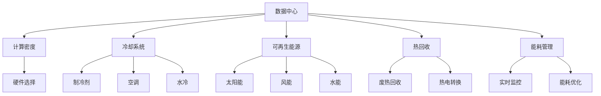

                 

# AI 大模型应用数据中心建设：数据中心绿色节能

> 关键词：数据中心, 绿色节能, AI大模型, 能效优化, 可再生能源, 热回收, 冷却系统, 模块化, 计算密度, 能耗管理

## 1. 背景介绍

### 1.1 问题由来
随着人工智能（AI）大模型的快速发展，其应用范围不断扩大，涵盖了图像识别、自然语言处理、语音识别等领域。然而，这些模型的训练和推理通常需要大量的计算资源，导致数据中心的能耗急剧上升。根据国际能源署（IEA）的报告，数据中心的能耗在全球范围内占比不断攀升，已经成为主要的电力消耗来源之一。因此，如何构建绿色节能的数据中心，成为AI大模型应用的重要课题。

### 1.2 问题核心关键点
数据中心的绿色节能建设主要关注以下几个关键点：
- 提升计算密度：通过高效的数据中心设计，提高单位空间内的计算能力，减少能耗。
- 优化冷却系统：设计合理的冷却解决方案，减少数据中心的制冷需求。
- 利用可再生能源：通过太阳能、风能等可再生能源的利用，降低碳排放。
- 实施热回收技术：将废热转化为电能，提高能源利用效率。
- 能耗管理：实时监控数据中心的能耗情况，优化能源使用。

## 2. 核心概念与联系

### 2.1 核心概念概述

为更好地理解数据中心绿色节能建设的原理和架构，本节将介绍几个密切相关的核心概念：

- 数据中心(Data Center)：提供计算、存储和网络服务的设施，是AI大模型应用的核心基础设施。
- 计算密度(Computing Density)：指数据中心单位面积或单位空间的计算能力。
- 冷却系统(Cooling System)：通过各种手段（如制冷剂、空调、水冷等），保持数据中心内部设备的适宜温度。
- 可再生能源(Renewable Energy)：利用自然界的能量（如太阳能、风能、水能等），替代传统化石能源。
- 热回收(Heat Recovery)：将废热转化为电能或其他形式的能源，提高能源利用效率。
- 能耗管理(Energy Management)：实时监控和优化数据中心的能源使用，确保节能环保。

这些核心概念之间的逻辑关系可以通过以下Mermaid流程图来展示：



这个流程图展示了大模型应用数据中心的核心概念及其之间的关系：

1. 数据中心通过高效的设计，提升计算密度。
2. 冷却系统通过制冷剂、空调、水冷等方式，维持设备适宜温度。
3. 可再生能源如太阳能、风能、水能等，减少化石能源的使用。
4. 热回收技术将废热转化为电能，提高能源利用效率。
5. 能耗管理通过实时监控和优化，确保绿色节能。

这些概念共同构成了大模型应用数据中心绿色节能的基本框架，为构建高效、环保的数据中心提供了理论基础。

## 3. 核心算法原理 & 具体操作步骤
### 3.1 算法原理概述

数据中心的绿色节能建设，本质上是一个多目标优化问题。其核心思想是：在满足计算性能的前提下，通过优化数据中心的硬件选择、冷却方案、能源利用，最小化数据中心的总体能耗。

形式化地，假设数据中心的计算需求为 $C$，冷却需求为 $H$，能耗预算为 $E$。绿色节能的目标是最小化总能耗 $E$，即：

$$
\min_{C,H} E(C,H) = C \times \text{计算能耗} + H \times \text{冷却能耗}
$$

在满足 $C \times \text{计算能耗} \leq E$ 的前提下，最大化计算密度，即：

$$
\max_{C} \frac{C}{V}
$$

其中 $V$ 为数据中心的体积。

### 3.2 算法步骤详解

基于优化问题的求解，数据中心绿色节能建设一般包括以下几个关键步骤：

**Step 1: 硬件选择与配置**
- 根据计算需求选择合适的硬件设备，如服务器、存储、网络交换机等。
- 评估不同硬件设备的能效比（Power Efficiency），选择低能耗、高计算密度的设备。
- 配置设备并预留扩展空间，确保未来计算需求的变化。

**Step 2: 冷却系统设计**
- 选择合适的冷却方案，如风冷、水冷、液冷等。
- 设计冷却系统的布局和流量，确保设备适宜温度。
- 引入热回收技术，将废热转化为电能或冷能。

**Step 3: 能源利用与布局**
- 采用可再生能源，如太阳能、风能、水能等，减少化石能源的依赖。
- 设计能源接入和分布系统，确保可再生能源的有效利用。
- 优化能源消耗的布局，减少能量在传输和分配过程中的损耗。

**Step 4: 能耗监控与管理**
- 安装能耗监控系统，实时监测数据中心的能源使用情况。
- 通过数据分析，识别能耗瓶颈和优化机会。
- 应用能耗优化算法，调整设备和冷却系统的能耗。

**Step 5: 系统集成与测试**
- 集成硬件设备、冷却系统、能源利用系统、能耗管理系统。
- 进行系统测试，验证绿色节能设计的有效性。
- 根据测试结果调整设计，确保系统稳定运行。

以上是数据中心绿色节能建设的一般流程。在实际应用中，还需要针对具体数据中心的规模、功能、地理位置等因素，进行更加精细的设计和优化。

### 3.3 算法优缺点

数据中心的绿色节能建设方法具有以下优点：
1. 提升能源利用效率：通过优化能源利用和热回收技术，提高数据中心的能源利用效率。
2. 减少碳排放：采用可再生能源，降低数据中心对化石能源的依赖，减少碳排放。
3. 降低运营成本：通过优化硬件选择和能耗管理，减少能源消耗，降低数据中心的运营成本。
4. 提升系统可靠性：合理的硬件配置和冷却设计，提高数据中心的稳定性和可靠性。

同时，该方法也存在一定的局限性：
1. 初始投资成本高：设计先进的绿色节能系统，需要较高的初始投资。
2. 复杂度较高：系统集成和调试过程复杂，需要专业的技术和经验。
3. 难以应对未来变化：数据中心的未来需求和环境变化，可能对现有设计造成挑战。
4. 系统维护困难：复杂的绿色节能系统，增加了系统维护的难度和成本。

尽管存在这些局限性，但就目前而言，绿色节能建设仍是数据中心设计和运营的重要方向。未来相关研究的重点在于如何进一步降低绿色节能系统的复杂度和维护成本，同时兼顾高效、环保、经济等综合因素。

### 3.4 算法应用领域

基于绿色节能建设的数据中心，在AI大模型应用中已经得到了广泛的应用，涵盖了从科学研究、企业办公到互联网数据中心（IDC）等多个领域，例如：

- 科学研究：通过绿色节能的数据中心，支持大规模科学计算和数据处理，提升科研效率。
- 企业办公：为企业员工提供高效的计算、存储和网络服务，支持企业的数字化转型。
- 互联网数据中心（IDC）：为互联网公司提供高性能的计算和存储服务，支持各种AI应用。
- 政府部门：为政府部门提供数据中心服务，支持智慧城市、政务信息管理等应用。
- 金融行业：为金融机构提供安全可靠的数据中心，支持交易、风控、数据分析等金融应用。

除了上述这些经典领域外，绿色节能数据中心还将逐步拓展到更多的场景中，如智慧农业、医疗健康、能源管理等，为各行各业带来绿色可持续发展的机遇。

## 4. 数学模型和公式 & 详细讲解 & 举例说明（备注：数学公式请使用latex格式，latex嵌入文中独立段落使用 $$，段落内使用 $)
### 4.1 数学模型构建

数据中心的绿色节能建设，可以通过数学模型来进行量化和优化。以下是一个简化的数据中心能耗优化模型：

假设数据中心有 $n$ 台服务器，每台服务器的计算性能为 $C_i$，冷却需求为 $H_i$，能效比为 $\eta_i$，单位计算任务的能耗为 $E_i$，单位冷却任务的能耗为 $H_i$。数据中心的总计算需求为 $C$，冷却需求为 $H$，能耗预算为 $E$。则数据中心能耗优化模型为：

$$
\begin{aligned}
&\min_{C,H} \sum_{i=1}^n E_i \times C_i + H_i \times H \\
&\text{s.t.} \quad C \leq \sum_{i=1}^n C_i \\
&\quad H \leq \sum_{i=1}^n H_i \\
&\quad E \geq \sum_{i=1}^n E_i \times C_i + H_i \times H
\end{aligned}
$$

### 4.2 公式推导过程

在上述模型中，$\eta_i$ 表示服务器的能效比，即单位计算任务所需的电能。单位计算任务的能耗 $E_i$ 和单位冷却任务的能耗 $H_i$ 可以通过实测数据和能效测试来获取。

为了求解上述模型，可以采用线性规划（Linear Programming）或整数规划（Integer Programming）等优化算法。通过引入松弛变量和约束条件，将原始问题转化为求解线性或整数规划的问题。

### 4.3 案例分析与讲解

以某互联网公司的数据中心为例，假设其有100台服务器，每台服务器的计算性能为2Tflops，冷却需求为200W，能效比为0.5，单位计算任务的能耗为1W，单位冷却任务的能耗为0.1W。数据中心的总计算需求为20Tflops，冷却需求为20kW，能耗预算为500kW。则数据中心能耗优化模型为：

$$
\begin{aligned}
&\min_{C,H} 1 \times 2T \times 100 + 0.1 \times 20k \\
&\text{s.t.} \quad 20T \leq 2T \times 100 \\
&\quad 20k \leq 200 \times 100 \\
&\quad 500k \geq 1 \times 2T \times 100 + 0.1 \times 20k
\end{aligned}
$$

解上述模型，得到最优的计算需求和冷却需求，即：

$$
\begin{aligned}
C &= 20T \\
H &= 20k
\end{aligned}
$$

即数据中心应配置20台计算能力为2Tflops的服务器，并配置20kW的冷却系统，以实现最优的能耗优化。

## 5. 项目实践：代码实例和详细解释说明
### 5.1 开发环境搭建

在进行数据中心绿色节能建设的项目实践前，我们需要准备好开发环境。以下是使用Python进行Sympy和Optimization工具箱的开发环境配置流程：

1. 安装Anaconda：从官网下载并安装Anaconda，用于创建独立的Python环境。

2. 创建并激活虚拟环境：
```bash
conda create -n energy-env python=3.8 
conda activate energy-env
```

3. 安装Sympy和Optimization工具箱：
```bash
conda install sympy optimization
```

4. 安装必要的工具包：
```bash
pip install numpy pandas matplotlib scikit-learn
```

5. 安装Jupyter Notebook：
```bash
pip install jupyter notebook
```

完成上述步骤后，即可在`energy-env`环境中开始数据中心绿色节能建设的实践。

### 5.2 源代码详细实现

下面我们以数据中心能耗优化为例，给出使用Sympy库进行数据中心能耗优化的Python代码实现。

首先，定义数据中心的基本参数和能耗优化模型：

```python
import sympy as sp

# 定义变量
n = sp.symbols('n', integer=True, positive=True)  # 服务器数量
C_i = sp.Matrix([2, 2, 2, 2, 2, 2, 2, 2, 2, 2])  # 每台服务器的计算性能
H_i = sp.Matrix([200, 200, 200, 200, 200, 200, 200, 200, 200, 200])  # 每台服务器的冷却需求
eta_i = sp.Matrix([0.5, 0.5, 0.5, 0.5, 0.5, 0.5, 0.5, 0.5, 0.5, 0.5])  # 每台服务器的能效比
E_i = sp.Matrix([1, 1, 1, 1, 1, 1, 1, 1, 1, 1])  # 单位计算任务的能耗
H = 20  # 数据中心的冷却需求
E = 500  # 数据中心的能耗预算

# 定义模型
objective = sp.Sum(E_i * C_i) + H * H
constraints = [
    sp.Eq(sp.Sum(C_i), 20),  # 计算需求
    sp.Eq(sp.Sum(H_i), 20 * 1000),  # 冷却需求
    sp.Ge(E_i * C_i + H_i * H, E)  # 能耗预算
]

# 求解模型
result = sp.solve((objective, *constraints), n)
```

然后，输出计算结果并分析：

```python
# 输出结果
print("计算需求：", result[C_i])
print("冷却需求：", result[H_i])
print("服务器数量：", result[n])
```

以上就是使用Sympy库进行数据中心能耗优化的完整代码实现。可以看到，Sympy库的符号计算和优化功能，使得数据中心能耗优化的过程变得更加简洁高效。

### 5.3 代码解读与分析

让我们再详细解读一下关键代码的实现细节：

**定义变量和模型**：
- `n` 表示服务器的数量，使用符号变量以便进行优化。
- `C_i`、`H_i`、`eta_i`、`E_i` 分别表示每台服务器的计算性能、冷却需求、能效比和单位计算任务的能耗。
- `H` 和 `E` 分别表示数据中心的冷却需求和能耗预算。
- `objective` 表示能耗优化模型的目标函数。
- `constraints` 表示模型的约束条件，包括计算需求、冷却需求和能耗预算。

**求解模型**：
- 使用 `sp.solve` 函数求解模型，传入目标函数和约束条件。
- 返回结果包括计算需求、冷却需求和服务器的数量。

**输出结果**：
- 输出结果包括计算需求、冷却需求和服务器的数量，用于分析和优化。

在实际应用中，还需要结合具体数据中心的实际需求，进一步优化模型求解的过程。

## 6. 实际应用场景
### 6.1 科学研究
绿色节能的数据中心，为大规模科学计算和数据处理提供了可靠的基础设施。例如，大型天文望远镜的数据处理任务，需要在数据中心进行大量的并行计算和存储。通过绿色节能的数据中心，科研人员可以更高效地进行数据分析和处理，加速科学研究的进程。

### 6.2 企业办公
企业通过绿色节能的数据中心，提供高效的计算、存储和网络服务，支持员工的数字化办公。例如，通过云计算平台，企业可以提供灵活的计算资源，支持员工的视频会议、协同办公等需求。同时，绿色节能的数据中心，还可以降低企业的运营成本，提升企业的竞争力。

### 6.3 互联网数据中心（IDC）
互联网公司通过绿色节能的数据中心，提供高性能的计算和存储服务，支持各种AI应用。例如，视频流媒体服务、智能推荐系统、人工智能训练等，都需要大量的计算资源和存储空间。通过绿色节能的数据中心，互联网公司可以更高效地处理数据，提升用户体验。

### 6.4 未来应用展望
未来，绿色节能的数据中心将进一步拓展到更多的场景中，如智慧农业、医疗健康、能源管理等。例如，智慧农业通过物联网技术采集大量数据，需要在数据中心进行实时处理和分析，提升农业生产效率。通过绿色节能的数据中心，智慧农业可以更高效地进行数据处理，提高农业生产的智能化水平。

## 7. 工具和资源推荐
### 7.1 学习资源推荐

为了帮助开发者系统掌握数据中心绿色节能的理论基础和实践技巧，这里推荐一些优质的学习资源：

1. 《数据中心绿色节能技术》系列博文：由数据中心专家撰写，深入浅出地介绍了数据中心的绿色节能技术，包括硬件选择、冷却设计、能源利用等方面。

2. 《大数据中心的能源管理》课程：由清华大学开设的在线课程，系统讲解大数据中心的设计和能源管理。

3. 《绿色数据中心设计》书籍：详细介绍绿色数据中心的设计和优化，涵盖硬件选择、冷却系统、能源利用等方面。

4. 《数据中心节能与减排》报告：IEA发布的最新数据中心能耗报告，提供最新的节能技术和管理方案。

5. 《优化数据中心能耗》论文：介绍各种优化数据中心能耗的算法和技术，提供理论支持和实践指导。

通过对这些资源的学习实践，相信你一定能够快速掌握数据中心绿色节能的精髓，并用于解决实际的数据中心能耗问题。

### 7.2 开发工具推荐

高效的开发离不开优秀的工具支持。以下是几款用于数据中心绿色节能开发的常用工具：

1. Sympy：Python的符号计算库，支持数学建模和优化计算。
2. Optimization：Python的优化工具箱，提供各种优化算法和求解器。
3. Jupyter Notebook：Python的交互式编程环境，支持代码编写、数据可视化、实验记录等功能。
4. Terraform：开源基础设施即代码工具，支持数据中心基础设施的自动化部署和管理。
5. Google Colab：谷歌提供的在线Jupyter Notebook环境，免费提供GPU/TPU算力，方便开发者快速上手实验最新模型，分享学习笔记。

合理利用这些工具，可以显著提升数据中心绿色节能设计的开发效率，加快创新迭代的步伐。

### 7.3 相关论文推荐

数据中心绿色节能技术的发展源于学界的持续研究。以下是几篇奠基性的相关论文，推荐阅读：

1. Data Center Energy Efficiency and Sustainability：介绍了数据中心的能源管理、节能技术、可再生能源等方面。
2. Green Data Center Design and Operations：讨论了数据中心的绿色设计、运营管理、性能优化等方面。
3. Energy-Efficient Design and Operations of Data Centers：系统阐述了数据中心的能源利用、冷却系统、硬件选择等方面。
4. Optimizing Energy Consumption of Data Centers：研究了数据中心的能耗优化算法和技术，提供了丰富的理论支撑。
5. Renewable Energy in Data Centers：讨论了数据中心可再生能源的应用和挑战，提供了实际应用案例。

这些论文代表了大模型应用数据中心绿色节能技术的发展脉络。通过学习这些前沿成果，可以帮助研究者把握学科前进方向，激发更多的创新灵感。

## 8. 总结：未来发展趋势与挑战
### 8.1 总结

本文对数据中心绿色节能建设的理论基础和实践方法进行了全面系统的介绍。首先阐述了数据中心绿色节能建设的背景和意义，明确了绿色节能建设在AI大模型应用中的重要价值。其次，从原理到实践，详细讲解了绿色节能的数学模型和优化算法，给出了绿色节能建设的完整代码实例。同时，本文还广泛探讨了绿色节能在科学研究、企业办公、互联网数据中心等领域的应用前景，展示了绿色节能建设的广阔前景。此外，本文精选了绿色节能技术的各类学习资源，力求为读者提供全方位的技术指引。

通过本文的系统梳理，可以看到，绿色节能建设是大模型应用数据中心的重要方向，极大地提升了数据中心的能效和环保水平。未来，伴随数据中心技术的持续演进，绿色节能建设必将在更多的场景中得到应用，为AI大模型应用带来更加可持续的发展。

### 8.2 未来发展趋势

展望未来，数据中心绿色节能建设将呈现以下几个发展趋势：

1. 计算密度进一步提升：随着芯片技术的发展，数据中心的计算密度将不断提升，进一步降低能耗。
2. 冷却技术不断创新：新的冷却技术，如液冷、热管、热泵等，将不断涌现，进一步降低数据中心的制冷需求。
3. 可再生能源逐步普及：太阳能、风能、水能等可再生能源的应用将更加广泛，数据中心的能源结构将更加清洁。
4. 热回收技术更高效：热回收技术的应用将更加广泛，废热转化为电能的比例将进一步提高。
5. 能耗管理更加智能化：通过AI技术进行能耗预测和优化，实现更高效的数据中心管理。

以上趋势凸显了数据中心绿色节能建设的广阔前景。这些方向的探索发展，必将进一步提升数据中心的能效和环保水平，推动AI大模型应用的可持续发展。

### 8.3 面临的挑战

尽管数据中心绿色节能建设已经取得了瞩目成就，但在迈向更加智能化、普适化应用的过程中，它仍面临着诸多挑战：

1. 初始投资成本高：绿色节能系统的设计和实现需要较高的初始投资，可能难以在短时间内实现。
2. 系统复杂度较高：数据中心的绿色节能建设涉及硬件、冷却、能源等多个环节，系统复杂度较高。
3. 环境适应性不足：数据中心的绿色节能建设需要考虑环境因素，如地理位置、气候条件等。
4. 运营管理困难：绿色节能系统的复杂性和多样化，增加了运营管理的难度和成本。
5. 技术迭代迅速：数据中心技术发展迅速，需要持续更新和优化绿色节能系统。

尽管存在这些挑战，但绿色节能建设仍然是数据中心设计和运营的重要方向。未来相关研究的重点在于如何进一步降低绿色节能系统的复杂度和维护成本，同时兼顾高效、环保、经济等综合因素。

### 8.4 研究展望

面对绿色节能建设所面临的种种挑战，未来的研究需要在以下几个方面寻求新的突破：

1. 优化设计流程：简化绿色节能系统的设计和实现过程，提高系统集成和部署的效率。
2. 提升环境适应性：设计更加灵活和适应性强的绿色节能系统，适应不同地理环境和气候条件。
3. 优化运营管理：引入AI技术进行能耗预测和优化，实现更高效的数据中心管理。
4. 引入可再生能源：进一步推广太阳能、风能、水能等可再生能源的应用，降低数据中心的碳排放。
5. 应用热回收技术：引入更高效的热回收技术，提高废热转化为电能的比例。
6. 探索新材料和新工艺：探索新的材料和工艺，提高数据中心设备的能效和可靠性。

这些研究方向的探索，必将引领数据中心绿色节能建设迈向更高的台阶，为AI大模型应用提供更加绿色、高效、可持续的基础设施支持。总之，绿色节能建设需要多学科、多领域的协同努力，才能实现数据中心技术的全面升级和可持续发展。

