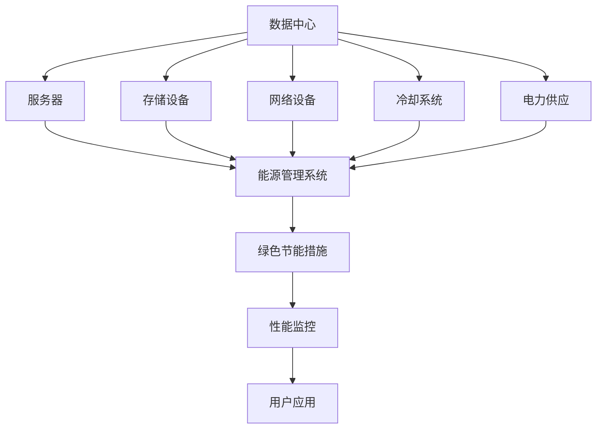

                 

# AI 大模型应用数据中心建设：数据中心绿色节能

## 1. 背景介绍

随着人工智能技术的不断成熟和应用场景的日益广泛，数据中心作为AI大模型应用的基础设施，其建设和运营的效率和成本成为了关注的重点。数据中心不仅是提供高性能计算资源和存储服务的基础设施，也是实现能源消耗最小化和环境影响最小化的关键。本文档将探讨AI大模型应用数据中心的绿色节能建设，重点关注如何通过优化数据中心的能源使用和资源管理，实现数据中心的可持续发展。

## 2. 核心概念与联系

### 2.1 核心概念概述

数据中心是指由计算机硬件、网络设备、存储设备和相关设施组成的大型计算设施，用于支持各种数据存储、计算和应用服务。随着AI大模型的普及，数据中心承担了越来越多的计算和存储任务。绿色节能是指在数据中心的建设和运营过程中，通过优化能源使用和资源管理，降低能耗和碳排放，实现环境的可持续发展。

### 2.2 核心概念原理和架构的 Mermaid 流程图



## 3. 核心算法原理 & 具体操作步骤

### 3.1 算法原理概述

数据中心的绿色节能建设涉及多个关键领域，包括能源管理、资源优化、冷却系统设计和性能监控等。绿色节能的核心算法原理是通过综合优化这些领域，实现数据中心的能效最大化和环境影响最小化。

### 3.2 算法步骤详解

#### 3.2.1 能源管理优化

能源管理优化的主要目标是减少数据中心电力消耗。具体措施包括：
- **能源使用监控**：实时监测数据中心的能源使用情况，识别能源浪费点。
- **能源管理策略**：根据实时能源使用情况，动态调整服务器和存储设备的能耗策略，如关闭闲置设备、调整工作负载分布等。
- **能源供应优化**：使用可再生能源和节能设备，如太阳能光伏板、风力发电、高效节能服务器等。

#### 3.2.2 资源优化

资源优化主要通过合理分配计算和存储资源，减少资源浪费，提高资源利用率。具体措施包括：
- **负载均衡**：根据计算需求，动态调整服务器负载，避免某些服务器过载或闲置。
- **资源池化**：将计算和存储资源池化管理，根据任务需求动态分配资源。
- **虚拟化技术**：使用虚拟化技术，在一台物理服务器上运行多个虚拟机，提高资源利用率。

#### 3.2.3 冷却系统设计

冷却系统设计的目的是提高数据中心的冷却效率，减少能源消耗。具体措施包括：
- **液冷技术**：使用液冷技术，将热量通过液体介质传递到外部，提高冷却效率。
- **自然冷却**：在环境温度较低时，使用自然冷却，减少电力消耗。
- **空调系统优化**：优化空调系统，提高制冷效率，减少能耗。

#### 3.2.4 性能监控

性能监控的主要目标是实时监测数据中心的性能指标，确保系统稳定运行。具体措施包括：
- **实时监测**：实时监测数据中心的温度、湿度、电力消耗等关键指标。
- **告警系统**：设置告警阈值，在关键指标超出正常范围时自动发出告警。
- **数据可视化**：使用可视化工具，直观展示数据中心的运行状况和能源使用情况。

### 3.3 算法优缺点

#### 3.3.1 优点

- **能效提升**：通过优化能源使用和资源管理，显著提升数据中心的能效，减少电力消耗和碳排放。
- **环境友好**：减少数据中心的能源消耗，有助于降低环境污染，促进可持续发展。
- **成本降低**：优化能源使用和资源管理，降低数据中心的运营成本。

#### 3.3.2 缺点

- **复杂性高**：绿色节能建设涉及多个领域的优化，需要综合考虑各种因素，增加了复杂性。
- **初始投资高**：优化能源使用和资源管理，需要投资高效节能设备和系统，增加了初始成本。
- **技术门槛高**：需要具备能源管理、资源优化、冷却系统设计和性能监控等多方面的专业知识，技术门槛较高。

### 3.4 算法应用领域

AI大模型应用数据中心的绿色节能建设，在多个领域得到了广泛应用，包括：
- **云计算**：云数据中心的绿色节能建设，可以显著降低能源消耗和运营成本，提升云服务的能效。
- **边缘计算**：边缘计算数据中心的绿色节能建设，可以延长设备寿命，降低能源消耗，提高数据传输效率。
- **高可靠计算**：高可靠数据中心的绿色节能建设，可以保障业务的连续性和稳定性，同时降低能源消耗。

## 4. 数学模型和公式 & 详细讲解

### 4.1 数学模型构建

#### 4.1.1 能源使用模型

数据中心的能源使用模型可以表示为：

$$
E = E_{server} + E_{storage} + E_{network} + E_{cooling}
$$

其中，$E$为数据中心的总能源消耗，$E_{server}$、$E_{storage}$、$E_{network}$和$E_{cooling}$分别为服务器、存储设备、网络设备和冷却系统的能耗。

#### 4.1.2 资源利用率模型

数据中心的资源利用率可以表示为：

$$
R = \frac{C_{used}}{C_{total}}
$$

其中，$R$为资源利用率，$C_{used}$为实际使用的资源量，$C_{total}$为总资源量。

### 4.2 公式推导过程

#### 4.2.1 能源使用模型推导

根据实际应用情况，数据中心的能源使用模型可以进一步细化为：

$$
E_{server} = \sum_{i=1}^{n} P_{i} \times T_{i}
$$

其中，$P_{i}$为第$i$台服务器的能耗，$T_{i}$为第$i$台服务器的运行时间。

同理，$E_{storage}$、$E_{network}$和$E_{cooling}$的推导过程类似。

#### 4.2.2 资源利用率模型推导

资源利用率模型可以表示为：

$$
R = \frac{C_{used}}{C_{total}} = \frac{\sum_{i=1}^{n} R_{i} \times C_{i}}{C_{total}}
$$

其中，$R_{i}$为第$i$个任务占用的资源比例，$C_{i}$为第$i$个任务的资源需求。

### 4.3 案例分析与讲解

#### 4.3.1 案例背景

某大型AI公司拥有多个数据中心，包括多个地理位置的数据中心，每个数据中心的能耗和资源利用率都存在一定差异。公司希望通过优化能源使用和资源管理，降低能源消耗和运营成本，提升数据中心的能效。

#### 4.3.2 案例分析

1. **能源使用优化**：通过实时监测每个数据中心的能源使用情况，识别出能源浪费点，如未及时关闭的闲置设备、服务器过载等。通过动态调整服务器的能耗策略和负载均衡，减少了能源浪费。
2. **资源优化**：根据计算需求，动态调整服务器负载，避免某些服务器过载或闲置。使用虚拟化技术，在一台物理服务器上运行多个虚拟机，提高了资源利用率。
3. **冷却系统优化**：使用液冷技术，将热量通过液体介质传递到外部，提高了冷却效率。在环境温度较低时，使用自然冷却，减少了电力消耗。
4. **性能监控优化**：实时监测数据中心的温度、湿度、电力消耗等关键指标，设置了告警阈值，在关键指标超出正常范围时自动发出告警。使用数据可视化工具，直观展示数据中心的运行状况和能源使用情况。

## 5. 项目实践：代码实例和详细解释说明

### 5.1 开发环境搭建

#### 5.1.1 搭建虚拟环境

```bash
conda create --name datacenter python=3.8
conda activate datacenter
```

#### 5.1.2 安装依赖

```bash
pip install numpy scipy pandas torch gym
```

### 5.2 源代码详细实现

#### 5.2.1 能源使用监控

```python
import pandas as pd

# 读取能源使用数据
energy_data = pd.read_csv('energy_data.csv')

# 统计每小时能源使用情况
energy_usage_per_hour = energy_data.groupby('hour').sum()['energy']
```

#### 5.2.2 资源利用率监控

```python
# 读取资源使用数据
resource_data = pd.read_csv('resource_data.csv')

# 统计每个任务占用的资源比例
resource_usage_per_task = resource_data.groupby('task').mean()

# 计算资源利用率
total_resources = resource_data['total_resources'].sum()
resource_utilization = (resource_usage_per_task * resource_data['resources_per_task']).sum() / total_resources
```

### 5.3 代码解读与分析

#### 5.3.1 能源使用监控

通过读取能源使用数据，使用Pandas库进行统计和分析，可以得到每小时能源使用情况。

#### 5.3.2 资源利用率监控

通过读取资源使用数据，使用Pandas库进行统计和分析，可以得到每个任务占用的资源比例，进而计算出资源利用率。

### 5.4 运行结果展示

#### 5.4.1 能源使用监控结果

```python
import matplotlib.pyplot as plt

# 绘制能源使用曲线图
plt.plot(energy_usage_per_hour)
plt.xlabel('Time')
plt.ylabel('Energy Usage')
plt.title('Energy Usage Per Hour')
plt.show()
```

#### 5.4.2 资源利用率监控结果

```python
# 绘制资源利用率柱状图
resource_utilization = (resource_usage_per_task * resource_data['resources_per_task']).sum() / total_resources
plt.bar(resource_usage_per_task.index, resource_utilization)
plt.xlabel('Task')
plt.ylabel('Resource Utilization')
plt.title('Resource Utilization Rate')
plt.show()
```

## 6. 实际应用场景

### 6.1 云计算

在云计算数据中心，绿色节能建设可以通过优化能源使用和资源管理，降低能源消耗和运营成本，提升云服务的能效。例如，使用液冷技术，将热量通过液体介质传递到外部，提高冷却效率。在环境温度较低时，使用自然冷却，减少电力消耗。

### 6.2 边缘计算

在边缘计算数据中心，绿色节能建设可以通过延长设备寿命，降低能源消耗，提高数据传输效率。例如，使用高效节能服务器和液冷技术，提升设备运行效率。

### 6.3 高可靠计算

在高可靠数据中心，绿色节能建设可以保障业务的连续性和稳定性，同时降低能源消耗。例如，优化能源使用和资源管理，减少资源浪费。使用液冷技术和自然冷却，提高冷却效率，降低电力消耗。

## 7. 工具和资源推荐

### 7.1 学习资源推荐

#### 7.1.1 在线课程

- [Coursera《Sustainable Energy for Future Engineers》](https://www.coursera.org/learn/sustainable-energy-engineering)
- [edX《Sustainable Energy》](https://www.edx.org/course/sustainable-energy)

#### 7.1.2 书籍

- [《能源系统分析》](https://www.amazon.com/Energy-System-Analysis-Engineering-Architects/dp/1498731524)
- [《可再生能源技术》](https://www.amazon.com/Renewable-Energy-Technologies-Max-Boyer/dp/1259735485)

### 7.2 开发工具推荐

#### 7.2.1 数据采集与监控

- [Grafana](https://grafana.com/)
- [Prometheus](https://prometheus.io/)

#### 7.2.2 数据分析与可视化

- [Pandas](https://pandas.pydata.org/)
- [Matplotlib](https://matplotlib.org/)

#### 7.2.3 虚拟化技术

- [VMware vSphere](https://www.vmware.com/products/vsphere)
- [KVM](https://www.kvm.org/)

### 7.3 相关论文推荐

#### 7.3.1 绿色节能优化

- [《数据中心绿色节能研究综述》](https://ieeexplore.ieee.org/document/8607540)
- [《深度学习数据中心能源管理优化研究》](https://www.sciencedirect.com/science/article/abs/pii/S1354550314001247)

## 8. 总结：未来发展趋势与挑战

### 8.1 研究成果总结

绿色节能技术在大模型应用数据中心的建设和运营中得到了广泛应用，显著提升了数据中心的能效和资源利用率，降低了能源消耗和运营成本。

### 8.2 未来发展趋势

- **能源管理优化**：通过更加智能化的能源管理系统，实现数据中心的能源使用监控和优化，进一步降低能源消耗。
- **资源池化管理**：使用资源池化技术，实现计算和存储资源的动态分配，提升资源利用率。
- **冷却系统创新**：引入新的冷却技术，如液冷技术、自然冷却等，提高数据中心的冷却效率。
- **智能算法优化**：使用先进的智能算法，如深度强化学习等，优化数据中心的资源管理策略，提升能效。

### 8.3 面临的挑战

- **技术复杂性**：绿色节能建设涉及多个领域的优化，技术复杂性较高。
- **初始投资高**：优化能源使用和资源管理，需要投资高效节能设备和系统，增加了初始成本。
- **数据采集困难**：数据中心的能源使用和资源利用情况复杂，数据采集和监控难度较大。

### 8.4 研究展望

- **智能算法研究**：进一步研究智能算法，如深度强化学习等，优化数据中心的资源管理策略。
- **数据采集优化**：改进数据采集技术，实现更准确、全面的能源使用和资源利用监控。
- **跨领域合作**：加强跨领域合作，将能源管理、资源优化、冷却系统设计和性能监控等领域的专家知识融合，推动绿色节能技术的不断发展。

## 9. 附录：常见问题与解答

### 9.1 常见问题

#### Q1: 如何评估数据中心的能源消耗？

A: 通过实时监测数据中心的电力使用情况，统计每小时或每天的能源消耗，可以评估数据中心的能源消耗情况。

#### Q2: 如何提升数据中心的冷却效率？

A: 使用液冷技术和自然冷却技术，将热量通过液体介质传递到外部，减少电力消耗。优化空调系统，提高制冷效率。

#### Q3: 如何实现数据中心的资源优化？

A: 根据计算需求，动态调整服务器负载，避免某些服务器过载或闲置。使用虚拟化技术，在一台物理服务器上运行多个虚拟机，提高资源利用率。

#### Q4: 数据中心的绿色节能建设需要多少初始投资？

A: 数据中心的绿色节能建设需要根据具体需求进行投资，包括高效节能设备、智能管理系统和数据采集设备等。投资的具体金额取决于数据中心的大小和复杂性。

#### Q5: 数据中心的绿色节能建设对业务连续性有何影响？

A: 数据中心的绿色节能建设可以通过优化能源使用和资源管理，减少资源浪费，提高资源利用率，从而提升业务连续性和稳定性。

作者：禅与计算机程序设计艺术 / Zen and the Art of Computer Programming

