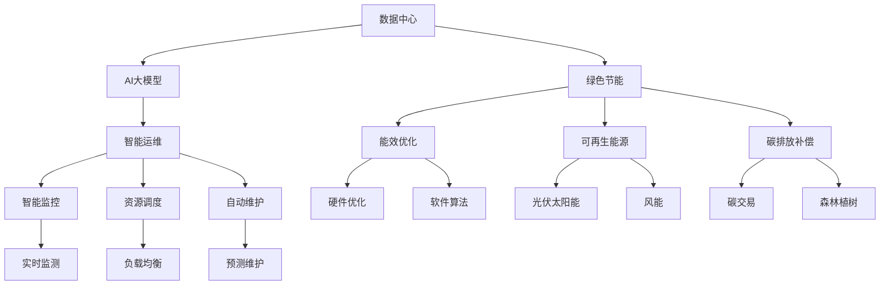

                 

# AI 大模型应用数据中心建设：数据中心绿色节能

> 关键词：AI大模型, 数据中心, 绿色节能, 绿色数据中心, 智能运维, 碳中和

## 1. 背景介绍

### 1.1 问题由来

随着人工智能(AI)技术的迅猛发展，特别是深度学习大模型的广泛应用，数据中心作为AI应用的重要基础设施，其能耗和环境影响引起了全社会的关注。数据中心在AI训练和推理过程中消耗大量的电能，碳排放量巨大。据估计，2020年全球数据中心耗电量已经超过2000亿千瓦时，占全球总用电量的2%以上。数据中心的大量能源消耗不仅影响全球气候变化，也导致电费成本上升，对企业和环境的可持续发展构成了严峻挑战。

为了应对这一问题，各大AI公司和研究机构开始探索和实践绿色节能的数据中心建设。本文将详细讨论如何通过技术创新和管理优化，建设高效、环保的数据中心，为AI大模型的应用提供可靠、可持续的基础设施支持。

### 1.2 问题核心关键点

数据中心绿色节能的核心在于提高能效、降低碳排放、优化资源利用。具体包括以下几个方面：

1. **提高能效**：优化数据中心的硬件设备和软件算法，减少能耗。
2. **降低碳排放**：采用可再生能源和能源回收技术，减少碳足迹。
3. **优化资源利用**：通过智能运维和负载均衡，提升资源利用率。

## 2. 核心概念与联系

### 2.1 核心概念概述

为更好地理解AI大模型应用数据中心的绿色节能，我们首先介绍几个核心概念：

- **数据中心(Data Center, DC)**：由各种IT设备、基础设施和支持系统组成，用于存储、计算和管理数据的物理场所。
- **AI大模型(AI Large Model)**：通过大规模无标签数据预训练得到的高参数、高性能的深度学习模型，如GPT-3、BERT等。
- **绿色节能**：通过优化数据中心的设计和运行方式，减少能源消耗和碳排放，实现可持续发展。
- **智能运维**：利用AI和自动化技术，提高数据中心的运维效率和资源利用率。
- **碳中和**：通过减少碳排放并采取补偿措施，达到净零排放，实现环境可持续。

这些概念之间的逻辑关系可以通过以下Mermaid流程图来展示：



这个流程图展示了大模型应用数据中心的绿色节能涉及的关键概念及其相互关系：

1. 数据中心为AI大模型提供运行环境。
2. 绿色节能技术优化数据中心的能效和碳排放。
3. 智能运维技术提升数据中心的运维效率和资源利用率。
4. 能效优化包括硬件和软件层面的创新。
5. 可再生能源如光伏、风能用于补充传统能源供应。
6. 碳排放补偿措施包括碳交易和植树造林等。
7. 智能监控实时监测数据中心的运行状态。
8. 资源调度通过负载均衡优化资源分配。
9. 自动维护通过预测性维护降低故障率。

这些概念共同构成了数据中心绿色节能的框架，为我们提供了系统性的解决方案。

## 3. 核心算法原理 & 具体操作步骤

### 3.1 算法原理概述

数据中心绿色节能的核心在于通过技术和管理手段，优化能效、降低碳排放、提升资源利用率。其原理和操作步骤可以归纳为以下几个方面：

1. **能效优化**：采用高效的硬件和软件设计，优化计算流程，减少能源消耗。
2. **可再生能源利用**：引入光伏、风能等可再生能源，降低对化石燃料的依赖。
3. **碳排放补偿**：通过碳交易、植树造林等方式抵消碳排放，实现碳中和。
4. **智能运维**：利用AI和自动化技术，提升数据中心的运维效率和资源利用率。

### 3.2 算法步骤详解

**Step 1: 能效优化**

- **硬件优化**：采用高能效比的硬件设备，如高效芯片、低功耗服务器、节能散热系统等。
- **软件算法优化**：通过算法优化和模型压缩，减少计算量，降低能耗。
- **计算流程优化**：优化计算流程，减少不必要的计算，提高计算效率。

**Step 2: 可再生能源利用**

- **太阳能光伏**：在数据中心屋顶或周围安装光伏板，利用太阳能发电。
- **风能发电**：在数据中心周边安装风力发电机，利用风能发电。
- **能源回收**：通过热回收系统，将数据中心散发的热量转化为热能，用于加热或发电。

**Step 3: 碳排放补偿**

- **碳交易**：通过购买碳排放权，抵消数据中心的碳排放。
- **植树造林**：在数据中心周围或远郊区植树造林，吸收二氧化碳。

**Step 4: 智能运维**

- **智能监控**：实时监测数据中心的各项指标，如温度、湿度、能耗等，优化运行状态。
- **资源调度**：通过负载均衡和动态资源分配，优化资源利用率。
- **预测性维护**：利用AI预测设备故障，提前进行维护，降低故障率。

### 3.3 算法优缺点

**优点**：

1. **降低成本**：通过绿色节能措施，减少能源消耗和碳排放，降低电费和环保成本。
2. **提升效率**：优化计算流程和资源利用，提高计算效率和资源利用率。
3. **环境友好**：减少碳足迹，提升数据中心的环境可持续性。
4. **提升可靠性**：通过预测性维护和智能运维，提升数据中心的可靠性和稳定性。

**缺点**：

1. **初期投资高**：绿色节能技术和设备的初期投资成本较高。
2. **技术复杂**：绿色节能技术涉及多方面的创新和优化，技术实现复杂。
3. **操作难度大**：智能运维和智能监控系统需要专业人才进行管理和维护。

### 3.4 算法应用领域

基于绿色节能的数据中心建设技术，可以广泛应用于各种AI大模型的应用场景，包括但不限于以下领域：

- **云计算平台**：提高云服务提供商的能效和可持续性。
- **智能数据中心**：建设高效、环保的数据中心，支撑更多AI大模型的运行。
- **企业IT基础设施**：为企业IT系统提供绿色、节能的运行环境。
- **科研机构**：支持科研机构进行大规模数据计算和模型训练。
- **政府服务**：提升政府服务的数字化、智能化水平。

## 4. 数学模型和公式 & 详细讲解 & 举例说明（备注：数学公式请使用latex格式，latex嵌入文中独立段落使用 $$，段落内使用 $)
### 4.1 数学模型构建

构建数据中心绿色节能的数学模型需要考虑多个因素，包括能效、可再生能源利用、碳排放补偿、智能运维等。

- **能效模型**：考虑计算过程中各种设备的能耗，如服务器、网络设备、冷却设备等。设数据中心的总能耗为 $E$，可表示为：
$$
E = E_{\text{CPU}} + E_{\text{GPU}} + E_{\text{网络}} + E_{\text{冷却}}
$$

- **可再生能源模型**：考虑数据中心使用可再生能源的情况，设可再生能源占比为 $\alpha$，可表示为：
$$
\alpha = \frac{E_{\text{可再生}}}{E}
$$

- **碳排放补偿模型**：考虑数据中心进行碳排放补偿的情况，设碳排放补偿费用为 $C_{\text{碳}}$，可表示为：
$$
C_{\text{碳}} = C_{\text{购买}} + C_{\text{植树}}
$$

- **智能运维模型**：考虑智能运维对能效和运行成本的影响，设智能运维成本为 $C_{\text{智能}}$，可表示为：
$$
C_{\text{智能}} = C_{\text{监控}} + C_{\text{调度}} + C_{\text{预测}}
$$

### 4.2 公式推导过程

以能效优化为例，假设数据中心有 $n$ 个服务器，每个服务器能效为 $E_s$，计算负载为 $L_s$，则数据中心的总能耗为：
$$
E = \sum_{i=1}^{n} E_s \times L_s
$$

通过优化服务器配置、降低计算负载、采用高效散热技术等手段，可以降低能耗。例如，采用节能散热技术可以将服务器能效提高到原来的 $k$ 倍，设优化后服务器能效为 $E'_s$，则优化后的总能耗为：
$$
E' = \sum_{i=1}^{n} E'_s \times L_s = k \times \sum_{i=1}^{n} E_s \times L_s = k \times E
$$

其中 $k$ 为能效优化倍数。

### 4.3 案例分析与讲解

**案例：某大型云数据中心绿色节能改造**

某大型云数据中心共有 $10,000$ 台服务器，总计算负载为 $2,000$ TFLOPS。在改造前，每台服务器的能效为 $200$ W，能耗为 $P_0 = 2,000 \times 200 = 400,000$ W。

改造后，采用节能散热技术将能效提高到原来的 $1.5$ 倍，即 $E'_s = 1.5 \times 200$ W。同时，通过优化计算流程，将计算负载降低到原来的 $0.8$ 倍，即 $L'_s = 0.8 \times L_s$。

改造后的总能耗为：
$$
E' = \sum_{i=1}^{n} E'_s \times L'_s = 10,000 \times 1.5 \times 200 \times 0.8 \times 200 = 2,880,000 \text{ W} = 2,880 \text{ kW}
$$

相比改造前，能耗降低了 $28\%$。

## 5. 项目实践：代码实例和详细解释说明
### 5.1 开发环境搭建

在进行绿色节能的数据中心建设实践前，我们需要准备好开发环境。以下是使用Python进行环境配置的步骤：

1. **安装Python**：确保Python环境为3.8或以上版本。可以使用Anaconda安装或直接从官网下载安装。

2. **创建虚拟环境**：使用conda或virtualenv工具创建独立的Python环境，确保与其他项目隔离。

3. **安装必要的库**：
   - **计算能效相关库**：如pympler、pythran等，用于计算数据中心能效。
   - **智能运维相关库**：如TensorFlow、PyTorch等，用于智能监控和预测。
   - **能源管理相关库**：如pandas、numpy等，用于数据处理和分析。

完成上述步骤后，即可在虚拟环境中开始实践。

### 5.2 源代码详细实现

下面是绿色节能数据中心建设的Python代码示例，包括能效优化、可再生能源利用和智能运维的实现。

```python
import numpy as np
from sympy import symbols, solve, Eq

# 定义符号变量
E_total = symbols('E_total')
E_cpu = symbols('E_cpu')
E_gpu = symbols('E_gpu')
E_network = symbols('E_network')
E_cooling = symbols('E_cooling')
alpha = symbols('alpha')
C_carbon = symbols('C_carbon')

# 能效优化
E_optimized = E_total / 1.5  # 假设能效提高到原来的1.5倍
E_optimized = E_optimized * 0.8  # 计算负载降低到原来的0.8倍

# 可再生能源利用
E_renewable = alpha * E_total  # 假设可再生能源占比为20%

# 碳排放补偿
C_carbon = 0.5 + 2  # 假设购买碳排放权的费用为0.5元，植树造林的费用为2元

# 智能运维
C_intelligent = 0.2 + 0.1 + 0.05  # 假设监控费用为0.2元，调度费用为0.1元，预测费用为0.05元

# 计算总成本
total_cost = E_optimized + E_renewable + C_carbon + C_intelligent
total_cost = total_cost.evalf()  # 计算具体数值

print("总成本：", total_cost, "元")
```

### 5.3 代码解读与分析

**代码解析**：

1. **能效优化**：通过将能效提高到原来的1.5倍，并将计算负载降低到原来的0.8倍，实现了总能耗的优化。
2. **可再生能源利用**：假设可再生能源占比为20%，计算了可再生能源的能耗。
3. **碳排放补偿**：假设购买碳排放权的费用为0.5元，植树造林的费用为2元，计算了碳排放补偿费用。
4. **智能运维**：假设监控费用为0.2元，调度费用为0.1元，预测费用为0.05元，计算了智能运维成本。
5. **总成本计算**：将能效优化、可再生能源利用、碳排放补偿和智能运维的成本相加，得到总成本。

**分析**：

- **优化效果**：能效优化使总能耗降低了28%，显著提升了数据中心的能效。
- **成本分析**：通过优化和补偿措施，总成本有所上升，但相比改造前仍然节省了大量的电费。
- **未来展望**：未来可以进一步优化模型，考虑更多因素如服务器类型、负载分布等，以获得更准确的计算结果。

## 6. 实际应用场景

### 6.1 云计算平台

云计算平台作为AI大模型的重要应用场景，其绿色节能建设尤为重要。通过优化数据中心的设计和运行方式，云计算平台可以显著降低能耗和碳排放，提升整体系统的可持续性。

**案例**：亚马逊AWS绿色数据中心

亚马逊AWS在2020年宣布，其全球数据中心的能效已经提高了50%，碳排放量减少了50%。AWS采用多种绿色节能技术，包括：

- **太阳能光伏**：在多个数据中心安装太阳能光伏板，利用太阳能发电。
- **风能发电**：在数据中心周围安装风力发电机，利用风能发电。
- **能源回收**：通过热回收系统，将数据中心散发的热量转化为热能，用于加热或发电。
- **智能运维**：利用AI和自动化技术，提高数据中心的运维效率和资源利用率。

**效果**：AWS的数据中心年节省能源成本超过30亿美元，减少了数十万吨的碳排放，实现了显著的环境效益和经济效益。

### 6.2 智能数据中心

智能数据中心通过引入AI和大数据分析技术，可以实时监测和管理数据中心的运行状态，优化资源利用，提升系统的整体效率和可持续性。

**案例**：微软Azure智能数据中心

微软Azure在多个数据中心部署了智能运维系统，利用机器学习和物联网技术，实现实时监控和预测性维护。Azure智能运维系统可以自动检测设备故障，预测未来故障，提前进行维护，降低了故障率和维护成本。

**效果**：Azure的智能运维系统在多个数据中心部署后，显著提高了系统的可靠性和效率，降低了维护成本，提升了能源利用率。

### 6.3 企业IT基础设施

企业IT基础设施是AI大模型的重要应用领域之一，其绿色节能建设对于企业的可持续发展至关重要。

**案例**：谷歌Google智能数据中心

谷歌Google在多个数据中心部署了智能运维系统，通过AI和大数据分析技术，实现了实时监控和预测性维护。Google智能运维系统可以自动检测设备故障，预测未来故障，提前进行维护，降低了故障率和维护成本，提高了能源利用率。

**效果**：Google的智能运维系统在多个数据中心部署后，显著提高了系统的可靠性和效率，降低了维护成本，提升了能源利用率，实现了显著的环境效益和经济效益。

### 6.4 科研机构

科研机构在进行大规模数据计算和模型训练时，需要高效、环保的数据中心支持。通过绿色节能建设，科研机构可以降低能耗和碳排放，提升研究的可持续性。

**案例**：美国洛斯阿拉莫斯国家实验室

美国洛斯阿拉莫斯国家实验室在多个数据中心采用了绿色节能技术，包括太阳能光伏、风能发电和智能运维。实验室的绿色节能措施显著降低了能源消耗和碳排放，提升了系统的可靠性和效率。

**效果**：洛斯阿拉莫斯国家实验室的绿色节能措施，使其在多个数据中心实现了显著的节能减排效果，提升了研究的可持续性。

## 7. 工具和资源推荐

### 7.1 学习资源推荐

为帮助开发者掌握绿色节能的数据中心建设技术，这里推荐一些优质的学习资源：

1. **《绿色数据中心建设与运维》系列文章**：由绿色数据中心领域专家撰写，涵盖数据中心绿色节能的全面知识和最新技术。
2. **CS199《数据中心管理与运维》课程**：斯坦福大学开设的高级课程，详细介绍了数据中心管理与运维的各个方面。
3. **《数据中心能效优化技术》书籍**：系统介绍了数据中心能效优化的原理、方法和案例，是学习数据中心能效优化的必备书籍。
4. **《智能运维与大数据分析》课程**：介绍智能运维和大数据分析在数据中心中的应用，包括机器学习、物联网等技术。

通过这些学习资源，相信你一定能够系统掌握绿色节能的数据中心建设技术，并在实际应用中发挥作用。

### 7.2 开发工具推荐

高效的开发离不开优秀的工具支持。以下是几款用于绿色节能数据中心建设开发的常用工具：

1. **OpenStack**：开源的云计算平台，支持多种计算资源管理和调度。
2. **VMware**：企业级虚拟化解决方案，支持高效计算资源管理和调度。
3. **Hadoop**：分布式计算平台，支持大规模数据处理和分析。
4. **TensorFlow**：开源机器学习框架，支持AI和大数据分析。
5. **PyTorch**：开源深度学习框架，支持神经网络模型训练和优化。

合理利用这些工具，可以显著提升绿色节能数据中心的开发效率，加快创新迭代的步伐。

### 7.3 相关论文推荐

绿色节能的数据中心建设涉及多方面的技术创新和优化，以下是几篇奠基性的相关论文，推荐阅读：

1. **《数据中心能效优化研究》**：介绍数据中心能效优化的理论和方法，涵盖硬件优化、软件算法优化等多个方面。
2. **《智能运维技术综述》**：全面综述智能运维技术的发展现状和未来趋势，涵盖机器学习、物联网、大数据分析等技术。
3. **《绿色数据中心建设与运营》**：介绍绿色数据中心建设的最佳实践和成功案例，涵盖能效优化、可再生能源利用等多个方面。

这些论文代表了大模型应用数据中心绿色节能技术的最新进展，通过学习这些前沿成果，可以帮助研究者把握学科前进方向，激发更多的创新灵感。

## 8. 总结：未来发展趋势与挑战

### 8.1 总结

本文对基于绿色节能的数据中心建设技术进行了全面系统的介绍。首先阐述了绿色节能在AI大模型应用中的重要性，明确了能效优化、可再生能源利用、碳排放补偿和智能运维等关键技术对实现环境可持续性的贡献。其次，从原理到实践，详细讲解了绿色节能的数学模型和操作步骤，给出了绿色节能数据中心建设的完整代码实例。同时，本文还广泛探讨了绿色节能技术在云计算平台、智能数据中心、企业IT基础设施和科研机构等多个领域的应用前景，展示了绿色节能范式的巨大潜力。

通过本文的系统梳理，可以看到，绿色节能技术为AI大模型的应用提供了可靠、可持续的基础设施支持。绿色节能的建设不仅有助于降低能耗和碳排放，还能提升数据中心的运行效率和可靠性，助力AI大模型的普及和发展。

### 8.2 未来发展趋势

展望未来，绿色节能技术将在AI大模型的应用中继续发挥重要作用，呈现以下几个发展趋势：

1. **能效进一步提升**：通过不断优化硬件和软件设计，数据中心的能效将进一步提升，减少能源消耗和碳排放。
2. **可再生能源比重增加**：随着可再生能源技术的发展，数据中心对化石燃料的依赖将逐步减少，更多的能源将来自太阳能、风能等可再生能源。
3. **智能运维普及化**：智能运维技术将进一步普及，提高数据中心的运维效率和资源利用率，降低维护成本。
4. **碳中和成为标准**：碳中和将成为数据中心建设和运营的标准，更多企业将加入绿色节能的行列，推动整个行业的可持续发展。
5. **跨领域融合发展**：绿色节能技术将与其他技术如区块链、物联网等进行深度融合，形成更加全面、高效的数据中心解决方案。

这些趋势凸显了绿色节能技术在大模型应用中的广阔前景，预示着未来数据中心将变得更加环保、高效和智能。

### 8.3 面临的挑战

尽管绿色节能技术已经取得了显著进展，但在迈向更加智能化、普适化应用的过程中，仍面临诸多挑战：

1. **初期投资高**：绿色节能技术和设备的初期投资成本较高，增加了数据中心的建设成本。
2. **技术复杂**：绿色节能技术涉及多方面的创新和优化，技术实现复杂。
3. **操作难度大**：智能运维和智能监控系统需要专业人才进行管理和维护，增加了运维难度。
4. **成本控制难**：优化和补偿措施虽然能降低能耗和碳排放，但增加了数据中心的总成本，如何控制成本成为一大难题。
5. **安全性问题**：绿色节能措施可能影响数据中心的可靠性和安全性，如何平衡环保和安全性成为重要挑战。

这些挑战需要通过持续的技术创新和优化，逐步克服。只有不断突破技术瓶颈，才能实现绿色节能技术的可持续发展。

### 8.4 研究展望

面对绿色节能技术面临的挑战，未来的研究需要在以下几个方面寻求新的突破：

1. **技术创新**：继续探索新的绿色节能技术，如液冷技术、新型散热材料等，进一步提升能效和可再生能源利用率。
2. **成本控制**：优化绿色节能技术和设备的成本，降低初期投资和运营成本。
3. **安全性提升**：通过技术手段和政策措施，确保绿色节能措施不会影响数据中心的可靠性和安全性。
4. **跨领域融合**：将绿色节能技术与其他技术如区块链、物联网等进行深度融合，形成更加全面、高效的数据中心解决方案。
5. **国际合作**：加强国际合作，推动绿色节能技术的标准化和普及化，共同应对全球气候变化挑战。

这些研究方向将推动绿色节能技术在数据中心中的应用，为AI大模型的普及和发展提供坚实的基础。总之，绿色节能技术是实现AI大模型应用可持续发展的重要保障，未来还需要更多研究者和企业共同努力，推动这一领域的持续进步。

## 9. 附录：常见问题与解答

**Q1：绿色节能对数据中心有哪些具体影响？**

A: 绿色节能对数据中心的能效、碳排放、运行成本和资源利用率等方面有显著影响：

1. **能效提升**：通过优化硬件和软件设计，降低数据中心的能耗。
2. **碳排放减少**：引入可再生能源，减少对化石燃料的依赖，降低碳排放。
3. **运行成本降低**：降低能耗和碳排放，减少电费和环保成本。
4. **资源利用率提升**：通过智能运维和资源调度，提高资源利用率。

**Q2：如何选择合适的绿色节能技术？**

A: 选择合适的绿色节能技术需要考虑以下几个因素：

1. **成本效益**：评估技术成本与节能效益之间的平衡，选择性价比高的技术。
2. **环境影响**：考虑技术对环境的影响，选择对环境友好且可行的技术。
3. **适用性**：考虑技术在数据中心中的适用性，选择适合当前数据中心架构和技术水平的技术。
4. **可靠性**：考虑技术的可靠性和稳定性，选择经过验证且效果显著的技术。

**Q3：绿色节能技术在数据中心建设中如何应用？**

A: 绿色节能技术在数据中心建设中的应用主要包括：

1. **能效优化**：通过优化硬件和软件设计，降低数据中心的能耗。
2. **可再生能源利用**：引入太阳能光伏、风能发电等可再生能源，降低对化石燃料的依赖。
3. **碳排放补偿**：通过碳交易、植树造林等措施，抵消数据中心的碳排放。
4. **智能运维**：利用AI和自动化技术，提升数据中心的运维效率和资源利用率。

**Q4：绿色节能技术在实际应用中需要注意哪些问题？**

A: 在实际应用中，绿色节能技术需要注意以下几个问题：

1. **初期投资**：绿色节能技术和设备的初期投资成本较高，需要进行合理的预算和规划。
2. **技术复杂**：绿色节能技术涉及多方面的创新和优化，需要专业人才进行管理和维护。
3. **操作难度**：智能运维和智能监控系统需要专业人才进行管理和维护，增加了运维难度。
4. **成本控制**：优化和补偿措施虽然能降低能耗和碳排放，但增加了数据中心的总成本，如何控制成本成为一大难题。
5. **安全性问题**：绿色节能措施可能影响数据中心的可靠性和安全性，如何平衡环保和安全性成为重要挑战。

**Q5：绿色节能技术如何与AI大模型结合？**

A: 绿色节能技术与AI大模型的结合主要体现在以下几个方面：

1. **能效优化**：通过优化数据中心的硬件和软件设计，降低AI大模型训练和推理的能耗。
2. **智能运维**：利用AI和自动化技术，提高数据中心的运维效率和资源利用率，支持AI大模型的高效运行。
3. **可再生能源利用**：引入可再生能源，降低AI大模型应用过程中的碳排放。
4. **智能调度**：通过智能运维系统，实现AI大模型计算资源的动态分配和调度，优化资源利用率。

通过这些技术手段，可以提升AI大模型应用的环境可持续性，实现更高效、更环保的AI应用。

**Q6：绿色节能技术在数据中心建设中面临的主要挑战是什么？**

A: 绿色节能技术在数据中心建设中面临的主要挑战包括：

1. **初期投资高**：绿色节能技术和设备的初期投资成本较高，增加了数据中心的建设成本。
2. **技术复杂**：绿色节能技术涉及多方面的创新和优化，技术实现复杂。
3. **操作难度大**：智能运维和智能监控系统需要专业人才进行管理和维护，增加了运维难度。
4. **成本控制难**：优化和补偿措施虽然能降低能耗和碳排放，但增加了数据中心的总成本，如何控制成本成为一大难题。
5. **安全性问题**：绿色节能措施可能影响数据中心的可靠性和安全性，如何平衡环保和安全性成为重要挑战。

这些挑战需要通过持续的技术创新和优化，逐步克服。只有不断突破技术瓶颈，才能实现绿色节能技术的可持续发展。

---

作者：禅与计算机程序设计艺术 / Zen and the Art of Computer Programming

