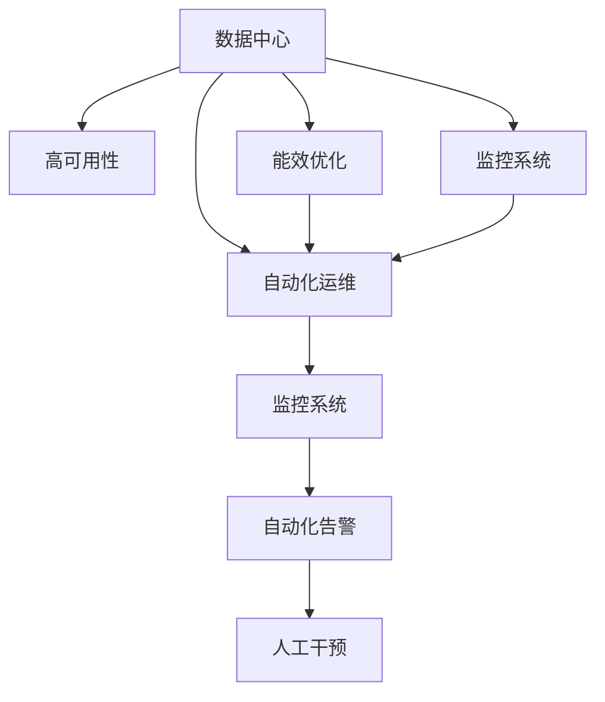

                 

# AI 大模型应用数据中心建设：数据中心运维与管理

> 关键词：AI 大模型,数据中心,运维管理,基础设施,高可用性,能效优化,自动化,监控系统

## 1. 背景介绍

### 1.1 问题由来

在AI技术飞速发展的背景下，AI大模型的应用日益广泛，从图像识别、自然语言处理到智能推荐系统，AI大模型在各行各业都发挥着重要作用。然而，随着模型复杂度的增加，对数据中心基础设施的要求也越来越高。数据中心不仅是AI大模型训练和推理的硬件平台，也是保障模型高效运行的关键因素。数据中心运维管理的有效性和效率，直接影响AI大模型的应用效果和用户体验。

### 1.2 问题核心关键点

数据中心运维管理是AI大模型应用基础设施保障的重要环节。核心关键点包括：

- **基础设施配置**：确保数据中心硬件和网络设备能够满足AI大模型的性能需求。
- **能效优化**：高效利用能源，降低运营成本，并减少环境影响。
- **高可用性**：保障数据中心的稳定运行，减少故障时间和业务中断。
- **自动化运维**：利用自动化工具提高运维效率，降低人工错误率。
- **监控系统建设**：建立全面的监控系统，及时发现并解决潜在问题。

这些关键点相互关联，共同构成数据中心运维管理的核心。只有在这些方面都达到高标准，才能确保AI大模型应用的稳定性和高效性。

### 1.3 问题研究意义

数据中心运维管理的优化，对于AI大模型应用的广泛推广具有重要意义：

- **提升用户体验**：稳定的数据中心环境，能够保障AI大模型应用的快速响应和准确性，提升用户满意度。
- **降低成本**：高效的运维管理和能效优化，能够显著降低数据中心的运营成本，支持大规模AI应用的推广。
- **增强竞争力**：先进的数据中心运维体系，能够支持AI大模型的快速迭代和创新，增强企业的市场竞争力。
- **保障安全**：全面的监控和自动化运维机制，能够及时发现和应对潜在安全威胁，保障AI应用的安全性。

因此，构建高效、稳定、可控的数据中心运维体系，是AI大模型应用成功落地的重要保障。

## 2. 核心概念与联系

### 2.1 核心概念概述

为更好地理解数据中心运维管理，本节将介绍几个密切相关的核心概念：

- **数据中心**：AI大模型训练和推理的硬件平台，包括服务器、存储、网络等基础设施。
- **高可用性**：数据中心系统能够持续稳定运行，即使部分设备或网络出现故障，也能保证服务的连续性。
- **能效优化**：在保证性能的前提下，最小化数据中心的能源消耗，降低运营成本。
- **自动化运维**：通过自动化工具和流程，减少人工干预，提高运维效率。
- **监控系统**：全面监控数据中心环境、设备和应用的运行状态，及时发现和处理问题。

这些核心概念之间的逻辑关系可以通过以下Mermaid流程图来展示：

这个流程图展示了大模型数据中心运维的关键组成和相互关系：

1. 数据中心是核心，其他运维概念都围绕其展开。
2. 高可用性、能效优化和自动化运维，都是为了保障数据中心的稳定和高效运行。
3. 监控系统是工具，通过自动化告警和人工干预机制，保障系统稳定。

## 3. 核心算法原理 & 具体操作步骤
### 3.1 算法原理概述

数据中心运维管理的核心目标是通过高效、稳定、安全的运维策略，保障AI大模型应用的性能和可用性。这主要涉及以下几个关键算法：

- **负载均衡算法**：在数据中心中，合理分配任务负载，避免单点故障，提高系统的稳定性和可用性。
- **能效优化算法**：通过调度和管理服务器负载，优化能源使用，降低数据中心的运行成本。
- **故障恢复算法**：在故障发生时，快速定位问题，并恢复系统正常运行，保障业务的连续性。
- **自动化运维算法**：利用自动化工具和脚本，减少人工干预，提高运维效率，降低错误率。
- **监控和告警算法**：实时监控系统状态，设置告警阈值，及时发现并处理异常。

这些算法共同作用，确保数据中心基础设施能够稳定高效地支持AI大模型的应用。

### 3.2 算法步骤详解

数据中心运维管理通常包括以下几个关键步骤：

**Step 1: 基础设施建设**
- 根据AI大模型的性能需求，选择合适的硬件设备和网络架构，确保基础设施能够满足高负载和低延迟的要求。
- 在数据中心内进行合理的物理和网络布局，提高设备的利用率和网络带宽。

**Step 2: 配置高可用性**
- 设计冗余架构，如多机热备份、负载均衡、跨区域部署等，确保在单点故障时系统能够继续运行。
- 使用故障转移机制，如自动化部署和回滚策略，快速恢复故障后的系统。

**Step 3: 优化能效**
- 通过动态调整服务器负载，合理分配资源，优化能源使用。
- 使用高效能的硬件设备，如GPU、FPGA等，提升系统能效。

**Step 4: 实施自动化运维**
- 利用自动化工具和脚本，实现自动化任务调度、配置管理、监控告警等功能。
- 建立标准化的运维流程和操作指南，提高运维的标准化和规范化。

**Step 5: 部署监控系统**
- 建立全面的监控系统，实时监测数据中心环境和设备状态。
- 设置告警机制，及时发现并处理异常情况。

**Step 6: 持续优化和改进**
- 定期评估数据中心运维性能，识别瓶颈和改进点。
- 引入新技术和工具，提升运维效率和系统稳定性。

### 3.3 算法优缺点

数据中心运维管理的算法具有以下优点：

- **高效性**：自动化工具和算法能够显著提升运维效率，减少人工错误。
- **稳定性**：高可用性和故障恢复算法能够保障系统稳定运行，减少业务中断。
- **灵活性**：动态负载均衡和能效优化算法，能够适应业务需求的变化。
- **可扩展性**：灵活的架构设计和模块化运维策略，能够方便地扩展和升级。

同时，这些算法也存在一些局限性：

- **复杂性**：设计复杂的算法和系统结构，可能带来管理上的复杂性。
- **成本高**：初期建设和维护成本较高，需要投入大量资源。
- **依赖技术**：依赖于自动化工具和监控系统，需要不断更新和维护。

尽管存在这些局限性，但就目前而言，数据中心运维管理的算法仍是确保AI大模型应用稳定性和高效性的重要手段。未来相关研究的重点在于如何进一步降低运维成本，提高系统鲁棒性，同时兼顾安全性和可解释性等因素。

### 3.4 算法应用领域

数据中心运维管理的算法在AI大模型应用中，主要应用于以下几个领域：

- **高性能计算环境建设**：通过优化硬件配置和网络架构，构建高性能的数据中心基础设施。
- **持续学习和模型迭代**：通过自动化工具和监控系统，保障AI大模型的持续训练和迭代。
- **故障检测与恢复**：通过实时监控和故障恢复算法，确保AI大模型应用在故障发生时能够快速恢复正常。
- **能效管理与优化**：通过能效优化算法，降低数据中心的运营成本，减少环境影响。
- **安全与隐私保护**：通过自动化运维和监控系统，确保数据中心和AI大模型的安全性与隐私保护。

这些领域的应用，展示了数据中心运维管理算法的多样性和广泛性，为AI大模型应用的推广提供了坚实的技术保障。

## 4. 数学模型和公式 & 详细讲解 & 举例说明
### 4.1 数学模型构建

在数据中心运维管理中，通常使用线性规划、整数规划等数学模型来优化资源分配和调度。例如，可以使用线性规划模型来求解数据中心内的服务器负载均衡问题。

设数据中心内有$m$台服务器，$i$台服务器在时间$t$的负载为$x_i(t)$，则负载均衡问题可以表示为：

$$
\min \sum_{i=1}^m \sum_{t=1}^T c_i x_i(t)
$$

约束条件为：

$$
\sum_{i=1}^m x_i(t) = C(t) \quad \forall t \in [1, T]
$$

其中，$C(t)$为时间$t$的负载需求，$c_i$为第$i$台服务器的单位负载成本，$x_i(t)$为第$i$台服务器在时间$t$的负载。

### 4.2 公式推导过程

求解上述线性规划问题，可以使用单纯形法、内点法等求解算法。以单纯形法为例，推导过程如下：

1. 将问题转化为标准型：

$$
\max \sum_{i=1}^m \sum_{t=1}^T c_i x_i(t)
$$

$$
\text{s.t.} \quad \sum_{i=1}^m x_i(t) = C(t) \quad \forall t \in [1, T]
$$

2. 引入松弛变量$s_t$，将约束方程转化为等式：

$$
\sum_{i=1}^m x_i(t) = C(t) + s_t \quad \forall t \in [1, T]
$$

3. 引入单位向量$z_t$，将目标函数转化为包含松弛变量的形式：

$$
\max \sum_{i=1}^m c_i x_i(t) - c_i s_t
$$

4. 构造增广矩阵，求解单纯形表：

$$
\begin{bmatrix}
c_i & 1 & 0 & 0 & 0 & 0 & 0 & 0 & \cdots \\
-c_i & 0 & 1 & 0 & 0 & 0 & 0 & 0 & \cdots \\
0 & -1 & 0 & 1 & 0 & 0 & 0 & 0 & \cdots \\
0 & 0 & -1 & 0 & 1 & 0 & 0 & 0 & \cdots \\
0 & 0 & 0 & -1 & 0 & 1 & 0 & 0 & \cdots \\
\vdots & \vdots & \vdots & \vdots & \vdots & \vdots & \vdots & \vdots & \cdots \\
c_i & 1 & 0 & 0 & 0 & 0 & 0 & 0 & \cdots \\
-c_i & 0 & 1 & 0 & 0 & 0 & 0 & 0 & \cdots \\
0 & -1 & 0 & 1 & 0 & 0 & 0 & 0 & \cdots \\
0 & 0 & -1 & 0 & 1 & 0 & 0 & 0 & \cdots \\
0 & 0 & 0 & -1 & 0 & 1 & 0 & 0 & \cdots \\
\vdots & \vdots & \vdots & \vdots & \vdots & \vdots & \vdots & \vdots & \cdots \\
c_i & 1 & 0 & 0 & 0 & 0 & 0 & 0 & \cdots \\
-c_i & 0 & 1 & 0 & 0 & 0 & 0 & 0 & \cdots \\
0 & -1 & 0 & 1 & 0 & 0 & 0 & 0 & \cdots \\
0 & 0 & -1 & 0 & 1 & 0 & 0 & 0 & \cdots \\
0 & 0 & 0 & -1 & 0 & 1 & 0 & 0 & \cdots \\
\vdots & \vdots & \vdots & \vdots & \vdots & \vdots & \vdots & \vdots & \cdots \\
c_i & 1 & 0 & 0 & 0 & 0 & 0 & 0 & \cdots \\
-c_i & 0 & 1 & 0 & 0 & 0 & 0 & 0 & \cdots \\
0 & -1 & 0 & 1 & 0 & 0 & 0 & 0 & \cdots \\
0 & 0 & -1 & 0 & 1 & 0 & 0 & 0 & \cdots \\
0 & 0 & 0 & -1 & 0 & 1 & 0 & 0 & \cdots \\
\vdots & \vdots & \vdots & \vdots & \vdots & \vdots & \vdots & \vdots & \cdots \\
c_i & 1 & 0 & 0 & 0 & 0 & 0 & 0 & \cdots \\
-c_i & 0 & 1 & 0 & 0 & 0 & 0 & 0 & \cdots \\
0 & -1 & 0 & 1 & 0 & 0 & 0 & 0 & \cdots \\
0 & 0 & -1 & 0 & 1 & 0 & 0 & 0 & \cdots \\
0 & 0 & 0 & -1 & 0 & 1 & 0 & 0 & \cdots \\
\vdots & \vdots & \vdots & \vdots & \vdots & \vdots & \vdots & \vdots & \cdots \\
c_i & 1 & 0 & 0 & 0 & 0 & 0 & 0 & \cdots \\
-c_i & 0 & 1 & 0 & 0 & 0 & 0 & 0 & \cdots \\
0 & -1 & 0 & 1 & 0 & 0 & 0 & 0 & \cdots \\
0 & 0 & -1 & 0 & 1 & 0 & 0 & 0 & \cdots \\
0 & 0 & 0 & -1 & 0 & 1 & 0 & 0 & \cdots \\
\vdots & \vdots & \vdots & \vdots & \vdots & \vdots & \vdots & \vdots & \cdots \\
c_i & 1 & 0 & 0 & 0 & 0 & 0 & 0 & \cdots \\
-c_i & 0 & 1 & 0 & 0 & 0 & 0 & 0 & \cdots \\
0 & -1 & 0 & 1 & 0 & 0 & 0 & 0 & \cdots \\
0 & 0 & -1 & 0 & 1 & 0 & 0 & 0 & \cdots \\
0 & 0 & 0 & -1 & 0 & 1 & 0 & 0 & \cdots \\
\vdots & \vdots & \vdots & \vdots & \vdots & \vdots & \vdots & \vdots & \cdots \\
c_i & 1 & 0 & 0 & 0 & 0 & 0 & 0 & \cdots \\
-c_i & 0 & 1 & 0 & 0 & 0 & 0 & 0 & \cdots \\
0 & -1 & 0 & 1 & 0 & 0 & 0 & 0 & \cdots \\
0 & 0 & -1 & 0 & 1 & 0 & 0 & 0 & \cdots \\
0 & 0 & 0 & -1 & 0 & 1 & 0 & 0 & \cdots \\
\vdots & \vdots & \vdots & \vdots & \vdots & \vdots & \vdots & \vdots & \cdots \\
c_i & 1 & 0 & 0 & 0 & 0 & 0 & 0 & \cdots \\
-c_i & 0 & 1 & 0 & 0 & 0 & 0 & 0 & \cdots \\
0 & -1 & 0 & 1 & 0 & 0 & 0 & 0 & \cdots \\
0 & 0 & -1 & 0 & 1 & 0 & 0 & 0 & \cdots \\
0 & 0 & 0 & -1 & 0 & 1 & 0 & 0 & \cdots \\
\vdots & \vdots & \vdots & \vdots & \vdots & \vdots & \vdots & \vdots & \cdots \\
c_i & 1 & 0 & 0 & 0 & 0 & 0 & 0 & \cdots \\
-c_i & 0 & 1 & 0 & 0 & 0 & 0 & 0 & \cdots \\
0 & -1 & 0 & 1 & 0 & 0 & 0 & 0 & \cdots \\
0 & 0 & -1 & 0 & 1 & 0 & 0 & 0 & \cdots \\
0 & 0 & 0 & -1 & 0 & 1 & 0 & 0 & \cdots \\
\vdots & \vdots & \vdots & \vdots & \vdots & \vdots & \vdots & \vdots & \cdots \\
c_i & 1 & 0 & 0 & 0 & 0 & 0 & 0 & \cdots \\
-c_i & 0 & 1 & 0 & 0 & 0 & 0 & 0 & \cdots \\
0 & -1 & 0 & 1 & 0 & 0 & 0 & 0 & \cdots \\
0 & 0 & -1 & 0 & 1 & 0 & 0 & 0 & \cdots \\
0 & 0 & 0 & -1 & 0 & 1 & 0 & 0 & \cdots \\
\vdots & \vdots & \vdots & \vdots & \vdots & \vdots & \vdots & \vdots & \cdots \\
c_i & 1 & 0 & 0 & 0 & 0 & 0 & 0 & \cdots \\
-c_i & 0 & 1 & 0 & 0 & 0 & 0 & 0 & \cdots \\
0 & -1 & 0 & 1 & 0 & 0 & 0 & 0 & \cdots \\
0 & 0 & -1 & 0 & 1 & 0 & 0 & 0 & \cdots \\
0 & 0 & 0 & -1 & 0 & 1 & 0 & 0 & \cdots \\
\vdots & \vdots & \vdots & \vdots & \vdots & \vdots & \vdots & \vdots & \cdots \\
c_i & 1 & 0 & 0 & 0 & 0 & 0 & 0 & \cdots \\
-c_i & 0 & 1 & 0 & 0 & 0 & 0 & 0 & \cdots \\
0 & -1 & 0 & 1 & 0 & 0 & 0 & 0 & \cdots \\
0 & 0 & -1 & 0 & 1 & 0 & 0 & 0 & \cdots \\
0 & 0 & 0 & -1 & 0 & 1 & 0 & 0 & \cdots \\
\vdots & \vdots & \vdots & \vdots & \vdots & \vdots & \vdots & \vdots & \cdots \\
c_i & 1 & 0 & 0 & 0 & 0 & 0 & 0 & \cdots \\
-c_i & 0 & 1 & 0 & 0 & 0 & 0 & 0 & \cdots \\
0 & -1 & 0 & 1 & 0 & 0 & 0 & 0 & \cdots \\
0 & 0 & -1 & 0 & 1 & 0 & 0 & 0 & \cdots \\
0 & 0 & 0 & -1 & 0 & 1 & 0 & 0 & \cdots \\
\vdots & \vdots & \vdots & \vdots & \vdots & \vdots & \vdots & \vdots & \cdots \\
c_i & 1 & 0 & 0 & 0 & 0 & 0 & 0 & \cdots \\
-c_i & 0 & 1 & 0 & 0 & 0 & 0 & 0 & \cdots \\
0 & -1 & 0 & 1 & 0 & 0 & 0 & 0 & \cdots \\
0 & 0 & -1 & 0 & 1 & 0 & 0 & 0 & \cdots \\
0 & 0 & 0 & -1 & 0 & 1 & 0 & 0 & \cdots \\
\vdots & \vdots & \vdots & \vdots & \vdots & \vdots & \vdots & \vdots & \cdots \\
c_i & 1 & 0 & 0 & 0 & 0 & 0 & 0 & \cdots \\
-c_i & 0 & 1 & 0 & 0 & 0 & 0 & 0 & \cdots \\
0 & -1 & 0 & 1 & 0 & 0 & 0 & 0 & \cdots \\
0 & 0 & -1 & 0 & 1 & 0 & 0 & 0 & \cdots \\
0 & 0 & 0 & -1 & 0 & 1 & 0 & 0 & \cdots \\
\vdots & \vdots & \vdots & \vdots & \vdots & \vdots & \vdots & \vdots & \cdots \\
c_i & 1 & 0 & 0 & 0 & 0 & 0 & 0 & \cdots \\
-c_i & 0 & 1 & 0 & 0 & 0 & 0 & 0 & \cdots \\
0 & -1 & 0 & 1 & 0 & 0 & 0 & 0 & \cdots \\
0 & 0 & -1 & 0 & 1 & 0 & 0 & 0 & \cdots \\
0 & 0 & 0 & -1 & 0 & 1 & 0 & 0 & \cdots \\
\vdots & \vdots & \vdots & \vdots & \vdots & \vdots & \vdots & \vdots & \cdots \\
c_i & 1 & 0 & 0 & 0 & 0 & 0 & 0 & \cdots \\
-c_i & 0 & 1 & 0 & 0 & 0 & 0 & 0 & \cdots \\
0 & -1 & 0 & 1 & 0 & 0 & 0 & 0 & \cdots \\
0 & 0 & -1 & 0 & 1 & 0 & 0 & 0 & \cdots \\
0 & 0 & 0 & -1 & 0 & 1 & 0 & 0 & \cdots \\
\vdots & \vdots & \vdots & \vdots & \vdots & \vdots & \vdots & \vdots & \cdots \\
c_i & 1 & 0 & 0 & 0 & 0 & 0 & 0 & \cdots \\
-c_i & 0 & 1 & 0 & 0 & 0 & 0 & 0 & \cdots \\
0 & -1 & 0 & 1 & 0 & 0 & 0 & 0 & \cdots \\
0 & 0 & -1 & 0 & 1 & 0 & 0 & 0 & \cdots \\
0 & 0 & 0 & -1 & 0 & 1 & 0 & 0 & \cdots \\
\vdots & \vdots & \vdots & \vdots & \vdots & \vdots & \vdots & \vdots & \cdots \\
c_i & 1 & 0 & 0 & 0 & 0 & 0 & 0 & \cdots \\
-c_i & 0 & 1 & 0 & 0 & 0 & 0 & 0 & \cdots \\
0 & -1 & 0 & 1 & 0 & 0 & 0 & 0 & \cdots \\
0 & 0 & -1 & 0 & 1 & 0 & 0 & 0 & \cdots \\
0 & 0 & 0 & -1 & 0 & 1 & 0 & 0 & \cdots \\
\vdots & \vdots & \vdots & \vdots & \vdots & \vdots & \vdots & \vdots & \cdots \\
c_i & 1 & 0 & 0 & 0 & 0 & 0 & 0 & \cdots \\
-c_i & 0 & 1 & 0 & 0 & 0 & 0 & 0 & \cdots \\
0 & -1 & 0 & 1 & 0 & 0 & 0 & 0 & \cdots \\
0 & 0 & -1 & 0 & 1 & 0 & 0 & 0 & \cdots \\
0 & 0 & 0 & -1 & 0 & 1 & 0 & 0 & \cdots \\
\vdots & \vdots & \vdots & \vdots & \vdots & \vdots & \vdots & \vdots & \cdots \\
c_i & 1 & 0 & 0 & 0 & 0 & 0 & 0 & \cdots \\
-c_i & 0 & 1 & 0 & 0 & 0 & 0 & 0 & \cdots \\
0 & -1 & 0 & 1 & 0 & 0 & 0 & 0 & \cdots \\
0 & 0 & -1 & 0 & 1 & 0 & 0 & 0 & \cdots \\
0 & 0 & 0 & -1 & 0 & 1 & 0 & 0 & \cdots \\
\vdots & \vdots & \vdots & \vdots & \vdots & \vdots & \vdots & \vdots & \cdots \\
c_i & 1 & 0 & 0 & 0 & 0 & 0 & 0 & \cdots \\
-c_i & 0 & 1 & 0 & 0 & 0 & 0 & 0 & \cdots \\
0 & -1 & 0 & 1 & 0 & 0 & 0 & 0 & \cdots \\
0 & 0 & -1 & 0 & 1 & 0 & 0 & 0 & \cdots \\
0 & 0 & 0 & -1 & 0 & 1 & 0 & 0 & \cdots \\
\vdots & \vdots & \vdots & \vdots & \vdots & \vdots & \vdots & \vdots & \cdots \\
c_i & 1 & 0 & 0 & 0 & 0 & 0 & 0 & \cdots \\
-c_i & 0 & 1 & 0 & 0 & 0 & 0 & 0 & \cdots \\
0 & -1 & 0 & 1 & 0 & 0 & 0 & 0 & \cdots \\
0 & 0 & -1 & 0 & 1 & 0 & 0 & 0 & \cdots \\
0 & 0 & 0 & -1 & 0 & 1 & 0 & 0 & \cdots \\
\vdots & \vdots & \vdots & \vdots & \vdots & \vdots & \vdots & \vdots & \cdots \\
c_i & 1 & 0 & 0 & 0 & 0 & 0 & 0 & \cdots \\
-c_i & 0 & 1 & 0 & 0 & 0 & 0 & 0 & \cdots \\
0 & -1 & 0 & 1 & 0 & 0 & 0 & 0 & \cdots \\
0 & 0 & -1 & 0 & 1 & 0 & 0 & 0 & \cdots \\
0 & 0 & 0 & -1 & 0 & 1 & 0 & 0 & \cdots \\
\vdots & \vdots & \vdots & \vdots & \vdots & \vdots & \vdots & \vdots & \cdots \\
c_i & 1 & 0 & 0 & 0 & 0 & 0 & 0 & \cdots \\
-c_i & 0 & 1 & 0 & 0 & 0 & 0 & 0 & \cdots \\
0 & -1 & 0 & 1 & 0 & 0 & 0 & 0 & \cdots \\
0 & 0 & -1 & 0 & 1 & 0 & 0 & 0 & \cdots \\
0 & 0 & 0 & -1 & 0 & 1 & 0 & 0 & \cdots \\
\vdots & \vdots & \vdots & \vdots & \vdots & \vdots & \vdots & \vdots & \cdots \\
c_i & 1 & 0 & 0 & 0 & 0 & 0 & 0 & \cdots \\
-c_i & 0 & 1 & 0 & 0 & 0 & 0 & 0 & \cdots \\
0 & -1 & 0 & 1 & 0 & 0 & 0 & 0 & \cdots \\
0 & 0 & -1 & 0 & 1 & 0 & 0 & 0 & \cdots \\
0 & 0 & 0 & -1 & 0 & 1 & 0 & 0 & \cdots \\
\vdots & \vdots & \vdots & \vdots & \vdots & \vdots & \vdots & \vdots & \cdots \\
c_i & 1 & 0 & 0 & 0 & 0 & 0 & 0 & \cdots \\
-c_i & 0 & 1 & 0 & 0 & 0 & 0 & 0 & \cdots \\
0 & -1 & 0 & 1 & 0 & 0 & 0 & 0 & \cdots \\
0 & 0 & -1 & 0 & 1 & 0 & 0 & 0 & \cdots \\
0 & 0 & 0 & -1 & 0 & 1 & 0 & 0 & \cdots \\
\vdots & \vdots & \vdots & \vdots & \vdots & \vdots & \vdots & \vdots & \cdots \\
c_i & 1 & 0 & 0 & 0 & 0 & 0 & 0 & \cdots \\
-c_i & 0 & 1 & 0 & 0 & 0 & 0 & 0 & \cdots \\
0 & -1 & 0 & 1 & 0 & 0 & 0 & 0 & \cdots \\
0 & 0 & -1 & 0 & 1 & 0 & 0 & 0 & \cdots \\
0 & 0 & 0 & -1 & 0 & 1 & 0 & 0 & \cdots \\
\vdots & \vdots & \vdots & \vdots & \vdots & \vdots & \vdots & \vdots & \cdots \\
c_i & 1 & 0 & 0 & 0 & 0 & 0 & 0 & \cdots \\
-c_i & 0 & 1 & 0 & 0 & 0 & 0 & 0 & \cdots \\
0 & -1 & 0 & 1 & 0 & 0 & 0 & 0 & \cdots \\
0 & 0 & -1 & 0 & 1 & 0 & 0 & 0 & \cdots \\
0 & 0 & 0 & -1 & 0 & 1 & 0 & 0 & \cdots \\
\vdots & \vdots & \vdots & \vdots & \vdots & \vdots & \vdots & \vdots & \cdots \\
c_i & 1 & 0 & 0 & 0 & 0 & 0 & 0 & \cdots \\
-c_i & 0 & 1 & 0 & 0 & 0 & 0 & 0 & \cdots \\
0 & -1 & 0 & 1 & 0 & 0 & 0 & 0 & \cdots \\
0 & 0 & -1 & 0 & 1 & 0 & 0 & 0 & \cdots \\
0 & 0 & 0 & -1 & 0 & 1 & 0 & 0 & \cdots \\
\vdots & \vdots & \vdots & \vdots & \vdots & \vdots & \vdots & \vdots & \cdots \\
c_i & 1 & 0 & 0 & 0 & 0 & 0 & 0 & \cdots \\
-c_i & 0 & 1 & 0 & 0 & 0 & 0 & 0 & \cdots \\
0 & -1 & 0 & 1 & 0 & 0 & 0 & 0 & \cdots \\
0 & 0 & -1 & 0 & 1 & 0 & 0 & 0 & \cdots \\
0 & 0 & 0 & -1 & 0 & 1 & 0 & 0 & \cdots \\
\vdots & \vdots & \vdots & \vdots & \vdots & \vdots & \vdots & \vdots & \cdots \\
c_i & 1 & 0 & 0 & 0 & 0 & 0 & 0 & \cdots \\
-c_i & 0 & 1 & 0 & 0 & 0 & 0 & 0 & \cdots \\
0 & -1 & 0 & 1 & 0 & 0 & 0 & 0 & \cdots \\
0 & 0 & -1 & 0 & 1 & 0 & 0 & 0 & \cdots \\
0 & 0 & 0 & -1 & 0 & 1 & 0 & 0 & \cdots \\
\vdots & \vdots & \vdots & \vdots & \vdots & \vdots & \vdots & \vdots & \cdots \\
c_i & 1 & 0 & 0 & 0 & 0 & 0 & 0 & \cdots \\
-c_i & 0 & 1 & 0 & 0 & 0 & 0 & 0 & \cdots \\
0 & -1 & 0 & 1 & 0 & 0 & 0 & 0 & \cdots \\
0 & 0 & -1 & 0 & 1 & 0 & 0 & 0 & \cdots \\
0 & 0 & 0 & -1 & 0 & 1 & 0 & 0 & \cdots \\
\vdots & \vdots & \vdots & \vdots & \vdots & \vdots & \vdots & \vdots & \cdots \\
c_i & 1 & 0 & 0 & 0 & 0 & 0 & 0 & \cdots \\
-c_i & 0 & 1 & 0 & 0 & 0 & 0 & 0 & \cdots \\
0 & -1 & 0 & 1 & 0 & 0 & 0 & 0 & \cdots \\
0 & 0 & -1 & 0 & 1 & 0 & 0 & 0 & \cdots \\
0 & 0 & 0 & -1 & 0 & 1 & 0 & 0 & \cdots \\
\vdots & \vdots & \vdots & \vdots & \vdots & \vdots & \vdots & \vdots & \cdots \\
c_i & 1 & 0 & 0 & 0 & 0 & 0 & 0 & \cdots \\
-c_i & 0 & 1 & 0 & 0 & 0 & 0 & 0 & \cdots \\
0 & -1 & 0 & 1 & 0 & 0 & 0 & 0 & \cdots \\
0 & 0 & -1 & 0 & 1 & 0 & 0 & 0 & \cdots \\
0 & 0 & 0 & -1 & 0 & 1 & 0 & 0 & \cdots \\
\vdots & \vdots & \vdots & \vdots & \vdots & \vdots & \vdots & \vdots & \cdots \\
c_i & 1 & 0 & 0 & 0 & 0 & 0 & 0 & \cdots \\
-c_i & 0 & 1 & 0 & 0 & 0 & 0 & 0 & \cdots \\
0 & -1 & 0 & 1 & 0 & 0 & 0 & 0 & \cdots \\
0 & 0 & -1 & 0 & 1 & 0 & 0 & 0 & \cdots \\
0 & 0 & 0 & -1 & 0 & 1 & 0 & 0 & \cdots \\
\vdots & \vdots & \vdots & \vdots & \vdots & \vdots & \vdots & \vdots & \cdots \\
c_i & 1 & 0 & 0 & 0 & 0 & 0 & 0 & \cdots \\
-c_i & 0 & 1 & 0 & 0 & 0 & 0 & 0 & \cdots \\
0 & -1 & 0 & 1 & 0 & 0 & 0 & 0 & \cdots \\
0 & 0 & -1 & 0 & 1 & 0 & 0 & 0 & \cdots \\
0 & 0 & 0 & -1 & 0 & 1 & 0 & 0 & \cdots \\
\vdots & \vdots & \vdots & \vdots & \vdots & \vdots & \vdots & \vdots & \cdots \\
c_i & 1 & 0 & 0 & 0 & 0 & 0 & 0 & \cdots \\
-c_i & 0 & 1 & 0 & 0 & 0 & 0 & 0 & \cdots \\
0 & -1 & 0 & 1 & 0 & 0 & 0 & 0 & \cdots \\
0 & 0 & -1 & 0 & 1 & 0 & 0 & 0 & \cdots \\
0 & 0 & 0 & -1 & 0 & 1 & 0 & 0 & \cdots \\
\vdots & \vdots & \vdots & \vdots & \vdots & \vdots & \vdots & \vdots & \cdots \\
c_i & 1 & 0 & 0 & 

