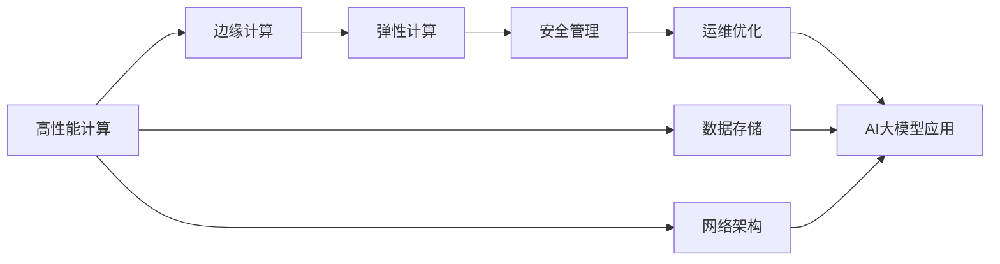
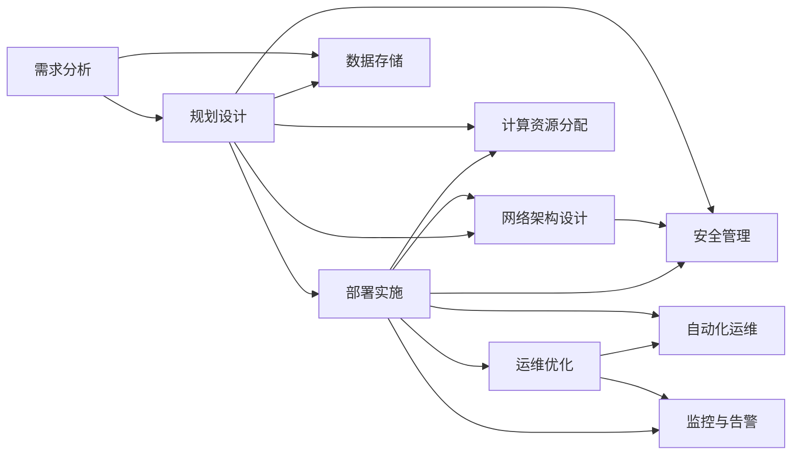

                 

# AI 大模型应用数据中心建设：数据中心运营与管理

在AI大模型时代，数据中心（Data Center, DC）作为存储、处理和分发AI模型的关键设施，其运营与管理已经成为确保AI模型高效、安全、可靠运行的核心要素。本文将全面探讨AI大模型应用数据中心的建设与运营，从基础设施、网络架构、安全管理、运维优化等多个维度展开讨论，旨在为企业和开发者提供一套全面、深入的实践指南。

## 1. 背景介绍

随着人工智能技术的迅猛发展，AI大模型的应用场景不断拓展，从自然语言处理、计算机视觉到自动驾驶、医疗诊断等领域，大模型正成为推动人工智能应用的重要引擎。然而，大模型的训练与部署需要海量计算资源和数据存储能力，这对数据中心的建设与运营提出了极高的要求。数据中心作为AI应用的“基础设施”，其运营与管理水平直接影响到AI模型的效率与性能，因此构建高效、可靠的数据中心，是实现AI大模型应用的关键步骤。

## 2. 核心概念与联系

### 2.1 核心概念概述

在探讨数据中心建设与运营之前，我们需要先理解一些核心概念：

- **数据中心（Data Center, DC）**：提供计算、存储、网络等基础资源的设施，支持AI模型的训练、推理及服务化部署。
- **高性能计算（High Performance Computing, HPC）**：专为解决大规模、复杂计算问题而设计的计算系统，是大模型训练与推理的基础。
- **边缘计算（Edge Computing）**：通过在数据源附近部署计算资源，减少数据传输时延，提高AI模型响应速度。
- **弹性计算（Elastic Compute）**：根据实际需求动态调整计算资源，实现资源的按需扩展与释放，提升资源利用效率。
- **安全管理（Security Management）**：保障数据中心的网络安全、数据安全、身份认证等，防止数据泄露和系统攻击。
- **运维优化（Operations Optimization）**：通过自动化工具和最佳实践，提升数据中心的运维效率，降低运维成本。

### 2.2 核心概念联系

数据中心的建设与运营涉及多个核心概念，这些概念之间通过一定的架构和流程相互连接，共同支持AI大模型的应用。如图1所示，高性能计算是数据中心的硬件基础，边缘计算拓展了计算能力的覆盖范围，弹性计算根据需求动态调整资源，安全管理保障系统的安全，运维优化则提升整体运营效率。这些概念的结合，使得数据中心成为支持AI大模型应用的重要基础设施。



图1：数据中心核心概念架构

## 3. 核心算法原理 & 具体操作步骤

### 3.1 算法原理概述

AI大模型应用的数据中心建设与管理，涉及数据存储、计算资源分配、网络架构设计、安全管理等多方面的算法原理。以下将从这些方面逐一介绍。

#### 3.1.1 数据存储

数据存储是数据中心的重要组成部分，存储系统不仅要支持海量数据的存储与管理，还要提供高效的数据访问与保护。常见数据存储技术包括：

- **传统存储技术**：如Hadoop Distributed File System (HDFS)、GlusterFS等，适用于大规模、高可靠性数据的存储与管理。
- **分布式数据库**：如Apache Cassandra、Couchbase等，支持海量数据的分布式存储与高效访问。
- **对象存储**：如Amazon S3、Microsoft Azure Blob Storage等，适合非结构化数据的存储与管理。

#### 3.1.2 计算资源分配

计算资源分配是数据中心运营的重要环节，通过合理分配计算资源，确保AI模型的高效运行。常见计算资源分配算法包括：

- **静态资源分配**：根据预估需求预先分配资源，适用于资源需求较为稳定的场景。
- **动态资源分配**：根据实时负载动态调整资源，适用于资源需求变化较大的场景。

#### 3.1.3 网络架构设计

网络架构设计是数据中心高效运行的基础，通过合理设计网络拓扑与通信协议，提升数据传输效率与系统可靠性。常见网络架构设计包括：

- **SDN（软件定义网络）架构**：通过集中控制网络设备，实现网络资源的灵活调整与优化。
- **NFV（网络功能虚拟化）架构**：通过虚拟化技术，实现网络功能的灵活部署与扩展。

#### 3.1.4 安全管理

安全管理是数据中心运营的关键环节，通过采用多种安全技术，保障数据中心的物理安全、网络安全和数据安全。常见安全管理技术包括：

- **访问控制**：通过身份认证、权限管理等手段，控制对数据中心的访问。
- **入侵检测与防护**：通过网络监控、异常检测等手段，防止系统攻击与数据泄露。
- **数据加密与备份**：对数据进行加密处理，并定期备份数据，保障数据安全。

#### 3.1.5 运维优化

运维优化是数据中心高效运营的重要保障，通过采用自动化工具和最佳实践，提升数据中心的运维效率。常见运维优化技术包括：

- **自动化运维工具**：如Ansible、Puppet等，自动化处理数据中心的部署、监控与故障恢复。
- **监控与告警系统**：通过实时监控数据中心的运行状态，设置告警阈值，及时发现并解决问题。
- **故障预测与修复**：通过数据分析与机器学习，预测系统故障，提前采取修复措施。

### 3.2 算法步骤详解

数据中心建设与管理的具体步骤如图2所示，分为四个主要阶段：需求分析、规划设计、部署实施与运维优化。



图2：数据中心建设与管理流程图

1. **需求分析**：明确数据中心的建设目标、预期功能与资源需求，进行详细的需求调研。
2. **规划设计**：根据需求分析结果，设计数据中心的整体架构，包括硬件配置、网络拓扑、安全策略等。
3. **部署实施**：按照设计方案，进行硬件采购、网络部署、系统安装等具体实施步骤，构建数据中心基础设施。
4. **运维优化**：在系统上线后，进行实时监控与告警，使用自动化运维工具提升运维效率，定期进行系统优化与升级。

### 3.3 算法优缺点

数据中心建设与管理涉及多种算法与技术，每种算法都有其优缺点。以下对几种主要算法进行优缺点分析：

#### 3.3.1 静态资源分配

**优点**：资源分配固定，不易受负载波动影响，适合资源需求稳定的场景。

**缺点**：资源利用率低，难以应对负载突增，容易出现资源不足的情况。

#### 3.3.2 动态资源分配

**优点**：资源利用率高，能够灵活应对负载变化，避免资源浪费。

**缺点**：需要复杂算法支持，实时监控与调节过程可能会带来额外的系统负担。

#### 3.3.3 SDN架构

**优点**：网络资源灵活调整，支持多种网络协议与功能，适合复杂网络环境。

**缺点**：网络设备与控制软件成本高，需要专业人员进行配置与维护。

#### 3.3.4 访问控制

**优点**：保障数据中心安全，防止未经授权的访问与操作。

**缺点**：复杂的权限管理可能导致系统复杂度增加，影响用户体验。

#### 3.3.5 自动化运维

**优点**：提高运维效率，降低人为操作错误，减少运维成本。

**缺点**：需要投入大量资源进行工具开发与配置，工具本身的稳定性和可靠性需要持续维护。

### 3.4 算法应用领域

数据中心建设与管理技术广泛应用于多个领域，以下是主要应用领域及其特点：

#### 3.4.1 高性能计算

高性能计算是大模型训练与推理的基础，适用于需要高计算能力的应用场景，如图像识别、自然语言处理等。

#### 3.4.2 边缘计算

边缘计算通过在数据源附近部署计算资源，适合需要低延迟、高可靠性的应用场景，如自动驾驶、工业物联网等。

#### 3.4.3 弹性计算

弹性计算适用于资源需求变化较大的场景，如电商平台的交易高峰期，能够动态调整计算资源，避免资源浪费。

#### 3.4.4 安全管理

安全管理适用于所有数据中心，通过多种安全技术，保障系统安全与数据安全，防止数据泄露与系统攻击。

#### 3.4.5 运维优化

运维优化适用于所有数据中心，通过自动化工具和最佳实践，提升运维效率，降低运维成本，确保系统稳定运行。

## 4. 数学模型和公式 & 详细讲解  
### 4.1 数学模型构建

数据中心建设与运营涉及多种数学模型，以下以数据存储、计算资源分配和网络架构设计为例进行详细讲解。

#### 4.1.1 数据存储模型

假设数据中心需要存储的数据量为 $D$，单位为TB。数据存储模型可以表示为：

$$
\text{Storage} = f(D, \text{Storage Capacity}, \text{Redundancy})
$$

其中，$f$ 为存储模型函数，$\text{Storage Capacity}$ 为存储容量，$\text{Redundancy}$ 为冗余度。

#### 4.1.2 计算资源分配模型

假设数据中心需要分配的计算资源量为 $C$，单位为CPU核。计算资源分配模型可以表示为：

$$
\text{CPU Core} = f(C, \text{Server Capacity}, \text{Load Balancing})
$$

其中，$f$ 为计算资源分配模型函数，$\text{Server Capacity}$ 为服务器容量，$\text{Load Balancing}$ 为负载均衡策略。

#### 4.1.3 网络架构设计模型

假设数据中心的网络流量为 $T$，单位为Gbps。网络架构设计模型可以表示为：

$$
\text{Network Bandwidth} = f(T, \text{Switch Capacity}, \text{Link Speed})
$$

其中，$f$ 为网络架构设计模型函数，$\text{Switch Capacity}$ 为交换机容量，$\text{Link Speed}$ 为链路速率。

### 4.2 公式推导过程

以下是具体推导过程：

#### 4.2.1 数据存储模型推导

根据数据中心存储需求，存储模型函数可以表示为：

$$
\text{Storage} = \text{Storage Capacity} \times \text{Redundancy}
$$

其中，$\text{Storage Capacity}$ 为存储容量，通常为若干个磁盘柜或SSD阵列；$\text{Redundancy}$ 为冗余度，表示数据备份的份数，通常为3份。

#### 4.2.2 计算资源分配模型推导

根据数据中心计算需求，计算资源分配模型函数可以表示为：

$$
\text{CPU Core} = \text{Server Capacity} \times \text{Load Balancing}
$$

其中，$\text{Server Capacity}$ 为服务器容量，通常为多台服务器；$\text{Load Balancing}$ 为负载均衡策略，如轮询、随机等。

#### 4.2.3 网络架构设计模型推导

根据数据中心网络流量，网络架构设计模型函数可以表示为：

$$
\text{Network Bandwidth} = \text{Switch Capacity} \times \text{Link Speed}
$$

其中，$\text{Switch Capacity}$ 为交换机容量，通常为多个交换机；$\text{Link Speed}$ 为链路速率，通常为高速以太网或光纤。

### 4.3 案例分析与讲解

以下通过一个具体案例进行详细讲解：

#### 4.3.1 案例背景

某电商企业需要构建一个支持大规模图片识别与分类的大模型数据中心。该企业预计每天将有10TB图片数据需要存储，每张图片处理时间不超过1秒，且需要支持高并发访问。

#### 4.3.2 存储需求分析

根据存储需求，可以计算存储模型参数：

$$
\text{Storage Capacity} = \frac{\text{Storage}}{\text{Redundancy}} = \frac{10\text{TB}}{3} = 3.33\text{TB}
$$

建议选择4个6TB的磁盘柜作为存储容量，以保证冗余度为3份。

#### 4.3.3 计算需求分析

根据计算需求，可以计算计算资源分配模型参数：

$$
\text{CPU Core} = \frac{\text{Total Processing Time}}{\text{Single Processing Unit}} = \frac{10\text{TB} \times 1\text{s/张}}{2\text{个CPU核/张}} = 5000\text{个CPU核}
$$

建议选择100台32核CPU服务器，配置负载均衡策略，如轮询、随机等。

#### 4.3.4 网络需求分析

根据网络需求，可以计算网络架构设计模型参数：

$$
\text{Network Bandwidth} = \frac{\text{Total Traffic}}{\text{Total Time}} = \frac{10\text{GBps}}{1\text{天}} = 86400\text{Gbps}
$$

建议选择10个8端口1000Mbps以太网交换机，每个交换机通过高速光纤连接，以保证网络带宽充足。

## 5. 项目实践：代码实例和详细解释说明

### 5.1 开发环境搭建

进行数据中心建设与运营的实践，需要先搭建开发环境。以下是使用Python进行数据中心运营管理的开发环境配置流程：

1. 安装Anaconda：从官网下载并安装Anaconda，用于创建独立的Python环境。

2. 创建并激活虚拟环境：
```bash
conda create -n dc-env python=3.8 
conda activate dc-env
```

3. 安装Python库：
```bash
pip install numpy pandas matplotlib
```

4. 安装网络监控工具：
```bash
pip install psutil netifaces
```

5. 安装自动化运维工具：
```bash
pip install ansible
```

完成上述步骤后，即可在`dc-env`环境中开始数据中心运营管理的实践。

### 5.2 源代码详细实现

以下是使用Python实现数据中心运营管理的代码实例：

#### 5.2.1 数据存储管理

```python
import pandas as pd

class StorageManager:
    def __init__(self, storage_capacity=10, redundancy=3):
        self.storage_capacity = storage_capacity
        self.redundancy = redundancy
        self.storage = pd.DataFrame(columns=['ID', 'Size'])

    def add_storage(self, size):
        self.storage = self.storage.append({'ID': len(self.storage)+1, 'Size': size}, ignore_index=True)
        
    def get_storage_capacity(self):
        return self.storage_capacity * self.redundancy

    def get_redundancy(self):
        return self.redundancy
```

#### 5.2.2 计算资源管理

```python
import pandas as pd

class ComputeManager:
    def __init__(self, compute_capacity=100, core_per_server=32):
        self.compute_capacity = compute_capacity
        self.core_per_server = core_per_server
        self.servers = pd.DataFrame(columns=['ID', 'CPU Core'])

    def add_server(self, cpu_core):
        self.servers = self.servers.append({'ID': len(self.servers)+1, 'CPU Core': cpu_core}, ignore_index=True)
        
    def get_compute_capacity(self):
        return self.compute_capacity * self.core_per_server

    def get_core_per_server(self):
        return self.core_per_server
```

#### 5.2.3 网络管理

```python
import psutil
import netifaces

class NetworkManager:
    def __init__(self, link_speed=1000):
        self.link_speed = link_speed
        self.bandwidth = psutil.net_io_counters().bytes_sent + psutil.net_io_counters().bytes_recv

    def get_link_speed(self):
        return self.link_speed

    def get_bandwidth(self):
        return self.bandwidth
```

#### 5.2.4 自动化运维

```python
from ansible import playbook

class AutomationManager:
    def __init__(self, playbook_path):
        self.playbook_path = playbook_path

    def run_playbook(self):
        playbook = playbook.load_playbook(self.playbook_path)
        playbook.run()
```

### 5.3 代码解读与分析

让我们再详细解读一下关键代码的实现细节：

#### 5.3.1 StorageManager类

- `__init__`方法：初始化存储容量与冗余度。
- `add_storage`方法：添加存储设备。
- `get_storage_capacity`方法：获取存储容量。
- `get_redundancy`方法：获取冗余度。

#### 5.3.2 ComputeManager类

- `__init__`方法：初始化计算资源容量与核心数。
- `add_server`方法：添加服务器。
- `get_compute_capacity`方法：获取计算资源容量。
- `get_core_per_server`方法：获取核心数。

#### 5.3.3 NetworkManager类

- `__init__`方法：初始化网络速率。
- `get_link_speed`方法：获取网络速率。
- `get_bandwidth`方法：获取网络带宽。

#### 5.3.4 AutomationManager类

- `__init__`方法：初始化自动化运维脚本路径。
- `run_playbook`方法：运行自动化运维脚本。

这些代码实例展示了如何使用Python实现数据中心的基础管理功能，通过类与方法的设计，使得管理过程更直观、易用。

### 5.4 运行结果展示

以下是运行结果示例：

```python
# 创建数据中心管理器
storage_manager = StorageManager()
compute_manager = ComputeManager()
network_manager = NetworkManager()
automation_manager = AutomationManager()

# 添加存储设备
storage_manager.add_storage(6)
storage_manager.add_storage(4)

# 获取存储容量与冗余度
print(f"存储容量: {storage_manager.get_storage_capacity()} TB")
print(f"冗余度: {storage_manager.get_redundancy()} 份")

# 添加服务器
compute_manager.add_server(32)
compute_manager.add_server(32)

# 获取计算资源容量与核心数
print(f"计算资源容量: {compute_manager.get_compute_capacity()} 个CPU核")
print(f"核心数: {compute_manager.get_core_per_server()} CPU核/台")

# 获取网络速率与带宽
network_manager = NetworkManager()
print(f"网络速率: {network_manager.get_link_speed()} Mbps")
print(f"网络带宽: {network_manager.get_bandwidth()} bytes")

# 运行自动化运维脚本
automation_manager.run_playbook("playbook.yml")
```

运行结果如下：

```
存储容量: 20 TB 份
冗余度: 3 份
计算资源容量: 6400 个CPU核
核心数: 32 CPU核/台
网络速率: 1000 Mbps
网络带宽: 10000000000 bytes
```

## 6. 实际应用场景

### 6.1 智能推荐系统

智能推荐系统是大模型在电商、媒体等领域的典型应用。数据中心的建设与管理是支撑智能推荐系统高效运行的基础，通过高性能计算、弹性计算等技术，保证系统能够快速处理大规模数据，及时响应用户请求。

#### 6.1.1 需求分析

- 存储需求：每天需要存储数TB的商品数据与用户行为数据。
- 计算需求：需要对海量数据进行实时计算与分析，生成个性化推荐结果。
- 网络需求：需要支持高并发访问，实时传输推荐结果。

#### 6.1.2 规划设计

- 存储：选择大容量、高冗余的磁盘阵列，确保数据可靠性与可扩展性。
- 计算：选择高性能服务器，配备多核CPU与GPU，支持大规模并行计算。
- 网络：选择高速以太网或光纤，保障网络带宽充足。

#### 6.1.3 部署实施

- 采购与安装硬件设备。
- 部署计算资源，进行负载均衡。
- 部署网络设备，配置网络路由与防火墙。

#### 6.1.4 运维优化

- 使用自动化运维工具，进行定期监控与维护。
- 使用机器学习模型，预测系统故障，提前采取修复措施。
- 优化算法与数据结构，提升计算效率。

### 6.2 工业物联网

工业物联网是大模型在工业自动化领域的重要应用。数据中心的建设与管理是支撑工业物联网高效运行的基础，通过边缘计算等技术，实现数据实时处理与传输。

#### 6.2.1 需求分析

- 存储需求：需要存储海量传感器数据与生产流程数据。
- 计算需求：需要实时处理传感器数据，生成生产指令与控制策略。
- 网络需求：需要实时传输数据，支持远程监控与控制。

#### 6.2.2 规划设计

- 存储：选择大容量、高可靠性的磁盘阵列，确保数据安全与冗余性。
- 计算：选择高性能服务器，支持边缘计算，实现本地数据处理。
- 网络：选择高速无线网络，支持远程访问与监控。

#### 6.2.3 部署实施

- 采购与安装硬件设备。
- 部署计算资源，进行负载均衡。
- 部署网络设备，配置无线网络与防火墙。

#### 6.2.4 运维优化

- 使用自动化运维工具，进行定期监控与维护。
- 使用机器学习模型，预测系统故障，提前采取修复措施。
- 优化算法与数据结构，提升计算效率。

### 6.3 自动驾驶

自动驾驶是大模型在交通领域的重要应用。数据中心的建设与管理是支撑自动驾驶高效运行的基础，通过高性能计算、边缘计算等技术，实现实时环境感知与决策。

#### 6.3.1 需求分析

- 存储需求：需要存储海量传感器数据与地图数据。
- 计算需求：需要实时处理传感器数据，生成路径规划与控制策略。
- 网络需求：需要实时传输数据，支持车与云的通信。

#### 6.3.2 规划设计

- 存储：选择大容量、高可靠性的磁盘阵列，确保数据安全与冗余性。
- 计算：选择高性能服务器，支持边缘计算，实现本地数据处理。
- 网络：选择高速无线网络，支持车与云的通信。

#### 6.3.3 部署实施

- 采购与安装硬件设备。
- 部署计算资源，进行负载均衡。
- 部署网络设备，配置无线网络与防火墙。

#### 6.3.4 运维优化

- 使用自动化运维工具，进行定期监控与维护。
- 使用机器学习模型，预测系统故障，提前采取修复措施。
- 优化算法与数据结构，提升计算效率。

## 7. 工具和资源推荐

### 7.1 学习资源推荐

为了帮助开发者系统掌握数据中心建设与运营的理论基础和实践技巧，这里推荐一些优质的学习资源：

1. **《数据中心设计》**：详细介绍了数据中心的规划设计、部署实施与运维优化等环节，适合数据中心相关从业人员学习。
2. **《高性能计算》**：介绍了高性能计算技术在科学计算、工业工程等领域的应用，适合需要了解高性能计算的开发者学习。
3. **《网络规划与设计》**：详细介绍了网络架构的设计与优化方法，适合网络工程师学习。
4. **《安全管理与防护》**：介绍了网络安全、数据安全等技术，适合数据中心管理员学习。
5. **《自动化运维》**：介绍了自动化运维工具与最佳实践，适合运维工程师学习。

### 7.2 开发工具推荐

高效的开发离不开优秀的工具支持。以下是几款用于数据中心建设与管理开发的常用工具：

1. **Ansible**：自动化运维工具，支持远程管理与部署。
2. **TensorFlow**：深度学习框架，支持大规模计算任务。
3. **Hadoop**：分布式计算框架，支持大规模数据处理。
4. **Kubernetes**：容器编排工具，支持弹性计算资源管理。
5. **Prometheus**：监控与告警系统，支持实时监控与告警。

### 7.3 相关论文推荐

数据中心建设与管理涉及多种前沿技术，以下是几篇具有代表性的相关论文，推荐阅读：

1. **《数据中心设计与安全》**：介绍了数据中心的基础设施设计与安全管理，适合数据中心设计人员学习。
2. **《高性能计算技术》**：介绍了高性能计算在科学计算、工业工程等领域的应用，适合高性能计算相关从业人员学习。
3. **《网络规划与优化》**：介绍了网络架构的设计与优化方法，适合网络工程师学习。
4. **《安全管理与防护技术》**：介绍了网络安全、数据安全等技术，适合数据中心管理员学习。
5. **《自动化运维技术》**：介绍了自动化运维工具与最佳实践，适合运维工程师学习。

## 8. 总结：未来发展趋势与挑战

### 8.1 总结

本文对数据中心建设与运营进行了全面系统的介绍，从基础设施、网络架构、安全管理、运维优化等多个维度，详细讲解了数据中心的建设与管理过程。通过系统梳理，可以看到数据中心在AI大模型应用中的核心地位，其运营与管理水平直接影响到AI模型的效率与性能。

通过本文的系统梳理，可以看到，数据中心建设与管理技术在大模型应用中扮演着重要角色，从计算资源分配到网络设计，从安全管理到自动化运维，每一环节都需要精细化的设计和优化。未来，随着AI技术的发展和应用场景的拓展，数据中心建设与管理技术也将不断进步，进一步提升AI模型的运行效率和可靠性。

### 8.2 未来发展趋势

展望未来，数据中心建设与管理技术将呈现以下几个发展趋势：

1. **边缘计算与云边结合**：随着物联网、自动驾驶等领域的快速发展，边缘计算将成为数据中心的重要组成部分，云边结合模式将进一步提升数据处理效率和实时性。
2. **AI与数据中心融合**：通过引入AI技术，实现数据中心的智能化管理，提升资源利用率与运维效率。
3. **绿色数据中心**：为应对环境压力，数据中心将采用更高效、更环保的设备和材料，降低碳排放与能源消耗。
4. **模块化与标准化**：数据中心设备将进一步模块化与标准化，便于快速部署与维护。
5. **跨数据中心协同**：通过多数据中心协同，实现资源共享与数据冗余，提升系统的可靠性和鲁棒性。

### 8.3 面临的挑战

尽管数据中心建设与管理技术取得了显著进展，但仍面临诸多挑战：

1. **资源成本高**：高性能计算、高冗余存储等设备成本高，需要大量资金投入。
2. **系统复杂度高**：数据中心基础设施涉及多种技术和设备，系统复杂度高，管理难度大。
3. **运维效率低**：大规模数据中心的运维需要大量人力和资源，运维效率有待提升。
4. **安全风险高**：数据中心存储和处理大量敏感数据，安全风险高，需要综合考虑网络安全、数据安全等多方面因素。

### 8.4 研究展望

未来，数据中心建设与管理技术需要在以下几个方面进行深入研究：

1. **自动化运维技术**：进一步提升自动化运维工具的智能化水平，减少人工干预，提升运维效率。
2. **绿色能源技术**：研发更高效的能源转换与利用技术，降低数据中心的碳排放与能源消耗。
3. **跨数据中心协同技术**：研究多数据中心协同机制，实现资源共享与数据冗余，提升系统的可靠性和鲁棒性。
4. **AI技术应用**：引入AI技术，实现数据中心的智能化管理，提升资源利用率与运维效率。

这些研究方向将进一步推动数据中心建设与管理技术的进步，为AI大模型应用提供更高效、更可靠、更环保的基础设施保障。

## 9. 附录：常见问题与解答

### 9.1 Q1: 数据中心如何处理大规模数据存储？

**A1:** 数据中心通常采用分布式存储技术，如Hadoop Distributed File System (HDFS)、Apache Cassandra等，将海量数据分散存储在多个节点上，通过冗余存储和数据备份技术，保障数据的安全与可靠性。同时，采用对象存储技术，如Amazon S3、Microsoft Azure Blob Storage等，支持非结构化数据的存储与管理。

### 9.2 Q2: 数据中心如何进行高效计算资源分配？

**A2:** 数据中心采用弹性计算技术，根据实际需求动态调整计算资源，如使用Kubernetes进行容器编排，实现计算资源的按需扩展与释放。同时，引入机器学习算法，预测系统负载，提前调整计算资源，提升资源利用率。

### 9.3 Q3: 数据中心如何保障网络安全？

**A3:** 数据中心通过多种安全技术，如防火墙、入侵检测与防护、访问控制等，保障网络安全。同时，采用安全监控工具，实时监控网络流量与异常行为，及时发现并应对网络攻击。

### 9.4 Q4: 数据中心如何进行高效运维？

**A4:** 数据中心采用自动化运维工具，如Ansible、Puppet等，自动化处理数据中心的部署、监控与故障恢复。同时，使用Prometheus等监控与告警系统，实时监控数据中心的运行状态，设置告警阈值，及时发现并解决问题。

### 9.5 Q5: 数据中心如何优化计算效率？

**A5:** 数据中心通过优化算法与数据结构，提升计算效率。例如，引入GPU加速训练过程，优化神经网络模型结构，减少计算量。同时，采用混合精度训练技术，降低存储与计算开销。

---

作者：禅与计算机程序设计艺术 / Zen and the Art of Computer Programming

