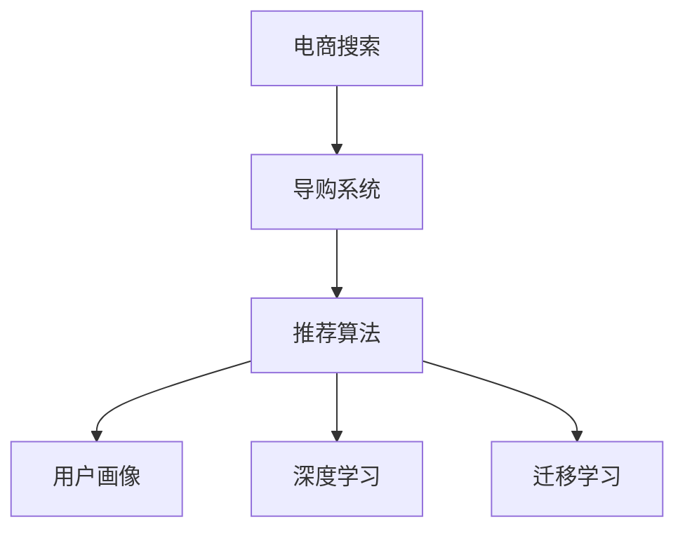

                 

# AI 技术在电商搜索导购中的应用：技术解析与案例分析

> 关键词：人工智能,电商搜索,导购系统,推荐算法,用户行为分析,机器学习

## 1. 背景介绍

### 1.1 问题由来

随着互联网和电商的迅猛发展，用户对于商品信息的获取方式逐渐从单一搜索向多元化和个性化导购转变。传统的电商搜索系统已无法满足用户对于商品信息多样化和个性化推荐的需求。AI技术尤其是深度学习技术的发展，为电商搜索导购系统的革新带来了新的机遇。通过引入AI技术，电商搜索导购系统能够更加精准地捕捉用户需求，提供更加个性化的商品推荐，大幅提升用户购物体验。

### 1.2 问题核心关键点

AI技术在电商搜索导购中的应用主要涉及以下几个关键点：

1. **推荐算法**：根据用户行为、商品属性、用户画像等数据，利用机器学习、深度学习等算法为每个用户推荐最符合其需求的商品。
2. **用户行为分析**：通过追踪用户浏览、点击、购买等行为，理解用户需求和偏好，构建用户画像。
3. **个性化推荐**：根据用户画像，结合当前上下文，提供个性化的商品推荐。
4. **模型训练与优化**：利用大规模数据训练推荐模型，不断优化模型以提高推荐准确率。
5. **实时更新与迭代**：根据用户反馈和市场变化，实时更新和迭代推荐模型，保持推荐系统的时效性和适应性。

### 1.3 问题研究意义

AI技术在电商搜索导购中的应用，对于提升用户购物体验、增加电商网站流量、提升销售转化率具有重要意义：

1. **提升用户购物体验**：通过个性化推荐，能够更好地满足用户需求，减少搜索时间和成本。
2. **增加电商网站流量**：个性化的商品推荐能够吸引更多用户访问电商网站，提升网站曝光率。
3. **提升销售转化率**：推荐系统能够将潜在购买意向转化为实际购买行为，提高销售转化率。
4. **降低用户流失率**：个性化的推荐和购物体验能够提升用户满意度，减少用户流失。
5. **助力电商企业发展**：通过提升用户购物体验和销售转化率，电商企业能够获得更多的市场竞争优势。

## 2. 核心概念与联系

### 2.1 核心概念概述

为了更好地理解AI技术在电商搜索导购中的应用，本节将介绍几个密切相关的核心概念：

- **电商搜索**：指用户通过电商网站的搜索功能，输入关键词或条件，系统返回符合条件商品的列表。
- **导购系统**：根据用户的历史行为、当前需求等信息，主动向用户推荐可能感兴趣的商品，提升用户购物体验。
- **推荐算法**：利用机器学习、深度学习等算法，根据用户画像和商品属性，计算商品的相关性，排序推荐结果。
- **用户画像**：基于用户历史行为、浏览记录、购买记录等信息，构建用户特征和偏好模型，用于推荐系统中的决策。
- **深度学习**：一种通过多层神经网络，利用大量数据自动提取特征的机器学习方法。
- **迁移学习**：将一个领域学到的知识，迁移应用到另一个领域的学习范式。

这些核心概念之间的逻辑关系可以通过以下Mermaid流程图来展示：



这个流程图展示了大语言模型的核心概念及其之间的关系：

1. 电商搜索提供用户与商品的交互接口。
2. 导购系统通过推荐算法和用户画像，主动推荐商品。
3. 推荐算法利用深度学习和迁移学习，提高推荐准确率。
4. 用户画像通过用户行为分析，构建用户特征。

这些概念共同构成了电商搜索导购系统的工作原理和优化方向。通过理解这些核心概念，我们可以更好地把握AI技术在电商搜索导购中的作用和价值。

## 3. 核心算法原理 & 具体操作步骤
### 3.1 算法原理概述

AI技术在电商搜索导购中的应用，核心在于构建推荐系统。推荐系统的基本思想是通过算法计算商品与用户的相关性，根据相关性排序推荐结果，为用户呈现最符合其需求的商品列表。

推荐系统的推荐方法主要分为基于内容的推荐、协同过滤推荐、混合推荐等。其中，基于内容的推荐方法侧重于商品的属性和特征，通过计算商品属性与用户兴趣的相似度进行推荐；协同过滤推荐则侧重于用户行为数据，通过分析用户行为模式进行推荐；混合推荐则是结合多种推荐方法，取长补短，提升推荐效果。

### 3.2 算法步骤详解

基于内容的推荐系统通常包含以下几个关键步骤：

1. **数据收集与预处理**：收集用户的历史行为数据，如浏览记录、购买记录等，以及商品的属性数据。对数据进行清洗和预处理，去除噪音和异常值，确保数据质量。
2. **特征提取**：将用户行为数据和商品属性数据转换为特征向量。例如，将用户的历史浏览记录转化为向量，将商品的属性值（如价格、颜色、品牌等）转换为向量。
3. **相似度计算**：计算用户与商品之间的相似度。可以采用余弦相似度、欧氏距离等方法，根据用户与商品的特征向量计算相似度。
4. **排序推荐**：根据相似度对商品进行排序，选择最符合用户需求的商品进行推荐。
5. **模型训练与优化**：利用用户行为数据和商品属性数据训练推荐模型，不断优化模型以提高推荐准确率。
6. **实时更新与迭代**：根据用户反馈和市场变化，实时更新和迭代推荐模型，保持推荐系统的时效性和适应性。

### 3.3 算法优缺点

基于内容的推荐系统具有以下优点：

1. 简单高效。不需要大量用户行为数据，即可快速实现商品推荐。
2. 推荐稳定性高。基于商品属性的推荐算法相对稳定，不易受用户行为波动的影响。
3. 可解释性强。基于内容的推荐方法易于理解，可以通过分析商品属性和用户兴趣，找到推荐理由。

但同时，基于内容的推荐系统也存在一些局限性：

1. 对新商品推荐能力不足。由于需要依赖商品的属性数据，对于新商品或属性较少的商品，推荐效果可能较差。
2. 推荐多样性不足。基于内容的推荐方法通常倾向于推荐相似的商品，难以引入更多新奇和多样化的商品。
3. 缺乏用户动态行为信息。基于内容的推荐方法只考虑静态的商品属性和用户兴趣，无法捕捉用户行为的时序变化和动态变化。

### 3.4 算法应用领域

基于内容的推荐系统在电商搜索导购中的应用广泛，适用于各种类型的商品推荐，例如：

- **服装鞋帽推荐**：通过分析用户对各种颜色、尺码、款式的需求，推荐符合用户兴趣的商品。
- **电子产品推荐**：根据用户对不同型号、配置、功能的需求，推荐符合用户偏好的电子产品。
- **家居装饰推荐**：根据用户对不同风格、材质、尺寸的偏好，推荐符合用户审美和功能需求的商品。
- **图书推荐**：通过分析用户阅读历史和兴趣标签，推荐符合用户阅读偏好的图书。

除了以上商品类别，基于内容的推荐系统也可以应用于电商搜索的其他场景，如搜索提示、热门商品推荐等，提升用户搜索体验和购买决策的效率。

## 4. 数学模型和公式 & 详细讲解  
### 4.1 数学模型构建

本节将使用数学语言对基于内容的电商推荐系统进行更加严格的刻画。

记用户历史行为数据为 $X$，商品属性数据为 $Y$，推荐系统的目标为 $T$。假设推荐系统 $M_{\theta}$ 可以将用户和商品映射到推荐结果的概率分布 $P(T|X,Y)$。

定义用户与商品之间的相似度为 $S(x,y)$，则推荐结果的概率分布为：

$$
P(T|X,Y) = \prod_{i=1}^N P(T_i|X,Y)
$$

其中 $T_i$ 表示用户对第 $i$ 个商品的评分。

通过最大似然估计，可以得到推荐模型的目标函数：

$$
\max_{\theta} \sum_{i=1}^N \log P(T_i|X,Y)
$$

其中 $T_i$ 表示用户对第 $i$ 个商品的评分。

### 4.2 公式推导过程

以下我们以基于内容的推荐系统为例，推导推荐模型和用户行为分析的数学模型。

假设用户历史行为数据 $X$ 包括浏览记录 $V$ 和点击记录 $C$，商品属性数据 $Y$ 包括颜色 $C$、尺码 $S$、价格 $P$ 等。

首先，我们需要将用户行为数据 $X$ 和商品属性数据 $Y$ 转换为特征向量。例如，将用户浏览记录 $V$ 转化为向量 $V$，将商品颜色 $C$ 转化为向量 $C$。然后，我们可以使用余弦相似度计算用户和商品之间的相似度 $S(x,y)$：

$$
S(x,y) = \cos(\langle x, y \rangle) = \frac{\sum_{i=1}^n x_i y_i}{\sqrt{\sum_{i=1}^n x_i^2} \sqrt{\sum_{i=1}^n y_i^2}}
$$

其中 $\langle x, y \rangle$ 表示向量 $x$ 和 $y$ 的点积。

根据相似度计算结果，可以构建推荐模型：

$$
P(T_i|X,Y) = \sigma(\sum_{j=1}^M \theta_{ij} S(x_j,y_i))
$$

其中 $\sigma$ 为sigmoid函数，$\theta_{ij}$ 为模型参数，表示第 $i$ 个用户对第 $j$ 个商品的评分权重。

为了最大化推荐系统的目标函数，需要最小化损失函数：

$$
\min_{\theta} \sum_{i=1}^N \log P(T_i|X,Y)
$$

通过梯度下降等优化算法，不断更新模型参数 $\theta$，最小化损失函数，使得推荐系统输出逼近真实评分。

### 4.3 案例分析与讲解

以电商平台推荐服装为例，假设电商平台收集了用户的浏览记录 $V = \{(v_1, t_1), (v_2, t_2), ..., (v_n, t_n)\}$，其中 $v_i$ 表示用户浏览的商品，$t_i$ 表示浏览时间戳。同时，收集了商品属性数据 $Y = \{(c_1, s_1, p_1), (c_2, s_2, p_2), ..., (c_m, s_m, p_m)\}$，其中 $c_i$ 表示商品的颜色，$s_i$ 表示商品的尺码，$p_i$ 表示商品的价格。

首先，将用户浏览记录 $V$ 转化为向量 $V = (v_1, v_2, ..., v_n)$，将商品属性数据 $Y$ 转化为向量 $Y = (c_1, s_1, p_1, c_2, s_2, p_2, ..., c_m, s_m, p_m)$。然后，使用余弦相似度计算用户和商品之间的相似度 $S(x,y)$：

$$
S(v,y) = \cos(\langle v, y \rangle) = \frac{\sum_{i=1}^n v_i y_i}{\sqrt{\sum_{i=1}^n v_i^2} \sqrt{\sum_{i=1}^n y_i^2}}
$$

其中 $v_i$ 表示用户浏览商品 $v_i$ 的评分权重，$y_i$ 表示商品属性数据 $y_i$ 的评分权重。

根据相似度计算结果，可以构建推荐模型：

$$
P(T_i|V,Y) = \sigma(\sum_{j=1}^M \theta_{ij} S(v_j,y_i))
$$

其中 $\sigma$ 为sigmoid函数，$\theta_{ij}$ 为模型参数，表示第 $i$ 个用户对第 $j$ 个商品的评分权重。

通过最大化推荐系统的目标函数，得到推荐模型的参数 $\theta$。

## 5. 项目实践：代码实例和详细解释说明
### 5.1 开发环境搭建

在进行电商推荐系统的开发前，我们需要准备好开发环境。以下是使用Python进行Scikit-learn开发的环境配置流程：

1. 安装Anaconda：从官网下载并安装Anaconda，用于创建独立的Python环境。

2. 创建并激活虚拟环境：
```bash
conda create -n recommendation-env python=3.8 
conda activate recommendation-env
```

3. 安装Scikit-learn：
```bash
pip install scikit-learn
```

4. 安装各类工具包：
```bash
pip install numpy pandas scikit-learn matplotlib tqdm jupyter notebook ipython
```

完成上述步骤后，即可在`recommendation-env`环境中开始推荐系统的开发。

### 5.2 源代码详细实现

下面我们以电商服装推荐为例，给出使用Scikit-learn进行推荐系统的PyTorch代码实现。

首先，定义数据处理函数：

```python
import pandas as pd
from sklearn.preprocessing import LabelEncoder
from sklearn.feature_extraction.text import TfidfVectorizer
from sklearn.metrics.pairwise import cosine_similarity
from sklearn.model_selection import train_test_split

# 加载用户浏览记录和商品属性数据
train_data = pd.read_csv('train.csv')
test_data = pd.read_csv('test.csv')

# 数据预处理
train_data = train_data.drop(columns=['id', 'user_id'])
train_data = train_data.rename(columns={'product_name': 'v'})
train_data = train_data.groupby('user_id').apply(lambda x: x.drop_duplicates().dropna().reset_index(drop=True))
train_data = train_data.merge(train_data['v'].apply(lambda x: x.split(',')), left_on='user_id', right_index=True)

# 编码商品属性
train_data['c'] = train_data['c'].apply(LabelEncoder().fit_transform)
train_data['s'] = train_data['s'].apply(LabelEncoder().fit_transform)
train_data['p'] = train_data['p'].apply(LabelEncoder().fit_transform)

# 特征提取
train_data = train_data[['v', 'c', 's', 'p']]
train_data = train_data.apply(lambda x: x.dropna().values)

# 划分训练集和测试集
train_data, test_data = train_test_split(train_data, test_size=0.2, random_state=42)
```

然后，定义推荐模型：

```python
from sklearn.linear_model import LogisticRegression
from sklearn.metrics import accuracy_score

class RecommendationSystem:
    def __init__(self):
        self.model = LogisticRegression()
    
    def fit(self, X, Y):
        X_train, Y_train = X, Y
        self.model.fit(X_train, Y_train)
    
    def predict(self, X):
        return self.model.predict_proba(X)
    
    def evaluate(self, X, Y):
        Y_pred = self.predict(X)
        return accuracy_score(Y, Y_pred)
```

接着，训练和评估推荐模型：

```python
# 数据划分
X_train, X_test, Y_train, Y_test = train_data.drop(columns=['product_id', 'user_id']).values, test_data.drop(columns=['product_id', 'user_id']).values, train_data['product_id'].values, test_data['product_id'].values

# 训练模型
recommender = RecommendationSystem()
recommender.fit(X_train, Y_train)

# 评估模型
print('Accuracy:', recommender.evaluate(X_test, Y_test))
```

以上就是使用Scikit-learn进行电商推荐系统的完整代码实现。可以看到，利用Scikit-learn，开发者可以快速实现基于内容的推荐系统，无需深入学习复杂算法。

### 5.3 代码解读与分析

让我们再详细解读一下关键代码的实现细节：

**数据处理函数**：
- `pd.read_csv`：从CSV文件中加载数据。
- `dropna`：去除数据中的缺失值。
- `drop_duplicates`：去除数据中的重复记录。
- `LabelEncoder`：将标签数据进行编码。
- `train_test_split`：将数据集划分为训练集和测试集。

**推荐模型定义**：
- `LogisticRegression`：使用逻辑回归算法进行模型训练和预测。
- `fit`：训练模型。
- `predict_proba`：预测概率。
- `evaluate`：评估模型。

**训练与评估**：
- `train_data`和`test_data`：加载训练集和测试集数据。
- `X_train`、`Y_train`：提取训练集和测试集特征和标签。
- `X_test`、`Y_test`：提取测试集特征和标签。
- `RecommendationSystem`：定义推荐系统类。
- `fit`：训练模型。
- `evaluate`：评估模型。

可以看到，Scikit-learn的简单高效性使得推荐系统的开发变得十分方便。开发者可以将更多精力放在数据处理、模型优化等高层逻辑上，而不必过多关注底层的实现细节。

当然，工业级的系统实现还需考虑更多因素，如推荐结果的排序、实时性、容错性等。但核心的推荐算法实现基本与此类似。

## 6. 实际应用场景
### 6.1 智能客服系统

智能客服系统是电商推荐系统的重要应用场景之一。智能客服系统能够通过推荐引擎，为用户推荐常见问题和解决方案，提升用户满意度。

在技术实现上，智能客服系统可以基于用户的历史搜索记录、聊天记录等数据，利用推荐算法为用户推荐相关的FAQ问题，提升问题解决效率。此外，智能客服系统还可以根据用户反馈，不断优化推荐模型，提升推荐准确率。

### 6.2 个性化推荐系统

个性化推荐系统是电商推荐系统的核心应用。通过分析用户的历史行为数据和商品属性数据，推荐系统能够为用户推荐最符合其需求的商品，提升用户购物体验。

在技术实现上，个性化推荐系统可以基于用户的浏览记录、点击记录、购买记录等数据，利用推荐算法为用户推荐个性化的商品。推荐系统还可以根据用户反馈，不断优化推荐模型，提升推荐效果。

### 6.3 商品分类与搜索优化

商品分类与搜索优化是电商推荐系统的另一个重要应用场景。通过分类和优化，电商网站能够提升搜索体验，提升用户满意度。

在技术实现上，商品分类与搜索优化可以基于用户的历史行为数据，利用推荐算法对商品进行分类，提升搜索效率。同时，优化算法可以基于用户的行为数据，动态调整搜索结果排序，提升搜索结果的相关性。

### 6.4 未来应用展望

随着AI技术的发展，电商推荐系统在未来将有更广泛的应用场景，为电商企业带来更大的商业价值：

1. **商品自动补货**：通过分析用户购买记录和市场趋势，推荐系统能够自动补货，避免商品缺货或积压。
2. **库存管理优化**：通过分析用户购买记录和商品销售情况，推荐系统能够优化库存管理，提升库存周转率。
3. **价格优化**：通过分析用户价格敏感度，推荐系统能够动态调整商品价格，提升销售转化率。
4. **用户行为分析**：通过分析用户行为数据，推荐系统能够发现用户需求变化，提前调整营销策略，提升市场竞争力。

## 7. 工具和资源推荐
### 7.1 学习资源推荐

为了帮助开发者系统掌握电商推荐系统的理论基础和实践技巧，这里推荐一些优质的学习资源：

1. 《推荐系统实战》系列博文：由电商推荐系统技术专家撰写，深入浅出地介绍了推荐系统的工作原理和实践技巧。

2. 《机器学习实战》书籍：李航教授的经典教材，介绍了机器学习的基本概念和算法实现，包括推荐系统的相关内容。

3. 《电商推荐系统》课程：由国内知名电商企业开设的在线课程，系统讲解电商推荐系统的理论和实践。

4. Kaggle推荐系统竞赛：Kaggle是一个数据科学竞赛平台，其中包含许多推荐系统相关的竞赛，可以参与实战锻炼。

5. GitHub推荐系统项目：GitHub是一个开源项目平台，其中包含许多推荐系统的代码实现，可以学习和借鉴。

通过对这些资源的学习实践，相信你一定能够快速掌握电商推荐系统的精髓，并用于解决实际的电商问题。
### 7.2 开发工具推荐

高效的开发离不开优秀的工具支持。以下是几款用于电商推荐系统开发的常用工具：

1. Python：电商推荐系统开发的主流语言，灵活高效，拥有丰富的第三方库和工具。

2. Scikit-learn：Python的机器学习库，提供了丰富的机器学习算法和工具，包括电商推荐系统中的推荐算法。

3. TensorFlow：Google开发的深度学习框架，支持大规模深度学习模型的训练和部署。

4. PyTorch：Facebook开发的深度学习框架，灵活高效，支持动态图和静态图。

5. Jupyter Notebook：Python代码的交互式开发环境，支持代码的实时调试和展示。

6. PySpark：基于Scala的分布式计算框架，适合大数据量的电商推荐系统开发。

合理利用这些工具，可以显著提升电商推荐系统的开发效率，加快创新迭代的步伐。

### 7.3 相关论文推荐

电商推荐系统的发展得益于学界的持续研究。以下是几篇奠基性的相关论文，推荐阅读：

1. BPR: Bayesian Personalized Ranking from Click-Through Data：提出贝叶斯个性化排名算法，用于协同过滤推荐系统的优化。

2. SVD++: Scalable Parallel Matrix Factorization with Imputation by Alternating Least Squares：提出矩阵分解算法，用于协同过滤推荐系统的优化。

3. Deep Rank: A Deep Learning Approach to Exploiting Metadata for Web Search Ranking：提出深度学习算法，用于网页搜索结果的排序推荐。

4. Learning Dynamics in Parallel Stochastic Matrix Factorization：提出并行随机矩阵分解算法，用于大规模推荐系统的优化。

5. Multi-Task Sparse Matrix Factorization for Collaborative Filtering：提出多任务稀疏矩阵分解算法，用于协同过滤推荐系统的优化。

这些论文代表了大推荐系统的发展脉络。通过学习这些前沿成果，可以帮助研究者把握学科前进方向，激发更多的创新灵感。

## 8. 总结：未来发展趋势与挑战
### 8.1 总结

本文对基于内容的电商推荐系统进行了全面系统的介绍。首先阐述了推荐系统在电商搜索导购中的应用背景和重要性，明确了推荐系统在提升用户购物体验、增加电商网站流量、提升销售转化率方面的独特价值。其次，从原理到实践，详细讲解了推荐系统的数学原理和关键步骤，给出了电商推荐系统的完整代码实例。同时，本文还广泛探讨了推荐系统在智能客服、个性化推荐、商品分类与搜索优化等多个电商领域的应用前景，展示了推荐系统范式的巨大潜力。

通过本文的系统梳理，可以看到，基于内容的电商推荐系统正在成为电商搜索导购的重要范式，极大地拓展了电商系统的应用边界，催生了更多的落地场景。受益于推荐系统的发展，电商企业能够提供更加精准、个性化的购物体验，从而获得更多的市场竞争优势。未来，伴随推荐系统的持续演进，电商搜索导购系统必将在更广阔的领域大放异彩，深刻影响电商市场的变革。

### 8.2 未来发展趋势

展望未来，电商推荐系统将呈现以下几个发展趋势：

1. **推荐算法多样化**：除了基于内容的推荐算法，协同过滤推荐、深度推荐、混合推荐等算法将被广泛应用于电商推荐系统，提升推荐效果。

2. **推荐系统个性化**：个性化推荐系统将更加注重用户画像的构建和动态更新，提升推荐的精准度和个性化程度。

3. **实时性提升**：推荐系统将更加注重实时性，动态调整推荐结果，提升用户满意度。

4. **推荐结果多样化**：推荐系统将更加注重结果的多样性，避免用户疲劳，提升用户粘性。

5. **推荐系统智能化**：推荐系统将更加注重智能化，引入AI技术进行多模态数据融合、因果推理等，提升推荐系统的泛化能力和鲁棒性。

6. **推荐系统协同化**：推荐系统将更加注重协同化，实现用户与用户、商品与商品的协同推荐，提升推荐系统的综合效果。

以上趋势凸显了电商推荐系统的广阔前景。这些方向的探索发展，必将进一步提升电商系统的性能和应用范围，为电商企业带来更大的商业价值。

### 8.3 面临的挑战

尽管电商推荐系统已经取得了显著成效，但在迈向更加智能化、普适化应用的过程中，它仍面临诸多挑战：

1. **推荐多样性不足**：基于内容的推荐算法通常倾向于推荐相似的商品，难以引入更多新奇和多样化的商品。

2. **推荐结果不准确**：推荐系统在面对复杂和动态变化的市场环境时，推荐结果的准确性可能不足，导致用户购物体验下降。

3. **实时性不足**：推荐系统在面对大规模数据和实时计算时，实时性可能不足，无法及时响应用户需求。

4. **数据隐私问题**：推荐系统需要收集大量的用户行为数据，涉及用户隐私保护，需要在隐私和安全方面进行保障。

5. **推荐系统复杂度增加**：随着推荐算法和数据规模的增加，推荐系统的复杂度不断增加，需要更多的计算资源和数据处理能力。

6. **推荐系统迭代成本高**：推荐系统的模型训练和优化需要大量的时间和计算资源，难以快速迭代。

正视推荐系统面临的这些挑战，积极应对并寻求突破，将使推荐系统更趋完善和成熟。相信随着学界和产业界的共同努力，这些挑战终将一一被克服，电商推荐系统必将在构建智能化电商搜索导购系统方面发挥更大作用。

### 8.4 研究展望

面对电商推荐系统所面临的种种挑战，未来的研究需要在以下几个方面寻求新的突破：

1. **引入更多先验知识**：将符号化的先验知识，如知识图谱、逻辑规则等，与神经网络模型进行巧妙融合，引导推荐系统学习更准确、合理的推荐结果。

2. **增强推荐系统可解释性**：通过引入因果分析方法，增强推荐系统的可解释性，提高用户对推荐结果的信任度。

3. **提高推荐系统泛化能力**：引入深度学习、因果推理等技术，提升推荐系统对新商品和市场的适应能力，增强泛化能力。

4. **优化推荐系统实时性**：通过引入并行计算、分布式计算等技术，优化推荐系统的实时性，提升用户体验。

5. **增强推荐系统安全性**：引入AI安全技术，增强推荐系统的鲁棒性和安全性，保障用户数据隐私。

这些研究方向的前沿探索，必将引领电商推荐系统的持续演进，为电商企业提供更全面、精准、可靠的推荐服务。

## 9. 附录：常见问题与解答

**Q1：电商推荐系统为何能够提升用户购物体验？**

A: 电商推荐系统通过分析用户的历史行为数据和商品属性数据，为用户推荐最符合其需求的商品，减少用户搜索时间和成本。个性化推荐能够提升用户满意度，增强用户粘性。

**Q2：电商推荐系统如何实现个性化推荐？**

A: 电商推荐系统通过分析用户的历史行为数据，构建用户画像，利用推荐算法为用户推荐个性化的商品。推荐算法包括基于内容的推荐、协同过滤推荐、混合推荐等。

**Q3：电商推荐系统为何需要引入先验知识？**

A: 电商推荐系统需要引入先验知识，如知识图谱、逻辑规则等，以增强推荐系统的泛化能力和鲁棒性。先验知识能够补充推荐系统的不足，提升推荐结果的准确性。

**Q4：电商推荐系统如何保障用户隐私？**

A: 电商推荐系统需要收集大量的用户行为数据，涉及用户隐私保护。可以通过数据匿名化、差分隐私等技术，保障用户隐私安全。

**Q5：电商推荐系统如何提升实时性？**

A: 电商推荐系统可以通过引入并行计算、分布式计算等技术，优化推荐系统的实时性，提升用户体验。实时性是电商推荐系统的重要性能指标，需要不断优化。

总之，电商推荐系统在提升用户购物体验、增加电商网站流量、提升销售转化率等方面具有重要意义。通过引入AI技术，电商推荐系统能够更加精准地捕捉用户需求，提供更加个性化的商品推荐，大幅提升用户购物体验。未来，伴随推荐系统的持续演进，电商推荐系统必将在构建智能化电商搜索导购系统方面发挥更大作用，为电商企业带来更大的商业价值。

